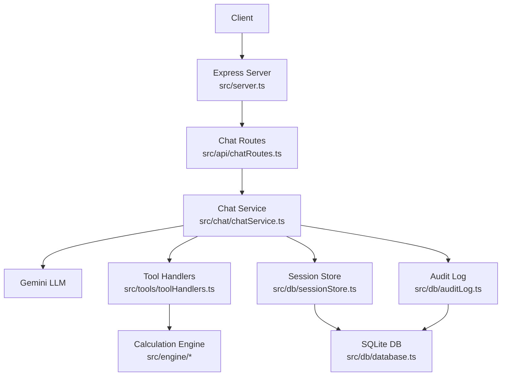
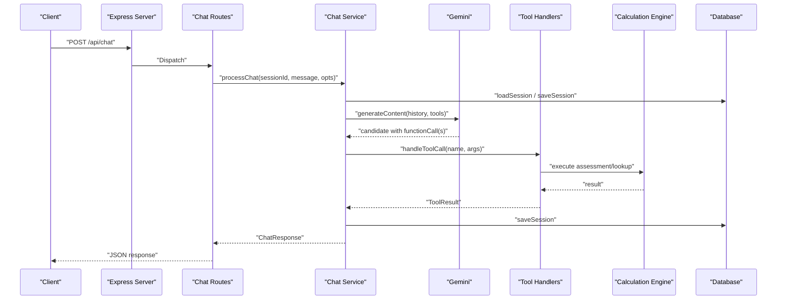
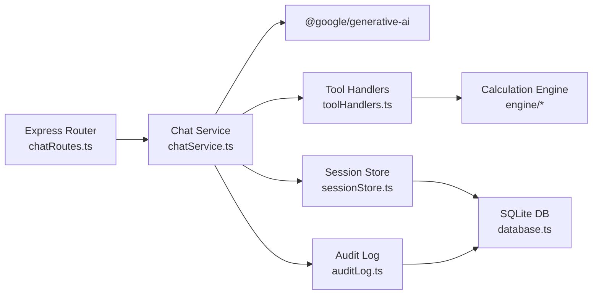

# API Reference

<cite>
**Referenced Files in This Document**
- [server.ts](file://src/server.ts)
- [chatRoutes.ts](file://src/api/chatRoutes.ts)
- [chatService.ts](file://src/chat/chatService.ts)
- [toolHandlers.ts](file://src/tools/toolHandlers.ts)
- [toolSchemas.ts](file://src/tools/toolSchemas.ts)
- [auditLog.ts](file://src/db/auditLog.ts)
- [sessionStore.ts](file://src/db/sessionStore.ts)
- [database.ts](file://src/db/database.ts)
- [systemPrompt.ts](file://src/chat/systemPrompt.ts)
- [README.md](file://README.md)
- [package.json](file://package.json)
</cite>

## Table of Contents
1. [Introduction](#introduction)
2. [Project Structure](#project-structure)
3. [Core Components](#core-components)
4. [Architecture Overview](#architecture-overview)
5. [Detailed Component Analysis](#detailed-component-analysis)
6. [Dependency Analysis](#dependency-analysis)
7. [Performance Considerations](#performance-considerations)
8. [Troubleshooting Guide](#troubleshooting-guide)
9. [Conclusion](#conclusion)
10. [Appendices](#appendices)

## Introduction
This document provides comprehensive API documentation for the GATIOD Chat Assistant RESTful APIs. It covers HTTP methods, URL patterns, request/response schemas, authentication, and error handling. It also documents the tool function definitions used by the system, including assessment and lookup tools, along with protocol-specific examples, rate limiting considerations, versioning information, common use cases, client implementation guidelines, performance optimization tips, debugging tools, monitoring approaches, and integration patterns with healthcare systems.

## Project Structure
The API surface is implemented as Express routes backed by a chat orchestration service and a set of tool handlers. Sessions are persisted in a SQLite database with audit logging for medico-legal traceability. The system integrates with the Gemini LLM to drive deterministic calculations through function calls.

**Diagram sources**
- [server.ts:1-68](file://src/server.ts#L1-L68)
- [chatRoutes.ts:12-91](file://src/api/chatRoutes.ts#L12-L91)
- [chatService.ts:38-183](file://src/chat/chatService.ts#L38-L183)
- [toolHandlers.ts:47-102](file://src/tools/toolHandlers.ts#L47-L102)
- [database.ts:11-57](file://src/db/database.ts#L11-L57)
- [auditLog.ts:58-90](file://src/db/auditLog.ts#L58-L90)
- [sessionStore.ts:21-110](file://src/db/sessionStore.ts#L21-L110)

**Section sources**
- [server.ts:1-68](file://src/server.ts#L1-L68)
- [README.md:26-31](file://README.md#L26-L31)

## Core Components
- Express server initializes CORS, JSON parsing, routes, health endpoint, and static frontend serving.
- Chat routes expose:
  - POST /api/chat — send a message to the assistant
  - POST /api/chat/reset — reset a session
  - GET /api/chat/audit/:sessionId — retrieve audit trail for a session
  - GET /api/chat/sessions/:userId — list sessions for a user
- Chat service orchestrates Gemini with function calling, manages retries, logs audit events, and persists sessions.
- Tool handlers implement the function schemas and call the calculation engine.
- Database layer provides SQLite-backed session storage and audit logging.

**Section sources**
- [server.ts:16-37](file://src/server.ts#L16-L37)
- [chatRoutes.ts:14-90](file://src/api/chatRoutes.ts#L14-L90)
- [chatService.ts:38-183](file://src/chat/chatService.ts#L38-L183)
- [toolHandlers.ts:47-435](file://src/tools/toolHandlers.ts#L47-L435)
- [database.ts:11-57](file://src/db/database.ts#L11-L57)

## Architecture Overview
The API follows a request-response flow:
- Clients POST messages to /api/chat with optional sessionId, userId, and claimId.
- The server validates inputs, loads or creates a session, logs audit events, and invokes the chat service.
- The chat service calls Gemini with function declarations and iteratively executes tool calls until a final text response is produced.
- Tool handlers validate and execute tool functions, returning structured results.
- Responses are persisted and returned to clients.

**Diagram sources**
- [chatRoutes.ts:14-41](file://src/api/chatRoutes.ts#L14-L41)
- [chatService.ts:38-154](file://src/chat/chatService.ts#L38-L154)
- [toolHandlers.ts:47-102](file://src/tools/toolHandlers.ts#L47-L102)
- [sessionStore.ts:21-44](file://src/db/sessionStore.ts#L21-L44)

## Detailed Component Analysis

### API Endpoints

#### POST /api/chat
- Purpose: Send a message to the assistant. Initiates or continues a session.
- Authentication: Not required in standalone mode; claimsDex integration expects platform authentication.
- Request body:
  - message: string (required)
  - sessionId: string (optional; auto-generated if omitted)
  - userId: string (optional; attached to audit events)
  - claimId: string (optional; attached to audit events)
- Response:
  - message: string
  - toolCalls: array of tool invocations (optional)
  - suggestedChips: array of quick actions (optional)
  - sessionId: string
- Errors:
  - 400 Bad Request: Missing message
  - 500 Internal Server Error: General errors; includes rate limit and availability hints
- Notes:
  - The system enforces a mandatory confirmation step before running assessments.
  - The response may include CHIPS suggestions appended in a specific format.

**Section sources**
- [chatRoutes.ts:14-41](file://src/api/chatRoutes.ts#L14-L41)
- [chatService.ts:38-154](file://src/chat/chatService.ts#L38-L154)
- [systemPrompt.ts:138-146](file://src/chat/systemPrompt.ts#L138-L146)

#### POST /api/chat/reset
- Purpose: Reset a session by clearing stored history.
- Request body:
  - sessionId: string (required)
- Response:
  - success: boolean
- Errors:
  - 200 OK even if sessionId is not found (no-op)

**Section sources**
- [chatRoutes.ts:68-74](file://src/api/chatRoutes.ts#L68-L74)
- [chatService.ts:179-182](file://src/chat/chatService.ts#L179-L182)

#### GET /health
- Purpose: Health check endpoint.
- Response:
  - status: string
  - service: string

**Section sources**
- [server.ts:25-28](file://src/server.ts#L25-L28)

#### GET /api/chat/audit/:sessionId
- Purpose: Retrieve the full audit trail for a session.
- Path parameters:
  - sessionId: string (required)
- Response:
  - sessionId: string
  - events: array of audit entries ordered chronologically

**Section sources**
- [chatRoutes.ts:77-81](file://src/api/chatRoutes.ts#L77-L81)
- [auditLog.ts:75-90](file://src/db/auditLog.ts#L75-L90)

#### GET /api/chat/sessions/:userId
- Purpose: List recent sessions for a user (supports session resume).
- Path parameters:
  - userId: string (required)
- Response:
  - userId: string
  - sessions: array of session summaries (id, claimId, status, createdAt, updatedAt)

**Section sources**
- [chatRoutes.ts:84-90](file://src/api/chatRoutes.ts#L84-L90)
- [sessionStore.ts:96-109](file://src/db/sessionStore.ts#L96-L109)

### Tool Function Definitions

The system exposes function tools to the LLM. The LLM never performs calculations; it extracts structured data and calls these tools.

#### Assessment Tools
- assess_upper_limb
  - Description: Full Upper Limb assessment combining amputations, ROM, neurological deficits, and DBE conditions via CVC.
  - Parameters: Structured input covering side, amputations, ROM, neurological, and DBE selections.
  - Output: Assessment result with systemKey and finalPercent.
- assess_lower_limb
  - Description: Full Lower Limb assessment including amputations, ROM, neurological, shortening, and DBE.
  - Parameters: Structured input covering side, amputations (leg and toes), ROM, neurological, shortening, and DBE.
  - Output: Assessment result with systemKey and finalPercent.
- assess_spine
  - Description: Spine assessment by region and category entries with severity and modifiers.
  - Parameters: Region and category entries with diagnosis, severity, and modifiers.
  - Output: Assessment result with systemKey and finalPercent.
- assess_respiratory
  - Description: Respiratory assessment using PFT values and diagnosis type.
  - Parameters: Diagnosis type and PFT metrics.
  - Output: Assessment result with systemKey and finalPercent.
- assess_renal
  - Description: Renal assessment using lab values, CKD stage, and clinical severity.
  - Parameters: Sex, lab values, CKD stage, and severity.
  - Output: Assessment result with systemKey and finalPercent.
- assess_gastro
  - Description: Gastro/Digestive assessment across sub-systems and brackets.
  - Parameters: Sub-system, sub-path, and bracket selection.
  - Output: Assessment result with systemKey and finalPercent.
- assess_hearing
  - Description: Hearing assessment using NID or injury pathways.
  - Parameters: Path type and per-ear findings.
  - Output: Assessment result with systemKey and finalPercent.
- assess_cns
  - Description: CNS assessment across Sections A, B, and C with CVC combination.
  - Parameters: Section A, B, and C findings plus paralysed limbs.
  - Output: Assessment result with systemKey and finalPercent.
- assess_visual
  - Description: Visual assessment per eye and binocular findings.
  - Parameters: Left and right eye findings, plus diplopia.
  - Output: Assessment result with systemKey and finalPercent.
- assess_global_cvc
  - Description: Combine multiple system subtotals into a global PI% using CVC.
  - Parameters: Array of system subtotals with system and piPercent.
  - Output: Global PI% and details.

#### Lookup Tools
- lookup_rom_table
  - Description: Look up PI% for a specific ROM measurement.
  - Parameters: joint, direction, angle, isAnkylosed, finger (optional).
  - Output: Joint, direction, angle, isAnkylosed, percent, normalRom.
- lookup_amputation_level
  - Description: Look up PI% for an amputation level and suppressed structures.
  - Parameters: type (arm or finger), level, finger (optional).
  - Output: Label, percent, suppressedStructures (arm only).
- lookup_nerve
  - Description: Look up maximum PI% for an upper limb nerve deficit.
  - Parameters: nerveKey, deficitType, lossType, severityId (optional).
  - Output: Nerve, group, deficitType, lossType, maxPercent, adjustedPercent.
- lookup_dbe_condition
  - Description: Look up DBE condition’s PI% range and applicable joints.
  - Parameters: conditionId.
  - Output: Exact match flag, id, label, category, minPercent, maxPercent, description, applicableJoints.
- search_dictionary
  - Description: Search the GATIOD dictionary for a term.
  - Parameters: query.
  - Output: Query, results (top matches), totalMatches.
- lookup_lower_amputation
  - Description: Look up PI% for lower limb amputation (leg or toe).
  - Parameters: type (leg or toe), level, toe (optional).
  - Output: Type, label, percent, disablesBelow (leg only).
- lookup_lower_nerve
  - Description: Look up maximum PI% for a lower limb nerve deficit.
  - Parameters: nerveKey, deficitType, lossType.
  - Output: Nerve, group, deficitType, lossType, maxPercent, adjustedPercent.
- lookup_shortening
  - Description: Look up PI% for measured limb length discrepancy (cm).
  - Parameters: discrepancyCm.
  - Output: discrepancyCm, percent, note clarifying distinction from amputation.
- lookup_lower_dbe_condition
  - Description: Look up lower limb DBE condition’s PI% and applicable anatomical keys.
  - Parameters: conditionId.
  - Output: Exact match flag, id, label, category, minPercent, maxPercent, description, applicableJoints.

**Section sources**
- [toolSchemas.ts:14-486](file://src/tools/toolSchemas.ts#L14-L486)
- [toolHandlers.ts:47-435](file://src/tools/toolHandlers.ts#L47-L435)

### Request/Response Schemas

- POST /api/chat
  - Request: { message: string, sessionId?: string, userId?: string, claimId?: string }
  - Response: { message: string, toolCalls?: Array<{ name: string, result: unknown }>, suggestedChips?: string[], sessionId: string }
- POST /api/chat/reset
  - Request: { sessionId: string }
  - Response: { success: boolean }
- GET /health
  - Response: { status: string, service: string }
- GET /api/chat/audit/:sessionId
  - Response: { sessionId: string, events: Array<{ eventType: string, eventData: Record<string, unknown>, createdAt: string }> }
- GET /api/chat/sessions/:userId
  - Response: { userId: string, sessions: Array<{ id: string, claimId: string, status: string, createdAt: string, updatedAt: string }> }

**Section sources**
- [chatRoutes.ts:14-90](file://src/api/chatRoutes.ts#L14-L90)
- [chatService.ts:19-24](file://src/chat/chatService.ts#L19-L24)
- [auditLog.ts:51-56](file://src/db/auditLog.ts#L51-L56)
- [sessionStore.ts:10-19](file://src/db/sessionStore.ts#L10-L19)

### Authentication Methods
- Standalone mode: No authentication enforced by the server.
- claimsDex integration: Authentication adapter interface is provided; integration would require replacing the standalone adapter with a platform-specific implementation.

**Section sources**
- [claimsDexAdapter.ts:1-37](file://src/integration/claimsDexAdapter.ts#L1-L37)
- [server.ts:42-43](file://src/server.ts#L42-L43)

### Error Handling Strategies
- Validation:
  - Missing message yields 400 Bad Request.
- LLM/API errors:
  - Rate limits and quota errors are surfaced with user-friendly messages and session preservation.
  - Availability errors (timeouts, connection refused) are handled similarly.
  - Safety flags return a message requesting rephrasing.
- Audit logging:
  - Every significant event is recorded for traceability, including tool calls, calculation results, and errors.

**Section sources**
- [chatRoutes.ts:20-40](file://src/api/chatRoutes.ts#L20-L40)
- [chatService.ts:82-96](file://src/chat/chatService.ts#L82-L96)
- [chatService.ts:102-105](file://src/chat/chatService.ts#L102-L105)
- [auditLog.ts:58-73](file://src/db/auditLog.ts#L58-L73)

### Rate Limiting Considerations
- The system surfaces rate-limit and quota errors from the LLM provider with user-friendly messages and preserves the session state.
- Clients should implement client-side retry/backoff and consider exponential backoff strategies when encountering transient failures.

**Section sources**
- [chatService.ts:89-95](file://src/chat/chatService.ts#L89-L95)

### Versioning Information
- The project declares a version in package metadata.
- The server logs API endpoints on startup for convenience.

**Section sources**
- [package.json:3](file://package.json#L3)
- [server.ts:45-55](file://src/server.ts#L45-L55)

### Common Use Cases
- Upper Limb PI% assessment with confirmation workflow.
- Multi-system assessments with global CVC combination.
- Lookup assistance for ROM, amputation, nerve, DBE, and dictionary terms.
- Session resume and audit trail retrieval for compliance.

**Section sources**
- [systemPrompt.ts:138-146](file://src/chat/systemPrompt.ts#L138-L146)
- [toolSchemas.ts:14-486](file://src/tools/toolSchemas.ts#L14-L486)

### Client Implementation Guidelines
- Always include sessionId to enable session continuity and auditability.
- Use userId and claimId when available to enrich audit trails.
- Implement retry logic for transient LLM errors and preserve session state.
- Respect CHIPS suggestions appended to responses for improved UX.

**Section sources**
- [chatService.ts:56-65](file://src/chat/chatService.ts#L56-L65)
- [systemPrompt.ts:368-390](file://src/chat/systemPrompt.ts#L368-L390)

### Performance Optimization Tips
- Minimize redundant tool calls by validating inputs with lookup tools first.
- Use global CVC after assessing multiple systems to reduce repeated computations.
- Persist sessions promptly to mitigate impact of transient failures.

**Section sources**
- [toolHandlers.ts:232-253](file://src/tools/toolHandlers.ts#L232-L253)
- [toolHandlers.ts:207-228](file://src/tools/toolHandlers.ts#L207-L228)

### Debugging Tools and Monitoring
- Audit trail endpoint enables inspection of all events for a session.
- Environment variables:
  - GATIOD_DEBUG_RESPONSES=true to receive full responses from v2 endpoints.
  - GATIOD_V2_SHADOW_MODE=false to disable shadow mode.
  - GEMINI_API_KEY must be set for chat to function.
- Database schema includes indexes for efficient querying.

**Section sources**
- [chatRoutes.ts:56-60](file://src/api/chatRoutes.ts#L56-L60)
- [server.ts:52-54](file://src/server.ts#L52-L54)
- [database.ts:20-46](file://src/db/database.ts#L20-L46)

### Integration Patterns with Healthcare Systems
- ClaimsDex adapter interface supports authentication and session persistence adapters for platform integration.
- Session and audit data align with medico-legal traceability requirements.

**Section sources**
- [claimsDexAdapter.ts:1-37](file://src/integration/claimsDexAdapter.ts#L1-L37)
- [auditLog.ts:8-49](file://src/db/auditLog.ts#L8-L49)

## Dependency Analysis
The API depends on Express for routing, Gemini for orchestration, and SQLite for persistence. Tool schemas define the contract between the LLM and the calculation engine.

**Diagram sources**
- [chatRoutes.ts:12-12](file://src/api/chatRoutes.ts#L12-L12)
- [chatService.ts:6-17](file://src/chat/chatService.ts#L6-L17)
- [toolHandlers.ts:6-37](file://src/tools/toolHandlers.ts#L6-L37)
- [sessionStore.ts:16-17](file://src/db/sessionStore.ts#L16-L17)
- [auditLog.ts:6-7](file://src/db/auditLog.ts#L6-L7)
- [database.ts:6-7](file://src/db/database.ts#L6-L7)

**Section sources**
- [chatRoutes.ts:12-12](file://src/api/chatRoutes.ts#L12-L12)
- [chatService.ts:6-17](file://src/chat/chatService.ts#L6-L17)
- [toolHandlers.ts:6-37](file://src/tools/toolHandlers.ts#L6-L37)
- [sessionStore.ts:16-17](file://src/db/sessionStore.ts#L16-L17)
- [auditLog.ts:6-7](file://src/db/auditLog.ts#L6-L7)
- [database.ts:6-7](file://src/db/database.ts#L6-L7)

## Performance Considerations
- Retry mechanism with exponential backoff reduces transient failure impact.
- Session persistence ensures continuity and reduces rework.
- Audit logging is non-blocking and does not crash the main flow.

**Section sources**
- [chatService.ts:156-172](file://src/chat/chatService.ts#L156-L172)
- [auditLog.ts:69-72](file://src/db/auditLog.ts#L69-L72)

## Troubleshooting Guide
- Health check fails: Verify port availability and environment configuration.
- Chat returns rate limit errors: Implement client-side retry/backoff and reduce request frequency.
- Missing GEMINI_API_KEY: Set the environment variable before starting the server.
- Session not found: Ensure sessionId is included in requests; use GET /api/chat/sessions/:userId to list sessions.

**Section sources**
- [server.ts:57-64](file://src/server.ts#L57-L64)
- [chatService.ts:89-95](file://src/chat/chatService.ts#L89-L95)
- [server.ts:52-54](file://src/server.ts#L52-L54)

## Conclusion
The GATIOD Chat Assistant provides a robust, auditable, and deterministic assessment pipeline integrated with Gemini. Its RESTful API supports essential chat operations, session management, and auditability, while the tool function definitions encapsulate complex calculations across nine body systems. Clients should implement resilient retry logic, leverage audit trails for compliance, and integrate authentication and persistence adapters for production deployments.

## Appendices

### Protocol-Specific Examples
- Basic chat request:
  - curl -X POST http://localhost:3001/api/chat -H "Content-Type: application/json" -d '{"message":"Left shoulder, flexion limited to 120 degrees, abduction to 90. Suprascapular nerve damage, combined, partial loss."}'
- Reset session:
  - curl -X POST http://localhost:3001/api/chat/reset -H "Content-Type: application/json" -d '{"sessionId":"<your-session-id>"}'
- Health check:
  - curl http://localhost:3001/health

**Section sources**
- [README.md:34-38](file://README.md#L34-L38)