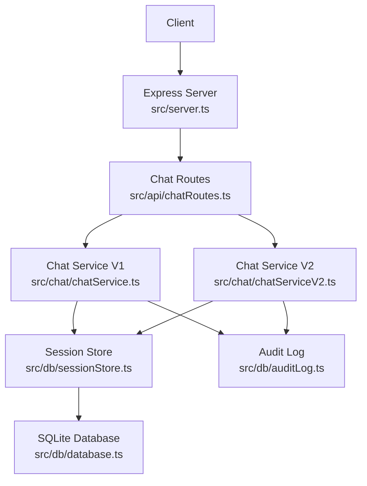
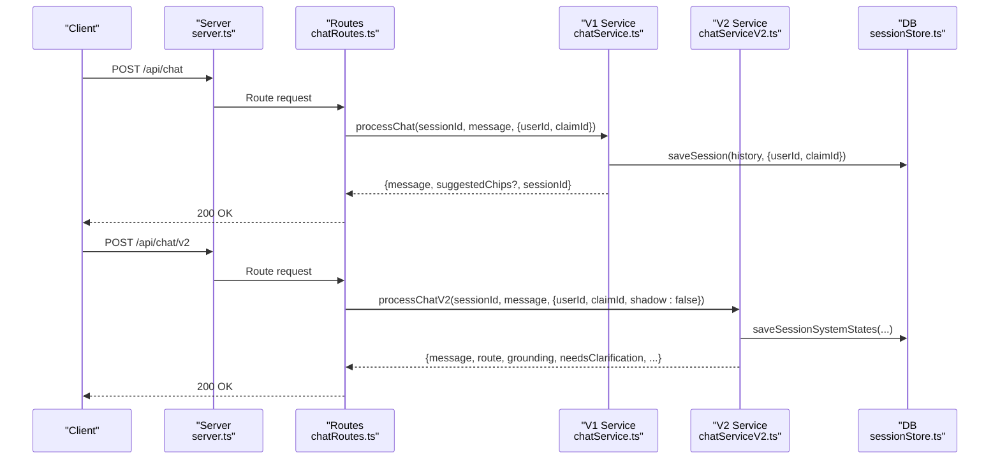
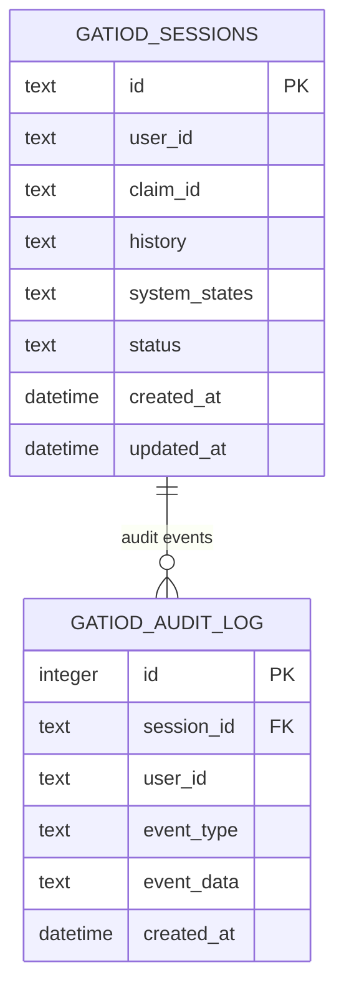
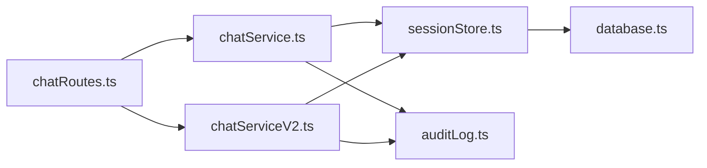

# Chat Endpoints

<cite>
**Referenced Files in This Document**
- [server.ts](file://src/server.ts)
- [chatRoutes.ts](file://src/api/chatRoutes.ts)
- [chatService.ts](file://src/chat/chatService.ts)
- [chatServiceV2.ts](file://src/chat/chatServiceV2.ts)
- [sessionStore.ts](file://src/db/sessionStore.ts)
- [auditLog.ts](file://src/db/auditLog.ts)
- [database.ts](file://src/db/database.ts)
- [contracts.ts](file://src/v2/contracts.ts)
- [README.md](file://README.md)
</cite>

## Table of Contents
1. [Introduction](#introduction)
2. [Project Structure](#project-structure)
3. [Core Components](#core-components)
4. [Architecture Overview](#architecture-overview)
5. [Detailed Component Analysis](#detailed-component-analysis)
6. [Dependency Analysis](#dependency-analysis)
7. [Performance Considerations](#performance-considerations)
8. [Troubleshooting Guide](#troubleshooting-guide)
9. [Conclusion](#conclusion)
10. [Appendices](#appendices)

## Introduction
This document provides comprehensive API documentation for the chat endpoints powering the GATIOD Chat Assistant. It covers:
- HTTP methods, URL patterns, request/response schemas, and authentication requirements
- Differences between V1 and V2 chat processing, including shadow mode functionality
- Request parameter specifications (message, sessionId, userId, claimId)
- Response formats, error handling strategies, and status codes
- Practical examples of typical chat interactions, session management patterns, and audit trail retrieval
- Rate limiting considerations, session persistence, and integration patterns with healthcare workflows

## Project Structure
The chat API is exposed under the /api base path and backed by a SQLite database for session persistence and audit logging. The V1 and V2 chat engines are implemented separately and orchestrated by the Express routes.

**Diagram sources**
- [server.ts:13-28](file://src/server.ts#L13-L28)
- [chatRoutes.ts:12-91](file://src/api/chatRoutes.ts#L12-L91)
- [chatService.ts:38-183](file://src/chat/chatService.ts#L38-L183)
- [chatServiceV2.ts:258-800](file://src/chat/chatServiceV2.ts#L258-L800)
- [sessionStore.ts:21-109](file://src/db/sessionStore.ts#L21-L109)
- [auditLog.ts:58-90](file://src/db/auditLog.ts#L58-L90)
- [database.ts:11-49](file://src/db/database.ts#L11-L49)

**Section sources**
- [server.ts:13-28](file://src/server.ts#L13-L28)
- [README.md:26-31](file://README.md#L26-L31)

## Core Components
- Express server initializes CORS, JSON parsing, routes, health check, and database schema.
- Chat routes expose:
  - POST /api/chat (V1)
  - POST /api/chat/v2 (V2)
  - POST /api/chat/reset
  - GET /health
  - GET /api/chat/audit/:sessionId
  - GET /api/chat/sessions/:userId
- Session persistence and audit logging are handled by dedicated modules.

**Section sources**
- [server.ts:16-28](file://src/server.ts#L16-L28)
- [chatRoutes.ts:14-91](file://src/api/chatRoutes.ts#L14-L91)
- [sessionStore.ts:21-109](file://src/db/sessionStore.ts#L21-L109)
- [auditLog.ts:58-90](file://src/db/auditLog.ts#L58-L90)

## Architecture Overview
The V1 and V2 chat engines differ in orchestration and output:
- V1: Gemini-based orchestration with function calling, CHIPS extraction, and deterministic tool execution.
- V2: Structured multi-system assessment with semantic consensus, extraction, policy decisions, and instance-aware state.

**Diagram sources**
- [server.ts:19-28](file://src/server.ts#L19-L28)
- [chatRoutes.ts:14-66](file://src/api/chatRoutes.ts#L14-L66)
- [chatService.ts:38-154](file://src/chat/chatService.ts#L38-L154)
- [chatServiceV2.ts:258-525](file://src/chat/chatServiceV2.ts#L258-L525)
- [sessionStore.ts:21-67](file://src/db/sessionStore.ts#L21-L67)

## Detailed Component Analysis

### Endpoint: POST /api/chat (V1)
- Method: POST
- URL: /api/chat
- Authentication: None (standalone mode)
- Request body:
  - message (required, string)
  - sessionId (optional, string; auto-generated if omitted)
  - userId (optional, string)
  - claimId (optional, string)
- Response:
  - message (string)
  - suggestedChips (optional, array of strings)
  - sessionId (string)
  - toolCalls (optional, array of { name, result })
- Behavior:
  - Validates message presence and type.
  - Loads or creates a session; logs audit events for session start and user message.
  - Persists session before calling Gemini to ensure resilience.
  - Calls Gemini with retries; handles safety, quota, and availability errors.
  - Extracts CHIPS from the model response; persists updated history.
  - Mirrors production traffic through V2 pipeline in shadow mode when enabled.
- Error handling:
  - 400 Bad Request for missing/invalid message.
  - 500 Internal Server Error for unexpected errors; includes user-friendly messages for rate-limiting and availability.
- Shadow mode:
  - When GATIOD_V2_SHADOW_MODE is not "false", invokes V2 with shadow=true and logs failures silently.

**Section sources**
- [chatRoutes.ts:14-41](file://src/api/chatRoutes.ts#L14-L41)
- [chatService.ts:38-154](file://src/chat/chatService.ts#L38-L154)
- [auditLog.ts:58-73](file://src/db/auditLog.ts#L58-L73)

### Endpoint: POST /api/chat/v2 (V2)
- Method: POST
- URL: /api/chat/v2
- Authentication: None (standalone mode)
- Request body:
  - message (required, string)
  - sessionId (optional, string; auto-generated if omitted)
  - userId (optional, string)
  - claimId (optional, string)
- Response (debug mode off):
  - sessionId (string)
  - message (string)
  - needsClarification (boolean)
  - clarificationQuestion (optional, string)
  - suggestedChips (optional, array of strings)
  - toolPlan (object with proposed/actual arrays)
  - shadowMode (boolean)
- Response (debug mode on):
  - Full V2 response object including route, grounding, policy, and shadowMode.
- Behavior:
  - Validates message presence and type.
  - Normalizes input, resolves pending observations, runs semantic consensus, routes, extracts facts, applies policy, and executes tools as needed.
  - Persists system states and audit events throughout the pipeline.
  - Supports shadow mode via shadow option.
- Error handling:
  - 400 Bad Request for missing/invalid message.
  - 500 Internal Server Error for unexpected errors.

**Section sources**
- [chatRoutes.ts:43-66](file://src/api/chatRoutes.ts#L43-L66)
- [chatServiceV2.ts:258-800](file://src/chat/chatServiceV2.ts#L258-L800)
- [contracts.ts:617-628](file://src/v2/contracts.ts#L617-L628)

### Endpoint: POST /api/chat/reset
- Method: POST
- URL: /api/chat/reset
- Authentication: None (standalone mode)
- Request body:
  - sessionId (required, string)
- Response:
  - { success: true }
- Behavior:
  - Clears the specified session and logs an audit event.

**Section sources**
- [chatRoutes.ts:68-74](file://src/api/chatRoutes.ts#L68-L74)
- [chatService.ts:179-182](file://src/chat/chatService.ts#L179-L182)
- [auditLog.ts:58-73](file://src/db/auditLog.ts#L58-L73)

### Endpoint: GET /health
- Method: GET
- URL: /health
- Authentication: None (standalone mode)
- Response:
  - { status: "ok", service: "gatiod-chat-assistant" }
- Behavior:
  - Basic health check endpoint.

**Section sources**
- [server.ts:25-28](file://src/server.ts#L25-L28)

### Endpoint: GET /api/chat/audit/:sessionId
- Method: GET
- URL: /api/chat/audit/:sessionId
- Authentication: None (standalone mode)
- Path parameters:
  - sessionId (required, string)
- Response:
  - { sessionId: string, events: [ { eventType: string, eventData: object, createdAt: string }, ... ] }
- Behavior:
  - Retrieves the full audit trail for a session ordered by creation time.

**Section sources**
- [chatRoutes.ts:76-81](file://src/api/chatRoutes.ts#L76-L81)
- [auditLog.ts:75-90](file://src/db/auditLog.ts#L75-L90)

### Endpoint: GET /api/chat/sessions/:userId
- Method: GET
- URL: /api/chat/sessions/:userId
- Authentication: None (standalone mode)
- Path parameters:
  - userId (required, string)
- Response:
  - { userId: string, sessions: [ { id: string, claimId: string|null, status: string, createdAt: string, updatedAt: string }, ... ] }
- Behavior:
  - Lists recent sessions for a user (limited to 50, newest first).

**Section sources**
- [chatRoutes.ts:83-90](file://src/api/chatRoutes.ts#L83-L90)
- [sessionStore.ts:96-109](file://src/db/sessionStore.ts#L96-L109)

### Differences Between V1 and V2 Chat Processing
- Orchestration:
  - V1: Gemini with function calling; deterministic tool execution; CHIPS extraction.
  - V2: Structured multi-system assessment with semantic consensus, extraction, policy decisions, and instance-aware state.
- Output:
  - V1: Simplified message and optional suggestedChips; toolCalls logged.
  - V2: Rich structured response with route, grounding, policy, toolPlan, and shadowMode; supports shadow mode.
- Persistence:
  - V1: Persists history and system states.
  - V2: Persists system states and maintains detailed session state for multi-system workflows.
- Audit:
  - V1: Logs session lifecycle and tool calls.
  - V2: Extensive audit events covering normalization, routing, policy, tool plans, and semantic consensus.

**Section sources**
- [chatService.ts:38-154](file://src/chat/chatService.ts#L38-L154)
- [chatServiceV2.ts:258-800](file://src/chat/chatServiceV2.ts#L258-L800)
- [auditLog.ts:8-49](file://src/db/auditLog.ts#L8-L49)

### Shadow Mode Functionality
- V1 shadow mode:
  - When GATIOD_V2_SHADOW_MODE is not "false", V1 invokes V2 with shadow=true for evaluation without altering the V1 response.
  - Failures are logged with a warning and do not affect the V1 response.
- V2 shadow mode:
  - Explicitly controlled via the shadow option; used to evaluate V2 behavior against production-like traffic.

**Section sources**
- [chatRoutes.ts:28-33](file://src/api/chatRoutes.ts#L28-L33)
- [chatServiceV2.ts:263-263](file://src/chat/chatServiceV2.ts#L263-L263)

### Request Parameter Specifications
- message (required for V1/V2 chat endpoints)
  - Type: string
  - Description: Natural language clinical statement to process.
- sessionId (optional)
  - Type: string
  - Description: Unique identifier for the session. Auto-generated if omitted.
- userId (optional)
  - Type: string
  - Description: Identifier for the user; stored with the session.
- claimId (optional)
  - Type: string
  - Description: Identifier for the claim associated with the session; stored with the session.

**Section sources**
- [chatRoutes.ts:16-18](file://src/api/chatRoutes.ts#L16-L18)
- [chatRoutes.ts:45-47](file://src/api/chatRoutes.ts#L45-L47)
- [sessionStore.ts:10-19](file://src/db/sessionStore.ts#L10-L19)

### Response Formats
- V1 response:
  - message: string
  - suggestedChips: string[] (optional)
  - sessionId: string
  - toolCalls: array of { name: string, result: unknown } (optional)
- V2 response (debug mode off):
  - sessionId: string
  - message: string
  - needsClarification: boolean
  - clarificationQuestion: string (optional)
  - suggestedChips: string[] (optional)
  - toolPlan: { proposed: array, actual: array }
  - shadowMode: boolean
- V2 response (debug mode on):
  - Full V2 response object including route, grounding, policy, and shadowMode.

**Section sources**
- [chatService.ts:19-24](file://src/chat/chatService.ts#L19-L24)
- [chatServiceV2.ts:617-628](file://src/chat/chatServiceV2.ts#L617-L628)
- [contracts.ts:617-628](file://src/v2/contracts.ts#L617-L628)

### Error Handling Strategies and Status Codes
- Validation errors:
  - 400 Bad Request: Missing or invalid message.
- Runtime errors:
  - 500 Internal Server Error: Unexpected errors; includes user-friendly messages for rate-limiting and availability.
- Availability-specific messages:
  - V1 surfaces rate-limiting and availability errors with guidance to retry.

**Section sources**
- [chatRoutes.ts:19-23](file://src/api/chatRoutes.ts#L19-L23)
- [chatRoutes.ts:49-52](file://src/api/chatRoutes.ts#L49-L52)
- [chatService.ts:89-95](file://src/chat/chatService.ts#L89-L95)

### Practical Examples
- Typical V1 chat interaction:
  - Send a message; receive a response with optional CHIPS suggestions and toolCalls.
- Session management:
  - Resume a session by providing sessionId; reset a session with POST /api/chat/reset.
- Audit retrieval:
  - Retrieve the audit trail for a session using GET /api/chat/audit/:sessionId.
- V2 structured workflow:
  - Multi-system assessment with semantic consensus, extraction, and policy-driven tool planning.

**Section sources**
- [README.md:32-38](file://README.md#L32-L38)
- [chatRoutes.ts:76-90](file://src/api/chatRoutes.ts#L76-L90)

### Rate Limiting Considerations
- V1 chat:
  - Detects quota and rate-limit errors from Gemini and returns user-friendly messages advising retry.
- V2 chat:
  - No explicit rate-limit handling in the documented code paths; rely on upstream service behavior.

**Section sources**
- [chatService.ts:89-95](file://src/chat/chatService.ts#L89-L95)

### Session Persistence and Database Schema
- Sessions are stored in SQLite with JSON columns for history and system states.
- Indexes on user_id, claim_id, and status improve query performance.
- Audit logs are stored separately with indexes for efficient retrieval.

**Diagram sources**
- [database.ts:21-46](file://src/db/database.ts#L21-L46)

**Section sources**
- [sessionStore.ts:21-109](file://src/db/sessionStore.ts#L21-L109)
- [auditLog.ts:75-90](file://src/db/auditLog.ts#L75-L90)
- [database.ts:21-46](file://src/db/database.ts#L21-L46)

### Integration Patterns with Healthcare Workflows
- Claims context:
  - claimId can be associated with sessions to track assessments per claim.
- Structured multi-system assessment:
  - V2 enables structured extraction and policy-driven decisions across multiple body systems.
- Auditability:
  - Comprehensive audit logs enable medico-legal traceability of every assessment step.

**Section sources**
- [sessionStore.ts:10-19](file://src/db/sessionStore.ts#L10-L19)
- [auditLog.ts:8-49](file://src/db/auditLog.ts#L8-L49)
- [chatServiceV2.ts:278-287](file://src/chat/chatServiceV2.ts#L278-L287)

## Dependency Analysis

**Diagram sources**
- [chatRoutes.ts:7-10](file://src/api/chatRoutes.ts#L7-L10)
- [chatService.ts:16-17](file://src/chat/chatService.ts#L16-L17)
- [chatServiceV2.ts:2-4](file://src/chat/chatServiceV2.ts#L2-L4)
- [sessionStore.ts:7-8](file://src/db/sessionStore.ts#L7-L8)
- [auditLog.ts:6-6](file://src/db/auditLog.ts#L6-L6)
- [database.ts:11-11](file://src/db/database.ts#L11-L11)

**Section sources**
- [chatRoutes.ts:7-10](file://src/api/chatRoutes.ts#L7-L10)
- [chatService.ts:16-17](file://src/chat/chatService.ts#L16-L17)
- [chatServiceV2.ts:2-4](file://src/chat/chatServiceV2.ts#L2-L4)

## Performance Considerations
- Retry logic:
  - V1 Gemini calls include retries with exponential backoff to mitigate transient failures.
- Database I/O:
  - Session persistence occurs before external API calls to ensure resilience; consider batching writes for high-throughput scenarios.
- Shadow mode:
  - V1 shadow invocations are fire-and-forget; ensure appropriate monitoring for evaluation traffic.

**Section sources**
- [chatService.ts:156-172](file://src/chat/chatService.ts#L156-L172)
- [chatRoutes.ts:28-33](file://src/api/chatRoutes.ts#L28-L33)

## Troubleshooting Guide
- Missing GEMINI_API_KEY:
  - The server warns if the environment variable is not set; chat will fail until configured.
- Health check:
  - Use GET /health to verify service availability.
- Audit trails:
  - Use GET /api/chat/audit/:sessionId to diagnose issues and trace assessment steps.
- Session reset:
  - Use POST /api/chat/reset to clear problematic sessions.

**Section sources**
- [server.ts:52-54](file://src/server.ts#L52-L54)
- [chatRoutes.ts:76-81](file://src/api/chatRoutes.ts#L76-L81)
- [chatRoutes.ts:68-74](file://src/api/chatRoutes.ts#L68-L74)

## Conclusion
The chat endpoints provide robust, auditable, and extensible conversational interfaces for healthcare assessments. V1 offers a streamlined Gemini-based chat, while V2 introduces structured multi-system workflows with semantic consensus and detailed policy-driven orchestration. Session persistence and comprehensive audit logging support compliance and reliability. Shadow mode enables safe evaluation of V2 against production traffic.

## Appendices
- Environment variables:
  - GEMINI_API_KEY: Required for V1 chat.
  - GATIOD_V2_SHADOW_MODE: Controls V1 shadow mode behavior.
  - GATIOD_DEBUG_RESPONSES: Enables V2 debug response mode.
  - GATIOD_CHAT_ENABLED: Feature flag to disable V1 chat.
  - GATIOD_DB_PATH: SQLite database path.
- Ports and base path:
  - Default port: 3001
  - Base path: /api

**Section sources**
- [server.ts:14-14](file://src/server.ts#L14-L14)
- [chatRoutes.ts:29-29](file://src/api/chatRoutes.ts#L29-L29)
- [chatRoutes.ts:56-56](file://src/api/chatRoutes.ts#L56-L56)
- [chatService.ts:47-49](file://src/chat/chatService.ts#L47-L49)
- [database.ts:14-14](file://src/db/database.ts#L14-L14)