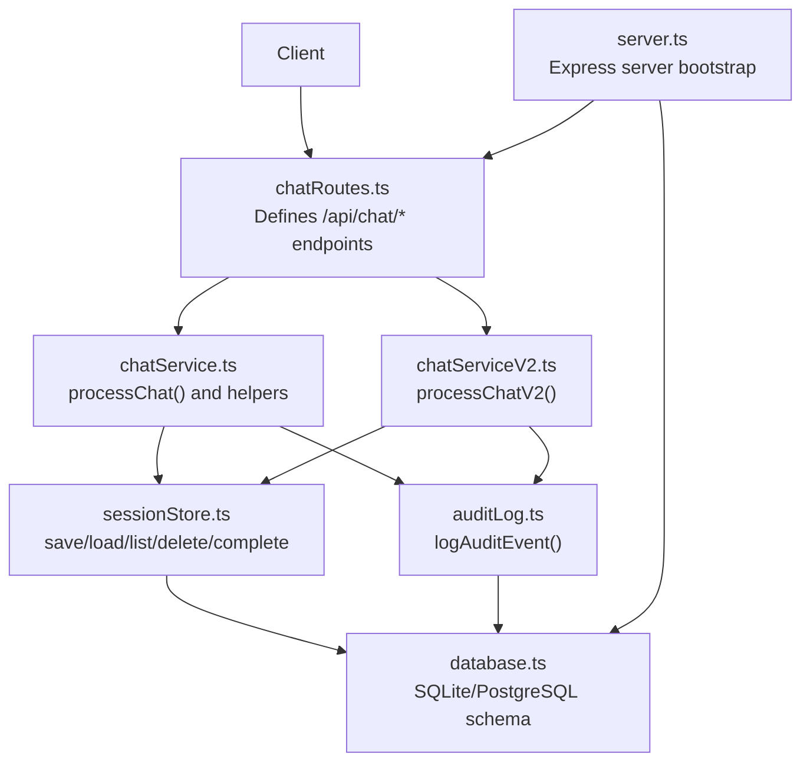
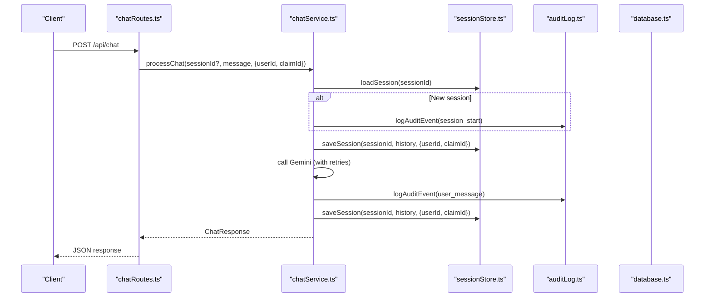
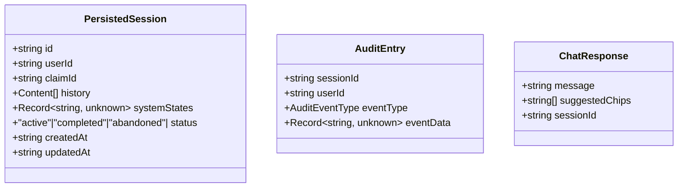
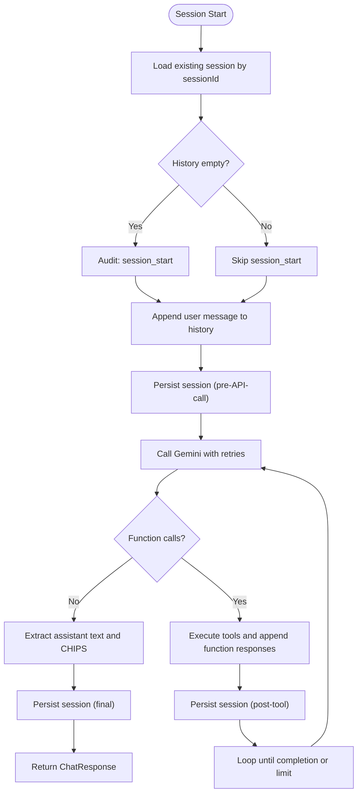
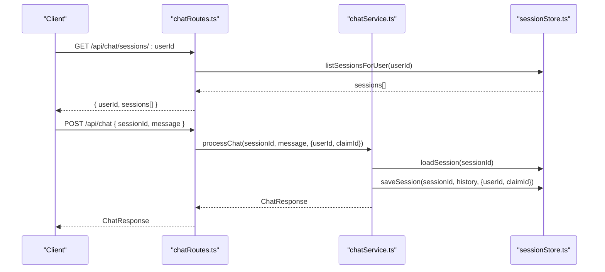
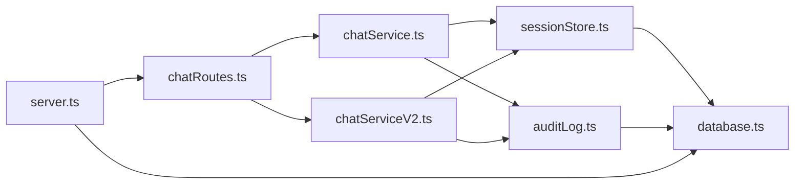

# Session Management

<cite>
**Referenced Files in This Document**
- [chatRoutes.ts](file://src/api/chatRoutes.ts)
- [chatService.ts](file://src/chat/chatService.ts)
- [chatServiceV2.ts](file://src/chat/chatServiceV2.ts)
- [sessionStore.ts](file://src/db/sessionStore.ts)
- [auditLog.ts](file://src/db/auditLog.ts)
- [database.ts](file://src/db/database.ts)
- [server.ts](file://src/server.ts)
</cite>

## Table of Contents
1. [Introduction](#introduction)
2. [Project Structure](#project-structure)
3. [Core Components](#core-components)
4. [Architecture Overview](#architecture-overview)
5. [Detailed Component Analysis](#detailed-component-analysis)
6. [Dependency Analysis](#dependency-analysis)
7. [Performance Considerations](#performance-considerations)
8. [Troubleshooting Guide](#troubleshooting-guide)
9. [Conclusion](#conclusion)
10. [Appendices](#appendices)

## Introduction
This document provides comprehensive API documentation for session management endpoints and operations, focusing on:
- Listing user sessions via GET /api/chat/sessions/:userId
- Clearing sessions via POST /api/chat/reset
- Underlying session persistence and lifecycle management
- Audit trail generation and medico-legal traceability
- Session resume workflows, session data structures, and security considerations
- Guidance on debugging, monitoring, and troubleshooting

## Project Structure
The session management functionality spans routing, service orchestration, persistence, and audit logging layers:
- API routes define the HTTP endpoints and parameter binding
- Chat services orchestrate session creation, updates, and completion
- Session store persists sessions to a relational database with JSON columns
- Audit log records every significant event for traceability
- Server initializes the database and exposes the API

**Diagram sources**
- [chatRoutes.ts:1-91](file://src/api/chatRoutes.ts#L1-L91)
- [chatService.ts:1-183](file://src/chat/chatService.ts#L1-L183)
- [chatServiceV2.ts:1-1041](file://src/chat/chatServiceV2.ts#L1-L1041)
- [sessionStore.ts:1-110](file://src/db/sessionStore.ts#L1-L110)
- [auditLog.ts:1-91](file://src/db/auditLog.ts#L1-L91)
- [database.ts:1-57](file://src/db/database.ts#L1-L57)
- [server.ts:1-68](file://src/server.ts#L1-L68)

**Section sources**
- [chatRoutes.ts:1-91](file://src/api/chatRoutes.ts#L1-L91)
- [server.ts:1-68](file://src/server.ts#L1-L68)

## Core Components
- API Routes
  - GET /api/chat/sessions/:userId returns recent sessions for a user
  - POST /api/chat/reset clears a session by marking it abandoned
  - GET /api/chat/audit/:sessionId returns the full audit trail for traceability
- Session Persistence
  - Save, load, list, abandon, and complete sessions
  - JSON serialization for history and system states
- Audit Logging
  - Comprehensive event types covering session lifecycle, tool calls, confirmations, calculations, and policy decisions
- Chat Services
  - processChat orchestrates Gemini calls, tool execution, and session persistence
  - processChatV2 adds structured multi-system workflows, confirmations, and global CVC

**Section sources**
- [chatRoutes.ts:68-91](file://src/api/chatRoutes.ts#L68-L91)
- [sessionStore.ts:21-110](file://src/db/sessionStore.ts#L21-L110)
- [auditLog.ts:8-91](file://src/db/auditLog.ts#L8-L91)
- [chatService.ts:38-183](file://src/chat/chatService.ts#L38-L183)
- [chatServiceV2.ts:258-1041](file://src/chat/chatServiceV2.ts#L258-L1041)

## Architecture Overview
The session lifecycle integrates HTTP endpoints, service orchestration, persistence, and auditing:
- On first message, a session is created with status active
- Each interaction persists the updated history and system states
- Tool calls and policy decisions are audited
- Sessions can be abandoned or completed
- Audit trails support medico-legal traceability

**Diagram sources**
- [chatRoutes.ts:14-41](file://src/api/chatRoutes.ts#L14-L41)
- [chatService.ts:38-154](file://src/chat/chatService.ts#L38-L154)
- [sessionStore.ts:21-44](file://src/db/sessionStore.ts#L21-L44)
- [auditLog.ts:58-73](file://src/db/auditLog.ts#L58-L73)
- [database.ts:20-46](file://src/db/database.ts#L20-L46)

## Detailed Component Analysis

### API Endpoints

#### GET /api/chat/sessions/:userId
- Purpose: Enumerate a user’s recent sessions to support session resume
- Behavior:
  - Loads up to 50 most recently updated sessions for the given user
  - Returns minimal session metadata: id, claimId, status, createdAt, updatedAt
- Response shape:
  - { userId: string, sessions: Array<{ id: string, claimId: string|null, status: "active"|"completed"|"abandoned", createdAt: string, updatedAt: string }> }
- Notes:
  - Sorting by updated_at desc ensures latest sessions appear first
  - Status field enables UI to distinguish active vs completed vs abandoned

**Section sources**
- [chatRoutes.ts:83-90](file://src/api/chatRoutes.ts#L83-L90)
- [sessionStore.ts:96-109](file://src/db/sessionStore.ts#L96-L109)

#### POST /api/chat/reset
- Purpose: Clear a session for a user to start fresh
- Behavior:
  - Accepts { sessionId: string }
  - Marks the session as abandoned in the database
  - Returns { success: true }
- Notes:
  - Abandoning a session preserves history for audit while signaling it is not active
  - Use this endpoint to reset a session before a new assessment

**Section sources**
- [chatRoutes.ts:68-74](file://src/api/chatRoutes.ts#L68-L74)
- [chatService.ts:179-182](file://src/chat/chatService.ts#L179-L182)
- [sessionStore.ts:86-89](file://src/db/sessionStore.ts#L86-L89)

#### GET /api/chat/audit/:sessionId
- Purpose: Retrieve the full audit trail for a session for medico-legal traceability
- Behavior:
  - Returns { sessionId: string, events: Array<{ eventType: string, eventData: Record<string,unknown>, createdAt: string }> }
- Notes:
  - Events are ordered chronologically ascending by created_at
  - Use this endpoint to reconstruct the decision flow and tool interactions

**Section sources**
- [chatRoutes.ts:76-81](file://src/api/chatRoutes.ts#L76-L81)
- [auditLog.ts:75-90](file://src/db/auditLog.ts#L75-L90)

### Session Data Structures

**Diagram sources**
- [sessionStore.ts:10-19](file://src/db/sessionStore.ts#L10-L19)
- [auditLog.ts:51-56](file://src/db/auditLog.ts#L51-L56)
- [chatService.ts:19-24](file://src/chat/chatService.ts#L19-L24)

**Section sources**
- [sessionStore.ts:10-19](file://src/db/sessionStore.ts#L10-L19)
- [auditLog.ts:51-56](file://src/db/auditLog.ts#L51-L56)
- [chatService.ts:19-24](file://src/chat/chatService.ts#L19-L24)

### Session Lifecycle Management

**Diagram sources**
- [chatService.ts:38-154](file://src/chat/chatService.ts#L38-L154)
- [sessionStore.ts:21-44](file://src/db/sessionStore.ts#L21-L44)
- [auditLog.ts:58-73](file://src/db/auditLog.ts#L58-L73)

**Section sources**
- [chatService.ts:38-154](file://src/chat/chatService.ts#L38-L154)
- [sessionStore.ts:21-44](file://src/db/sessionStore.ts#L21-L44)
- [auditLog.ts:58-73](file://src/db/auditLog.ts#L58-L73)

### Session Resume Workflow
- Client calls GET /api/chat/sessions/:userId to fetch recent sessions
- Client selects a session id to resume
- Client sends POST /api/chat with sessionId set to the chosen id
- The service loads the session, appends the new message, and continues the assessment flow
- The session remains active and can be resumed until abandoned or completed

**Diagram sources**
- [chatRoutes.ts:83-90](file://src/api/chatRoutes.ts#L83-L90)
- [chatRoutes.ts:14-41](file://src/api/chatRoutes.ts#L14-L41)
- [chatService.ts:38-127](file://src/chat/chatService.ts#L38-L127)
- [sessionStore.ts:96-109](file://src/db/sessionStore.ts#L96-L109)
- [sessionStore.ts:21-44](file://src/db/sessionStore.ts#L21-L44)

**Section sources**
- [chatRoutes.ts:83-90](file://src/api/chatRoutes.ts#L83-L90)
- [chatRoutes.ts:14-41](file://src/api/chatRoutes.ts#L14-L41)
- [chatService.ts:38-127](file://src/chat/chatService.ts#L38-L127)
- [sessionStore.ts:96-109](file://src/db/sessionStore.ts#L96-L109)
- [sessionStore.ts:21-44](file://src/db/sessionStore.ts#L21-L44)

### Audit Trail Generation and Medico-Legal Traceability
- Every major action is logged with a structured event:
  - session_start, user_message, assistant_message, tool_call, calculation_result
  - confirmation_presented, confirmation_accepted, correction
  - policy decisions, tool plan execution, semantic interpretation events
  - session_reset, error, and shadow-mode events
- Audit entries include:
  - sessionId, userId (optional), eventType, and structured eventData
  - createdAt for chronological ordering
- Retrieval:
  - GET /api/chat/audit/:sessionId returns ordered events for traceability

**Section sources**
- [auditLog.ts:8-91](file://src/db/auditLog.ts#L8-L91)
- [chatService.ts:56-120](file://src/chat/chatService.ts#L56-L120)
- [chatServiceV2.ts:278-500](file://src/chat/chatServiceV2.ts#L278-L500)

### Security Considerations and Session Isolation
- Session isolation:
  - Sessions are keyed by sessionId; clients must manage and protect their session identifiers
  - Listing is filtered by userId to prevent cross-user enumeration
- Data retention:
  - Sessions persist in the database; consider implementing a separate cleanup job for abandoned/completed sessions if needed
- Audit integrity:
  - Audit logging is resilient and does not crash the main flow
- API exposure:
  - Ensure CORS and authentication are enforced at the gateway/proxy level if applicable
  - Environment variables (e.g., GEMINI_API_KEY) must be configured securely

**Section sources**
- [chatRoutes.ts:83-90](file://src/api/chatRoutes.ts#L83-L90)
- [auditLog.ts:69-73](file://src/db/auditLog.ts#L69-L73)
- [server.ts:52-54](file://src/server.ts#L52-L54)

### Compliance and Data Retention Policies
- Medico-legal traceability:
  - Full audit trail is maintained for every session
  - Events capture tool calls, confirmations, and policy decisions
- Data minimization:
  - Only necessary fields are persisted; sensitive content is not stored beyond the session history
- Retention:
  - Define and enforce retention windows for sessions and audit logs
  - Consider anonymization or deletion policies aligned with organizational and regulatory requirements

[No sources needed since this section provides general guidance]

### Integration with External Systems
- Gemini AI integration:
  - Gemini API key is required; errors are surfaced with guidance to retry
- Tool integrations:
  - Tool calls are executed and audited; results are appended to session history
- Shadow mode:
  - Optional v2 pipeline evaluation mirrors production traffic for quality assurance

**Section sources**
- [chatService.ts:43-49](file://src/chat/chatService.ts#L43-L49)
- [chatService.ts:134-149](file://src/chat/chatService.ts#L134-L149)
- [chatRoutes.ts:29-33](file://src/api/chatRoutes.ts#L29-L33)

## Dependency Analysis

**Diagram sources**
- [chatRoutes.ts:1-12](file://src/api/chatRoutes.ts#L1-L12)
- [chatService.ts:16-17](file://src/chat/chatService.ts#L16-L17)
- [chatServiceV2.ts:1-6](file://src/chat/chatServiceV2.ts#L1-L6)
- [sessionStore.ts:8](file://src/db/sessionStore.ts#L8)
- [auditLog.ts:6](file://src/db/auditLog.ts#L6)
- [database.ts:6](file://src/db/database.ts#L6)
- [server.ts:10-11](file://src/server.ts#L10-L11)

**Section sources**
- [chatRoutes.ts:1-12](file://src/api/chatRoutes.ts#L1-L12)
- [chatService.ts:16-17](file://src/chat/chatService.ts#L16-L17)
- [chatServiceV2.ts:1-6](file://src/chat/chatServiceV2.ts#L1-L6)
- [sessionStore.ts:8](file://src/db/sessionStore.ts#L8)
- [auditLog.ts:6](file://src/db/auditLog.ts#L6)
- [database.ts:6](file://src/db/database.ts#L6)
- [server.ts:10-11](file://src/server.ts#L10-L11)

## Performance Considerations
- Database throughput:
  - WAL mode and busy timeouts improve concurrency; ensure appropriate connection pooling
- Retry strategy:
  - Gemini calls include exponential backoff; adjust MAX_RETRIES and delays as needed
- Payload sizes:
  - History grows with conversation length; consider periodic pruning or summarization for long sessions
- Indexing:
  - Existing indexes on user_id, claim_id, status, and audit timestamps support efficient queries

[No sources needed since this section provides general guidance]

## Troubleshooting Guide
- Symptoms: Rate limit or quota exceeded
  - Cause: Gemini API throttling
  - Action: Wait and retry; the service saves the session and returns a user-friendly message
- Symptoms: AI service temporarily unavailable
  - Cause: Network/API errors
  - Action: Retry shortly; session is preserved
- Symptoms: Session not found or empty
  - Cause: Invalid or missing sessionId
  - Action: Generate a new sessionId or use GET /api/chat/sessions/:userId to select a valid session
- Symptoms: Audit trail missing events
  - Cause: Audit logging errors are suppressed to avoid crashing the main flow
  - Action: Check server logs for "[Audit] Failed to log event" and address DB connectivity
- Symptoms: Session stuck in pending confirmation
  - Cause: Doctor’s reply did not match expected confirmation pattern
  - Action: Use the suggested chips or resend a clarification; the system will guide the next steps

**Section sources**
- [chatService.ts:84-96](file://src/chat/chatService.ts#L84-L96)
- [auditLog.ts:69-73](file://src/db/auditLog.ts#L69-L73)
- [chatServiceV2.ts:745-800](file://src/chat/chatServiceV2.ts#L745-L800)

## Conclusion
The session management subsystem provides robust, auditable, and resilient chat session handling:
- HTTP endpoints enable session enumeration and reset
- Database-backed persistence supports session resume across restarts
- Comprehensive audit logging ensures medico-legal traceability
- Clear separation of concerns across routes, services, persistence, and auditing

[No sources needed since this section summarizes without analyzing specific files]

## Appendices

### API Reference Summary

- GET /api/chat/sessions/:userId
  - Description: List recent sessions for a user
  - Path parameters: userId (string)
  - Response: { userId: string, sessions: [ { id, claimId, status, createdAt, updatedAt } ] }

- POST /api/chat/reset
  - Description: Reset a session by abandoning it
  - Request body: { sessionId: string }
  - Response: { success: true }

- GET /api/chat/audit/:sessionId
  - Description: Retrieve full audit trail for a session
  - Path parameters: sessionId (string)
  - Response: { sessionId: string, events: [ { eventType, eventData, createdAt } ] }

**Section sources**
- [chatRoutes.ts:83-90](file://src/api/chatRoutes.ts#L83-L90)
- [chatRoutes.ts:68-74](file://src/api/chatRoutes.ts#L68-L74)
- [chatRoutes.ts:76-81](file://src/api/chatRoutes.ts#L76-L81)