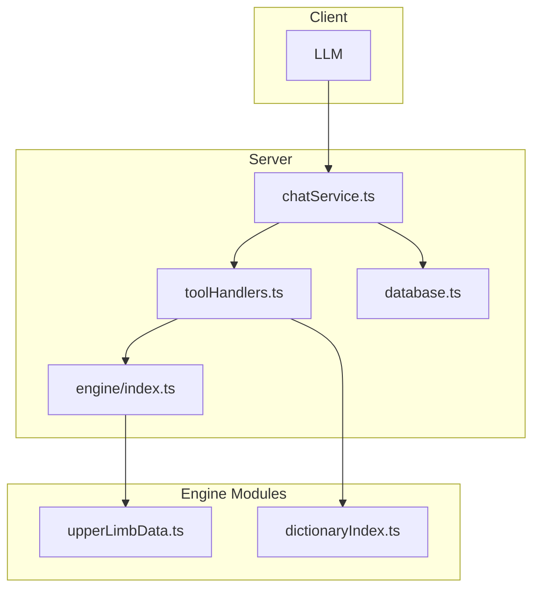
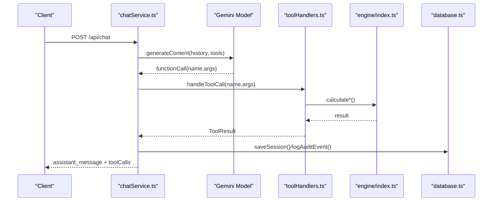
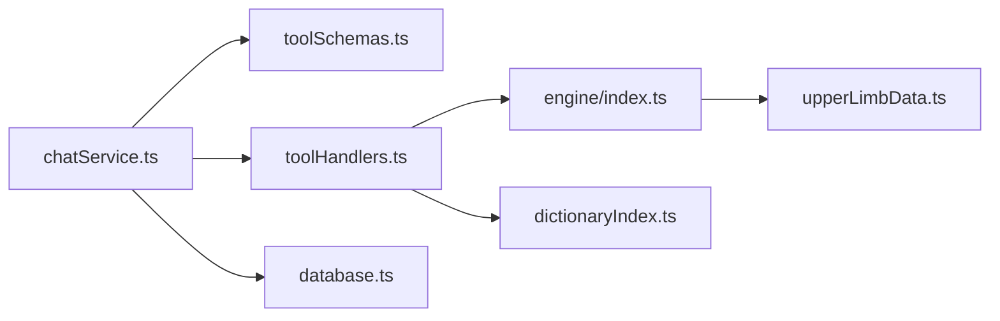

# Tool Functions

<cite>
**Referenced Files in This Document**
- [toolSchemas.ts](file://src/tools/toolSchemas.ts)
- [toolHandlers.ts](file://src/tools/toolHandlers.ts)
- [chatService.ts](file://src/chat/chatService.ts)
- [server.ts](file://src/server.ts)
- [engine/index.ts](file://src/engine/index.ts)
- [upperLimbData.ts](file://src/engine/upperLimbData.ts)
- [dictionaryIndex.ts](file://src/rag/dictionaryIndex.ts)
- [database.ts](file://src/db/database.ts)
- [upperLimb.test.ts](file://tests/engine/upperLimb.test.ts)
</cite>

## Table of Contents
1. [Introduction](#introduction)
2. [Project Structure](#project-structure)
3. [Core Components](#core-components)
4. [Architecture Overview](#architecture-overview)
5. [Detailed Component Analysis](#detailed-component-analysis)
6. [Dependency Analysis](#dependency-analysis)
7. [Performance Considerations](#performance-considerations)
8. [Troubleshooting Guide](#troubleshooting-guide)
9. [Conclusion](#conclusion)

## Introduction
This document describes the Gemini tool functions that power the calculation engine. It covers the function schemas, handler implementations, and integration with the database and RAG layers. It specifies signatures, input parameters, expected data formats, return value schemas, error conditions, validation rules, and examples of function calls from the LLM. It also documents the tool registration process, function calling patterns, and performance considerations.

## Project Structure
The tool system is organized around:
- Tool schemas that declare Gemini function interfaces
- Tool handlers that translate Gemini calls into engine calculations
- The calculation engine that performs assessments
- Session and audit logging integrated with the database
- A dictionary search utility for clinical term lookups

**Diagram sources**
- [chatService.ts:68-72](file://src/chat/chatService.ts#L68-L72)
- [toolHandlers.ts:47-102](file://src/tools/toolHandlers.ts#L47-L102)
- [engine/index.ts:16-89](file://src/engine/index.ts#L16-L89)
- [upperLimbData.ts:1-200](file://src/engine/upperLimbData.ts#L1-L200)
- [dictionaryIndex.ts:59-75](file://src/rag/dictionaryIndex.ts#L59-L75)
- [database.ts:9-49](file://src/db/database.ts#L9-L49)

**Section sources**
- [toolSchemas.ts:14-217](file://src/tools/toolSchemas.ts#L14-L217)
- [toolHandlers.ts:47-102](file://src/tools/toolHandlers.ts#L47-L102)
- [chatService.ts:68-72](file://src/chat/chatService.ts#L68-L72)
- [engine/index.ts:16-89](file://src/engine/index.ts#L16-L89)

## Core Components
- Tool schemas: Define the Gemini function declarations and parameter schemas for all tools, including assessment tools and lookup tools.
- Tool handlers: Route Gemini function calls to engine functions, normalize inputs, and format outputs.
- Calculation engine: Pure functions that compute PI% for each system and aggregate with CVC.
- Session and audit logging: Store conversation history and tool events in the database.
- Dictionary search: Keyword search over the GATIOD dictionary for clinical terms.

**Section sources**
- [toolSchemas.ts:14-217](file://src/tools/toolSchemas.ts#L14-L217)
- [toolHandlers.ts:47-102](file://src/tools/toolHandlers.ts#L47-L102)
- [engine/index.ts:16-89](file://src/engine/index.ts#L16-L89)
- [chatService.ts:51-66](file://src/chat/chatService.ts#L51-L66)
- [dictionaryIndex.ts:59-75](file://src/rag/dictionaryIndex.ts#L59-L75)

## Architecture Overview
The LLM invokes tools declared in the tool schemas. The chat service registers these tools with the Gemini model and orchestrates function calls. The tool handlers translate arguments into engine inputs, execute calculations, and return structured results. Sessions and audit logs are persisted to the database.

**Diagram sources**
- [chatService.ts:68-72](file://src/chat/chatService.ts#L68-L72)
- [chatService.ts:134-149](file://src/chat/chatService.ts#L134-L149)
- [toolHandlers.ts:47-102](file://src/tools/toolHandlers.ts#L47-L102)
- [engine/index.ts:16-89](file://src/engine/index.ts#L16-L89)
- [database.ts:9-49](file://src/db/database.ts#L9-L49)

## Detailed Component Analysis

### Tool Registration and Calling Patterns
- Registration: The chat service constructs a Gemini model with functionDeclarations from the combined tool schemas and passes them to the model.
- Calling: The LLM emits functionCall parts; the chat service extracts these, invokes the tool handler, and appends functionResponse parts back into the conversation history.
- Retry and safety: The chat service retries Gemini calls and handles safety and empty-content outcomes.

**Section sources**
- [chatService.ts:68-72](file://src/chat/chatService.ts#L68-L72)
- [chatService.ts:109-149](file://src/chat/chatService.ts#L109-L149)
- [server.ts:42-44](file://src/server.ts#L42-L44)

### Tool Schemas Overview
The tool schemas define the function names, descriptions, and parameter structures for:
- Upper limb assessment: assess_upper_limb
- Lookup tools: lookup_rom_table, lookup_amputation_level, lookup_nerve, lookup_dbe_condition, search_dictionary
- Lower limb assessment and lookup tools: assess_lower_limb, lookup_lower_amputation, lookup_lower_nerve, lookup_shortening, lookup_lower_dbe_condition
- Multi-system assessment tools: assess_spine, assess_respiratory, assess_renal, assess_gastro, assess_hearing, assess_cns, assess_visual
- Global CVC: assess_global_cvc

Each schema enforces parameter types, enums, and required fields. The schemas are exported as arrays for registration.

**Section sources**
- [toolSchemas.ts:14-217](file://src/tools/toolSchemas.ts#L14-L217)

### Tool Handlers Overview
The handler dispatches to system-specific calculators and lookup utilities. It wraps calculation results to include a normalized final percent and system key, and sanitizes sensitive or internal identifiers for certain systems.

Key behaviors:
- wrapCalc: Adds systemKey and finalPercent to engine results
- extractFinalPercent: Normalizes various final percent fields
- handleAssessSpine: Maps tool schema fields to engine types and sanitizes labels
- handleAssessCns: Merges defaults and auto-confirms specialists’ findings
- handleAssessVisual: Normalizes optional arrays
- handleGlobalCvc: Aggregates multiple system subtotals via CVC chart
- Lookup handlers: Validate inputs, resolve constants, and return normalized results

**Section sources**
- [toolHandlers.ts:47-102](file://src/tools/toolHandlers.ts#L47-L102)
- [toolHandlers.ts:106-121](file://src/tools/toolHandlers.ts#L106-L121)
- [toolHandlers.ts:125-161](file://src/tools/toolHandlers.ts#L125-L161)
- [toolHandlers.ts:165-184](file://src/tools/toolHandlers.ts#L165-L184)
- [toolHandlers.ts:196-203](file://src/tools/toolHandlers.ts#L196-L203)
- [toolHandlers.ts:207-228](file://src/tools/toolHandlers.ts#L207-L228)
- [toolHandlers.ts:232-253](file://src/tools/toolHandlers.ts#L232-L253)
- [toolHandlers.ts:255-278](file://src/tools/toolHandlers.ts#L255-L278)
- [toolHandlers.ts:280-301](file://src/tools/toolHandlers.ts#L280-L301)
- [toolHandlers.ts:303-315](file://src/tools/toolHandlers.ts#L303-L315)
- [toolHandlers.ts:317-321](file://src/tools/toolHandlers.ts#L317-L321)
- [toolHandlers.ts:325-357](file://src/tools/toolHandlers.ts#L325-L357)
- [toolHandlers.ts:359-379](file://src/tools/toolHandlers.ts#L359-L379)
- [toolHandlers.ts:381-395](file://src/tools/toolHandlers.ts#L381-L395)
- [toolHandlers.ts:397-434](file://src/tools/toolHandlers.ts#L397-L434)

### Database Layer Integration
- Sessions: Conversation history and system states are stored in a sessions table with JSON columns.
- Audit logging: Events include session lifecycle, user messages, tool calls, and calculation results.
- Schema initialization: WAL mode and busy timeouts are configured; indexes optimize lookups.

**Section sources**
- [database.ts:9-49](file://src/db/database.ts#L9-L49)
- [chatService.ts:56-59](file://src/chat/chatService.ts#L56-L59)
- [chatService.ts:139-143](file://src/chat/chatService.ts#L139-L143)

### Tool Functions Reference

#### assess_upper_limb
- Purpose: Run the full GATIOD Upper Limb assessment calculation.
- Inputs (from schema):
  - side: "left" | "right"
  - amputations.armLevel: "none" | "above_elbow" | "below_elbow" | "hand"
  - amputations.fingers: thumb, index, middle, ring, little ∈ {"none" | phalanx level id}
  - rom.joints: jointKey → { isAnkylosed: boolean, measurements: directionKey → angle }
  - neurological.selectedNerves: array of { nerveKey, deficitType ∈ {"sensory","motor","combined"}, lossType ∈ {"total","partial"}, severityId? }
  - neurological.romFromNerve: boolean
  - dbe.selectedConditions: array of { conditionId, selectedAnatomicalKey?, selectedPercent ∈ [min,max] }
- Output: Includes systemKey, finalPercent, and category breakdowns.
- Validation rules:
  - Required fields: side, amputations, rom, neurological, dbe
  - Enum constraints enforced by schema
- Error conditions:
  - Unknown joint or direction in ROM lookup
  - Unknown nerve or condition
  - Missing required arrays
- Example call pattern:
  - LLM submits structured findings; handler validates and computes PI%.

**Section sources**
- [toolSchemas.ts:16-103](file://src/tools/toolSchemas.ts#L16-L103)
- [toolHandlers.ts:51-52](file://src/tools/toolHandlers.ts#L51-L52)
- [upperLimbData.ts:160-166](file://src/engine/upperLimbData.ts#L160-L166)

#### lookup_rom_table
- Purpose: Look up the PI% for a specific ROM measurement.
- Inputs:
  - joint ∈ {"shoulder","elbow","wrist","thumb_ip","thumb_mp","thumb_cmc","finger_dip::{finger}","finger_pip::{finger}","finger_mcp::{finger}"}
  - direction ∈ joint directions
  - angle ∈ ℝ
  - isAnkylosed ∈ boolean
  - finger ∈ {"thumb","index","middle","ring","little"} (optional for ring/little variants)
- Output: { joint, direction, angle, isAnkylosed, percent, normalRom }
- Validation rules:
  - joint and direction must be known
- Error conditions:
  - Unknown joint or direction

**Section sources**
- [toolSchemas.ts:105-119](file://src/tools/toolSchemas.ts#L105-L119)
- [toolHandlers.ts:232-253](file://src/tools/toolHandlers.ts#L232-L253)

#### lookup_amputation_level
- Purpose: Look up the PI% for an amputation level and suppressed structures.
- Inputs:
  - type ∈ {"arm","finger"}
  - level: arm ∈ {"above_elbow","below_elbow","hand"}; finger ∈ phalanx level ids
  - finger ∈ {"thumb","index","middle","ring","little"} (when type="finger")
- Output: { label, percent, suppressedStructures? }
- Validation rules:
  - Known type and level
- Error conditions:
  - Unknown type or level

**Section sources**
- [toolSchemas.ts:121-132](file://src/tools/toolSchemas.ts#L121-L132)
- [toolHandlers.ts:255-278](file://src/tools/toolHandlers.ts#L255-L278)

#### lookup_nerve
- Purpose: Look up the maximum PI% for an upper limb nerve deficit.
- Inputs:
  - nerveKey: nerve identifier
  - deficitType ∈ {"sensory","motor","combined"}
  - lossType ∈ {"total","partial"}
  - severityId: "mild"|"moderate"|"severe" (for entrapment)
- Output: { nerve, group, deficitType, lossType, maxPercent, adjustedPercent }
- Validation rules:
  - Known nerve; severityId required for entrapment
- Error conditions:
  - Unknown nerve

**Section sources**
- [toolSchemas.ts:134-146](file://src/tools/toolSchemas.ts#L134-L146)
- [toolHandlers.ts:280-301](file://src/tools/toolHandlers.ts#L280-L301)

#### lookup_dbe_condition
- Purpose: Look up a DBE condition’s PI% range and applicable joints.
- Inputs:
  - conditionId: DBE condition id
- Output: { exactMatch, id, label, category, minPercent, maxPercent, description, applicableJoints }
- Validation rules:
  - Known condition id; otherwise suggests matches
- Error conditions:
  - Unknown condition (with suggestions)

**Section sources**
- [toolSchemas.ts:148-157](file://src/tools/toolSchemas.ts#L148-L157)
- [toolHandlers.ts:303-315](file://src/tools/toolHandlers.ts#L303-L315)

#### search_dictionary
- Purpose: Search the GATIOD dictionary for a term or concept.
- Inputs:
  - query: string
- Output: { query, results: entries[], totalMatches }
- Validation rules:
  - Non-empty query
- Error conditions:
  - None (returns empty array if no matches)

**Section sources**
- [toolSchemas.ts:159-168](file://src/tools/toolSchemas.ts#L159-L168)
- [toolHandlers.ts:317-321](file://src/tools/toolHandlers.ts#L317-L321)
- [dictionaryIndex.ts:59-75](file://src/rag/dictionaryIndex.ts#L59-L75)

#### assess_lower_limb
- Purpose: Run the full GATIOD Lower Limb assessment.
- Inputs:
  - side ∈ {"left","right"}
  - amputations.legLevel ∈ {"none","above_knee","below_knee","syme","midtarsal","transmetatarsal"}
  - amputations.toes: per-toe ∈ {"none","dip","pip","mtp","metatarsal"}
  - rom.joints: jointKey → { isAnkylosed, measurements }
  - neurological.selectedNerves: nerve selections
  - neurological.romFromNerve: boolean
  - shortening.discrepancyCm: numeric cm (0 if no shortening)
  - dbe.selectedConditions: condition selections
- Output: Includes systemKey, finalPercent, and category breakdowns.
- Validation rules:
  - Required fields and enums
- Error conditions:
  - Unknown joint or nerve
  - Missing arrays

**Section sources**
- [toolSchemas.ts:224-324](file://src/tools/toolSchemas.ts#L224-L324)
- [toolHandlers.ts:53-54](file://src/tools/toolHandlers.ts#L53-L54)

#### lookup_lower_amputation
- Purpose: Look up the PI% for a lower limb amputation level.
- Inputs:
  - type ∈ {"leg","toe"}
  - level: leg ∈ {"above_knee","below_knee","syme","midtarsal","transmetatarsal"}; toe ∈ phalanx level ids
  - toe ∈ {"great","second","third","fourth","fifth"} (when type="toe")
- Output: { type, label, percent, disablesBelow? }
- Validation rules:
  - Known type and level
- Error conditions:
  - Unknown type or level

**Section sources**
- [toolSchemas.ts:170-181](file://src/tools/toolSchemas.ts#L170-L181)
- [toolHandlers.ts:325-357](file://src/tools/toolHandlers.ts#L325-L357)

#### lookup_lower_nerve
- Purpose: Look up the maximum PI% for a lower limb nerve deficit.
- Inputs:
  - nerveKey: nerve identifier
  - deficitType ∈ {"sensory","motor","combined"}
  - lossType ∈ {"total","partial"}
- Output: { nerve, group, deficitType, lossType, maxPercent, adjustedPercent }
- Validation rules:
  - Known nerve
- Error conditions:
  - Unknown nerve

**Section sources**
- [toolSchemas.ts:183-194](file://src/tools/toolSchemas.ts#L183-L194)
- [toolHandlers.ts:359-379](file://src/tools/toolHandlers.ts#L359-L379)

#### lookup_shortening
- Purpose: Look up the PI% for a lower limb length discrepancy.
- Inputs:
  - discrepancyCm: numeric cm (0 if no shortening)
- Output: { discrepancyCm, percent, note }
- Validation rules:
  - Required numeric value
- Error conditions:
  - Missing or invalid value

**Section sources**
- [toolSchemas.ts:196-205](file://src/tools/toolSchemas.ts#L196-L205)
- [toolHandlers.ts:381-395](file://src/tools/toolHandlers.ts#L381-L395)

#### lookup_lower_dbe_condition
- Purpose: Look up a lower limb DBE condition’s PI% range and applicable joints.
- Inputs:
  - conditionId: DBE condition id
- Output: { exactMatch, id, label, category, minPercent, maxPercent, description, applicableJoints }
- Validation rules:
  - Known condition id; otherwise suggests matches
- Error conditions:
  - Unknown condition (with suggestions)

**Section sources**
- [toolSchemas.ts:207-216](file://src/tools/toolSchemas.ts#L207-L216)
- [toolHandlers.ts:397-434](file://src/tools/toolHandlers.ts#L397-L434)

#### assess_spine
- Purpose: Run the GATIOD Spine assessment.
- Inputs:
  - region ∈ {"cervical","thoraco_lumbar","lumbo_sacral"}
  - categoryEntries: array of { diagnosisCategory, severityKey, monoparesisHalving?, bladderBowelSeverity? }
- Output: Sanitized result with human-readable labels for diagnosisCategory and severity.
- Validation rules:
  - Required fields; maps tool schema keys to engine types
- Error conditions:
  - None (mapped safely)

**Section sources**
- [toolSchemas.ts:326-349](file://src/tools/toolSchemas.ts#L326-L349)
- [toolHandlers.ts:125-161](file://src/tools/toolHandlers.ts#L125-L161)

#### assess_respiratory
- Purpose: Run the GATIOD Respiratory assessment.
- Inputs: diagnosis ∈ {"standard","occupational_asthma","asbestosis_silicosis"} and optional PFTs and qualifiers.
- Output: Includes systemKey and final PI%.
- Validation rules:
  - Required diagnosis; optional fields nullable
- Error conditions:
  - None (engine validates internally)

**Section sources**
- [toolSchemas.ts:351-372](file://src/tools/toolSchemas.ts#L351-L372)
- [toolHandlers.ts:57-58](file://src/tools/toolHandlers.ts#L57-L58)

#### assess_renal
- Purpose: Run the GATIOD Renal assessment.
- Inputs: sex, serumCreatinine, creatinineClearance, ckdStage, clinicalSeverity, solitaryKidney, provisionalAward, selectedPi.
- Output: Includes systemKey and final PI%.
- Validation rules:
  - Required sex; optional fields nullable
- Error conditions:
  - None (engine validates internally)

**Section sources**
- [toolSchemas.ts:374-390](file://src/tools/toolSchemas.ts#L374-L390)
- [toolHandlers.ts:59-60](file://src/tools/toolHandlers.ts#L59-L60)

#### assess_gastro
- Purpose: Run the GATIOD Gastro/Digestive assessment.
- Inputs: subSystem, colonalSubPath?, liverBiliarySubPath?, selectedBracketIndex, weightLossPercent?, piPercent, clinicalJustification.
- Output: Includes systemKey and final PI%.
- Validation rules:
  - Required subSystem; optional fields nullable
- Error conditions:
  - None (engine validates internally)

**Section sources**
- [toolSchemas.ts:392-407](file://src/tools/toolSchemas.ts#L392-L407)
- [toolHandlers.ts:61-62](file://src/tools/toolHandlers.ts#L61-L62)

#### assess_hearing
- Purpose: Run the GATIOD Hearing assessment (NID or Injury).
- Inputs: path ∈ {"nid","injury"}, per-ear thresholds, age, affectedEars?.
- Output: Includes systemKey and final PI%.
- Validation rules:
  - Required path; affectedEars required for injury path
- Error conditions:
  - None (engine validates internally)

**Section sources**
- [toolSchemas.ts:409-422](file://src/tools/toolSchemas.ts#L409-L422)
- [toolHandlers.ts:63-64](file://src/tools/toolHandlers.ts#L63-L64)

#### assess_cns
- Purpose: Run the GATIOD CNS assessment.
- Inputs: grouped brackets and confirmations; merges defaults and auto-confirms specialists’ findings.
- Output: Includes systemKey and final PI%.
- Validation rules:
  - Merges defaults; auto-confirms when values provided
- Error conditions:
  - None (engine validates internally)

**Section sources**
- [toolSchemas.ts:424-447](file://src/tools/toolSchemas.ts#L424-L447)
- [toolHandlers.ts:165-184](file://src/tools/toolHandlers.ts#L165-L184)

#### assess_visual
- Purpose: Run the GATIOD Visual assessment.
- Inputs: per-eye acuity, field, functionalModifiers, specificConditions; binocular diplopia.
- Output: Includes systemKey and final PI%.
- Validation rules:
  - Normalizes optional arrays
- Error conditions:
  - None (engine validates internally)

**Section sources**
- [toolSchemas.ts:449-479](file://src/tools/toolSchemas.ts#L449-L479)
- [toolHandlers.ts:196-203](file://src/tools/toolHandlers.ts#L196-L203)

#### assess_global_cvc
- Purpose: Combine system subtotals into a global PI% using the CVC formula.
- Inputs: systemSubtotals: array of { system, piPercent }.
- Output: { globalPiPercent, cvcInputs, details }
- Validation rules:
  - Must be an array; filters non-positive values
- Error conditions:
  - Missing or invalid array

**Section sources**
- [toolSchemas.ts:482-486](file://src/tools/toolSchemas.ts#L482-L486)
- [toolHandlers.ts:207-228](file://src/tools/toolHandlers.ts#L207-L228)

### Function Calling Patterns
- The chat service registers all tool schemas with the Gemini model.
- On each iteration, it extracts functionCall parts, invokes handleToolCall, and appends functionResponse parts.
- Sessions are saved before Gemini calls to ensure resilience; audit events are logged for tool calls and calculation results.

**Section sources**
- [chatService.ts:68-72](file://src/chat/chatService.ts#L68-L72)
- [chatService.ts:134-149](file://src/chat/chatService.ts#L134-L149)
- [chatService.ts:56-59](file://src/chat/chatService.ts#L56-L59)
- [chatService.ts:139-143](file://src/chat/chatService.ts#L139-L143)

### Integration with the Database Layer
- Session persistence: History and system states are stored in JSON columns; indexes support lookups.
- Audit logging: Tracks session lifecycle, user messages, tool calls, and calculation results.
- Schema initialization: WAL mode and busy timeouts improve concurrency and reliability.

**Section sources**
- [database.ts:9-49](file://src/db/database.ts#L9-L49)
- [chatService.ts:65-65](file://src/chat/chatService.ts#L65-L65)
- [chatService.ts:119-119](file://src/chat/chatService.ts#L119-L119)

### Examples of Function Calls from the LLM
- Upper limb DBE applied in full assessment:
  - Tool: assess_upper_limb
  - Input: side, amputations, rom, neurological, dbe with selectedConditions
  - Expected: finalPercent reflects DBE contribution
- ROM lookup:
  - Tool: lookup_rom_table
  - Input: joint, direction, angle, isAnkylosed
  - Expected: percent and normalRom

**Section sources**
- [upperLimb.test.ts:479-495](file://tests/engine/upperLimb.test.ts#L479-L495)
- [toolSchemas.ts:105-119](file://src/tools/toolSchemas.ts#L105-L119)

## Dependency Analysis
The tool system exhibits clear separation of concerns:
- chatService depends on tool schemas and handlers
- toolHandlers depend on engine modules and dictionary utilities
- engine modules encapsulate pure calculations
- database utilities provide session and audit persistence

**Diagram sources**
- [chatService.ts:14-17](file://src/chat/chatService.ts#L14-L17)
- [toolSchemas.ts:14-217](file://src/tools/toolSchemas.ts#L14-L217)
- [toolHandlers.ts:6-37](file://src/tools/toolHandlers.ts#L6-L37)
- [engine/index.ts:16-89](file://src/engine/index.ts#L16-L89)
- [dictionaryIndex.ts:59-75](file://src/rag/dictionaryIndex.ts#L59-L75)
- [database.ts:9-49](file://src/db/database.ts#L9-L49)

**Section sources**
- [chatService.ts:14-17](file://src/chat/chatService.ts#L14-L17)
- [toolHandlers.ts:6-37](file://src/tools/toolHandlers.ts#L6-L37)
- [engine/index.ts:16-89](file://src/engine/index.ts#L16-L89)

## Performance Considerations
- Gemini retries: The chat service retries API calls with exponential backoff to mitigate transient failures.
- Session persistence: Saving sessions before Gemini calls ensures continuity and reduces rework.
- Caching strategies: No explicit caching is implemented in the tool layer; dictionary search uses in-memory cache after first load.
- Data structures: Engine uses lookup tables and interpolation for ROM; ensure inputs are validated to avoid unnecessary recomputation.

[No sources needed since this section provides general guidance]

## Troubleshooting Guide
Common issues and resolutions:
- Unknown tool: Ensure the tool name matches registered schemas.
- Unknown joint or direction: Verify joint keys and direction keys against engine constants.
- Unknown nerve or condition: Confirm identifiers against nerve and DBE condition lists.
- Missing required arrays: Provide all required arrays (e.g., neurological.selectedNerves, dbe.selectedConditions).
- Safety flagging: The chat service returns a user-friendly message when content is flagged.
- Rate limits and timeouts: The chat service surfaces user-friendly errors for quota and connectivity issues.

**Section sources**
- [toolHandlers.ts:96-102](file://src/tools/toolHandlers.ts#L96-L102)
- [toolHandlers.ts:232-253](file://src/tools/toolHandlers.ts#L232-L253)
- [toolHandlers.ts:280-301](file://src/tools/toolHandlers.ts#L280-L301)
- [toolHandlers.ts:303-315](file://src/tools/toolHandlers.ts#L303-L315)
- [chatService.ts:102-106](file://src/chat/chatService.ts#L102-L106)
- [chatService.ts:89-96](file://src/chat/chatService.ts#L89-L96)

## Conclusion
The Gemini tool functions provide a robust, schema-driven interface to the calculation engine. The handler layer normalizes inputs, executes precise calculations, and returns structured outputs suitable for downstream aggregation (e.g., global CVC). Sessions and audit logs ensure traceability and resilience. The system is extensible and can accommodate additional tools and systems with minimal friction.