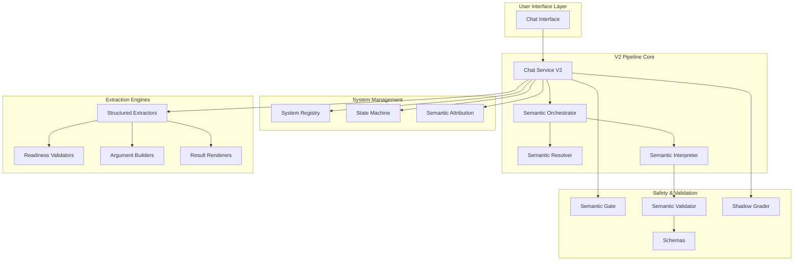
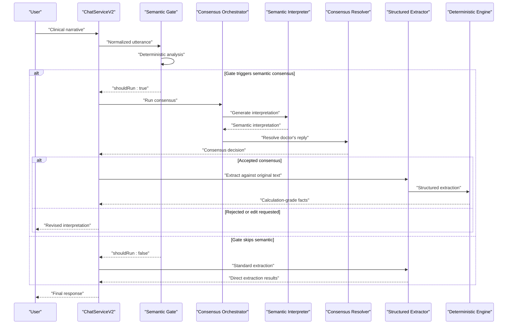
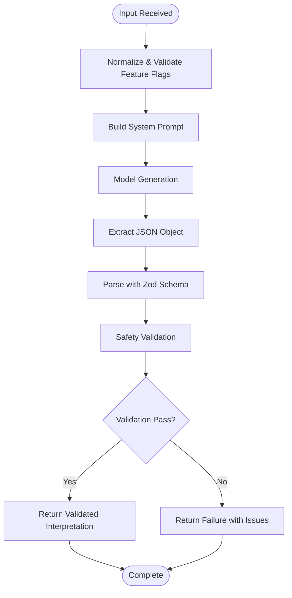
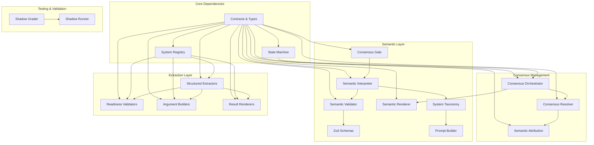

# Advanced V2 Pipeline

<cite>
**Referenced Files in This Document**
- [consensusOrchestrator.ts](file://src/v2/consensusOrchestrator.ts)
- [semanticInterpreter.ts](file://src/v2/semanticInterpreter.ts)
- [systemRegistry.ts](file://src/v2/systemRegistry.ts)
- [semanticConsensusGate.ts](file://src/v2/semanticConsensusGate.ts)
- [semanticShadowGrader.ts](file://src/v2/semanticShadowGrader.ts)
- [consensusResolver.ts](file://src/v2/consensusResolver.ts)
- [semanticInterpreterRenderer.ts](file://src/v2/semanticInterpreterRenderer.ts)
- [semanticInterpreterValidator.ts](file://src/v2/semanticInterpreterValidator.ts)
- [semanticSchemas.ts](file://src/v2/semanticSchemas.ts)
- [contracts.ts](file://src/v2/contracts.ts)
- [stateMachine.ts](file://src/v2/stateMachine.ts)
- [semanticSystemTaxonomy.ts](file://src/v2/semanticSystemTaxonomy.ts)
- [semanticInterpreterPrompt.ts](file://src/v2/semanticInterpreterPrompt.ts)
- [chatServiceV2.ts](file://src/chat/chatServiceV2.ts)
- [semanticAttribution.ts](file://src/v2/semanticAttribution.ts)
</cite>

## Table of Contents
1. [Introduction](#introduction)
2. [Project Structure](#project-structure)
3. [Core Components](#core-components)
4. [Architecture Overview](#architecture-overview)
5. [Detailed Component Analysis](#detailed-component-analysis)
6. [Dependency Analysis](#dependency-analysis)
7. [Performance Considerations](#performance-considerations)
8. [Troubleshooting Guide](#troubleshooting-guide)
9. [Conclusion](#conclusion)
10. [Appendices](#appendices)

## Introduction
The Advanced V2 Pipeline introduces a sophisticated multi-system assessment capability that augments the deterministic chat assistant with a semantic consensus layer. This enhancement enables the system to interpret complex clinical narratives, coordinate multiple body systems simultaneously, and maintain strict safety boundaries while delegating calculation-grade extraction to structured engines.

The pipeline operates through three primary mechanisms: semantic interpretation powered by large language models, consensus building between AI interpretation and human validation, and coordinated multi-system extraction that preserves context across systems. The system maintains rigorous safety controls, including schema validation, safety rule enforcement, and deterministic fallbacks when semantic features are disabled.

## Project Structure
The V2 pipeline is organized around a layered architecture that separates concerns between semantic interpretation, consensus management, and deterministic extraction:

**Diagram sources**
- [chatServiceV2.ts:258-800](file://src/chat/chatServiceV2.ts#L258-L800)
- [consensusOrchestrator.ts:179-332](file://src/v2/consensusOrchestrator.ts#L179-L332)
- [semanticInterpreter.ts:145-217](file://src/v2/semanticInterpreter.ts#L145-L217)

**Section sources**
- [chatServiceV2.ts:1-800](file://src/chat/chatServiceV2.ts#L1-L800)
- [systemRegistry.ts:84-178](file://src/v2/systemRegistry.ts#L84-L178)

## Core Components

### Semantic Interpretation Engine
The semantic interpreter serves as the AI-driven front door for complex clinical narratives. It transforms unstructured medical text into structured interpretations while maintaining strict safety boundaries.

**Implementation Details:**
- **Model Client Abstraction**: Pluggable interface allowing injection of different LLM providers
- **Deterministic Settings**: Temperature 0, schema-constrained output where supported
- **Multi-stage Validation**: Schema parsing, safety validation, and source-span verification
- **Privacy Protection**: Excludes sensitive source text from audit logs while preserving hash verification

**Section sources**
- [semanticInterpreter.ts:145-217](file://src/v2/semanticInterpreter.ts#L145-L217)
- [semanticInterpreterValidator.ts:121-209](file://src/v2/semanticInterpreterValidator.ts#L121-L209)
- [semanticSchemas.ts:111-124](file://src/v2/semanticSchemas.ts#L111-L124)

### Consensus Building System
The consensus orchestrator coordinates between semantic interpretation and human validation, managing the decision flow when multiple systems are involved.

**Key Features:**
- **Dual Feature Flag Control**: Requires both semantic consensus and interpreter flags to activate
- **Decision Tree Logic**: Handles edit-instructions, acceptance modes, rejection scenarios
- **Focus System Selection**: Supports "Assess X first" workflows for multi-system cases
- **Audit Trail Integration**: Comprehensive logging of all consensus decisions

**Section sources**
- [consensusOrchestrator.ts:179-332](file://src/v2/consensusOrchestrator.ts#L179-L332)
- [consensusResolver.ts:195-444](file://src/v2/consensusResolver.ts#L195-L444)

### System Registry Management
The system registry provides centralized management of assessment systems, their capabilities, and migration status across different operational modes.

**Registry Capabilities:**
- **Mode Classification**: Legacy, structured_shadow, structured_live with promotion tracking
- **Capability Mapping**: Extractors, readiness validators, argument builders, result renderers
- **Promotion Validation**: Evidence-based promotion checks with configurable thresholds
- **Migration Support**: Gradual transition from legacy to structured assessment paths

**Section sources**
- [systemRegistry.ts:84-368](file://src/v2/systemRegistry.ts#L84-L368)

## Architecture Overview

The Advanced V2 Pipeline implements a sophisticated multi-layered architecture that balances AI-powered interpretation with deterministic extraction:

**Diagram sources**
- [semanticConsensusGate.ts:206-277](file://src/v2/semanticConsensusGate.ts#L206-L277)
- [consensusOrchestrator.ts:179-332](file://src/v2/consensusOrchestrator.ts#L179-L332)
- [semanticInterpreter.ts:145-217](file://src/v2/semanticInterpreter.ts#L145-L217)
- [consensusResolver.ts:195-444](file://src/v2/consensusResolver.ts#L195-L444)

**Section sources**
- [chatServiceV2.ts:474-540](file://src/chat/chatServiceV2.ts#L474-L540)

## Detailed Component Analysis

### Semantic Consensus Gate
The semantic consensus gate performs deterministic preflight analysis to determine when semantic interpretation should be invoked, ensuring cost-effective and safe operation.

**Trigger Detection Mechanisms:**
- **Multi-system Detection**: Identifies when multiple GATIOD systems are mentioned in a single utterance
- **Legacy/Deferred System Signals**: Flags CNS and visual system mentions requiring special handling
- **Dense Narrative Patterns**: Recognizes complex clinical narratives with multiple clauses
- **Scope Conflict Indicators**: Detects ambiguous regional or lateral references
- **Ambiguity Assessment**: Evaluates low-confidence inputs with unresolved terms

**Section sources**
- [semanticConsensusGate.ts:206-277](file://src/v2/semanticConsensusGate.ts#L206-L277)

### Semantic Interpreter Pipeline
The interpreter pipeline ensures safety and consistency through multiple validation layers:

**Diagram sources**
- [semanticInterpreter.ts:145-217](file://src/v2/semanticInterpreter.ts#L145-L217)
- [semanticInterpreterValidator.ts:121-209](file://src/v2/semanticInterpreterValidator.ts#L121-L209)
- [semanticSchemas.ts:111-124](file://src/v2/semanticSchemas.ts#L111-L124)

**Section sources**
- [semanticInterpreter.ts:145-217](file://src/v2/semanticInterpreter.ts#L145-L217)

### Consensus Resolution System
The consensus resolver implements deterministic decision logic for handling doctor responses to semantic proposals:

**Resolution Categories:**
- **Rejected**: Complete restart of the assessment process
- **Legacy Requested**: Explicit handoff to legacy assessment mode
- **Skipped System**: Exclude specific system from current assessment
- **Accepted System First**: Focus on one system while preserving others
- **Edit Requested**: Modify interpretation based on doctor feedback
- **Accepted All**: Proceed with full interpretation
- **Unresolved**: Re-render choices and request clarification

**Section sources**
- [consensusResolver.ts:195-444](file://src/v2/consensusResolver.ts#L195-L444)

### System Registry and Migration Management
The system registry provides comprehensive system management with migration tracking and promotion validation:

**Migration Modes:**
- **Legacy**: Traditional assessment path with minimal structure
- **Structured Shadow**: Experimental structured path with validation
- **Structured Live**: Fully promoted structured assessment path

**Promotion Validation:**
- **Evidence Collection**: Calibration reports with safety and exact calculation rates
- **Threshold Enforcement**: System-specific acceptance criteria
- **Allowlist Management**: Temporary permission for systems awaiting full promotion

**Section sources**
- [systemRegistry.ts:266-327](file://src/v2/systemRegistry.ts#L266-L327)

### Semantic Attribution and Disagreement Handling
The semantic attribution system manages the transition from semantic interpretation to structured extraction:

**Disagreement Detection:**
- **Accepted Findings Tracking**: Monitors findings accepted by doctor but not extracted
- **Gap Observation Creation**: Generates targeted clarifications for missing information
- **Audit Event Logging**: Comprehensive tracking of extraction failures
- **Failure Classification**: Categorizes reasons for extraction gaps

**Section sources**
- [semanticAttribution.ts:56-79](file://src/v2/semanticAttribution.ts#L56-L79)

## Dependency Analysis

The V2 pipeline exhibits well-structured dependencies that maintain separation of concerns while enabling seamless integration:

**Diagram sources**
- [contracts.ts:315-520](file://src/v2/contracts.ts#L315-L520)
- [stateMachine.ts:1-822](file://src/v2/stateMachine.ts#L1-L822)
- [systemRegistry.ts:84-178](file://src/v2/systemRegistry.ts#L84-L178)

**Section sources**
- [contracts.ts:315-520](file://src/v2/contracts.ts#L315-L520)
- [stateMachine.ts:1-822](file://src/v2/stateMachine.ts#L1-L822)

## Performance Considerations

The V2 pipeline is designed with performance optimization in mind through several key strategies:

**Deterministic Operations:**
- All consensus gate operations complete in microseconds using regex and set operations
- No external API calls during semantic gate evaluation
- Minimal memory footprint through streaming and incremental processing

**Feature Flag Guardrails:**
- Semantic features remain disabled by default, preventing unnecessary computational overhead
- Graceful fallback to deterministic processing when semantic features are unavailable
- Configurable model selection to balance quality and cost

**Memory Management:**
- Structured extraction results are processed incrementally to minimize memory usage
- State snapshots are optimized for persistence and retrieval
- Audit events are batched to reduce I/O overhead

**Scalability Features:**
- Modular architecture allows selective scaling of individual components
- Asynchronous processing for non-critical operations
- Caching mechanisms for frequently accessed system data

## Troubleshooting Guide

### Common Issues and Solutions

**Semantic Interpretation Failures:**
- **Schema Validation Errors**: Check model output format and ensure compliance with Zod schemas
- **Safety Validation Failures**: Review forbidden token patterns and ensure no PI% values or tool references
- **Model Call Failures**: Verify API credentials and model availability

**Consensus Resolution Problems:**
- **Unresolved Decisions**: Ensure doctor responses contain clear system references and sufficient context
- **Edit Cycle Issues**: Verify that edit instructions are specific and actionable
- **Focus System Confusion**: Confirm that "Assess X first" selections align with accepted systems

**Extraction Context Issues:**
- **Multi-System Coordination**: Verify that extraction contexts properly handle multiple system mentions
- **Semantic Gap Handling**: Monitor for disagreement detection and ensure proper clarification flows
- **Instance Management**: Check that assessment instances are properly tracked and updated

**Section sources**
- [semanticInterpreter.ts:145-217](file://src/v2/semanticInterpreter.ts#L145-L217)
- [consensusResolver.ts:195-444](file://src/v2/consensusResolver.ts#L195-L444)
- [semanticAttribution.ts:56-79](file://src/v2/semanticAttribution.ts#L56-L79)

## Conclusion

The Advanced V2 Pipeline represents a significant advancement in multi-system assessment capabilities, providing a robust framework for handling complex clinical narratives while maintaining strict safety controls. The pipeline's modular architecture enables gradual migration from legacy assessment paths to structured, evidence-based approaches, with comprehensive validation and auditing throughout the process.

Key strengths of the implementation include:
- **Safety-First Design**: Multiple validation layers prevent unauthorized calculation or information leakage
- **Flexible Architecture**: Support for gradual system migration and experimental features
- **Comprehensive Auditing**: Complete traceability of all semantic and extraction decisions
- **Performance Optimization**: Deterministic operations and efficient resource utilization

The pipeline successfully balances innovation with reliability, providing healthcare professionals with powerful tools for complex multi-system assessments while maintaining the safety and accountability standards essential in clinical applications.

## Appendices

### Practical Examples

**Complex Multi-System Assessment Workflow:**
1. Doctor inputs: "Patient presents with right shoulder fracture, left knee osteoarthritis, and bilateral hearing loss"
2. System registry detects: upper_limb, lower_limb, hearing systems
3. Semantic gate triggers due to multi-system mention
4. Semantic interpreter proposes: shoulder ROM limitations, knee joint space narrowing, hearing thresholds
5. Doctor selects "Assess upper_limb first"
6. Extraction proceeds against original text with focus on shoulder
7. Subsequent systems extracted in follow-up turns

**Shadow Testing Implementation:**
- Golden cases define expected semantic interpretation outcomes
- Shadow grader evaluates model performance against acceptance criteria
- Automated reporting tracks safety gates and scoring metrics
- Evidence collection supports ADR-0001 promotion decisions

**Section sources**
- [semanticShadowGrader.ts:174-255](file://src/v2/semanticShadowGrader.ts#L174-L255)
- [systemRegistry.ts:266-327](file://src/v2/systemRegistry.ts#L266-L327)