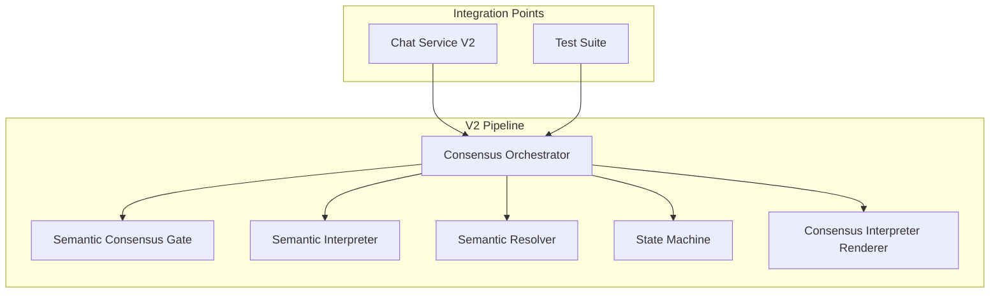
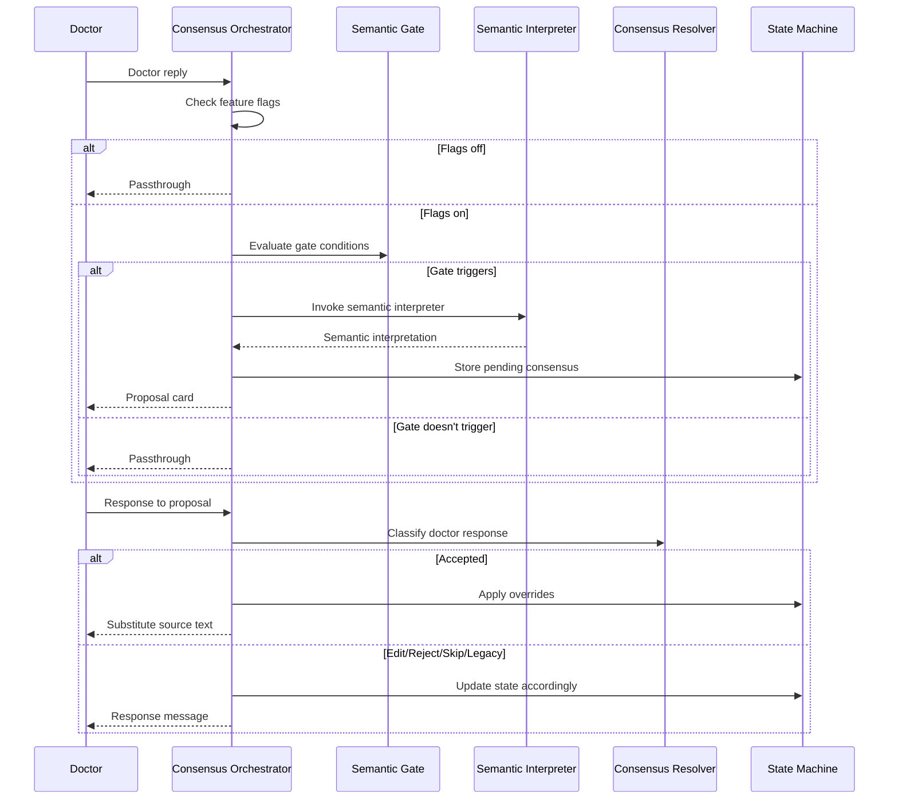
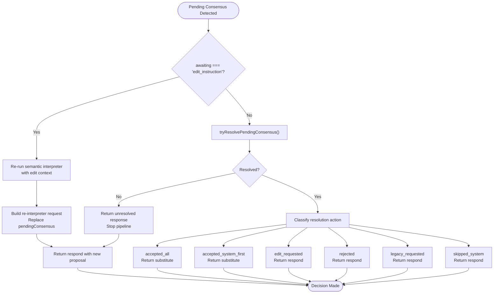
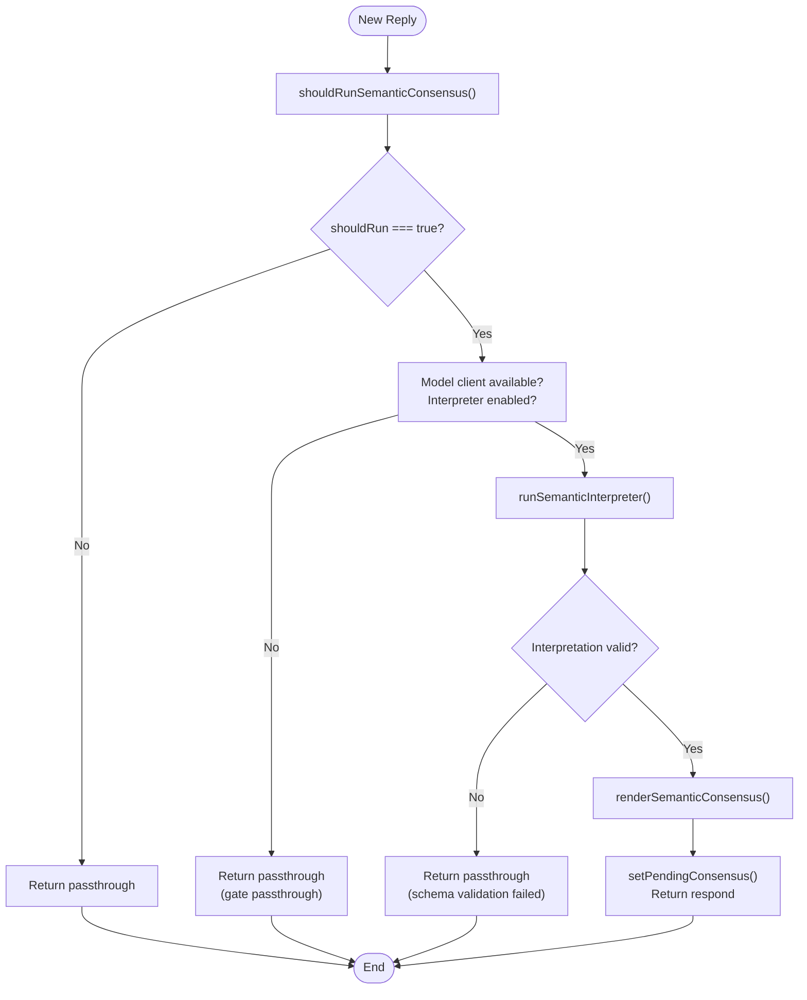
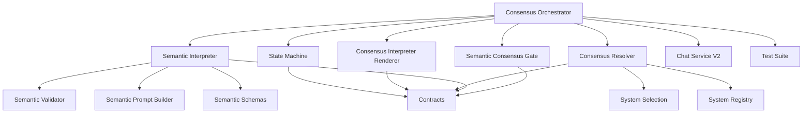

# Consensus Orchestrator

<cite>
**Referenced Files in This Document**
- [consensusOrchestrator.ts](file://src/v2/consensusOrchestrator.ts)
- [consensusResolver.ts](file://src/v2/consensusResolver.ts)
- [semanticConsensusGate.ts](file://src/v2/semanticConsensusGate.ts)
- [semanticInterpreter.ts](file://src/v2/semanticInterpreter.ts)
- [semanticInterpreterRenderer.ts](file://src/v2/semanticInterpreterRenderer.ts)
- [contracts.ts](file://src/v2/contracts.ts)
- [stateMachine.ts](file://src/v2/stateMachine.ts)
- [sliceF.consensusOrchestrator.test.ts](file://tests/v2/sliceF.consensusOrchestrator.test.ts)
- [sliceD.consensusResolver.test.ts](file://tests/v2/sliceD.consensusResolver.test.ts)
- [multiSystemHandoff.test.ts](file://tests/v2/multiSystemHandoff.test.ts)
- [chatServiceV2.ts](file://src/chat/chatServiceV2.ts)
</cite>

## Table of Contents
1. [Introduction](#introduction)
2. [Project Structure](#project-structure)
3. [Core Components](#core-components)
4. [Architecture Overview](#architecture-overview)
5. [Detailed Component Analysis](#detailed-component-analysis)
6. [Dependency Analysis](#dependency-analysis)
7. [Performance Considerations](#performance-considerations)
8. [Troubleshooting Guide](#troubleshooting-guide)
9. [Conclusion](#conclusion)

## Introduction
The Consensus Orchestrator coordinates multi-system assessment decisions by aggregating semantic interpretations from multiple body systems, resolving conflicts through deterministic classification, and managing system handoffs. It implements a two-stage decision pipeline: a semantic consensus gate determines when to invoke an LLM-based semantic interpreter, and a deterministic consensus resolver interprets the doctor's response to reach a consensus decision. The orchestrator ensures that complex multi-system cases are handled systematically while maintaining deterministic fallback behavior when semantic interpretation is unavailable.

## Project Structure
The Consensus Orchestrator resides within the V2 pipeline and integrates with several key modules:

**Diagram sources**
- [consensusOrchestrator.ts:1-422](file://src/v2/consensusOrchestrator.ts#L1-L422)
- [semanticConsensusGate.ts:1-278](file://src/v2/semanticConsensusGate.ts#L1-L278)
- [semanticInterpreter.ts:1-218](file://src/v2/semanticInterpreter.ts#L1-L218)
- [consensusResolver.ts:1-445](file://src/v2/consensusResolver.ts#L1-L445)

**Section sources**
- [consensusOrchestrator.ts:1-422](file://src/v2/consensusOrchestrator.ts#L1-L422)
- [semanticConsensusGate.ts:1-278](file://src/v2/semanticConsensusGate.ts#L1-L278)
- [semanticInterpreter.ts:1-218](file://src/v2/semanticInterpreter.ts#L1-L218)
- [consensusResolver.ts:1-445](file://src/v2/consensusResolver.ts#L1-L445)

## Core Components
The Consensus Orchestrator consists of four primary components working in concert:

### Semantic Consensus Gate
Deterministic pre-filter that decides when to invoke semantic interpretation based on:
- Multi-system lexical detection (≥2 distinct GATIOD systems)
- Legacy/deferred system indicators (CNS/visual terms)
- Dense narrative markers (semicolon patterns, mechanism-prefix)
- Scope conflict detection (multiple regions/sides/organs)
- Ambiguous clinical terms with confidence thresholds

### Semantic Interpreter
LLM-based component that generates structured semantic interpretations containing:
- Candidate systems with confidence scores
- Candidate findings with source spans
- Unsupported terms and assumptions
- Structured output validated by schema and safety checks

### Consensus Resolver
Deterministic classifier that interprets doctor responses with priority ordering:
1. Rejected (restart)
2. Legacy requested (explicit system handoff)
3. Skipped system (user-selected exclusion)
4. Accepted system first (focus selection)
5. Edit requested (proposal revision)
6. Accepted all (full acceptance)
7. Unresolved (fallback)

### State Management
Persistent state tracking for consensus decisions, claim overrides, and system-level orchestration.

**Section sources**
- [semanticConsensusGate.ts:1-278](file://src/v2/semanticConsensusGate.ts#L1-L278)
- [semanticInterpreter.ts:1-218](file://src/v2/semanticInterpreter.ts#L1-L218)
- [consensusResolver.ts:1-445](file://src/v2/consensusResolver.ts#L1-L445)
- [stateMachine.ts:1-822](file://src/v2/stateMachine.ts#L1-L822)

## Architecture Overview
The Consensus Orchestrator implements a controlled decision flow with feature flag gating and deterministic fallbacks:

**Diagram sources**
- [consensusOrchestrator.ts:179-332](file://src/v2/consensusOrchestrator.ts#L179-L332)
- [semanticConsensusGate.ts:206-277](file://src/v2/semanticConsensusGate.ts#L206-L277)
- [consensusResolver.ts:195-444](file://src/v2/consensusResolver.ts#L195-L444)

## Detailed Component Analysis

### Consensus Orchestrator Decision Flow
The orchestrator implements a comprehensive decision tree with three main phases:

#### Phase 1: Feature Flag Validation
Both `SEMANTIC_CONSENSUS_ENABLED` and `SEMANTIC_INTERPRETER_ENABLED` must be active for consensus behavior. When either is disabled, the orchestrator returns "passthrough" to maintain deterministic routing.

#### Phase 2: Pending Consensus Resolution
When `state.pendingConsensus` exists, the orchestrator evaluates the doctor's reply through the consensus resolver:

**Diagram sources**
- [consensusOrchestrator.ts:179-332](file://src/v2/consensusOrchestrator.ts#L179-L332)
- [consensusResolver.ts:195-444](file://src/v2/consensusResolver.ts#L195-L444)

#### Phase 3: New Proposal Initiation
When no pending consensus exists, the semantic consensus gate determines if interpretation is warranted:

**Diagram sources**
- [semanticConsensusGate.ts:206-277](file://src/v2/semanticConsensusGate.ts#L206-L277)
- [semanticInterpreter.ts:145-218](file://src/v2/semanticInterpreter.ts#L145-L218)
- [semanticInterpreterRenderer.ts:43-124](file://src/v2/semanticInterpreterRenderer.ts#L43-L124)

**Section sources**
- [consensusOrchestrator.ts:179-332](file://src/v2/consensusOrchestrator.ts#L179-L332)
- [semanticConsensusGate.ts:206-277](file://src/v2/semanticConsensusGate.ts#L206-L277)
- [semanticInterpreter.ts:145-218](file://src/v2/semanticInterpreter.ts#L145-L218)
- [consensusResolver.ts:195-444](file://src/v2/consensusResolver.ts#L195-L444)

### Semantic Consensus Gate Implementation
The gate performs deterministic lexical analysis to identify complex clinical scenarios requiring semantic interpretation:

#### Trigger Conditions
The gate evaluates multiple factors in sequence:

1. **Feature Flag Control**: Ensures consensus is only activated when both semantic consensus and interpreter flags are enabled
2. **Active Workflow Blocking**: Prevents invocation when pending observations, confirmations, or global CVC confirmations exist
3. **Short Workflow Reply Detection**: Filters out single-word or short workflow responses that don't require semantic analysis
4. **Multi-System Detection**: Identifies ≥2 distinct GATIOD systems mentioned in the input
5. **Legacy/Deferred Indicators**: Detects CNS/visual terms requiring specialized handling
6. **Dense Narrative Patterns**: Recognizes complex clinical narratives with multiple clauses
7. **Scope Conflict Detection**: Identifies conflicting anatomical regions or sides
8. **Ambiguity Threshold**: Considers low confidence with unresolved terms plus system anchors

#### Gate Classification
The gate classifies triggers into six categories:
- `multi_system`: Multiple distinct systems detected
- `legacy_deferred`: CNS/visual terms present
- `dense_narrative`: Complex clinical narratives
- `scope_conflict`: Multiple conflicting regions
- `ambiguous_clinical`: Low confidence with unresolved terms
- `none`: No triggering conditions met

**Section sources**
- [semanticConsensusGate.ts:206-277](file://src/v2/semanticConsensusGate.ts#L206-L277)

### Consensus Resolver Logic
The resolver implements a strict priority hierarchy for interpreting doctor responses:

#### Priority Classification
1. **Rejected** (`reject_patterns`): Complete restart of the assessment
2. **Legacy Requested** (`legacy_patterns`): Explicit system handoff to legacy mode
3. **Skipped System** (`skip_patterns`): User-selected exclusion from assessment
4. **Accepted System First** (`system_first_patterns`): Focus selection for extraction order
5. **Edit Requested** (`edit_patterns`): Proposal revision request
6. **Accepted All** (`accept_patterns`): Full acceptance of interpretation
7. **Unresolved**: Fallback requiring re-rendering of choices

#### System Constraint Enforcement
The resolver ensures that focus selections and legacy requests are constrained to systems actually proposed in the semantic interpretation, preventing invalid system targeting.

#### Override Application
Upon acceptance, the resolver applies automatic overrides for legacy-deferred systems (CNS/visual) to ensure proper handling in downstream processing.

**Section sources**
- [consensusResolver.ts:195-444](file://src/v2/consensusResolver.ts#L195-L444)

### Semantic Interpreter Pipeline
The interpreter provides controlled LLM invocation with comprehensive validation:

#### Feature Flag Protection
The interpreter requires `SEMANTIC_INTERPRETER_ENABLED` to be active, ensuring no real LLM calls occur in default environments.

#### Output Processing
The interpreter implements robust JSON extraction from model responses, handling code fences and malformed outputs gracefully.

#### Validation Layers
Multiple validation stages ensure output quality:
1. **Schema Validation**: Zod-based structural validation
2. **Safety Validation**: Source span verification and semantic consistency
3. **Source Text Integrity**: Ensures findings correspond to original input

#### Server-Side Field Backfill
Critical fields are server-generated to prevent model manipulation:
- `id`: Server-generated UUID
- `sourceText`: Original input text
- `sourceHash`: SHA-256 hash of source text
- `createdAt`: Server timestamp
- `requiresUserConsensus`: Forced boolean

**Section sources**
- [semanticInterpreter.ts:145-218](file://src/v2/semanticInterpreter.ts#L145-L218)

### State Management Integration
The orchestrator integrates deeply with the V2 state machine for persistence and coordination:

#### Pending Consensus Storage
The orchestrator stores semantic interpretations as `PendingConsensus` objects containing:
- `interpretationId`: Unique identifier for the interpretation
- `interpretationHash`: SHA-256 hash for change detection
- `sourceHash`: Hash of original input text
- `message`: Doctor-facing proposal card
- `candidateSystems`: Systems proposed for assessment
- `awaiting`: Decision state ("decision" or "edit_instruction")

#### Claim Component Overrides
The resolver applies overrides for legacy-deferred systems upon acceptance, ensuring proper downstream handling.

#### Focus System Selection
When "accepted_system_first" is chosen, the orchestrator identifies the focus system from the doctor's response and passes it to extraction contexts.

**Section sources**
- [stateMachine.ts:282-318](file://src/v2/stateMachine.ts#L282-L318)
- [contracts.ts:387-403](file://src/v2/contracts.ts#L387-L403)

## Dependency Analysis

**Diagram sources**
- [consensusOrchestrator.ts:22-43](file://src/v2/consensusOrchestrator.ts#L22-L43)
- [semanticConsensusGate.ts:20-28](file://src/v2/semanticConsensusGate.ts#L20-L28)
- [semanticInterpreter.ts:22-36](file://src/v2/semanticInterpreter.ts#L22-L36)
- [consensusResolver.ts:29-42](file://src/v2/consensusResolver.ts#L29-L42)

The orchestrator maintains loose coupling through well-defined interfaces and contracts, enabling:
- Test isolation through mock injection
- Feature flag control for safe deployment
- Deterministic fallback behavior
- Extensible semantic interpretation pipeline

**Section sources**
- [contracts.ts:1-750](file://src/v2/contracts.ts#L1-L750)

## Performance Considerations
The Consensus Orchestrator is designed for minimal computational overhead:

### Gate Performance
The semantic consensus gate operates in O(n) time where n is the number of tokens, using:
- Fast substring matching for keywords
- Set-based system detection
- Early termination on feature flag checks

### Memory Efficiency
- State objects are immutable and shallow-copied
- Hash-based change detection prevents unnecessary recomputation
- Minimal string processing with caching where beneficial

### Latency Characteristics
- Gate evaluation: < 1ms for typical inputs
- Interpreter validation: 100-300ms depending on model response size
- Resolver classification: < 1ms for all patterns

## Troubleshooting Guide

### Common Issues and Resolutions

#### Feature Flags Disabled
**Symptom**: Orchestrator returns "passthrough" consistently
**Cause**: `SEMANTIC_CONSENSUS_ENABLED` or `SEMANTIC_INTERPRETER_ENABLED` is not set
**Resolution**: Enable both flags or use force parameters in tests

#### Gate Never Triggers
**Symptoms**: No semantic proposals despite complex inputs
**Causes**:
- Active pending workflows blocking gate
- Short workflow reply detection
- Single-system simple inputs
- Feature flag disabled

**Resolutions**:
- Clear pending states before testing
- Use multi-system complex inputs
- Verify feature flags are enabled

#### Interpreter Validation Failures
**Symptoms**: Passthrough responses with schema validation errors
**Causes**:
- Invalid JSON output from model
- Source span mismatches
- Schema violations

**Resolutions**:
- Verify model output format
- Check source span alignment
- Review semantic schemas

#### Resolver Classification Issues
**Symptoms**: Unexpected "unresolved" responses
**Causes**:
- Doctor response doesn't match any pattern
- Focus system not in candidate list
- Missing system names in requests

**Resolutions**:
- Use standardized response patterns
- Ensure system names are properly specified
- Verify candidate system lists

**Section sources**
- [sliceF.consensusOrchestrator.test.ts:108-160](file://tests/v2/sliceF.consensusOrchestrator.test.ts#L108-L160)
- [sliceD.consensusResolver.test.ts:273-295](file://tests/v2/sliceD.consensusResolver.test.ts#L273-L295)

## Conclusion
The Consensus Orchestrator provides a robust framework for multi-system assessment coordination through its three-tier architecture: deterministic gate evaluation, controlled semantic interpretation, and priority-based consensus resolution. The implementation emphasizes safety through feature flag gating, deterministic fallbacks, and comprehensive validation layers. Its integration with the V2 state machine ensures persistent state management and seamless coordination with downstream extraction and policy engines. The comprehensive test suite validates both positive and negative scenarios, ensuring reliable behavior across diverse clinical input patterns.