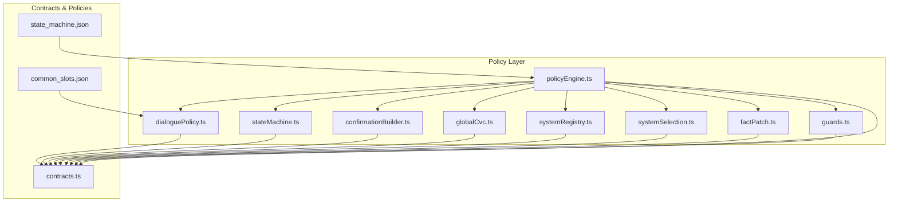
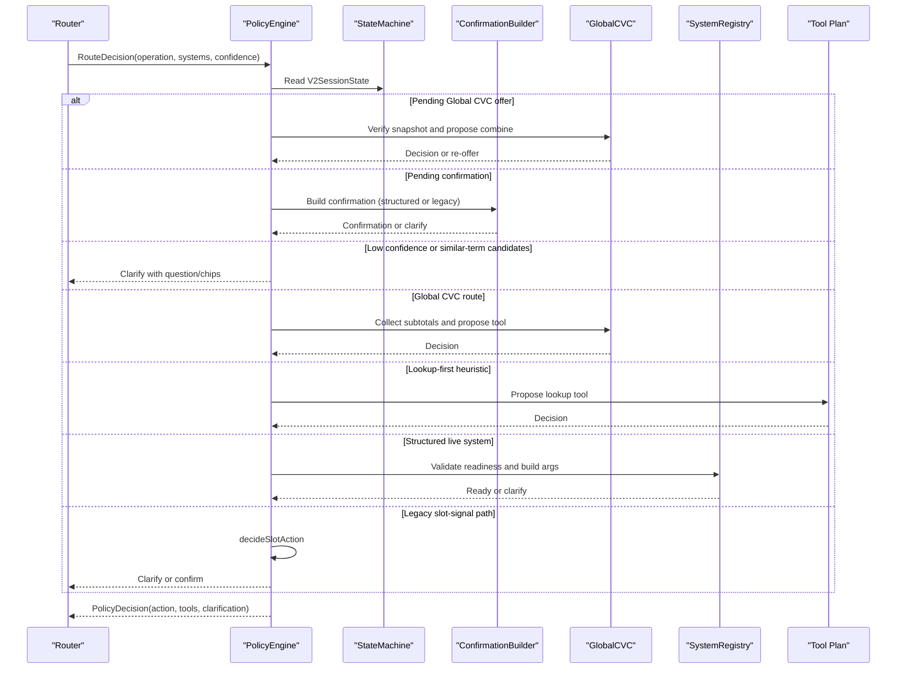
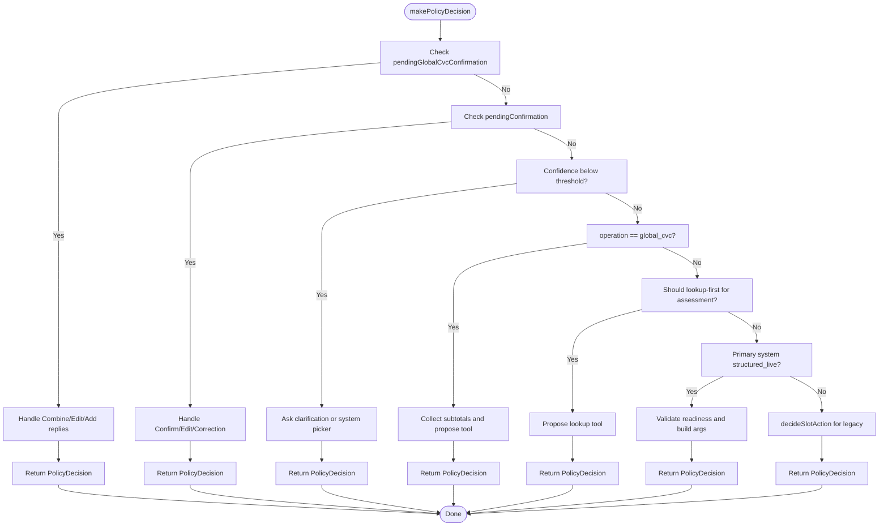
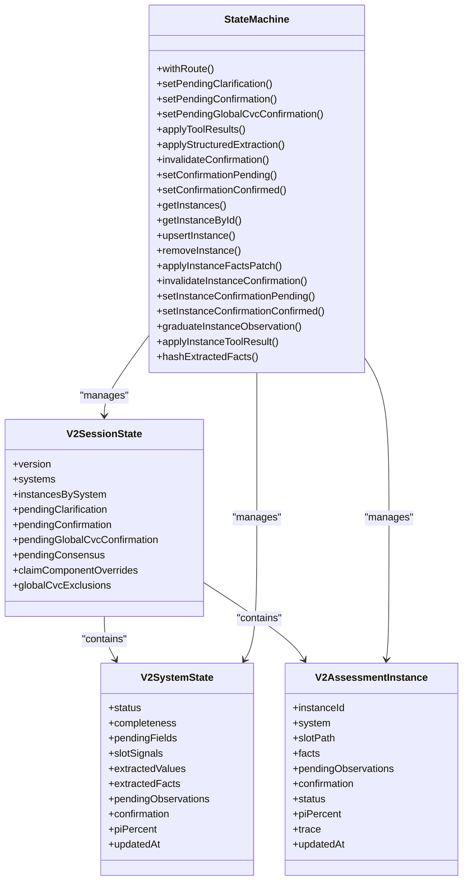
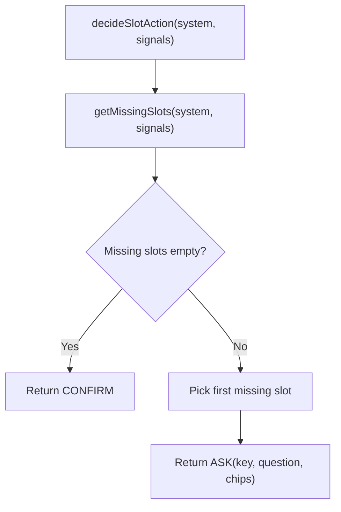
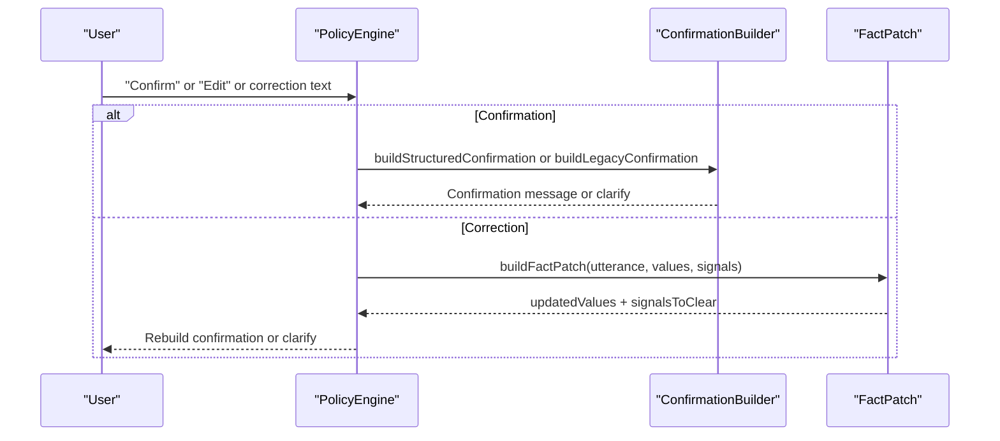
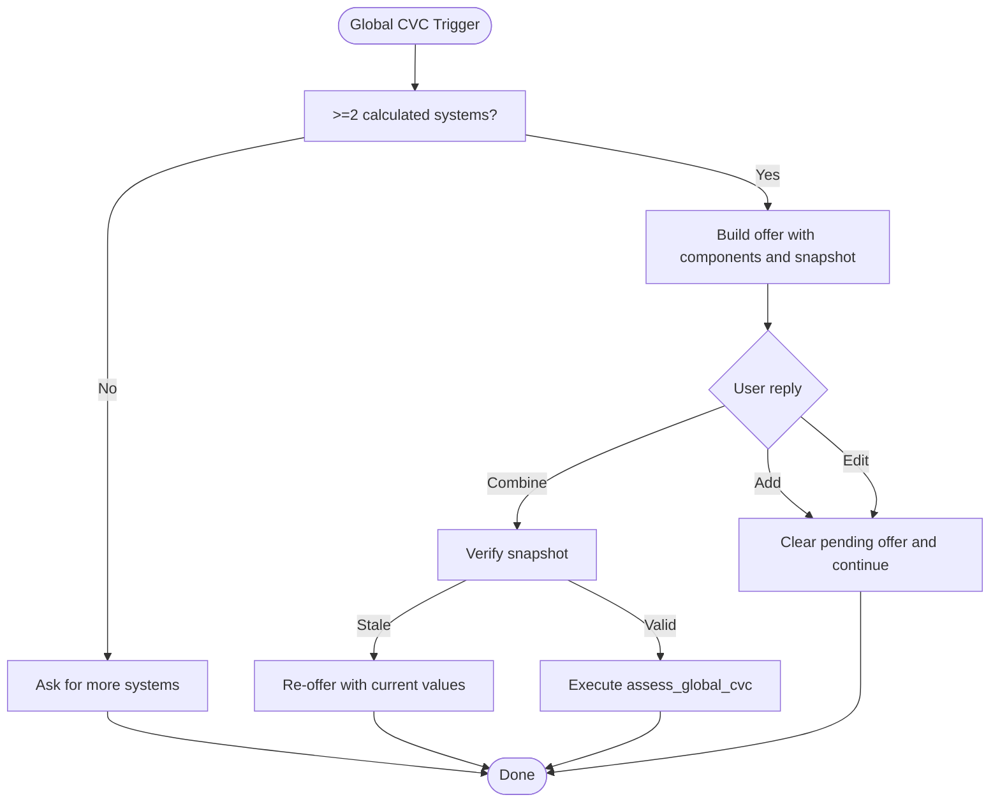
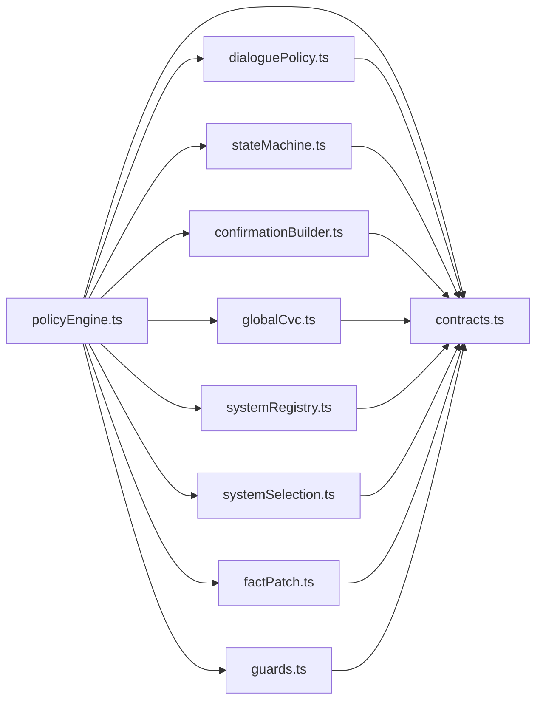

# Policy Engine

<cite>
**Referenced Files in This Document**
- [policyEngine.ts](file://src/v2/policyEngine.ts)
- [stateMachine.ts](file://src/v2/stateMachine.ts)
- [dialoguePolicy.ts](file://src/v2/dialoguePolicy.ts)
- [guards.ts](file://src/v2/guards.ts)
- [systemSelection.ts](file://src/v2/systemSelection.ts)
- [factPatch.ts](file://src/v2/factPatch.ts)
- [confirmationBuilder.ts](file://src/v2/confirmationBuilder.ts)
- [globalCvc.ts](file://src/v2/globalCvc.ts)
- [contracts.ts](file://src/v2/contracts.ts)
- [systemRegistry.ts](file://src/v2/systemRegistry.ts)
- [state_machine.json](file://gatiod_conversation_policy_data/policy/state_machine.json)
- [common_slots.json](file://gatiod_conversation_policy_data/policy/common_slots.json)
- [policyEngine.test.ts](file://tests/v2/policyEngine.test.ts)
- [policyEngine.instanceAware.test.ts](file://tests/v2/policyEngine.instanceAware.test.ts)
</cite>

## Table of Contents
1. [Introduction](#introduction)
2. [Project Structure](#project-structure)
3. [Core Components](#core-components)
4. [Architecture Overview](#architecture-overview)
5. [Detailed Component Analysis](#detailed-component-analysis)
6. [Dependency Analysis](#dependency-analysis)
7. [Performance Considerations](#performance-considerations)
8. [Troubleshooting Guide](#troubleshooting-guide)
9. [Conclusion](#conclusion)
10. [Appendices](#appendices)

## Introduction
This document describes the Policy Engine component responsible for policy-driven dialogue management and decision logic in the V2 pipeline. It explains how the engine interprets routing decisions, manages conversational flow, enforces structured confirmation, and coordinates with semantic interpretation and consensus systems. The Policy Engine integrates guard-based decision making, state transitions, and instance-aware reasoning to ensure deterministic, auditable, and safe assessment workflows across multiple medical systems.

## Project Structure
The Policy Engine resides in the V2 orchestration layer and interacts with state machines, dialogue policies, confirmation builders, and global CVC orchestration. It also depends on system capabilities, guards, and semantic consensus gating.

**Diagram sources**
- [policyEngine.ts:1-564](file://src/v2/policyEngine.ts#L1-L564)
- [stateMachine.ts:1-822](file://src/v2/stateMachine.ts#L1-L822)
- [dialoguePolicy.ts:1-34](file://src/v2/dialoguePolicy.ts#L1-L34)
- [guards.ts:1-50](file://src/v2/guards.ts#L1-L50)
- [systemSelection.ts:1-57](file://src/v2/systemSelection.ts#L1-L57)
- [factPatch.ts:1-176](file://src/v2/factPatch.ts#L1-L176)
- [confirmationBuilder.ts:1-516](file://src/v2/confirmationBuilder.ts#L1-L516)
- [globalCvc.ts:1-361](file://src/v2/globalCvc.ts#L1-L361)
- [contracts.ts:1-750](file://src/v2/contracts.ts#L1-L750)
- [state_machine.json:1-132](file://gatiod_conversation_policy_data/policy/state_machine.json#L1-L132)
- [common_slots.json:1-77](file://gatiod_conversation_policy_data/policy/common_slots.json#L1-L77)

**Section sources**
- [policyEngine.ts:1-564](file://src/v2/policyEngine.ts#L1-L564)
- [stateMachine.ts:1-822](file://src/v2/stateMachine.ts#L1-L822)
- [contracts.ts:1-750](file://src/v2/contracts.ts#L1-L750)
- [state_machine.json:1-132](file://gatiod_conversation_policy_data/policy/state_machine.json#L1-L132)
- [common_slots.json:1-77](file://gatiod_conversation_policy_data/policy/common_slots.json#L1-L77)

## Core Components
- Policy decision maker: orchestrates routing, confirmation, lookup-first, and global CVC decisions.
- Dialogue policy: computes slot-driven next actions for legacy systems.
- State machine: maintains V2 session state, pending states, and instance-aware state.
- Confirmation builder: constructs structured confirmation messages for structured systems.
- Global CVC orchestration: offers and validates combined PI% calculations across systems.
- Guards: enforce deterministic output rules (e.g., “no PI% without assess_*”).
- System selection and patch utilities: interpret explicit system selection and correction patches.
- System registry: defines structured capability per system and readiness validators.

**Section sources**
- [policyEngine.ts:93-563](file://src/v2/policyEngine.ts#L93-L563)
- [dialoguePolicy.ts:15-33](file://src/v2/dialoguePolicy.ts#L15-L33)
- [stateMachine.ts:59-236](file://src/v2/stateMachine.ts#L59-L236)
- [confirmationBuilder.ts:43-107](file://src/v2/confirmationBuilder.ts#L43-L107)
- [globalCvc.ts:45-109](file://src/v2/globalCvc.ts#L45-L109)
- [guards.ts:15-39](file://src/v2/guards.ts#L15-L39)
- [systemSelection.ts:10-56](file://src/v2/systemSelection.ts#L10-L56)
- [factPatch.ts:65-159](file://src/v2/factPatch.ts#L65-L159)
- [systemRegistry.ts:84-178](file://src/v2/systemRegistry.ts#L84-L178)

## Architecture Overview
The Policy Engine sits between routing and execution, transforming RouteDecisions into PolicyDecisions that either:
- Clarify (request user input or confirmation),
- Execute tools (run deterministic assessment or lookup),
- Delegate legacy (hand off to legacy extraction/calculation).

It consults structured readiness validators, confirmation builders, and global CVC orchestration to ensure deterministic, safe, and auditable outcomes.

**Diagram sources**
- [policyEngine.ts:93-563](file://src/v2/policyEngine.ts#L93-L563)
- [stateMachine.ts:238-354](file://src/v2/stateMachine.ts#L238-L354)
- [confirmationBuilder.ts:43-107](file://src/v2/confirmationBuilder.ts#L43-L107)
- [globalCvc.ts:85-109](file://src/v2/globalCvc.ts#L85-L109)
- [systemRegistry.ts:345-350](file://src/v2/systemRegistry.ts#L345-L350)
- [guards.ts:15-39](file://src/v2/guards.ts#L15-L39)

## Detailed Component Analysis

### Policy Decision Flow
The Policy Decision function evaluates:
- Pending Global CVC offer and user reply,
- Pending confirmation and user reply,
- Routing confidence and system selection,
- Global CVC eligibility,
- Lookup-first heuristics,
- Structured readiness and confirmation,
- Legacy slot-signal confirmation.

It returns a PolicyDecision with action, reason, chips, and proposed tools.

**Diagram sources**
- [policyEngine.ts:93-563](file://src/v2/policyEngine.ts#L93-L563)
- [dialoguePolicy.ts:15-33](file://src/v2/dialoguePolicy.ts#L15-L33)
- [confirmationBuilder.ts:43-107](file://src/v2/confirmationBuilder.ts#L43-L107)
- [globalCvc.ts:45-109](file://src/v2/globalCvc.ts#L45-L109)

**Section sources**
- [policyEngine.ts:93-563](file://src/v2/policyEngine.ts#L93-L563)
- [policyEngine.test.ts:20-122](file://tests/v2/policyEngine.test.ts#L20-L122)

### State Machine and Instance-Aware Logic
The state machine manages:
- Session-level state, pending states, and system-level states,
- Instance-aware facts, confirmations, and status,
- Tool result application and system subtotal computation,
- Hash-based confirmation freshness checks.

Instance-aware logic prioritizes instance facts and confirmations when present, falling back to system-level state otherwise.

**Diagram sources**
- [stateMachine.ts:59-236](file://src/v2/stateMachine.ts#L59-L236)
- [stateMachine.ts:409-789](file://src/v2/stateMachine.ts#L409-L789)
- [contracts.ts:596-615](file://src/v2/contracts.ts#L596-L615)
- [contracts.ts:194-205](file://src/v2/contracts.ts#L194-L205)

**Section sources**
- [stateMachine.ts:59-236](file://src/v2/stateMachine.ts#L59-L236)
- [stateMachine.ts:409-789](file://src/v2/stateMachine.ts#L409-L789)
- [contracts.ts:596-615](file://src/v2/contracts.ts#L596-L615)

### Dialogue Policy and Slot Management
The dialogue policy determines the next slot action:
- ASK: a required slot is missing,
- CONFIRM: all required slots satisfied,
- PROCEED: no system-specific slot control needed.

It integrates with the slot evaluator to compute missing slots and with the legacy confirmation builder for non-structured systems.

**Diagram sources**
- [dialoguePolicy.ts:15-33](file://src/v2/dialoguePolicy.ts#L15-L33)
- [slotEvaluator.ts:749-765](file://src/v2/slotEvaluator.ts#L749-L765)

**Section sources**
- [dialoguePolicy.ts:15-33](file://src/v2/dialoguePolicy.ts#L15-L33)
- [slotEvaluator.ts:749-765](file://src/v2/slotEvaluator.ts#L749-L765)
- [common_slots.json:62-75](file://gatiod_conversation_policy_data/policy/common_slots.json#L62-L75)

### Confirmation and Correction Handling
Structured confirmation:
- Builds a typed confirmation message for structured systems (fail-closed when missing required fields).
- Uses system-specific builders and shared labels.

Legacy confirmation:
- Builds a confirmation from extracted values and signals (soft fail-closed semantics).

Correction and edit detection:
- Detects correction/edit/confirmation patterns,
- Builds FactPatch to update values and clear signals as needed.

**Diagram sources**
- [confirmationBuilder.ts:43-107](file://src/v2/confirmationBuilder.ts#L43-L107)
- [factPatch.ts:65-159](file://src/v2/factPatch.ts#L65-L159)
- [policyEngine.ts:192-304](file://src/v2/policyEngine.ts#L192-L304)

**Section sources**
- [confirmationBuilder.ts:43-107](file://src/v2/confirmationBuilder.ts#L43-L107)
- [factPatch.ts:65-159](file://src/v2/factPatch.ts#L65-L159)
- [policyEngine.ts:192-304](file://src/v2/policyEngine.ts#L192-L304)

### Global CVC Orchestration
Global CVC:
- Offers combination when ≥2 systems are calculated,
- Builds a snapshot of component values,
- Verifies snapshot at confirmation time,
- Supports exclusion/re-inclusion with audit events.

**Diagram sources**
- [globalCvc.ts:69-109](file://src/v2/globalCvc.ts#L69-L109)
- [globalCvc.ts:126-158](file://src/v2/globalCvc.ts#L126-L158)
- [globalCvc.ts:298-332](file://src/v2/globalCvc.ts#L298-L332)

**Section sources**
- [globalCvc.ts:45-109](file://src/v2/globalCvc.ts#L45-L109)
- [globalCvc.ts:126-158](file://src/v2/globalCvc.ts#L126-L158)
- [globalCvc.ts:298-332](file://src/v2/globalCvc.ts#L298-L332)

### Guards and Safety Rules
Guards enforce deterministic output safety:
- Final PI% language requires successful assess_* tool evidence,
- Lookup responses must not use final PI% language,
- Legacy regex guard prevents PI% misuse in free text.

These guards protect the integrity of rendered responses.

**Section sources**
- [guards.ts:15-39](file://src/v2/guards.ts#L15-L39)
- [guards.ts:47-49](file://src/v2/guards.ts#L47-L49)

### System Selection and Low-Confidence Routing
System selection patterns:
- Explicit system names are recognized and mapped to system keys,
- Allows low-confidence routing when the user explicitly selects a system.

Short continuation replies:
- Treat short “no”, “yes”, etc., as continuation of active flow rather than restart.

**Section sources**
- [systemSelection.ts:10-56](file://src/v2/systemSelection.ts#L10-L56)
- [policyEngine.ts:309-326](file://src/v2/policyEngine.ts#L309-L326)

### Integration with Semantic Interpretation and Consensus
The Policy Engine coordinates with semantic consensus:
- Deterministic gate decides whether to invoke the semantic interpreter,
- Pending consensus blocks policy decisions until resolved,
- Extraction context is prepared after consensus acceptance.

This ensures structured extraction only occurs when the doctor consents.

**Section sources**
- [contracts.ts:409-433](file://src/v2/contracts.ts#L409-L433)
- [contracts.ts:486-519](file://src/v2/contracts.ts#L486-L519)

## Dependency Analysis
The Policy Engine depends on:
- Contracts for types and state,
- Dialogue policy for slot-driven decisions,
- State machine for state transitions and hashing,
- Confirmation builder for structured cards,
- Global CVC for combined PI% orchestration,
- System registry for readiness validators and structured capabilities,
- Guards for deterministic output safety,
- System selection and fact patch utilities for user intent and corrections.

**Diagram sources**
- [policyEngine.ts:1-26](file://src/v2/policyEngine.ts#L1-L26)
- [contracts.ts:1-750](file://src/v2/contracts.ts#L1-L750)
- [dialoguePolicy.ts:1-34](file://src/v2/dialoguePolicy.ts#L1-L34)
- [stateMachine.ts:1-822](file://src/v2/stateMachine.ts#L1-L822)
- [confirmationBuilder.ts:1-516](file://src/v2/confirmationBuilder.ts#L1-L516)
- [globalCvc.ts:1-361](file://src/v2/globalCvc.ts#L1-L361)
- [systemRegistry.ts:1-368](file://src/v2/systemRegistry.ts#L1-L368)
- [systemSelection.ts:1-57](file://src/v2/systemSelection.ts#L1-L57)
- [factPatch.ts:1-176](file://src/v2/factPatch.ts#L1-L176)
- [guards.ts:1-50](file://src/v2/guards.ts#L1-L50)

**Section sources**
- [policyEngine.ts:1-26](file://src/v2/policyEngine.ts#L1-L26)
- [contracts.ts:1-750](file://src/v2/contracts.ts#L1-L750)

## Performance Considerations
- Hashing extracted facts: efficient confirmation freshness checks using SHA-256 hashes.
- Instance-aware precedence: reduces redundant validations by prioritizing instance facts.
- Early exits: low-confidence routing and lookup-first heuristics prevent unnecessary tool calls.
- Minimal allocations: state updates clone only necessary parts.

[No sources needed since this section provides general guidance]

## Troubleshooting Guide
Common issues and resolutions:
- Stale confirmation: when facts change after confirmation, the policy requests rebuilding the confirmation.
- Low confidence routing: ask for clarification or system picker to avoid misrouting.
- Lookup-first conflicts: structured live systems skip lookup-first to preserve confirmation context.
- Global CVC stale offer: when component values change, re-offer with current values.
- Guard violations: ensure assess_* tool execution precedes final PI% language.

**Section sources**
- [policyEngine.ts:103-187](file://src/v2/policyEngine.ts#L103-L187)
- [policyEngine.ts:229-238](file://src/v2/policyEngine.ts#L229-L238)
- [policyEngine.ts:412-430](file://src/v2/policyEngine.ts#L412-L430)
- [globalCvc.ts:126-158](file://src/v2/globalCvc.ts#L126-L158)
- [guards.ts:15-39](file://src/v2/guards.ts#L15-L39)

## Conclusion
The Policy Engine provides robust, deterministic dialogue management by combining routing decisions, structured readiness, confirmation protocols, and global CVC orchestration. It integrates tightly with the state machine, system registry, and semantic consensus to ensure safe, auditable, and predictable assessment workflows across all GATIOD systems.

[No sources needed since this section summarizes without analyzing specific files]

## Appendices

### Practical Examples

- Example 1: Structured Live Confirmation
  - Scenario: Doctor confirms structured findings for a structured_live system.
  - Outcome: Policy validates readiness, builds arguments, and proposes the deterministic assessment tool.

- Example 2: Global CVC Offer and Combine
  - Scenario: ≥2 systems calculated; assistant offers combine.
  - Outcome: Doctor replies “Combine”; Policy verifies snapshot and executes assess_global_cvc.

- Example 3: Lookup-First Heuristic
  - Scenario: High-confidence ontology match for assessment intent.
  - Outcome: Policy proposes lookup tool first (unless structured_live system), then proceeds to structured readiness.

- Example 4: Correction and Rebuild
  - Scenario: Doctor edits findings; confirmation becomes stale.
  - Outcome: Policy requests rebuilding confirmation with updated facts.

**Section sources**
- [policyEngine.test.ts:45-76](file://tests/v2/policyEngine.test.ts#L45-L76)
- [policyEngine.instanceAware.test.ts:124-212](file://tests/v2/policyEngine.instanceAware.test.ts#L124-L212)