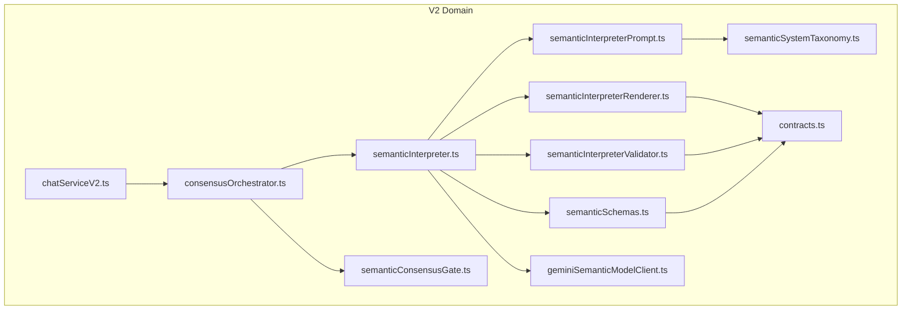
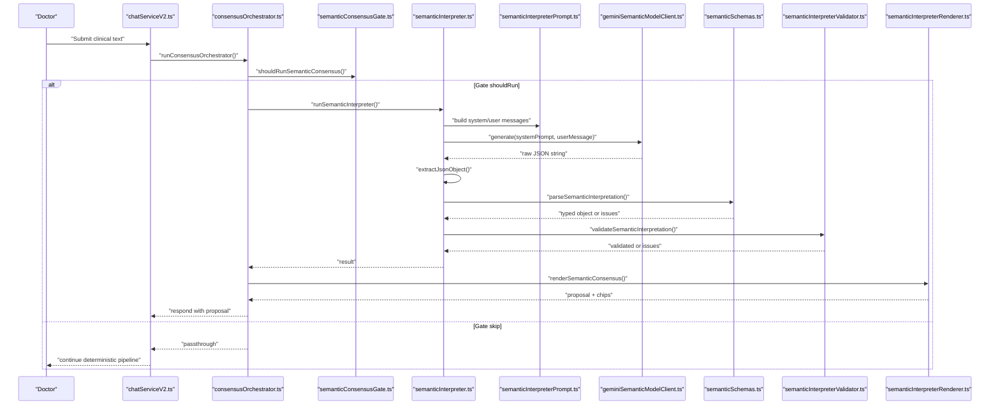
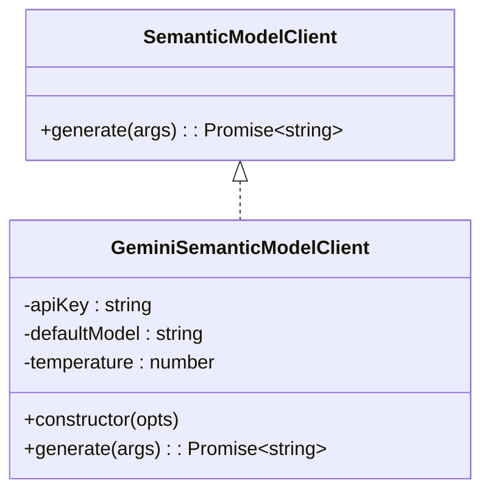
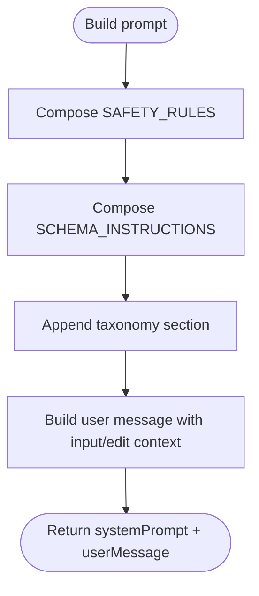
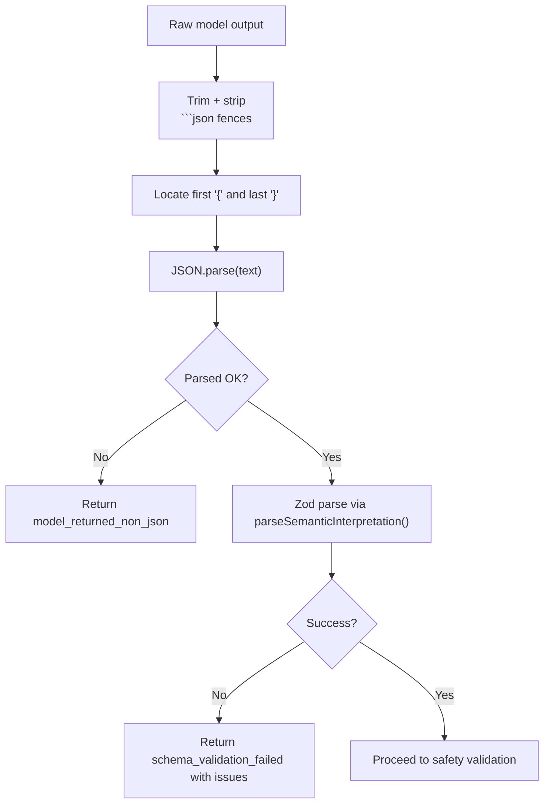
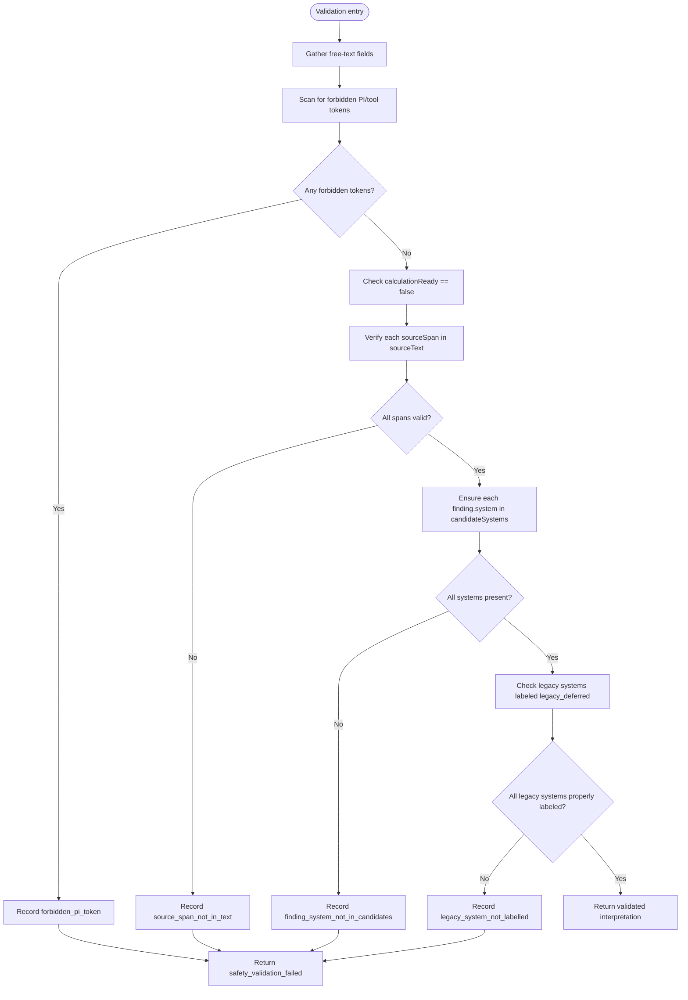
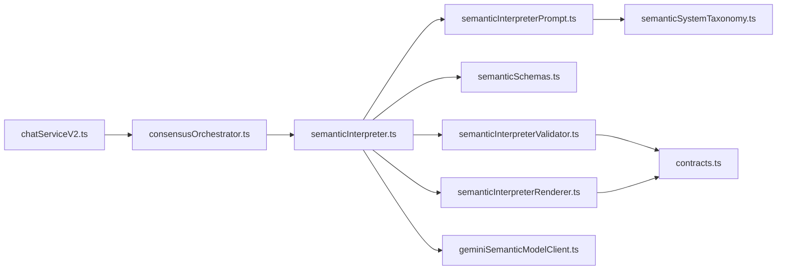
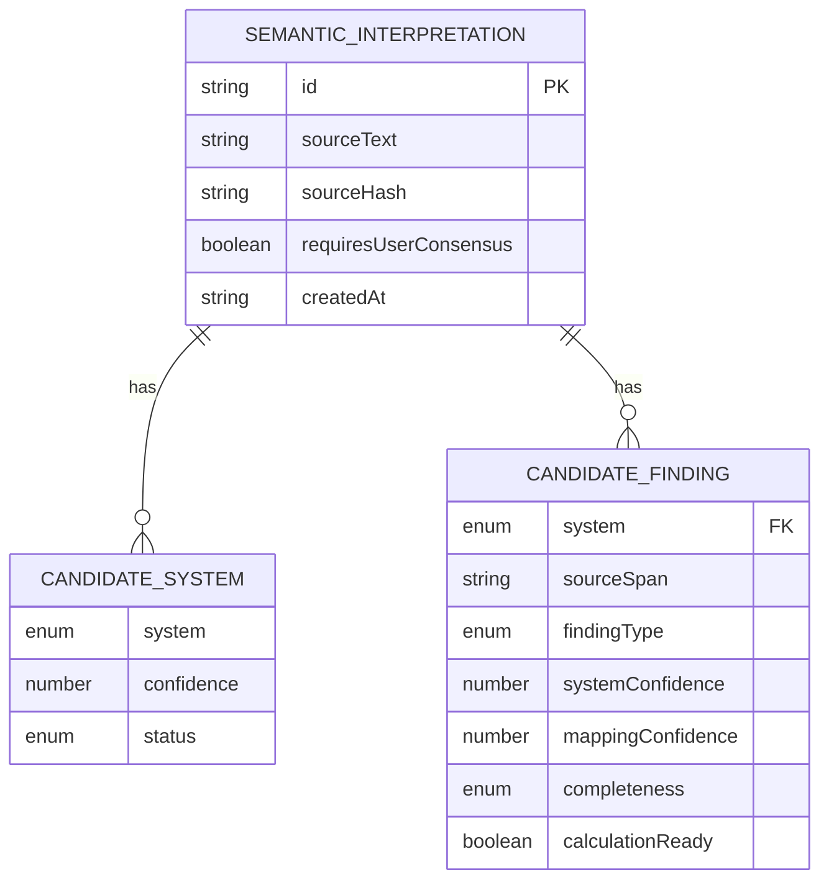

# Semantic Interpreter

<cite>
**Referenced Files in This Document**
- [semanticInterpreter.ts](file://src/v2/semanticInterpreter.ts)
- [semanticInterpreterPrompt.ts](file://src/v2/semanticInterpreterPrompt.ts)
- [semanticInterpreterValidator.ts](file://src/v2/semanticInterpreterValidator.ts)
- [semanticInterpreterRenderer.ts](file://src/v2/semanticInterpreterRenderer.ts)
- [semanticSchemas.ts](file://src/v2/semanticSchemas.ts)
- [geminiSemanticModelClient.ts](file://src/v2/geminiSemanticModelClient.ts)
- [contracts.ts](file://src/v2/contracts.ts)
- [semanticSystemTaxonomy.ts](file://src/v2/semanticSystemTaxonomy.ts)
- [semanticConsensusGate.ts](file://src/v2/semanticConsensusGate.ts)
- [consensusOrchestrator.ts](file://src/v2/consensusOrchestrator.ts)
- [chatServiceV2.ts](file://src/chat/chatServiceV2.ts)
- [sliceE.semanticInterpreter.test.ts](file://tests/v2/sliceE.semanticInterpreter.test.ts)
- [scenarios.ts](file://tests/v2/semanticShadow/scenarios.ts)
</cite>

## Table of Contents
1. [Introduction](#introduction)
2. [Project Structure](#project-structure)
3. [Core Components](#core-components)
4. [Architecture Overview](#architecture-overview)
5. [Detailed Component Analysis](#detailed-component-analysis)
6. [Dependency Analysis](#dependency-analysis)
7. [Performance Considerations](#performance-considerations)
8. [Troubleshooting Guide](#troubleshooting-guide)
9. [Conclusion](#conclusion)
10. [Appendices](#appendices)

## Introduction
This document explains the Semantic Interpreter component that powers advanced natural language understanding for clinical narratives in the V2 pipeline. The Semantic Interpreter converts doctors’ free-text inputs into structured semantic proposals that:
- Identify candidate GATIOD systems and findings
- Anchor findings to verbatim source spans
- Flag missing calculation-critical fields
- Enforce strict safety rules to prevent PI%, tool references, and premature calculations

It is designed as a fail-closed, pluggable subsystem integrated behind deterministic gates and orchestrators, ensuring safety and traceability while enabling human-in-the-loop consensus.

## Project Structure
The Semantic Interpreter resides in the V2 domain and integrates with:
- Prompt building and taxonomy
- Schema parsing with Zod
- Safety validation
- Rendering for doctor-facing proposals
- Orchestrator and gates that decide when to invoke it
- A pluggable model client (default Gemini-backed)

**Diagram sources**
- [semanticInterpreter.ts:145-217](file://src/v2/semanticInterpreter.ts#L145-L217)
- [semanticInterpreterPrompt.ts:79-121](file://src/v2/semanticInterpreterPrompt.ts#L79-L121)
- [semanticInterpreterValidator.ts:121-209](file://src/v2/semanticInterpreterValidator.ts#L121-L209)
- [semanticInterpreterRenderer.ts:43-124](file://src/v2/semanticInterpreterRenderer.ts#L43-L124)
- [semanticSchemas.ts:111-124](file://src/v2/semanticSchemas.ts#L111-L124)
- [semanticSystemTaxonomy.ts:256-279](file://src/v2/semanticSystemTaxonomy.ts#L256-L279)
- [semanticConsensusGate.ts:206-277](file://src/v2/semanticConsensusGate.ts#L206-L277)
- [consensusOrchestrator.ts:179-332](file://src/v2/consensusOrchestrator.ts#L179-L332)
- [chatServiceV2.ts:483-539](file://src/chat/chatServiceV2.ts#L483-L539)
- [geminiSemanticModelClient.ts:26-73](file://src/v2/geminiSemanticModelClient.ts#L26-L73)
- [contracts.ts:319-383](file://src/v2/contracts.ts#L319-L383)

**Section sources**
- [semanticInterpreter.ts:145-217](file://src/v2/semanticInterpreter.ts#L145-L217)
- [semanticInterpreterPrompt.ts:79-121](file://src/v2/semanticInterpreterPrompt.ts#L79-L121)
- [semanticInterpreterValidator.ts:121-209](file://src/v2/semanticInterpreterValidator.ts#L121-L209)
- [semanticInterpreterRenderer.ts:43-124](file://src/v2/semanticInterpreterRenderer.ts#L43-L124)
- [semanticSchemas.ts:111-124](file://src/v2/semanticSchemas.ts#L111-L124)
- [semanticSystemTaxonomy.ts:256-279](file://src/v2/semanticSystemTaxonomy.ts#L256-L279)
- [semanticConsensusGate.ts:206-277](file://src/v2/semanticConsensusGate.ts#L206-L277)
- [consensusOrchestrator.ts:179-332](file://src/v2/consensusOrchestrator.ts#L179-L332)
- [chatServiceV2.ts:483-539](file://src/chat/chatServiceV2.ts#L483-L539)
- [geminiSemanticModelClient.ts:26-73](file://src/v2/geminiSemanticModelClient.ts#L26-L73)
- [contracts.ts:319-383](file://src/v2/contracts.ts#L319-L383)

## Core Components
- SemanticModelClient interface: Abstraction for model calls; production implementation uses Gemini JSON mode; tests inject mocks.
- Prompt builder: Composes system prompt and user message with safety rules, schema instructions, and registry-backed taxonomy.
- Zod schemas: Enforce JSON shape, disallow calculation-ready and consensus bypass, and restrict enums.
- Safety validator: Verifies source spans, forbids PI/tool tokens, enforces system labeling, and rejects unsafe outputs.
- Renderer: Produces doctor-facing markdown proposal with chips and system ordering.
- Orchestrator and gates: Decide when to run the interpreter; fail-closed fallback to deterministic pipeline.

**Section sources**
- [semanticInterpreter.ts:40-49](file://src/v2/semanticInterpreter.ts#L40-L49)
- [semanticInterpreterPrompt.ts:79-121](file://src/v2/semanticInterpreterPrompt.ts#L79-L121)
- [semanticSchemas.ts:111-124](file://src/v2/semanticSchemas.ts#L111-L124)
- [semanticInterpreterValidator.ts:121-209](file://src/v2/semanticInterpreterValidator.ts#L121-L209)
- [semanticInterpreterRenderer.ts:43-124](file://src/v2/semanticInterpreterRenderer.ts#L43-L124)
- [consensusOrchestrator.ts:179-332](file://src/v2/consensusOrchestrator.ts#L179-L332)
- [semanticConsensusGate.ts:206-277](file://src/v2/semanticConsensusGate.ts#L206-L277)

## Architecture Overview
The Semantic Interpreter participates in a two-stage flow:
1) Deterministic gating and consensus orchestration decide whether to invoke the LLM.
2) If invoked, the adapter builds prompts, calls the model, parses and validates output, renders a proposal, and hands control back to the orchestrator.

**Diagram sources**
- [chatServiceV2.ts:483-539](file://src/chat/chatServiceV2.ts#L483-L539)
- [consensusOrchestrator.ts:179-332](file://src/v2/consensusOrchestrator.ts#L179-L332)
- [semanticConsensusGate.ts:206-277](file://src/v2/semanticConsensusGate.ts#L206-L277)
- [semanticInterpreter.ts:145-217](file://src/v2/semanticInterpreter.ts#L145-L217)
- [semanticInterpreterPrompt.ts:79-121](file://src/v2/semanticInterpreterPrompt.ts#L79-L121)
- [geminiSemanticModelClient.ts:46-72](file://src/v2/geminiSemanticModelClient.ts#L46-L72)
- [semanticSchemas.ts:111-124](file://src/v2/semanticSchemas.ts#L111-L124)
- [semanticInterpreterValidator.ts:121-209](file://src/v2/semanticInterpreterValidator.ts#L121-L209)
- [semanticInterpreterRenderer.ts:43-124](file://src/v2/semanticInterpreterRenderer.ts#L43-L124)

## Detailed Component Analysis

### SemanticModelClient Interface and Pluggable Architecture
- Contract: generate(systemPrompt, userMessage, model?) returns a raw JSON string.
- Production client: Gemini with JSON response mode and temperature 0.
- Test usage: Inject mock clients to verify parsing/validation/rendering without LLM calls.

**Diagram sources**
- [semanticInterpreter.ts:40-49](file://src/v2/semanticInterpreter.ts#L40-L49)
- [geminiSemanticModelClient.ts:26-73](file://src/v2/geminiSemanticModelClient.ts#L26-L73)

**Section sources**
- [semanticInterpreter.ts:40-49](file://src/v2/semanticInterpreter.ts#L40-L49)
- [geminiSemanticModelClient.ts:26-73](file://src/v2/geminiSemanticModelClient.ts#L26-L73)

### Prompt Building System
- System prompt includes:
  - Hard safety rules (no PI%, no tool args, no calculation-ready)
  - Required JSON schema shape
  - Registry-backed taxonomy section with clinical signals, examples, and missing-field hints
- User message includes:
  - Original clinical input
  - Optional previous interpretation JSON and doctor edit instruction for revision

**Diagram sources**
- [semanticInterpreterPrompt.ts:79-121](file://src/v2/semanticInterpreterPrompt.ts#L79-L121)
- [semanticSystemTaxonomy.ts:256-279](file://src/v2/semanticSystemTaxonomy.ts#L256-L279)

**Section sources**
- [semanticInterpreterPrompt.ts:79-121](file://src/v2/semanticInterpreterPrompt.ts#L79-L121)
- [semanticSystemTaxonomy.ts:256-279](file://src/v2/semanticSystemTaxonomy.ts#L256-L279)

### JSON Extraction and Schema Parsing (Zod)
- Robust extraction strips code fences and trims non-JSON prefixes/suffixes before parsing.
- Zod schema enforces:
  - Additional properties disallowed
  - calculationReady literal false
  - requiresUserConsensus literal true
  - Enum restrictions for system keys, finding types, and completeness
- Safe-parse helper returns structured issues for diagnostics.

**Diagram sources**
- [semanticInterpreter.ts:95-115](file://src/v2/semanticInterpreter.ts#L95-L115)
- [semanticSchemas.ts:111-124](file://src/v2/semanticSchemas.ts#L111-L124)

**Section sources**
- [semanticInterpreter.ts:95-115](file://src/v2/semanticInterpreter.ts#L95-L115)
- [semanticSchemas.ts:111-124](file://src/v2/semanticSchemas.ts#L111-L124)

### Safety Validation Workflow
- Forbidden tokens: PI% values, approximate statements, system-generated PI, tool names, function declarations, tool_calls.
- Source-span verification: Each finding’s sourceSpan must appear in the original text (case-insensitive and whitespace-insensitive normalization).
- Structural constraints:
  - calculationReady must be false
  - Finding system must appear in candidateSystems
  - Legacy-deferred systems must be labeled as such per registry

**Diagram sources**
- [semanticInterpreterValidator.ts:121-209](file://src/v2/semanticInterpreterValidator.ts#L121-L209)

**Section sources**
- [semanticInterpreterValidator.ts:121-209](file://src/v2/semanticInterpreterValidator.ts#L121-L209)

### Backfilling Server-Controlled Fields
- The adapter backfills server-generated fields to harden provenance and safety:
  - id (UUID)
  - sourceText (original input, not model echo)
  - sourceHash (SHA-256)
  - createdAt (ISO timestamp)
  - requiresUserConsensus (literal true)
- This ensures deterministic auditability and prevents model manipulation.

**Section sources**
- [semanticInterpreter.ts:126-138](file://src/v2/semanticInterpreter.ts#L126-L138)

### Doctor-Facing Proposal Rendering
- Renders a markdown card summarizing:
  - Candidate systems with status and rationale
  - Findings grouped by system with source spans, proposed mappings, and missing fields
  - Unsupported/unrecognized terms
  - Four standard chips: Proceed, Edit interpretation, Choose system first, Reject
- Enforces no PI% or tool mentions in output.

**Section sources**
- [semanticInterpreterRenderer.ts:43-124](file://src/v2/semanticInterpreterRenderer.ts#L43-L124)

### Integration with Gates and Orchestrator
- Deterministic gate decides whether to invoke the interpreter based on:
  - Active pending workflows
  - Multi-system lexical detection
  - Legacy/deferred signals
  - Dense narrative markers
  - Scope conflict indicators
  - Ambiguity thresholds
- Orchestrator coordinates:
  - Pending-consensus resolution
  - Interpreter invocation
  - Proposal rendering
  - Substitution of deterministic pipeline with accepted consensus
  - Audit logging of interpreter outcomes

**Section sources**
- [semanticConsensusGate.ts:206-277](file://src/v2/semanticConsensusGate.ts#L206-L277)
- [consensusOrchestrator.ts:179-332](file://src/v2/consensusOrchestrator.ts#L179-L332)

### Practical Examples and Edge Cases
- Multi-system polytrauma with spine and CNS/visual legacy systems:
  - Detects all nine systems; CNS/visual flagged as legacy_deferred.
  - Missing-field hints included for each system.
- Single-system inputs:
  - Gate may skip; if it triggers, proposal is tight and accurate.
- Revision flow:
  - When “Edit interpretation” is chosen, the adapter re-invokes with previous interpretation JSON and doctor’s instruction.
- Safety edge cases:
  - Fabricated source spans, PI% tokens, tool references, or mislabeled legacy systems are rejected.

**Section sources**
- [sliceE.semanticInterpreter.test.ts:374-501](file://tests/v2/sliceE.semanticInterpreter.test.ts#L374-L501)
- [scenarios.ts:17-113](file://tests/v2/semanticShadow/scenarios.ts#L17-L113)

## Dependency Analysis
- Internal dependencies:
  - semanticInterpreter.ts depends on prompt builder, Zod parser, safety validator, renderer, and model client.
  - semanticInterpreterPrompt.ts depends on semanticSystemTaxonomy.ts.
  - semanticInterpreterValidator.ts and semanticInterpreterRenderer.ts depend on contracts.ts.
  - consensusOrchestrator.ts depends on semanticInterpreter.ts and semanticInterpreterRenderer.ts.
  - chatServiceV2.ts depends on consensusOrchestrator.ts and optionally constructs the default model client.
- External dependencies:
  - Gemini SDK for model calls.
  - Zod for schema validation.

**Diagram sources**
- [semanticInterpreter.ts:145-217](file://src/v2/semanticInterpreter.ts#L145-L217)
- [semanticInterpreterPrompt.ts:79-121](file://src/v2/semanticInterpreterPrompt.ts#L79-L121)
- [semanticInterpreterValidator.ts:121-209](file://src/v2/semanticInterpreterValidator.ts#L121-L209)
- [semanticInterpreterRenderer.ts:43-124](file://src/v2/semanticInterpreterRenderer.ts#L43-L124)
- [semanticSchemas.ts:111-124](file://src/v2/semanticSchemas.ts#L111-L124)
- [semanticSystemTaxonomy.ts:256-279](file://src/v2/semanticSystemTaxonomy.ts#L256-L279)
- [consensusOrchestrator.ts:179-332](file://src/v2/consensusOrchestrator.ts#L179-L332)
- [chatServiceV2.ts:483-539](file://src/chat/chatServiceV2.ts#L483-L539)

**Section sources**
- [semanticInterpreter.ts:145-217](file://src/v2/semanticInterpreter.ts#L145-L217)
- [semanticInterpreterPrompt.ts:79-121](file://src/v2/semanticInterpreterPrompt.ts#L79-L121)
- [semanticInterpreterValidator.ts:121-209](file://src/v2/semanticInterpreterValidator.ts#L121-L209)
- [semanticInterpreterRenderer.ts:43-124](file://src/v2/semanticInterpreterRenderer.ts#L43-L124)
- [semanticSchemas.ts:111-124](file://src/v2/semanticSchemas.ts#L111-L124)
- [semanticSystemTaxonomy.ts:256-279](file://src/v2/semanticSystemTaxonomy.ts#L256-L279)
- [consensusOrchestrator.ts:179-332](file://src/v2/consensusOrchestrator.ts#L179-L332)
- [chatServiceV2.ts:483-539](file://src/chat/chatServiceV2.ts#L483-L539)

## Performance Considerations
- Deterministic gating minimizes unnecessary LLM calls.
- JSON extraction tolerates minor model output artifacts (code fences, chatter) to reduce retries.
- Zod parsing and validator are lightweight; avoid repeated hashing by caching sourceHash where appropriate.
- Rendering is pure and deterministic; avoid heavy computations in prompt taxonomy.

## Troubleshooting Guide
Common failures and resolutions:
- Feature flag disabled:
  - Symptom: Immediate fail-closed with feature_flag_disabled.
  - Resolution: Enable SEMANTIC_INTERPRETER_ENABLED and/or SEMANTIC_CONSENSUS_ENABLED.
- Model call failed:
  - Symptom: model_call_failed with underlying error message.
  - Resolution: Check credentials/API availability; retry or fall back deterministically.
- Non-JSON output:
  - Symptom: model_returned_non_json; rawOutput included.
  - Resolution: Adjust prompt to emphasize JSON-only output; ensure model supports JSON mode.
- Schema validation failed:
  - Symptom: schema_validation_failed with issue list.
  - Resolution: Fix missing fields, enums, or literal constraints; re-run.
- Safety validation failed:
  - Symptom: safety_validation_failed with specific issue kinds.
  - Resolution: Correct source spans, remove PI/tool tokens, fix system labeling, or adjust missing fields.

**Section sources**
- [semanticInterpreter.ts:145-217](file://src/v2/semanticInterpreter.ts#L145-L217)
- [sliceE.semanticInterpreter.test.ts:374-501](file://tests/v2/sliceE.semanticInterpreter.test.ts#L374-L501)

## Conclusion
The Semantic Interpreter is a robust, fail-closed component that safely transforms clinical narratives into structured semantic proposals. Its pluggable model client, strict schema and safety validations, and deterministic gating ensure safety and reliability while enabling human-in-the-loop consensus. Integration with the broader V2 pipeline allows seamless substitution of deterministic extraction when a doctor accepts a semantic proposal.

## Appendices

### Data Model Overview

**Diagram sources**
- [contracts.ts:319-383](file://src/v2/contracts.ts#L319-L383)