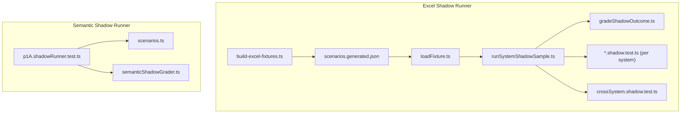
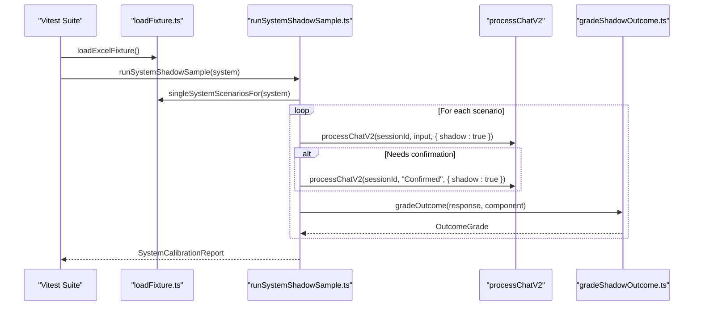
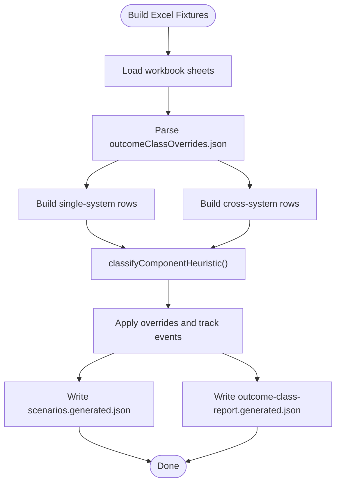
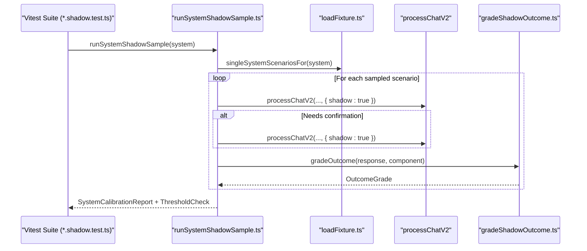
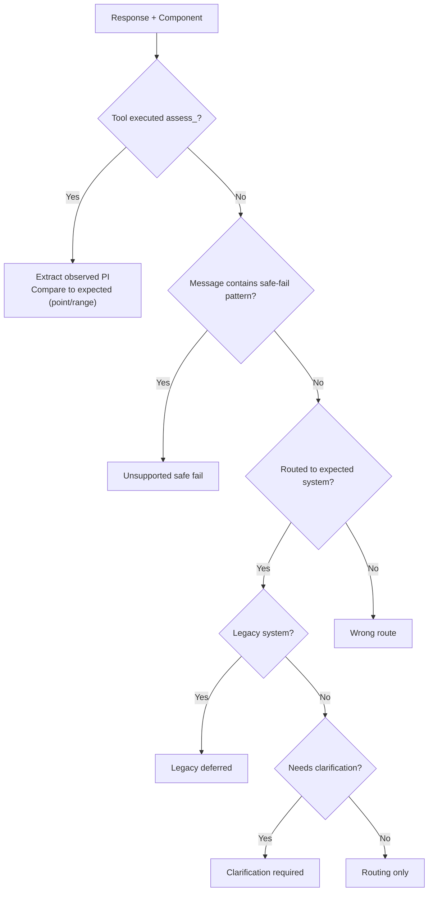
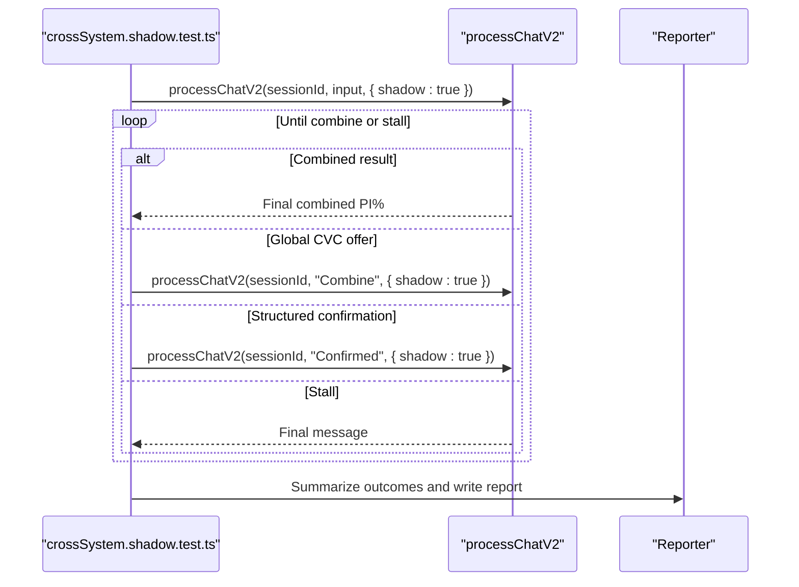
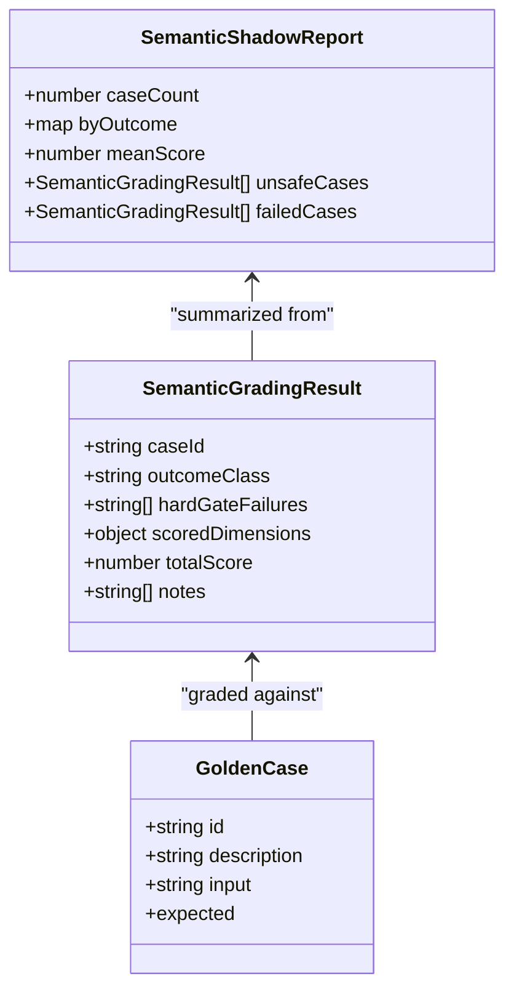
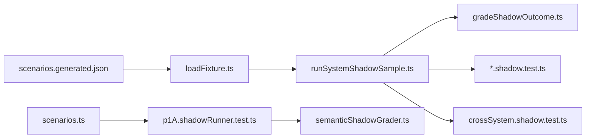

# Shadow Testing and Validation

<cite>
**Referenced Files in This Document**
- [scenarioTypes.ts](file://tests/v2/excelScenarios/scenarioTypes.ts)
- [loadFixture.ts](file://tests/v2/excelScenarios/loadFixture.ts)
- [runSystemShadowSample.ts](file://tests/v2/excelScenarios/runSystemShadowSample.ts)
- [gradeShadowOutcome.ts](file://tests/v2/excelScenarios/gradeShadowOutcome.ts)
- [crossSystem.shadow.test.ts](file://tests/v2/excelScenarios/crossSystem.shadow.test.ts)
- [hearing.shadow.test.ts](file://tests/v2/excelScenarios/hearing.shadow.test.ts)
- [build-excel-fixtures.ts](file://scripts/build-excel-fixtures.ts)
- [classifyScenario.ts](file://tests/v2/excelScenarios/classifyScenario.ts)
- [scenarios.generated.json](file://tests/v2/excelScenarios/scenarios.generated.json)
- [outcomeClassOverrides.json](file://tests/v2/excelScenarios/outcomeClassOverrides.json)
- [p1A.shadowRunner.test.ts](file://tests/v2/semanticShadow/p1A.shadowRunner.test.ts)
- [scenarios.ts](file://tests/v2/semanticShadow/scenarios.ts)
- [semanticShadowGrader.ts](file://src/v2/semanticShadowGrader.ts)
</cite>

## Table of Contents
1. [Introduction](#introduction)
2. [Project Structure](#project-structure)
3. [Core Components](#core-components)
4. [Architecture Overview](#architecture-overview)
5. [Detailed Component Analysis](#detailed-component-analysis)
6. [Dependency Analysis](#dependency-analysis)
7. [Performance Considerations](#performance-considerations)
8. [Troubleshooting Guide](#troubleshooting-guide)
9. [Conclusion](#conclusion)

## Introduction
This document explains the Shadow Testing and Validation component that evaluates V2 pipeline performance in production-like conditions. It covers:
- Shadow testing methodologies and automated validation workflows
- Grading systems for single-system and cross-system scenarios
- Excel fixture integration, calibration testing, and continuous validation
- Scenario-based testing and performance metrics collection
- Practical examples of shadow runner workflows and integration with the broader V2 QA framework

The focus is on two complementary shadow testing domains:
- Excel-based scenario shadow runner for structured, catalogued clinical inputs
- Semantic shadow grader for natural-language inputs and model interpretation quality

## Project Structure
Shadow testing artifacts are organized under tests/v2/excelScenarios and tests/v2/semanticShadow, with supporting scripts and generated fixtures.

**Diagram sources**
- [build-excel-fixtures.ts:1-427](file://scripts/build-excel-fixtures.ts#L1-L427)
- [scenarios.generated.json:1-200](file://tests/v2/excelScenarios/scenarios.generated.json#L1-L200)
- [loadFixture.ts:1-50](file://tests/v2/excelScenarios/loadFixture.ts#L1-L50)
- [runSystemShadowSample.ts:1-187](file://tests/v2/excelScenarios/runSystemShadowSample.ts#L1-L187)
- [gradeShadowOutcome.ts:1-180](file://tests/v2/excelScenarios/gradeShadowOutcome.ts#L1-L180)
- [crossSystem.shadow.test.ts:1-267](file://tests/v2/excelScenarios/crossSystem.shadow.test.ts#L1-L267)
- [p1A.shadowRunner.test.ts:1-94](file://tests/v2/semanticShadow/p1A.shadowRunner.test.ts#L1-L94)
- [scenarios.ts:1-114](file://tests/v2/semanticShadow/scenarios.ts#L1-L114)
- [semanticShadowGrader.ts:1-299](file://src/v2/semanticShadowGrader.ts#L1-L299)

**Section sources**
- [build-excel-fixtures.ts:1-427](file://scripts/build-excel-fixtures.ts#L1-L427)
- [scenarios.generated.json:1-200](file://tests/v2/excelScenarios/scenarios.generated.json#L1-L200)
- [loadFixture.ts:1-50](file://tests/v2/excelScenarios/loadFixture.ts#L1-L50)
- [runSystemShadowSample.ts:1-187](file://tests/v2/excelScenarios/runSystemShadowSample.ts#L1-L187)
- [gradeShadowOutcome.ts:1-180](file://tests/v2/excelScenarios/gradeShadowOutcome.ts#L1-L180)
- [crossSystem.shadow.test.ts:1-267](file://tests/v2/excelScenarios/crossSystem.shadow.test.ts#L1-L267)
- [p1A.shadowRunner.test.ts:1-94](file://tests/v2/semanticShadow/p1A.shadowRunner.test.ts#L1-L94)
- [scenarios.ts:1-114](file://tests/v2/semanticShadow/scenarios.ts#L1-L114)
- [semanticShadowGrader.ts:1-299](file://src/v2/semanticShadowGrader.ts#L1-L299)

## Core Components
- Excel scenario fixture and types: Defines expected outcome classes, scenario components, and fixture metadata.
- Fixture loader: Loads the generated JSON and filters scenarios by system or cross-system eligibility.
- System shadow runner: Executes a sample of single-system scenarios through the V2 pipeline, drives two-turn interactions when needed, grades outcomes, and writes calibration reports.
- Outcome grader: Compares observed outcomes to expected classes, including exact PI% or range matching for “exact calculation.”
- Cross-system shadow runner: Multi-turn orchestration to validate Global CVC end-to-end, recording offer/executed rates and final PI% match.
- Semantic shadow grader: Grades model-provided semantic interpretations against curated golden cases using weighted dimensions and hard/soft gates.
- Scenario builder: Generates deterministic JSON fixture from the workbook, applies overrides, and records heuristic override events.

**Section sources**
- [scenarioTypes.ts:1-97](file://tests/v2/excelScenarios/scenarioTypes.ts#L1-L97)
- [loadFixture.ts:1-50](file://tests/v2/excelScenarios/loadFixture.ts#L1-L50)
- [runSystemShadowSample.ts:1-187](file://tests/v2/excelScenarios/runSystemShadowSample.ts#L1-L187)
- [gradeShadowOutcome.ts:1-180](file://tests/v2/excelScenarios/gradeShadowOutcome.ts#L1-L180)
- [crossSystem.shadow.test.ts:1-267](file://tests/v2/excelScenarios/crossSystem.shadow.test.ts#L1-L267)
- [build-excel-fixtures.ts:1-427](file://scripts/build-excel-fixtures.ts#L1-L427)
- [semanticShadowGrader.ts:1-299](file://src/v2/semanticShadowGrader.ts#L1-L299)

## Architecture Overview
The shadow testing architecture integrates data generation, scenario execution, grading, and reporting across single-system and cross-system validations, and semantic interpretation quality checks.

**Diagram sources**
- [loadFixture.ts:1-50](file://tests/v2/excelScenarios/loadFixture.ts#L1-L50)
- [runSystemShadowSample.ts:1-187](file://tests/v2/excelScenarios/runSystemShadowSample.ts#L1-L187)
- [gradeShadowOutcome.ts:1-180](file://tests/v2/excelScenarios/gradeShadowOutcome.ts#L1-L180)

**Section sources**
- [runSystemShadowSample.ts:1-187](file://tests/v2/excelScenarios/runSystemShadowSample.ts#L1-L187)
- [gradeShadowOutcome.ts:1-180](file://tests/v2/excelScenarios/gradeShadowOutcome.ts#L1-L180)
- [loadFixture.ts:1-50](file://tests/v2/excelScenarios/loadFixture.ts#L1-L50)

## Detailed Component Analysis

### Excel Scenario Fixture and Types
- Defines expected outcome classes and scenario component metadata, including PI% expectations (point or range), outcome class overrides, and flags for system/cross-system gating.
- Provides types for the committed fixture and override events.

**Section sources**
- [scenarioTypes.ts:1-97](file://tests/v2/excelScenarios/scenarioTypes.ts#L1-L97)

### Excel Fixture Builder and Classifier
- Reads the workbook and generates a deterministic JSON fixture with checksum and timestamps.
- Applies outcome class overrides and records override events for heuristic accuracy tracking.
- Heuristic classifier determines expected outcome classes per component, with special-casing for CNS/visual (deferred), extraction skips, and system-specific ambiguity requiring clarification.

**Diagram sources**
- [build-excel-fixtures.ts:1-427](file://scripts/build-excel-fixtures.ts#L1-L427)
- [classifyScenario.ts:1-291](file://tests/v2/excelScenarios/classifyScenario.ts#L1-L291)
- [outcomeClassOverrides.json:1-11](file://tests/v2/excelScenarios/outcomeClassOverrides.json#L1-L11)

**Section sources**
- [build-excel-fixtures.ts:1-427](file://scripts/build-excel-fixtures.ts#L1-L427)
- [classifyScenario.ts:1-291](file://tests/v2/excelScenarios/classifyScenario.ts#L1-L291)
- [outcomeClassOverrides.json:1-11](file://tests/v2/excelScenarios/outcomeClassOverrides.json#L1-L11)

### Single-System Shadow Runner
- Loads scenarios for a given system, optionally runs the full population, and executes a deterministic sample.
- Drives two-turn interactions when needed (confirmation or lookup prompts).
- Grades outcomes and computes:
  - Component-level safe outcome rate
  - Exact calculation rate (PI% match among exact_calculation rows)
- Writes a system calibration report and enforces ADR-0001 thresholds per system.

**Diagram sources**
- [hearing.shadow.test.ts:1-30](file://tests/v2/excelScenarios/hearing.shadow.test.ts#L1-L30)
- [runSystemShadowSample.ts:1-187](file://tests/v2/excelScenarios/runSystemShadowSample.ts#L1-L187)
- [gradeShadowOutcome.ts:1-180](file://tests/v2/excelScenarios/gradeShadowOutcome.ts#L1-L180)
- [loadFixture.ts:1-50](file://tests/v2/excelScenarios/loadFixture.ts#L1-L50)

**Section sources**
- [runSystemShadowSample.ts:1-187](file://tests/v2/excelScenarios/runSystemShadowSample.ts#L1-L187)
- [gradeShadowOutcome.ts:1-180](file://tests/v2/excelScenarios/gradeShadowOutcome.ts#L1-L180)
- [loadFixture.ts:1-50](file://tests/v2/excelScenarios/loadFixture.ts#L1-L50)
- [hearing.shadow.test.ts:1-30](file://tests/v2/excelScenarios/hearing.shadow.test.ts#L1-L30)

### Outcome Grading and Metrics
- Outcome classes: exact calculation, clarification required, unsupported safe fail, routing only, legacy deferred, wrong route.
- Exact calculation grading supports:
  - Point PI% match (tolerance)
  - Range PI% match (e.g., workbook ranges like 0–10%)
- Reports include:
  - By-expected distribution
  - Safe outcome rate
  - Exact calculation rate
  - Mismatch samples for triage

**Diagram sources**
- [gradeShadowOutcome.ts:1-180](file://tests/v2/excelScenarios/gradeShadowOutcome.ts#L1-L180)

**Section sources**
- [gradeShadowOutcome.ts:1-180](file://tests/v2/excelScenarios/gradeShadowOutcome.ts#L1-L180)

### Cross-System Shadow Runner (Global CVC End-to-End)
- Validates cross-system scenarios excluding legacy components.
- Biased sampling ensures live-only rows (e.g., spine, hearing) are fully covered.
- Multi-turn orchestration:
  - Confirms structured confirmations
  - Responds “Combine” when Global CVC is offered
  - Captures final combined PI%
- Computes rates:
  - Offered/executed rates
  - End-to-end PI% match rate
  - Slices: all rows, live-only rows, mixed rows

**Diagram sources**
- [crossSystem.shadow.test.ts:1-267](file://tests/v2/excelScenarios/crossSystem.shadow.test.ts#L1-L267)

**Section sources**
- [crossSystem.shadow.test.ts:1-267](file://tests/v2/excelScenarios/crossSystem.shadow.test.ts#L1-L267)

### Semantic Shadow Grader (P1-A)
- Grades model-provided semantic interpretations against curated golden cases.
- Dimensions:
  - Candidate systems recall
  - Legacy/deferred labeling
  - Missing fields detection
  - Forbidden systems absence
- Hard gates:
  - Schema/safety validation failures
- Soft gates:
  - Pass rate thresholds

**Diagram sources**
- [semanticShadowGrader.ts:1-299](file://src/v2/semanticShadowGrader.ts#L1-L299)
- [scenarios.ts:1-114](file://tests/v2/semanticShadow/scenarios.ts#L1-L114)

**Section sources**
- [semanticShadowGrader.ts:1-299](file://src/v2/semanticShadowGrader.ts#L1-L299)
- [p1A.shadowRunner.test.ts:1-94](file://tests/v2/semanticShadow/p1A.shadowRunner.test.ts#L1-L94)
- [scenarios.ts:1-114](file://tests/v2/semanticShadow/scenarios.ts#L1-L114)

## Dependency Analysis
- Excel shadow runner depends on:
  - Generated fixture (scenarios.generated.json)
  - Scenario loader and classifier
  - Outcome grader and thresholds
- Cross-system runner depends on:
  - Same fixture and loader
  - Multi-turn orchestration and reporting
- Semantic shadow runner depends on:
  - Curated golden cases
  - Semantic interpreter and grader

**Diagram sources**
- [scenarios.generated.json:1-200](file://tests/v2/excelScenarios/scenarios.generated.json#L1-L200)
- [loadFixture.ts:1-50](file://tests/v2/excelScenarios/loadFixture.ts#L1-L50)
- [runSystemShadowSample.ts:1-187](file://tests/v2/excelScenarios/runSystemShadowSample.ts#L1-L187)
- [gradeShadowOutcome.ts:1-180](file://tests/v2/excelScenarios/gradeShadowOutcome.ts#L1-L180)
- [crossSystem.shadow.test.ts:1-267](file://tests/v2/excelScenarios/crossSystem.shadow.test.ts#L1-L267)
- [scenarios.ts:1-114](file://tests/v2/semanticShadow/scenarios.ts#L1-L114)
- [p1A.shadowRunner.test.ts:1-94](file://tests/v2/semanticShadow/p1A.shadowRunner.test.ts#L1-L94)
- [semanticShadowGrader.ts:1-299](file://src/v2/semanticShadowGrader.ts#L1-L299)

**Section sources**
- [scenarios.generated.json:1-200](file://tests/v2/excelScenarios/scenarios.generated.json#L1-L200)
- [loadFixture.ts:1-50](file://tests/v2/excelScenarios/loadFixture.ts#L1-L50)
- [runSystemShadowSample.ts:1-187](file://tests/v2/excelScenarios/runSystemShadowSample.ts#L1-L187)
- [gradeShadowOutcome.ts:1-180](file://tests/v2/excelScenarios/gradeShadowOutcome.ts#L1-L180)
- [crossSystem.shadow.test.ts:1-267](file://tests/v2/excelScenarios/crossSystem.shadow.test.ts#L1-L267)
- [scenarios.ts:1-114](file://tests/v2/semanticShadow/scenarios.ts#L1-L114)
- [p1A.shadowRunner.test.ts:1-94](file://tests/v2/semanticShadow/p1A.shadowRunner.test.ts#L1-L94)
- [semanticShadowGrader.ts:1-299](file://src/v2/semanticShadowGrader.ts#L1-L299)

## Performance Considerations
- Sampling strategies:
  - Deterministic stride sampling for single-system runs
  - Biased sampling ensuring live-only cross-system rows are fully represented
- Environment controls:
  - In-memory DB for isolation and speed
  - Optional full-run mode for comprehensive validation
- Timeouts:
  - Extended Vitest timeouts accommodate long-running cross-system and semantic suites
- CI invariants:
  - Generated fixture checksum and stable timestamps ensure deterministic diffs

[No sources needed since this section provides general guidance]

## Troubleshooting Guide
Common issues and remedies:
- Shadow scenarios disabled:
  - Ensure the opt-in environment variable is set for the suite to run.
- Cross-system rows not included:
  - Verify the loader excludes legacy-deferred components for end-to-end validation.
- Exact calculation mismatches:
  - Review PI% tolerance and range handling in the grader.
- Semantic runner prerequisites:
  - Set the required environment variable and API key for the model client.
- CI diffs on generated files:
  - Rebuild fixtures and ensure deterministic outputs.

**Section sources**
- [runSystemShadowSample.ts:1-187](file://tests/v2/excelScenarios/runSystemShadowSample.ts#L1-L187)
- [crossSystem.shadow.test.ts:1-267](file://tests/v2/excelScenarios/crossSystem.shadow.test.ts#L1-L267)
- [p1A.shadowRunner.test.ts:1-94](file://tests/v2/semanticShadow/p1A.shadowRunner.test.ts#L1-L94)

## Conclusion
The Shadow Testing and Validation component provides robust, automated quality assurance for the V2 pipeline:
- Excel-based scenario runner validates single-system and cross-system flows with precise outcome and PI% grading
- Continuous validation via generated fixtures and override mechanisms maintains heuristic accuracy
- Semantic shadow grader ensures model interpretation quality against curated goldens with hard and soft gates
- Practical workflows enable targeted regression detection and promotion gating aligned with ADR-0001