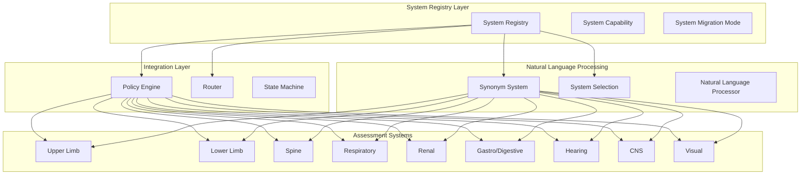
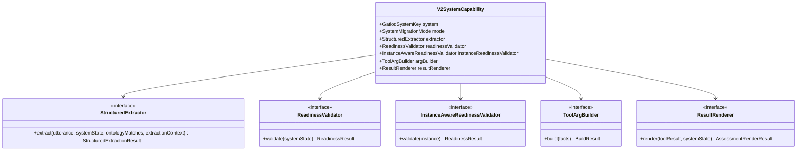
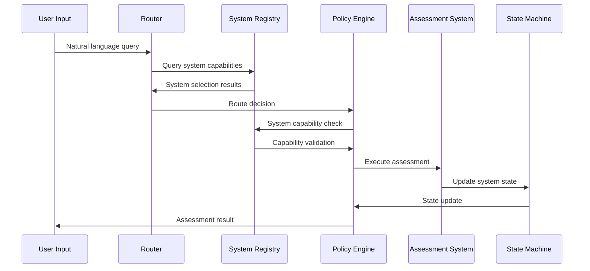
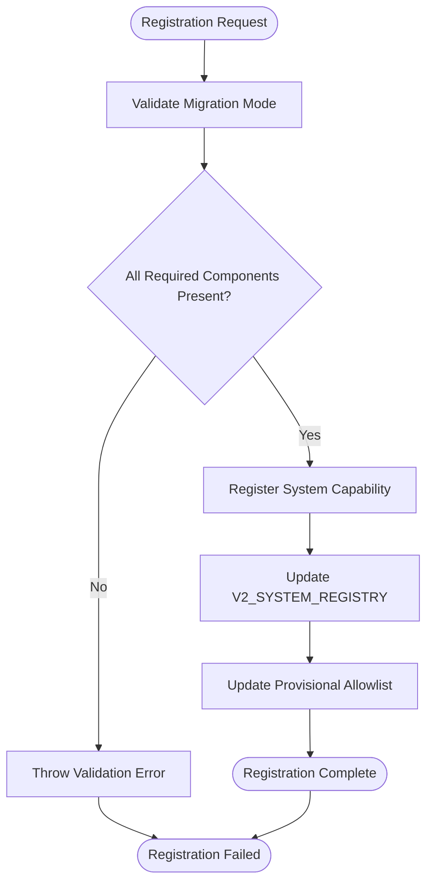
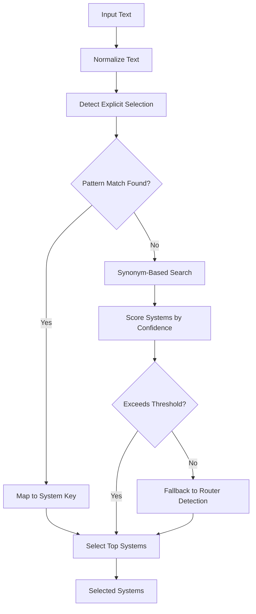
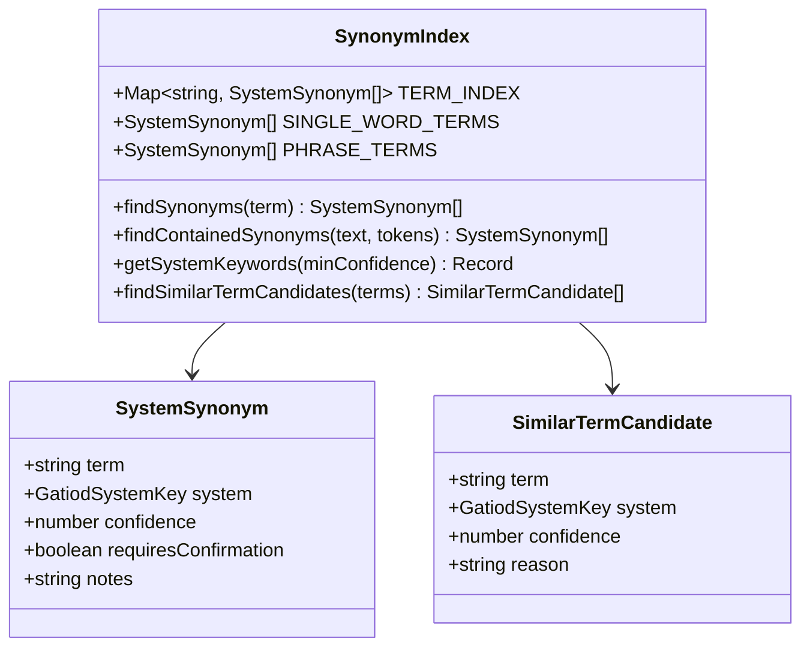
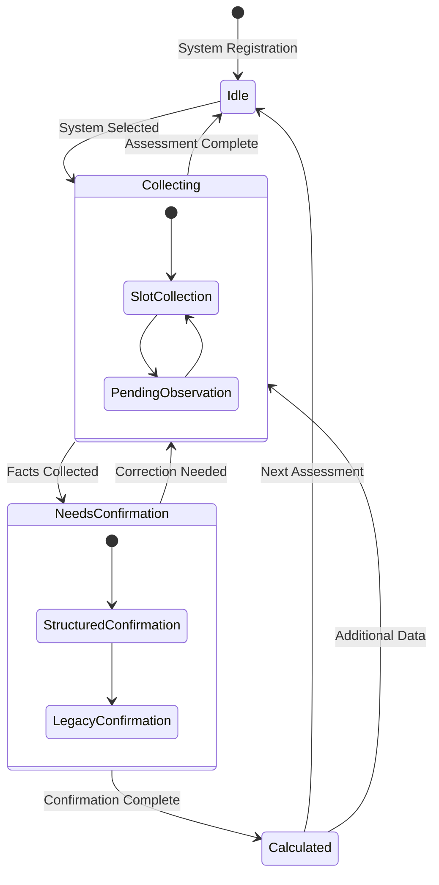
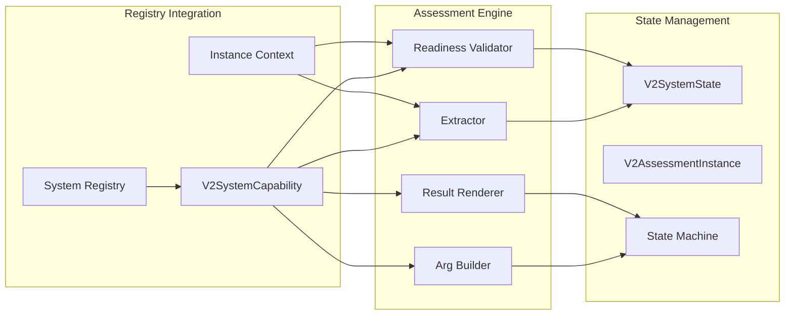
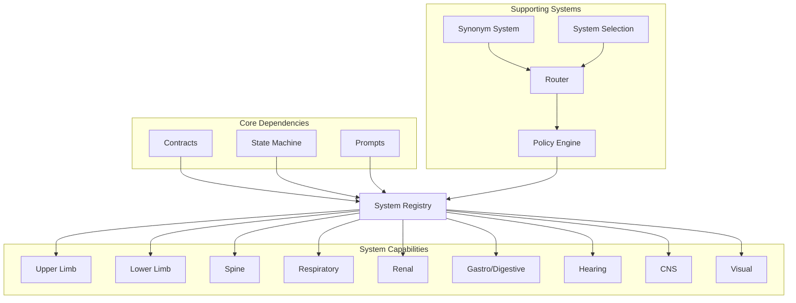

# System Registry

<cite>
**Referenced Files in This Document**
- [systemRegistry.ts](file://src/v2/systemRegistry.ts)
- [systemSelection.ts](file://src/v2/systemSelection.ts)
- [systemSynonyms.ts](file://src/v2/systemSynonyms.ts)
- [contracts.ts](file://src/v2/contracts.ts)
- [router.ts](file://src/v2/router.ts)
- [policyEngine.ts](file://src/v2/policyEngine.ts)
- [stateMachine.ts](file://src/v2/stateMachine.ts)
- [multiSystemState.ts](file://src/chat/multiSystemState.ts)
- [promptsV2.ts](file://src/chat/promptsV2.ts)
- [systemRegistry.test.ts](file://tests/v2/systemRegistry.test.ts)
- [routerSynonyms.test.ts](file://tests/v2/routerSynonyms.test.ts)
</cite>

## Table of Contents
1. [Introduction](#introduction)
2. [Project Structure](#project-structure)
3. [Core Components](#core-components)
4. [Architecture Overview](#architecture-overview)
5. [Detailed Component Analysis](#detailed-component-analysis)
6. [Dependency Analysis](#dependency-analysis)
7. [Performance Considerations](#performance-considerations)
8. [Troubleshooting Guide](#troubleshooting-guide)
9. [Conclusion](#conclusion)

## Introduction

The System Registry component is the central coordination hub for GATIOD's modular body system management architecture. It provides a standardized interface for registering, managing, and dynamically selecting assessment systems across nine distinct body systems: Upper Limb, Lower Limb, Spine, Respiratory, Renal, Gastro/Digestive, Hearing, CNS, and Visual. The registry implements a sophisticated system migration framework that supports three operational modes: legacy, structured_shadow, and structured_live, enabling gradual modernization of the assessment pipeline.

The registry serves as the foundation for GATIOD's multi-system capabilities, integrating seamlessly with the semantic consensus layer, natural language processing systems, and the broader V2 pipeline. It manages system lifecycle states, implements promotion mechanisms for structured assessment pathways, and provides robust synonym resolution for natural language understanding.

## Project Structure

The System Registry architecture follows a modular design pattern with clear separation of concerns:

**Diagram sources**
- [systemRegistry.ts:84-178](file://src/v2/systemRegistry.ts#L84-L178)
- [systemSynonyms.ts:19-270](file://src/v2/systemSynonyms.ts#L19-L270)
- [systemSelection.ts:10-56](file://src/v2/systemSelection.ts#L10-L56)

**Section sources**
- [systemRegistry.ts:1-368](file://src/v2/systemRegistry.ts#L1-L368)
- [contracts.ts:74-83](file://src/v2/contracts.ts#L74-L83)

## Core Components

### System Capability Interface

The System Capability interface defines the contract for each assessment system, supporting flexible migration strategies:

**Diagram sources**
- [systemRegistry.ts:72-82](file://src/v2/systemRegistry.ts#L72-L82)
- [systemRegistry.ts:55-70](file://src/v2/systemRegistry.ts#L55-L70)

### System Migration Modes

The registry implements a three-tier migration strategy:

| Mode | Description | Requirements | Use Case |
|------|-------------|--------------|----------|
| **legacy** | Traditional assessment mode | Full legacy tool integration | CNS, Visual systems |
| **structured_shadow** | Transitional validation mode | Extractor + readiness validator | Systems under evaluation |
| **structured_live** | Fully migrated assessment | Complete capability stack | Upper/Lower Limb, Spine, Respiratory, Renal, Gastro/Digestive, Hearing |

**Section sources**
- [systemRegistry.ts:43](file://src/v2/systemRegistry.ts#L43)
- [systemRegistry.ts:84-178](file://src/v2/systemRegistry.ts#L84-L178)

## Architecture Overview

The System Registry integrates with the broader GATIOD architecture through several key pathways:

**Diagram sources**
- [router.ts:135-266](file://src/v2/router.ts#L135-L266)
- [policyEngine.ts:93-563](file://src/v2/policyEngine.ts#L93-L563)
- [systemRegistry.ts:352-367](file://src/v2/systemRegistry.ts#L352-L367)

## Detailed Component Analysis

### System Registration Workflow

The system registration process follows a structured workflow ensuring proper capability validation and integration:

**Diagram sources**
- [systemRegistry.ts:352-367](file://src/v2/systemRegistry.ts#L352-L367)
- [systemRegistry.ts:266-327](file://src/v2/systemRegistry.ts#L266-L327)

### Dynamic System Selection Algorithm

The system selection algorithm employs multiple strategies for accurate body system identification:

**Diagram sources**
- [systemSelection.ts:44-56](file://src/v2/systemSelection.ts#L44-L56)
- [router.ts:87-133](file://src/v2/router.ts#L87-L133)

**Section sources**
- [systemSelection.ts:10-56](file://src/v2/systemSelection.ts#L10-L56)
- [router.ts:87-133](file://src/v2/router.ts#L87-L133)

### Synonym Resolution System

The synonym resolution system provides comprehensive natural language understanding across all body systems:

**Diagram sources**
- [systemSynonyms.ts:3-17](file://src/v2/systemSynonyms.ts#L3-L17)
- [systemSynonyms.ts:274-373](file://src/v2/systemSynonyms.ts#L274-L373)

**Section sources**
- [systemSynonyms.ts:19-270](file://src/v2/systemSynonyms.ts#L19-L270)
- [systemSynonyms.ts:285-329](file://src/v2/systemSynonyms.ts#L285-L329)

### System Lifecycle Management

The registry implements comprehensive system lifecycle management with state validation and capability checking:

**Diagram sources**
- [contracts.ts:183-292](file://src/v2/contracts.ts#L183-L292)
- [stateMachine.ts:44-56](file://src/v2/stateMachine.ts#L44-L56)

**Section sources**
- [contracts.ts:183-292](file://src/v2/contracts.ts#L183-L292)
- [stateMachine.ts:44-56](file://src/v2/stateMachine.ts#L44-L56)

### Integration Patterns with Assessment Engine

The registry integrates seamlessly with the assessment engine through standardized interfaces:

**Diagram sources**
- [systemRegistry.ts:72-82](file://src/v2/systemRegistry.ts#L72-L82)
- [stateMachine.ts:447-450](file://src/v2/stateMachine.ts#L447-L450)

**Section sources**
- [systemRegistry.ts:72-82](file://src/v2/systemRegistry.ts#L72-L82)
- [stateMachine.ts:447-450](file://src/v2/stateMachine.ts#L447-L450)

## Dependency Analysis

The System Registry maintains strategic dependencies that support modularity and maintainability:

**Diagram sources**
- [systemRegistry.ts:14-42](file://src/v2/systemRegistry.ts#L14-L42)
- [router.ts:1-8](file://src/v2/router.ts#L1-L8)

**Section sources**
- [systemRegistry.ts:14-42](file://src/v2/systemRegistry.ts#L14-L42)
- [router.ts:1-8](file://src/v2/router.ts#L1-L8)

## Performance Considerations

The System Registry is designed with several performance optimization strategies:

### Memory Management
- **Synonym Index**: Uses Map-based indexing for O(1) lookup performance
- **Capability Caching**: Static registry eliminates runtime construction overhead
- **State Hashing**: SHA-256 hashing for efficient state comparison

### Processing Efficiency
- **Early Termination**: System selection algorithms terminate on first match
- **Confidence Thresholds**: Prevent unnecessary processing for low-confidence matches
- **Lazy Loading**: System components loaded only when needed

### Scalability Features
- **Modular Design**: Independent system components prevent cascading failures
- **Asynchronous Operations**: Non-blocking operations for external integrations
- **Batch Processing**: Multiple system validation occurs in single passes

## Troubleshooting Guide

### Common Issues and Solutions

**System Registration Failures**
- **Symptom**: `structured_live` system missing required components
- **Cause**: Incomplete capability implementation
- **Solution**: Verify all four required components are implemented

**Synonym Resolution Problems**
- **Symptom**: Systems not recognized in natural language
- **Cause**: Missing or insufficient synonym entries
- **Solution**: Add comprehensive synonym mappings for system terms

**System Selection Errors**
- **Symptom**: Incorrect system selection
- **Cause**: Ambiguous terminology or pattern conflicts
- **Solution**: Review selection patterns and synonym priorities

**Migration Mode Issues**
- **Symptom**: Promotion validation failures
- **Cause**: Insufficient evidence or threshold violations
- **Solution**: Review ADR-0001 calibration reports and adjust thresholds

**Section sources**
- [systemRegistry.test.ts:11-156](file://tests/v2/systemRegistry.test.ts#L11-L156)
- [routerSynonyms.test.ts:1-183](file://tests/v2/routerSynonyms.test.ts#L1-183)

## Conclusion

The System Registry component represents a sophisticated architectural solution for managing GATIOD's modular body system assessment capabilities. Through its comprehensive interface design, dynamic selection algorithms, and robust synonym resolution system, it enables seamless integration of multiple assessment systems within a unified pipeline.

The registry's three-tier migration strategy provides a clear path for modernizing legacy systems while maintaining backward compatibility. Its integration with the semantic consensus layer, natural language processing systems, and state management infrastructure creates a cohesive ecosystem for multi-system assessment workflows.

Key strengths of the implementation include:
- **Modular Architecture**: Clean separation of concerns enables independent system development
- **Flexible Migration**: Support for gradual system modernization reduces risk
- **Robust Integration**: Comprehensive interfaces facilitate seamless system interaction
- **Performance Optimization**: Efficient algorithms and caching minimize processing overhead
- **Extensibility**: Well-defined patterns enable easy addition of new body systems

The System Registry establishes a solid foundation for GATIOD's advanced multi-system assessment capabilities, providing both immediate functionality and long-term architectural flexibility for future enhancements.