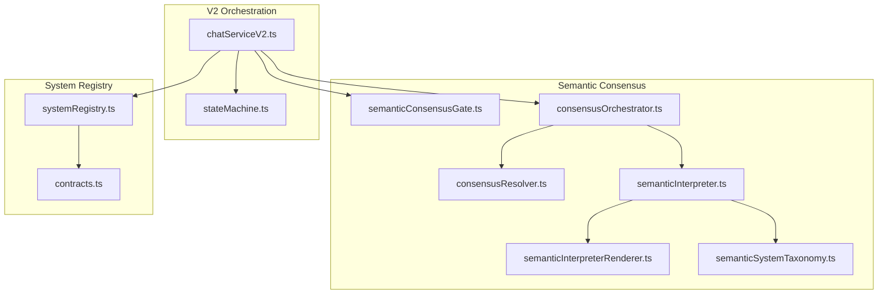
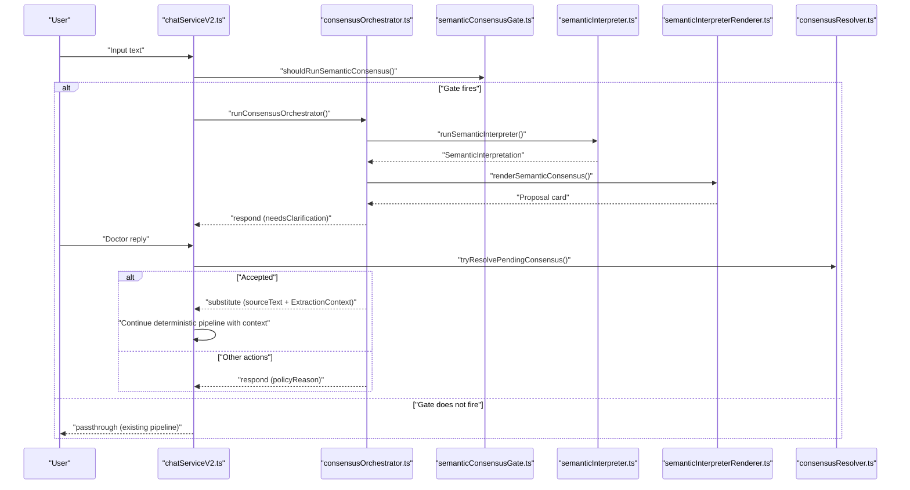
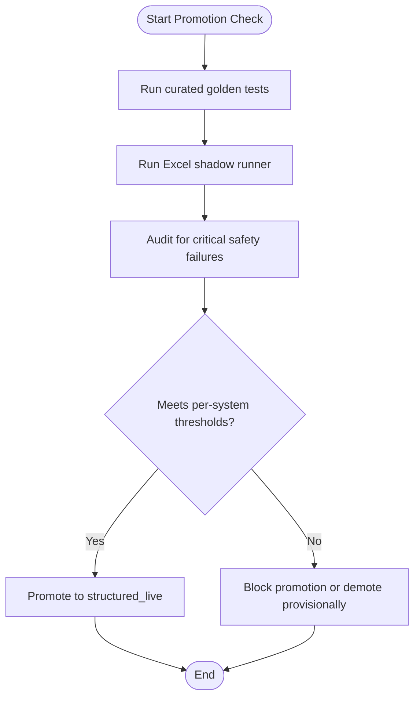
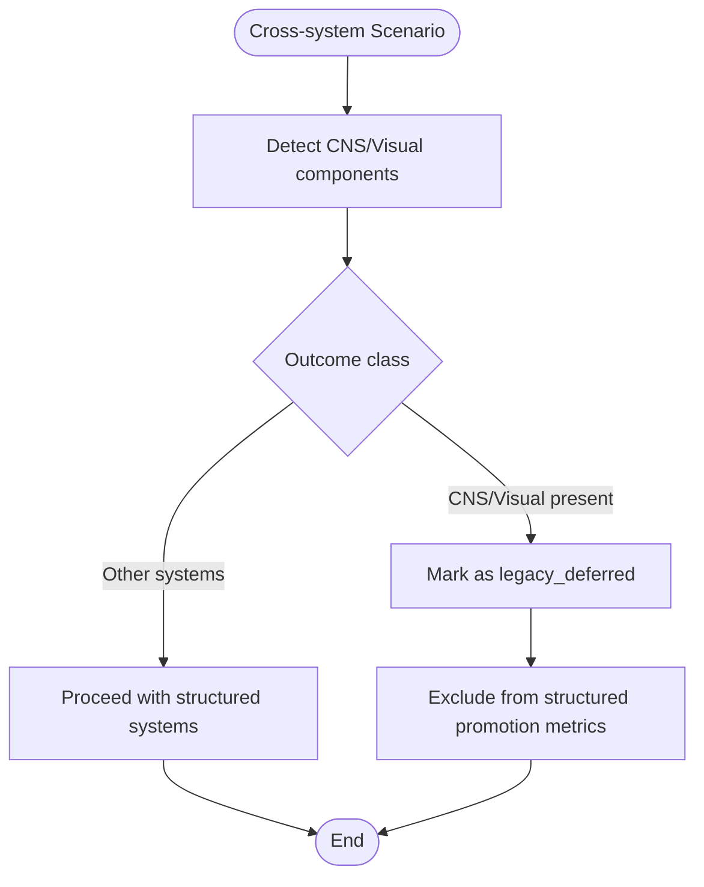
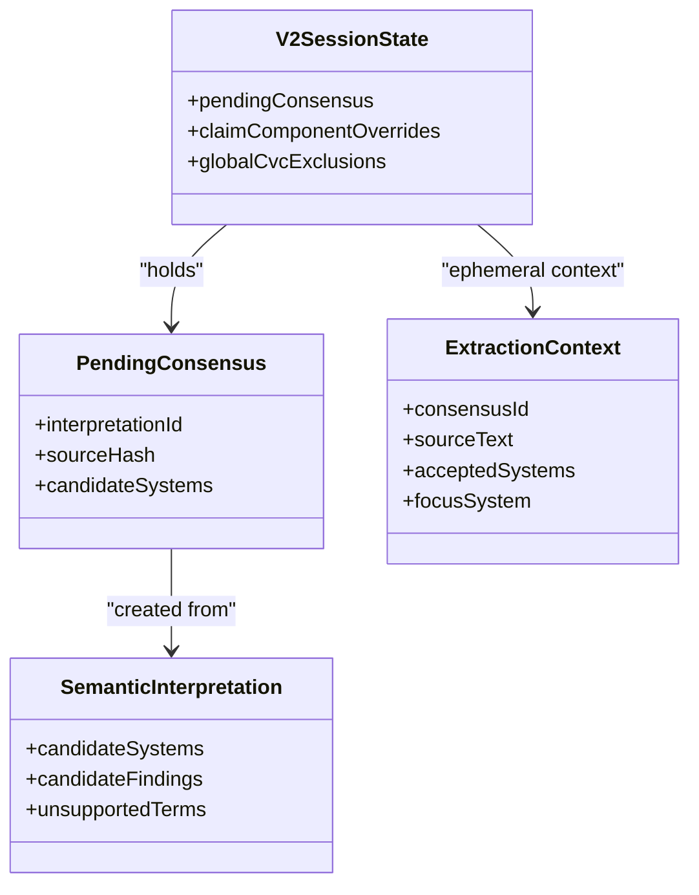
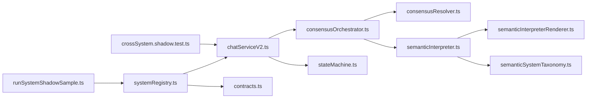

# Architectural Decision Records

<cite>
**Referenced Files in This Document**
- [0001-structured-live-promotion-gate.md](file://docs/adr/0001-structured-live-promotion-gate.md)
- [0002-cns-visual-structured-migration.md](file://docs/adr/0002-cns-visual-structured-migration.md)
- [0003-semantic-consensus-architecture.md](file://docs/adr/0003-semantic-consensus-architecture.md)
- [systemRegistry.ts](file://src/v2/systemRegistry.ts)
- [stateMachine.ts](file://src/v2/stateMachine.ts)
- [semanticConsensusGate.ts](file://src/v2/semanticConsensusGate.ts)
- [consensusResolver.ts](file://src/v2/consensusResolver.ts)
- [consensusOrchestrator.ts](file://src/v2/consensusOrchestrator.ts)
- [semanticInterpreter.ts](file://src/v2/semanticInterpreter.ts)
- [semanticInterpreterRenderer.ts](file://src/v2/semanticInterpreterRenderer.ts)
- [semanticSystemTaxonomy.ts](file://src/v2/semanticSystemTaxonomy.ts)
- [contracts.ts](file://src/v2/contracts.ts)
- [chatServiceV2.ts](file://src/chat/chatServiceV2.ts)
- [crossSystem.shadow.test.ts](file://tests/v2/excelScenarios/crossSystem.shadow.test.ts)
- [runSystemShadowSample.ts](file://tests/v2/excelScenarios/runSystemShadowSample.ts)
</cite>

## Table of Contents
1. [Introduction](#introduction)
2. [Project Structure](#project-structure)
3. [Core Components](#core-components)
4. [Architecture Overview](#architecture-overview)
5. [Detailed Component Analysis](#detailed-component-analysis)
6. [Dependency Analysis](#dependency-analysis)
7. [Performance Considerations](#performance-considerations)
8. [Troubleshooting Guide](#troubleshooting-guide)
9. [Conclusion](#conclusion)

## Introduction
This document presents the Architectural Decision Records (ADRs) that shaped the GATIOD Chat Assistant V2 design. It focuses on three key decisions:
- Structured-live promotion gate: a safety-certification requirement for systems to achieve “structured_live” status.
- CNS/Visual structured migration: a phased approach deferring two complex systems while preserving cross-system evidence.
- Semantic consensus architecture: a proposal-only LLM front door that safeguards deterministic extraction while enabling multi-system interpretation.

For each ADR, we explain the problem, alternatives considered, decision outcome, and consequences. We also analyze technical trade-offs, performance implications, and long-term architectural impact, with emphasis on how these decisions support medical-legal compliance.

## Project Structure
The repository organizes V2 logic under src/v2 with clear separation of concerns:
- System registry and capability mapping
- State machine and orchestration
- Semantic consensus layer (gate, interpreter, resolver, orchestrator)
- Contracts and types
- Chat service integration

Tests under tests/v2/excelScenarios implement shadow runners mirroring ADR-0001 promotion criteria, validating both single-system and cross-system flows.

**Diagram sources**
- [chatServiceV2.ts:474-540](file://src/chat/chatServiceV2.ts#L474-L540)
- [semanticConsensusGate.ts:206-277](file://src/v2/semanticConsensusGate.ts#L206-L277)
- [consensusOrchestrator.ts:179-332](file://src/v2/consensusOrchestrator.ts#L179-L332)
- [consensusResolver.ts:195-444](file://src/v2/consensusResolver.ts#L195-L444)
- [semanticInterpreter.ts:145-217](file://src/v2/semanticInterpreter.ts#L145-L217)
- [semanticInterpreterRenderer.ts:43-124](file://src/v2/semanticInterpreterRenderer.ts#L43-L124)
- [semanticSystemTaxonomy.ts:256-279](file://src/v2/semanticSystemTaxonomy.ts#L256-L279)
- [systemRegistry.ts:84-178](file://src/v2/systemRegistry.ts#L84-L178)
- [contracts.ts:596-615](file://src/v2/contracts.ts#L596-L615)

**Section sources**
- [systemRegistry.ts:84-178](file://src/v2/systemRegistry.ts#L84-L178)
- [contracts.ts:596-615](file://src/v2/contracts.ts#L596-L615)
- [chatServiceV2.ts:474-540](file://src/chat/chatServiceV2.ts#L474-L540)

## Core Components
- Structured-live promotion gate (ADR-0001): transforms “structured_live” from a wiring flag into a safety-certification state, enforced by curated goldens, Excel shadow runner, and zero-critical-failure policy.
- CNS/Visual structured migration (ADR-0002): defers CNS and Visual from structured_live until they implement structured extractors; cross-system rows containing these are classified as legacy_deferred and excluded from structured promotion metrics.
- Semantic consensus architecture (ADR-0003): introduces a deterministic semantic gate, a proposal-only LLM interpreter, a deterministic consensus resolver, and a consensus orchestrator that integrates with the existing deterministic pipeline.

**Section sources**
- [0001-structured-live-promotion-gate.md:11-56](file://docs/adr/0001-structured-live-promotion-gate.md#L11-L56)
- [0002-cns-visual-structured-migration.md:13-20](file://docs/adr/0002-cns-visual-structured-migration.md#L13-L20)
- [0003-semantic-consensus-architecture.md:21-37](file://docs/adr/0003-semantic-consensus-architecture.md#L21-L37)

## Architecture Overview
The semantic consensus layer sits before the deterministic pipeline and is gated by feature flags. When triggered, it proposes candidate systems and findings, collects doctor’s decision, and then threads a read-only extraction context into deterministic extractors.

**Diagram sources**
- [chatServiceV2.ts:474-540](file://src/chat/chatServiceV2.ts#L474-L540)
- [consensusOrchestrator.ts:179-332](file://src/v2/consensusOrchestrator.ts#L179-L332)
- [semanticConsensusGate.ts:206-277](file://src/v2/semanticConsensusGate.ts#L206-L277)
- [semanticInterpreter.ts:145-217](file://src/v2/semanticInterpreter.ts#L145-L217)
- [semanticInterpreterRenderer.ts:43-124](file://src/v2/semanticInterpreterRenderer.ts#L43-L124)
- [consensusResolver.ts:195-444](file://src/v2/consensusResolver.ts#L195-L444)

## Detailed Component Analysis

### ADR-0001: Structured-live promotion gate
- Problem: Seven systems were “live” based solely on wiring, without clinical scenario evidence. This risked silent failures, unsafe confirmations, or skipping global CVC.
- Alternatives:
  - Curated goldens only: cheap to author but easy to game.
  - Excel parametric only: high confidence but blocks sprints and conflates row-level noise with promotion failures.
- Decision: “structured_live” is a safety certification state requiring:
  - 100% curated golden tests per system
  - Excel shadow runner meeting per-system thresholds
  - Zero critical safety failures
- Metrics:
  - component_safe_outcome_rate (per system)
  - exact_calculation_rate (restricted to exact_calculation)
  - cross_system_end_to_end_rate (contextual, excluding legacy_deferred)
- Consequences:
  - Structured systems must re-earn “live” status under the gate.
  - Excel workbook becomes a load-bearing test fixture.
  - Inner-loop test speed preserved by default excluding shadow suite.

**Diagram sources**
- [0001-structured-live-promotion-gate.md:13-36](file://docs/adr/0001-structured-live-promotion-gate.md#L13-L36)
- [systemRegistry.ts:266-327](file://src/v2/systemRegistry.ts#L266-L327)

**Section sources**
- [0001-structured-live-promotion-gate.md:11-56](file://docs/adr/0001-structured-live-promotion-gate.md#L11-L56)
- [systemRegistry.ts:266-327](file://src/v2/systemRegistry.ts#L266-L327)
- [crossSystem.shadow.test.ts:139-266](file://tests/v2/excelScenarios/crossSystem.shadow.test.ts#L139-L266)
- [runSystemShadowSample.ts:100-186](file://tests/v2/excelScenarios/runSystemShadowSample.ts#L100-L186)

### ADR-0002: CNS/Visual structured migration
- Problem: CNS and Visual appear frequently in cross-system scenarios but lack structured extractors and readiness validators. Promoting them prematurely risks half-trusted state.
- Decision: CNS and Visual remain legacy until they implement structured extractors, readiness validators, arg builders, renderers, and instance models. Cross-system rows containing them are classified as legacy_deferred and excluded from structured promotion metrics.
- Consequences:
  - Current sprint avoids partial extraction-only implementations.
  - CNS/Visual rows provide routing and legacy_deferred evidence only.
  - Full migration requires dedicated follow-up sprints.

**Diagram sources**
- [0002-cns-visual-structured-migration.md:13-20](file://docs/adr/0002-cns-visual-structured-migration.md#L13-L20)
- [crossSystem.shadow.test.ts:128-137](file://tests/v2/excelScenarios/crossSystem.shadow.test.ts#L128-L137)

**Section sources**
- [0002-cns-visual-structured-migration.md:13-20](file://docs/adr/0002-cns-visual-structured-migration.md#L13-L20)
- [crossSystem.shadow.test.ts:128-137](file://tests/v2/excelScenarios/crossSystem.shadow.test.ts#L128-L137)

### ADR-0003: Semantic consensus architecture
- Problem: Dense multi-system narratives cause single-system routing and silent drops of findings. The product needs a layer that proposes “I think this is lower-limb nerve + CNS olfaction,” asks the doctor to confirm, then runs deterministic extraction.
- Decision: Introduce a proposal-only LLM front door:
  - Pipeline placement: normalize → pending-observation gate → pending-consensus gate → deterministic semantic gate → semantic interpreter → render proposal → STOP (for proposals) or continue deterministic pipeline.
  - Deterministic semantic gate: lexical and contextual triggers (multi-system, legacy/deferred signals, dense narrative, scope conflict, low confidence + unresolved terms).
  - Contract: schema-constrained structured output (Option A-prime), never assess_* tools, taxonomy from registry.
  - State shape: pendingConsensus, claimComponentOverrides, globalCvcExclusions in V2SessionState.
  - Consensus resolver: deterministic resolution of doctor replies into ordered actions.
  - Extraction context: read-only, ephemeral, passed to extractors.
  - Unified claim plan: deriveClaimAssessmentComponents drives the plan.
- Alternatives rejected:
  - Pure deterministic gate vs. LLM pre-classifier: deterministic preflight suffices and avoids cost/non-determinism.
  - Tool/function calling for interpreter: exposes execution risk; schema-constrained output is safer.
  - Prompt-only JSON output: weakens safety boundary; kept as fallback.
  - Hardcoded taxonomy: system status lives in registry; registry mode flips propagate automatically.
  - Fully stored claimComponents: duplicates V2SystemState; thin overlay + derivation is safer.
  - Expanding V2SystemStatus: mixing claim-level concepts with extraction states increases complexity.
  - LLM intent classifier for consensus replies: bounded resolution space; deterministic parsing is safer and faster.

**Diagram sources**
- [contracts.ts:387-403](file://src/v2/contracts.ts#L387-L403)
- [contracts.ts:468-484](file://src/v2/contracts.ts#L468-L484)
- [contracts.ts:372-383](file://src/v2/contracts.ts#L372-L383)
- [stateMachine.ts:282-290](file://src/v2/stateMachine.ts#L282-L290)

**Section sources**
- [0003-semantic-consensus-architecture.md:21-90](file://docs/adr/0003-semantic-consensus-architecture.md#L21-L90)
- [semanticConsensusGate.ts:206-277](file://src/v2/semanticConsensusGate.ts#L206-L277)
- [consensusResolver.ts:195-444](file://src/v2/consensusResolver.ts#L195-L444)
- [consensusOrchestrator.ts:179-332](file://src/v2/consensusOrchestrator.ts#L179-L332)
- [semanticInterpreter.ts:145-217](file://src/v2/semanticInterpreter.ts#L145-L217)
- [semanticInterpreterRenderer.ts:43-124](file://src/v2/semanticInterpreterRenderer.ts#L43-L124)
- [semanticSystemTaxonomy.ts:256-279](file://src/v2/semanticSystemTaxonomy.ts#L256-L279)
- [contracts.ts:315-595](file://src/v2/contracts.ts#L315-L595)
- [stateMachine.ts:282-318](file://src/v2/stateMachine.ts#L282-L318)

## Dependency Analysis
- System registry defines capabilities and modes; chatServiceV2 integrates with the registry and orchestrator.
- Semantic consensus components depend on contracts for types and on the registry for taxonomy/status.
- State machine manages session state, including consensus and claim-level overrides.
- Tests validate promotion thresholds and cross-system end-to-end behavior.

**Diagram sources**
- [systemRegistry.ts:84-178](file://src/v2/systemRegistry.ts#L84-L178)
- [chatServiceV2.ts:474-540](file://src/chat/chatServiceV2.ts#L474-L540)
- [consensusOrchestrator.ts:179-332](file://src/v2/consensusOrchestrator.ts#L179-L332)
- [consensusResolver.ts:195-444](file://src/v2/consensusResolver.ts#L195-L444)
- [semanticInterpreter.ts:145-217](file://src/v2/semanticInterpreter.ts#L145-L217)
- [semanticInterpreterRenderer.ts:43-124](file://src/v2/semanticInterpreterRenderer.ts#L43-L124)
- [semanticSystemTaxonomy.ts:256-279](file://src/v2/semanticSystemTaxonomy.ts#L256-L279)
- [stateMachine.ts:282-318](file://src/v2/stateMachine.ts#L282-L318)
- [crossSystem.shadow.test.ts:139-266](file://tests/v2/excelScenarios/crossSystem.shadow.test.ts#L139-L266)
- [runSystemShadowSample.ts:100-186](file://tests/v2/excelScenarios/runSystemShadowSample.ts#L100-L186)

**Section sources**
- [systemRegistry.ts:84-178](file://src/v2/systemRegistry.ts#L84-L178)
- [chatServiceV2.ts:474-540](file://src/chat/chatServiceV2.ts#L474-L540)
- [crossSystem.shadow.test.ts:139-266](file://tests/v2/excelScenarios/crossSystem.shadow.test.ts#L139-L266)
- [runSystemShadowSample.ts:100-186](file://tests/v2/excelScenarios/runSystemShadowSample.ts#L100-L186)

## Performance Considerations
- Deterministic semantic gate costs minimal time (regex and synonym scans) and avoids LLM calls.
- Feature flags keep semantic consensus off by default, preserving inner-loop performance.
- Shadow runners are opt-in via environment variables, preventing CI overhead unless needed.
- Read-only extraction context avoids persisting ephemeral data, reducing storage and serialization costs.

[No sources needed since this section provides general guidance]

## Troubleshooting Guide
Common issues and resolutions:
- Semantic gate not firing:
  - Verify SEMANTIC_CONSENSUS_ENABLED is set.
  - Ensure no pending states (consensus, confirmation, global CVC, observations).
  - Confirm input is not a short workflow reply.
- Interpreter not invoked:
  - Ensure SEMANTIC_INTERPRETER_ENABLED is set and model client is available.
  - Interpreter failures are captured and audited; the pipeline falls back to passthrough.
- Consensus resolution ambiguity:
  - Use explicit system selection patterns to guide resolution.
  - Review audit events for semantic_interpretation_edited, semantic_legacy_fallback_requested, etc.
- Promotion gate failures:
  - Validate curated golden sets and Excel shadow runner thresholds.
  - Check for critical safety failures in the evidence reports.

**Section sources**
- [semanticConsensusGate.ts:206-277](file://src/v2/semanticConsensusGate.ts#L206-L277)
- [consensusOrchestrator.ts:179-332](file://src/v2/consensusOrchestrator.ts#L179-L332)
- [consensusResolver.ts:195-444](file://src/v2/consensusResolver.ts#L195-L444)
- [systemRegistry.ts:266-327](file://src/v2/systemRegistry.ts#L266-L327)

## Conclusion
These ADRs establish a robust, safety-first foundation for GATIOD V2:
- ADR-0001 ensures “structured_live” reflects real-world evidence, not just wiring.
- ADR-0002 prevents premature promotion of complex systems, preserving auditability and safety.
- ADR-0003 introduces a deterministic semantic layer that augments rather than replaces the deterministic pipeline, enabling multi-system interpretation while maintaining strict safety boundaries.

Together, these decisions balance innovation with medical-legal compliance, auditability, and operational reliability.