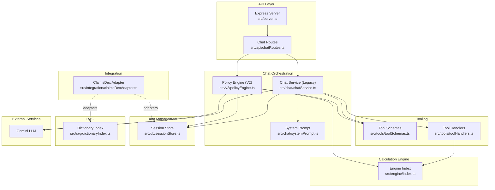
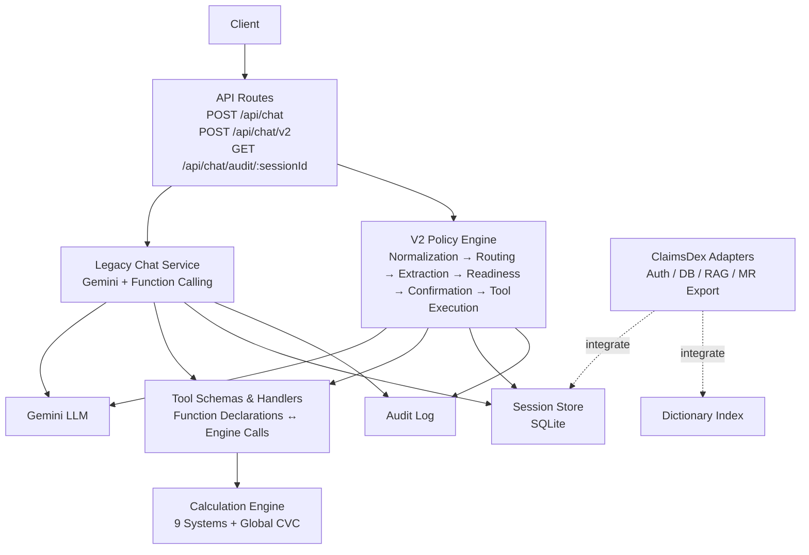
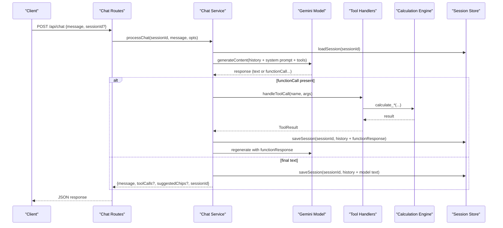
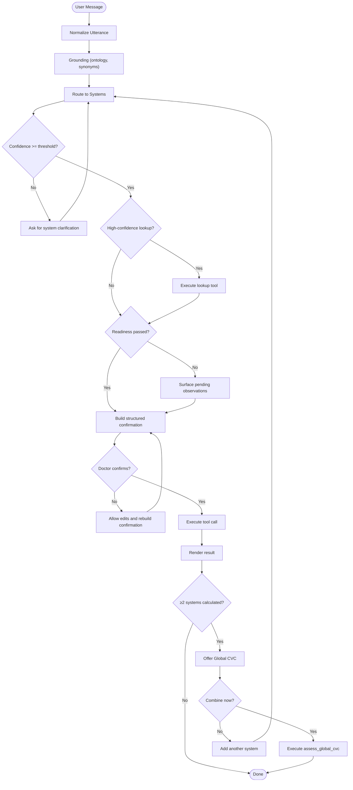
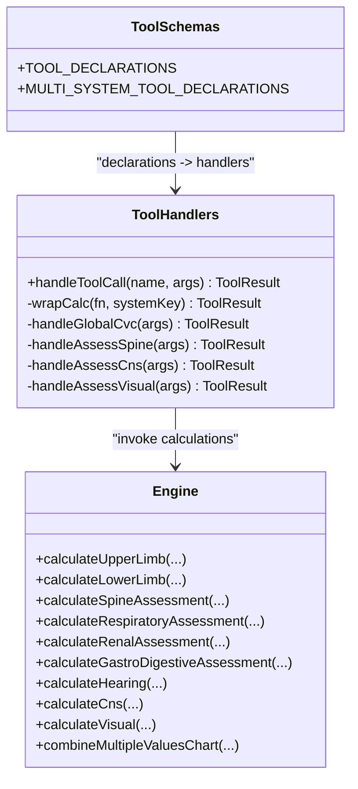
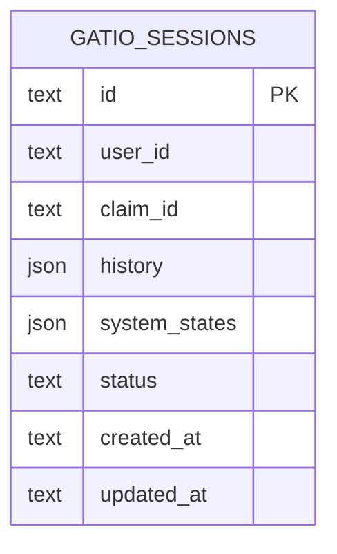
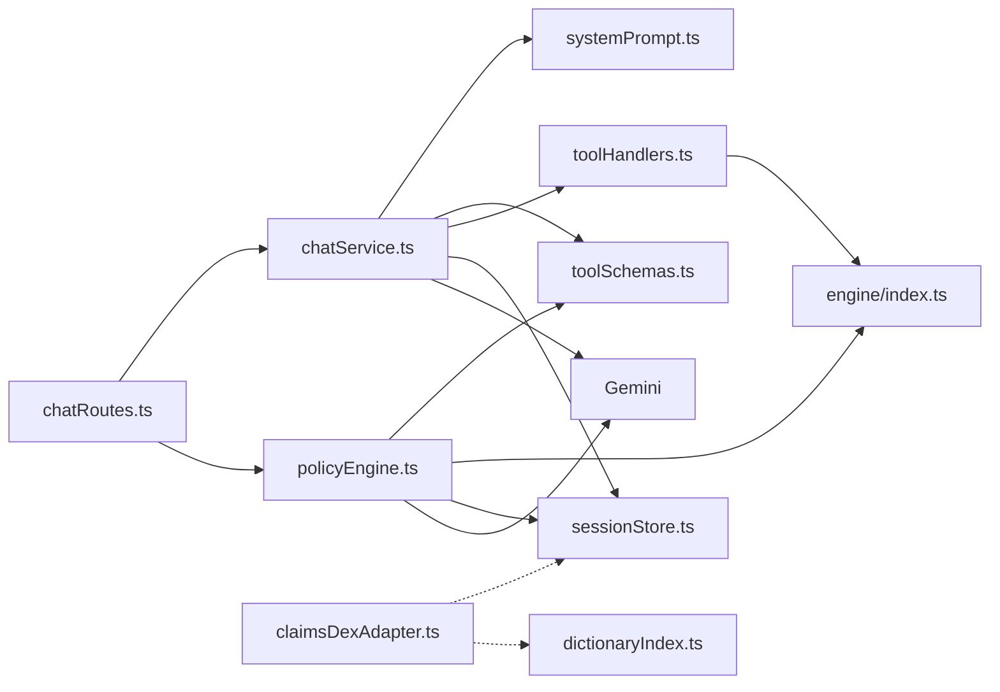

# Architecture Overview

<cite>
**Referenced Files in This Document**
- [server.ts](file://src/server.ts)
- [chatRoutes.ts](file://src/api/chatRoutes.ts)
- [chatService.ts](file://src/chat/chatService.ts)
- [systemPrompt.ts](file://src/chat/systemPrompt.ts)
- [toolSchemas.ts](file://src/tools/toolSchemas.ts)
- [toolHandlers.ts](file://src/tools/toolHandlers.ts)
- [engine/index.ts](file://src/engine/index.ts)
- [sessionStore.ts](file://src/db/sessionStore.ts)
- [claimsDexAdapter.ts](file://src/integration/claimsDexAdapter.ts)
- [dictionaryIndex.ts](file://src/rag/dictionaryIndex.ts)
- [geminiSemanticModelClient.ts](file://src/v2/geminiSemanticModelClient.ts)
- [policyEngine.ts](file://src/v2/policyEngine.ts)
- [0001-structured-live-promotion-gate.md](file://docs/adr/0001-structured-live-promotion-gate.md)
- [0002-cns-visual-structured-migration.md](file://docs/adr/0002-cns-visual-structured-migration.md)
- [0003-semantic-consensus-architecture.md](file://docs/adr/0003-semantic-consensus-architecture.md)
</cite>

## Table of Contents
1. [Introduction](#introduction)
2. [Project Structure](#project-structure)
3. [Core Components](#core-components)
4. [Architecture Overview](#architecture-overview)
5. [Detailed Component Analysis](#detailed-component-analysis)
6. [Dependency Analysis](#dependency-analysis)
7. [Performance Considerations](#performance-considerations)
8. [Troubleshooting Guide](#troubleshooting-guide)
9. [Conclusion](#conclusion)
10. [Appendices](#appendices)

## Introduction
This document presents the architecture of the GATIOD Chat Assistant system. The system integrates a chat orchestration layer with Gemini’s function-calling capabilities, a calculation engine implementing the GATIOD assessment rules, and a data management layer for sessions and auditability. It supports a dual-path design: a legacy chat flow and a modern V2 pipeline with structured extraction, readiness validation, and deterministic tool execution. External integrations include Gemini for reasoning and claimsDex adapters for authentication, database persistence, retrieval, and report export.

## Project Structure
The repository is organized into feature-focused packages:
- API and server bootstrap
- Chat orchestration (legacy and V2)
- Calculation engine (GATIOD systems and CVC)
- Data management (sessions, audit logs)
- Integration adapters (claimsDex)
- Retrieval-Augmented Dictionary (RAG)
- V2 semantic and orchestration modules

**Diagram sources**
- [server.ts:1-68](file://src/server.ts#L1-L68)
- [chatRoutes.ts:1-91](file://src/api/chatRoutes.ts#L1-L91)
- [chatService.ts:1-183](file://src/chat/chatService.ts#L1-L183)
- [systemPrompt.ts:1-391](file://src/chat/systemPrompt.ts#L1-L391)
- [toolSchemas.ts:1-487](file://src/tools/toolSchemas.ts#L1-L487)
- [toolHandlers.ts:1-435](file://src/tools/toolHandlers.ts#L1-L435)
- [engine/index.ts:1-89](file://src/engine/index.ts#L1-L89)
- [sessionStore.ts:1-110](file://src/db/sessionStore.ts#L1-L110)
- [claimsDexAdapter.ts:1-105](file://src/integration/claimsDexAdapter.ts#L1-L105)
- [dictionaryIndex.ts:1-75](file://src/rag/dictionaryIndex.ts#L1-L75)
- [policyEngine.ts:1-564](file://src/v2/policyEngine.ts#L1-L564)

**Section sources**
- [server.ts:1-68](file://src/server.ts#L1-L68)
- [chatRoutes.ts:1-91](file://src/api/chatRoutes.ts#L1-L91)

## Core Components
- Express server and routes: HTTP entry points, CORS, health checks, static serving, and route registration.
- Chat orchestration (legacy): Gemini-driven chat with function calling, session persistence, audit logging, and CHIPS suggestion injection.
- Chat orchestration (V2): Deterministic pipeline with normalization, grounding, routing, extraction, readiness, confirmation, tool execution, and rendering.
- Tool schemas and handlers: Define Gemini function signatures and map tool calls to engine calculations.
- Calculation engine: Pure functions implementing GATIOD rules across nine body systems and global CVC.
- Data management: SQLite-backed session store with JSON history and system states; audit trail for medico-legal traceability.
- Integration adapters: ClaimsDex-compatible interfaces for auth, session DB, RAG, and MR export.
- RAG dictionary: Lightweight keyword search over the GATIOD dictionary; replaceable with hybrid retriever in claimsDex.

**Section sources**
- [chatService.ts:1-183](file://src/chat/chatService.ts#L1-L183)
- [toolSchemas.ts:1-487](file://src/tools/toolSchemas.ts#L1-L487)
- [toolHandlers.ts:1-435](file://src/tools/toolHandlers.ts#L1-L435)
- [engine/index.ts:1-89](file://src/engine/index.ts#L1-L89)
- [sessionStore.ts:1-110](file://src/db/sessionStore.ts#L1-L110)
- [claimsDexAdapter.ts:1-105](file://src/integration/claimsDexAdapter.ts#L1-L105)
- [dictionaryIndex.ts:1-75](file://src/rag/dictionaryIndex.ts#L1-L75)
- [policyEngine.ts:1-564](file://src/v2/policyEngine.ts#L1-L564)

## Architecture Overview
The system is layered:
- Presentation and API: Express routes expose chat endpoints and session management.
- Orchestration: Legacy chat uses Gemini with function declarations; V2 uses a deterministic policy engine with structured extraction and readiness.
- Calculation: Tool handlers invoke pure engine functions; global CVC composes system subtotals.
- Data: Sessions and audit trails persisted to SQLite; optional claimsDex adapters replace local implementations.
- External services: Gemini for reasoning and structured output; claimsDex for platform services.

**Diagram sources**
- [chatRoutes.ts:14-91](file://src/api/chatRoutes.ts#L14-L91)
- [chatService.ts:38-154](file://src/chat/chatService.ts#L38-L154)
- [policyEngine.ts:93-563](file://src/v2/policyEngine.ts#L93-L563)
- [toolSchemas.ts:14-487](file://src/tools/toolSchemas.ts#L14-L487)
- [toolHandlers.ts:47-102](file://src/tools/toolHandlers.ts#L47-L102)
- [engine/index.ts:6-89](file://src/engine/index.ts#L6-L89)
- [sessionStore.ts:21-94](file://src/db/sessionStore.ts#L21-L94)
- [claimsDexAdapter.ts:93-105](file://src/integration/claimsDexAdapter.ts#L93-L105)
- [dictionaryIndex.ts:59-75](file://src/rag/dictionaryIndex.ts#L59-L75)

## Detailed Component Analysis

### Legacy Chat Orchestration (Gemini Function Calling)
The legacy path orchestrates a conversation with Gemini, using function declarations to invoke calculation functions and lookup utilities. It maintains session history, persists state, logs audit events, and injects suggested chips into responses.

**Diagram sources**
- [chatRoutes.ts:14-41](file://src/api/chatRoutes.ts#L14-L41)
- [chatService.ts:38-154](file://src/chat/chatService.ts#L38-L154)
- [toolHandlers.ts:47-102](file://src/tools/toolHandlers.ts#L47-L102)
- [engine/index.ts:6-89](file://src/engine/index.ts#L6-L89)
- [sessionStore.ts:21-44](file://src/db/sessionStore.ts#L21-L44)

**Section sources**
- [chatService.ts:38-154](file://src/chat/chatService.ts#L38-L154)
- [systemPrompt.ts:8-391](file://src/chat/systemPrompt.ts#L8-L391)
- [toolSchemas.ts:14-487](file://src/tools/toolSchemas.ts#L14-L487)

### V2 Policy Engine and Deterministic Flow
The V2 path uses a structured pipeline: normalize, grounding, routing, extraction, readiness, confirmation, tool execution, and rendering. It integrates with the same tool schemas and engine, but enforces readiness and confirmation deterministically, and supports global CVC orchestration.

**Diagram sources**
- [policyEngine.ts:93-563](file://src/v2/policyEngine.ts#L93-L563)
- [toolSchemas.ts:222-487](file://src/tools/toolSchemas.ts#L222-L487)
- [engine/index.ts:6-89](file://src/engine/index.ts#L6-L89)

**Section sources**
- [policyEngine.ts:93-563](file://src/v2/policyEngine.ts#L93-L563)

### Tool Calling Pattern and Function Declarators
Gemini tools are declared via schemas and mapped to handler functions. Handlers validate inputs, sanitize enums, and call engine functions, returning standardized results with system keys and final percent values.

**Diagram sources**
- [toolSchemas.ts:14-487](file://src/tools/toolSchemas.ts#L14-L487)
- [toolHandlers.ts:47-228](file://src/tools/toolHandlers.ts#L47-L228)
- [engine/index.ts:6-89](file://src/engine/index.ts#L6-L89)

**Section sources**
- [toolSchemas.ts:14-487](file://src/tools/toolSchemas.ts#L14-L487)
- [toolHandlers.ts:47-228](file://src/tools/toolHandlers.ts#L47-L228)

### Data Management and Auditability
Sessions are persisted to SQLite with JSON serialization of history and system states. Audit events capture session lifecycle, messages, tool calls, and errors. ClaimsDex adapters provide pluggable implementations for auth, DB, RAG, and MR export.

**Diagram sources**
- [sessionStore.ts:10-94](file://src/db/sessionStore.ts#L10-L94)

**Section sources**
- [sessionStore.ts:21-94](file://src/db/sessionStore.ts#L21-L94)
- [claimsDexAdapter.ts:9-105](file://src/integration/claimsDexAdapter.ts#L9-L105)

### Integration with External Services
- Gemini: Used for both legacy function-calling and V2 semantic interpretation. The semantic client enforces JSON mode and deterministic temperature.
- claimsDex: Adapters enable replacing local implementations with platform-native services for auth, DB, RAG, and MR export.

**Section sources**
- [geminiSemanticModelClient.ts:26-74](file://src/v2/geminiSemanticModelClient.ts#L26-L74)
- [claimsDexAdapter.ts:9-105](file://src/integration/claimsDexAdapter.ts#L9-L105)

## Dependency Analysis
The system exhibits clear layering and separation of concerns:
- API depends on chat services and routes.
- Chat services depend on Gemini SDK, tool schemas, tool handlers, and session store.
- Tool handlers depend on engine exports and RAG dictionary.
- V2 policy engine depends on tool schemas, engine, and session store.
- Integration adapters decouple platform-specific services from core logic.

**Diagram sources**
- [chatRoutes.ts:14-91](file://src/api/chatRoutes.ts#L14-L91)
- [chatService.ts:6-17](file://src/chat/chatService.ts#L6-L17)
- [toolSchemas.ts:14-487](file://src/tools/toolSchemas.ts#L14-L487)
- [toolHandlers.ts:6-40](file://src/tools/toolHandlers.ts#L6-L40)
- [engine/index.ts:6-89](file://src/engine/index.ts#L6-L89)
- [sessionStore.ts:7-94](file://src/db/sessionStore.ts#L7-L94)
- [claimsDexAdapter.ts:9-105](file://src/integration/claimsDexAdapter.ts#L9-L105)
- [dictionaryIndex.ts:6-75](file://src/rag/dictionaryIndex.ts#L6-L75)
- [policyEngine.ts:1-22](file://src/v2/policyEngine.ts#L1-L22)

**Section sources**
- [chatService.ts:6-17](file://src/chat/chatService.ts#L6-L17)
- [toolHandlers.ts:6-40](file://src/tools/toolHandlers.ts#L6-L40)
- [engine/index.ts:6-89](file://src/engine/index.ts#L6-L89)
- [policyEngine.ts:1-22](file://src/v2/policyEngine.ts#L1-L22)

## Performance Considerations
- Retry and backoff: Legacy chat retries Gemini calls with exponential delay to mitigate transient failures.
- Deterministic V2: Reduces variability by avoiding LLM calls for routing and confirmation, improving throughput and latency.
- JSON mode and schema constraints: V2 semantic client ensures structured output, reducing parsing overhead.
- Session persistence: JSON serialization of history is straightforward; consider binary formats or streaming for very long histories.
- RAG: Dictionary search is O(n) over ~600 entries; claimsDex integration can replace with BM25 + embeddings for scalability.

[No sources needed since this section provides general guidance]

## Troubleshooting Guide
- Environment configuration:
  - Missing Gemini API key causes immediate failure in legacy chat.
  - Feature flags (e.g., GATIOD_CHAT_ENABLED) gate chat availability.
- Rate limits and timeouts:
  - Legacy chat surfaces user-friendly messages for quota and connectivity issues.
- Session persistence:
  - Ensure SQLite is initialized and accessible; verify migrations and permissions.
- Tool call errors:
  - Handlers return structured ToolResult with success/error fields; inspect audit logs for tool invocation outcomes.
- V2 readiness and confirmation:
  - Failures in readiness validators or confirmation builders surface clarification questions; ensure extracted facts meet requirements.

**Section sources**
- [chatService.ts:43-96](file://src/chat/chatService.ts#L43-L96)
- [claimsDexAdapter.ts:87-89](file://src/integration/claimsDexAdapter.ts#L87-L89)
- [sessionStore.ts:21-44](file://src/db/sessionStore.ts#L21-L44)
- [toolHandlers.ts:96-102](file://src/tools/toolHandlers.ts#L96-L102)
- [policyEngine.ts:192-304](file://src/v2/policyEngine.ts#L192-L304)

## Conclusion
The GATIOD Chat Assistant employs a layered architecture that cleanly separates chat orchestration, calculation, and data management. The legacy path leverages Gemini’s function calling for flexible tool invocation, while the V2 path introduces deterministic orchestration with structured extraction and readiness checks. Integration adapters enable portability to claimsDex, and architectural decision records formalize promotion gates and semantic consensus design. Together, these choices balance flexibility, safety, and portability for clinical assessment automation.

[No sources needed since this section summarizes without analyzing specific files]

## Appendices

### Architectural Decision Records
- Structured-live promotion gate: Promotion to structured_live requires curated golden tests, Excel scenario coverage, and zero critical safety failures.
- CNS and Visual structured migration: CNS and Visual remain legacy; cross-system rows classify their components as legacy_deferred for structured systems.
- Semantic consensus architecture: Adds a proposal-only LLM front door before the deterministic pipeline, with schema-constrained structured output and deterministic consensus resolution.

**Section sources**
- [0001-structured-live-promotion-gate.md:1-73](file://docs/adr/0001-structured-live-promotion-gate.md#L1-L73)
- [0002-cns-visual-structured-migration.md:1-33](file://docs/adr/0002-cns-visual-structured-migration.md#L1-L33)
- [0003-semantic-consensus-architecture.md:1-98](file://docs/adr/0003-semantic-consensus-architecture.md#L1-L98)