# Component Relationships and Integration

<cite>
**Referenced Files in This Document**
- [server.ts](file://src/server.ts)
- [chatRoutes.ts](file://src/api/chatRoutes.ts)
- [chatService.ts](file://src/chat/chatService.ts)
- [chatServiceV2.ts](file://src/chat/chatServiceV2.ts)
- [multiSystemState.ts](file://src/chat/multiSystemState.ts)
- [systemPrompt.ts](file://src/chat/systemPrompt.ts)
- [database.ts](file://src/db/database.ts)
- [sessionStore.ts](file://src/db/sessionStore.ts)
- [auditLog.ts](file://src/db/auditLog.ts)
- [claimsDexAdapter.ts](file://src/integration/claimsDexAdapter.ts)
- [toolHandlers.ts](file://src/tools/toolHandlers.ts)
- [toolSchemas.ts](file://src/tools/toolSchemas.ts)
- [dictionaryIndex.ts](file://src/rag/dictionaryIndex.ts)
- [hybridRetriever.ts](file://src/v2/hybridRetriever.ts)
- [geminiSemanticModelClient.ts](file://src/v2/geminiSemanticModelClient.ts)
- [semanticInterpreter.ts](file://src/v2/semanticInterpreter.ts)
</cite>

## Table of Contents
1. [Introduction](#introduction)
2. [Project Structure](#project-structure)
3. [Core Components](#core-components)
4. [Architecture Overview](#architecture-overview)
5. [Detailed Component Analysis](#detailed-component-analysis)
6. [Dependency Analysis](#dependency-analysis)
7. [Performance Considerations](#performance-considerations)
8. [Troubleshooting Guide](#troubleshooting-guide)
9. [Conclusion](#conclusion)

## Introduction
This document explains how the GATIOD Chat Assistant system components interact and collaborate. It covers the chat service orchestration, API endpoint responsibilities, database layer integration, external service connections, integration patterns with Gemini LLM, claimsDex platform, and session management. It also details dependency injection patterns, event-driven audit logging, and state management across components, including sequence diagrams and interaction patterns for common use cases.

## Project Structure
The system is organized into cohesive layers:
- API layer: Express routes for chat and session management
- Chat orchestration: Legacy (V1) and modern (V2) chat services
- Tooling: Function schemas and handlers bridging LLM tool calls to calculation engines
- Data layer: SQLite-backed session store and audit log
- Integration adapters: ClaimsDex integration hooks for auth, DB, RAG, and MR export
- Retrieval: Dictionary search (MVP) and hybrid retriever (V2)
- LLM integration: Gemini client and semantic interpreter

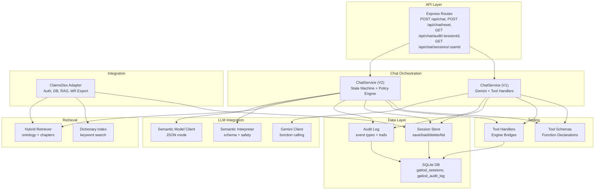

**Diagram sources**
- [server.ts:10-20](file://src/server.ts#L10-L20)
- [chatRoutes.ts:14-90](file://src/api/chatRoutes.ts#L14-L90)
- [chatService.ts:38-154](file://src/chat/chatService.ts#L38-L154)
- [chatServiceV2.ts:258-1041](file://src/chat/chatServiceV2.ts#L258-L1041)
- [toolSchemas.ts:14-486](file://src/tools/toolSchemas.ts#L14-L486)
- [toolHandlers.ts:47-102](file://src/tools/toolHandlers.ts#L47-L102)
- [sessionStore.ts:21-109](file://src/db/sessionStore.ts#L21-L109)
- [auditLog.ts:58-90](file://src/db/auditLog.ts#L58-L90)
- [database.ts:11-49](file://src/db/database.ts#L11-L49)
- [claimsDexAdapter.ts:9-105](file://src/integration/claimsDexAdapter.ts#L9-L105)
- [dictionaryIndex.ts:59-74](file://src/rag/dictionaryIndex.ts#L59-L74)
- [hybridRetriever.ts:5-24](file://src/v2/hybridRetriever.ts#L5-L24)
- [geminiSemanticModelClient.ts:26-73](file://src/v2/geminiSemanticModelClient.ts#L26-L73)
- [semanticInterpreter.ts:145-217](file://src/v2/semanticInterpreter.ts#L145-L217)

**Section sources**
- [server.ts:10-43](file://src/server.ts#L10-L43)
- [chatRoutes.ts:12-90](file://src/api/chatRoutes.ts#L12-L90)

## Core Components
- Express server initializes routes, database, and validates system registry before serving requests.
- API routes expose chat endpoints, session reset, audit trail retrieval, and user session listing.
- ChatService (V1) orchestrates Gemini with function calling, manages session persistence, and logs audit events.
- ChatService (V2) implements a state machine, policy engine, semantic interpreter, and hybrid retrieval for structured extraction and multi-system orchestration.
- Tool schemas define function signatures for Gemini; tool handlers bridge to calculation engines and return structured results.
- Session store persists chat histories and system states; audit log captures all assessment events for traceability.
- ClaimsDex adapter defines integration interfaces for auth, DB, RAG, and MR export; standalone implementations are provided for MVP.
- Retrieval layer includes a simple dictionary index (MVP) and a hybrid retriever (V2) combining ontology and chapter grounding.
- LLM integration includes a Gemini client for function calling and a semantic interpreter with JSON schema validation and safety checks.

**Section sources**
- [server.ts:45-68](file://src/server.ts#L45-L68)
- [chatRoutes.ts:14-90](file://src/api/chatRoutes.ts#L14-L90)
- [chatService.ts:38-154](file://src/chat/chatService.ts#L38-L154)
- [chatServiceV2.ts:258-1041](file://src/chat/chatServiceV2.ts#L258-L1041)
- [toolSchemas.ts:14-486](file://src/tools/toolSchemas.ts#L14-L486)
- [toolHandlers.ts:47-102](file://src/tools/toolHandlers.ts#L47-L102)
- [sessionStore.ts:21-109](file://src/db/sessionStore.ts#L21-L109)
- [auditLog.ts:58-90](file://src/db/auditLog.ts#L58-L90)
- [claimsDexAdapter.ts:9-105](file://src/integration/claimsDexAdapter.ts#L9-L105)
- [dictionaryIndex.ts:59-74](file://src/rag/dictionaryIndex.ts#L59-L74)
- [hybridRetriever.ts:5-24](file://src/v2/hybridRetriever.ts#L5-L24)
- [geminiSemanticModelClient.ts:26-73](file://src/v2/geminiSemanticModelClient.ts#L26-L73)
- [semanticInterpreter.ts:145-217](file://src/v2/semanticInterpreter.ts#L145-L217)

## Architecture Overview
The system follows an event-driven, layered architecture:
- API layer exposes REST endpoints and static assets in production.
- Chat orchestration layers (V1 and V2) encapsulate conversational logic, tool orchestration, and state transitions.
- Data layer persists sessions and audit trails with SQLite.
- Integration adapters enable platform-specific replacements for auth, DB, RAG, and MR export.
- Retrieval augments conversations with grounded context via dictionary search and hybrid retrieval.
- LLM integrations leverage function calling and semantic interpretation with strict schema and safety controls.

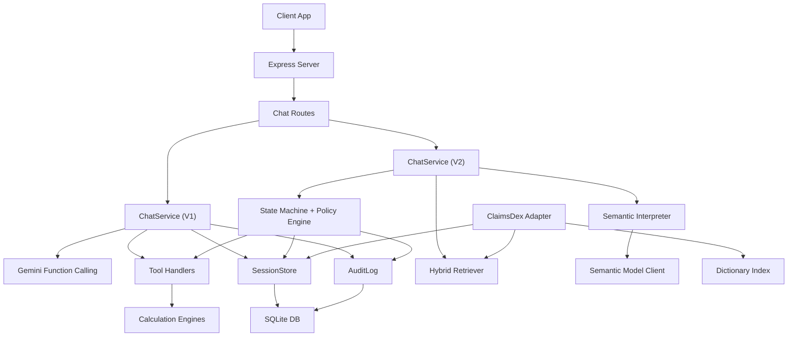

**Diagram sources**
- [server.ts:10-20](file://src/server.ts#L10-L20)
- [chatRoutes.ts:14-90](file://src/api/chatRoutes.ts#L14-L90)
- [chatService.ts:38-154](file://src/chat/chatService.ts#L38-L154)
- [chatServiceV2.ts:258-1041](file://src/chat/chatServiceV2.ts#L258-L1041)
- [hybridRetriever.ts:5-24](file://src/v2/hybridRetriever.ts#L5-L24)
- [semanticInterpreter.ts:145-217](file://src/v2/semanticInterpreter.ts#L145-L217)
- [geminiSemanticModelClient.ts:26-73](file://src/v2/geminiSemanticModelClient.ts#L26-L73)
- [sessionStore.ts:21-109](file://src/db/sessionStore.ts#L21-L109)
- [auditLog.ts:58-90](file://src/db/auditLog.ts#L58-L90)
- [claimsDexAdapter.ts:9-105](file://src/integration/claimsDexAdapter.ts#L9-L105)
- [dictionaryIndex.ts:59-74](file://src/rag/dictionaryIndex.ts#L59-L74)

## Detailed Component Analysis

### API Layer and Entry Points
- The Express server registers CORS, JSON parsing, chat routes, health checks, and static asset serving in production.
- Chat routes validate inputs, manage session IDs, and support shadow mode for V2 evaluation.
- Reset endpoint clears sessions; audit and session listing endpoints support traceability and resumption.

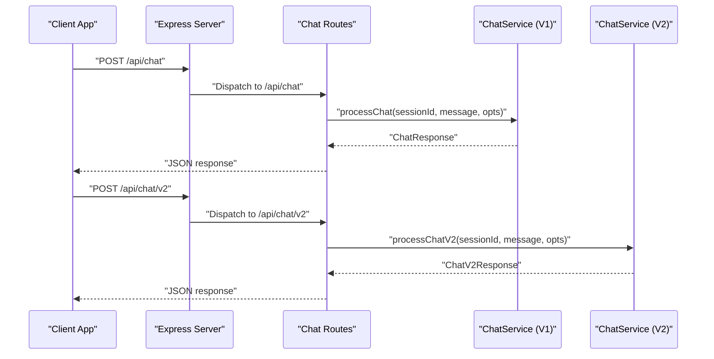

**Diagram sources**
- [server.ts:10-20](file://src/server.ts#L10-L20)
- [chatRoutes.ts:14-66](file://src/api/chatRoutes.ts#L14-L66)
- [chatService.ts:38-154](file://src/chat/chatService.ts#L38-L154)
- [chatServiceV2.ts:258-1041](file://src/chat/chatServiceV2.ts#L258-L1041)

**Section sources**
- [server.ts:10-20](file://src/server.ts#L10-L20)
- [chatRoutes.ts:14-90](file://src/api/chatRoutes.ts#L14-L90)

### Chat Service Orchestration (V1)
- Loads or creates sessions, logs audit events, and persists before calling Gemini.
- Implements a retry loop for Gemini calls and handles safety flags and timeouts.
- Extracts CHIPS from responses and returns structured results with tool call metadata.

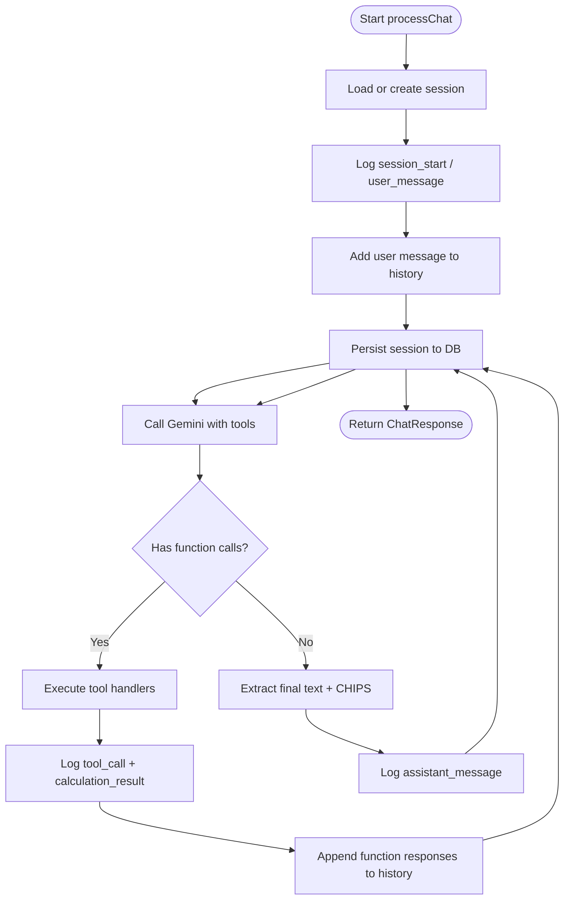

**Diagram sources**
- [chatService.ts:38-154](file://src/chat/chatService.ts#L38-L154)
- [auditLog.ts:58-90](file://src/db/auditLog.ts#L58-L90)
- [sessionStore.ts:21-84](file://src/db/sessionStore.ts#L21-L84)

**Section sources**
- [chatService.ts:38-154](file://src/chat/chatService.ts#L38-L154)
- [auditLog.ts:58-90](file://src/db/auditLog.ts#L58-L90)
- [sessionStore.ts:21-84](file://src/db/sessionStore.ts#L21-L84)

### Chat Service Orchestration (V2)
- Normalizes clinical utterances, resolves pending observations, and runs consensus orchestration.
- Performs grounding via hybrid retriever, routes utterances, and executes policy decisions.
- Manages multi-system state, structured confirmations, and global CVC offers.
- Integrates semantic interpreter with deterministic JSON mode and safety validation.

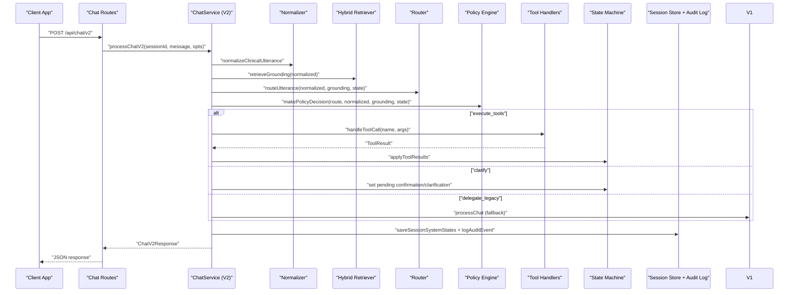

**Diagram sources**
- [chatServiceV2.ts:258-1041](file://src/chat/chatServiceV2.ts#L258-L1041)
- [hybridRetriever.ts:5-24](file://src/v2/hybridRetriever.ts#L5-L24)
- [toolHandlers.ts:47-102](file://src/tools/toolHandlers.ts#L47-L102)
- [sessionStore.ts:21-84](file://src/db/sessionStore.ts#L21-L84)
- [auditLog.ts:58-90](file://src/db/auditLog.ts#L58-L90)

**Section sources**
- [chatServiceV2.ts:258-1041](file://src/chat/chatServiceV2.ts#L258-L1041)
- [hybridRetriever.ts:5-24](file://src/v2/hybridRetriever.ts#L5-L24)
- [toolHandlers.ts:47-102](file://src/tools/toolHandlers.ts#L47-L102)

### Tooling and Function Calling
- Tool schemas define function declarations for Gemini, covering all 9 GATIOD systems and lookup utilities.
- Tool handlers map LLM function calls to engine calculations, sanitizing outputs and aggregating results.

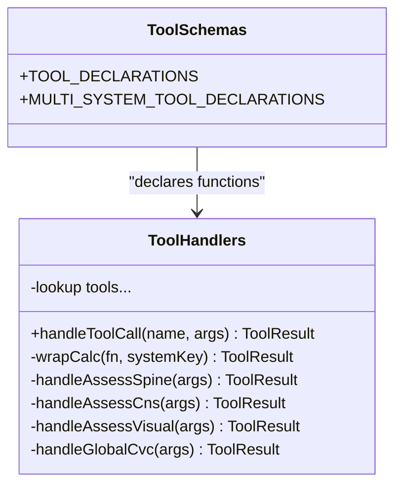

**Diagram sources**
- [toolSchemas.ts:14-486](file://src/tools/toolSchemas.ts#L14-L486)
- [toolHandlers.ts:47-102](file://src/tools/toolHandlers.ts#L47-L102)

**Section sources**
- [toolSchemas.ts:14-486](file://src/tools/toolSchemas.ts#L14-L486)
- [toolHandlers.ts:47-102](file://src/tools/toolHandlers.ts#L47-L102)

### Database Layer Integration
- SQLite initialization sets journal mode and busy timeouts; schema includes sessions and audit log tables.
- Session store persists chat histories and system states, supports listing, completion, and abandonment.
- Audit log records all assessment events with typed event categories and JSON payloads.

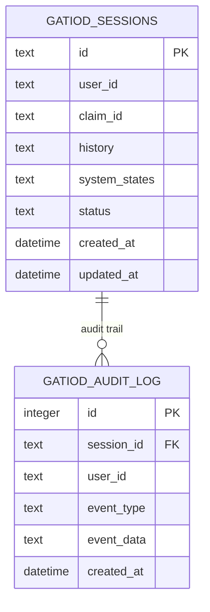

**Diagram sources**
- [database.ts:20-46](file://src/db/database.ts#L20-L46)
- [sessionStore.ts:21-109](file://src/db/sessionStore.ts#L21-L109)
- [auditLog.ts:58-90](file://src/db/auditLog.ts#L58-L90)

**Section sources**
- [database.ts:11-49](file://src/db/database.ts#L11-L49)
- [sessionStore.ts:21-109](file://src/db/sessionStore.ts#L21-L109)
- [auditLog.ts:58-90](file://src/db/auditLog.ts#L58-L90)

### Integration Patterns with ClaimsDex Platform
- ClaimsDex adapter defines pluggable interfaces for auth, session DB, RAG, and MR export.
- Standalone implementations are provided for MVP; claimsDex replaces them with platform-native services.
- Integration config exposes feature flags and adapter wiring.

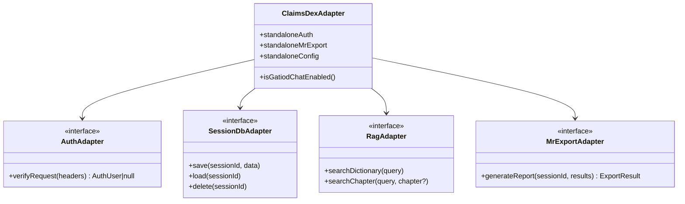

**Diagram sources**
- [claimsDexAdapter.ts:9-105](file://src/integration/claimsDexAdapter.ts#L9-L105)

**Section sources**
- [claimsDexAdapter.ts:9-105](file://src/integration/claimsDexAdapter.ts#L9-L105)

### Session Management and State
- Sessions persist across restarts and support resumption; system states track multi-system orchestration.
- Multi-system state computes global CVC across calculated systems.

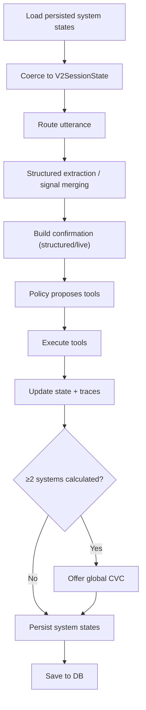

**Diagram sources**
- [chatServiceV2.ts:258-1041](file://src/chat/chatServiceV2.ts#L258-L1041)
- [multiSystemState.ts:68-94](file://src/chat/multiSystemState.ts#L68-L94)
- [sessionStore.ts:21-84](file://src/db/sessionStore.ts#L21-L84)

**Section sources**
- [chatServiceV2.ts:258-1041](file://src/chat/chatServiceV2.ts#L258-L1041)
- [multiSystemState.ts:68-94](file://src/chat/multiSystemState.ts#L68-L94)
- [sessionStore.ts:21-84](file://src/db/sessionStore.ts#L21-L84)

### Retrieval and Grounding
- Dictionary index provides keyword search over the GATIOD dictionary (MVP).
- Hybrid retriever combines ontology matches and chapter citations for grounding.

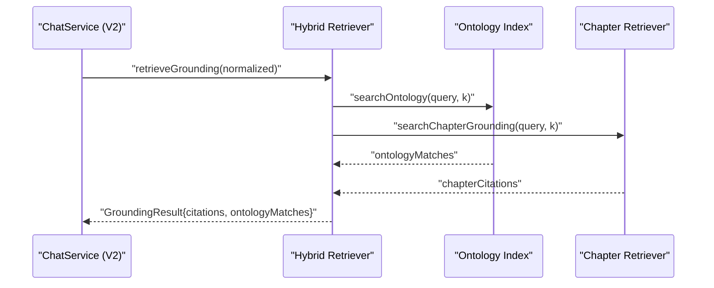

**Diagram sources**
- [chatServiceV2.ts:258-1041](file://src/chat/chatServiceV2.ts#L258-L1041)
- [hybridRetriever.ts:5-24](file://src/v2/hybridRetriever.ts#L5-L24)

**Section sources**
- [dictionaryIndex.ts:59-74](file://src/rag/dictionaryIndex.ts#L59-L74)
- [hybridRetriever.ts:5-24](file://src/v2/hybridRetriever.ts#L5-L24)

### LLM Integration with Gemini and Semantic Interpreter
- Gemini client supports function calling with system instructions and tool schemas.
- Semantic interpreter enforces deterministic JSON mode, schema validation, and safety checks.
- Lazy construction ensures API key presence is only required when the semantic interpreter is enabled.

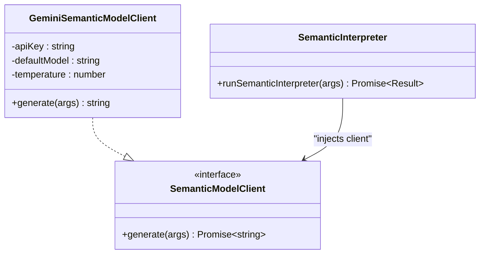

**Diagram sources**
- [geminiSemanticModelClient.ts:26-73](file://src/v2/geminiSemanticModelClient.ts#L26-L73)
- [semanticInterpreter.ts:40-67](file://src/v2/semanticInterpreter.ts#L40-L67)

**Section sources**
- [geminiSemanticModelClient.ts:26-73](file://src/v2/geminiSemanticModelClient.ts#L26-L73)
- [semanticInterpreter.ts:145-217](file://src/v2/semanticInterpreter.ts#L145-L217)

## Dependency Analysis
- Coupling and cohesion:
  - Routes depend on chat services; chat services depend on tool schemas, handlers, session store, and audit log.
  - V2 introduces additional dependencies on hybrid retriever, semantic interpreter, and state machine.
- External dependencies:
  - Gemini SDK for function calling and JSON mode.
  - better-sqlite3 for local persistence.
  - ClaimsDex adapter enables platform-specific replacements.
- Potential circular dependencies:
  - None observed; dependencies flow from API -> orchestration -> tools/data/LLM.

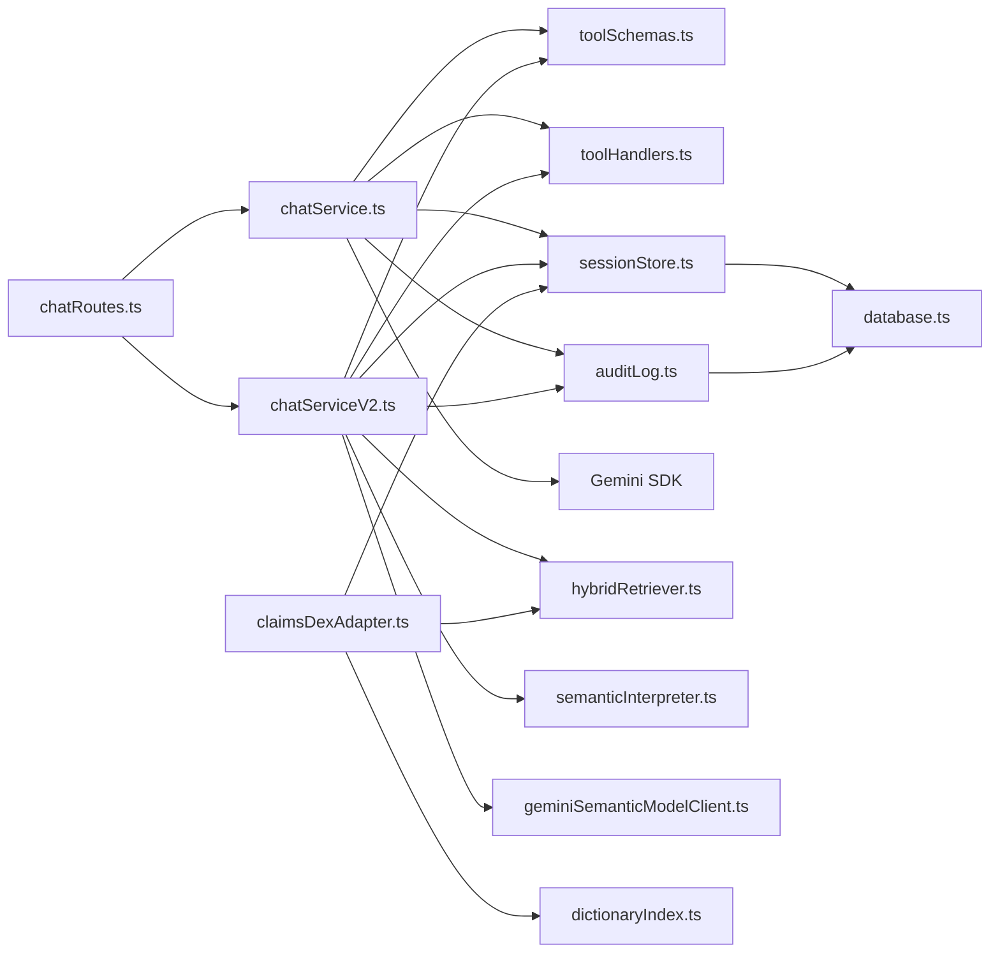

**Diagram sources**
- [chatRoutes.ts:14-90](file://src/api/chatRoutes.ts#L14-L90)
- [chatService.ts:38-154](file://src/chat/chatService.ts#L38-L154)
- [chatServiceV2.ts:258-1041](file://src/chat/chatServiceV2.ts#L258-L1041)
- [toolSchemas.ts:14-486](file://src/tools/toolSchemas.ts#L14-L486)
- [toolHandlers.ts:47-102](file://src/tools/toolHandlers.ts#L47-L102)
- [sessionStore.ts:21-109](file://src/db/sessionStore.ts#L21-L109)
- [auditLog.ts:58-90](file://src/db/auditLog.ts#L58-L90)
- [database.ts:11-49](file://src/db/database.ts#L11-L49)
- [claimsDexAdapter.ts:9-105](file://src/integration/claimsDexAdapter.ts#L9-L105)
- [hybridRetriever.ts:5-24](file://src/v2/hybridRetriever.ts#L5-L24)
- [geminiSemanticModelClient.ts:26-73](file://src/v2/geminiSemanticModelClient.ts#L26-L73)
- [semanticInterpreter.ts:145-217](file://src/v2/semanticInterpreter.ts#L145-L217)
- [dictionaryIndex.ts:59-74](file://src/rag/dictionaryIndex.ts#L59-L74)

**Section sources**
- [chatRoutes.ts:14-90](file://src/api/chatRoutes.ts#L14-L90)
- [chatService.ts:38-154](file://src/chat/chatService.ts#L38-L154)
- [chatServiceV2.ts:258-1041](file://src/chat/chatServiceV2.ts#L258-L1041)

## Performance Considerations
- Retry strategy for Gemini reduces transient failure impact; consider exponential backoff tuning and circuit breaker patterns for production.
- Session persistence occurs before LLM calls to ensure resilience; ensure DB write performance aligns with concurrent sessions.
- Hybrid retriever and semantic interpreter introduce latency; cache and pre-warm where appropriate.
- Audit logging is non-blocking; ensure DB capacity and indexing for audit queries.

## Troubleshooting Guide
- Environment configuration:
  - Missing GEMINI_API_KEY prevents V1/V2 LLM calls; server warns on startup.
  - Feature flags (e.g., GATIOD_CHAT_ENABLED, SEMANTIC_INTERPRETER_ENABLED) gate functionality.
- Session errors:
  - Use reset endpoint to clear problematic sessions; verify audit trail for error events.
- Tool execution failures:
  - Inspect tool call logs and audit events for tool_call and calculation_result entries.
- Database issues:
  - Verify SQLite file path and permissions; ensure indexes exist for performance.

**Section sources**
- [server.ts:52-54](file://src/server.ts#L52-L54)
- [chatService.ts:82-96](file://src/chat/chatService.ts#L82-L96)
- [auditLog.ts:58-90](file://src/db/auditLog.ts#L58-L90)
- [database.ts:14-18](file://src/db/database.ts#L14-L18)

## Conclusion
The GATIOD Chat Assistant integrates a robust API layer, resilient chat orchestration (V1 and V2), structured tooling, and comprehensive audit logging. Its modular design supports claimsDex integration via adapters, while maintaining deterministic semantics and safety through schema validation and event-driven tracing. The system balances flexibility with reliability, enabling multi-system assessments, global CVC computation, and extensible retrieval and LLM integration.