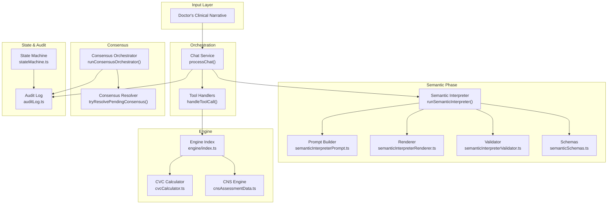
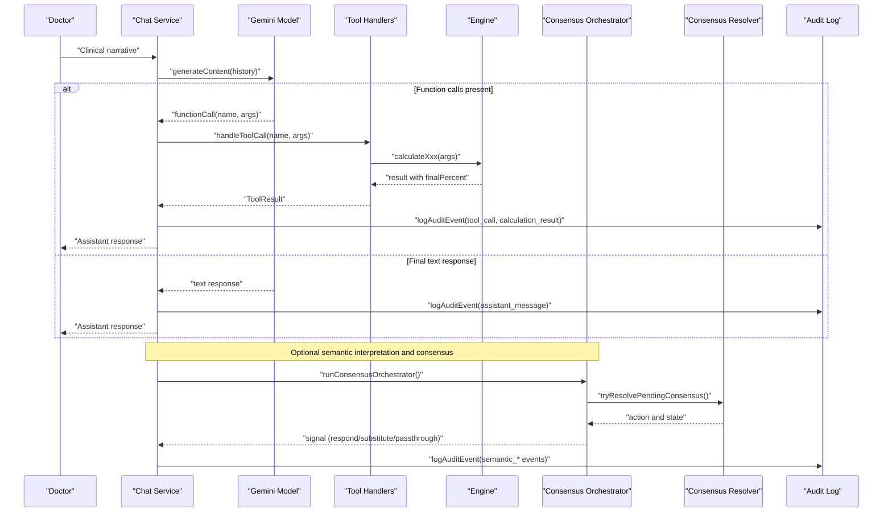
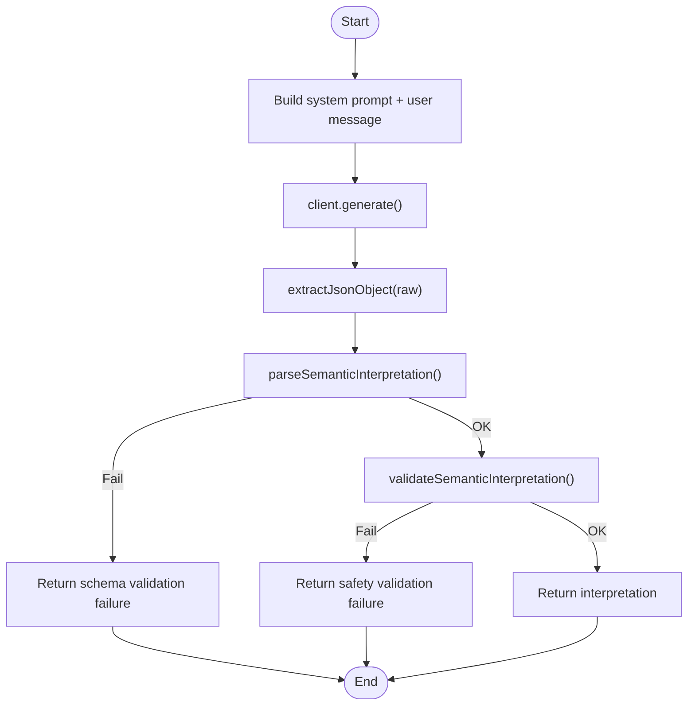
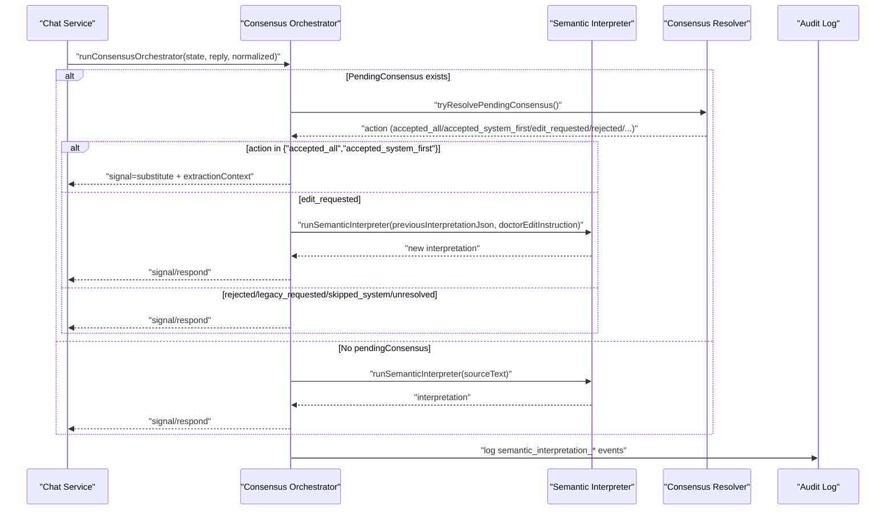
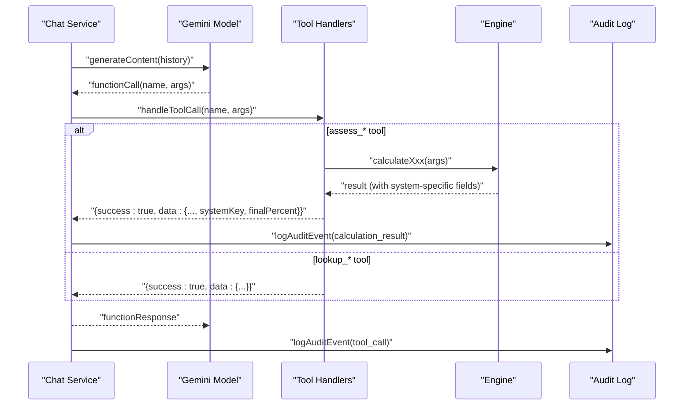
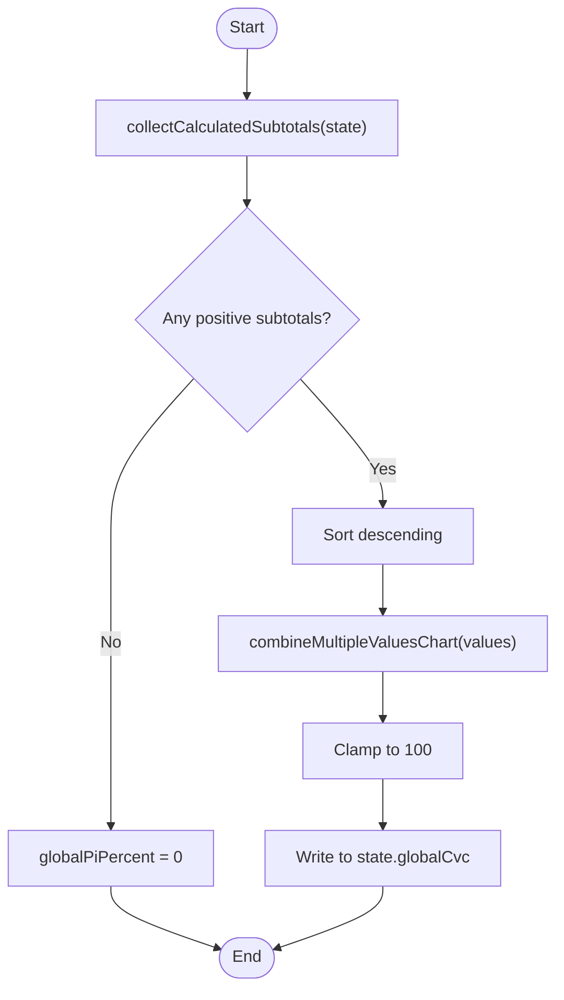
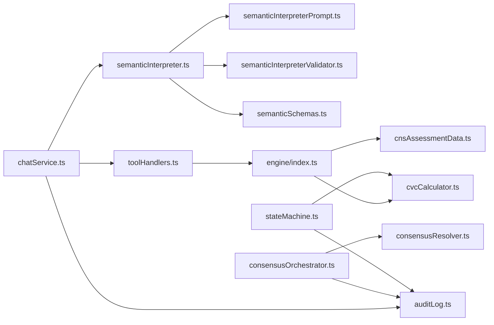

# Data Flow and Processing

<cite>
**Referenced Files in This Document**
- [chatService.ts](file://src/chat/chatService.ts)
- [toolHandlers.ts](file://src/tools/toolHandlers.ts)
- [index.ts](file://src/engine/index.ts)
- [cvcCalculator.ts](file://src/engine/cvcCalculator.ts)
- [cnsAssessmentData.ts](file://src/engine/cnsAssessmentData.ts)
- [auditLog.ts](file://src/db/auditLog.ts)
- [semanticInterpreter.ts](file://src/v2/semanticInterpreter.ts)
- [semanticInterpreterPrompt.ts](file://src/v2/semanticInterpreterPrompt.ts)
- [semanticInterpreterRenderer.ts](file://src/v2/semanticInterpreterRenderer.ts)
- [semanticInterpreterValidator.ts](file://src/v2/semanticInterpreterValidator.ts)
- [semanticSchemas.ts](file://src/v2/semanticSchemas.ts)
- [consensusOrchestrator.ts](file://src/v2/consensusOrchestrator.ts)
- [consensusResolver.ts](file://src/v2/consensusResolver.ts)
- [stateMachine.ts](file://src/v2/stateMachine.ts)
- [calculationTrace.ts](file://src/v2/calculationTrace.ts)
</cite>

## Table of Contents
1. [Introduction](#introduction)
2. [Project Structure](#project-structure)
3. [Core Components](#core-components)
4. [Architecture Overview](#architecture-overview)
5. [Detailed Component Analysis](#detailed-component-analysis)
6. [Dependency Analysis](#dependency-analysis)
7. [Performance Considerations](#performance-considerations)
8. [Troubleshooting Guide](#troubleshooting-guide)
9. [Conclusion](#conclusion)

## Introduction
This document explains the complete data flow from a doctor’s clinical narrative to the final PI% calculation. It covers the semantic interpretation phase, consensus building, deterministic extraction and tool invocation, structured data transformation, and multi-system combination. It documents validation points, error handling, and audit trail generation, with concrete examples of typical transformations and processing steps.

## Project Structure
The system is organized into:
- Chat orchestration and tool calling (Gemini function calling)
- Semantic interpretation (structured, safety-hardened extraction)
- Deterministic consensus resolution (doctor-driven decisions)
- Calculation engine (system-specific engines and CVC combination)
- State machine and audit logging

**Diagram sources**
- [chatService.ts:38-154](file://src/chat/chatService.ts#L38-L154)
- [toolHandlers.ts:47-102](file://src/tools/toolHandlers.ts#L47-L102)
- [semanticInterpreter.ts:145-217](file://src/v2/semanticInterpreter.ts#L145-L217)
- [semanticInterpreterPrompt.ts:79-121](file://src/v2/semanticInterpreterPrompt.ts#L79-L121)
- [semanticInterpreterRenderer.ts:43-124](file://src/v2/semanticInterpreterRenderer.ts#L43-L124)
- [semanticInterpreterValidator.ts:121-209](file://src/v2/semanticInterpreterValidator.ts#L121-L209)
- [semanticSchemas.ts:95-124](file://src/v2/semanticSchemas.ts#L95-L124)
- [consensusOrchestrator.ts:179-332](file://src/v2/consensusOrchestrator.ts#L179-L332)
- [consensusResolver.ts:195-444](file://src/v2/consensusResolver.ts#L195-L444)
- [index.ts:6-89](file://src/engine/index.ts#L6-L89)
- [cvcCalculator.ts:34-89](file://src/engine/cvcCalculator.ts#L34-L89)
- [cnsAssessmentData.ts:606-699](file://src/engine/cnsAssessmentData.ts#L606-L699)
- [stateMachine.ts:409-443](file://src/v2/stateMachine.ts#L409-L443)
- [auditLog.ts:58-90](file://src/db/auditLog.ts#L58-L90)

**Section sources**
- [chatService.ts:38-154](file://src/chat/chatService.ts#L38-L154)
- [semanticInterpreter.ts:145-217](file://src/v2/semanticInterpreter.ts#L145-L217)
- [consensusOrchestrator.ts:179-332](file://src/v2/consensusOrchestrator.ts#L179-L332)
- [stateMachine.ts:409-443](file://src/v2/stateMachine.ts#L409-L443)

## Core Components
- Chat orchestration with Gemini function calling and tool execution
- Semantic interpreter that parses and validates structured findings without performing calculations
- Consensus orchestrator and resolver that guide doctor-driven decisions
- Deterministic calculation engine with system-specific logic and CVC combination
- State machine and audit logging for traceability

**Section sources**
- [chatService.ts:38-154](file://src/chat/chatService.ts#L38-L154)
- [semanticInterpreter.ts:145-217](file://src/v2/semanticInterpreter.ts#L145-L217)
- [consensusOrchestrator.ts:179-332](file://src/v2/consensusOrchestrator.ts#L179-L332)
- [toolHandlers.ts:47-102](file://src/tools/toolHandlers.ts#L47-L102)
- [index.ts:6-89](file://src/engine/index.ts#L6-L89)
- [auditLog.ts:58-90](file://src/db/auditLog.ts#L58-L90)

## Architecture Overview
The pipeline begins with a doctor’s input. The chat service orchestrates a Gemini model with function-declared tools. If the model responds with function calls, the handler executes system-specific calculations and returns results. Alternatively, the semantic interpreter can be invoked to produce a structured interpretation of findings without calculation. The consensus orchestrator and resolver then manage doctor feedback and decisions. Finally, the state machine aggregates per-system totals and applies CVC to derive the global PI%.

**Diagram sources**
- [chatService.ts:38-154](file://src/chat/chatService.ts#L38-L154)
- [toolHandlers.ts:47-102](file://src/tools/toolHandlers.ts#L47-L102)
- [index.ts:6-89](file://src/engine/index.ts#L6-L89)
- [consensusOrchestrator.ts:179-332](file://src/v2/consensusOrchestrator.ts#L179-L332)
- [consensusResolver.ts:195-444](file://src/v2/consensusResolver.ts#L195-L444)
- [auditLog.ts:58-90](file://src/db/auditLog.ts#L58-L90)

## Detailed Component Analysis

### Semantic Interpretation Phase
The semantic interpreter transforms the doctor’s input into a structured interpretation without performing calculations. It enforces strict safety rules and schema constraints.

**Diagram sources**
- [semanticInterpreter.ts:145-217](file://src/v2/semanticInterpreter.ts#L145-L217)
- [semanticInterpreterPrompt.ts:79-121](file://src/v2/semanticInterpreterPrompt.ts#L79-L121)
- [semanticSchemas.ts:95-124](file://src/v2/semanticSchemas.ts#L95-L124)
- [semanticInterpreterValidator.ts:121-209](file://src/v2/semanticInterpreterValidator.ts#L121-L209)

Key transformations and validations:
- JSON extraction and cleaning from raw model output
- Zod schema enforcement for shape and literals
- Safety checks: forbidden tokens, source-span verification, system labeling consistency
- Rendering of a doctor-facing proposal card

**Section sources**
- [semanticInterpreter.ts:145-217](file://src/v2/semanticInterpreter.ts#L145-L217)
- [semanticInterpreterPrompt.ts:79-121](file://src/v2/semanticInterpreterPrompt.ts#L79-L121)
- [semanticInterpreterRenderer.ts:43-124](file://src/v2/semanticInterpreterRenderer.ts#L43-L124)
- [semanticInterpreterValidator.ts:121-209](file://src/v2/semanticInterpreterValidator.ts#L121-L209)
- [semanticSchemas.ts:95-124](file://src/v2/semanticSchemas.ts#L95-L124)

### Consensus Building
The consensus orchestrator coordinates semantic interpretation proposals with deterministic doctor decisions. It supports substitution of the original input for focused extraction, and persistence of audit events.

**Diagram sources**
- [consensusOrchestrator.ts:179-332](file://src/v2/consensusOrchestrator.ts#L179-L332)
- [consensusResolver.ts:195-444](file://src/v2/consensusResolver.ts#L195-L444)
- [semanticInterpreter.ts:145-217](file://src/v2/semanticInterpreter.ts#L145-L217)

Decision logic highlights:
- Edit-instruction mode: re-run interpreter with doctor’s instruction
- Accepted-all or system-first: substitute original source text for extraction
- Legacy fallback and skip handling with state mutations and audit events

**Section sources**
- [consensusOrchestrator.ts:179-332](file://src/v2/consensusOrchestrator.ts#L179-L332)
- [consensusResolver.ts:195-444](file://src/v2/consensusResolver.ts#L195-L444)

### Tool Function Calling and Deterministic Calculations
The chat service routes function calls to system-specific calculators. Results are normalized to include a final PI% and system key.

**Diagram sources**
- [chatService.ts:134-149](file://src/chat/chatService.ts#L134-L149)
- [toolHandlers.ts:47-102](file://src/tools/toolHandlers.ts#L47-L102)
- [index.ts:6-89](file://src/engine/index.ts#L6-L89)
- [auditLog.ts:58-90](file://src/db/auditLog.ts#L58-L90)

Typical transformations:
- Spine result sanitization: mapping internal enum keys to human-readable labels
- CNS auto-confirmation of non-zero values when doctor-provided
- Visual normalization of optional arrays
- Global CVC aggregation across system subtotals

**Section sources**
- [toolHandlers.ts:125-161](file://src/tools/toolHandlers.ts#L125-L161)
- [toolHandlers.ts:165-184](file://src/tools/toolHandlers.ts#L165-L184)
- [toolHandlers.ts:196-203](file://src/tools/toolHandlers.ts#L196-L203)
- [toolHandlers.ts:207-228](file://src/tools/toolHandlers.ts#L207-L228)

### Multi-System Combination and Global PI%
The state machine computes per-system subtotals and applies CVC to derive the global PI%. Different systems use different combination methods.

**Diagram sources**
- [stateMachine.ts:434-443](file://src/v2/stateMachine.ts#L434-L443)
- [cvcCalculator.ts:74-89](file://src/engine/cvcCalculator.ts#L74-L89)

Examples of system-specific combination methods:
- CNS: highest score selection within sections, then CVC across sections and amputation equivalents
- Others: CVC across instances or additive combinations depending on rules

**Section sources**
- [stateMachine.ts:409-443](file://src/v2/stateMachine.ts#L409-L443)
- [cnsAssessmentData.ts:606-699](file://src/engine/cnsAssessmentData.ts#L606-L699)
- [cvcCalculator.ts:34-89](file://src/engine/cvcCalculator.ts#L34-L89)

### Data Transformation Stages and Validation Points
- Input normalization and safety hardening in semantic interpreter
- Schema validation and safety validation post-parsing
- Tool result normalization and final percent extraction
- State updates and system subtotal recomputation
- Audit logging at every major step

Concrete examples:
- Spine result mapping from internal keys to labels
- CNS auto-confirmation logic for non-zero values
- Global CVC aggregation across multiple systems
- ROM lookup table selection and angle-to-percent conversion

**Section sources**
- [semanticInterpreterValidator.ts:121-209](file://src/v2/semanticInterpreterValidator.ts#L121-L209)
- [toolHandlers.ts:145-161](file://src/tools/toolHandlers.ts#L145-L161)
- [toolHandlers.ts:165-184](file://src/tools/toolHandlers.ts#L165-L184)
- [stateMachine.ts:753-789](file://src/v2/stateMachine.ts#L753-L789)

## Dependency Analysis
The following diagram shows key dependencies among components:

**Diagram sources**
- [chatService.ts:38-154](file://src/chat/chatService.ts#L38-L154)
- [toolHandlers.ts:47-102](file://src/tools/toolHandlers.ts#L47-L102)
- [semanticInterpreter.ts:145-217](file://src/v2/semanticInterpreter.ts#L145-L217)
- [semanticInterpreterPrompt.ts:79-121](file://src/v2/semanticInterpreterPrompt.ts#L79-L121)
- [semanticInterpreterValidator.ts:121-209](file://src/v2/semanticInterpreterValidator.ts#L121-L209)
- [semanticSchemas.ts:95-124](file://src/v2/semanticSchemas.ts#L95-L124)
- [consensusOrchestrator.ts:179-332](file://src/v2/consensusOrchestrator.ts#L179-L332)
- [consensusResolver.ts:195-444](file://src/v2/consensusResolver.ts#L195-L444)
- [index.ts:6-89](file://src/engine/index.ts#L6-L89)
- [cvcCalculator.ts:34-89](file://src/engine/cvcCalculator.ts#L34-L89)
- [cnsAssessmentData.ts:606-699](file://src/engine/cnsAssessmentData.ts#L606-L699)
- [stateMachine.ts:409-443](file://src/v2/stateMachine.ts#L409-L443)
- [auditLog.ts:58-90](file://src/db/auditLog.ts#L58-L90)

**Section sources**
- [chatService.ts:38-154](file://src/chat/chatService.ts#L38-L154)
- [semanticInterpreter.ts:145-217](file://src/v2/semanticInterpreter.ts#L145-L217)
- [consensusOrchestrator.ts:179-332](file://src/v2/consensusOrchestrator.ts#L179-L332)
- [stateMachine.ts:409-443](file://src/v2/stateMachine.ts#L409-L443)

## Performance Considerations
- Gemini retries with exponential backoff reduce transient failures
- Session persistence before model calls ensures continuity and reduces rework
- Deterministic processing avoids repeated LLM calls for calculations
- CVC combination uses iterative sorting and rounding to minimize floating-point drift
- Audit logging is non-blocking and does not crash the main flow

[No sources needed since this section provides general guidance]

## Troubleshooting Guide
Common issues and handling:
- Rate limit or quota errors: surfaced with user-friendly messages and session preserved
- Timeout or connection refused: retried with delays; user notified to try again
- Safety or schema failures in semantic interpretation: fail-closed; no interpretation propagated
- Tool call failures: logged with success flags; session preserved
- Consensus resolution ambiguity: renders choices and asks for clarification

**Section sources**
- [chatService.ts:82-96](file://src/chat/chatService.ts#L82-L96)
- [chatService.ts:156-172](file://src/chat/chatService.ts#L156-L172)
- [semanticInterpreterValidator.ts:121-209](file://src/v2/semanticInterpreterValidator.ts#L121-L209)
- [auditLog.ts:58-90](file://src/db/auditLog.ts#L58-L90)

## Conclusion
The pipeline integrates a safety-hardened semantic interpretation phase with deterministic consensus and calculation. Structured validation and audit logging ensure traceability and correctness. The state machine and CVC calculator provide robust multi-system combination, while tool handlers encapsulate system-specific logic. Together, these components deliver a reliable path from clinical narrative to final PI% with strong guarantees around safety, determinism, and transparency.