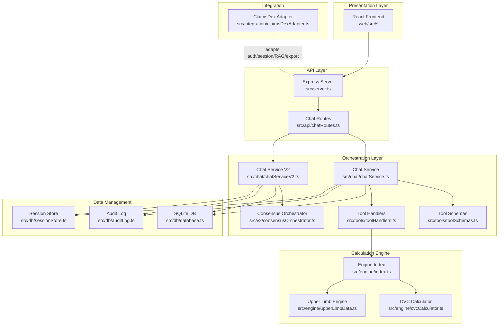
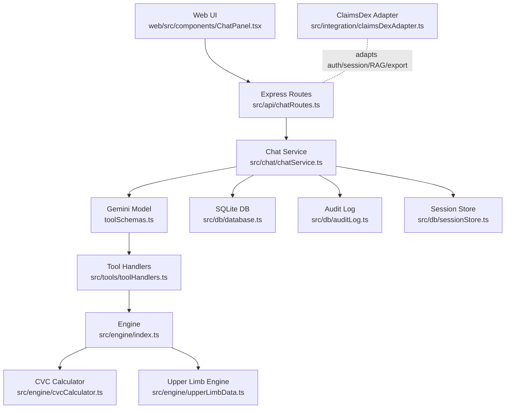
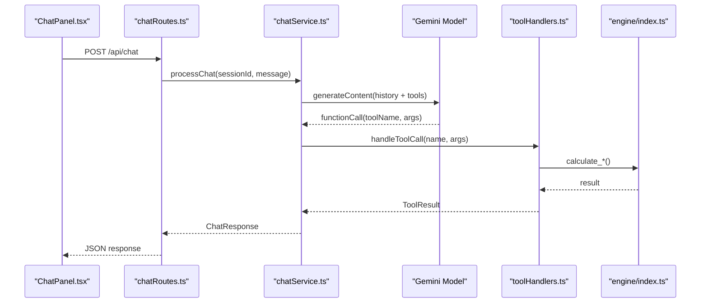
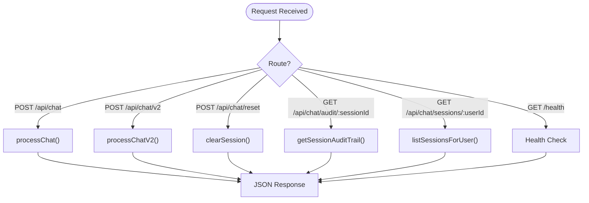
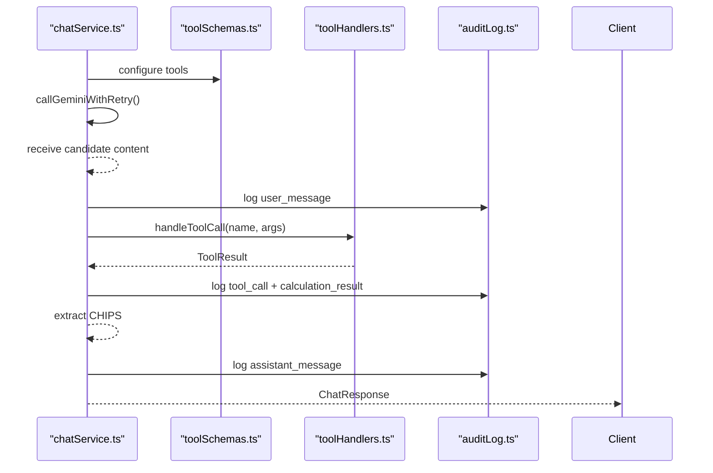
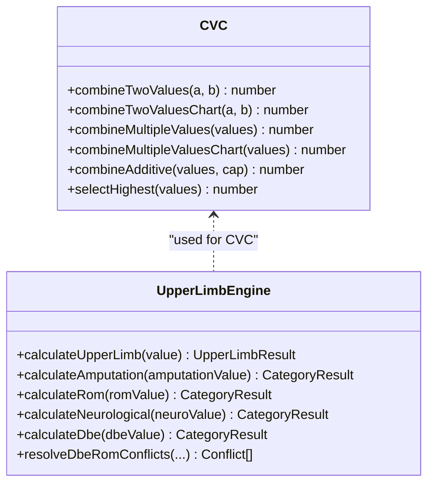
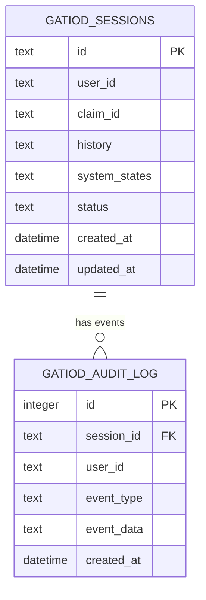
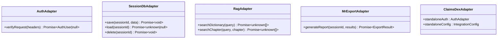
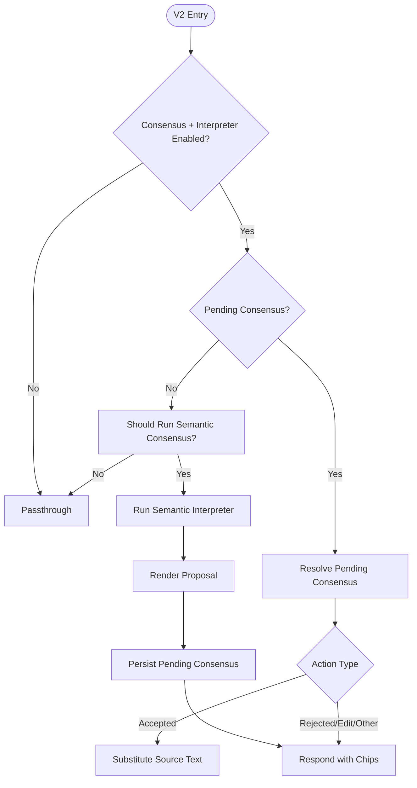
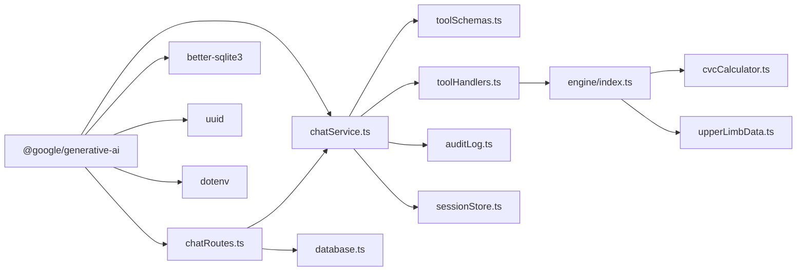

# System Architecture

<cite>
**Referenced Files in This Document**
- [README.md](file://README.md)
- [package.json](file://package.json)
- [web/package.json](file://web/package.json)
- [src/server.ts](file://src/server.ts)
- [src/api/chatRoutes.ts](file://src/api/chatRoutes.ts)
- [src/chat/chatService.ts](file://src/chat/chatService.ts)
- [src/chat/chatServiceV2.ts](file://src/chat/chatServiceV2.ts)
- [src/tools/toolSchemas.ts](file://src/tools/toolSchemas.ts)
- [src/tools/toolHandlers.ts](file://src/tools/toolHandlers.ts)
- [src/engine/index.ts](file://src/engine/index.ts)
- [src/engine/cvcCalculator.ts](file://src/engine/cvcCalculator.ts)
- [src/engine/upperLimbData.ts](file://src/engine/upperLimbData.ts)
- [src/db/database.ts](file://src/db/database.ts)
- [src/db/auditLog.ts](file://src/db/auditLog.ts)
- [src/db/sessionStore.ts](file://src/db/sessionStore.ts)
- [src/integration/claimsDexAdapter.ts](file://src/integration/claimsDexAdapter.ts)
- [src/v2/consensusOrchestrator.ts](file://src/v2/consensusOrchestrator.ts)
- [web/src/App.tsx](file://web/src/App.tsx)
- [web/src/components/ChatPanel.tsx](file://web/src/components/ChatPanel.tsx)
</cite>

## Table of Contents
1. [Introduction](#introduction)
2. [Project Structure](#project-structure)
3. [Core Components](#core-components)
4. [Architecture Overview](#architecture-overview)
5. [Detailed Component Analysis](#detailed-component-analysis)
6. [Dependency Analysis](#dependency-analysis)
7. [Performance Considerations](#performance-considerations)
8. [Troubleshooting Guide](#troubleshooting-guide)
9. [Conclusion](#conclusion)
10. [Appendices](#appendices)

## Introduction
This document describes the system architecture of the GATIOD Chat Assistant, a conversational clinical assessment tool that integrates a React frontend, an Express API server, a Gemini-powered orchestration layer, a pure TypeScript calculation engine, and a SQLite data management layer. The system enforces medical-legal compliance through comprehensive audit trails and traceability, and is designed for portability to the claimsDex platform via clean adapter interfaces.

## Project Structure
The repository is organized into distinct layers and modules:
- Presentation Layer (React): web/ with MUI components and a chat panel.
- API Layer (Express): src/api and src/server.ts.
- Orchestration Layer (Gemini + Tools): src/chat and src/tools.
- Calculation Engine (Pure TypeScript): src/engine.
- Data Management Layer (SQLite): src/db.
- Integration Adapters (claimsDex): src/integration.
- V2 Pipeline (Advanced orchestration): src/v2.

**Diagram sources**
- [src/server.ts:1-68](file://src/server.ts#L1-L68)
- [src/api/chatRoutes.ts:1-91](file://src/api/chatRoutes.ts#L1-L91)
- [src/chat/chatService.ts:1-183](file://src/chat/chatService.ts#L1-L183)
- [src/chat/chatServiceV2.ts](file://src/chat/chatServiceV2.ts)
- [src/tools/toolSchemas.ts:1-487](file://src/tools/toolSchemas.ts#L1-L487)
- [src/tools/toolHandlers.ts:1-435](file://src/tools/toolHandlers.ts#L1-L435)
- [src/engine/index.ts:1-89](file://src/engine/index.ts#L1-L89)
- [src/engine/cvcCalculator.ts:1-108](file://src/engine/cvcCalculator.ts#L1-L108)
- [src/engine/upperLimbData.ts:1-200](file://src/engine/upperLimbData.ts#L1-L200)
- [src/db/database.ts:1-57](file://src/db/database.ts#L1-L57)
- [src/db/auditLog.ts:1-91](file://src/db/auditLog.ts#L1-L91)
- [src/db/sessionStore.ts](file://src/db/sessionStore.ts)
- [src/integration/claimsDexAdapter.ts:1-105](file://src/integration/claimsDexAdapter.ts#L1-L105)
- [src/v2/consensusOrchestrator.ts:1-422](file://src/v2/consensusOrchestrator.ts#L1-L422)
- [web/src/App.tsx:1-23](file://web/src/App.tsx#L1-L23)
- [web/src/components/ChatPanel.tsx:1-362](file://web/src/components/ChatPanel.tsx#L1-L362)

**Section sources**
- [README.md:47-61](file://README.md#L47-L61)
- [package.json:1-45](file://package.json#L1-L45)
- [web/package.json:1-27](file://web/package.json#L1-L27)

## Core Components
- Presentation Layer (React)
  - Provides a chat interface with API mode switching, message rendering, and export controls.
  - Communicates with the backend via /api/chat and /api/chat/v2 endpoints.
- API Layer (Express)
  - Exposes REST endpoints for chat, session reset, audit trail retrieval, and session listing.
  - Serves the static frontend in production.
- Orchestration Layer (Gemini + Tools)
  - Orchestrates LLM interactions, manages function calling, and logs audit events.
  - Bridges tool calls to the calculation engine and returns structured results.
- Calculation Engine (Pure TypeScript)
  - Deterministic functions implementing GATIOD systems and CVC combination logic.
  - Exported for unit testing and portability.
- Data Management Layer (SQLite)
  - Stores session histories and audit trails with indexes for performance.
- Integration Adapters (claimsDex)
  - Clean interfaces enabling replacement of auth, session storage, RAG, and report export with platform-native implementations.

**Section sources**
- [web/src/App.tsx:1-23](file://web/src/App.tsx#L1-L23)
- [web/src/components/ChatPanel.tsx:1-362](file://web/src/components/ChatPanel.tsx#L1-L362)
- [src/api/chatRoutes.ts:14-91](file://src/api/chatRoutes.ts#L14-L91)
- [src/server.ts:10-68](file://src/server.ts#L10-L68)
- [src/chat/chatService.ts:38-183](file://src/chat/chatService.ts#L38-L183)
- [src/tools/toolSchemas.ts:14-487](file://src/tools/toolSchemas.ts#L14-L487)
- [src/tools/toolHandlers.ts:47-102](file://src/tools/toolHandlers.ts#L47-L102)
- [src/engine/index.ts:1-89](file://src/engine/index.ts#L1-L89)
- [src/db/database.ts:11-57](file://src/db/database.ts#L11-L57)
- [src/db/auditLog.ts:58-91](file://src/db/auditLog.ts#L58-L91)
- [src/integration/claimsDexAdapter.ts:9-105](file://src/integration/claimsDexAdapter.ts#L9-L105)

## Architecture Overview
The system follows a layered architecture with clear separation of concerns:
- Presentation Layer: React SPA renders chat UI and interacts with the backend.
- API Layer: Express routes accept requests, validate payloads, and delegate to orchestration services.
- Orchestration Layer: Gemini model with function-declared tools triggers tool handlers that call calculation functions.
- Calculation Engine: Pure TypeScript modules implement GATIOD systems and CVC logic.
- Data Management Layer: SQLite persists sessions and audit trails with indexes for efficient queries.
- Integration Layer: Adapter interfaces enable portability to claimsDex.

**Diagram sources**
- [web/src/components/ChatPanel.tsx:69-142](file://web/src/components/ChatPanel.tsx#L69-L142)
- [src/api/chatRoutes.ts:14-91](file://src/api/chatRoutes.ts#L14-L91)
- [src/chat/chatService.ts:67-150](file://src/chat/chatService.ts#L67-L150)
- [src/tools/toolSchemas.ts:14-487](file://src/tools/toolSchemas.ts#L14-L487)
- [src/tools/toolHandlers.ts:47-102](file://src/tools/toolHandlers.ts#L47-L102)
- [src/engine/index.ts:1-89](file://src/engine/index.ts#L1-L89)
- [src/engine/cvcCalculator.ts:1-108](file://src/engine/cvcCalculator.ts#L1-L108)
- [src/engine/upperLimbData.ts:1-200](file://src/engine/upperLimbData.ts#L1-L200)
- [src/db/database.ts:11-57](file://src/db/database.ts#L11-L57)
- [src/db/auditLog.ts:58-91](file://src/db/auditLog.ts#L58-L91)
- [src/db/sessionStore.ts](file://src/db/sessionStore.ts)
- [src/integration/claimsDexAdapter.ts:9-105](file://src/integration/claimsDexAdapter.ts#L9-L105)

## Detailed Component Analysis

### Presentation Layer (React)
- Responsibilities
  - Render chat UI, manage API mode (legacy vs V2), handle user input, display assistant responses, and export reports.
- Key Behaviors
  - Sends POST requests to /api/chat or /api/chat/v2 depending on mode.
  - Parses responses, detects confirmation and breakdown messages, and updates state accordingly.
  - Integrates with tool-call indicators and CHIPS suggestions.

**Diagram sources**
- [web/src/components/ChatPanel.tsx:69-142](file://web/src/components/ChatPanel.tsx#L69-L142)
- [src/api/chatRoutes.ts:14-66](file://src/api/chatRoutes.ts#L14-L66)
- [src/chat/chatService.ts:38-154](file://src/chat/chatService.ts#L38-L154)
- [src/tools/toolSchemas.ts:14-487](file://src/tools/toolSchemas.ts#L14-L487)
- [src/tools/toolHandlers.ts:47-102](file://src/tools/toolHandlers.ts#L47-L102)
- [src/engine/index.ts:1-89](file://src/engine/index.ts#L1-L89)

**Section sources**
- [web/src/App.tsx:1-23](file://web/src/App.tsx#L1-L23)
- [web/src/components/ChatPanel.tsx:49-182](file://web/src/components/ChatPanel.tsx#L49-L182)

### API Layer (Express)
- Responsibilities
  - Define REST endpoints for chat, session reset, audit retrieval, and session listing.
  - Serve the built frontend in production and handle health checks.
- Key Behaviors
  - Validate request bodies and return structured errors.
  - Mirror production traffic through the V2 pipeline in shadow mode for evaluation.

**Diagram sources**
- [src/api/chatRoutes.ts:14-91](file://src/api/chatRoutes.ts#L14-L91)
- [src/server.ts:20-37](file://src/server.ts#L20-L37)

**Section sources**
- [src/api/chatRoutes.ts:14-91](file://src/api/chatRoutes.ts#L14-L91)
- [src/server.ts:10-68](file://src/server.ts#L10-L68)

### Orchestration Layer (Gemini + Tools)
- Responsibilities
  - Manage Gemini model configuration, maintain conversation history, and coordinate function calls.
  - Log audit events for every significant step and persist session state.
- Key Behaviors
  - Retry mechanism for Gemini calls with exponential backoff.
  - Extract CHIPS from assistant responses and suggest chips for quick reuse.
  - Sanitize spine results and normalize CNS/visual inputs before invoking engines.

**Diagram sources**
- [src/chat/chatService.ts:67-154](file://src/chat/chatService.ts#L67-L154)
- [src/tools/toolSchemas.ts:14-487](file://src/tools/toolSchemas.ts#L14-L487)
- [src/tools/toolHandlers.ts:47-102](file://src/tools/toolHandlers.ts#L47-L102)
- [src/db/auditLog.ts:58-73](file://src/db/auditLog.ts#L58-L73)

**Section sources**
- [src/chat/chatService.ts:38-183](file://src/chat/chatService.ts#L38-L183)
- [src/tools/toolHandlers.ts:106-121](file://src/tools/toolHandlers.ts#L106-L121)

### Calculation Engine (Pure TypeScript)
- Responsibilities
  - Provide deterministic calculations for GATIOD systems and CVC combination logic.
  - Export pure functions for unit testing and portability.
- Key Behaviors
  - CVC calculator supports two-values, multiple-values, additive, and highest-score rules.
  - Upper limb engine computes amputation, ROM, neurological deficits, and DBE conflicts.

**Diagram sources**
- [src/engine/cvcCalculator.ts:19-108](file://src/engine/cvcCalculator.ts#L19-L108)
- [src/engine/upperLimbData.ts:160-186](file://src/engine/upperLimbData.ts#L160-L186)

**Section sources**
- [src/engine/index.ts:1-89](file://src/engine/index.ts#L1-L89)
- [src/engine/cvcCalculator.ts:1-108](file://src/engine/cvcCalculator.ts#L1-L108)
- [src/engine/upperLimbData.ts:160-186](file://src/engine/upperLimbData.ts#L160-L186)

### Data Management Layer (SQLite)
- Responsibilities
  - Persist session histories and maintain audit trails with indexes for performance.
- Key Behaviors
  - Initialize schema on first use, enforce WAL mode, and provide transaction-safe operations.
  - Indexes on user_id, claim_id, event_type, and created_at improve query performance.

**Diagram sources**
- [src/db/database.ts:20-46](file://src/db/database.ts#L20-L46)
- [src/db/auditLog.ts:75-90](file://src/db/auditLog.ts#L75-L90)

**Section sources**
- [src/db/database.ts:11-57](file://src/db/database.ts#L11-L57)
- [src/db/auditLog.ts:58-91](file://src/db/auditLog.ts#L58-L91)

### Integration Adapters (claimsDex)
- Responsibilities
  - Provide clean interfaces for auth, session DB, RAG, and report export.
  - Allow seamless replacement with platform-native implementations.
- Key Behaviors
  - Standalone implementations for local development; claimsDex replaces adapters with platform services.

**Diagram sources**
- [src/integration/claimsDexAdapter.ts:9-105](file://src/integration/claimsDexAdapter.ts#L9-L105)

**Section sources**
- [src/integration/claimsDexAdapter.ts:9-105](file://src/integration/claimsDexAdapter.ts#L9-L105)

### V2 Orchestration (Advanced)
- Responsibilities
  - Advanced semantic consensus, interpretation, and extraction pipeline.
  - Conditional activation via feature flags; deterministic fallback when disabled.
- Key Behaviors
  - Builds extraction context from pending consensus and focuses on specific systems.
  - Emits structured audit events for semantic interpretation lifecycle.

**Diagram sources**
- [src/v2/consensusOrchestrator.ts:179-332](file://src/v2/consensusOrchestrator.ts#L179-L332)

**Section sources**
- [src/v2/consensusOrchestrator.ts:1-422](file://src/v2/consensusOrchestrator.ts#L1-L422)

## Dependency Analysis
- Internal Dependencies
  - chatService.ts depends on toolSchemas.ts and toolHandlers.ts.
  - toolHandlers.ts depends on engine/index.ts and RAG dictionary index.
  - API routes depend on chat services and database audit/log/session store.
- External Dependencies
  - Express for HTTP server and CORS.
  - Gemini SDK for model interactions.
  - better-sqlite3 for local persistence.
  - UUID for session identifiers.
  - dotenv for environment configuration.

**Diagram sources**
- [package.json:21-28](file://package.json#L21-L28)
- [src/chat/chatService.ts:6-17](file://src/chat/chatService.ts#L6-L17)
- [src/api/chatRoutes.ts:5-11](file://src/api/chatRoutes.ts#L5-L11)
- [src/tools/toolSchemas.ts:8](file://src/tools/toolSchemas.ts#L8)
- [src/tools/toolHandlers.ts:6-38](file://src/tools/toolHandlers.ts#L6-L38)
- [src/engine/index.ts:6-89](file://src/engine/index.ts#L6-L89)
- [src/db/database.ts:6](file://src/db/database.ts#L6)

**Section sources**
- [package.json:21-28](file://package.json#L21-L28)
- [src/chat/chatService.ts:6-17](file://src/chat/chatService.ts#L6-L17)
- [src/api/chatRoutes.ts:5-11](file://src/api/chatRoutes.ts#L5-L11)

## Performance Considerations
- Gemini Retries: Built-in retry with backoff reduces transient failures and improves reliability.
- Database Indexes: Indexes on session_id, event_type, and created_at optimize audit queries.
- Pure Functions: Engine functions avoid side effects, enabling caching and parallelization where safe.
- Shadow Mode: V2 shadow mode evaluates new logic without impacting production traffic.
- Frontend Responsiveness: Debouncing and controlled re-rendering minimize UI thrash during long assessments.

## Troubleshooting Guide
- Environment Variables
  - GEMINI_API_KEY must be set; otherwise, chat requests fail early.
  - GATIOD_CHAT_ENABLED toggles chat assessment on/off.
  - GATIOD_V2_SHADOW_MODE enables V2 shadow evaluation.
- Error Handling
  - Chat service wraps Gemini errors and logs audit events for recovery.
  - API routes return structured JSON errors with HTTP status codes.
- Audit Trails
  - Use GET /api/chat/audit/:sessionId to retrieve full event logs for traceability.
  - Use GET /api/chat/sessions/:userId to list sessions for resuming work.
- Session Persistence
  - Ensure sessions are saved before Gemini calls to survive transient failures.

**Section sources**
- [src/server.ts:52-54](file://src/server.ts#L52-L54)
- [src/chat/chatService.ts:82-96](file://src/chat/chatService.ts#L82-L96)
- [src/api/chatRoutes.ts:36-40](file://src/api/chatRoutes.ts#L36-L40)
- [src/db/auditLog.ts:75-90](file://src/db/auditLog.ts#L75-L90)

## Conclusion
The GATIOD Chat Assistant employs a layered, modular architecture that cleanly separates presentation, API, orchestration, calculation, and data management concerns. The function calling pattern ensures the LLM remains a structured-data extractor while deterministic engine functions compute results. Comprehensive audit logging and traceability support medical-legal compliance, and adapter interfaces facilitate portability to claimsDex. The V2 orchestration layer introduces advanced semantic consensus and extraction capabilities, gated by feature flags for safe evolution.

## Appendices
- Portability to claimsDex
  - Engine modules can be imported directly into claimsDex backend.
  - Tool schemas and chat orchestration integrate with existing chat services.
  - RAG can be replaced with hybrid retriever; MR export adapts to TrustVC PDF pipeline.
- Compliance and Traceability
  - Every tool call, calculation result, and user action is audited with timestamps and event data.
  - Audit logs include V2-specific events for semantic interpretation lifecycle.

**Section sources**
- [README.md:63-69](file://README.md#L63-L69)
- [src/db/auditLog.ts:8-49](file://src/db/auditLog.ts#L8-L49)
- [src/integration/claimsDexAdapter.ts:87-104](file://src/integration/claimsDexAdapter.ts#L87-L104)