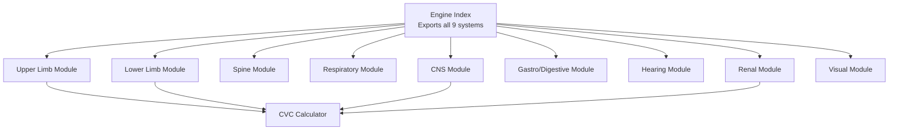
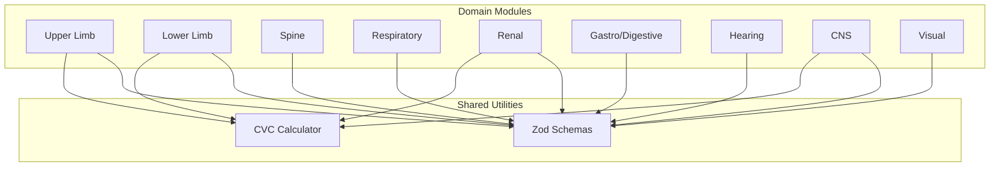
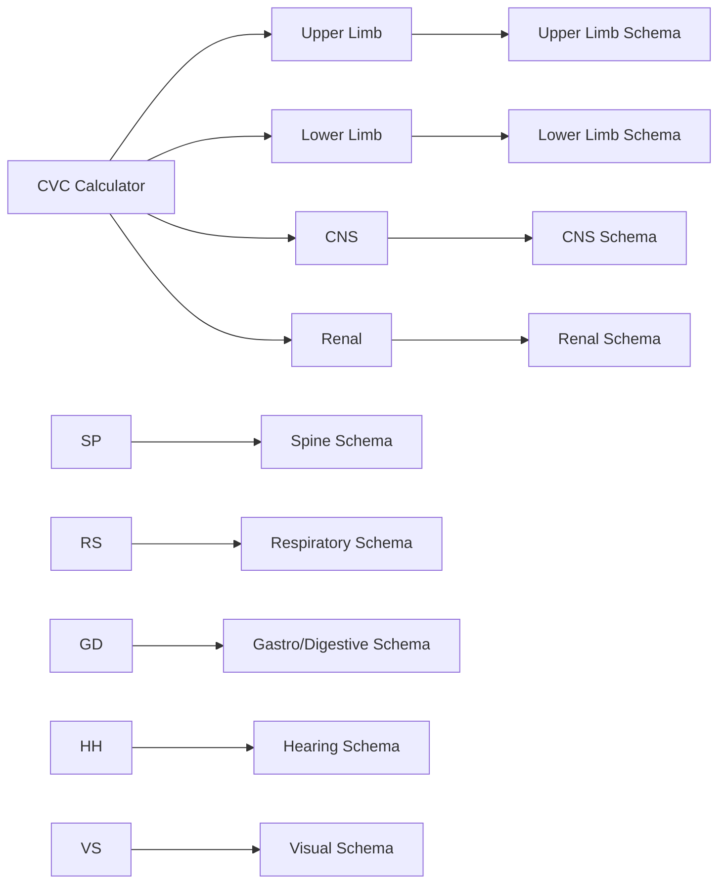

# Body Systems Assessment

<cite>
**Referenced Files in This Document**
- [engine/index.ts](file://src/engine/index.ts)
- [upperLimbData.ts](file://src/engine/upperLimbData.ts)
- [lowerLimbData.ts](file://src/engine/lowerLimbData.ts)
- [spineAssessmentData.ts](file://src/engine/spineAssessmentData.ts)
- [respiratoryData.ts](file://src/engine/respiratoryData.ts)
- [renalData.ts](file://src/engine/renalData.ts)
- [gastroDigestiveData.ts](file://src/engine/gastroDigestiveData.ts)
- [hearingData.ts](file://src/engine/hearingData.ts)
- [cnsAssessmentData.ts](file://src/engine/cnsAssessmentData.ts)
- [visualAssessmentData.ts](file://src/engine/visualAssessmentData.ts)
- [cvcCalculator.ts](file://src/engine/cvcCalculator.ts)
</cite>

## Table of Contents
1. [Introduction](#introduction)
2. [Project Structure](#project-structure)
3. [Core Components](#core-components)
4. [Architecture Overview](#architecture-overview)
5. [Detailed Component Analysis](#detailed-component-analysis)
6. [Dependency Analysis](#dependency-analysis)
7. [Performance Considerations](#performance-considerations)
8. [Troubleshooting Guide](#troubleshooting-guide)
9. [Conclusion](#conclusion)

## Introduction
This document provides comprehensive technical documentation for the nine GATIOD body systems assessment modules integrated into the calculation engine. Each system implements standardized scoring methodologies aligned with GATIOD Chapter guidelines, delivering structured inputs, robust validation, deterministic calculations, and clear result interpretation. The systems covered are Upper Limb (Chapter 3), Lower Limb (Chapter 4), Spine (Chapter 5), Respiratory (Chapter 6), Renal (Chapter 7), Gastro/Digestive (Chapter 8), Hearing (Chapter 9), CNS (Chapter 10), and Visual (Chapter 11). The engine ensures consistency, reproducibility, and interoperability through shared calculation utilities and unified export interfaces.

## Project Structure
The calculation engine is organized as a cohesive set of pure TypeScript modules, each encapsulating domain-specific types, lookup tables, validation schemas, and computation functions. A central index exports all system APIs, enabling modular consumption and testing.

**Diagram sources**
- [engine/index.ts:1-89](file://src/engine/index.ts#L1-L89)

**Section sources**
- [engine/index.ts:1-89](file://src/engine/index.ts#L1-L89)

## Core Components
Each system module defines:
- Types and constants for domain-specific entities (e.g., joints, severity brackets, anatomical regions)
- Validation schemas for input payloads
- Lookup tables mapping clinical measures to standardized percentages
- Calculation functions that transform inputs into structured results with interpretable fields
- Exported interfaces for integration and testing

Key shared utilities:
- CVC calculator: Provides combination functions for aggregating multiple impairments using GATIOD's composite value curve methodology
- Zod schemas: Enforce input validation and normalization across all systems

**Section sources**
- [upperLimbData.ts:1-1593](file://src/engine/upperLimbData.ts#L1-L1593)
- [lowerLimbData.ts:1-1287](file://src/engine/lowerLimbData.ts#L1-L1287)
- [spineAssessmentData.ts:1-573](file://src/engine/spineAssessmentData.ts#L1-L573)
- [respiratoryData.ts:1-427](file://src/engine/respiratoryData.ts#L1-L427)
- [renalData.ts:1-343](file://src/engine/renalData.ts#L1-L343)
- [gastroDigestiveData.ts:1-167](file://src/engine/gastroDigestiveData.ts#L1-L167)
- [hearingData.ts:1-193](file://src/engine/hearingData.ts#L1-L193)
- [cnsAssessmentData.ts:1-728](file://src/engine/cnsAssessmentData.ts#L1-L728)
- [visualAssessmentData.ts:1-269](file://src/engine/visualAssessmentData.ts#L1-L269)
- [cvcCalculator.ts](file://src/engine/cvcCalculator.ts)

## Architecture Overview
The engine follows a layered architecture:
- Domain Modules: Implement system-specific logic and data
- Shared Utilities: Provide common calculation primitives
- Export Layer: Exposes clean, typed APIs for consumers

**Diagram sources**
- [engine/index.ts:1-89](file://src/engine/index.ts#L1-L89)
- [cvcCalculator.ts](file://src/engine/cvcCalculator.ts)

## Detailed Component Analysis

### Upper Limb (Chapter 3)
Purpose: Assess permanent incapacity in the upper extremity using amputation, ROM, neurological deficits, and diagnosis-based estimates (DBE).

Methodology:
- Amputation: Maps amputation levels to caps and suppresses distal structures accordingly
- ROM: Uses directional lookup tables keyed by joint and measurement angles
- Neurological: Scores nerve lesions by group and severity, with conflict resolution against ROM
- DBE: Applies fixed-category conditions with anatomical targeting and conflict resolution
- CVC Combination: Aggregates category scores with conflict resolution and a final capped result

Implementation highlights:
- Comprehensive lookup tables for joints, directions, and ankylosis variants
- Conflict resolution between DBE and ROM categories
- Amputation suppression logic for proximal losses
- Zod schema validates nested values and legacy compatibility

Configuration options:
- Side selection (left/right)
- Amputation levels and finger selections
- ROM measurements per joint and direction
- Nerve selections with deficit types and severity levels
- DBE condition selections with anatomical keys

Return values:
- Category breakdowns (amputation, ROM, neurological, DBE)
- Conflict details between DBE and ROM
- CVC inputs and final percent

Common clinical scenarios:
- Post-amputation with preserved hand function
- Complex fractures with post-traumatic arthritis
- Nerve injuries with associated ROM restrictions
- Multiple finger amputations with functional limitations

**Section sources**
- [upperLimbData.ts:1-1593](file://src/engine/upperLimbData.ts#L1-L1593)

### Lower Limb (Chapter 4)
Purpose: Assess permanent incapacity in the lower extremity using amputation, ROM, neurological deficits, shortening, and DBE.

Methodology:
- Amputation: Maps leg and toe amputation levels to caps and suppresses distal structures
- ROM: Joint-specific lookup tables with ankylosis variants
- Shortening: Converts limb shortening in cm to percentage using a dedicated table
- DBE: Canonical fixed-value entries for fractures, ligamentous injuries, and post-traumatic arthritis
- CVC Combination: Aggregates category scores with conflict resolution

Implementation highlights:
- Strict validation to prevent conflicting amputation and toe selections
- Suppression logic for anatomical regions disabled by proximal amputations
- Canonical DBE hydration to drop legacy or non-canonical entries
- Zod schema enforces value ranges and mutual exclusivity

Configuration options:
- Side selection (left/right)
- Leg amputation level and toe selections
- ROM measurements per joint
- Nerve selections and ROM-from-neuro flag
- Shortening in cm
- DBE condition selections

Return values:
- Category breakdowns (amputation, ROM, neurological, shortening, DBE)
- Conflict details between DBE and ROM
- CVC inputs and final percent

Common clinical scenarios:
- Below-knee amputation with preserved foot function
- Hip fracture with post-traumatic arthritis
- Ankle ligament instability with chronic disability
- Metatarsal fractures affecting weight-bearing

**Section sources**
- [lowerLimbData.ts:1-1287](file://src/engine/lowerLimbData.ts#L1-L1287)

### Spine (Chapter 5)
Purpose: Assess spinal injuries across five diagnostic categories with region-specific severity scoring and modifiers.

Methodology:
- Region selection: Cervical, Thoraco-Lumbar, Lumbo-Sacral
- Categories: Fractures/Dislocations, Spinal Cord Injury, Intervertebral Disc, Spondylolysis/Spondylolisthesis, Chronic Pain with Normal MRI
- Severity: Base PI% derived from lookup matrix, adjusted by modifiers (monoparesis halving, bladder/bowel add-ons)
- Evaluation: Validates entries, computes per-entry scores, selects highest award within region, applies 100% cap, flags first schedule

Implementation highlights:
- Severity availability constrained by spinal region
- Monoparesis applicable only for specific severities
- Bladder/bowel add-ons restricted to certain rows
- Highest-award override within region; suppression reasons recorded

Configuration options:
- Spinal region selection
- Category entries with severity keys, monoparesis flag, bladder/bowel severity
- Disc cord involvement flag
- Spondylolysis pathway (acute traumatic vs pre-existing)

Return values:
- Evaluated entries with computed percentages and suppression status
- Winner index and final percent
- First schedule flag when final PI equals 100%

Common clinical scenarios:
- Compressive fracture with residual pain
- Spinal cord injury without structural damage
- Degenerative disc disease with radiculopathy
- Pre-existing spondylolisthesis with superimposed injury
- Chronic pain syndrome with normal imaging

**Section sources**
- [spineAssessmentData.ts:1-573](file://src/engine/spineAssessmentData.ts#L1-L573)

### Respiratory (Chapter 6)
Purpose: Assess respiratory function using pulmonary function tests (PFT), occupational asthma overrides, and asbestosis/silicosis minimum floor.

Methodology:
- Classifies PFT metrics (FVC, FEV1, DLCO, VO2 Max) into severity classes
- Highest class wins when at least one measure is abnormal
- Occupational asthma: Medication-based overrides with predefined PI values
- Asbestosis/Silicosis: Minimum 10% floor when radiologically definite and profusion at least 1/1
- Doctor-selected PI within class range, rounded to nearest 5% and clamped to 0–100%

Implementation highlights:
- Metric classification rules define class boundaries
- Asthma eligibility requires specific clinical criteria and medication
- Asbestosis floor applied only when base class is No Impairment
- PI normalization and hard cap enforcement

Configuration options:
- Diagnosis category (standard, occupational asthma, asbestosis/silicosis)
- PFT values (FVC, FEV1, DLCO, VO2 Max)
- Occupational asthma qualifiers (maintenance medications, transfer timing)
- Asbestosis qualifiers (radiological definiteness, profusion band)
- Selected PI within class range

Return values:
- Severity class index and label
- Recommended and selected PI values
- Flags for asthma override and asbestosis floor
- PI choices and test classifications
- First schedule flag when selected PI equals 100%

Common clinical scenarios:
- COPD with reduced FEV1 and DLCO
- Occupational asthma requiring high-dose inhaled steroids
- Asbestosis with radiographic profusion
- Post-infectious restrictive pattern

**Section sources**
- [respiratoryData.ts:1-427](file://src/engine/respiratoryData.ts#L1-L427)

### Renal (Chapter 7)
Purpose: Assess renal function using serum creatinine, creatinine clearance, CKD stages, and clinical signs, with highest class override and solitary kidney modifier.

Methodology:
- Classifies inputs into severity classes (0–10%, 11–30%, 31–60%, 61–100%)
- Highest class override: Uses the maximum of all classifying inputs
- Solitary kidney modifier: Adds a fixed 10% base using CVC combination (not additive stacking)
- Doctor-selected PI within class range, rounded to nearest 5% and clamped to 0–100%

Implementation highlights:
- Sex-specific creatinine thresholds
- CKD stage mapping to severity classes
- Clinical severity classification
- Solitary kidney modifier via CVC chart

Configuration options:
- Patient sex
- Serum creatinine and creatinine clearance
- CKD stage
- Clinical severity
- Solitary kidney flag
- Selected PI within class range

Return values:
- Severity class index and label
- Recommended and selected PI values
- Base selected PI and final PI after modifier
- Flags for solitary kidney and provisional award
- Per-input class indices for transparency

Common clinical scenarios:
- Stage 3 CKD with mild symptoms
- End-stage renal disease on dialysis
- Solitary kidney with borderline function
- Post-transplant with stable function

**Section sources**
- [renalData.ts:1-343](file://src/engine/renalData.ts#L1-L343)

### Gastro/Digestive (Chapter 8)
Purpose: Assess permanent incapacity across four sub-systems (Upper Digestive, Colonic/Rectal/Anal, Liver/Biliary, Herniation) using severity brackets and physician-selected PI%.

Methodology:
- Sub-system selection routes to appropriate severity brackets
- Physician selects a bracket and assigns PI% within that bracket
- Specialized classification for weight loss in upper digestive tract
- Out-of-range PI% detection for quality assurance

Implementation highlights:
- Four sub-systems with distinct criteria and brackets
- Two sub-paths for colonic/rectal and liver/biliary
- Weight loss auto-classification for upper digestive tract
- Bracket validation and out-of-range detection

Configuration options:
- Sub-system selection
- Sub-path selection (where applicable)
- Selected bracket index
- Weight loss percentage (for upper digestive)
- PI% within selected bracket
- Clinical justification

Return values:
- Sub-system label and selected bracket
- PI% and out-of-range flag
- Auto-classified weight loss (where applicable)

Common clinical scenarios:
- Crohn's disease with moderate symptoms and dietary restrictions
- Cirrhosis with ascites and mild encephalopathy
- Incisional hernia with activity limitation
- Pancreatitis with significant weight loss

**Section sources**
- [gastroDigestiveData.ts:1-167](file://src/engine/gastroDigestiveData.ts#L1-L167)

### Hearing (Chapter 9)
Purpose: Assess Noise Induced Deafness (NID) and Injury/Accident pathways using discrete dB thresholds.

Methodology:
- NID pathway: Better ear AHL determines base percent; subtracts presbycusis deduction by age above 50
- Injury/Accident pathway: Percent per ear determined independently; final PI is the rounded sum
- Discrete dB thresholds snapped to nearest 5 dB row; values below 50 dB yield 0%

Implementation highlights:
- Interpolation uses discrete threshold rows
- Presbycusis deduction per year above 50
- Single-instance PI per affected ear in routing model

Configuration options:
- Path selection (NID or Injury/Accident)
- NID: Left/right AHL, age, optional occupational exposure years
- Injury/Accident: Affected ears and per-ear AHL

Return values:
- NID: Better ear, base percent, presbycusis deduction, final percent
- Injury/Accident: Left/right percents and final percent

Common clinical scenarios:
- Worker with 70 dB AHL in better ear and 55 years old
- Trauma patient with 85 dB AHL in affected ear

**Section sources**
- [hearingData.ts:1-193](file://src/engine/hearingData.ts#L1-L193)

### CNS (Chapter 10)
Purpose: Assess central nervous system impairments across three sections: cerebral impairments (highest selection), other neurological impairments (CVC combination), and paralyzed limbs (amputation-equivalent mapping).

Methodology:
- Section A: Highest-scoring subcategory within cerebral groups
- Section B: CVC combination of confirmed impairments (olfaction, cranial nerves, equilibrium, station/gait, respiration)
- Section C: CVC combination of amputation-equivalent limb losses
- Final: CVC combination of A, B, and C with 0–100% cap

Implementation highlights:
- Confirmation requirements for certain impairments (e.g., ENT confirmation for equilibrium)
- Paralyzed limb normalization and bilateral/single rules
- First schedule bonus for both upper limbs

Configuration options:
- Section A: Group selections with bracket IDs and values
- Section B: Selections for olfaction, facial nerve, equilibrium, swallowing, station/gait, respiration
- Section C: Paralyzed limb IDs with normalization rules

Return values:
- Section A scores, winner, and tie groups
- Section B values and combined total
- Section C values, normalized limb IDs, and total
- Combined totals and final percent with first schedule flag

Common clinical scenarios:
- Traumatic brain injury with seizures and cognitive deficits
- Stroke with hemiparesis and speech apraxia
- Spinal cord injury with tetraplegia

**Section sources**
- [cnsAssessmentData.ts:1-728](file://src/engine/cnsAssessmentData.ts#L1-L728)

### Visual (Chapter 11)
Purpose: Assess visual function across three domains: primary visual loss (acuity and fields), functional modifiers and specific conditions, and binocular diplopia.

Methodology:
- Monocular hard cap: Sum of acuity, field loss, modifiers, and conditions capped at 50% per eye
- Binocular rule: Left cap + right cap
- Diplopia: Global modifier added to subtotal
- Legal blindness: Both eyes <6/60 yields 100%
- 100% total hard cap including diplopia

Implementation highlights:
- Snellen acuity and visual field loss tables
- Functional modifiers and specific ophthalmic conditions
- Diplopia correction options with varying correction ranges
- Legal blindness override

Configuration options:
- Left and right eye values: acuity ID, field ID, functional modifiers, specific conditions
- Diplopia ID

Return values:
- Per-eye raw and capped totals
- Binocular subtotal and diplopia percent
- Legal blindness flag and final percent

Common clinical scenarios:
- Macular degeneration with central scotoma
- Traumatic optic neuropathy with legal blindness
- Diabetic retinopathy with refractory macular edema

**Section sources**
- [visualAssessmentData.ts:1-269](file://src/engine/visualAssessmentData.ts#L1-L269)

## Dependency Analysis
The engine exhibits low coupling and high cohesion:
- Each system module is self-contained with internal dependencies only
- Shared CVC calculator provides consistent combination behavior across systems
- Zod schemas enforce input validation uniformly
- Central index aggregates exports for clean consumption

**Diagram sources**
- [cvcCalculator.ts](file://src/engine/cvcCalculator.ts)
- [upperLimbData.ts:192-221](file://src/engine/upperLimbData.ts#L192-L221)
- [lowerLimbData.ts:187-234](file://src/engine/lowerLimbData.ts#L187-L234)
- [spineAssessmentData.ts:323-357](file://src/engine/spineAssessmentData.ts#L323-L357)
- [respiratoryData.ts:154-186](file://src/engine/respiratoryData.ts#L154-L186)
- [renalData.ts:117-141](file://src/engine/renalData.ts#L117-L141)
- [gastroDigestiveData.ts:112-120](file://src/engine/gastroDigestiveData.ts#L112-L120)
- [hearingData.ts:159-173](file://src/engine/hearingData.ts#L159-L173)
- [cnsAssessmentData.ts:705-727](file://src/engine/cnsAssessmentData.ts#L705-L727)
- [visualAssessmentData.ts:158-169](file://src/engine/visualAssessmentData.ts#L158-L169)

**Section sources**
- [engine/index.ts:1-89](file://src/engine/index.ts#L1-L89)

## Performance Considerations
- Pure functions and deterministic lookups ensure predictable performance
- Lookup tables are static arrays; indexing operations are O(1)
- CVC combination uses a single aggregation pass with minimal overhead
- Zod validation occurs at input boundaries; keep payloads concise for large-scale processing
- Consider memoizing repeated lookups if identical inputs are processed frequently

## Troubleshooting Guide
Common issues and resolutions:
- Invalid selections: Use provided Zod schemas to validate inputs; ensure severity keys match selected categories and regions
- Conflicting amputation and toe selections (Lower Limb): The schema enforces mutual exclusivity; resolve by choosing either leg-level amputation or toes
- DBE hydration errors (Lower Limb): Legacy or non-canonical DBE IDs are dropped; re-select conditions from canonical lists
- Spine region/severity mismatch: Severity must be available for the selected spinal region; adjust selection accordingly
- PI out of range: Selected PI must fall within the computed class range; engine rounds to nearest 5% and clamps to 0–100%
- CNS confirmation requirements: Certain impairments require confirmatory assessments; enable confirmation flags to activate scoring
- Visual caps exceeded: Monocular cap is 50%; binocular subtotal plus diplopia are capped at 100%

**Section sources**
- [lowerLimbData.ts:223-234](file://src/engine/lowerLimbData.ts#L223-L234)
- [spineAssessmentData.ts:411-429](file://src/engine/spineAssessmentData.ts#L411-L429)
- [renalData.ts:233-277](file://src/engine/renalData.ts#L233-L277)
- [cnsAssessmentData.ts:657-661](file://src/engine/cnsAssessmentData.ts#L657-L661)
- [visualAssessmentData.ts:252-258](file://src/engine/visualAssessmentData.ts#L252-L258)

## Conclusion
The nine GATIOD body systems modules deliver robust, standardized assessment logic with clear inputs, validated outputs, and consistent combination behavior. By leveraging shared utilities and disciplined validation, the engine supports reliable multi-system evaluations while maintaining interpretability and clinical fidelity across diverse scenarios.