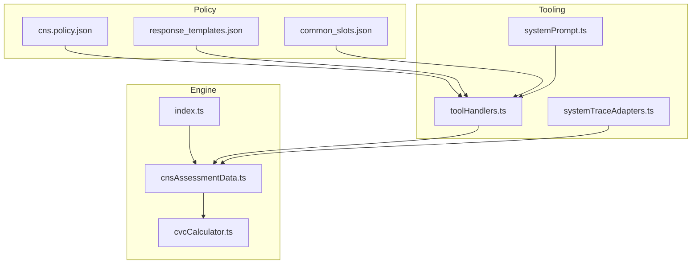
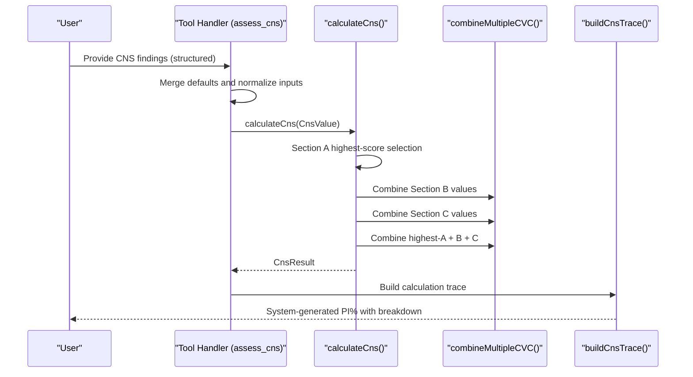
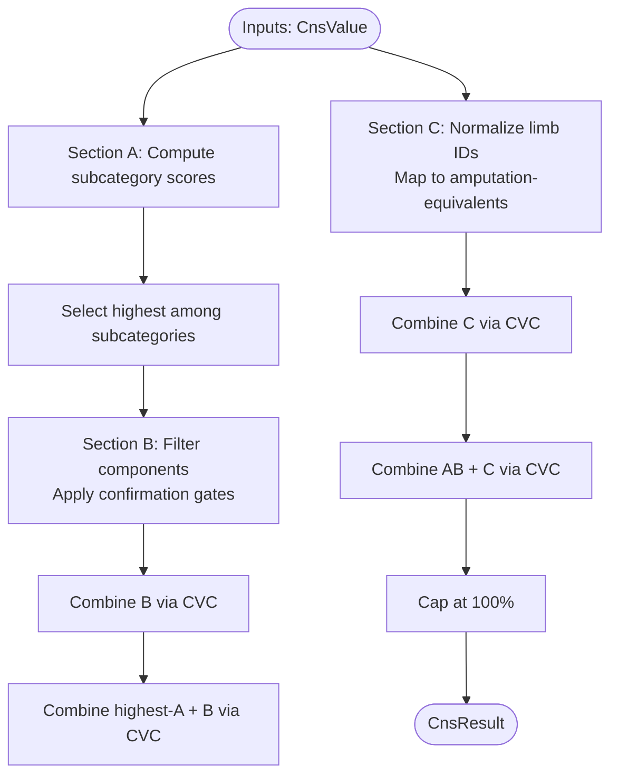
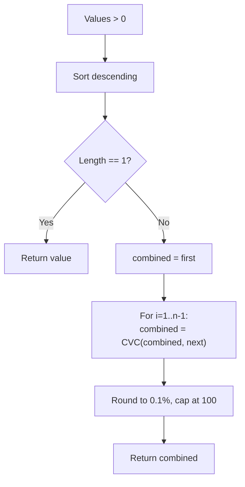
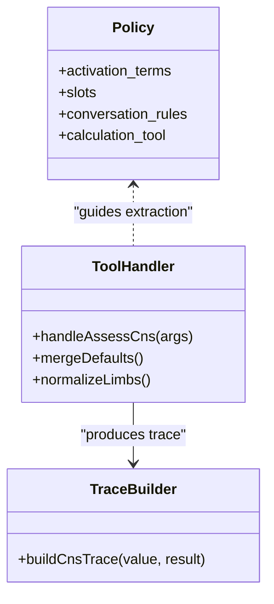
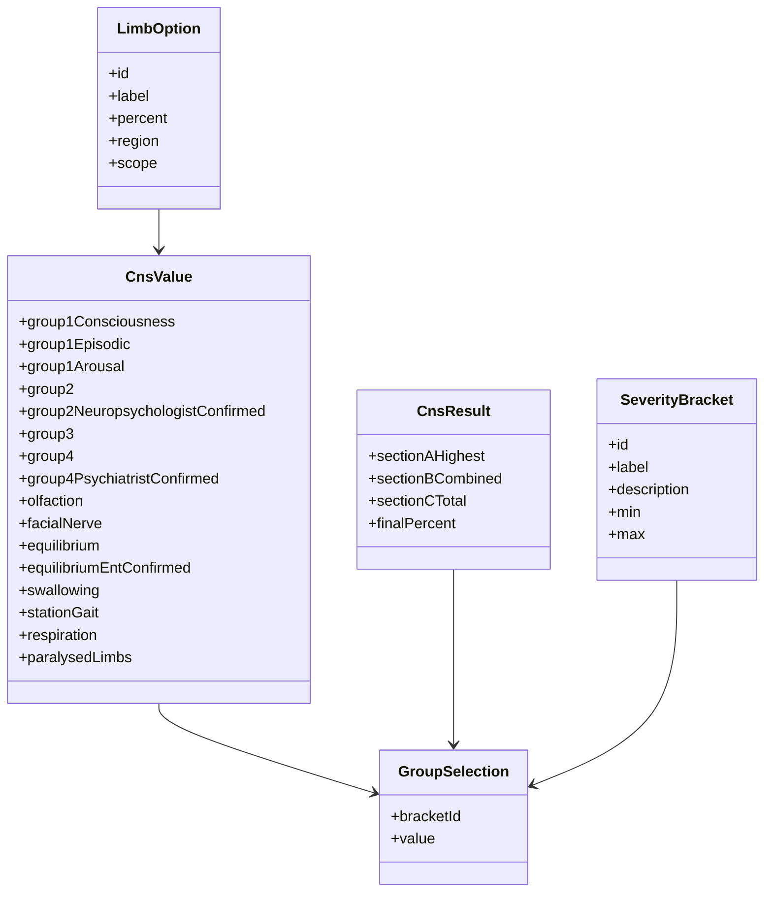
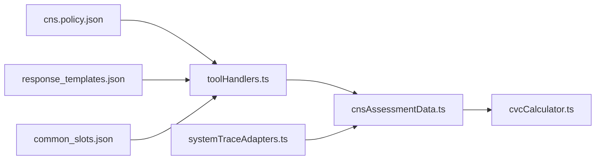

# CNS Assessment (Chapter 10)

<cite>
**Referenced Files in This Document**
- [cnsAssessmentData.ts](file://src/engine/cnsAssessmentData.ts)
- [cvcCalculator.ts](file://src/engine/cvcCalculator.ts)
- [index.ts](file://src/engine/index.ts)
- [cns.policy.json](file://gatiod_conversation_policy_data/policy/systems/cns.policy.json)
- [systemPrompt.ts](file://src/chat/systemPrompt.ts)
- [systemTraceAdapters.ts](file://src/v2/systemTraceAdapters.ts)
- [toolHandlers.ts](file://src/tools/toolHandlers.ts)
- [response_templates.json](file://gatiod_conversation_policy_data/policy/response_templates.json)
- [common_slots.json](file://gatiod_conversation_policy_data/policy/common_slots.json)
- [CONTEXT.md](file://CONTEXT.md)
</cite>

## Table of Contents
1. [Introduction](#introduction)
2. [Project Structure](#project-structure)
3. [Core Components](#core-components)
4. [Architecture Overview](#architecture-overview)
5. [Detailed Component Analysis](#detailed-component-analysis)
6. [Dependency Analysis](#dependency-analysis)
7. [Performance Considerations](#performance-considerations)
8. [Troubleshooting Guide](#troubleshooting-guide)
9. [Conclusion](#conclusion)
10. [Appendices](#appendices)

## Introduction
This document explains the CNS (Chapter 10) assessment system within the GATIOD framework. It covers the clinical criteria for central nervous system injuries, including cognitive function, neurological deficits, and behavioral changes. It documents the calculation algorithms used to determine permanent incapacity percentages, the configuration options and parameters for different injury types, and the return values for various assessment outcomes. It also describes how CNS assessments integrate with other body systems and contribute to the overall PI% calculation, along with practical examples, troubleshooting guidance, and performance optimization tips.

## Project Structure
The CNS assessment is implemented as a pure calculation engine module with supporting policies and tooling:
- Engine: CNS calculation logic, severity brackets, and CVC combination utilities
- Policy: Conversation flow, activation terms, slots, and rules for CNS
- Tooling: Assessment tool handler and tracing/reporting utilities
- Integration: Exported via engine index for use by higher-level orchestration

**Diagram sources**
- [cnsAssessmentData.ts:1-728](file://src/engine/cnsAssessmentData.ts#L1-L728)
- [cvcCalculator.ts:1-108](file://src/engine/cvcCalculator.ts#L1-L108)
- [index.ts:1-89](file://src/engine/index.ts#L1-L89)
- [cns.policy.json:1-148](file://gatiod_conversation_policy_data/policy/systems/cns.policy.json#L1-L148)
- [response_templates.json:1-48](file://gatiod_conversation_policy_data/policy/response_templates.json#L1-L48)
- [common_slots.json:1-77](file://gatiod_conversation_policy_data/policy/common_slots.json#L1-L77)
- [toolHandlers.ts:186-385](file://src/tools/toolHandlers.ts#L186-L385)
- [systemTraceAdapters.ts:405-473](file://src/v2/systemTraceAdapters.ts#L405-L473)
- [systemPrompt.ts:230-234](file://src/chat/systemPrompt.ts#L230-L234)

**Section sources**
- [cnsAssessmentData.ts:1-728](file://src/engine/cnsAssessmentData.ts#L1-L728)
- [cvcCalculator.ts:1-108](file://src/engine/cvcCalculator.ts#L1-L108)
- [index.ts:1-89](file://src/engine/index.ts#L1-L89)
- [cns.policy.json:1-148](file://gatiod_conversation_policy_data/policy/systems/cns.policy.json#L1-L148)
- [systemPrompt.ts:230-234](file://src/chat/systemPrompt.ts#L230-L234)
- [systemTraceAdapters.ts:405-473](file://src/v2/systemTraceAdapters.ts#L405-L473)
- [toolHandlers.ts:186-385](file://src/tools/toolHandlers.ts#L186-L385)
- [response_templates.json:1-48](file://gatiod_conversation_policy_data/policy/response_templates.json#L1-L48)
- [common_slots.json:1-77](file://gatiod_conversation_policy_data/policy/common_slots.json#L1-L77)
- [CONTEXT.md:1-25](file://CONTEXT.md#L1-L25)

## Core Components
- CNS calculation engine: Implements Chapter 10 criteria with three sections and CVC combination
- CVC calculator: Provides deterministic combination of independent PI% values
- Policy and conversation flow: Guides extraction of facts, specialist confirmation gating, and calculation
- Tool handler: Validates inputs, merges defaults, and executes CNS calculation
- Tracing/reporting: Produces a detailed calculation trace for transparency

Key responsibilities:
- Section A: Highest-score selection among cerebral groups (consciousness/arousal, episodic, mental status, communication, emotional/behavioral)
- Section B: Other neurological components combined via CVC
- Section C: Paralysed limbs mapped to amputation-equivalent values
- Final PI%: CVC combination of the highest Section A score, combined Section B, and combined Section C

**Section sources**
- [cnsAssessmentData.ts:42-728](file://src/engine/cnsAssessmentData.ts#L42-L728)
- [cvcCalculator.ts:1-108](file://src/engine/cvcCalculator.ts#L1-L108)
- [cns.policy.json:11-148](file://gatiod_conversation_policy_data/policy/systems/cns.policy.json#L11-L148)
- [toolHandlers.ts:188-195](file://src/tools/toolHandlers.ts#L188-L195)
- [systemTraceAdapters.ts:405-473](file://src/v2/systemTraceAdapters.ts#L405-L473)

## Architecture Overview
The CNS assessment follows a deterministic pipeline:
- Inputs: Structured findings for each CNS category
- Processing: Apply highest-score rule in Section A, combine Section B and C via CVC
- Output: Final PI% with breakdown and trace

**Diagram sources**
- [toolHandlers.ts:188-195](file://src/tools/toolHandlers.ts#L188-L195)
- [cnsAssessmentData.ts:606-699](file://src/engine/cnsAssessmentData.ts#L606-L699)
- [cvcCalculator.ts:74-89](file://src/engine/cvcCalculator.ts#L74-L89)
- [systemTraceAdapters.ts:405-473](file://src/v2/systemTraceAdapters.ts#L405-L473)

## Detailed Component Analysis

### CNS Calculation Engine (cnsAssessmentData.ts)
- Section A: Four cerebral groups with fixed-PI brackets; highest-score rule selects the winning subcategory within Section A
- Section B: Separate components (olfaction, facial nerve, equilibrium, swallowing, station/gait, respiration) combined via CVC
- Section C: Paralysed limbs mapped to amputation-equivalent percentages; bilateral overrides single limbs
- Specialist confirmation gates: Group 2 requires neuropsychologist confirmation; Group 4 requires psychiatrist confirmation
- Final PI%: CVC of highest Section A score, combined Section B, and combined Section C, capped at 100%

**Diagram sources**
- [cnsAssessmentData.ts:606-699](file://src/engine/cnsAssessmentData.ts#L606-L699)
- [cvcCalculator.ts:74-89](file://src/engine/cvcCalculator.ts#L74-L89)

Key implementation highlights:
- Highest-score rule in Section A: Winner is the maximum among subcategories
- Specialist confirmation gating: Group 2 and Group 4 are zeroed unless confirmed
- Confirmation gates for equilibrium: Requires ENT confirmation to count
- Limb normalization: Bilateral limbs override single limbs; duplicates removed
- Final cap: Ensures PI% does not exceed 100

**Section sources**
- [cnsAssessmentData.ts:42-728](file://src/engine/cnsAssessmentData.ts#L42-L728)
- [cvcCalculator.ts:1-108](file://src/engine/cvcCalculator.ts#L1-L108)

### CVC Calculator (cvcCalculator.ts)
- Deterministic combination formula: a + b(1 − a/100)
- Supports two modes:
  - Iterative combination for arrays
  - Appendix chart behavior: whole-number rounding at each step, then fractions added back
- Additional helpers:
  - Additive combination (used by other systems)
  - Select highest (used by CNS cerebral and ankylosis)

**Diagram sources**
- [cvcCalculator.ts:58-89](file://src/engine/cvcCalculator.ts#L58-L89)

**Section sources**
- [cvcCalculator.ts:1-108](file://src/engine/cvcCalculator.ts#L1-L108)

### Conversation Policy and Tooling (cns.policy.json, toolHandlers.ts, systemTraceAdapters.ts)
- Policy defines:
  - Activation terms for CNS-related concepts
  - Slots for Section A/B/C and specialist confirmation
  - Rules for highest-score and confirmation gating
- Tool handler:
  - Merges defaults with user inputs
  - Normalizes paralysed limbs
  - Executes CNS calculation and returns structured result
- Tracing:
  - Builds a readable trace of inputs, exclusions, and combination steps

**Diagram sources**
- [cns.policy.json:11-148](file://gatiod_conversation_policy_data/policy/systems/cns.policy.json#L11-L148)
- [toolHandlers.ts:188-195](file://src/tools/toolHandlers.ts#L188-L195)
- [systemTraceAdapters.ts:405-473](file://src/v2/systemTraceAdapters.ts#L405-L473)

**Section sources**
- [cns.policy.json:1-148](file://gatiod_conversation_policy_data/policy/systems/cns.policy.json#L1-L148)
- [toolHandlers.ts:188-195](file://src/tools/toolHandlers.ts#L188-L195)
- [systemTraceAdapters.ts:405-473](file://src/v2/systemTraceAdapters.ts#L405-L473)

### Data Models and Interfaces
- CnsValue: Structured inputs for CNS assessment
- CnsResult: Full breakdown and final PI%
- SeverityBracket and GroupSelection: Define categorical ratings and ranges
- LimbOption: Amputation-equivalent mapping for paralysed limbs

**Diagram sources**
- [cnsAssessmentData.ts:28-545](file://src/engine/cnsAssessmentData.ts#L28-L545)

**Section sources**
- [cnsAssessmentData.ts:28-545](file://src/engine/cnsAssessmentData.ts#L28-L545)

## Dependency Analysis
- CNS engine depends on CVC calculator for combination
- Tool handler depends on CNS engine and defaults
- Tracing depends on CNS results and limb options
- Policy drives conversation flow and extraction

**Diagram sources**
- [toolHandlers.ts:188-195](file://src/tools/toolHandlers.ts#L188-L195)
- [cnsAssessmentData.ts:606-699](file://src/engine/cnsAssessmentData.ts#L606-L699)
- [cvcCalculator.ts:74-89](file://src/engine/cvcCalculator.ts#L74-L89)
- [systemTraceAdapters.ts:405-473](file://src/v2/systemTraceAdapters.ts#L405-L473)
- [cns.policy.json:1-148](file://gatiod_conversation_policy_data/policy/systems/cns.policy.json#L1-L148)
- [response_templates.json:1-48](file://gatiod_conversation_policy_data/policy/response_templates.json#L1-L48)
- [common_slots.json:1-77](file://gatiod_conversation_policy_data/policy/common_slots.json#L1-L77)

**Section sources**
- [index.ts:84-85](file://src/engine/index.ts#L84-L85)
- [cnsAssessmentData.ts:10](file://src/engine/cnsAssessmentData.ts#L10)
- [cvcCalculator.ts:11-12](file://src/engine/cvcCalculator.ts#L11-L12)

## Performance Considerations
- Complexity: CNS calculation is O(n) in the number of components; Section A selection is constant-time comparisons
- Rounding: CVC uses 0.1% rounding; Appendix chart behavior ensures deterministic rounding at each step
- Early exits: Zero values are filtered before combination; empty arrays return 0
- Normalization: Limb normalization avoids redundant combinations and enforces bilateral dominance

Optimization tips:
- Pre-normalize limb IDs to avoid repeated filtering
- Use additive pre-checks for components that do not require CVC combination
- Cache Appendix chart rounding behavior for frequently combined values

[No sources needed since this section provides general guidance]

## Troubleshooting Guide
Common issues and resolutions:
- Missing specialist confirmation:
  - Group 2 (mental status) requires neuropsychologist confirmation; Group 4 (emotional/behavioral) requires psychiatrist confirmation. If not confirmed, the corresponding group is excluded from Section A.
- Equilibrium gating:
  - Equilibrium component requires ENT confirmation to be counted in Section B.
- Bilateral overrides single limbs:
  - If both upper limbs are selected, single upper limb selections are ignored. Same applies to lower limbs.
- Tie handling in Section A:
  - If multiple subcategories tie at the highest value, the first-listed group is retained.
- Final cap:
  - The final PI% is capped at 100%; if intermediate combination exceeds 100%, it is reduced accordingly.

Operational checks:
- Ensure inputs conform to the CnsValue schema and bracket IDs
- Verify that paralysed limbs are normalized and valid
- Confirm that confirmation gates are satisfied before calculation

**Section sources**
- [cnsAssessmentData.ts:624-626](file://src/engine/cnsAssessmentData.ts#L624-L626)
- [cnsAssessmentData.ts:657](file://src/engine/cnsAssessmentData.ts#L657)
- [cnsAssessmentData.ts:494-504](file://src/engine/cnsAssessmentData.ts#L494-L504)
- [cnsAssessmentData.ts:642-645](file://src/engine/cnsAssessmentData.ts#L642-L645)
- [cnsAssessmentData.ts:677](file://src/engine/cnsAssessmentData.ts#L677)
- [cns.policy.json:121-134](file://gatiod_conversation_policy_data/policy/systems/cns.policy.json#L121-L134)

## Conclusion
The CNS (Chapter 10) assessment system implements a rigorous, deterministic approach to calculating permanent incapacity percentages. It applies the highest-score rule within cerebral groups, combines other neurological components and limb deficits via the CVC formula, and enforces specialist confirmation gates. The system integrates seamlessly with the broader GATIOD framework, providing transparent traces and robust handling of common clinical scenarios.

[No sources needed since this section summarizes without analyzing specific files]

## Appendices

### Clinical Scenarios and Examples
- Traumatic brain injury:
  - Consciousness/arousal disturbances and episodic impairments (e.g., post-traumatic seizures) are rated using Section A brackets; other deficits (e.g., speech/swallowing) are captured in Section B.
- Stroke:
  - Motor deficits and speech/swallowing impairments map to Section B; residual motor deficits may be represented via paralysed limbs with amputation-equivalent values.
- Epilepsy:
  - Episodic seizure disorder severity determines the Section A score; if frequent/uncontrolled, it may dominate the overall PI%.
- Neurodegenerative diseases:
  - Cognitive/memory deficits fall under mental status (Group 2); emotional/behavioral changes under Group 4; communication and speech deficits under Section B.

[No sources needed since this section provides general guidance]

### Configuration Options and Parameters
- Section A:
  - Group 1: Consciousness/arousal, Episodic neurological impairment, Arousal/sleep
  - Group 2: Mental status (requires neuropsychologist confirmation)
  - Group 3: Communication/dysphasia/aphasia
  - Group 4: Emotional/behavioral (requires psychiatrist confirmation)
- Section B:
  - Olfaction, Facial nerve, Equilibrium (ENT confirmed), Swallowing/speech, Station/gait, Respiratory
- Section C:
  - Paralysed limbs mapped to amputation-equivalent percentages; bilateral overrides single limbs

**Section sources**
- [cnsAssessmentData.ts:46-461](file://src/engine/cnsAssessmentData.ts#L46-L461)
- [cnsAssessmentData.ts:241-375](file://src/engine/cnsAssessmentData.ts#L241-L375)
- [cnsAssessmentData.ts:390-461](file://src/engine/cnsAssessmentData.ts#L390-L461)

### Return Values and Calculation Outputs
- CnsResult fields include:
  - Section A highest score and winner group
  - Section B combined value and included components
  - Section C total and selected limb IDs
  - Combined totals and final PI%
  - Flags such as first schedule bonus for bilateral upper limbs

**Section sources**
- [cnsAssessmentData.ts:547-573](file://src/engine/cnsAssessmentData.ts#L547-L573)

### Integration with Other Systems and Overall PI%
- Global CVC:
  - After individual system calculations, subtotals are combined using CVC to produce the overall PI%
- First schedule bonus:
  - If both upper limbs are selected, an additional note is included in the trace

**Section sources**
- [systemTraceAdapters.ts:463-465](file://src/v2/systemTraceAdapters.ts#L463-L465)
- [toolHandlers.ts:207-228](file://src/tools/toolHandlers.ts#L207-L228)