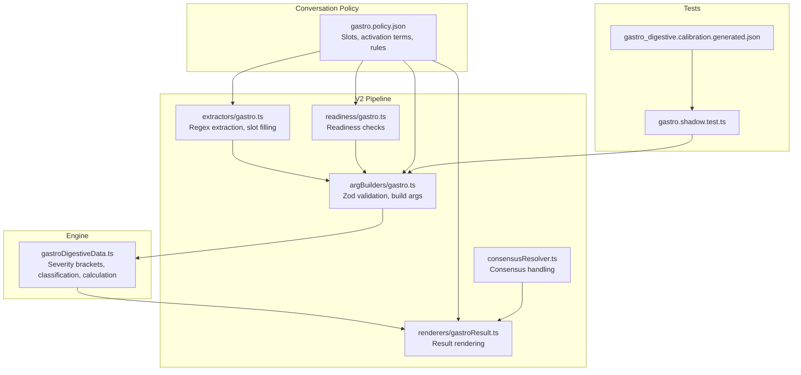
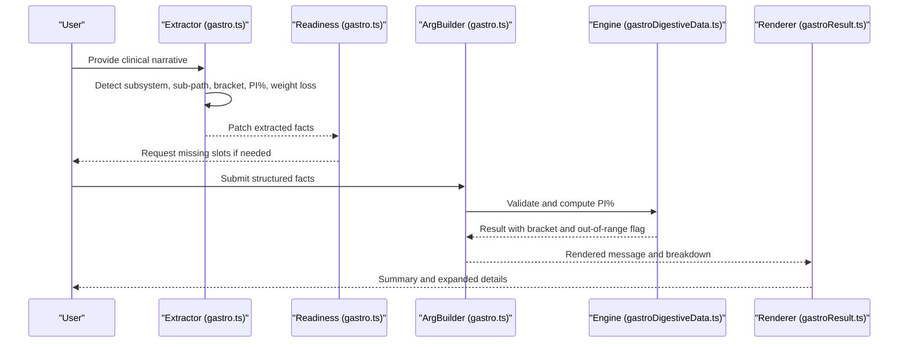
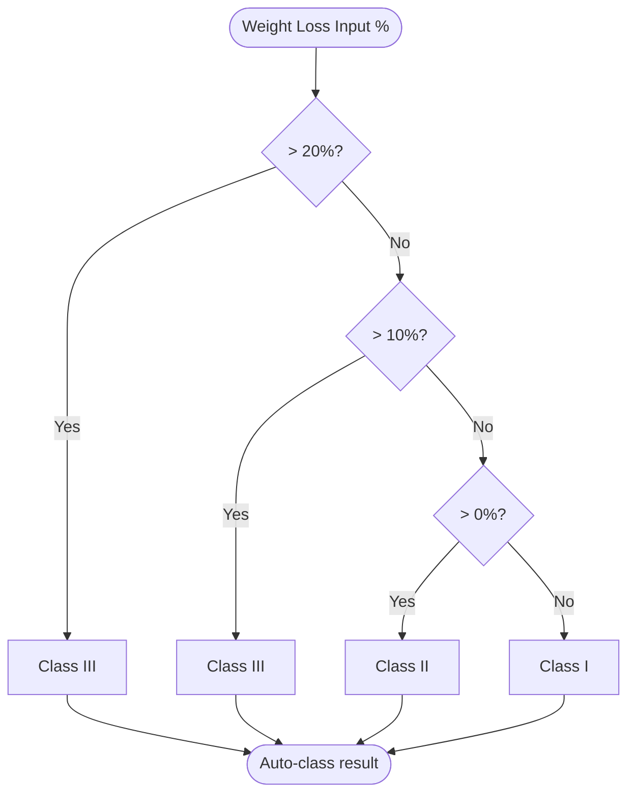
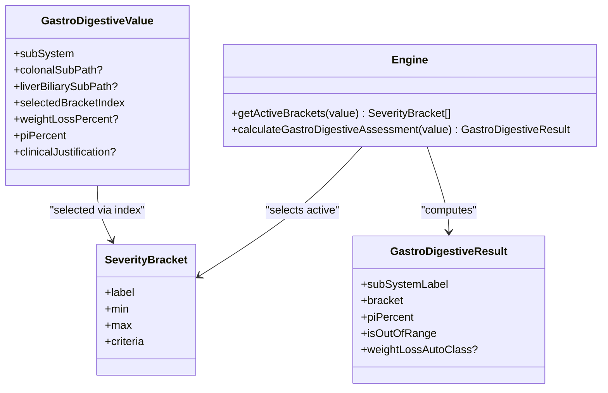
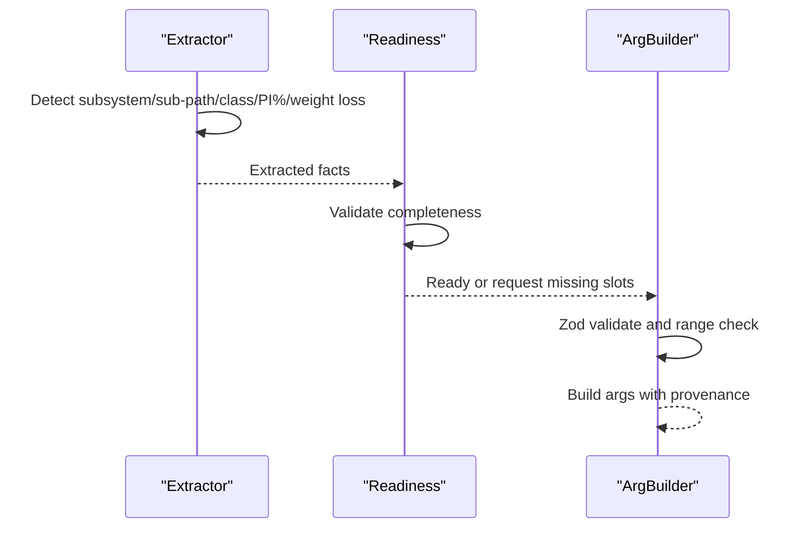
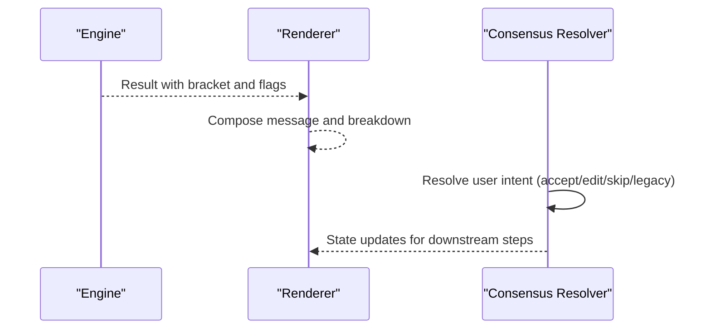
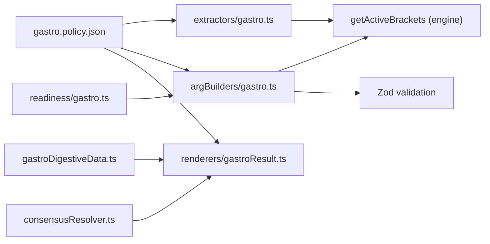

# Gastro/Digestive Assessment (Chapter 8)

<cite>
**Referenced Files in This Document**
- [gastroDigestiveData.ts](file://src/engine/gastroDigestiveData.ts)
- [gastro.policy.json](file://gatiod_conversation_policy_data/policy/systems/gastro.policy.json)
- [gastro.ts](file://src/v2/argBuilders/gastro.ts)
- [gastro.ts](file://src/v2/extractors/gastro.ts)
- [gastro.ts](file://src/v2/readiness/gastro.ts)
- [gastroResult.ts](file://src/v2/renderers/gastroResult.ts)
- [gastro.shadow.test.ts](file://tests/v2/excelScenarios/gastro.shadow.test.ts)
- [gastro_digestive.calibration.generated.json](file://tests/v2/excelScenarios/gastro_digestive.calibration.generated.json)
- [consensusResolver.ts](file://src/v2/consensusResolver.ts)
</cite>

## Table of Contents
1. [Introduction](#introduction)
2. [Project Structure](#project-structure)
3. [Core Components](#core-components)
4. [Architecture Overview](#architecture-overview)
5. [Detailed Component Analysis](#detailed-component-analysis)
6. [Dependency Analysis](#dependency-analysis)
7. [Performance Considerations](#performance-considerations)
8. [Troubleshooting Guide](#troubleshooting-guide)
9. [Conclusion](#conclusion)
10. [Appendices](#appendices)

## Introduction
This document explains the Gastro/Digestive (Chapter 8) assessment system that calculates Permanent Incapacity (PI%) for injuries affecting the gastrointestinal (GI) system. It covers:
- Subsystems and severity brackets
- Clinical evaluation criteria for nutritional status, bowel function, and organ dysfunction
- Calculation algorithms and PI% assignment within severity brackets
- Structured data processing from clinical findings to assessment results
- Configuration options and parameters per injury type
- Integration with other body systems and contribution to overall PI%
- Common clinical scenarios and troubleshooting guidance

## Project Structure
The Gastro/Digestive system is implemented as part of the V2 conversational assessment engine. Key elements:
- Engine-level data and calculation logic
- Policy-driven conversation flow
- Extraction, readiness checks, argument building, rendering, and shadow testing

**Diagram sources**
- [gastroDigestiveData.ts:130-167](file://src/engine/gastroDigestiveData.ts#L130-L167)
- [gastro.policy.json:1-145](file://gatiod_conversation_policy_data/policy/systems/gastro.policy.json#L1-L145)
- [gastro.ts:87-277](file://src/v2/extractors/gastro.ts#L87-L277)
- [gastro.ts:11-56](file://src/v2/readiness/gastro.ts#L11-L56)
- [gastro.ts:49-96](file://src/v2/argBuilders/gastro.ts#L49-L96)
- [gastroResult.ts:7-69](file://src/v2/renderers/gastroResult.ts#L7-L69)
- [consensusResolver.ts:195-445](file://src/v2/consensusResolver.ts#L195-L445)
- [gastro.shadow.test.ts:10-25](file://tests/v2/excelScenarios/gastro.shadow.test.ts#L10-L25)
- [gastro_digestive.calibration.generated.json:1-70](file://tests/v2/excelScenarios/gastro_digestive.calibration.generated.json#L1-L70)

**Section sources**
- [gastroDigestiveData.ts:1-167](file://src/engine/gastroDigestiveData.ts#L1-L167)
- [gastro.policy.json:1-145](file://gatiod_conversation_policy_data/policy/systems/gastro.policy.json#L1-L145)
- [gastro.ts:1-277](file://src/v2/extractors/gastro.ts#L1-L277)
- [gastro.ts:1-56](file://src/v2/readiness/gastro.ts#L1-L56)
- [gastro.ts:1-96](file://src/v2/argBuilders/gastro.ts#L1-L96)
- [gastroResult.ts:1-69](file://src/v2/renderers/gastroResult.ts#L1-L69)
- [gastro.shadow.test.ts:1-26](file://tests/v2/excelScenarios/gastro.shadow.test.ts#L1-L26)
- [gastro_digestive.calibration.generated.json:1-70](file://tests/v2/excelScenarios/gastro_digestive.calibration.generated.json#L1-L70)

## Core Components
- Subsystems and severity brackets
  - Upper Digestive Tract (oesophagus, stomach, duodenum, small intestine, pancreas)
  - Colonic, Rectal & Anal Disorders (large intestine, rectum, anus)
  - Liver & Biliary Tract Disease (liver, biliary tract)
  - Herniation (abdominal wall, umbilical, incisional, inguinal, femoral)
- Severity brackets define minimum and maximum PI% ranges per subsystem
- Weight loss classification for Upper Digestive
- Structured input model and calculation result model
- Conversation policy defines slots, activation terms, and rules

Key implementation references:
- Subsystem definitions and bracket tables
- Weight loss auto-classification
- Active bracket selection based on subsystem and sub-path
- PI% range validation and out-of-range detection

**Section sources**
- [gastroDigestiveData.ts:13-24](file://src/engine/gastroDigestiveData.ts#L13-L24)
- [gastroDigestiveData.ts:35-79](file://src/engine/gastroDigestiveData.ts#L35-L79)
- [gastroDigestiveData.ts:99-108](file://src/engine/gastroDigestiveData.ts#L99-L108)
- [gastroDigestiveData.ts:130-167](file://src/engine/gastroDigestiveData.ts#L130-L167)
- [gastro.policy.json:33-50](file://gatiod_conversation_policy_data/policy/systems/gastro.policy.json#L33-L50)
- [gastro.policy.json:51-120](file://gatiod_conversation_policy_data/policy/systems/gastro.policy.json#L51-L120)

## Architecture Overview
The V2 pipeline orchestrates extraction, validation, calculation, and rendering for Gastro/Digestive:

**Diagram sources**
- [gastro.ts:87-277](file://src/v2/extractors/gastro.ts#L87-L277)
- [gastro.ts:11-56](file://src/v2/readiness/gastro.ts#L11-L56)
- [gastro.ts:49-96](file://src/v2/argBuilders/gastro.ts#L49-L96)
- [gastroDigestiveData.ts:145-167](file://src/engine/gastroDigestiveData.ts#L145-L167)
- [gastroResult.ts:7-69](file://src/v2/renderers/gastroResult.ts#L7-L69)

## Detailed Component Analysis

### Severity Bracket Tables and Weight Loss Classification
- Upper Digestive Brackets: Class I–IV ranges and criteria
- Colonic/Rectal Brackets: Class I–IV ranges and criteria
- Anal Disease Brackets: Class I–III ranges and criteria
- Liver Disease Brackets: Class I–IV ranges and criteria
- Biliary Tract Brackets: Class I–IV ranges and criteria
- Herniation Brackets: Class I–III ranges and criteria
- Weight loss auto-classification for Upper Digestive:
  - Over 20% → Class III
  - Over 10% and up to 20% → Class III
  - Over 0% and up to 10% → Class II
  - 0% → Class I

**Diagram sources**
- [gastroDigestiveData.ts:101-108](file://src/engine/gastroDigestiveData.ts#L101-L108)

**Section sources**
- [gastroDigestiveData.ts:35-79](file://src/engine/gastroDigestiveData.ts#L35-L79)
- [gastroDigestiveData.ts:99-108](file://src/engine/gastroDigestiveData.ts#L99-L108)

### Structured Data Model and Calculation
- Input model includes subsystem, optional sub-path, selected bracket index, PI%, optional weight loss, and optional clinical justification
- Active bracket selection depends on subsystem and sub-path
- Out-of-range detection compares assigned PI% to selected bracket bounds
- Result includes subsystem label, bracket, PI%, out-of-range flag, and optional auto-class

**Diagram sources**
- [gastroDigestiveData.ts:112-128](file://src/engine/gastroDigestiveData.ts#L112-L128)
- [gastroDigestiveData.ts:130-167](file://src/engine/gastroDigestiveData.ts#L130-L167)

**Section sources**
- [gastroDigestiveData.ts:112-128](file://src/engine/gastroDigestiveData.ts#L112-L128)
- [gastroDigestiveData.ts:130-167](file://src/engine/gastroDigestiveData.ts#L130-L167)

### Extraction, Readiness, and Argument Building
- Extraction detects subsystem, sub-path, severity class, PI%, and optional weight loss using regex patterns
- Readiness ensures all required slots are present before calculation
- ArgBuilder validates inputs, enforces bracket and PI% range constraints, and builds tool arguments

**Diagram sources**
- [gastro.ts:87-277](file://src/v2/extractors/gastro.ts#L87-L277)
- [gastro.ts:11-56](file://src/v2/readiness/gastro.ts#L11-L56)
- [gastro.ts:49-96](file://src/v2/argBuilders/gastro.ts#L49-L96)

**Section sources**
- [gastro.ts:87-277](file://src/v2/extractors/gastro.ts#L87-L277)
- [gastro.ts:11-56](file://src/v2/readiness/gastro.ts#L11-L56)
- [gastro.ts:49-96](file://src/v2/argBuilders/gastro.ts#L49-L96)

### Rendering and Consensus Integration
- Renderer composes a summary and expanded breakdown, flags out-of-range and auto-class notes, and sets display mode accordingly
- Consensus resolver integrates with the broader system to accept, edit, or defer assessments

**Diagram sources**
- [gastroResult.ts:7-69](file://src/v2/renderers/gastroResult.ts#L7-L69)
- [consensusResolver.ts:195-445](file://src/v2/consensusResolver.ts#L195-L445)

**Section sources**
- [gastroResult.ts:7-69](file://src/v2/renderers/gastroResult.ts#L7-L69)
- [consensusResolver.ts:195-445](file://src/v2/consensusResolver.ts#L195-L445)

### Conversation Policy and Configuration
- Activation terms include gastro, digestive, oesophagus/esophagus, stomach, bowel, colon, rectum, anus, liver, biliary, hernia, pancreas
- Slots capture subsystem, sub-path, severity bracket, PI%, clinical justification, and confirmation
- Global rules emphasize asking the smallest next question, extracting and confirming facts, and never rendering final PI% until the assess tool succeeds

**Section sources**
- [gastro.policy.json:1-145](file://gatiod_conversation_policy_data/policy/systems/gastro.policy.json#L1-L145)

### Shadow Testing and Calibration
- Shadow runner executes Excel scenarios for gastro_digestive, enforcing ADR-0001 thresholds
- Calibration report tracks outcomes across expected categories

**Section sources**
- [gastro.shadow.test.ts:1-26](file://tests/v2/excelScenarios/gastro.shadow.test.ts#L1-L26)
- [gastro_digestive.calibration.generated.json:1-70](file://tests/v2/excelScenarios/gastro_digestive.calibration.generated.json#L1-L70)

## Dependency Analysis
- Extractor depends on engine for bracket lookup and on policy for activation terms
- ArgBuilder depends on engine for bracket validation and on extractor keys for provenance
- Renderer depends on engine results and extractor keys for display
- Readiness gates calculation until required slots are present
- Consensus resolver interacts with renderer to manage acceptance and edits

**Diagram sources**
- [gastro.ts:80-83](file://src/v2/extractors/gastro.ts#L80-L83)
- [gastro.ts:32-43](file://src/v2/argBuilders/gastro.ts#L32-L43)
- [gastroDigestiveData.ts:130-143](file://src/engine/gastroDigestiveData.ts#L130-L143)
- [gastroResult.ts:1-69](file://src/v2/renderers/gastroResult.ts#L1-L69)
- [gastro.policy.json:1-145](file://gatiod_conversation_policy_data/policy/systems/gastro.policy.json#L1-L145)
- [gastro.ts:1-56](file://src/v2/readiness/gastro.ts#L1-L56)
- [consensusResolver.ts:195-445](file://src/v2/consensusResolver.ts#L195-L445)

**Section sources**
- [gastro.ts:80-83](file://src/v2/extractors/gastro.ts#L80-L83)
- [gastro.ts:32-43](file://src/v2/argBuilders/gastro.ts#L32-L43)
- [gastroDigestiveData.ts:130-143](file://src/engine/gastroDigestiveData.ts#L130-L143)
- [gastroResult.ts:1-69](file://src/v2/renderers/gastroResult.ts#L1-L69)
- [gastro.policy.json:1-145](file://gatiod_conversation_policy_data/policy/systems/gastro.policy.json#L1-L145)
- [gastro.ts:1-56](file://src/v2/readiness/gastro.ts#L1-L56)
- [consensusResolver.ts:195-445](file://src/v2/consensusResolver.ts#L195-L445)

## Performance Considerations
- Regex-based extraction is efficient for keyword detection; keep patterns concise and localized to gastro context
- Validation occurs in ArgBuilder; ensure early exits reduce unnecessary computation
- Weight loss auto-classification is O(1) and lightweight
- Rendering flags (out-of-range, auto-class) enable quick UI expansion only when needed

## Troubleshooting Guide
Common issues and resolutions:
- Missing subsystem or sub-path
  - Cause: Extraction could not infer subsystem or sub-path from text
  - Resolution: Ask clarifying questions defined in readiness and extractor logic
- Severity bracket out of range
  - Cause: Assigned PI% falls outside the selected bracket’s min/max
  - Resolution: Adjust PI% to match bracket or select a different bracket
- Weight loss misclassification
  - Cause: Ambiguous or missing weight loss input
  - Resolution: Prompt for precise percentage; auto-classification follows strict thresholds
- Conflicting or missing clinical justification
  - Cause: Justification required before final PI% rendering
  - Resolution: Collect supporting evidence for chosen bracket and PI%

Operational tips:
- Use activation terms to guide extraction toward the correct subsystem
- Confirm PI% within bracket range before proceeding to confirmation
- Leverage shadow testing to validate scenarios and thresholds

**Section sources**
- [gastro.ts:11-56](file://src/v2/readiness/gastro.ts#L11-L56)
- [gastro.ts:25-43](file://src/v2/argBuilders/gastro.ts#L25-L43)
- [gastro.ts:192-213](file://src/v2/extractors/gastro.ts#L192-L213)
- [gastro.ts:228-262](file://src/v2/extractors/gastro.ts#L228-L262)
- [gastroResult.ts:16-16](file://src/v2/renderers/gastroResult.ts#L16-L16)

## Conclusion
The Gastro/Digestive assessment system provides a structured, policy-driven pathway to calculate PI% for GI injuries across four subsystems. By combining robust extraction, validation, and calculation logic with clear conversation policies, it supports accurate and reproducible assessments that integrate seamlessly into overall PI% calculations.

## Appendices

### Configuration Options and Parameters
- Subsystems
  - upperDigestive
  - colonicRectalAnal (requires colonalSubPath)
  - liverBiliary (requires liverBiliarySubPath)
  - herniation
- Sub-paths
  - colonicRectalAnal → colonicRectal or anal
  - liverBiliary → liver or biliary
- Required inputs
  - subSystem
  - selectedBracketIndex
  - piPercent
- Optional inputs
  - colonalSubPath
  - liverBiliarySubPath
  - weightLossPercent
  - clinicalJustification

**Section sources**
- [gastro.policy.json:51-120](file://gatiod_conversation_policy_data/policy/systems/gastro.policy.json#L51-L120)
- [gastro.ts:17-45](file://src/v2/argBuilders/gastro.ts#L17-L45)
- [gastro.ts:15-21](file://src/v2/extractors/gastro.ts#L15-L21)

### Return Values and Outcome Categories
- Engine result fields
  - subSystemLabel
  - bracket
  - piPercent
  - isOutOfRange
  - weightLossAutoClass?
- Renderer result fields
  - message
  - suggestedChips
  - resultSummary (finalPercent, categoryPercents)
  - fullBreakdown (inputFacts, categoryResults, finalPercent)

**Section sources**
- [gastroDigestiveData.ts:122-128](file://src/engine/gastroDigestiveData.ts#L122-L128)
- [gastroResult.ts:41-68](file://src/v2/renderers/gastroResult.ts#L41-L68)

### Integration with Other Body Systems
- Multi-system consensus resolution allows accepting, editing, skipping, or deferring systems
- Gastro results feed into combined PI% calculations via categoryPercents

**Section sources**
- [consensusResolver.ts:195-445](file://src/v2/consensusResolver.ts#L195-L445)
- [gastroResult.ts:44-47](file://src/v2/renderers/gastroResult.ts#L44-L47)