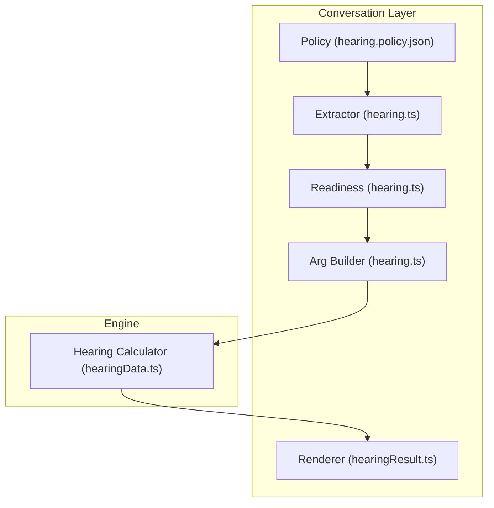
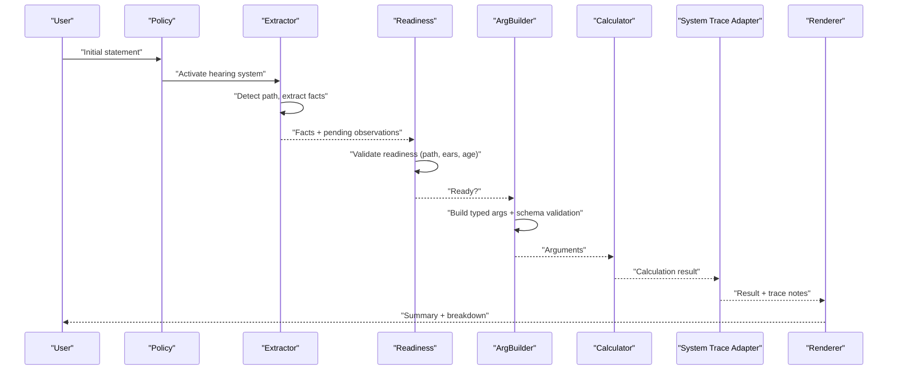
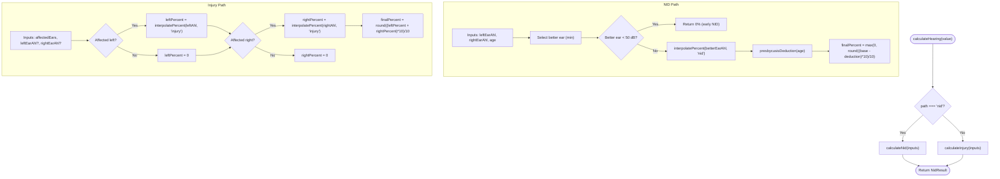
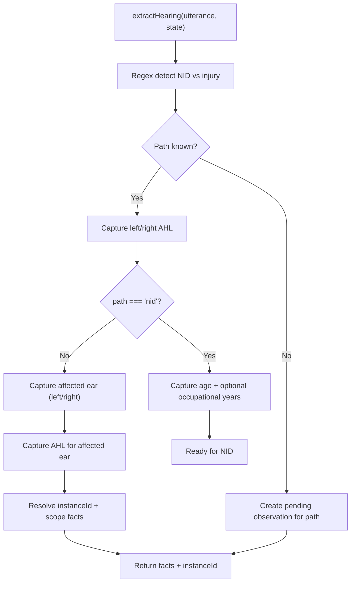
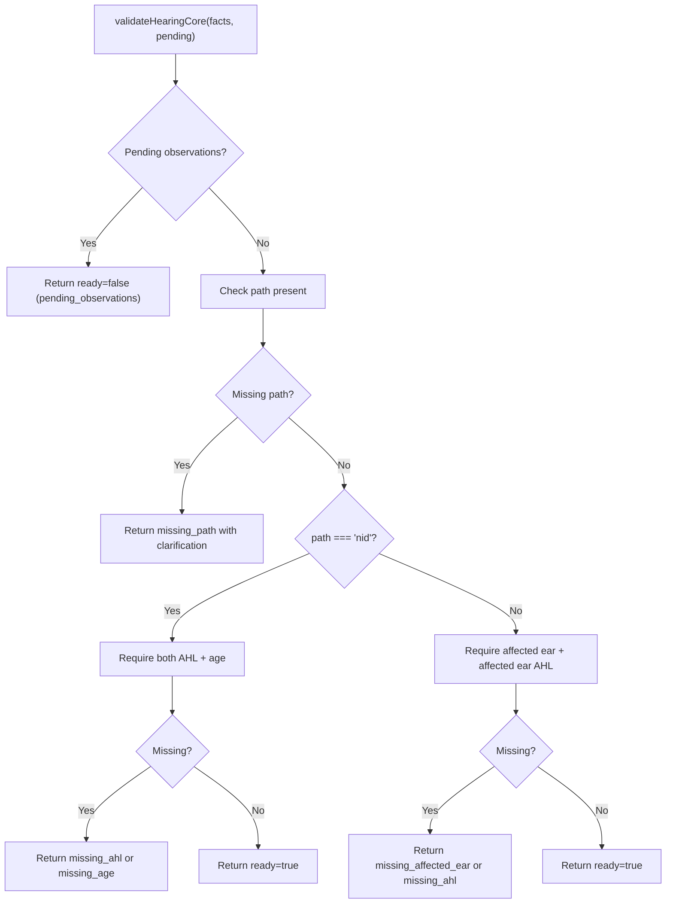
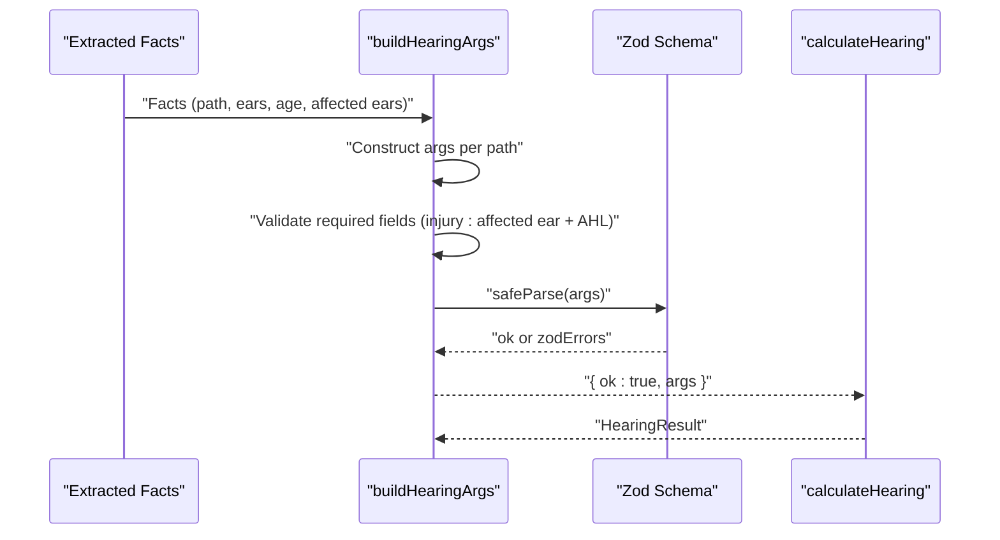
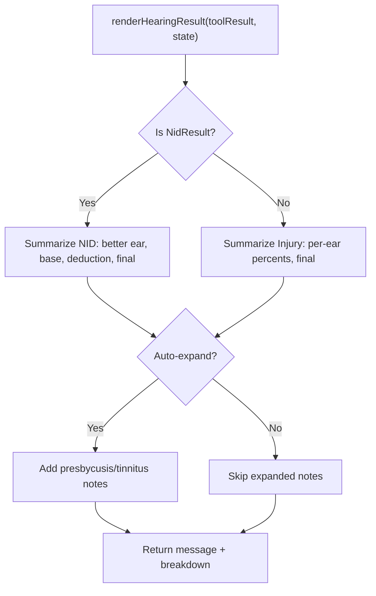
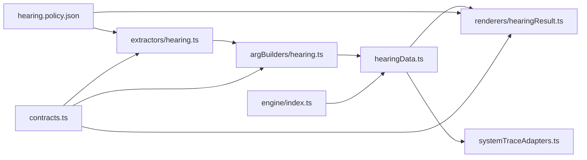

# Hearing Assessment (Chapter 9)

<cite>
**Referenced Files in This Document**
- [hearingData.ts](file://src/engine/hearingData.ts)
- [hearing.policy.json](file://gatiod_conversation_policy_data/policy/systems/hearing.policy.json)
- [hearing.ts](file://src/v2/argBuilders/hearing.ts)
- [hearing.ts](file://src/v2/extractors/hearing.ts)
- [hearing.ts](file://src/v2/readiness/hearing.ts)
- [hearingResult.ts](file://src/v2/renderers/hearingResult.ts)
- [index.ts](file://src/engine/index.ts)
- [contracts.ts](file://src/v2/contracts.ts)
- [systemTraceAdapters.ts](file://src/v2/systemTraceAdapters.ts)
- [scenarioCatalogue.test.ts](file://.claude/worktrees/admiring-brahmagupta-3a6208/tests/engine/scenarioCatalogue.test.ts)
- [hearing.shadow.test.ts](file://tests/v2/excelScenarios/hearing.shadow.test.ts)
- [extractor.test.ts](file://tests/v2/hearing/extractor.test.ts)
- [readinessAndArgBuilder.test.ts](file://tests/v2/hearing/readinessAndArgBuilder.test.ts)
</cite>

## Table of Contents
1. [Introduction](#introduction)
2. [Project Structure](#project-structure)
3. [Core Components](#core-components)
4. [Architecture Overview](#architecture-overview)
5. [Detailed Component Analysis](#detailed-component-analysis)
6. [Dependency Analysis](#dependency-analysis)
7. [Performance Considerations](#performance-considerations)
8. [Troubleshooting Guide](#troubleshooting-guide)
9. [Conclusion](#conclusion)
10. [Appendices](#appendices)

## Introduction
This document explains the Hearing Assessment system for Chapter 9 GATIOD calculations. It covers the implementation of auditory assessment criteria, audiometric testing results processing, hearing aid requirements, communication difficulties considerations, and the calculation algorithms used to determine permanent incapacity percentages for auditory injuries. It documents configuration options, parameters for different injury types, return values for various assessment outcomes, and how hearing assessments integrate with other body systems to contribute to overall PI% calculations. The guide includes concrete examples from the codebase, common clinical scenarios, troubleshooting guidance, and performance optimization tips.

## Project Structure
The Hearing system is implemented as a pure calculation engine with supporting orchestration layers:
- Engine: Core calculation logic for NID and Injury/Accident paths
- Extraction: Natural language understanding for detecting path, ear-specific values, and tinnitus
- Readiness: Validation ensuring sufficient facts before calculation
- Argument Building: Structuring validated facts into typed arguments for the calculator
- Rendering: Producing human-readable summaries and breakdowns
- Policy: Conversation flow and slot gating aligned to GATIOD requirements

**Diagram sources**
- [hearing.policy.json:1-135](file://gatiod_conversation_policy_data/policy/systems/hearing.policy.json#L1-L135)
- [hearing.ts:94-300](file://src/v2/extractors/hearing.ts#L94-L300)
- [hearing.ts:22-106](file://src/v2/readiness/hearing.ts#L22-L106)
- [hearing.ts:13-97](file://src/v2/argBuilders/hearing.ts#L13-L97)
- [hearingData.ts:179-193](file://src/engine/hearingData.ts#L179-L193)
- [hearingResult.ts:16-111](file://src/v2/renderers/hearingResult.ts#L16-L111)

**Section sources**
- [hearing.policy.json:1-135](file://gatiod_conversation_policy_data/policy/systems/hearing.policy.json#L1-L135)
- [hearing.ts:94-300](file://src/v2/extractors/hearing.ts#L94-L300)
- [hearing.ts:22-106](file://src/v2/readiness/hearing.ts#L22-L106)
- [hearing.ts:13-97](file://src/v2/argBuilders/hearing.ts#L13-L97)
- [hearingData.ts:179-193](file://src/engine/hearingData.ts#L179-L193)
- [hearingResult.ts:16-111](file://src/v2/renderers/hearingResult.ts#L16-L111)

## Core Components
- Hearing calculation engine: Implements discrete thresholds, better-ear selection for NID, presbycusis deduction, and per-ear logic for injury.
- Extraction and normalization: Detects NID vs injury, extracts left/right AHL values, age, affected ear, and tinnitus presence.
- Readiness validation: Enforces required fields per path and instance scoping for injury.
- Argument building: Translates extracted facts into typed arguments with schema validation.
- Rendering: Produces summary and detailed breakdown with rule notes and tinnitus context.
- Policy: Controls conversation flow, required slots, and gating rules.

Key calculation highlights:
- NID uses the better ear and a discrete table lookup; presbycusis deduction subtracts 0.5% per year over 50.
- Injury uses per-ear discrete lookup and sums percentages for single-ear instances.
- Thresholds: Below 50 dB is non-compensable for NID; values above 90 dB cap at the highest table row.

**Section sources**
- [hearingData.ts:20-58](file://src/engine/hearingData.ts#L20-L58)
- [hearingData.ts:90-119](file://src/engine/hearingData.ts#L90-L119)
- [hearingData.ts:138-155](file://src/engine/hearingData.ts#L138-L155)
- [hearing.ts:114-141](file://src/v2/extractors/hearing.ts#L114-L141)
- [hearing.ts:222-246](file://src/v2/extractors/hearing.ts#L222-L246)
- [hearing.ts:40-85](file://src/v2/readiness/hearing.ts#L40-L85)
- [hearing.ts:24-79](file://src/v2/argBuilders/hearing.ts#L24-L79)
- [hearingResult.ts:29-63](file://src/v2/renderers/hearingResult.ts#L29-L63)

## Architecture Overview
The Hearing system follows a layered pipeline: policy-driven conversation, extraction, validation, argument construction, calculation, and rendering.

**Diagram sources**
- [hearing.policy.json:1-135](file://gatiod_conversation_policy_data/policy/systems/hearing.policy.json#L1-L135)
- [hearing.ts:94-300](file://src/v2/extractors/hearing.ts#L94-L300)
- [hearing.ts:22-106](file://src/v2/readiness/hearing.ts#L22-L106)
- [hearing.ts:13-97](file://src/v2/argBuilders/hearing.ts#L13-L97)
- [hearingData.ts:179-193](file://src/engine/hearingData.ts#L179-L193)
- [systemTraceAdapters.ts:383-403](file://src/v2/systemTraceAdapters.ts#L383-L403)
- [hearingResult.ts:16-111](file://src/v2/renderers/hearingResult.ts#L16-L111)

## Detailed Component Analysis

### Calculation Engine (NID and Injury/Accident)
The engine defines discrete thresholds, interpolation, and deduction logic.

**Diagram sources**
- [hearingData.ts:90-119](file://src/engine/hearingData.ts#L90-L119)
- [hearingData.ts:138-155](file://src/engine/hearingData.ts#L138-L155)
- [hearingData.ts:44-58](file://src/engine/hearingData.ts#L44-L58)
- [hearingData.ts:66-69](file://src/engine/hearingData.ts#L66-L69)
- [hearingData.ts:179-193](file://src/engine/hearingData.ts#L179-L193)

Implementation notes:
- Discrete thresholds: 50–90 dB in 5 dB steps with floor snapping.
- Presbycusis deduction: 0.5% per year over 50.
- Injury final percent is rounded to 0.1% precision.

**Section sources**
- [hearingData.ts:20-58](file://src/engine/hearingData.ts#L20-L58)
- [hearingData.ts:66-69](file://src/engine/hearingData.ts#L66-L69)
- [hearingData.ts:90-119](file://src/engine/hearingData.ts#L90-L119)
- [hearingData.ts:138-155](file://src/engine/hearingData.ts#L138-L155)
- [hearingData.ts:179-193](file://src/engine/hearingData.ts#L179-L193)

### Extraction and Instance Scoping
The extractor detects NID vs injury, collects AHL values, age, affected ear, and tinnitus. It resolves instance IDs and scopes facts to prevent cross-ear contamination.

**Diagram sources**
- [hearing.ts:114-141](file://src/v2/extractors/hearing.ts#L114-L141)
- [hearing.ts:161-220](file://src/v2/extractors/hearing.ts#L161-L220)
- [hearing.ts:222-299](file://src/v2/extractors/hearing.ts#L222-L299)

Key behaviors:
- NID targets a global instance; injury targets left_ear or right_ear instance.
- For injury, the patch is scoped to exclude the uninvolved ear’s AHL.
- Regex patterns support flexible input formats (e.g., “left ear 65 dB”, “AHL 70”).

**Section sources**
- [hearing.ts:114-141](file://src/v2/extractors/hearing.ts#L114-L141)
- [hearing.ts:161-220](file://src/v2/extractors/hearing.ts#L161-L220)
- [hearing.ts:222-299](file://src/v2/extractors/hearing.ts#L222-L299)

### Readiness Validation
Ensures sufficient facts before calculation, with instance-aware scoping to avoid cross-ear false positives.

**Diagram sources**
- [hearing.ts:22-86](file://src/v2/readiness/hearing.ts#L22-L86)

**Section sources**
- [hearing.ts:22-86](file://src/v2/readiness/hearing.ts#L22-L86)

### Argument Building and Schema Validation
Builds typed arguments and validates against Zod schemas, with explicit gating for injury affected ear requirements.

**Diagram sources**
- [hearing.ts:13-97](file://src/v2/argBuilders/hearing.ts#L13-L97)
- [hearingData.ts:159-177](file://src/engine/hearingData.ts#L159-L177)
- [hearingData.ts:179-193](file://src/engine/hearingData.ts#L179-L193)

**Section sources**
- [hearing.ts:13-97](file://src/v2/argBuilders/hearing.ts#L13-L97)
- [hearingData.ts:159-177](file://src/engine/hearingData.ts#L159-L177)
- [hearingData.ts:179-193](file://src/engine/hearingData.ts#L179-L193)

### Rendering and Trace Notes
Renders summaries and detailed breakdowns, including rule notes and tinnitus context.

**Diagram sources**
- [hearingResult.ts:16-111](file://src/v2/renderers/hearingResult.ts#L16-L111)
- [systemTraceAdapters.ts:383-403](file://src/v2/systemTraceAdapters.ts#L383-L403)

**Section sources**
- [hearingResult.ts:16-111](file://src/v2/renderers/hearingResult.ts#L16-L111)
- [systemTraceAdapters.ts:383-403](file://src/v2/systemTraceAdapters.ts#L383-L403)

## Dependency Analysis
The Hearing system integrates with the broader engine and rendering pipeline.

**Diagram sources**
- [hearing.ts:94-300](file://src/v2/extractors/hearing.ts#L94-L300)
- [hearing.ts:13-97](file://src/v2/argBuilders/hearing.ts#L13-L97)
- [hearingData.ts:179-193](file://src/engine/hearingData.ts#L179-L193)
- [hearingResult.ts:16-111](file://src/v2/renderers/hearingResult.ts#L16-L111)
- [systemTraceAdapters.ts:383-403](file://src/v2/systemTraceAdapters.ts#L383-L403)
- [hearing.policy.json:1-135](file://gatiod_conversation_policy_data/policy/systems/hearing.policy.json#L1-L135)
- [index.ts:81-82](file://src/engine/index.ts#L81-L82)
- [contracts.ts:1-200](file://src/v2/contracts.ts#L1-L200)

**Section sources**
- [index.ts:81-82](file://src/engine/index.ts#L81-L82)
- [contracts.ts:1-200](file://src/v2/contracts.ts#L1-L200)

## Performance Considerations
- Extraction regex patterns are optimized for minimal backtracking and reuse of compiled expressions.
- Readiness validation short-circuits on pending observations and missing required fields.
- Calculation uses constant-time table lookup and simple arithmetic with rounding.
- Instance scoping prevents redundant fact processing and reduces cross-ear contamination risk.
- Shadow testing ensures consistent performance and accuracy across scenarios.

[No sources needed since this section provides general guidance]

## Troubleshooting Guide
Common issues and resolutions:
- Missing path: The extractor creates a pending observation to clarify NID vs injury. Ensure the user specifies the path before proceeding.
- Missing AHL values: For NID, both ears are required; for injury, the affected ear’s AHL is required. The system generates targeted clarifications.
- Missing age for NID: The system requests age for presbycusis deduction.
- Cross-ear contamination: Instance scoping strips the unaffected ear’s AHL in injury instances to prevent leakage.
- Tinnitus-only cases: The policy prohibits assigning PI% for tinnitus alone; confirm measurable hearing loss when tinnitus is reported.
- Early NID (<50 dB better ear): PI% is zero by GATIOD criteria; the renderer notes this.

Concrete references:
- Path detection and pending observations: [hearing.ts:114-141](file://src/v2/extractors/hearing.ts#L114-L141)
- NID readiness and clarifications: [hearing.ts:40-62](file://src/v2/readiness/hearing.ts#L40-L62)
- Injury readiness and affected ear gating: [hearing.ts:65-85](file://src/v2/readiness/hearing.ts#L65-L85)
- Instance scoping for injury: [hearing.ts:74-90](file://src/v2/extractors/hearing.ts#L74-L90)
- Tinnitus policy: [hearing.policy.json:107-120](file://gatiod_conversation_policy_data/policy/systems/hearing.policy.json#L107-L120)
- Early NID behavior: [hearingData.ts:96-105](file://src/engine/hearingData.ts#L96-L105)

**Section sources**
- [hearing.ts:114-141](file://src/v2/extractors/hearing.ts#L114-L141)
- [hearing.ts:40-85](file://src/v2/readiness/hearing.ts#L40-L85)
- [hearing.ts:74-90](file://src/v2/extractors/hearing.ts#L74-L90)
- [hearing.policy.json:107-120](file://gatiod_conversation_policy_data/policy/systems/hearing.policy.json#L107-L120)
- [hearingData.ts:96-105](file://src/engine/hearingData.ts#L96-L105)

## Conclusion
The Hearing Assessment system implements Chapter 9 GATIOD calculations with a robust, policy-driven pipeline. It supports two primary paths—NID with better-ear logic and presbycusis deduction, and Injury/Accident with per-ear logic—while enforcing strict validation and instance scoping. The system integrates cleanly with the broader engine, provides detailed rendering and trace notes, and is backed by comprehensive tests and shadow runs.

[No sources needed since this section summarizes without analyzing specific files]

## Appendices

### Configuration Options and Parameters
- Inputs:
  - NID: leftEarAhl, rightEarAhl, age, optional occupationalExposureYears
  - Injury: affectedEars ("left" | "right"), leftEarAhl? (when affected), rightEarAhl? (when affected)
- Outputs:
  - NID: betterEar, betterEarAhl, isEarlyNid, basePercent, presbycusisDeduction, finalPercent
  - Injury: leftPercent, rightPercent, finalPercent
- Thresholds and steps:
  - 50–90 dB in 5 dB increments; below 50 dB is non-compensable for NID; above 90 dB caps at the highest row

**Section sources**
- [hearingData.ts:73-88](file://src/engine/hearingData.ts#L73-L88)
- [hearingData.ts:125-136](file://src/engine/hearingData.ts#L125-L136)
- [hearingData.ts:20-34](file://src/engine/hearingData.ts#L20-L34)
- [hearingData.ts:44-58](file://src/engine/hearingData.ts#L44-L58)

### Example Scenarios from Tests
- NID better ear 50 dB → PI 5%
- NID better ear 55 dB → PI 10%
- Injury left ear 50 dB → PI 3%

These scenarios validate table lookups and rounding behavior.

**Section sources**
- [.claude/worktrees/admiring-brahmagupta-3a6208/tests/engine/scenarioCatalogue.test.ts:812-861](file://.claude/worktrees/admiring-brahmagupta-3a6208/tests/engine/scenarioCatalogue.test.ts#L812-L861)

### Relationship to Other Body Systems and Overall PI%
- The Hearing system contributes a category percentage (hearing) to the overall PI% calculation via the rendering result’s category mapping.
- System trace adapters include rule notes for better-ear rationale, early NID gating, and presbycusis deduction to inform the overall calculation narrative.

**Section sources**
- [hearingResult.ts:80-110](file://src/v2/renderers/hearingResult.ts#L80-L110)
- [systemTraceAdapters.ts:383-403](file://src/v2/systemTraceAdapters.ts#L383-L403)

### Performance Optimization Tips
- Keep extraction patterns concise and anchored to ear-side keywords to minimize ambiguity.
- Use instance-aware readiness to avoid unnecessary downstream validations.
- Prefer pre-normalized numeric inputs to reduce parsing overhead.
- Leverage shadow testing to catch regressions early.

[No sources needed since this section provides general guidance]