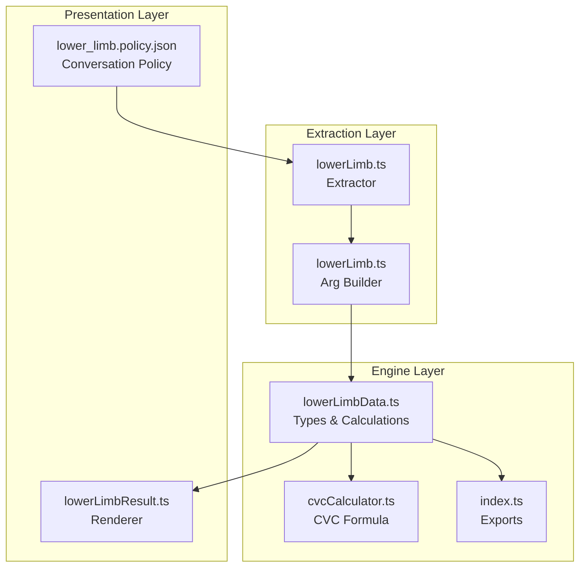
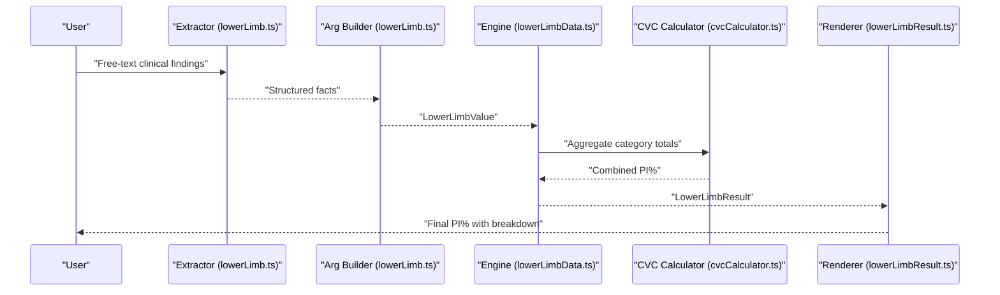
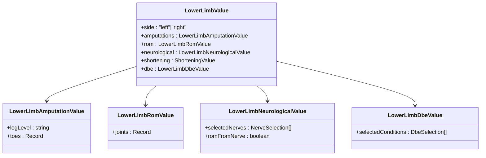
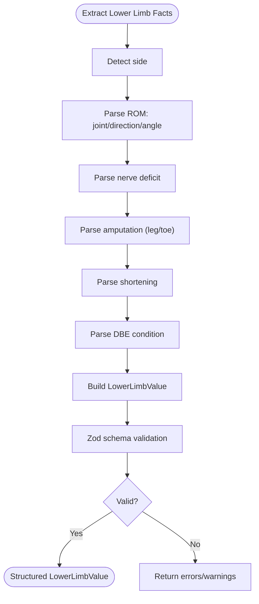
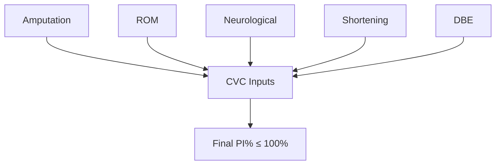
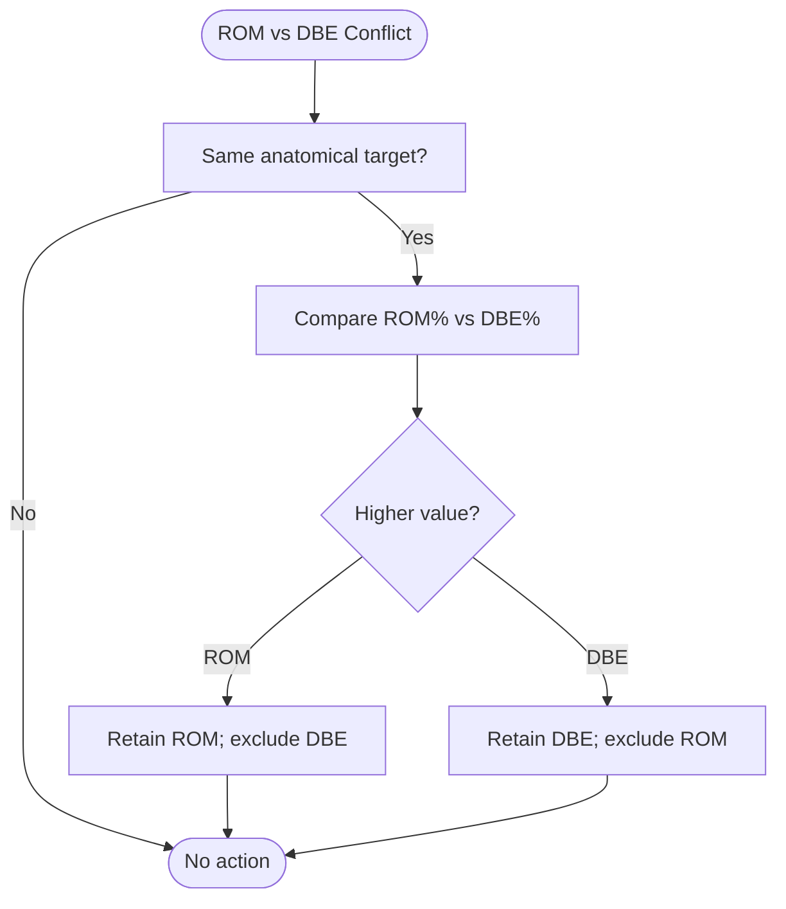
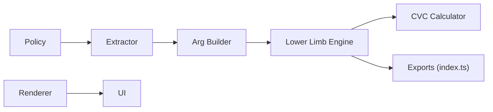

# Lower Limb Assessment (Chapter 4)

<cite>
**Referenced Files in This Document**
- [lowerLimbData.ts](file://src/engine/lowerLimbData.ts)
- [lowerLimb.ts](file://src/v2/argBuilders/lowerLimb.ts)
- [lowerLimb.ts](file://src/v2/extractors/lowerLimb.ts)
- [lowerLimb.ts](file://src/v2/readiness/lowerLimb.ts)
- [lowerLimbResult.ts](file://src/v2/renderers/lowerLimbResult.ts)
- [index.ts](file://src/engine/index.ts)
- [cvcCalculator.ts](file://src/engine/cvcCalculator.ts)
- [lower_limb.policy.json](file://gatiod_conversation_policy_data/policy/systems/lower_limb.policy.json)
- [lowerLimb.shadow.test.ts](file://tests/v2/excelScenarios/lowerLimb.shadow.test.ts)
</cite>

## Table of Contents
1. [Introduction](#introduction)
2. [Project Structure](#project-structure)
3. [Core Components](#core-components)
4. [Architecture Overview](#architecture-overview)
5. [Detailed Component Analysis](#detailed-component-analysis)
6. [Dependency Analysis](#dependency-analysis)
7. [Performance Considerations](#performance-considerations)
8. [Troubleshooting Guide](#troubleshooting-guide)
9. [Conclusion](#conclusion)

## Introduction
This document provides comprehensive technical documentation for the Lower Limb assessment system implementing Chapter 4 GATIOD calculations. It explains how clinical findings are captured, validated, and transformed into structured data, then processed through standardized calculation algorithms to produce permanent incapacity (PI%) estimates. The system supports multiple assessment streams: amputation, range of motion (ROM), neurological deficits, limb shortening, and diagnosis-based estimates (DBE). It enforces conflict resolution rules, applies anatomical suppression logic for amputations, and aggregates results via the Combined Values Chart (CVC) formula to compute the final PI%.

## Project Structure
The Lower Limb system spans three primary layers:
- Data and calculation engine: core types, lookup tables, and calculation functions
- Extraction and argument building: natural language processing and structured fact assembly
- Rendering and policy: user-facing presentation and conversational guidance

**Diagram sources**
- [lowerLimb.ts:280-766](file://src/v2/extractors/lowerLimb.ts#L280-L766)
- [lowerLimb.ts:23-143](file://src/v2/argBuilders/lowerLimb.ts#L23-L143)
- [lowerLimbData.ts:892-1287](file://src/engine/lowerLimbData.ts#L892-L1287)
- [cvcCalculator.ts:1-108](file://src/engine/cvcCalculator.ts#L1-L108)
- [index.ts:43-57](file://src/engine/index.ts#L43-L57)
- [lowerLimbResult.ts:25-124](file://src/v2/renderers/lowerLimbResult.ts#L25-L124)
- [lower_limb.policy.json:1-191](file://gatiod_conversation_policy_data/policy/systems/lower_limb.policy.json#L1-L191)

**Section sources**
- [lowerLimb.ts:280-766](file://src/v2/extractors/lowerLimb.ts#L280-L766)
- [lowerLimb.ts:23-143](file://src/v2/argBuilders/lowerLimb.ts#L23-L143)
- [lowerLimbData.ts:892-1287](file://src/engine/lowerLimbData.ts#L892-L1287)
- [cvcCalculator.ts:1-108](file://src/engine/cvcCalculator.ts#L1-L108)
- [index.ts:43-57](file://src/engine/index.ts#L43-L57)
- [lowerLimbResult.ts:25-124](file://src/v2/renderers/lowerLimbResult.ts#L25-L124)
- [lower_limb.policy.json:1-191](file://gatiod_conversation_policy_data/policy/systems/lower_limb.policy.json#L1-L191)

## Core Components
- LowerLimbValue: Structured representation of clinical findings across all streams
- Calculation functions: Amputation, ROM, neurological, shortening, DBE, and conflict resolution
- Lookup tables: ROM, shortening, DBE conditions, and nerve capacities
- CVC calculator: Aggregation formula preventing over-addition beyond 100%
- Extractor and Arg Builder: Natural language processing and structured state assembly
- Renderer: Human-readable breakdown and final PI% presentation

Key calculation outputs:
- CategoryResult: per-stream PI% with notes and optional GATIOD reference
- LowerLimbResult: final PI% plus conflict details and CVC inputs

**Section sources**
- [lowerLimbData.ts:155-201](file://src/engine/lowerLimbData.ts#L155-L201)
- [lowerLimbData.ts:892-1287](file://src/engine/lowerLimbData.ts#L892-L1287)
- [cvcCalculator.ts:1-108](file://src/engine/cvcCalculator.ts#L1-L108)
- [lowerLimb.ts:280-766](file://src/v2/extractors/lowerLimb.ts#L280-L766)
- [lowerLimb.ts:23-143](file://src/v2/argBuilders/lowerLimb.ts#L23-L143)
- [lowerLimbResult.ts:25-124](file://src/v2/renderers/lowerLimbResult.ts#L25-L124)

## Architecture Overview
The system follows a pipeline: extraction → validation → calculation → rendering. The extractor parses free-text into structured facts; the arg builder composes a typed LowerLimbValue; the engine computes category totals and resolves conflicts; the renderer presents results and supports interactive confirmation.

**Diagram sources**
- [lowerLimb.ts:280-766](file://src/v2/extractors/lowerLimb.ts#L280-L766)
- [lowerLimb.ts:23-143](file://src/v2/argBuilders/lowerLimb.ts#L23-L143)
- [lowerLimbData.ts:1206-1272](file://src/engine/lowerLimbData.ts#L1206-L1272)
- [cvcCalculator.ts:58-89](file://src/engine/cvcCalculator.ts#L58-L89)
- [lowerLimbResult.ts:25-124](file://src/v2/renderers/lowerLimbResult.ts#L25-L124)

## Detailed Component Analysis

### Data Model and Types
The LowerLimbValue encapsulates:
- side: left or right
- amputations: leg level and toe levels
- rom: per-joint measurements and ankylosis flags
- neurological: nerve selections with deficit and loss types
- shortening: discrepancy in cm
- dbe: diagnosis-based estimates with selected percent and anatomical key

Validation ensures mutually exclusive findings (e.g., leg amputation overrides toe findings) and maintains data integrity.

**Diagram sources**
- [lowerLimbData.ts:155-162](file://src/engine/lowerLimbData.ts#L155-L162)
- [lowerLimbData.ts:52-55](file://src/engine/lowerLimbData.ts#L52-L55)
- [lowerLimbData.ts:83-85](file://src/engine/lowerLimbData.ts#L83-L85)
- [lowerLimbData.ts:104-107](file://src/engine/lowerLimbData.ts#L104-L107)
- [lowerLimbData.ts:149-151](file://src/engine/lowerLimbData.ts#L149-L151)

**Section sources**
- [lowerLimbData.ts:8-55](file://src/engine/lowerLimbData.ts#L8-L55)
- [lowerLimbData.ts:155-162](file://src/engine/lowerLimbData.ts#L155-L162)
- [lowerLimbData.ts:187-234](file://src/engine/lowerLimbData.ts#L187-L234)

### Extraction and Argument Building
The extractor recognizes:
- Joint, direction, and angle for ROM (including ankylosis)
- Nerve deficits with type and severity
- Amputation patterns (leg and toe levels)
- Limb shortening measurements
- DBE conditions via ontology matches

The arg builder validates and constructs LowerLimbValue, zero-filling missing fields and surfacing warnings.

**Diagram sources**
- [lowerLimb.ts:280-766](file://src/v2/extractors/lowerLimb.ts#L280-L766)
- [lowerLimb.ts:23-143](file://src/v2/argBuilders/lowerLimb.ts#L23-L143)

**Section sources**
- [lowerLimb.ts:280-766](file://src/v2/extractors/lowerLimb.ts#L280-L766)
- [lowerLimb.ts:23-143](file://src/v2/argBuilders/lowerLimb.ts#L23-L143)

### Calculation Algorithms
The engine computes each stream independently, then resolves conflicts and aggregates via CVC.

- Amputation: Sum leg and toe levels, capped at foot and total limits
- ROM: Interpolate per-direction tables; sum across directions; combine across joints
- Neurological: Max per nerve by deficit type and loss severity; combine via CVC
- Shortening: Lookup cm-to-PI% with ceiling at 30%
- DBE: Clamp selected percent to canonical range; combine per anatomical target
- Conflicts: 
  - Proximal amputation suppresses distal ROM/DBE
  - ROM attributed to nerve lesion is excluded
  - For overlapping ROM/DBE at the same anatomical target, retain the higher value
- Final PI%: CVC-combine all non-zero streams, capped at 100%

**Diagram sources**
- [lowerLimbData.ts:930-960](file://src/engine/lowerLimbData.ts#L930-L960)
- [lowerLimbData.ts:995-1020](file://src/engine/lowerLimbData.ts#L995-L1020)
- [lowerLimbData.ts:1022-1057](file://src/engine/lowerLimbData.ts#L1022-L1057)
- [lowerLimbData.ts:1059-1066](file://src/engine/lowerLimbData.ts#L1059-L1066)
- [lowerLimbData.ts:1068-1107](file://src/engine/lowerLimbData.ts#L1068-L1107)
- [lowerLimbData.ts:1206-1272](file://src/engine/lowerLimbData.ts#L1206-L1272)
- [cvcCalculator.ts:58-89](file://src/engine/cvcCalculator.ts#L58-L89)

**Section sources**
- [lowerLimbData.ts:892-1287](file://src/engine/lowerLimbData.ts#L892-L1287)
- [cvcCalculator.ts:1-108](file://src/engine/cvcCalculator.ts#L1-L108)

### Conflict Resolution and Suppression Rules
- Amputation suppression: Proximal amputation suppresses distal anatomical targets and ROM/DBE
- Nerve vs ROM: When ROM is attributed to nerve lesion, ROM is excluded from aggregation
- DBE vs ROM: At overlapping anatomical targets, the higher of ROM/DBE is retained

**Diagram sources**
- [lowerLimbData.ts:1182-1204](file://src/engine/lowerLimbData.ts#L1182-L1204)
- [lowerLimbData.ts:1218-1246](file://src/engine/lowerLimbData.ts#L1218-L1246)

**Section sources**
- [lowerLimbData.ts:871-890](file://src/engine/lowerLimbData.ts#L871-L890)
- [lowerLimbData.ts:1218-1246](file://src/engine/lowerLimbData.ts#L1218-L1246)

### Conversation Policy and User Guidance
The policy defines:
- Required and optional slots
- Clarification questions for ambiguous findings
- Rules governing ROM/nerve gates, DBE/ROM conflicts, and amputation suppression
- Confirmation sections and post-result actions

**Section sources**
- [lower_limb.policy.json:1-191](file://gatiod_conversation_policy_data/policy/systems/lower_limb.policy.json#L1-L191)

### Rendering and Presentation
The renderer:
- Builds a concise summary and optional expanded breakdown
- Highlights conflict resolutions and CVC inputs
- Presents category contributions and final PI%

**Section sources**
- [lowerLimbResult.ts:25-124](file://src/v2/renderers/lowerLimbResult.ts#L25-L124)

## Dependency Analysis
The Lower Limb module exports calculation functions and constants for use across the system. The engine relies on shared CVC utilities for aggregation.

**Diagram sources**
- [index.ts:43-57](file://src/engine/index.ts#L43-L57)
- [lowerLimb.ts:280-766](file://src/v2/extractors/lowerLimb.ts#L280-L766)
- [lowerLimb.ts:23-143](file://src/v2/argBuilders/lowerLimb.ts#L23-L143)
- [lowerLimbData.ts:1206-1272](file://src/engine/lowerLimbData.ts#L1206-L1272)
- [cvcCalculator.ts:1-108](file://src/engine/cvcCalculator.ts#L1-L108)

**Section sources**
- [index.ts:43-57](file://src/engine/index.ts#L43-L57)

## Performance Considerations
- ROM interpolation: Linear interpolation over small lookup tables is O(n) per direction; minimal impact given few directions per joint
- CVC aggregation: Iterative combination is O(k) for k categories; negligible overhead
- Conflict resolution: Single-pass mapping and comparison across anatomical targets
- Recommendations:
  - Prefer canonical DBE entries to avoid legacy sanitization overhead
  - Minimize redundant joint entries to reduce ROM evaluation cycles
  - Use the ROM-from-nerve gate to exclude redundant ROM when appropriate

[No sources needed since this section provides general guidance]

## Troubleshooting Guide
Common issues and resolutions:
- Missing side: The readiness checker requires side specification before proceeding
- No assessable finding detected: The system prompts for the type of finding to capture
- ROM-from-nerve gate: When both ROM and nerve deficits are present, the system asks whether ROM is due to nerve lesion
- DBE/ROM conflict: When both DBE and ROM apply to the same anatomical target, the higher value is retained; conflicts are reported in the breakdown
- Amputation suppression: Proximal amputation suppresses distal ROM/DBE; notes indicate suppression
- Validation errors: The arg builder reports schema validation failures with specific field paths

**Section sources**
- [lowerLimb.ts:15-86](file://src/v2/readiness/lowerLimb.ts#L15-L86)
- [lowerLimb.ts:126-130](file://src/v2/argBuilders/lowerLimb.ts#L126-L130)
- [lowerLimbData.ts:1218-1246](file://src/engine/lowerLimbData.ts#L1218-L1246)

## Conclusion
The Lower Limb assessment system provides a robust, rule-driven pipeline for transforming clinical narratives into standardized PI% calculations. Its modular design separates extraction, validation, computation, and presentation, enabling maintainability and extensibility. By enforcing anatomical suppression, conflict resolution, and CVC aggregation, it aligns with GATIOD Chapter 4 guidelines to produce reliable, interpretable results.