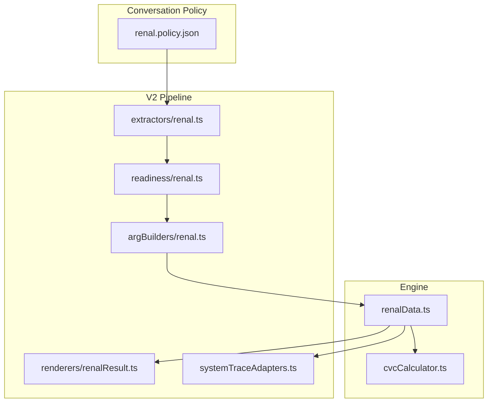
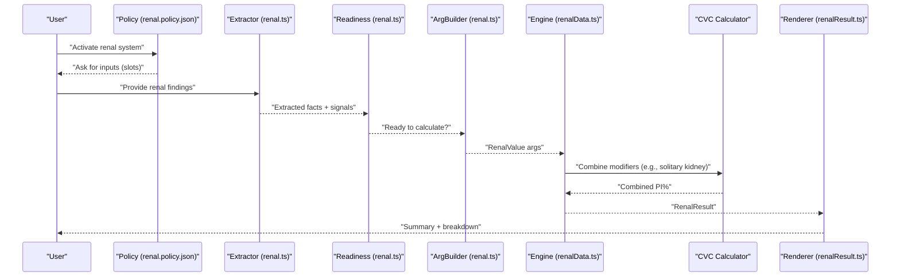
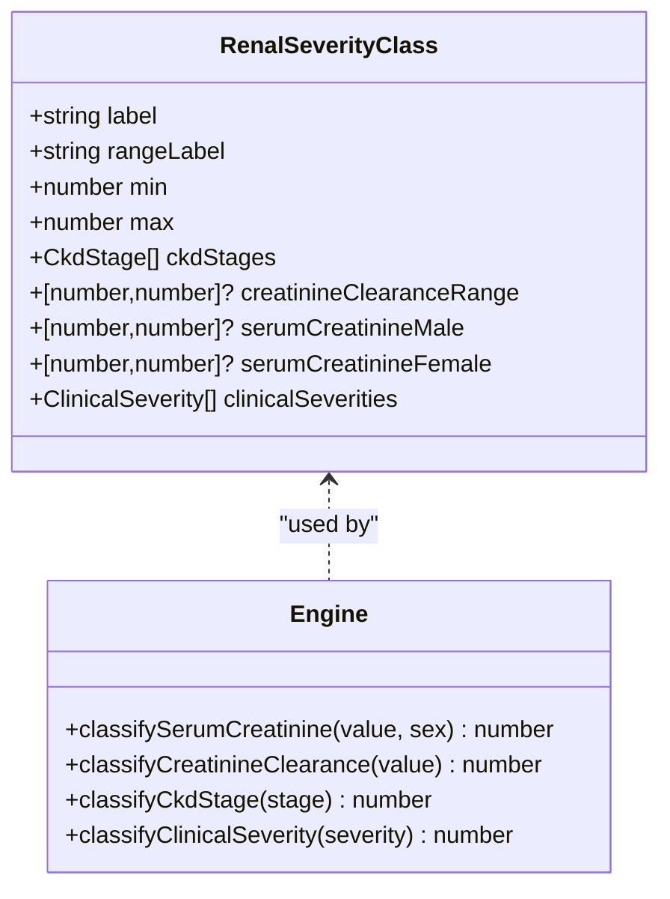
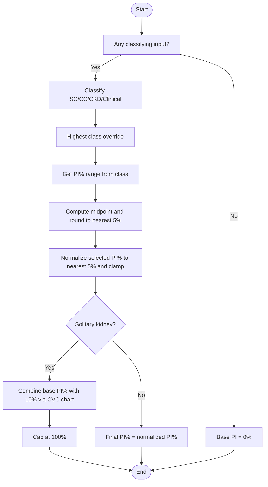
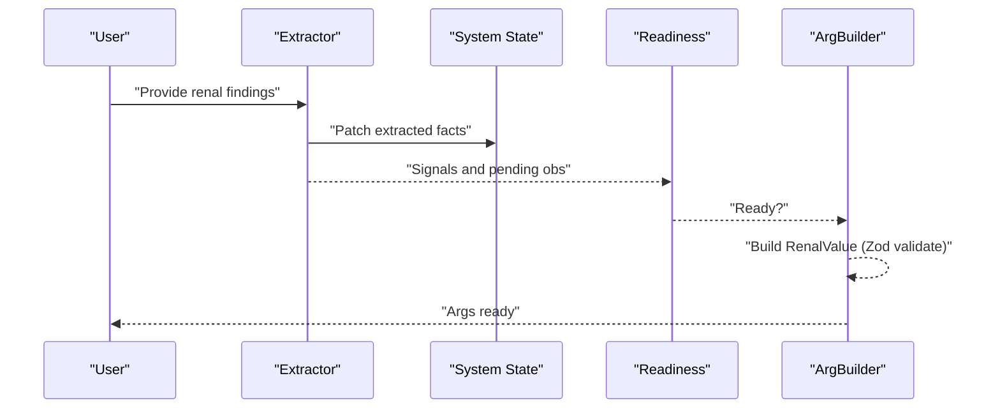
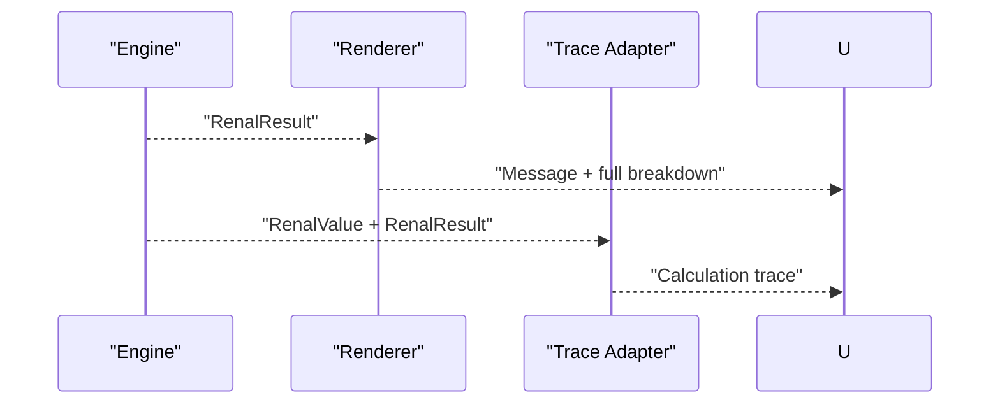
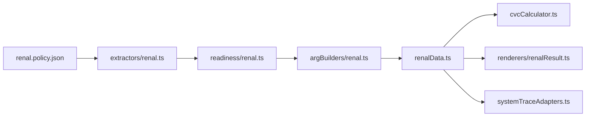

# Renal Assessment (Chapter 7)

<cite>
**Referenced Files in This Document**
- [renalData.ts](file://src/engine/renalData.ts)
- [cvcCalculator.ts](file://src/engine/cvcCalculator.ts)
- [renal.policy.json](file://gatiod_conversation_policy_data/policy/systems/renal.policy.json)
- [renal.ts (extractors)](file://src/v2/extractors/renal.ts)
- [renal.ts (argBuilders)](file://src/v2/argBuilders/renal.ts)
- [renal.ts (readiness)](file://src/v2/readiness/renal.ts)
- [renalResult.ts](file://src/v2/renderers/renalResult.ts)
- [systemTraceAdapters.ts](file://src/v2/systemTraceAdapters.ts)
- [renal.shadow.test.ts](file://tests/v2/excelScenarios/renal.shadow.test.ts)
- [renal.calibration.generated.json](file://tests/v2/excelScenarios/renal.calibration.generated.json)
</cite>

## Table of Contents
1. [Introduction](#introduction)
2. [Project Structure](#project-structure)
3. [Core Components](#core-components)
4. [Architecture Overview](#architecture-overview)
5. [Detailed Component Analysis](#detailed-component-analysis)
6. [Dependency Analysis](#dependency-analysis)
7. [Performance Considerations](#performance-considerations)
8. [Troubleshooting Guide](#troubleshooting-guide)
9. [Conclusion](#conclusion)
10. [Appendices](#appendices)

## Introduction
This document explains the Renal assessment system for Chapter 7 GATIOD calculations. It covers how kidney function tests (serum creatinine and creatinine clearance), CKD stages, and clinical severity inform classification into four severity classes (0–10%, 11–30%, 31–60%, 61–100%). It documents the calculation algorithms for determining the recommended PI% within the chosen class, selection normalization (nearest 5%), the highest-class-override rule, and the Combined Values Chart (CVC) combination for modifiers such as solitary kidney. It also describes configuration options, parameters, return values, and how renal assessments integrate into overall PI% calculations. Practical examples are provided via concrete code paths and test coverage.

## Project Structure
The renal system spans three layers:
- Engine: Core logic for classification and PI% computation.
- Conversation policy: System-level rules, activation terms, and slots.
- V2 pipeline: Extraction, readiness checks, argument building, rendering, and tracing.

**Diagram sources**
- [renal.policy.json:1-138](file://gatiod_conversation_policy_data/policy/systems/renal.policy.json#L1-L138)
- [renal.ts (extractors):1-187](file://src/v2/extractors/renal.ts#L1-L187)
- [renal.ts (readiness):1-43](file://src/v2/readiness/renal.ts#L1-L43)
- [renal.ts (argBuilders):1-67](file://src/v2/argBuilders/renal.ts#L1-L67)
- [renalResult.ts:1-118](file://src/v2/renderers/renalResult.ts#L1-L118)
- [systemTraceAdapters.ts:283-307](file://src/v2/systemTraceAdapters.ts#L283-L307)
- [renalData.ts:1-343](file://src/engine/renalData.ts#L1-L343)
- [cvcCalculator.ts:1-108](file://src/engine/cvcCalculator.ts#L1-L108)

**Section sources**
- [renal.policy.json:1-138](file://gatiod_conversation_policy_data/policy/systems/renal.policy.json#L1-L138)
- [renal.ts (extractors):1-187](file://src/v2/extractors/renal.ts#L1-L187)
- [renal.ts (readiness):1-43](file://src/v2/readiness/renal.ts#L1-L43)
- [renal.ts (argBuilders):1-67](file://src/v2/argBuilders/renal.ts#L1-L67)
- [renalResult.ts:1-118](file://src/v2/renderers/renalResult.ts#L1-L118)
- [systemTraceAdapters.ts:283-307](file://src/v2/systemTraceAdapters.ts#L283-L307)
- [renalData.ts:1-343](file://src/engine/renalData.ts#L1-L343)
- [cvcCalculator.ts:1-108](file://src/engine/cvcCalculator.ts#L1-L108)

## Core Components
- Classification schema and severity classes define PI% ranges and class membership for:
  - Sex-specific serum creatinine thresholds
  - Creatinine clearance ranges
  - CKD stages
  - Clinical severity categories
- Calculation pipeline:
  - Classify each input independently
  - Apply highest-class-override rule
  - Compute recommended PI% (midpoint rounded to nearest 5% within class)
  - Normalize selected PI% to nearest 5% and clamp to [0, 100]
  - Apply modifiers (e.g., solitary kidney via CVC)
- Rendering and tracing:
  - Render human-readable summaries and full breakdowns
  - Provide calculation trace notes for transparency

Key return fields include severity label, class index, PI% range, recommended PI%, selected PI, final PI, and flags for solitary kidney, provisional award, hard cap, and per-input class indices.

**Section sources**
- [renalData.ts:54-171](file://src/engine/renalData.ts#L54-L171)
- [renalData.ts:281-342](file://src/engine/renalData.ts#L281-L342)
- [renalResult.ts:24-117](file://src/v2/renderers/renalResult.ts#L24-L117)

## Architecture Overview
The renal system follows a strict pipeline: policy-driven extraction, readiness gating, structured argument construction, engine calculation, and presentation.

**Diagram sources**
- [renal.policy.json:18-106](file://gatiod_conversation_policy_data/policy/systems/renal.policy.json#L18-L106)
- [renal.ts (extractors):64-186](file://src/v2/extractors/renal.ts#L64-L186)
- [renal.ts (readiness):10-42](file://src/v2/readiness/renal.ts#L10-L42)
- [renal.ts (argBuilders):14-66](file://src/v2/argBuilders/renal.ts#L14-L66)
- [renalData.ts:281-342](file://src/engine/renalData.ts#L281-L342)
- [cvcCalculator.ts:34-51](file://src/engine/cvcCalculator.ts#L34-L51)
- [renalResult.ts:24-117](file://src/v2/renderers/renalResult.ts#L24-L117)

## Detailed Component Analysis

### Classification and Severity Classes
- Four severity classes define:
  - Label and percent ranges
  - CKD stages included
  - Creatinine clearance ranges
  - Sex-specific serum creatinine ranges
  - Clinical severity categories
- Classifiers:
  - classifySerumCreatinine
  - classifyCreatinineClearance
  - classifyCkdStage
  - classifyClinicalSeverity

**Diagram sources**
- [renalData.ts:56-113](file://src/engine/renalData.ts#L56-L113)
- [renalData.ts:175-214](file://src/engine/renalData.ts#L175-L214)

**Section sources**
- [renalData.ts:56-113](file://src/engine/renalData.ts#L56-L113)
- [renalData.ts:175-214](file://src/engine/renalData.ts#L175-L214)

### Calculation Algorithm
- Inputs: sex, serum creatinine, creatinine clearance, CKD stage, clinical severity, solitary kidney, provisional award, optional selected PI%
- Steps:
  1. Classify each input (or default to class 0)
  2. Determine highest class among inputs (highest-class-override)
  3. Derive PI% range from the severity class
  4. Compute recommended PI% as midpoint rounded to nearest 5%
  5. Normalize selected PI% to nearest 5% and clamp to [0, 100]
  6. If solitary kidney, combine base PI% with 10% using CVC chart
  7. Cap final PI% at 100
- Outputs include severity label, class index, PI% range, recommended PI%, selected PI%, final PI%, and per-input class indices.

**Diagram sources**
- [renalData.ts:281-342](file://src/engine/renalData.ts#L281-L342)
- [cvcCalculator.ts:44-51](file://src/engine/cvcCalculator.ts#L44-L51)

**Section sources**
- [renalData.ts:281-342](file://src/engine/renalData.ts#L281-L342)
- [cvcCalculator.ts:34-51](file://src/engine/cvcCalculator.ts#L34-L51)

### Extraction, Readiness, and Argument Building
- Extraction patterns recognize:
  - Sex (male/female)
  - Serum creatinine (with units)
  - Creatinine clearance (including abbreviations)
  - CKD stage
  - Clinical severity keywords
  - Solitary kidney mentions and nephrectomy
  - Provisional vs final award
  - eGFR disambiguation (pending observation)
- Readiness validation ensures:
  - No pending observations
  - Sex is present
  - At least one classifying input exists
- Argument builder constructs RenalValue with defaults and validates via Zod schema.

**Diagram sources**
- [renal.ts (extractors):64-186](file://src/v2/extractors/renal.ts#L64-L186)
- [renal.ts (readiness):10-42](file://src/v2/readiness/renal.ts#L10-L42)
- [renal.ts (argBuilders):14-66](file://src/v2/argBuilders/renal.ts#L14-L66)

**Section sources**
- [renal.ts (extractors):24-186](file://src/v2/extractors/renal.ts#L24-L186)
- [renal.ts (readiness):10-42](file://src/v2/readiness/renal.ts#L10-L42)
- [renal.ts (argBuilders):14-66](file://src/v2/argBuilders/renal.ts#L14-L66)

### Rendering and Tracing
- Renderer composes:
  - Summary with system-generated PI%
  - Input lines with class indices
  - Highest class and recommended PI%
  - Optional expanded notes for solitary kidney and adjustments
- Trace adapter builds calculation notes for transparency.

**Diagram sources**
- [renalResult.ts:24-117](file://src/v2/renderers/renalResult.ts#L24-L117)
- [systemTraceAdapters.ts:283-307](file://src/v2/systemTraceAdapters.ts#L283-L307)

**Section sources**
- [renalResult.ts:24-117](file://src/v2/renderers/renalResult.ts#L24-L117)
- [systemTraceAdapters.ts:283-307](file://src/v2/systemTraceAdapters.ts#L283-L307)

### Configuration Options and Parameters
- Policy-level:
  - Activation terms for renal topics
  - Slots for sex, inputs, clinical severity, solitary kidney, provisional award, selected PI% within class, confirmation
  - Conversation rules for highest-class override, solitary kidney modifier, and provisional awards
- Engine-level:
  - Sex-specific thresholds for serum creatinine
  - CKD stage inclusion per class
  - Creatinine clearance ranges per class
  - Clinical severity categories per class
  - Default provisional award behavior
  - Solitary kidney modifier (10%)

**Section sources**
- [renal.policy.json:18-121](file://gatiod_conversation_policy_data/policy/systems/renal.policy.json#L18-L121)
- [renalData.ts:21-141](file://src/engine/renalData.ts#L21-L141)

### Return Values and Outcome Interpretation
- RenalResult fields:
  - Severity class index and label
  - PI% range min/max
  - Recommended PI%
  - Selected PI (normalized)
  - Final PI (after modifiers and caps)
  - Flags: hasClassifyingInput, isSolitaryKidneyBase, isProvisional, hardCapApplied
  - Per-input class indices (serum creatinine, creatinine clearance, CKD, clinical)
  - Selection adjustment details (if any)
- Rendering:
  - Summary and expanded breakdown
  - Full breakdown includes category results, CVC trace, and applied rules

**Section sources**
- [renalData.ts:145-171](file://src/engine/renalData.ts#L145-L171)
- [renalResult.ts:85-117](file://src/v2/renderers/renalResult.ts#L85-L117)

### Integration with Other Systems and Overall PI%
- CVC combination:
  - Solitary kidney modifier is combined with other relevant incapacity using the Combined Values Chart (CVC) formula to prevent exceeding 100%.
- Multi-system orchestration:
  - The engine exposes a CVC calculator that can be reused across systems for consistent combination behavior.
- Traceability:
  - Calculation notes capture modifier application and caps for auditability.

**Section sources**
- [cvcCalculator.ts:34-51](file://src/engine/cvcCalculator.ts#L34-L51)
- [systemTraceAdapters.ts:283-307](file://src/v2/systemTraceAdapters.ts#L283-L307)

### Common Clinical Scenarios
- Acute kidney injury:
  - Classify by serum creatinine or creatinine clearance; apply highest-class-override; adjust PI% accordingly.
- Chronic kidney disease:
  - Use CKD stage classification; if multiple inputs present, highest class prevails.
- Nephrectomy:
  - Extract solitary kidney presence; combine base PI% with 10% via CVC.
- Renal transplant recipients:
  - If clinical severity indicates dysfunction despite treatment, classify as persisting; combine with base PI% if applicable.

These scenarios are supported by extraction patterns and classification logic.

**Section sources**
- [renal.ts (extractors):133-153](file://src/v2/extractors/renal.ts#L133-L153)
- [renalData.ts:175-214](file://src/engine/renalData.ts#L175-L214)

## Dependency Analysis
- Engine depends on:
  - Severity class definitions and classifiers
  - CVC calculator for modifier combination
- V2 pipeline depends on:
  - Policy for activation and slots
  - Extractor for structured facts
  - Readiness for gating
  - ArgBuilder for validated arguments
  - Renderer and trace adapter for output

**Diagram sources**
- [renal.policy.json:1-138](file://gatiod_conversation_policy_data/policy/systems/renal.policy.json#L1-L138)
- [renal.ts (extractors):1-187](file://src/v2/extractors/renal.ts#L1-L187)
- [renal.ts (readiness):1-43](file://src/v2/readiness/renal.ts#L1-L43)
- [renal.ts (argBuilders):1-67](file://src/v2/argBuilders/renal.ts#L1-L67)
- [renalData.ts:1-343](file://src/engine/renalData.ts#L1-L343)
- [cvcCalculator.ts:1-108](file://src/engine/cvcCalculator.ts#L1-L108)
- [renalResult.ts:1-118](file://src/v2/renderers/renalResult.ts#L1-L118)
- [systemTraceAdapters.ts:283-307](file://src/v2/systemTraceAdapters.ts#L283-L307)

**Section sources**
- [renal.policy.json:1-138](file://gatiod_conversation_policy_data/policy/systems/renal.policy.json#L1-L138)
- [renal.ts (extractors):1-187](file://src/v2/extractors/renal.ts#L1-L187)
- [renal.ts (readiness):1-43](file://src/v2/readiness/renal.ts#L1-L43)
- [renal.ts (argBuilders):1-67](file://src/v2/argBuilders/renal.ts#L1-L67)
- [renalData.ts:1-343](file://src/engine/renalData.ts#L1-L343)
- [cvcCalculator.ts:1-108](file://src/engine/cvcCalculator.ts#L1-L108)
- [renalResult.ts:1-118](file://src/v2/renderers/renalResult.ts#L1-L117)
- [systemTraceAdapters.ts:283-307](file://src/v2/systemTraceAdapters.ts#L283-L307)

## Performance Considerations
- Extraction uses efficient regular expressions with bounded lookahead to avoid false positives (e.g., excluding “creatinine” when “clearance” precedes).
- Classification loops iterate over a small, fixed set of severity classes (four), ensuring O(1) per classifier.
- CVC operations are constant-time and operate on small arrays of values.
- Rendering and tracing are lightweight post-processing steps.

[No sources needed since this section provides general guidance]

## Troubleshooting Guide
- eGFR vs creatinine clearance:
  - If eGFR is mentioned, a pending observation is created to disambiguate between CKD-EPI/MDRD (not accepted) and Cockcroft-Gault (accepted as clearance).
- Missing sex:
  - Readiness blocks until sex is provided; extraction patterns support “male”, “female”, “man”, “woman”, etc.
- No classifying input:
  - Readiness blocks until at least one of serum creatinine, creatinine clearance, CKD stage, or clinical severity is present.
- Solitary kidney extraction:
  - Recognizes “solitary kidney”, “nephrectomy”, “unilateral kidney”, etc.
- Provisional award:
  - Extractor recognizes “provisional award”, “final award”, etc.; readiness validates presence of a decision.
- Selected PI% normalization:
  - If user-selected PI% is outside [0, 100] or not aligned to 5% increments, it is normalized and a reason is recorded.

**Section sources**
- [renal.ts (extractors):155-176](file://src/v2/extractors/renal.ts#L155-L176)
- [renal.ts (readiness):17-39](file://src/v2/readiness/renal.ts#L17-L39)
- [renal.ts (argBuilders):14-66](file://src/v2/argBuilders/renal.ts#L14-L66)
- [renalData.ts:242-277](file://src/engine/renalData.ts#L242-L277)

## Conclusion
The renal system implements a robust, policy-driven pipeline that transforms unstructured clinical findings into standardized, transparent PI% calculations. It leverages highest-class-override classification, sex-specific thresholds, CKD staging, and clinical severity to determine appropriate PI% ranges, then applies modifiers (notably solitary kidney via CVC) to produce a final, capped result. The design emphasizes clarity through rendering and tracing, while extraction and readiness ensure high-quality inputs.

[No sources needed since this section summarizes without analyzing specific files]

## Appendices

### Example Scenarios and Code Paths
- Extraction examples:
  - [Serum creatinine extraction:88-99](file://src/v2/extractors/renal.ts#L88-L99)
  - [Creatinine clearance extraction:101-108](file://src/v2/extractors/renal.ts#L101-L108)
  - [CKD stage extraction:110-117](file://src/v2/extractors/renal.ts#L110-L117)
  - [Clinical severity extraction:119-131](file://src/v2/extractors/renal.ts#L119-L131)
  - [Solitary kidney extraction:133-142](file://src/v2/extractors/renal.ts#L133-L142)
  - [Provisional award extraction:144-153](file://src/v2/extractors/renal.ts#L144-L153)
- Readiness and argument building:
  - [Readiness validation:10-42](file://src/v2/readiness/renal.ts#L10-42)
  - [Argument construction:14-66](file://src/v2/argBuilders/renal.ts#L14-66)
- Engine calculation:
  - [Classification and PI% computation:281-342](file://src/engine/renalData.ts#L281-342)
  - [CVC combination:34-51](file://src/engine/cvcCalculator.ts#L34-51)
- Rendering and tracing:
  - [Result rendering:24-117](file://src/v2/renderers/renalResult.ts#L24-117)
  - [Calculation trace:283-307](file://src/v2/systemTraceAdapters.ts#L283-307)
- Calibration and shadow testing:
  - [Shadow test runner:10-25](file://tests/v2/excelScenarios/renal.shadow.test.ts#L10-L25)
  - [Calibration report:1-70](file://tests/v2/excelScenarios/renal.calibration.generated.json#L1-L70)