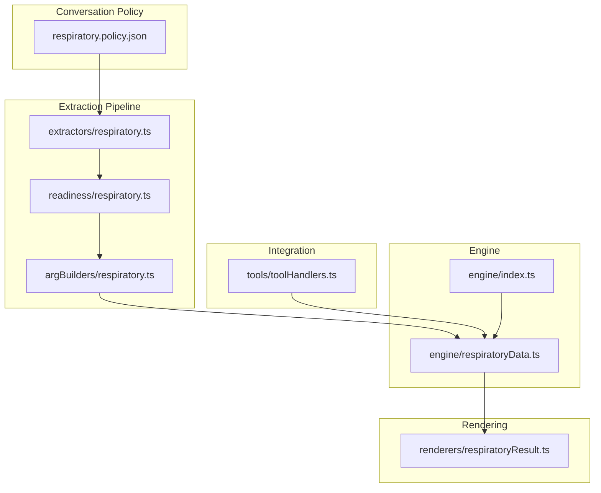
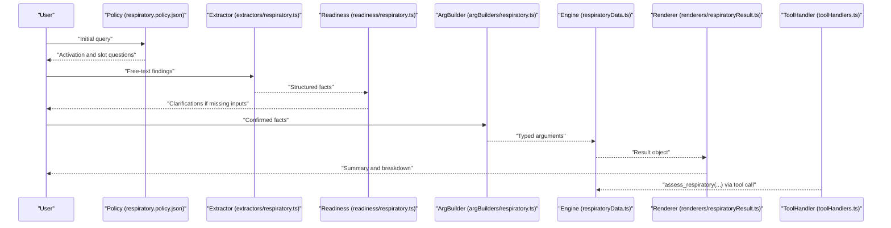
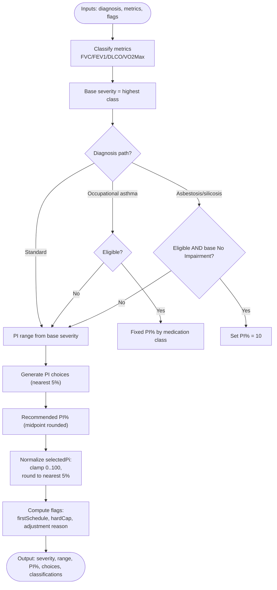
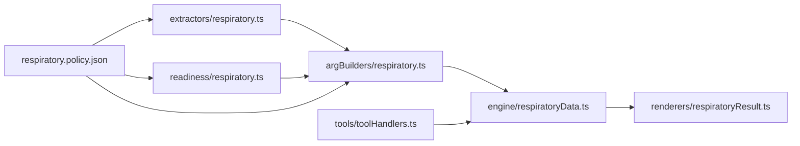

# Respiratory Assessment (Chapter 6)

<cite>
**Referenced Files in This Document**
- [respiratoryData.ts](file://src/engine/respiratoryData.ts)
- [index.ts](file://src/engine/index.ts)
- [respiratory.policy.json](file://gatiod_conversation_policy_data/policy/systems/respiratory.policy.json)
- [respiratory.ts (argBuilder)](file://src/v2/argBuilders/respiratory.ts)
- [respiratory.ts (extractor)](file://src/v2/extractors/respiratory.ts)
- [respiratory.ts (readiness)](file://src/v2/readiness/respiratory.ts)
- [respiratoryResult.ts](file://src/v2/renderers/respiratoryResult.ts)
- [toolHandlers.ts](file://src/tools/toolHandlers.ts)
- [respiratory.shadow.test.ts](file://tests/v2/excelScenarios/respiratory.shadow.test.ts)
- [respiratory.calibration.generated.json](file://tests/v2/excelScenarios/respiratory.calibration.generated.json)
</cite>

## Table of Contents
1. [Introduction](#introduction)
2. [Project Structure](#project-structure)
3. [Core Components](#core-components)
4. [Architecture Overview](#architecture-overview)
5. [Detailed Component Analysis](#detailed-component-analysis)
6. [Dependency Analysis](#dependency-analysis)
7. [Performance Considerations](#performance-considerations)
8. [Troubleshooting Guide](#troubleshooting-guide)
9. [Conclusion](#conclusion)
10. [Appendices](#appendices)

## Introduction
This document explains the Respiratory assessment system for Chapter 6 GATIOD calculations. It covers how pulmonary function tests (PFTs), oxygen requirements, and exercise tolerance are processed; how permanent impairment percentages (PI%) are calculated; and how special pathways (occupational asthma and asbestosis/silicosis) modify the base classification. It also documents configuration options, parameters, return values, and how respiratory findings integrate with other body systems to produce overall PI%.

## Project Structure
The Respiratory system is implemented as a pure calculation engine module with supporting pipeline components:
- Engine: calculation logic and data types
- Conversation policy: orchestration rules and slots
- Extraction and readiness: natural language parsing and gating
- Argument building: assembling typed inputs
- Rendering: generating human-readable results and breakdowns
- Tool handler: bridging external tool calls to the engine

**Diagram sources**
- [respiratory.policy.json:1-144](file://gatiod_conversation_policy_data/policy/systems/respiratory.policy.json#L1-L144)
- [respiratory.ts (extractor):1-209](file://src/v2/extractors/respiratory.ts#L1-L209)
- [respiratory.ts (readiness):1-97](file://src/v2/readiness/respiratory.ts#L1-L97)
- [respiratory.ts (argBuilder):1-69](file://src/v2/argBuilders/respiratory.ts#L1-L69)
- [respiratoryData.ts:1-427](file://src/engine/respiratoryData.ts#L1-L427)
- [index.ts:67-68](file://src/engine/index.ts#L67-L68)
- [respiratoryResult.ts:1-138](file://src/v2/renderers/respiratoryResult.ts#L1-L138)
- [toolHandlers.ts:57-58](file://src/tools/toolHandlers.ts#L57-L58)

**Section sources**
- [respiratory.policy.json:1-144](file://gatiod_conversation_policy_data/policy/systems/respiratory.policy.json#L1-L144)
- [respiratory.ts (extractor):1-209](file://src/v2/extractors/respiratory.ts#L1-L209)
- [respiratory.ts (readiness):1-97](file://src/v2/readiness/respiratory.ts#L1-L97)
- [respiratory.ts (argBuilder):1-69](file://src/v2/argBuilders/respiratory.ts#L1-L69)
- [respiratoryData.ts:1-427](file://src/engine/respiratoryData.ts#L1-L427)
- [index.ts:67-68](file://src/engine/index.ts#L67-L68)
- [respiratoryResult.ts:1-138](file://src/v2/renderers/respiratoryResult.ts#L1-L138)
- [toolHandlers.ts:57-58](file://src/tools/toolHandlers.ts#L57-L58)

## Core Components
- Engine types and calculation:
  - Diagnosis categories: standard, occupational asthma, asbestosis/silicosis
  - Metrics: FVC, FEV1, DLCO, VO2 Max
  - Severity classes: No Impairment, Mild, Moderate, Severe
  - Special overrides: occupational asthma medication pathway; asbestosis/silicosis 10% minimum floor
  - Final PI% selection: nearest 5% within class range; doctor-selected PI normalized to valid range
- Conversation policy:
  - Assessment paths, required slots, activation terms, and rules
- Extraction and readiness:
  - Regex-driven extraction of PFTs, dyspnoea, occupational asthma prerequisites, and asbestosis qualifiers
  - Readiness checks to gate calculation
- Argument building:
  - Typed argument construction with zero-filling for missing fields
- Rendering:
  - Summary and expanded breakdown, including caps and overrides
- Tool handler:
  - Exposes assess_respiratory to external callers

**Section sources**
- [respiratoryData.ts:15-231](file://src/engine/respiratoryData.ts#L15-L231)
- [respiratory.policy.json:30-143](file://gatiod_conversation_policy_data/policy/systems/respiratory.policy.json#L30-L143)
- [respiratory.ts (extractor):1-209](file://src/v2/extractors/respiratory.ts#L1-L209)
- [respiratory.ts (readiness):16-96](file://src/v2/readiness/respiratory.ts#L16-L96)
- [respiratory.ts (argBuilder):19-68](file://src/v2/argBuilders/respiratory.ts#L19-L68)
- [respiratoryResult.ts:30-137](file://src/v2/renderers/respiratoryResult.ts#L30-L137)
- [toolHandlers.ts:57-58](file://src/tools/toolHandlers.ts#L57-L58)

## Architecture Overview
The Respiratory system follows a clean pipeline:
- Policy defines the conversation flow and required slots
- Extractor parses free-text into structured facts
- Readiness validator ensures sufficient inputs per pathway
- ArgBuilder constructs typed arguments for the engine
- Engine computes severity class, PI% range, and final PI%
- Renderer formats the result and breakdown
- Tool handler integrates with external tool invocations

**Diagram sources**
- [respiratory.policy.json:1-144](file://gatiod_conversation_policy_data/policy/systems/respiratory.policy.json#L1-L144)
- [respiratory.ts (extractor):97-208](file://src/v2/extractors/respiratory.ts#L97-L208)
- [respiratory.ts (readiness):16-96](file://src/v2/readiness/respiratory.ts#L16-L96)
- [respiratory.ts (argBuilder):19-68](file://src/v2/argBuilders/respiratory.ts#L19-L68)
- [respiratoryData.ts:335-426](file://src/engine/respiratoryData.ts#L335-L426)
- [respiratoryResult.ts:30-137](file://src/v2/renderers/respiratoryResult.ts#L30-L137)
- [toolHandlers.ts:57-58](file://src/tools/toolHandlers.ts#L57-L58)

## Detailed Component Analysis

### Engine: Respiratory Calculation
- Inputs:
  - diagnosis: standard | occupational_asthma | asbestosis_silicosis
  - fvc, fev1, dlco, vo2Max: nullable percentages or values
  - occupational asthma flags: daily maintenance, transferred from exposure ≥1 year, unlikely further improvement
  - asthma medication: bronchodilators | low_dose_steroids | high_dose_steroids | oral_steroids
  - asbestosis qualifiers: radiologically definite, profusion at least 1/1
  - selectedPi: doctor’s chosen PI within class range (nullable)
  - dyspnoea: none | on_severe_exertion | on_moderate_exertion | on_minimal_exertion
- Processing:
  - Classify each metric into severity class using strict thresholds
  - Base severity: highest class among FVC, FEV1, DLCO, VO2 Max
  - Occupational asthma override: if eligible, fixed PI% based on medication class
  - Asbestosis/silicosis floor: if eligible and base class is No Impairment, set PI% to 10
  - Select recommended PI% as midpoint rounded to nearest 5% within range
  - Normalize selectedPi to valid range and nearest 5% increment
- Outputs:
  - severityClassIndex, severityLabel
  - piRangeMin, piRangeMax
  - recommendedPi, selectedPi
  - isAsthmaOverride, isAsbestosisFloor
  - suppressionReason
  - piChoices (multiples of 5)
  - testClassifications (per metric)
  - baseSeverity*, selectionAdjustedFrom, selectionAdjustmentReason, hardCapApplied
  - firstScheduleFlag (selectedPi == 100)

**Diagram sources**
- [respiratoryData.ts:115-143](file://src/engine/respiratoryData.ts#L115-L143)
- [respiratoryData.ts:335-426](file://src/engine/respiratoryData.ts#L335-L426)

**Section sources**
- [respiratoryData.ts:15-231](file://src/engine/respiratoryData.ts#L15-L231)
- [respiratoryData.ts:115-143](file://src/engine/respiratoryData.ts#L115-L143)
- [respiratoryData.ts:335-426](file://src/engine/respiratoryData.ts#L335-L426)

### Conversation Policy and Slots
- Paths:
  - Standard: standard pulmonary function classification
  - Occupational asthma: medication pathway
  - Asbestosis/silicosis: radiological floor
- Required slots:
  - diagnosis
  - pft_values (standard pathway)
  - selected_pi_within_class (when a class range is detected)
  - asthma_prerequisites (occupational asthma pathway)
  - asthma_medication (occupational asthma prerequisites met)
  - asbestosis_profusion (asbestosis/silicosis pathway)
  - confirmation (before final calculation)
- Rules:
  - Objective PFTs weighted over subjective dyspnoea
  - Occupational asthma requires daily maintenance, ≥1 year transfer, unlikely further improvement
  - Radiologically definite asbestosis/silicosis with profusion ≥1/1 may receive 10% floor

**Section sources**
- [respiratory.policy.json:30-143](file://gatiod_conversation_policy_data/policy/systems/respiratory.policy.json#L30-L143)

### Extraction and Readiness
- Extraction patterns:
  - Diagnosis: occupational asthma, asbestosis/silicosis
  - PFTs: FVC, FEV1, DLCO, VO2 Max
  - Dyspnoea: none, minimal, moderate, severe exertion
  - Occupational asthma: daily maintenance, transferred from exposure ≥1 year, unlikely improvement
  - Asbestosis: radiologically definite, profusion ≥1/1
- Readiness checks:
  - Standard: requires at least one PFT
  - Occupational asthma: requires all three prerequisites and medication; FEV1 > 80 required for override eligibility
  - Asbestosis/silicosis: requires either PFTs or radiology + profusion ≥1/1

**Section sources**
- [respiratory.ts (extractor):32-198](file://src/v2/extractors/respiratory.ts#L32-L198)
- [respiratory.ts (readiness):16-96](file://src/v2/readiness/respiratory.ts#L16-L96)

### Argument Building and Validation
- Reads facts and zero-fills missing fields:
  - diagnosis defaults to standard
  - asthma flags default to false
  - asbestosis profusion defaults to below_1_1
  - selectedPi remains null until confirmed
- Schema validation ensures numeric ranges and enums are correct

**Section sources**
- [respiratory.ts (argBuilder):19-68](file://src/v2/argBuilders/respiratory.ts#L19-L68)

### Rendering and Breakdown
- Summary includes:
  - System-generated PI%
  - Diagnosis label
  - Test classifications
  - Severity label and PI% range
  - Recommended and final PI%
  - First schedule flag indicator
- Expanded notes include:
  - Occupational asthma override details
  - Asbestosis/silicosis floor note
  - Suppression reason
  - Selection adjustment reason and value
- Full breakdown includes:
  - Input facts
  - Category results
  - Caps and rules applied
  - Final percent

**Section sources**
- [respiratoryResult.ts:30-137](file://src/v2/renderers/respiratoryResult.ts#L30-L137)

### Tool Integration
- The assess_respiratory tool calls the engine function and returns a standardized result with systemKey and finalPercent.

**Section sources**
- [toolHandlers.ts:57-58](file://src/tools/toolHandlers.ts#L57-L58)
- [index.ts:67-68](file://src/engine/index.ts#L67-L68)

## Dependency Analysis
- Engine exports:
  - RespiratoryValue, RespiratoryResult, calculateRespiratoryAssessment
- Tool handler depends on engine exports
- Renderer depends on engine types and labels
- Extractor and readiness depend on engine type enums and labels
- Policy defines the orchestration and required slots

**Diagram sources**
- [respiratory.ts (extractor):1-209](file://src/v2/extractors/respiratory.ts#L1-L209)
- [respiratory.ts (readiness):1-97](file://src/v2/readiness/respiratory.ts#L1-L97)
- [respiratory.ts (argBuilder):1-69](file://src/v2/argBuilders/respiratory.ts#L1-L69)
- [respiratoryData.ts:1-427](file://src/engine/respiratoryData.ts#L1-L427)
- [toolHandlers.ts:57-58](file://src/tools/toolHandlers.ts#L57-L58)
- [respiratoryResult.ts:1-138](file://src/v2/renderers/respiratoryResult.ts#L1-L138)
- [respiratory.policy.json:1-144](file://gatiod_conversation_policy_data/policy/systems/respiratory.policy.json#L1-L144)

**Section sources**
- [index.ts:67-68](file://src/engine/index.ts#L67-L68)
- [toolHandlers.ts:57-58](file://src/tools/toolHandlers.ts#L57-L58)
- [respiratory.ts (argBuilder):1-69](file://src/v2/argBuilders/respiratory.ts#L1-L69)
- [respiratory.ts (extractor):1-209](file://src/v2/extractors/respiratory.ts#L1-L209)
- [respiratory.ts (readiness):1-97](file://src/v2/readiness/respiratory.ts#L1-L97)
- [respiratoryData.ts:1-427](file://src/engine/respiratoryData.ts#L1-L427)
- [respiratoryResult.ts:1-138](file://src/v2/renderers/respiratoryResult.ts#L1-L138)
- [respiratory.policy.json:1-144](file://gatiod_conversation_policy_data/policy/systems/respiratory.policy.json#L1-L144)

## Performance Considerations
- Extraction uses lightweight regex matching; keep patterns concise to avoid backtracking.
- Readiness gating prevents unnecessary computation when inputs are insufficient.
- Engine thresholds are constant-time comparisons; classification complexity is O(1) per metric.
- Rendering aggregates small arrays; avoid excessive recomputation by caching intermediate results externally if needed.
- Tool handler wraps engine results; ensure minimal overhead around serialization.

## Troubleshooting Guide
Common issues and resolutions:
- No assessable input:
  - Standard pathway requires at least one PFT; ask for FVC, FEV1, DLCO, or VO2 Max.
  - Occupational asthma pathway additionally requires all three prerequisites and medication; confirm daily maintenance, ≥1 year transfer, unlikely improvement, and specify medication.
  - Asbestosis/silicosis pathway requires either PFTs or radiology plus profusion ≥1/1.
- Missing FEV1 for asthma override:
  - The engine requires FEV1 > 80 for the occupational asthma medication override; prompt for FEV1 % predicted.
- Selected PI% normalization:
  - Values outside 0–100 are clamped; values not multiples of 5 are rounded to nearest 5%; adjustments are noted in the result.
- First schedule flag:
  - If final PI% equals 100, a first schedule indicator is included; this is not an error but a classification flag.
- Calibration and shadow runs:
  - Shadow tests validate system behavior against generated scenarios; review calibration reports for observed distributions.

**Section sources**
- [respiratory.ts (readiness):19-96](file://src/v2/readiness/respiratory.ts#L19-L96)
- [respiratory.ts (argBuilder):48-55](file://src/v2/argBuilders/respiratory.ts#L48-L55)
- [respiratoryResult.ts:79-82](file://src/v2/renderers/respiratoryResult.ts#L79-L82)
- [respiratory.shadow.test.ts:1-26](file://tests/v2/excelScenarios/respiratory.shadow.test.ts#L1-L26)
- [respiratory.calibration.generated.json:1-70](file://tests/v2/excelScenarios/respiratory.calibration.generated.json#L1-L70)

## Conclusion
The Respiratory system implements Chapter 6 GATIOD calculations with a robust pipeline: policy-defined orchestration, precise extraction, readiness gating, typed argument building, and a deterministic engine that computes severity classes, PI% ranges, and final PI%. Special overrides for occupational asthma and asbestosis/silicosis are integrated seamlessly, and the rendering layer provides clear summaries and detailed breakdowns. The system supports integration via a dedicated tool handler and maintains strong validation and normalization guarantees.

## Appendices

### Configuration Options and Parameters
- Diagnosis categories:
  - standard, occupational_asthma, asbestosis_silicosis
- Metrics:
  - fvc, fev1, dlco, vo2Max
- Occupational asthma:
  - asthmaRequiresDailyMaintenance, asthmaTransferredFromExposureOneYear, asthmaUnlikelyFurtherImprovement, asthmaMedication
- Asbestosis/silicosis:
  - asbestosisRadiologicallyDefinite, asbestosisProfusion
- Doctor-selected PI:
  - selectedPi (nullable)
- Dyspnoea:
  - none, on_severe_exertion, on_moderate_exertion, on_minimal_exertion

**Section sources**
- [respiratoryData.ts:15-231](file://src/engine/respiratoryData.ts#L15-L231)
- [respiratory.policy.json:44-113](file://gatiod_conversation_policy_data/policy/systems/respiratory.policy.json#L44-L113)

### Return Values and Calculation Notes
- Severity class index and label
- PI% range (min/max)
- Recommended PI% (nearest 5% within range)
- Final PI% (normalized and rounded)
- Flags:
  - isAsthmaOverride, isAsbestosisFloor, firstScheduleFlag, hardCapApplied
- Choices:
  - piChoices (multiples of 5 within range)
- Classifications:
  - testClassifications per metric (including boundary notes)

**Section sources**
- [respiratoryData.ts:208-231](file://src/engine/respiratoryData.ts#L208-L231)
- [respiratoryData.ts:335-426](file://src/engine/respiratoryData.ts#L335-L426)

### Clinical Scenarios and Examples
- Pneumothorax:
  - If PFTs are unavailable, the system will request PFTs or radiology/profusion details depending on the diagnosis pathway.
- Pulmonary contusions:
  - If PFTs are reduced, the system classifies according to thresholds; if dyspnoea is present, it is captured for context.
- Respiratory infections:
  - If PFTs are abnormal, the system classifies accordingly; if symptoms are reported, they are recorded for context.
- Chronic obstructive pulmonary disease (COPD):
  - If FEV1/FVC ratios and DLCO reductions are documented, the system classifies severity and computes PI% accordingly.

These scenarios are supported by the extraction patterns and readiness rules; the engine then applies the standard classification or special overrides as applicable.

**Section sources**
- [respiratory.ts (extractor):32-198](file://src/v2/extractors/respiratory.ts#L32-L198)
- [respiratory.ts (readiness):16-96](file://src/v2/readiness/respiratory.ts#L16-L96)
- [respiratory.policy.json:115-128](file://gatiod_conversation_policy_data/policy/systems/respiratory.policy.json#L115-L128)