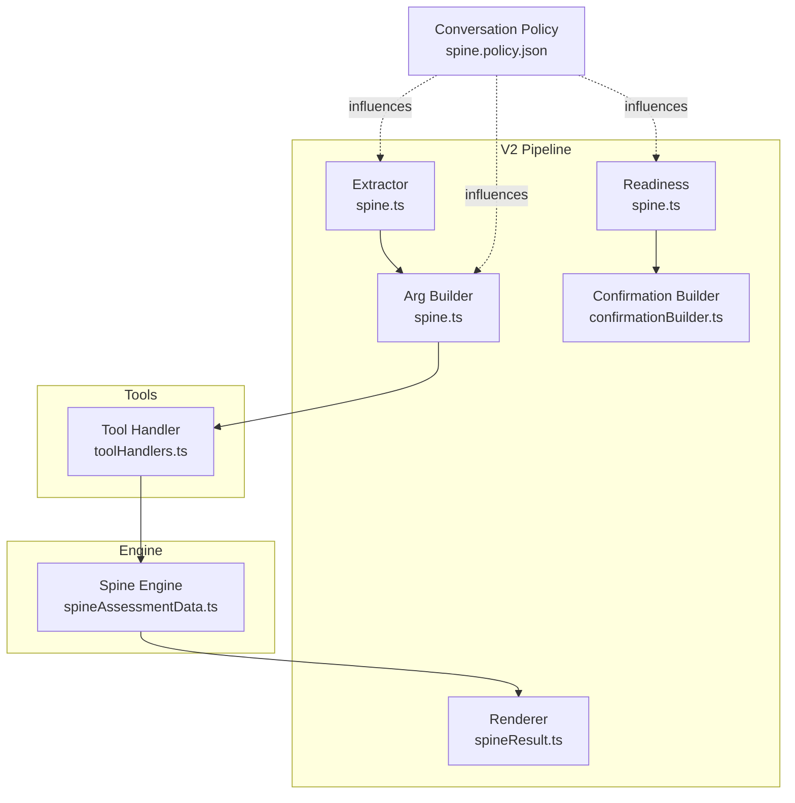
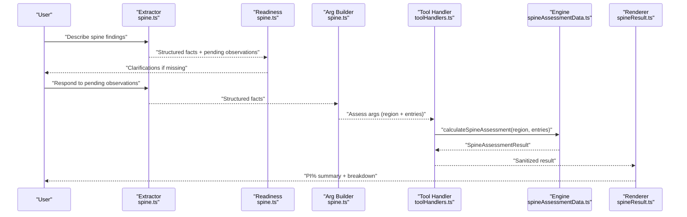
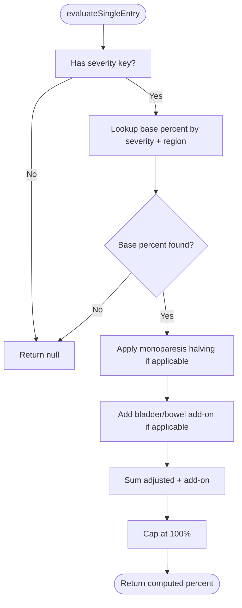
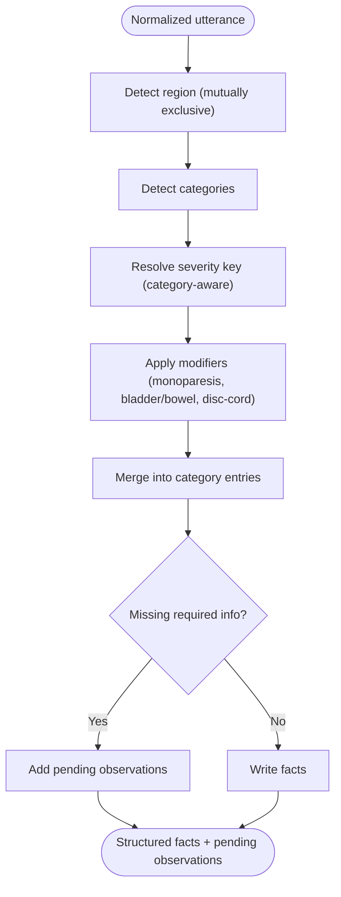
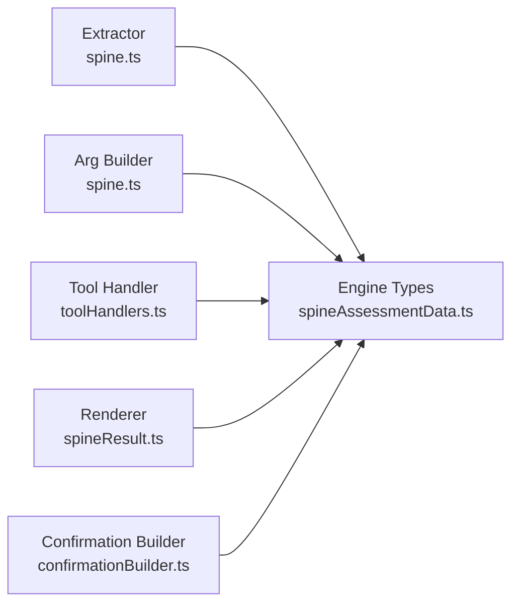

# Spine Assessment (Chapter 5)

<cite>
**Referenced Files in This Document**
- [spineAssessmentData.ts](file://src/engine/spineAssessmentData.ts)
- [spine.ts (argBuilder)](file://src/v2/argBuilders/spine.ts)
- [spine.ts (extractor)](file://src/v2/extractors/spine.ts)
- [spine.ts (readiness)](file://src/v2/readiness/spine.ts)
- [spineResult.ts](file://src/v2/renderers/spineResult.ts)
- [confirmationBuilder.ts](file://src/v2/confirmationBuilder.ts)
- [toolHandlers.ts](file://src/tools/toolHandlers.ts)
- [spine.policy.json](file://gatiod_conversation_policy_data/policy/systems/spine.policy.json)
- [spineEndToEnd.test.ts](file://tests/v2/spine/spineEndToEnd.test.ts)
- [spine.shadow.test.ts](file://tests/v2/excelScenarios/spine.shadow.test.ts)
</cite>

## Table of Contents
1. [Introduction](#introduction)
2. [Project Structure](#project-structure)
3. [Core Components](#core-components)
4. [Architecture Overview](#architecture-overview)
5. [Detailed Component Analysis](#detailed-component-analysis)
6. [Dependency Analysis](#dependency-analysis)
7. [Performance Considerations](#performance-considerations)
8. [Troubleshooting Guide](#troubleshooting-guide)
9. [Conclusion](#conclusion)
10. [Appendices](#appendices)

## Introduction
This document explains the Spine Assessment system for Chapter 5 GATIOD calculations. It covers how clinical findings are extracted from free-text input, validated, transformed into structured data, and evaluated to compute permanent incapacity (PI%) according to GATIOD guidelines. The system supports five spine pathways: fractures/dislocations, spinal cord/cauda equina injury, intervertebral disc (including degenerative plus superimposed injury), lumbar spondylolysis/spondylolisthesis (acute traumatic vs pre-existing with superimposed), and chronic pain with normal MRI. The evaluation pipeline applies region-specific base percentages, monoparesis halving, bladder/bowel add-ons, and a 100% hard cap, with a “first schedule” flag when PI% reaches 100%.

## Project Structure
The Spine system spans three layers:
- Engine: Calculation logic, data definitions, and evaluation functions.
- V2 Pipeline: Extraction, readiness validation, argument building, rendering, and confirmation.
- Tools: Function-call bridge to the engine and sanitization of results for display.

**Diagram sources**
- [spine.ts (extractor):267-542](file://src/v2/extractors/spine.ts#L267-L542)
- [spine.ts (readiness):5-81](file://src/v2/readiness/spine.ts#L5-L81)
- [spine.ts (argBuilder):45-125](file://src/v2/argBuilders/spine.ts#L45-L125)
- [confirmationBuilder.ts:202-234](file://src/v2/confirmationBuilder.ts#L202-L234)
- [spineResult.ts:47-148](file://src/v2/renderers/spineResult.ts#L47-L148)
- [toolHandlers.ts:125-161](file://src/tools/toolHandlers.ts#L125-L161)
- [spineAssessmentData.ts:478-550](file://src/engine/spineAssessmentData.ts#L478-L550)
- [spine.policy.json:1-181](file://gatiod_conversation_policy_data/policy/systems/spine.policy.json#L1-L181)

**Section sources**
- [spineAssessmentData.ts:1-573](file://src/engine/spineAssessmentData.ts#L1-L573)
- [spine.ts (argBuilder):1-126](file://src/v2/argBuilders/spine.ts#L1-L126)
- [spine.ts (extractor):1-543](file://src/v2/extractors/spine.ts#L1-L543)
- [spine.ts (readiness):1-82](file://src/v2/readiness/spine.ts#L1-L82)
- [spineResult.ts:1-149](file://src/v2/renderers/spineResult.ts#L1-L149)
- [confirmationBuilder.ts:1-396](file://src/v2/confirmationBuilder.ts#L1-L396)
- [toolHandlers.ts:1-200](file://src/tools/toolHandlers.ts#L1-L200)
- [spine.policy.json:1-181](file://gatiod_conversation_policy_data/policy/systems/spine.policy.json#L1-L181)

## Core Components
- Spinal regions: cervical (C1–C7), thoraco_lumbar (T1–L1), lumbo_sacral (L2–S1).
- Diagnosis categories:
  - Fractures and dislocations (Section 1)
  - Spinal cord / central cord / cauda equina injury (Section 2)
  - Intervertebral disc (Section 3.1 and 3.2)
  - Lumbar spondylolysis / spondylolisthesis (Section 4)
  - Chronic pain with normal MRI (Section 5)
- Severity keys mapped to GATIOD rows and modifiers:
  - Mild sensory/motor, persistent radicular, ASIA D/C/B/A
  - Compression >25% / <25% (fractures)
  - Disc 3.1 residual/no-neuro/sensory/motor; Disc 3.2 residual/persistent neuro
  - Pre-existing residual/chronic (spondylolysis/spondylolisthesis)
  - Chronic pain attributable/not attributable
- Modifiers:
  - Monoparesis halving (ASIA C/D only)
  - Bladder/bowel add-ons (rows a–d only)
  - Disc-cord involvement rerouting to Section 2 when present
- Evaluation pipeline:
  - Base percent lookup by severity and region
  - Monoparesis halving
  - Bladder/bowel add-on
  - Pre-cap total and 100% hard cap
  - Winner selection among entries in the same region
  - First schedule flag when final PI% equals 100%

**Section sources**
- [spineAssessmentData.ts:5-135](file://src/engine/spineAssessmentData.ts#L5-L135)
- [spineAssessmentData.ts:259-280](file://src/engine/spineAssessmentData.ts#L259-L280)
- [spineAssessmentData.ts:292-319](file://src/engine/spineAssessmentData.ts#L292-L319)
- [spineAssessmentData.ts:363-470](file://src/engine/spineAssessmentData.ts#L363-L470)
- [spineAssessmentData.ts:478-550](file://src/engine/spineAssessmentData.ts#L478-L550)

## Architecture Overview
The end-to-end flow integrates extraction, validation, argument construction, tool invocation, and result rendering.

**Diagram sources**
- [spine.ts (extractor):267-542](file://src/v2/extractors/spine.ts#L267-L542)
- [spine.ts (readiness):5-81](file://src/v2/readiness/spine.ts#L5-L81)
- [spine.ts (argBuilder):45-125](file://src/v2/argBuilders/spine.ts#L45-L125)
- [toolHandlers.ts:125-161](file://src/tools/toolHandlers.ts#L125-L161)
- [spineAssessmentData.ts:478-550](file://src/engine/spineAssessmentData.ts#L478-L550)
- [spineResult.ts:47-148](file://src/v2/renderers/spineResult.ts#L47-L148)

## Detailed Component Analysis

### Engine: Spine Calculation Logic
- Data model:
  - CategoryEntry: diagnosisCategory, severity, isMonoparesis, bladderBowelSeverity, discCordInvolvement, spondylolysisPathway.
  - EvaluatedCategoryEntry: adds computedPercent, basePercent, adjustedPercent, bladderBowelAddOn, preCapPercent, suppressed, suppressionReason.
  - SpineAssessmentResult: spinalRegion, evaluatedEntries, winnerIndex, finalPercent, firstScheduleFlag.
- Severity availability and region mapping:
  - getSeveritiesForCategory returns applicable rows per category/pathway.
  - getBasePercent retrieves region-specific base PI% from a matrix.
- Modifiers:
  - applyMonoparesisModifier halves award for ASIA C/D when monoparesis is present.
  - getBladderBowelAddOn adds points for incomplete/complete bladder/bowel inrows a–d.
- Evaluation:
  - evaluateSingleEntry computes base → adjusted → pre-cap → capped percent.
  - calculateSpineAssessment:
    - Validates each entry and suppresses non-applicable entries with reasons.
    - Selects the highest award within the region as the winner.
    - Applies 100% hard cap and sets firstScheduleFlag when finalPercent is 100.

**Diagram sources**
- [spineAssessmentData.ts:435-470](file://src/engine/spineAssessmentData.ts#L435-L470)

**Section sources**
- [spineAssessmentData.ts:74-94](file://src/engine/spineAssessmentData.ts#L74-L94)
- [spineAssessmentData.ts:259-280](file://src/engine/spineAssessmentData.ts#L259-L280)
- [spineAssessmentData.ts:292-319](file://src/engine/spineAssessmentData.ts#L292-L319)
- [spineAssessmentData.ts:381-403](file://src/engine/spineAssessmentData.ts#L381-L403)
- [spineAssessmentData.ts:435-470](file://src/engine/spineAssessmentData.ts#L435-L470)
- [spineAssessmentData.ts:478-550](file://src/engine/spineAssessmentData.ts#L478-L550)

### V2 Extractor: Free-text to Structured Spine Findings
- Region detection:
  - Regex-based detection for cervical, thoraco_lumbar, and lumbo_sacral; mutual exclusivity enforced.
  - Multi-region utterance triggers a guard that blocks ambiguous inputs and asks the doctor to choose a single region.
- Category detection:
  - Patterns for fractures/dislocations, cord/cauda equina, disc (prolapsed/degenerated/superimposed), spondylolysis/spondylolisthesis, and chronic pain with normal MRI.
- Severity extraction:
  - Shared resolver maps free-text to severity keys using category-aware patterns.
  - Supports both initial extraction and pending observation resolution.
- Modifiers:
  - Monoparesis, bladder/bowel incontinence, disc-cord involvement.
- Outputs:
  - Structured facts for region and category entries, with pending observations for missing or ambiguous data.

**Diagram sources**
- [spine.ts (extractor):267-542](file://src/v2/extractors/spine.ts#L267-L542)

**Section sources**
- [spine.ts (extractor):42-64](file://src/v2/extractors/spine.ts#L42-L64)
- [spine.ts (extractor):74-83](file://src/v2/extractors/spine.ts#L74-L83)
- [spine.ts (extractor):204-253](file://src/v2/extractors/spine.ts#L204-L253)
- [spine.ts (extractor):300-383](file://src/v2/extractors/spine.ts#L300-L383)
- [spine.ts (extractor):420-532](file://src/v2/extractors/spine.ts#L420-L532)

### V2 Readiness Validator
- Ensures no pending observations, region is present, at least one entry exists, and all entries have a severity.
- Enforces rerouting for disc with cord involvement to cord injury pathway.

**Section sources**
- [spine.ts (readiness):5-81](file://src/v2/readiness/spine.ts#L5-L81)

### Argument Builder: Structuring Inputs for the Tool
- Validates presence of region and category entries.
- Cross-validates each entry’s severity against allowed severities for the category and region.
- Builds a typed argument object for the assess_spine tool.

**Section sources**
- [spine.ts (argBuilder):45-125](file://src/v2/argBuilders/spine.ts#L45-L125)

### Tool Handler: Bridge to Engine
- Converts tool arguments to engine types, mapping boolean flags to enums.
- Invokes calculateSpineAssessment and sanitizes results by replacing raw enum keys with human-readable labels.

**Section sources**
- [toolHandlers.ts:125-161](file://src/tools/toolHandlers.ts#L125-L161)

### Renderer: Human-Friendly Presentation
- Summarizes system-generated PI%, lists evaluated entries, and highlights the winner.
- Auto-expands to show base percent, monoparesis halving, bladder/bowel add-on, and caps.
- Provides a full breakdown with notes and caps applied.

**Section sources**
- [spineResult.ts:47-148](file://src/v2/renderers/spineResult.ts#L47-L148)

### Confirmation Builder: Doctor Review
- Requires region and at least one calculable entry; otherwise fails closed.
- Formats entries as readable lines, including modifiers and pathway specifics.

**Section sources**
- [confirmationBuilder.ts:202-234](file://src/v2/confirmationBuilder.ts#L202-L234)

### Conversation Policy: Guidance and Gates
- Defines activation terms, slots, and rules for spine assessment.
- Includes higher-category override, bladder/bowel add-on, monoparesis halving, and MRI gating for disc/chronic pain pathways.

**Section sources**
- [spine.policy.json:1-181](file://gatiod_conversation_policy_data/policy/systems/spine.policy.json#L1-L181)

## Dependency Analysis
- Extractor depends on engine types for severity keys and category options.
- Arg builder validates against engine-provided severity availability and region support.
- Tool handler maps tool args to engine types and sanitizes results for rendering.
- Renderer relies on engine severity options and category labels for display.

**Diagram sources**
- [spine.ts (extractor):1-543](file://src/v2/extractors/spine.ts#L1-L543)
- [spine.ts (argBuilder):1-126](file://src/v2/argBuilders/spine.ts#L1-L126)
- [toolHandlers.ts:1-200](file://src/tools/toolHandlers.ts#L1-L200)
- [spineAssessmentData.ts:1-573](file://src/engine/spineAssessmentData.ts#L1-L573)
- [spineResult.ts:1-149](file://src/v2/renderers/spineResult.ts#L1-L149)
- [confirmationBuilder.ts:1-396](file://src/v2/confirmationBuilder.ts#L1-L396)

**Section sources**
- [spine.ts (extractor):1-543](file://src/v2/extractors/spine.ts#L1-L543)
- [spine.ts (argBuilder):1-126](file://src/v2/argBuilders/spine.ts#L1-L126)
- [toolHandlers.ts:1-200](file://src/tools/toolHandlers.ts#L1-L200)
- [spineAssessmentData.ts:1-573](file://src/engine/spineAssessmentData.ts#L1-L573)
- [spineResult.ts:1-149](file://src/v2/renderers/spineResult.ts#L1-L149)
- [confirmationBuilder.ts:1-396](file://src/v2/confirmationBuilder.ts#L1-L396)

## Performance Considerations
- Extraction uses deterministic regex patterns; complexity is linear in input length.
- Severity resolution is O(N) per entry with a small fixed number of patterns.
- Engine evaluation is O(M) per region where M is the number of entries; winner selection is O(M).
- Sanitization and rendering are O(M) for the number of evaluated entries.
- Recommendations:
  - Keep regex patterns minimal and mutually exclusive to avoid backtracking.
  - Cache category-severity options when reused across validations.
  - Avoid repeated label lookups by precomputing category/label maps.

[No sources needed since this section provides general guidance]

## Troubleshooting Guide
Common issues and resolutions:
- Multi-region input in a single utterance:
  - Symptom: Guard triggers and asks to pick one region.
  - Resolution: Assess one region at a time; the system refuses multi-region spine assessments.
- Missing region or diagnosis category:
  - Symptom: Readiness validator requests region or diagnosis category.
  - Resolution: Provide the region and a diagnosis category before calculating.
- Missing severity:
  - Symptom: Pending observation asks for severity row; confirmation builder fails closed.
  - Resolution: Choose a severity row from the available chips; severity must be valid for the selected category and region.
- Disc with cord involvement:
  - Symptom: Readiness validator requests rerouting to spinal cord injury.
  - Resolution: Confirm or change the diagnosis category to spinal_cord_injury when cord involvement is present.
- Confirmation rendering crashes with “[Object Object]”:
  - Symptom: Display formatting issues in confirmation or post-confirm steps.
  - Resolution: Ensure entries are properly formatted; the end-to-end test verifies readable formatting and absence of object stringification.
- Tool execution failures:
  - Symptom: assess_spine tool throws errors.
  - Resolution: Verify region and entries are valid; confirm readiness before invoking the tool.

**Section sources**
- [spine.ts (extractor):300-383](file://src/v2/extractors/spine.ts#L300-L383)
- [spine.ts (readiness):61-78](file://src/v2/readiness/spine.ts#L61-L78)
- [spineEndToEnd.test.ts:26-95](file://tests/v2/spine/spineEndToEnd.test.ts#L26-L95)

## Conclusion
The Spine Assessment system integrates robust extraction, validation, and calculation to produce accurate Chapter 5 PI% results. It enforces GATIOD rules for region-specific base percentages, monoparesis halving, bladder/bowel add-ons, and a 100% hard cap, while guiding users through structured confirmation and readable breakdowns. The design ensures consistency across severity extraction, argument construction, tool invocation, and result rendering.

[No sources needed since this section summarizes without analyzing specific files]

## Appendices

### Calculation Algorithms and Examples
- Base percent lookup:
  - Example: ASIA D in cervical region yields a base percent; see matrix for region-specific values.
- Monoparesis halving:
  - Applied only for ASIA C/D when monoparesis is present.
- Bladder/bowel add-on:
  - Added for rows a–d; values depend on severity and incontinence type.
- Final percent and caps:
  - Pre-cap sum is capped at 100%; first schedule flag is set when final PI% equals 100%.

Concrete examples from the codebase:
- Single-entry evaluation with base percent, monoparesis halving, and bladder/bowel add-on:
  - See [evaluateSingleEntry:435-470](file://src/engine/spineAssessmentData.ts#L435-L470).
- Multi-entry winner selection and suppression:
  - See [calculateSpineAssessment:478-550](file://src/engine/spineAssessmentData.ts#L478-L550).
- Tool sanitization for display:
  - See [sanitizeSpineResult:145-161](file://src/tools/toolHandlers.ts#L145-L161).

**Section sources**
- [spineAssessmentData.ts:292-319](file://src/engine/spineAssessmentData.ts#L292-L319)
- [spineAssessmentData.ts:387-403](file://src/engine/spineAssessmentData.ts#L387-L403)
- [spineAssessmentData.ts:435-470](file://src/engine/spineAssessmentData.ts#L435-L470)
- [spineAssessmentData.ts:478-550](file://src/engine/spineAssessmentData.ts#L478-L550)
- [toolHandlers.ts:145-161](file://src/tools/toolHandlers.ts#L145-L161)

### Configuration Options and Parameters
- Spinal regions:
  - Keys: cervical, thoraco_lumbar, lumbo_sacral.
- Diagnosis categories:
  - Keys: fractures_dislocations, spinal_cord_injury, intervertebral_disc, spondylolysis_spondylolisthesis, chronic_pain_normal_mri.
- Severity keys:
  - Vary by category; see [getSeveritiesForCategory:260-280](file://src/engine/spineAssessmentData.ts#L260-L280).
- Modifiers:
  - isMonoparesis: boolean; monoparesis halving applies to ASIA C/D.
  - bladderBowelSeverity: enum with add-on values.
  - discCordInvolvement: reroutes disc entries to cord injury pathway when true.
  - spondylolysisPathway: acute_traumatic vs pre_existing_superimposed.

**Section sources**
- [spineAssessmentData.ts:5-135](file://src/engine/spineAssessmentData.ts#L5-L135)
- [spineAssessmentData.ts:260-280](file://src/engine/spineAssessmentData.ts#L260-L280)
- [spineAssessmentData.ts:411-429](file://src/engine/spineAssessmentData.ts#L411-L429)

### Return Values and Outcome Interpretation
- SpineAssessmentResult:
  - spinalRegion: Selected region.
  - evaluatedEntries: List of evaluated entries with computed percent and modifiers.
  - winnerIndex: Index of the highest award within the region.
  - finalPercent: Final capped PI%.
  - firstScheduleFlag: True when final PI% is 100%.
- Renderer output:
  - Summary lines, auto-expanded breakdown, and full breakdown with notes and caps.

**Section sources**
- [spineAssessmentData.ts:351-359](file://src/engine/spineAssessmentData.ts#L351-L359)
- [spineResult.ts:47-148](file://src/v2/renderers/spineResult.ts#L47-L148)

### Clinical Scenarios and GATIOD Pathways
- Herniated disc:
  - Section 3.1 residual or persistent with or without neurological deficit.
  - Section 3.2 degenerative disc with superimposed injury.
- Spinal fractures:
  - Compression or burst fractures >25% or <25% with residual pain.
- Spinal cord injuries:
  - ASIA A/B (complete), ASIA C/D (incomplete), mild sensory/motor, persistent radicular.
- Spondylolysis/spondylolisthesis:
  - Acute traumatic pathway (use Section 1 rows) or pre-existing with superimposed (Section 4).
- Chronic pain with normal MRI:
  - Residual pain attributable vs not attributable to the injury.

**Section sources**
- [spineAssessmentData.ts:104-135](file://src/engine/spineAssessmentData.ts#L104-L135)
- [spineAssessmentData.ts:137-253](file://src/engine/spineAssessmentData.ts#L137-L253)
- [spine.policy.json:32-52](file://gatiod_conversation_policy_data/policy/systems/spine.policy.json#L32-L52)

### Relationship to Other Body Systems and Overall PI% Calculations
- The Spine system contributes a region-specific PI% to the overall GATIOD PI%.
- The global CVC combines multiple system results; the Spine system participates alongside Upper/Lower Limb, Respiratory, Renal, Gastro-Digestive, Hearing, CNS, and Visual systems.
- The tool handler wraps results with a system key and final PI% for downstream aggregation.

**Section sources**
- [toolHandlers.ts:106-121](file://src/tools/toolHandlers.ts#L106-L121)

### Validation and Shadow Testing
- End-to-end test:
  - Exercises multi-system input, severity chip resolution, confirmation, tool execution, and rendering without crashes.
- Excel shadow runner:
  - Validates fixture integrity and calibration sample meets ADR-0001 thresholds.

**Section sources**
- [spineEndToEnd.test.ts:26-95](file://tests/v2/spine/spineEndToEnd.test.ts#L26-L95)
- [spine.shadow.test.ts:16-53](file://tests/v2/excelScenarios/spine.shadow.test.ts#L16-L53)