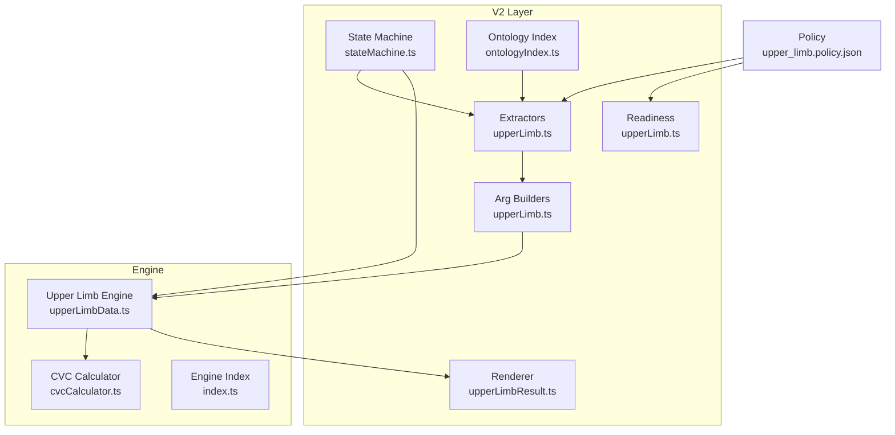
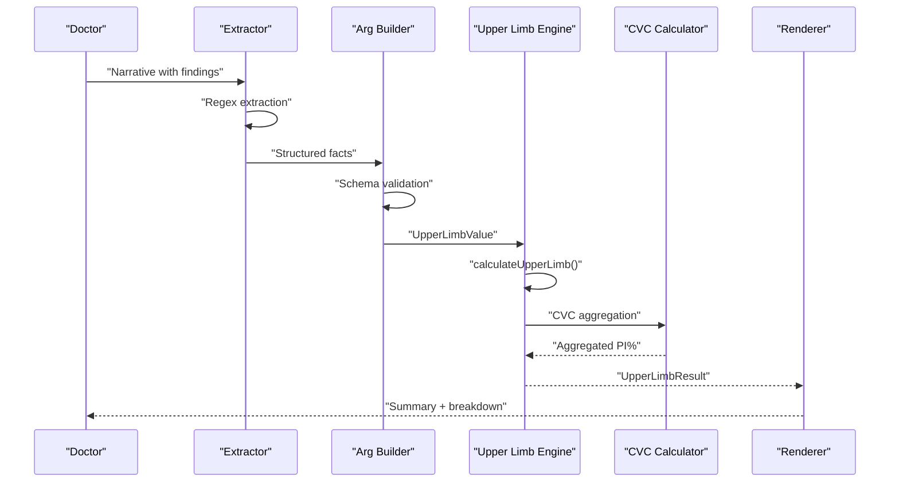
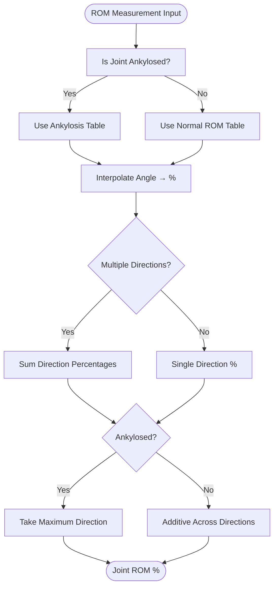
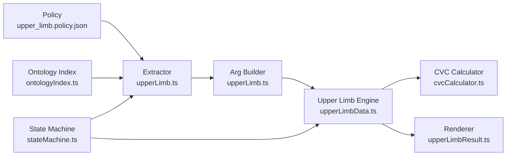

# Upper Limb Assessment (Chapter 3)

<cite>
**Referenced Files in This Document**
- [upperLimbData.ts](file://src/engine/upperLimbData.ts)
- [cvcCalculator.ts](file://src/engine/cvcCalculator.ts)
- [index.ts](file://src/engine/index.ts)
- [upperLimb.policy.json](file://gatiod_conversation_policy_data/policy/systems/upper_limb.policy.json)
- [upperLimb.ts](file://src/v2/argBuilders/upperLimb.ts)
- [upperLimb.ts](file://src/v2/extractors/upperLimb.ts)
- [upperLimb.ts](file://src/v2/readiness/upperLimb.ts)
- [upperLimbResult.ts](file://src/v2/renderers/upperLimbResult.ts)
- [stateMachine.ts](file://src/v2/stateMachine.ts)
- [ontologyIndex.ts](file://src/v2/ontologyIndex.ts)
- [upperLimb.test.ts](file://tests/engine/upperLimb.test.ts)
- [upperLimb.ts](file://tests/v2/upperLimb/extractor.test.ts)
</cite>

## Table of Contents
1. [Introduction](#introduction)
2. [Project Structure](#project-structure)
3. [Core Components](#core-components)
4. [Architecture Overview](#architecture-overview)
5. [Detailed Component Analysis](#detailed-component-analysis)
6. [Dependency Analysis](#dependency-analysis)
7. [Performance Considerations](#performance-considerations)
8. [Troubleshooting Guide](#troubleshooting-guide)
9. [Conclusion](#conclusion)

## Introduction
This document provides comprehensive technical documentation for the Upper Limb assessment system (Chapter 3 GATIOD calculations). It explains how clinical findings are processed, converted to structured data, and transformed into permanent incapacity (PI%) calculations. The system supports:
- Range of motion (ROM) measurements with interpolation from lookup tables
- Strength and neurological deficit assessments
- Diagnosis-based estimates (DBE) for specific upper limb injuries
- Amputation calculations with caps and suppression logic
- Conflict resolution between ROM and DBE pathways
- Integration with the broader GATIOD calculation framework using Combined Values Chart (CVC)

## Project Structure
The Upper Limb system is implemented as a pure calculation engine with supporting V2 orchestration layers:
- Engine: Calculation logic, lookup tables, and schemas
- V2 Extractors: Natural language processing and structured fact extraction
- V2 Arg Builders: Validation and assembly of structured inputs
- V2 Readiness: Gatekeeping and readiness checks
- V2 Renderers: Human-readable and API-friendly result rendering
- Policy: Conversation flow and rule enforcement

**Diagram sources**
- [upperLimb.ts:191-591](file://src/v2/extractors/upperLimb.ts#L191-L591)
- [upperLimb.ts:20-140](file://src/v2/argBuilders/upperLimb.ts#L20-L140)
- [upperLimb.ts:12-85](file://src/v2/readiness/upperLimb.ts#L12-L85)
- [stateMachine.ts:447-509](file://src/v2/stateMachine.ts#L447-L509)
- [upperLimbResult.ts:23-129](file://src/v2/renderers/upperLimbResult.ts#L23-L129)
- [upperLimbData.ts:887-1593](file://src/engine/upperLimbData.ts#L887-L1593)
- [cvcCalculator.ts:1-108](file://src/engine/cvcCalculator.ts#L1-L108)
- [index.ts:1-89](file://src/engine/index.ts#L1-L89)
- [upperLimb.policy.json:1-190](file://gatiod_conversation_policy_data/policy/systems/upper_limb.policy.json#L1-L190)
- [ontologyIndex.ts:50-210](file://src/v2/ontologyIndex.ts#L50-L210)

**Section sources**
- [upperLimb.policy.json:1-190](file://gatiod_conversation_policy_data/policy/systems/upper_limb.policy.json#L1-L190)
- [index.ts:16-41](file://src/engine/index.ts#L16-L41)

## Core Components
- UpperLimbValue: Structured input containing side, amputations, ROM, neurological, and DBE selections
- UpperLimbResult: Final PI% calculation with category breakdowns and conflict resolutions
- ROM lookup tables: Joint-specific directional ROM-to-percentage mappings (including ankylosis)
- Nerve definitions: Sensory/motor/combined maximums and entrapment severity levels
- DBE conditions: Predefined injury categories with anatomical targets and percent ranges
- CVC calculator: Safe aggregation preventing over-100% summation

Key calculation entry points:
- [calculateUpperLimb:1499-1570](file://src/engine/upperLimbData.ts#L1499-L1570)
- [calculateAmputation:1221-1262](file://src/engine/upperLimbData.ts#L1221-L1262)
- [calculateRom:1264-1307](file://src/engine/upperLimbData.ts#L1264-L1307)
- [calculateNeurological:1309-1352](file://src/engine/upperLimbData.ts#L1309-L1352)
- [calculateDbe:1370-1402](file://src/engine/upperLimbData.ts#L1370-L1402)

**Section sources**
- [upperLimbData.ts:160-186](file://src/engine/upperLimbData.ts#L160-L186)
- [upperLimbData.ts:1221-1570](file://src/engine/upperLimbData.ts#L1221-L1570)
- [cvcCalculator.ts:58-89](file://src/engine/cvcCalculator.ts#L58-L89)

## Architecture Overview
The system follows a deterministic pipeline:
1. Doctor provides clinical narrative
2. Extractor identifies facts (side, ROM, nerve deficits, amputation, DBE)
3. Arg Builder validates and structures facts into UpperLimbValue
4. Engine computes category-specific PI% values
5. Conflict resolution resolves DBE vs ROM for shared anatomical targets
6. CVC aggregates all streams with amputation cap
7. Renderer presents human-readable and API-ready results

**Diagram sources**
- [upperLimb.ts:191-591](file://src/v2/extractors/upperLimb.ts#L191-L591)
- [upperLimb.ts:20-140](file://src/v2/argBuilders/upperLimb.ts#L20-L140)
- [upperLimbData.ts:1499-1570](file://src/engine/upperLimbData.ts#L1499-L1570)
- [cvcCalculator.ts:58-89](file://src/engine/cvcCalculator.ts#L58-L89)
- [upperLimbResult.ts:23-129](file://src/v2/renderers/upperLimbResult.ts#L23-L129)

## Detailed Component Analysis

### ROM Calculation and Lookup
- Joint-level ROM is computed by interpolating measured angles against predefined lookup tables
- Ankylosis uses dedicated tables or falls back to restricted-motion tables
- Multiple directions per joint are summed for non-ankylosed joints; maximum direction is used for ankylosed joints
- Per-finger joints (finger MCP/PPIP/DIP) support separate entries for ring/little fingers

Implementation highlights:
- [lookupRom:1119-1135](file://src/engine/upperLimbData.ts#L1119-L1135)
- [getRomLookupTable:1137-1140](file://src/engine/upperLimbData.ts#L1137-L1140)
- [calculateRom:1264-1307](file://src/engine/upperLimbData.ts#L1264-L1307)
- [ROM_JOINTS:312-533](file://src/engine/upperLimbData.ts#L312-L533)

**Diagram sources**
- [upperLimbData.ts:1119-1140](file://src/engine/upperLimbData.ts#L1119-L1140)
- [upperLimbData.ts:1264-1307](file://src/engine/upperLimbData.ts#L1264-L1307)

**Section sources**
- [upperLimbData.ts:312-533](file://src/engine/upperLimbData.ts#L312-L533)
- [upperLimbData.ts:1119-1140](file://src/engine/upperLimbData.ts#L1119-L1140)
- [upperLimbData.ts:1264-1307](file://src/engine/upperLimbData.ts#L1264-L1307)

### Neurological Deficit Assessment
- Supports brachial plexus, peripheral, digital, and entrapment nerve groups
- Entrapment conditions specify fixed percentages by severity level
- For non-entrapment nerves, maximums are defined for sensory, motor, and combined deficits; partial loss halves the maximum
- Duplicate nerve selections are deduplicated, keeping the highest value

Key references:
- [UPPER_LIMB_NERVES:537-593](file://src/engine/upperLimbData.ts#L537-L593)
- [calculateNeurological:1309-1352](file://src/engine/upperLimbData.ts#L1309-L1352)

**Section sources**
- [upperLimbData.ts:537-593](file://src/engine/upperLimbData.ts#L537-L593)
- [upperLimbData.ts:1309-1352](file://src/engine/upperLimbData.ts#L1309-L1352)

### DBE (Diagnosis-Based Estimate) Calculations
- Predefined conditions cover fractures, instability, osteoarthritis, and tenosynovitis
- Each condition specifies anatomical targets and a fixed or ranged percent
- Selections are deduplicated by condition and target, keeping the highest value
- DBE values are suppressed when amputation targets are fully suppressed

Key references:
- [DBE_CONDITIONS:873-885](file://src/engine/upperLimbData.ts#L873-L885)
- [calculateDbe:1370-1402](file://src/engine/upperLimbData.ts#L1370-L1402)

**Section sources**
- [upperLimbData.ts:873-885](file://src/engine/upperLimbData.ts#L873-L885)
- [upperLimbData.ts:1370-1402](file://src/engine/upperLimbData.ts#L1370-L1402)

### Amputation Calculations and Suppression
- Arm-level amputations define definitive percentages and suppress distal structures
- Finger amputation levels are summed with caps:
  - 70% cap for four fingers plus thumb (hand)
  - 60% cap for four fingers only
- Suppression logic ensures DBE/ROM for suppressed anatomical keys are ignored

Key references:
- [ARM_AMPUTATION_LEVELS:234-238](file://src/engine/upperLimbData.ts#L234-L238)
- [FINGER_AMPUTATION_LEVELS:240-275](file://src/engine/upperLimbData.ts#L240-L275)
- [calculateAmputation:1221-1262](file://src/engine/upperLimbData.ts#L1221-L1262)
- [getAmputationSuppressedAnatomicalKeys:987-1017](file://src/engine/upperLimbData.ts#L987-L1017)
- [isDbeJointSuppressed:1055-1065](file://src/engine/upperLimbData.ts#L1055-L1065)
- [isRomJointSuppressed:1071-1079](file://src/engine/upperLimbData.ts#L1071-L1079)
- [isUpperLimbNerveSuppressed:1093-1117](file://src/engine/upperLimbData.ts#L1093-L1117)

**Section sources**
- [upperLimbData.ts:234-275](file://src/engine/upperLimbData.ts#L234-L275)
- [upperLimbData.ts:1221-1262](file://src/engine/upperLimbData.ts#L1221-L1262)
- [upperLimbData.ts:1055-1117](file://src/engine/upperLimbData.ts#L1055-L1117)

### Conflict Resolution: DBE vs ROM
- When both DBE and ROM apply to the same anatomical target, the higher value is retained
- This prevents double counting and aligns with GATIOD rules

Key references:
- [resolveDbeRomConflicts:1475-1497](file://src/engine/upperLimbData.ts#L1475-L1497)
- [buildRomByAnatomicalKey:1404-1428](file://src/engine/upperLimbData.ts#L1404-L1428)
- [buildDbeByAnatomicalKey:1435-1468](file://src/engine/upperLimbData.ts#L1435-L1468)

**Section sources**
- [upperLimbData.ts:1475-1497](file://src/engine/upperLimbData.ts#L1475-L1497)
- [upperLimbData.ts:1404-1468](file://src/engine/upperLimbData.ts#L1404-L1468)

### Master Calculation and CVC Aggregation
- Final PI% is computed by combining amputation, adjusted ROM, neurological, and DBE streams
- CVC prevents over-aggregation beyond 100%
- A global cap limits upper limb final PI% to 75%

Key references:
- [calculateUpperLimb:1499-1570](file://src/engine/upperLimbData.ts#L1499-L1570)
- [combineMultipleValuesChart:74-89](file://src/engine/cvcCalculator.ts#L74-L89)

**Section sources**
- [upperLimbData.ts:1499-1570](file://src/engine/upperLimbData.ts#L1499-L1570)
- [cvcCalculator.ts:74-89](file://src/engine/cvcCalculator.ts#L74-L89)

### V2 Orchestration and Conversation Flow
- Extractor: Regex-based extraction of ROM, nerve, amputation, and DBE findings
- Arg Builder: Validates and constructs UpperLimbValue with schema
- Readiness: Ensures all required fields are present and gates ROM-from-nerve
- Renderer: Presents summary and full breakdown with conflict explanations
- Policy: Defines conversation rules, activation terms, and required slots

Key references:
- [extractUpperLimb:191-591](file://src/v2/extractors/upperLimb.ts#L191-L591)
- [buildUpperLimbArgs:20-140](file://src/v2/argBuilders/upperLimb.ts#L20-L140)
- [validateUpperLimbReadiness:12-85](file://src/v2/readiness/upperLimb.ts#L12-L85)
- [renderUpperLimbResult:23-129](file://src/v2/renderers/upperLimbResult.ts#L23-L129)
- [upperLimb.policy.json:1-190](file://gatiod_conversation_policy_data/policy/systems/upper_limb.policy.json#L1-L190)

**Section sources**
- [upperLimb.ts:191-591](file://src/v2/extractors/upperLimb.ts#L191-L591)
- [upperLimb.ts:20-140](file://src/v2/argBuilders/upperLimb.ts#L20-L140)
- [upperLimb.ts:12-85](file://src/v2/readiness/upperLimb.ts#L12-L85)
- [upperLimbResult.ts:23-129](file://src/v2/renderers/upperLimbResult.ts#L23-L129)
- [upperLimb.policy.json:1-190](file://gatiod_conversation_policy_data/policy/systems/upper_limb.policy.json#L1-L190)

## Dependency Analysis
The system exhibits clean separation of concerns:
- Engine is pure and UI-independent
- V2 layers handle extraction, validation, readiness, and presentation
- Policy governs conversation flow and rules
- Ontology indexing supports automated condition matching

**Diagram sources**
- [upperLimb.policy.json:1-190](file://gatiod_conversation_policy_data/policy/systems/upper_limb.policy.json#L1-L190)
- [upperLimb.ts:191-591](file://src/v2/extractors/upperLimb.ts#L191-L591)
- [upperLimb.ts:20-140](file://src/v2/argBuilders/upperLimb.ts#L20-L140)
- [upperLimbData.ts:887-1593](file://src/engine/upperLimbData.ts#L887-L1593)
- [cvcCalculator.ts:1-108](file://src/engine/cvcCalculator.ts#L1-L108)
- [upperLimbResult.ts:23-129](file://src/v2/renderers/upperLimbResult.ts#L23-L129)
- [stateMachine.ts:447-509](file://src/v2/stateMachine.ts#L447-L509)
- [ontologyIndex.ts:50-210](file://src/v2/ontologyIndex.ts#L50-L210)

**Section sources**
- [index.ts:6-41](file://src/engine/index.ts#L6-L41)
- [stateMachine.ts:447-509](file://src/v2/stateMachine.ts#L447-L509)

## Performance Considerations
- ROM interpolation is O(n) per direction using linear search through pre-sorted lookup tables; acceptable given small table sizes
- CVC aggregation uses iterative combination; worst-case O(k) for k categories
- Suppression and conflict resolution operate on anatomical key sets; efficient with Set lookups
- Recommendations:
  - Keep lookup tables sorted and compact
  - Cache repeated computations (e.g., per-anatomical-key aggregations)
  - Consider binary search for very large tables if expanded

[No sources needed since this section provides general guidance]

## Troubleshooting Guide
Common issues and resolutions:
- Missing side: The system requires explicit left/right; bilateral mentions trigger warnings and requests clarification
  - Reference: [validateUpperLimbReadiness:27-36](file://src/v2/readiness/upperLimb.ts#L27-L36)
- ROM without direction: Bare angles require direction clarification; pending observation is created
  - Reference: [extractUpperLimb:364-398](file://src/v2/extractors/upperLimb.ts#L364-L398)
- Nerve deficit without loss type: Creates pending observation for deficit type and loss type
  - Reference: [extractUpperLimb:423-442](file://src/v2/extractors/upperLimb.ts#L423-L442)
- ROM-from-nerve gate: When both ROM and nerve are present, the system requires clarification
  - Reference: [validateUpperLimbReadiness:72-82](file://src/v2/readiness/upperLimb.ts#L72-L82)
- DBE vs ROM conflicts: Higher value prevails; renderer explains conflicts
  - Reference: [resolveDbeRomConflicts:1475-1497](file://src/engine/upperLimbData.ts#L1475-L1497), [renderUpperLimbResult:66-82](file://src/v2/renderers/upperLimbResult.ts#L66-L82)
- Amputation suppression: Distal-only suppression; renderer notes suppressed structures
  - Reference: [calculateUpperLimb:1524-1530](file://src/engine/upperLimbData.ts#L1524-L1530)

**Section sources**
- [upperLimb.ts:27-82](file://src/v2/readiness/upperLimb.ts#L27-L82)
- [upperLimb.ts:364-442](file://src/v2/extractors/upperLimb.ts#L364-L442)
- [upperLimbData.ts:1475-1530](file://src/engine/upperLimbData.ts#L1475-L1530)
- [upperLimbResult.ts:66-82](file://src/v2/renderers/upperLimbResult.ts#L66-L82)

## Conclusion
The Upper Limb assessment system provides a robust, deterministic pipeline for converting clinical narratives into standardized PI% calculations. Its strengths include:
- Comprehensive lookup tables for ROM
- Clear conflict resolution between DBE and ROM
- Strict suppression logic for amputations
- Well-defined conversation flow and readiness gating
- Safe aggregation via CVC preventing over-100% summation

This architecture supports reliable, reproducible assessments across diverse upper limb presentations including fractures, tendon injuries, nerve damage, and joint replacements.