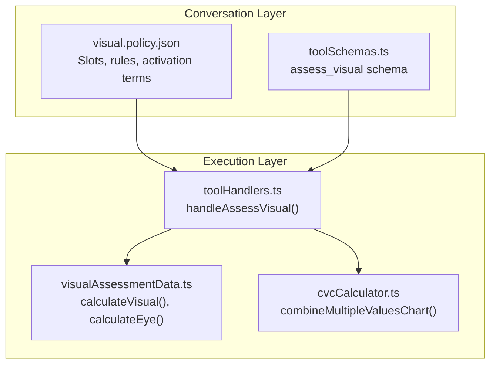
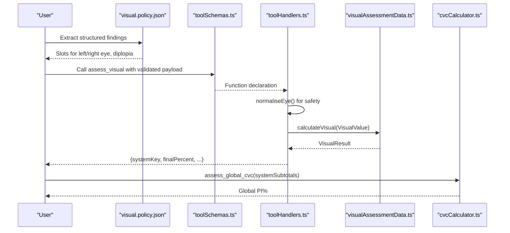
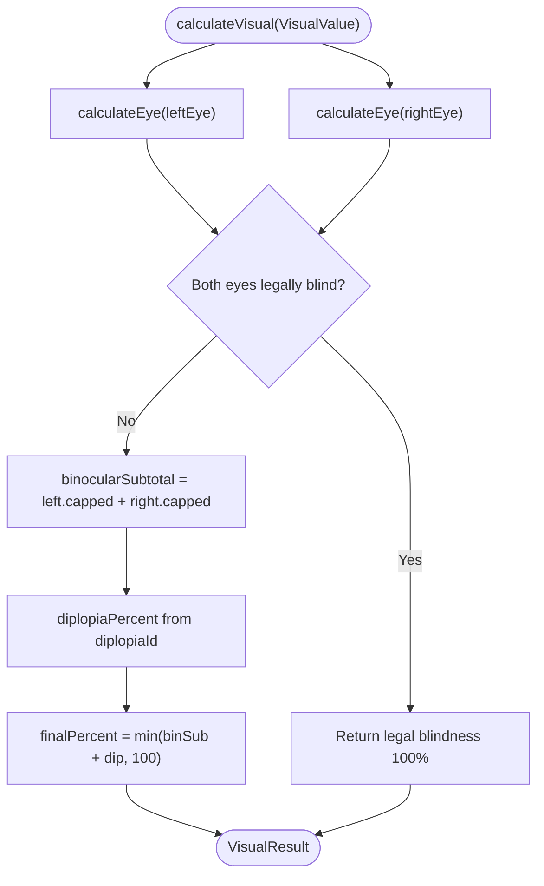
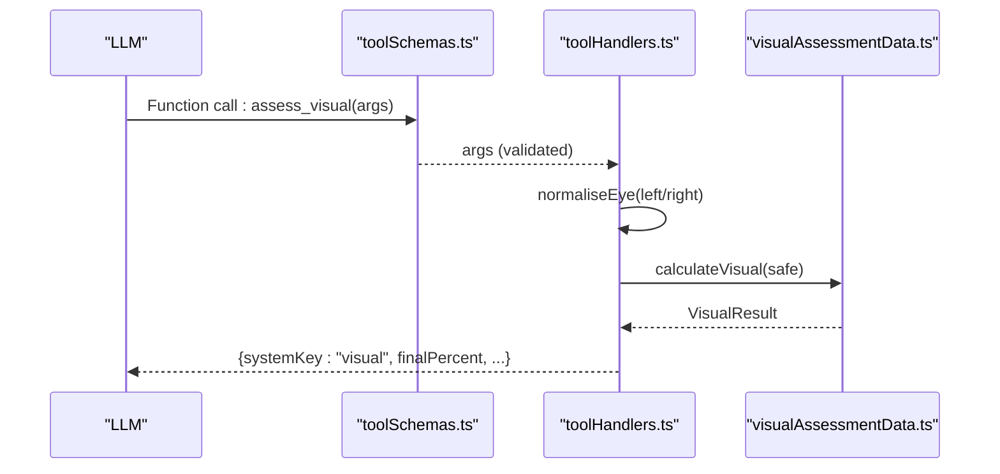
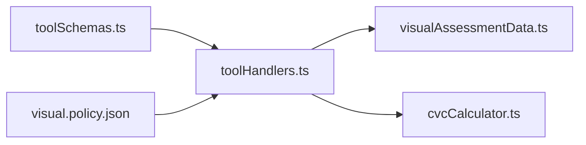

# Visual Assessment (Chapter 11)

<cite>
**Referenced Files in This Document**
- [visualAssessmentData.ts](file://src/engine/visualAssessmentData.ts)
- [toolHandlers.ts](file://src/tools/toolHandlers.ts)
- [toolSchemas.ts](file://src/tools/toolSchemas.ts)
- [cvcCalculator.ts](file://src/engine/cvcCalculator.ts)
- [visual.policy.json](file://gatiod_conversation_policy_data/policy/systems/visual.policy.json)
- [scenarioCatalogue.test.ts](file://tests/engine/scenarioCatalogue.test.ts)
- [CONTEXT.md](file://CONTEXT.md)
</cite>

## Table of Contents
1. [Introduction](#introduction)
2. [Project Structure](#project-structure)
3. [Core Components](#core-components)
4. [Architecture Overview](#architecture-overview)
5. [Detailed Component Analysis](#detailed-component-analysis)
6. [Dependency Analysis](#dependency-analysis)
7. [Performance Considerations](#performance-considerations)
8. [Troubleshooting Guide](#troubleshooting-guide)
9. [Conclusion](#conclusion)
10. [Appendices](#appendices)

## Introduction
This document explains the Visual Assessment system for Chapter 11 GATIOD calculations. It covers:
- Implementation of visual assessment criteria: visual acuity tests, visual field defects, functional modifiers, and diplopia
- Deterministic calculation algorithms for permanent incapacity percentages (PI%) per eye and binocularly
- Structured data processing from clinical findings to system-generated PI%
- Configuration options, parameters, and return values
- Integration with other body systems and contribution to overall PI% via Combined Values Chart (CVC)
- Common clinical scenarios and troubleshooting guidance

## Project Structure
The Visual Assessment system is implemented as a pure calculation module with a dedicated tool handler and policy-driven conversation flow. The key elements are:
- Engine: visual assessment data tables and calculation functions
- Tools: function schemas and handlers for LLM function calling
- Policy: conversation rules and slots for structured extraction
- Tests: scenario catalog demonstrating expected outcomes

**Diagram sources**
- [visual.policy.json:11-44](file://gatiod_conversation_policy_data/policy/systems/visual.policy.json#L11-L44)
- [toolSchemas.ts:448-480](file://src/tools/toolSchemas.ts#L448-L480)
- [toolHandlers.ts:186-203](file://src/tools/toolHandlers.ts#L186-L203)
- [visualAssessmentData.ts:199-268](file://src/engine/visualAssessmentData.ts#L199-L268)
- [cvcCalculator.ts:74-89](file://src/engine/cvcCalculator.ts#L74-L89)

**Section sources**
- [visual.policy.json:1-148](file://gatiod_conversation_policy_data/policy/systems/visual.policy.json#L1-L148)
- [toolSchemas.ts:448-480](file://src/tools/toolSchemas.ts#L448-L480)
- [toolHandlers.ts:186-203](file://src/tools/toolHandlers.ts#L186-L203)
- [visualAssessmentData.ts:199-268](file://src/engine/visualAssessmentData.ts#L199-L268)
- [cvcCalculator.ts:74-89](file://src/engine/cvcCalculator.ts#L74-L89)

## Core Components
- Visual tables and constants: Snellen acuity, visual field loss, functional modifiers, specific ophthalmic conditions, and diplopia options
- Data structures: EyeValue, VisualValue, EyeResult, VisualResult
- Calculation functions: calculateEye(), isLegallyBlind(), calculateVisual()
- Tool handler: normaliseEye() and handleAssessVisual() for robust input processing
- Policy: structured slots and rules for extracting findings

Key capabilities:
- Per-eye calculation with monocular cap (50%)
- Binocular additive subtotal plus diplopia modifier
- Legal blindness override to 100% when both eyes are legally blind
- Deterministic PI% output suitable for global CVC combination

**Section sources**
- [visualAssessmentData.ts:23-268](file://src/engine/visualAssessmentData.ts#L23-L268)
- [toolHandlers.ts:186-203](file://src/tools/toolHandlers.ts#L186-L203)
- [visual.policy.json:45-140](file://gatiod_conversation_policy_data/policy/systems/visual.policy.json#L45-L140)

## Architecture Overview
The Visual Assessment pipeline transforms structured clinical inputs into a system-generated PI% using deterministic rules. The process:
1. Conversation policy collects findings (per-eye acuity, field, modifiers, conditions) and diplopia
2. Tool schema validates and documents the assess_visual payload
3. Tool handler normalises inputs and invokes the engine
4. Engine calculates per-eye totals, applies caps, and computes final PI%
5. Results are ready for global CVC combination with other systems

**Diagram sources**
- [visual.policy.json:45-140](file://gatiod_conversation_policy_data/policy/systems/visual.policy.json#L45-L140)
- [toolSchemas.ts:448-480](file://src/tools/toolSchemas.ts#L448-L480)
- [toolHandlers.ts:186-203](file://src/tools/toolHandlers.ts#L186-L203)
- [visualAssessmentData.ts:235-268](file://src/engine/visualAssessmentData.ts#L235-L268)
- [cvcCalculator.ts:74-89](file://src/engine/cvcCalculator.ts#L74-L89)

## Detailed Component Analysis

### Visual Tables and Constants
- Snellen Acuity: maps best-corrected visual acuity to percent loss
- Visual Field Loss: maps retained visual field ranges to percent loss
- Functional Modifiers: additive modifiers (e.g., loss of accommodation, contrast/glare, colour, astigmatism/aniseikonia)
- Specific Ophthalmic Conditions: additive conditions (e.g., glaucoma, cataract/lens subluxation, corneal opacity/scar, orbital deformities, traumatic mydriasis/iris abnormalities)
- Diplopia Options: binocular add-ons with percent contributions

These tables define the scoring basis for each component of the visual assessment.

**Section sources**
- [visualAssessmentData.ts:30-98](file://src/engine/visualAssessmentData.ts#L30-L98)

### Data Structures
- EyeValue: acuityId, fieldId, functionalModifiers[], specificConditions[]
- VisualValue: leftEye, rightEye, diplopiaId
- EyeResult: per-component percent breakdown and capped totals
- VisualResult: per-eye results, binocular subtotal, diplopia percent, legal blindness flag, final PI%

These structures formalize the inputs and outputs for deterministic computation.

**Section sources**
- [visualAssessmentData.ts:123-152](file://src/engine/visualAssessmentData.ts#L123-L152)

### Calculation Functions
- calculateEye(): sums acuity, field, modifiers, and conditions; caps at 50%
- isLegallyBlind(): checks bilateral <6/60 (best corrected)
- calculateVisual(): computes per-eye totals, applies legal blindness override, adds diplopia, caps at 100%

**Diagram sources**
- [visualAssessmentData.ts:235-268](file://src/engine/visualAssessmentData.ts#L235-L268)

**Section sources**
- [visualAssessmentData.ts:199-268](file://src/engine/visualAssessmentData.ts#L199-L268)

### Tool Integration
- Tool schema defines assess_visual parameters and enumerations for acuity, field, modifiers, conditions, and diplopia
- Tool handler normalises missing arrays and invokes calculateVisual, then wraps the result with systemKey and finalPercent

**Diagram sources**
- [toolSchemas.ts:448-480](file://src/tools/toolSchemas.ts#L448-L480)
- [toolHandlers.ts:186-203](file://src/tools/toolHandlers.ts#L186-L203)
- [visualAssessmentData.ts:235-268](file://src/engine/visualAssessmentData.ts#L235-L268)

**Section sources**
- [toolSchemas.ts:448-480](file://src/tools/toolSchemas.ts#L448-L480)
- [toolHandlers.ts:186-203](file://src/tools/toolHandlers.ts#L186-L203)

### Policy-Driven Extraction
- Slots collect leftEye, rightEye, acuity, field, diplopiaId, modifiers, and confirmation
- Activation terms include “eye”, “vision”, “visual”, “acuity”, “field”, “diplopia”, “glaucoma”, “cataract”, “corneal”, “mydriasis”, “blindness”
- Conversation rules enforce monocular cap, binocular additivity, and legal blindness override

**Section sources**
- [visual.policy.json:18-44](file://gatiod_conversation_policy_data/policy/systems/visual.policy.json#L18-L44)
- [visual.policy.json:120-133](file://gatiod_conversation_policy_data/policy/systems/visual.policy.json#L120-L133)

### Integration with Other Systems (CVC)
- Visual PI% integrates with other system subtotals using the Combined Values Chart (CVC) formula
- Global CVC combines multiple system subtotals while respecting the 100% cap

**Section sources**
- [cvcCalculator.ts:74-89](file://src/engine/cvcCalculator.ts#L74-L89)
- [toolHandlers.ts:205-228](file://src/tools/toolHandlers.ts#L205-L228)

## Dependency Analysis
- visualAssessmentData.ts depends on:
  - Internal tables/constants for scoring
  - Zod schema for input validation
- toolHandlers.ts depends on:
  - visualAssessmentData.ts for calculations
  - toolSchemas.ts for function declarations
- toolSchemas.ts depends on:
  - Engine exports for function signatures
- cvcCalculator.ts is used by toolHandlers.ts for global combination

**Diagram sources**
- [toolSchemas.ts:448-480](file://src/tools/toolSchemas.ts#L448-L480)
- [toolHandlers.ts:186-203](file://src/tools/toolHandlers.ts#L186-L203)
- [visualAssessmentData.ts:235-268](file://src/engine/visualAssessmentData.ts#L235-L268)
- [cvcCalculator.ts:74-89](file://src/engine/cvcCalculator.ts#L74-L89)
- [visual.policy.json:11-14](file://gatiod_conversation_policy_data/policy/systems/visual.policy.json#L11-L14)

**Section sources**
- [toolSchemas.ts:448-480](file://src/tools/toolSchemas.ts#L448-L480)
- [toolHandlers.ts:186-203](file://src/tools/toolHandlers.ts#L186-L203)
- [visualAssessmentData.ts:235-268](file://src/engine/visualAssessmentData.ts#L235-L268)
- [cvcCalculator.ts:74-89](file://src/engine/cvcCalculator.ts#L74-L89)
- [visual.policy.json:11-14](file://gatiod_conversation_policy_data/policy/systems/visual.policy.json#L11-L14)

## Performance Considerations
- Pure functions with minimal allocations enable fast, deterministic computation
- Arrays of small fixed sizes (tables) allow O(n) lookups; complexity remains negligible
- Early exit for legal blindness avoids unnecessary computations
- Normalisation in tool handler prevents repeated defensive checks in engine

[No sources needed since this section provides general guidance]

## Troubleshooting Guide
Common issues and resolutions:
- Schema/engine field mismatch: The tool schema uses pluralized field names; the engine expects singular forms. Tests demonstrate correct field names for engine consumption.
- Missing arrays: The tool handler normalises missing arrays to empty arrays to prevent runtime errors.
- Legal blindness override: Bilateral <6/60 automatically yields 100% regardless of other findings.
- Monocular cap: Each eye’s subtotal is capped at 50%; additive binocular rule applies before diplopia.
- Global CVC: Ensure systemSubtotals are provided as an array of {system, piPercent}; zero or negative values are ignored.

Concrete references:
- Schema/engine mismatch documented in scenario tests
- Normalisation in tool handler for robustness
- Legal blindness and caps enforced in engine
- Global CVC handled in tool handler

**Section sources**
- [scenarioCatalogue.test.ts:867-871](file://tests/engine/scenarioCatalogue.test.ts#L867-L871)
- [toolHandlers.ts:186-203](file://src/tools/toolHandlers.ts#L186-L203)
- [visualAssessmentData.ts:225-268](file://src/engine/visualAssessmentData.ts#L225-L268)
- [toolHandlers.ts:205-228](file://src/tools/toolHandlers.ts#L205-L228)

## Conclusion
The Visual Assessment system implements Chapter 11 GATIOD rules deterministically:
- Per-eye scoring from acuity, field, functional modifiers, and specific conditions
- Monocular cap and binocular additive subtotal
- Legal blindness override to 100%
- Integration with global CVC for overall PI% calculation

Its design ensures reproducible, transparent PI% outputs suitable for cross-system aggregation and doctor review.

[No sources needed since this section summarizes without analyzing specific files]

## Appendices

### Configuration Options and Parameters
- Assess tool parameters:
  - leftEye: acuityId, fieldId, functionalModifiers[], specificConditions[]
  - rightEye: acuityId, fieldId, functionalModifiers[], specificConditions[]
  - diplopiaId: categorical option for binocular add-on
- Policy slots:
  - leftEye, rightEye, acuity, field, diplopiaId, modifiers, confirmation
- Conversation rules:
  - Apply monocular cap
  - Combine per-eye and diplopia additively
  - Legal blindness override

**Section sources**
- [toolSchemas.ts:448-480](file://src/tools/toolSchemas.ts#L448-L480)
- [visual.policy.json:45-140](file://gatiod_conversation_policy_data/policy/systems/visual.policy.json#L45-L140)
- [visual.policy.json:120-133](file://gatiod_conversation_policy_data/policy/systems/visual.policy.json#L120-L133)

### Return Values and Outcomes
- VisualResult includes:
  - leftEye, rightEye: per-eye breakdown and capped totals
  - binocularSubtotal
  - diplopiaPercent
  - legalBlindness flag
  - finalPercent capped at 100%
- Global PI% via CVC:
  - combineMultipleValuesChart() applied to system subtotals

**Section sources**
- [visualAssessmentData.ts:145-152](file://src/engine/visualAssessmentData.ts#L145-L152)
- [visualAssessmentData.ts:235-268](file://src/engine/visualAssessmentData.ts#L235-L268)
- [cvcCalculator.ts:74-89](file://src/engine/cvcCalculator.ts#L74-L89)

### Clinical Scenarios and Examples
- Normal vision (6/6 in both eyes): 0%
- One eye legally blind (<6/60): 50%
- Both eyes legally blind: 100%
- Snellen 6/7.5 (LogMAR 0.1): 5% per eye
- Example references in scenario tests

**Section sources**
- [scenarioCatalogue.test.ts:874-894](file://tests/engine/scenarioCatalogue.test.ts#L874-L894)
- [scenarioCatalogue.test.ts:908-916](file://tests/engine/scenarioCatalogue.test.ts#L908-L916)

### Relationship to Other Body Systems
- Visual PI% contributes as a system subtotal to global CVC
- Context defines PI% as a deterministic output, distinct from doctor-recommended values
- Global CVC uses combineMultipleValuesChart() to merge independent subtotals

**Section sources**
- [CONTEXT.md:7-25](file://CONTEXT.md#L7-L25)
- [toolHandlers.ts:205-228](file://src/tools/toolHandlers.ts#L205-L228)
- [cvcCalculator.ts:74-89](file://src/engine/cvcCalculator.ts#L74-L89)