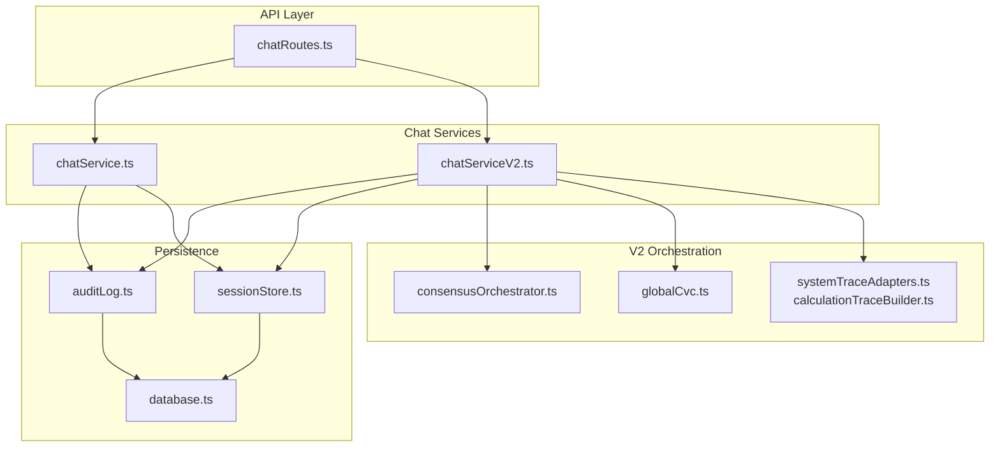
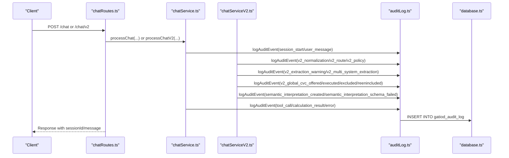
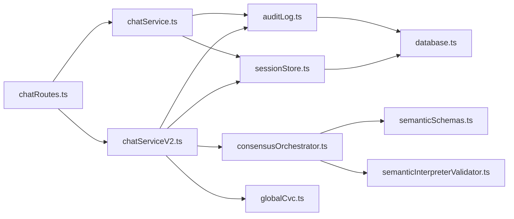

# Audit Logging and Compliance

<cite>
**Referenced Files in This Document**
- [auditLog.ts](file://src/db/auditLog.ts)
- [database.ts](file://src/db/database.ts)
- [sessionStore.ts](file://src/db/sessionStore.ts)
- [chatService.ts](file://src/chat/chatService.ts)
- [chatServiceV2.ts](file://src/chat/chatServiceV2.ts)
- [chatRoutes.ts](file://src/api/chatRoutes.ts)
- [globalCvc.ts](file://src/v2/globalCvc.ts)
- [consensusOrchestrator.ts](file://src/v2/consensusOrchestrator.ts)
- [systemTraceAdapters.ts](file://src/v2/systemTraceAdapters.ts)
- [calculationTraceBuilder.ts](file://src/v2/calculationTraceBuilder.ts)
- [semanticSchemas.ts](file://src/v2/semanticSchemas.ts)
- [semanticInterpreterValidator.ts](file://src/v2/semanticInterpreterValidator.ts)
- [gatiod_holistic_prd.md](file://docs/gatiod_holistic_prd.md)
</cite>

## Update Summary
**Changes Made**
- Enhanced consensus orchestrator audit payload with expanded buildInterpreterAuditEvent functionality
- Added comprehensive candidate systems data, candidate findings details, unsupported terms, and assumptions arrays
- Implemented privacy-preserving design with SHA-256 hashing for source text protection
- Updated audit event taxonomy to include structured interpretation snapshots
- Expanded compliance reporting capabilities with detailed semantic interpretation data

## Table of Contents
1. [Introduction](#introduction)
2. [Project Structure](#project-structure)
3. [Core Components](#core-components)
4. [Architecture Overview](#architecture-overview)
5. [Detailed Component Analysis](#detailed-component-analysis)
6. [Dependency Analysis](#dependency-analysis)
7. [Performance Considerations](#performance-considerations)
8. [Troubleshooting Guide](#troubleshooting-guide)
9. [Conclusion](#conclusion)
10. [Appendices](#appendices)

## Introduction
This document explains the audit logging and compliance system that ensures complete interaction traceability and medico-legal compliance for the GATIOD chat assistant. The system captures every clinically relevant event across both the legacy and V2 pipelines, enabling full reconstruction of how a final PI% was determined. It documents the event logging model, data retention characteristics, and compliance reporting capabilities, with practical examples for both newcomers and experienced developers.

**Updated** The system now includes enhanced consensus orchestrator audit payloads that capture comprehensive semantic interpretation data with privacy-preserving design, including detailed candidate systems information, candidate findings with source spans, unsupported terms, and assumptions arrays.

## Project Structure
The audit and compliance system spans several layers:
- Database layer with schema initialization and indexes
- Audit logger with a comprehensive event taxonomy
- Session store for persistent conversation state
- Chat services that emit audit events at key decision points
- API routes exposing audit trail retrieval and session management
- V2 consensus and extraction pipeline emitting granular audit events
- Global CVC orchestration with explicit audit events for offers and changes
- Calculation trace builders that generate deterministic, auditable traces
- Enhanced semantic interpretation audit events with structured payloads

**Diagram sources**
- [chatRoutes.ts:1-91](file://src/api/chatRoutes.ts#L1-L91)
- [chatService.ts:1-183](file://src/chat/chatService.ts#L1-L183)
- [chatServiceV2.ts:1-800](file://src/chat/chatServiceV2.ts#L1-L800)
- [auditLog.ts:1-91](file://src/db/auditLog.ts#L1-L91)
- [database.ts:1-57](file://src/db/database.ts#L1-L57)
- [sessionStore.ts:1-110](file://src/db/sessionStore.ts#L1-L110)
- [consensusOrchestrator.ts:1-200](file://src/v2/consensusOrchestrator.ts#L1-L200)
- [globalCvc.ts:1-361](file://src/v2/globalCvc.ts#L1-L361)
- [systemTraceAdapters.ts:309-555](file://src/v2/systemTraceAdapters.ts#L309-L555)
- [calculationTraceBuilder.ts:54-149](file://src/v2/calculationTraceBuilder.ts#L54-L149)

**Section sources**
- [chatRoutes.ts:1-91](file://src/api/chatRoutes.ts#L1-L91)
- [chatService.ts:1-183](file://src/chat/chatService.ts#L1-L183)
- [chatServiceV2.ts:1-800](file://src/chat/chatServiceV2.ts#L1-L800)
- [auditLog.ts:1-91](file://src/db/auditLog.ts#L1-L91)
- [database.ts:1-57](file://src/db/database.ts#L1-L57)
- [sessionStore.ts:1-110](file://src/db/sessionStore.ts#L1-L110)
- [consensusOrchestrator.ts:1-200](file://src/v2/consensusOrchestrator.ts#L1-L200)
- [globalCvc.ts:1-361](file://src/v2/globalCvc.ts#L1-L361)
- [systemTraceAdapters.ts:309-555](file://src/v2/systemTraceAdapters.ts#L309-L555)
- [calculationTraceBuilder.ts:54-149](file://src/v2/calculationTraceBuilder.ts#L54-L149)

## Core Components
- Audit logger: Defines the event taxonomy and persists entries with non-blocking writes.
- Database layer: Initializes tables and indexes, supports SQLite with WAL mode and JSON columns.
- Session store: Persists conversation history and system states, enabling resumable sessions.
- Chat services: Emit audit events for user interactions, tool calls, confirmations, and errors.
- V2 pipeline: Emits detailed events for normalization, routing, policy decisions, extractions, and consensus.
- Global CVC: Emits explicit events for offers, executions, exclusions, and staleness.
- Calculation traces: Produce deterministic, auditable calculation traces for each system.
- Enhanced consensus orchestrator: Captures comprehensive semantic interpretation data with privacy-preserving design.

**Section sources**
- [auditLog.ts:8-91](file://src/db/auditLog.ts#L8-L91)
- [database.ts:20-49](file://src/db/database.ts#L20-L49)
- [sessionStore.ts:10-109](file://src/db/sessionStore.ts#L10-L109)
- [chatService.ts:55-154](file://src/chat/chatService.ts#L55-L154)
- [chatServiceV2.ts:278-730](file://src/chat/chatServiceV2.ts#L278-L730)
- [globalCvc.ts:45-109](file://src/v2/globalCvc.ts#L45-L109)
- [systemTraceAdapters.ts:523-555](file://src/v2/systemTraceAdapters.ts#L523-L555)
- [consensusOrchestrator.ts:371-420](file://src/v2/consensusOrchestrator.ts#L371-L420)

## Architecture Overview
The audit and compliance architecture ensures that every decision and calculation is traceable:
- Events are logged immediately around critical actions (user input, tool execution, confirmation, policy decisions).
- The audit log is stored alongside session state for full replayability.
- V2 introduces granular events for semantic interpretation, extraction warnings, and multi-system extractions.
- Global CVC events explicitly track offers, exclusions, and staleness to prevent silent changes.
- Calculation traces are built deterministically and can be attached to audit records for full transparency.
- Enhanced consensus orchestrator captures comprehensive semantic interpretation data with privacy-preserving design.

**Diagram sources**
- [chatRoutes.ts:14-66](file://src/api/chatRoutes.ts#L14-L66)
- [chatService.ts:55-154](file://src/chat/chatService.ts#L55-L154)
- [chatServiceV2.ts:278-730](file://src/chat/chatServiceV2.ts#L278-L730)
- [auditLog.ts:58-90](file://src/db/auditLog.ts#L58-L90)
- [database.ts:35-45](file://src/db/database.ts#L35-L45)

## Detailed Component Analysis

### Audit Logger and Event Taxonomy
The audit logger defines a comprehensive event taxonomy covering:
- Session lifecycle: session_start, session_reset
- User interactions: user_message, assistant_message, error
- Tooling: tool_call, calculation_result
- V2 normalization and routing: v2_normalization, v2_route
- Policy decisions: v2_policy
- Extraction and confirmations: v2_extraction_warning, v2_multi_system_extraction, v2_pending_observation
- Consensus and semantic interpretation: v2_semantic_consensus_gate, semantic_interpretation_created, semantic_interpretation_accepted, semantic_interpretation_rejected, semantic_interpretation_edited, semantic_interpretation_schema_failed
- Legacy fallback and deferred components: semantic_legacy_deferred_component, semantic_legacy_fallback_requested
- Global CVC: v2_global_cvc_offered, v2_global_cvc_executed, v2_global_cvc_component_excluded, v2_global_cvc_component_reincluded, v2_global_cvc_stale, v2_global_cvc_declined
- Specialized events: semantic_to_structured_extraction_started, semantic_to_structured_extraction_failed, semantic_multi_region_spine_detected, v2_component_skipped_by_user, spine_multi_region_unsupported

**Updated** The semantic_interpretation_created event now includes comprehensive structured data including candidate systems, candidate findings, unsupported terms, and assumptions arrays, all protected by SHA-256 hashing for privacy.

Implementation highlights:
- Non-blocking writes: failures are logged and do not crash the main flow.
- Centralized insertion and retrieval: consistent schema and indexing for fast queries.
- Privacy-preserving design: source text plaintext is hashed and not included in audit payloads.
- Comprehensive semantic interpretation capture: full structured data for replay and shadow grading.

Practical examples:
- A user message triggers a user_message event with message metadata.
- A tool call emits tool_call with success status; successful assessments emit calculation_result with tool result data.
- V2 normalization emits v2_normalization with confidence and unresolved terms.
- Multi-system extractions emit v2_multi_system_extraction with systems and route confidence.
- Global CVC offer emits v2_global_cvc_offered with component systems and values.
- Semantic interpretation creation emits semantic_interpretation_created with full structured data and source text hash.

**Section sources**
- [auditLog.ts:8-91](file://src/db/auditLog.ts#L8-L91)
- [auditLog.ts:58-90](file://src/db/auditLog.ts#L58-L90)

### Database Schema and Indexing
The database layer initializes:
- gatiod_sessions table for conversation state and system states
- gatiod_audit_log table for audit events with indexes on session_id, event_type, and created_at

Key schema characteristics:
- JSON columns for flexible event payloads
- WAL mode for improved concurrency
- Indexes optimized for audit trail retrieval and session queries

Operational implications:
- Efficient audit trail retrieval by sessionId
- Fast filtering by event_type for compliance reporting
- Timestamp-based ordering for chronological reconstruction

**Section sources**
- [database.ts:20-49](file://src/db/database.ts#L20-L49)

### Session Store and State Persistence
The session store persists:
- Conversation history (structured content)
- System states for V2
- User and claim identifiers
- Status tracking (active/completed/abandoned)

Behavior:
- Upserts on save with updated_at timestamps
- Loads and deserializes JSON for history and system states
- Supports listing recent sessions for a user

Integration with audit:
- Session events (session_start, session_reset) are logged alongside state changes
- Audit trails can be correlated with session lifecycle

**Section sources**
- [sessionStore.ts:21-109](file://src/db/sessionStore.ts#L21-L109)

### Chat Service (Legacy Pipeline) Audit Events
The legacy chat service emits:
- session_start on first message of a session
- user_message for each incoming message
- assistant_message with tool call and chip counts
- tool_call for each function call with success status
- calculation_result for successful assess_* tool calls
- error for API failures
- session_reset on explicit reset

These events enable:
- End-to-end traceability from user input to tool execution
- Error attribution and recovery validation
- Deterministic calculation verification

**Section sources**
- [chatService.ts:55-154](file://src/chat/chatService.ts#L55-L154)

### Chat Service V2 Audit Events
The V2 pipeline emits granular events:
- v2_normalization with confidence and unresolved terms
- v2_pending_observation for pending observation resolution
- v2_route with operation, systems, confidence, and reasons
- v2_extraction_warning for extractor warnings
- v2_multi_system_extraction for multi-system extraction
- v2_policy with action, reason, and proposed tool count
- v2_shadow_result for shadow-mode evaluations
- v2_component_skipped_by_user for user-initiated skips
- semantic_* events for interpretation lifecycle
- Global CVC events: v2_global_cvc_offered, v2_global_cvc_executed, v2_global_cvc_component_excluded, v2_global_cvc_component_reincluded, v2_global_cvc_stale, v2_global_cvc_declined

**Updated** The semantic_interpretation_created event now includes comprehensive structured data including candidate systems with confidence scores, statuses, evidence, and rationale; candidate findings with source spans, finding types, proposed mappings, and missing fields; unsupported terms and assumptions arrays; and interpretation creation timestamps.

These events support:
- Medico-legal traceability of semantic interpretation and deterministic extraction
- Compliance validation of multi-system assessments
- Transparent Global CVC offers and exclusions
- Replay and shadow grading capabilities through structured interpretation snapshots

**Section sources**
- [chatServiceV2.ts:278-730](file://src/chat/chatServiceV2.ts#L278-L730)

### Consensus Orchestrator Audit Events
The consensus orchestrator emits:
- v2_semantic_consensus_gate for gate decisions
- semantic_interpretation_created, semantic_interpretation_accepted, semantic_interpretation_rejected, semantic_interpretation_edited
- v2_semantic_router_comparison for comparison events
- **Updated** semantic_interpretation_schema_failed for validation failures

**Enhanced** The buildInterpreterAuditEvent function now creates comprehensive audit payloads that include:
- Full candidate systems data with confidence scores, statuses, evidence, and rationale
- Complete candidate findings with source spans, finding types, proposed mappings, and missing fields
- Unsupported terms and assumptions arrays
- Interpretation creation timestamp
- Source text hash for privacy-preserving verification
- Candidate finding count for quick validation

These events capture:
- The semantic proposal lifecycle with comprehensive structured data
- Doctor's acceptance or rejection of interpretations
- Routing comparisons and decisions
- Validation failures with structured error information

**Section sources**
- [consensusOrchestrator.ts:45-82](file://src/v2/consensusOrchestrator.ts#L45-L82)
- [consensusOrchestrator.ts:179-200](file://src/v2/consensusOrchestrator.ts#L179-L200)
- [consensusOrchestrator.ts:371-420](file://src/v2/consensusOrchestrator.ts#L371-L420)

### Enhanced Semantic Interpretation Audit Payload
The buildInterpreterAuditEvent function creates comprehensive audit payloads with privacy-preserving design:

**Privacy-Preserving Design:**
- Source text plaintext is hashed using SHA-256 and not included in audit payloads
- Source text hash enables downstream verification without exposing sensitive content
- Interpretation ID serves as join key for retrieving original source text from session storage

**Comprehensive Data Capture:**
- candidateSystems: Full system records with system keys, confidence scores (0-1), statuses, evidence arrays, and rationale explanations
- candidateFindings: Complete finding records with system assignments, source spans, finding types, proposed mappings, confidence scores, completeness indicators, and missing field lists
- unsupportedTerms: Array of terms not supported by the model
- assumptions: Array of interpretive assumptions made during processing
- candidateFindingCount: Quick count for validation and reporting
- interpretationCreatedAt: Timestamp of interpretation creation

**Structured Validation:**
- JSON.stringify serialization for audit log persistence
- Round-trip validation ensuring payload integrity
- SHA-256 hash verification for data integrity

**Section sources**
- [consensusOrchestrator.ts:371-420](file://src/v2/consensusOrchestrator.ts#L371-L420)
- [semanticSchemas.ts:69-107](file://src/v2/semanticSchemas.ts#L69-L107)
- [semanticInterpreterValidator.ts:157-210](file://src/v2/semanticInterpreterValidator.ts#L157-L210)

### Global CVC Audit Events
Global CVC emits:
- v2_global_cvc_offered with component systems and values
- v2_global_cvc_executed with final result and trace
- v2_global_cvc_component_excluded with reason and previous snapshot
- v2_global_cvc_component_reincluded with previous snapshot
- v2_global_cvc_stale when eligibility changes
- v2_global_cvc_declined when the doctor declines

These events ensure:
- Explicit audit trail for Global CVC decisions
- Stale detection and re-offering guarantees
- Transparent exclusion and re-inclusion logic

**Section sources**
- [globalCvc.ts:45-109](file://src/v2/globalCvc.ts#L45-L109)
- [globalCvc.ts:298-360](file://src/v2/globalCvc.ts#L298-L360)
- [gatiod_holistic_prd.md:902-912](file://docs/gatiod_holistic_prd.md#L902-L912)

### Calculation Traces and Deterministic Evidence
Calculation traces:
- Build deterministic, auditable traces per system
- Split inputs into included and excluded with reasons
- Apply caps and produce final values
- Include step-by-step reasoning and rule notes

Integration with audit:
- Traces can be attached to audit records for full calculation transparency
- System-specific adapters produce structured trace data

**Section sources**
- [systemTraceAdapters.ts:523-555](file://src/v2/systemTraceAdapters.ts#L523-L555)
- [calculationTraceBuilder.ts:54-149](file://src/v2/calculationTraceBuilder.ts#L54-L149)

### API Exposure for Audit and Compliance
The API exposes:
- GET /chat/audit/:sessionId to retrieve the full audit trail for a session
- GET /chat/sessions/:userId to list recent sessions for resumption
- POST /chat/reset to clear a session and emit session_reset

These endpoints support:
- Compliance reporting and external audit queries
- Session resumption and continuity
- Clean reset for sensitive sessions

**Section sources**
- [chatRoutes.ts:76-90](file://src/api/chatRoutes.ts#L76-L90)

## Dependency Analysis
The audit and compliance system exhibits strong cohesion within the persistence and logging layers, with clear separation of concerns:
- chatService.ts depends on auditLog.ts and sessionStore.ts
- chatServiceV2.ts depends on auditLog.ts, sessionStore.ts, consensusOrchestrator.ts, and globalCvc.ts
- auditLog.ts depends on database.ts
- sessionStore.ts depends on database.ts
- API routes depend on chat services and audit log
- **Updated** consensusOrchestrator.ts depends on semanticSchemas.ts and semanticInterpreterValidator.ts for structured payload validation

**Diagram sources**
- [chatService.ts:16-17](file://src/chat/chatService.ts#L16-L17)
- [chatServiceV2.ts:1-6](file://src/chat/chatServiceV2.ts#L1-L6)
- [auditLog.ts:6](file://src/db/auditLog.ts#L6)
- [sessionStore.ts:8](file://src/db/sessionStore.ts#L8)
- [chatRoutes.ts:7-10](file://src/api/chatRoutes.ts#L7-L10)
- [consensusOrchestrator.ts:22-43](file://src/v2/consensusOrchestrator.ts#L22-L43)

**Section sources**
- [chatService.ts:16-17](file://src/chat/chatService.ts#L16-L17)
- [chatServiceV2.ts:1-6](file://src/chat/chatServiceV2.ts#L1-L6)
- [auditLog.ts:6](file://src/db/auditLog.ts#L6)
- [sessionStore.ts:8](file://src/db/sessionStore.ts#L8)
- [chatRoutes.ts:7-10](file://src/api/chatRoutes.ts#L7-L10)
- [consensusOrchestrator.ts:22-43](file://src/v2/consensusOrchestrator.ts#L22-L43)

## Performance Considerations
- Non-blocking audit writes: audit logging failures do not impact main flow latency.
- SQLite WAL mode: improves concurrent reads/writes for audit and session queries.
- Indexed audit columns: efficient filtering and sorting for compliance reports.
- JSON column usage: flexible payloads without schema churn.
- Shadow-mode evaluation: v2 shadow mode runs alongside production without affecting latency.
- **Updated** SHA-256 hashing overhead: minimal performance impact for privacy protection.
- **Updated** Structured payload serialization: optimized JSON.stringify for audit log persistence.

## Troubleshooting Guide
Common issues and resolutions:
- Audit event not recorded: verify non-blocking write behavior and check console for "[Audit] Failed to log event".
- Missing audit trail: ensure sessionId is preserved and passed to getSessionAuditTrail.
- Session reset confusion: confirm session_reset event is emitted and session status updated to abandoned.
- V2 extraction warnings: review v2_extraction_warning payloads for actionable remediation.
- Global CVC staleness: verify snapshot verification and re-offer logic.
- **Updated** Semantic interpretation audit failures: check semantic_interpretation_schema_failed events for validation issues.
- **Updated** Privacy violations: ensure source text is not appearing in audit payloads (only hashes should be present).
- **Updated** Structured payload corruption: verify JSON.stringify round-trip integrity for audit log persistence.

**Section sources**
- [auditLog.ts:69-72](file://src/db/auditLog.ts#L69-L72)
- [chatService.ts:179-182](file://src/chat/chatService.ts#L179-L182)
- [chatServiceV2.ts:590-611](file://src/chat/chatServiceV2.ts#L590-L611)
- [globalCvc.ts:126-158](file://src/v2/globalCvc.ts#L126-L158)
- [consensusOrchestrator.ts:407-420](file://src/v2/consensusOrchestrator.ts#L407-L420)

## Conclusion
The audit logging and compliance system provides complete, deterministic traceability for every PI% calculation. By capturing events across both legacy and V2 pipelines, maintaining persistent sessions, and emitting granular audit events for semantic interpretation, extraction, and Global CVC decisions, the system meets medico-legal requirements while enabling robust compliance reporting and validation.

**Updated** The enhanced consensus orchestrator audit payload with comprehensive semantic interpretation data and privacy-preserving design ensures complete traceability while protecting sensitive patient information, enabling replay and shadow grading capabilities for regulatory compliance and quality assurance.

## Appendices

### Compliance Reporting Workflow
- Retrieve audit trail by sessionId using GET /chat/audit/:sessionId.
- Filter events by type for policy decisions, confirmations, and tool executions.
- Cross-reference with session history for contextual reconstruction.
- Export traces and calculation details for regulatory submissions.
- **Updated** Analyze semantic_interpretation_created events for comprehensive compliance validation.

**Section sources**
- [chatRoutes.ts:76-81](file://src/api/chatRoutes.ts#L76-L81)
- [auditLog.ts:75-90](file://src/db/auditLog.ts#L75-L90)

### Practical Examples
- Audit event capture: user_message, tool_call, calculation_result, v2_normalization, v2_extraction_warning, v2_global_cvc_offered, **Updated** semantic_interpretation_created with comprehensive structured data.
- Trail generation: chronological retrieval ordered by created_at for full replay.
- Compliance validation: verify that every PI% has a corresponding calculation_result and confirmation events; ensure Global CVC exclusions are audited with component_excluded/reenincluded events.
- **Updated** Semantic interpretation validation: ensure semantic_interpretation_created events contain full candidate systems, findings, unsupported terms, and assumptions arrays with proper SHA-256 hashing.

**Section sources**
- [chatService.ts:55-154](file://src/chat/chatService.ts#L55-L154)
- [chatServiceV2.ts:278-730](file://src/chat/chatServiceV2.ts#L278-L730)
- [globalCvc.ts:298-360](file://src/v2/globalCvc.ts#L298-L360)
- [consensusOrchestrator.ts:371-420](file://src/v2/consensusOrchestrator.ts#L371-L420)

### Privacy-Preserving Audit Data Model
The enhanced audit system implements privacy-preserving design patterns:
- Source text plaintext is never stored in audit logs
- SHA-256 hashes are used for verification and correlation
- Interpretation IDs serve as join keys for retrieving original content
- Structured payloads contain only necessary clinical data for compliance
- JSON serialization ensures audit log persistence integrity

**Section sources**
- [consensusOrchestrator.ts:371-420](file://src/v2/consensusOrchestrator.ts#L371-L420)
- [semanticSchemas.ts:95-107](file://src/v2/semanticSchemas.ts#L95-L107)