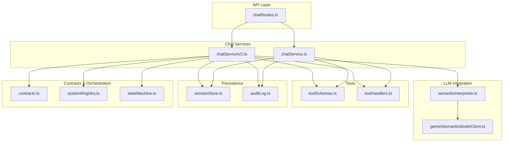
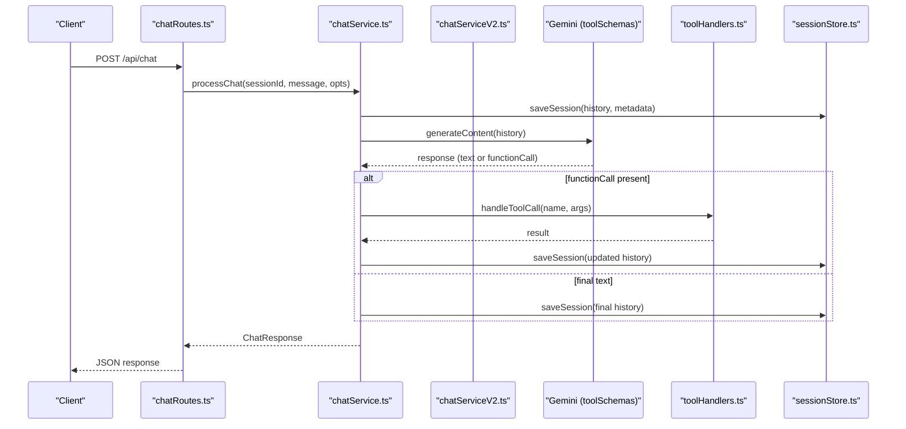
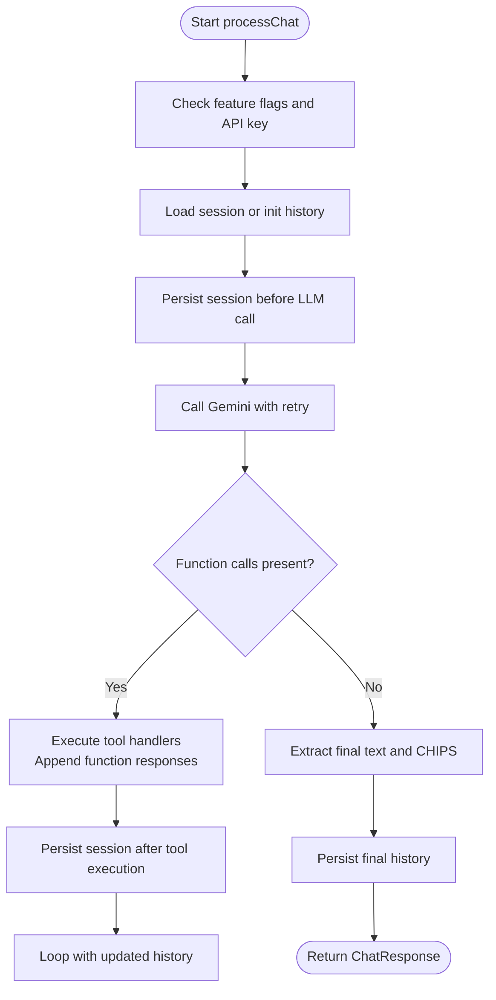
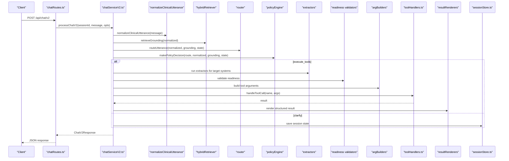
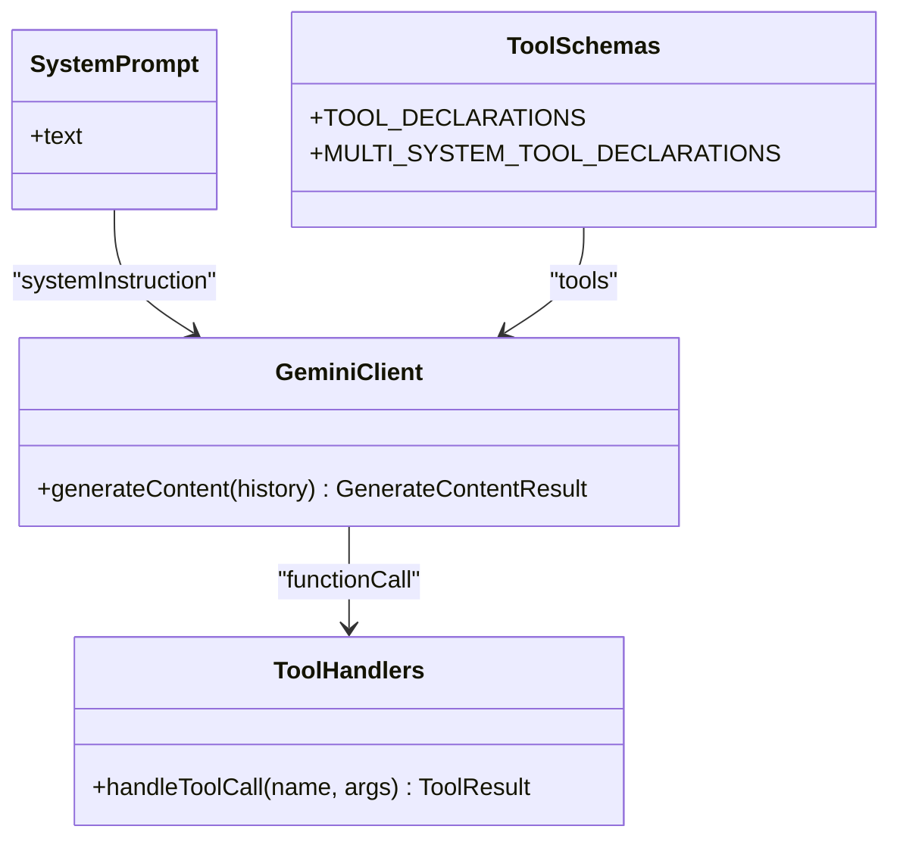
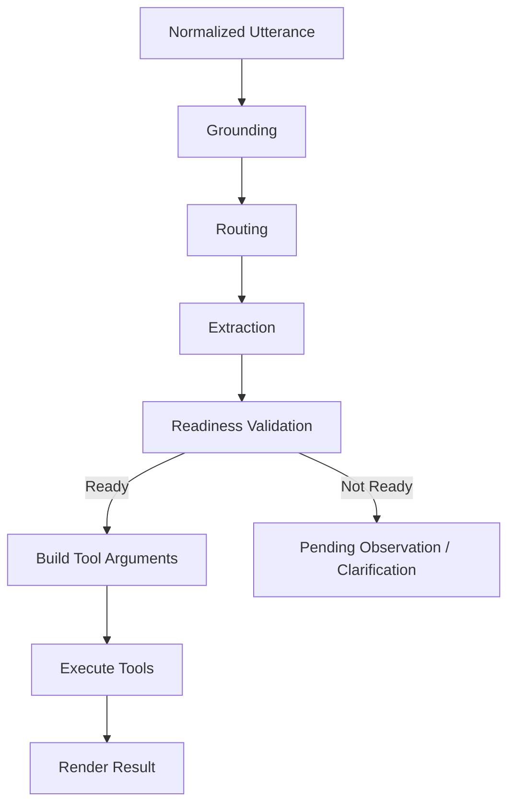
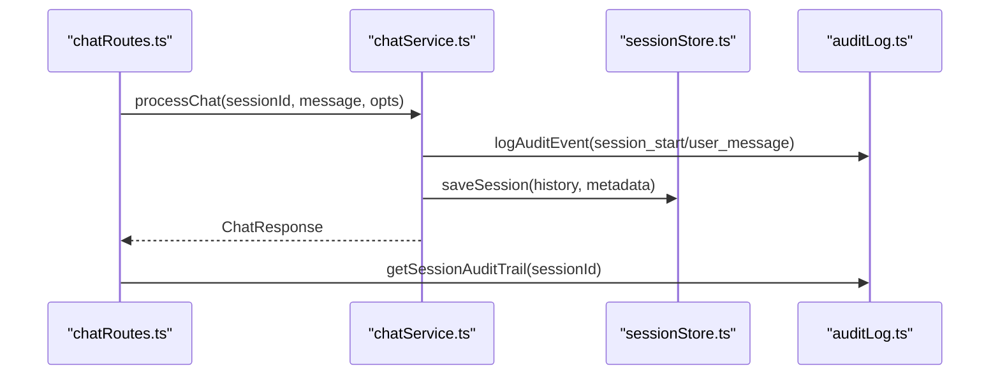
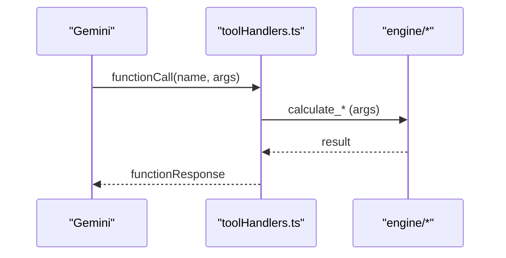
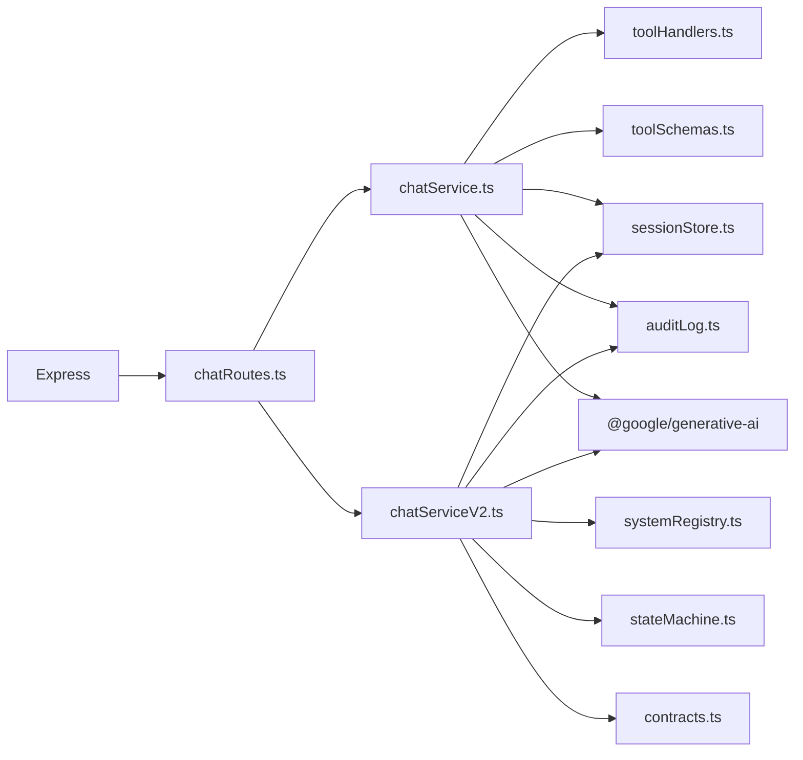

# Chat Service and LLM Integration

<cite>
**Referenced Files in This Document**
- [chatService.ts](file://src/chat/chatService.ts)
- [chatServiceV2.ts](file://src/chat/chatServiceV2.ts)
- [chatRoutes.ts](file://src/api/chatRoutes.ts)
- [systemPrompt.ts](file://src/chat/systemPrompt.ts)
- [toolSchemas.ts](file://src/tools/toolSchemas.ts)
- [toolHandlers.ts](file://src/tools/toolHandlers.ts)
- [sessionStore.ts](file://src/db/sessionStore.ts)
- [auditLog.ts](file://src/db/auditLog.ts)
- [geminiSemanticModelClient.ts](file://src/v2/geminiSemanticModelClient.ts)
- [semanticInterpreter.ts](file://src/v2/semanticInterpreter.ts)
- [contracts.ts](file://src/v2/contracts.ts)
- [systemRegistry.ts](file://src/v2/systemRegistry.ts)
- [stateMachine.ts](file://src/v2/stateMachine.ts)
- [server.ts](file://src/server.ts)
- [package.json](file://package.json)
</cite>

## Table of Contents
1. [Introduction](#introduction)
2. [Project Structure](#project-structure)
3. [Core Components](#core-components)
4. [Architecture Overview](#architecture-overview)
5. [Detailed Component Analysis](#detailed-component-analysis)
6. [Dependency Analysis](#dependency-analysis)
7. [Performance Considerations](#performance-considerations)
8. [Troubleshooting Guide](#troubleshooting-guide)
9. [Conclusion](#conclusion)

## Introduction
This document explains the chat service and Large Language Model (LLM) integration subsystem powering GATIOD’s clinical assessment assistant. It covers the conversational orchestration mechanism, Gemini function calling with tool invocation, natural language processing workflows, message processing, session management, and tool function execution. It also documents configuration options, error handling and retry strategies, and the relationship between chat routes and service layers. Practical examples demonstrate how clinical narratives are transformed into structured data and PI% assessments.

## Project Structure
The chat and LLM integration spans several layers:
- API layer: HTTP endpoints for chat, session management, and audit access
- Chat services: Legacy flow (V1) and modern structured-V2 flow
- LLM integration: Gemini client configuration and semantic interpretation
- Tooling: Function schemas and handlers bridging LLM calls to calculation engine
- Persistence: Session store and audit logging
- Orchestration: Routing, policy decisions, and state machine for multi-system assessment

**Diagram sources**
- [chatRoutes.ts:12-91](file://src/api/chatRoutes.ts#L12-L91)
- [chatService.ts:38-183](file://src/chat/chatService.ts#L38-L183)
- [chatServiceV2.ts:258-1041](file://src/chat/chatServiceV2.ts#L258-L1041)
- [geminiSemanticModelClient.ts:26-74](file://src/v2/geminiSemanticModelClient.ts#L26-L74)
- [semanticInterpreter.ts:145-218](file://src/v2/semanticInterpreter.ts#L145-L218)
- [toolSchemas.ts:14-487](file://src/tools/toolSchemas.ts#L14-L487)
- [toolHandlers.ts:47-102](file://src/tools/toolHandlers.ts#L47-L102)
- [sessionStore.ts:21-94](file://src/db/sessionStore.ts#L21-L94)
- [auditLog.ts:58-90](file://src/db/auditLog.ts#L58-L90)
- [contracts.ts:596-628](file://src/v2/contracts.ts#L596-L628)
- [systemRegistry.ts:84-178](file://src/v2/systemRegistry.ts#L84-L178)
- [stateMachine.ts:59-74](file://src/v2/stateMachine.ts#L59-L74)

**Section sources**
- [chatRoutes.ts:12-91](file://src/api/chatRoutes.ts#L12-L91)
- [chatService.ts:38-183](file://src/chat/chatService.ts#L38-L183)
- [chatServiceV2.ts:258-1041](file://src/chat/chatServiceV2.ts#L258-L1041)
- [geminiSemanticModelClient.ts:26-74](file://src/v2/geminiSemanticModelClient.ts#L26-L74)
- [semanticInterpreter.ts:145-218](file://src/v2/semanticInterpreter.ts#L145-L218)
- [toolSchemas.ts:14-487](file://src/tools/toolSchemas.ts#L14-L487)
- [toolHandlers.ts:47-102](file://src/tools/toolHandlers.ts#L47-L102)
- [sessionStore.ts:21-94](file://src/db/sessionStore.ts#L21-L94)
- [auditLog.ts:58-90](file://src/db/auditLog.ts#L58-L90)
- [contracts.ts:596-628](file://src/v2/contracts.ts#L596-L628)
- [systemRegistry.ts:84-178](file://src/v2/systemRegistry.ts#L84-L178)
- [stateMachine.ts:59-74](file://src/v2/stateMachine.ts#L59-L74)

## Core Components
- Legacy chat service (V1): Orchestrates Gemini with function calling, manages session history, persists state, and executes tool handlers. Implements retry logic and safety checks for rate limits and timeouts.
- Modern chat service (V2): Structured multi-system assessment with semantic interpretation, extraction, readiness validation, tool argument building, and deterministic rendering. Integrates with a state machine and system registry.
- Tool schemas and handlers: Define function signatures for LLM function calling and implement the bridge to calculation engine modules.
- Session store and audit logging: Persist chat sessions and maintain a comprehensive audit trail for medico-legal traceability.
- Gemini client and semantic interpreter: Configure Gemini for deterministic JSON output and validate/parse structured semantic interpretations.

**Section sources**
- [chatService.ts:38-183](file://src/chat/chatService.ts#L38-L183)
- [chatServiceV2.ts:258-1041](file://src/chat/chatServiceV2.ts#L258-L1041)
- [toolSchemas.ts:14-487](file://src/tools/toolSchemas.ts#L14-L487)
- [toolHandlers.ts:47-102](file://src/tools/toolHandlers.ts#L47-L102)
- [sessionStore.ts:21-94](file://src/db/sessionStore.ts#L21-L94)
- [auditLog.ts:58-90](file://src/db/auditLog.ts#L58-L90)
- [geminiSemanticModelClient.ts:26-74](file://src/v2/geminiSemanticModelClient.ts#L26-L74)
- [semanticInterpreter.ts:145-218](file://src/v2/semanticInterpreter.ts#L145-L218)

## Architecture Overview
The system integrates a dual-path architecture:
- V1 (legacy): Straightforward function-calling loop with Gemini, tool execution, and session persistence.
- V2 (structured): Adds semantic interpretation, extraction, readiness validation, and deterministic rendering. Uses a state machine to track multi-system progress and supports instance-aware assessment.

**Diagram sources**
- [chatRoutes.ts:14-41](file://src/api/chatRoutes.ts#L14-L41)
- [chatService.ts:38-154](file://src/chat/chatService.ts#L38-L154)
- [toolSchemas.ts:14-487](file://src/tools/toolSchemas.ts#L14-L487)
- [toolHandlers.ts:47-102](file://src/tools/toolHandlers.ts#L47-L102)
- [sessionStore.ts:21-44](file://src/db/sessionStore.ts#L21-L44)

**Section sources**
- [chatRoutes.ts:14-41](file://src/api/chatRoutes.ts#L14-L41)
- [chatService.ts:38-154](file://src/chat/chatService.ts#L38-L154)
- [toolSchemas.ts:14-487](file://src/tools/toolSchemas.ts#L14-L487)
- [toolHandlers.ts:47-102](file://src/tools/toolHandlers.ts#L47-L102)
- [sessionStore.ts:21-44](file://src/db/sessionStore.ts#L21-L44)

## Detailed Component Analysis

### Conversational Orchestration (V1)
- Feature gating and environment checks ensure the chat is enabled and the Gemini API key is present.
- Session lifecycle: load or initialize history, persist before LLM calls, and update after tool execution.
- Loop-based orchestration: submit history to Gemini, handle function calls, execute tool handlers, and append results back to history until completion or safety/loop limits.
- Safety and resilience: extracts CHIPS suggestions, logs audit events, and converts specific errors into user-friendly messages for rate limits and timeouts.

**Diagram sources**
- [chatService.ts:38-154](file://src/chat/chatService.ts#L38-L154)
- [auditLog.ts:58-90](file://src/db/auditLog.ts#L58-L90)
- [sessionStore.ts:21-44](file://src/db/sessionStore.ts#L21-L44)

**Section sources**
- [chatService.ts:38-154](file://src/chat/chatService.ts#L38-L154)
- [auditLog.ts:58-90](file://src/db/auditLog.ts#L58-L90)
- [sessionStore.ts:21-44](file://src/db/sessionStore.ts#L21-L44)

### Conversational Orchestration (V2)
- Normalization and grounding: Normalize clinical utterances and retrieve grounding from knowledge sources.
- Semantic consensus (optional): Optionally interpret the user’s intent and findings using a semantic interpreter and Gemini client.
- Routing and policy: Determine operation (lookup, assessment, global CVC, clarify) and propose tools based on readiness and extracted facts.
- Multi-system extraction: Extract structured facts for multiple systems in a single turn and maintain pending observations.
- Deterministic rendering: Render structured results for systems with structured_live capability; otherwise delegate to legacy.
- Global CVC: Offer and execute global PI% combination when multiple systems are calculated.

**Diagram sources**
- [chatServiceV2.ts:258-1041](file://src/chat/chatServiceV2.ts#L258-L1041)
- [systemRegistry.ts:84-178](file://src/v2/systemRegistry.ts#L84-L178)
- [stateMachine.ts:452-509](file://src/v2/stateMachine.ts#L452-L509)
- [contracts.ts:596-628](file://src/v2/contracts.ts#L596-L628)
- [sessionStore.ts:21-44](file://src/db/sessionStore.ts#L21-L44)

**Section sources**
- [chatServiceV2.ts:258-1041](file://src/chat/chatServiceV2.ts#L258-L1041)
- [systemRegistry.ts:84-178](file://src/v2/systemRegistry.ts#L84-L178)
- [stateMachine.ts:452-509](file://src/v2/stateMachine.ts#L452-L509)
- [contracts.ts:596-628](file://src/v2/contracts.ts#L596-L628)
- [sessionStore.ts:21-44](file://src/db/sessionStore.ts#L21-L44)

### Gemini LLM Integration with Function Calling
- System instruction: The system prompt defines the assistant’s behavior, rules, and tool usage strategy.
- Tool declarations: Function schemas enumerate all assessment and lookup tools, including multi-system tools.
- Function execution: The LLM proposes function calls; the handler validates and executes them, returning structured results consumed by downstream components.

**Diagram sources**
- [systemPrompt.ts:8-391](file://src/chat/systemPrompt.ts#L8-L391)
- [toolSchemas.ts:14-487](file://src/tools/toolSchemas.ts#L14-L487)
- [toolHandlers.ts:47-102](file://src/tools/toolHandlers.ts#L47-L102)
- [chatService.ts:67-72](file://src/chat/chatService.ts#L67-L72)

**Section sources**
- [systemPrompt.ts:8-391](file://src/chat/systemPrompt.ts#L8-L391)
- [toolSchemas.ts:14-487](file://src/tools/toolSchemas.ts#L14-L487)
- [toolHandlers.ts:47-102](file://src/tools/toolHandlers.ts#L47-L102)
- [chatService.ts:67-72](file://src/chat/chatService.ts#L67-L72)

### Natural Language Processing Workflows
- Normalization: Converts clinical text into a normalized form with mapped tokens and confidence scores.
- Grounding: Retrieves citations and ontology matches to enrich understanding.
- Routing: Determines operation and target systems with confidence and reasons.
- Extraction: Applies structured extractors to capture calculation-grade facts; maintains pending observations for missing fields.
- Readiness validation: Ensures sufficient and correct data before proposing tool execution.
- Rendering: Produces deterministic, doctor-friendly summaries with breakdowns and suggested chips.

**Diagram sources**
- [chatServiceV2.ts:541-720](file://src/chat/chatServiceV2.ts#L541-L720)
- [systemRegistry.ts:84-178](file://src/v2/systemRegistry.ts#L84-L178)
- [stateMachine.ts:452-509](file://src/v2/stateMachine.ts#L452-L509)
- [contracts.ts:596-628](file://src/v2/contracts.ts#L596-L628)

**Section sources**
- [chatServiceV2.ts:541-720](file://src/chat/chatServiceV2.ts#L541-L720)
- [systemRegistry.ts:84-178](file://src/v2/systemRegistry.ts#L84-L178)
- [stateMachine.ts:452-509](file://src/v2/stateMachine.ts#L452-L509)
- [contracts.ts:596-628](file://src/v2/contracts.ts#L596-L628)

### Message Processing and Session Management
- Message processing: Append user messages to history, persist before LLM calls, and store final assistant responses.
- Session management: Save/load sessions, track status, and support reset and listing endpoints.
- Audit logging: Comprehensive event logging for traceability, including normalization, routing, policy decisions, tool plans, and semantic consensus events.

**Diagram sources**
- [chatRoutes.ts:14-41](file://src/api/chatRoutes.ts#L14-L41)
- [chatService.ts:56-65](file://src/chat/chatService.ts#L56-L65)
- [sessionStore.ts:21-44](file://src/db/sessionStore.ts#L21-L44)
- [auditLog.ts:58-90](file://src/db/auditLog.ts#L58-L90)

**Section sources**
- [chatRoutes.ts:14-41](file://src/api/chatRoutes.ts#L14-L41)
- [chatService.ts:56-65](file://src/chat/chatService.ts#L56-L65)
- [sessionStore.ts:21-44](file://src/db/sessionStore.ts#L21-L44)
- [auditLog.ts:58-90](file://src/db/auditLog.ts#L58-L90)

### Tool Function Invocation
- Tool schemas define function names, descriptions, and parameter structures for all assessment and lookup tools.
- Tool handlers map LLM-proposed function calls to engine calculations, sanitizing outputs and aggregating system keys and final PI%.
- Execution results are recorded in the tool plan and used for rendering or global CVC combination.

**Diagram sources**
- [toolSchemas.ts:14-487](file://src/tools/toolSchemas.ts#L14-L487)
- [toolHandlers.ts:47-102](file://src/tools/toolHandlers.ts#L47-L102)

**Section sources**
- [toolSchemas.ts:14-487](file://src/tools/toolSchemas.ts#L14-L487)
- [toolHandlers.ts:47-102](file://src/tools/toolHandlers.ts#L47-L102)

### Example: Clinical Narrative to Structured Data
- Input narrative: A doctor describes findings across multiple systems (e.g., upper limb ROM, neurological deficits, lower limb amputation, spine diagnosis).
- V2 extraction: Extractors parse normalized tokens, map to structured facts, and populate pending observations for missing fields.
- Readiness validation: Confirms sufficient data for assessment; otherwise asks clarifying questions.
- Tool execution: Builds arguments and executes assessment tools; renders deterministic results with breakdowns and suggested chips.
- Output: Structured summary, PI% breakdown, and actionable next steps.

**Section sources**
- [chatServiceV2.ts:572-670](file://src/chat/chatServiceV2.ts#L572-L670)
- [systemRegistry.ts:84-178](file://src/v2/systemRegistry.ts#L84-L178)
- [stateMachine.ts:452-509](file://src/v2/stateMachine.ts#L452-L509)

## Dependency Analysis
- External dependencies: Express for HTTP, @google/generative-ai for Gemini, better-sqlite3 for persistence, uuid for session IDs, dotenv for environment variables.
- Internal dependencies: Routes depend on V1/V2 services; V1 depends on tool schemas and handlers; V2 depends on system registry, state machine, and contracts; both depend on session store and audit logging.

**Diagram sources**
- [server.ts:10-44](file://src/server.ts#L10-L44)
- [package.json:21-28](file://package.json#L21-L28)
- [chatRoutes.ts:5-11](file://src/api/chatRoutes.ts#L5-L11)
- [chatService.ts:6-18](file://src/chat/chatService.ts#L6-L18)
- [chatServiceV2.ts:1-46](file://src/chat/chatServiceV2.ts#L1-L46)
- [systemRegistry.ts:1-13](file://src/v2/systemRegistry.ts#L1-L13)
- [stateMachine.ts:1-22](file://src/v2/stateMachine.ts#L1-L22)
- [contracts.ts:1-20](file://src/v2/contracts.ts#L1-L20)
- [sessionStore.ts:7-8](file://src/db/sessionStore.ts#L7-L8)
- [auditLog.ts:6-7](file://src/db/auditLog.ts#L6-L7)

**Section sources**
- [server.ts:10-44](file://src/server.ts#L10-L44)
- [package.json:21-28](file://package.json#L21-L28)
- [chatRoutes.ts:5-11](file://src/api/chatRoutes.ts#L5-L11)
- [chatService.ts:6-18](file://src/chat/chatService.ts#L6-L18)
- [chatServiceV2.ts:1-46](file://src/chat/chatServiceV2.ts#L1-L46)
- [systemRegistry.ts:1-13](file://src/v2/systemRegistry.ts#L1-L13)
- [stateMachine.ts:1-22](file://src/v2/stateMachine.ts#L1-L22)
- [contracts.ts:1-20](file://src/v2/contracts.ts#L1-L20)
- [sessionStore.ts:7-8](file://src/db/sessionStore.ts#L7-L8)
- [auditLog.ts:6-7](file://src/db/auditLog.ts#L6-L7)

## Performance Considerations
- Retry strategy: V1 retries Gemini calls with exponential backoff; tune MAX_RETRIES and RETRY_DELAY_MS for latency and cost trade-offs.
- Deterministic JSON mode: V2 uses Gemini JSON mode with constrained output; configure temperature to 0 for reproducibility.
- Session persistence: Persist before LLM calls to minimize rework on transient failures.
- Structured extraction: Reduces ambiguity and improves throughput by capturing calculation-grade facts early.
- Rate limiting and timeouts: Surface user-friendly messages and log detailed audit events for remediation.

[No sources needed since this section provides general guidance]

## Troubleshooting Guide
- Environment configuration
  - Missing GEMINI_API_KEY: The server warns on startup; ensure the key is set for both V1 and V2 flows.
  - Feature flags: GATIOD_CHAT_ENABLED toggles chat; SEMANTIC_INTERPRETER_ENABLED and related flags control V2 semantic features.
- Common errors
  - Rate limit or quota exceeded: Converted to a user-friendly message; session is preserved.
  - Timeout or connection refused: Converted to a user-friendly message; session is preserved.
  - Unknown tool: Returned as a handler error; verify tool schema and handler registration.
- Audit logging
  - Use GET /api/chat/audit/:sessionId to inspect the full audit trail for traceability.
  - Use GET /api/chat/sessions/:userId to list recent sessions for resumption.

**Section sources**
- [server.ts:52-54](file://src/server.ts#L52-L54)
- [chatService.ts:89-96](file://src/chat/chatService.ts#L89-L96)
- [auditLog.ts:75-90](file://src/db/auditLog.ts#L75-L90)
- [chatRoutes.ts:77-90](file://src/api/chatRoutes.ts#L77-L90)

## Conclusion
The chat service and LLM integration subsystem combines a robust legacy flow (V1) with a modern structured-V2 pipeline. V1 focuses on reliable function-calling and session persistence, while V2 emphasizes semantic interpretation, structured extraction, readiness validation, and deterministic rendering. Together, they transform clinical narratives into structured data and PI% assessments, with comprehensive audit logging and resilient error handling.