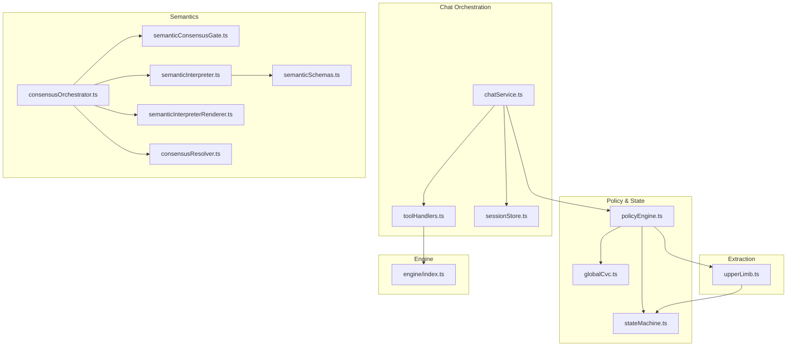
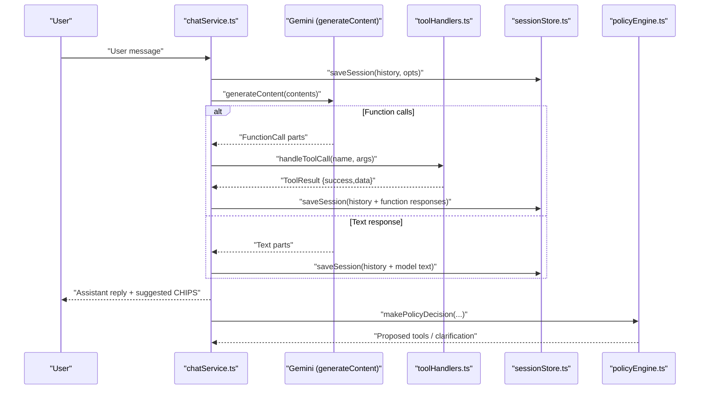
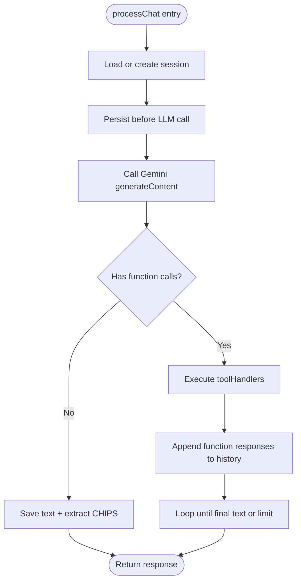
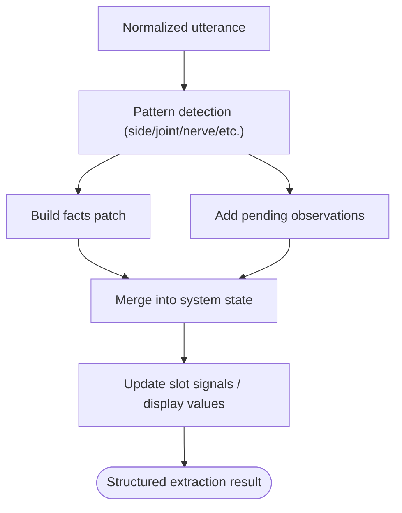
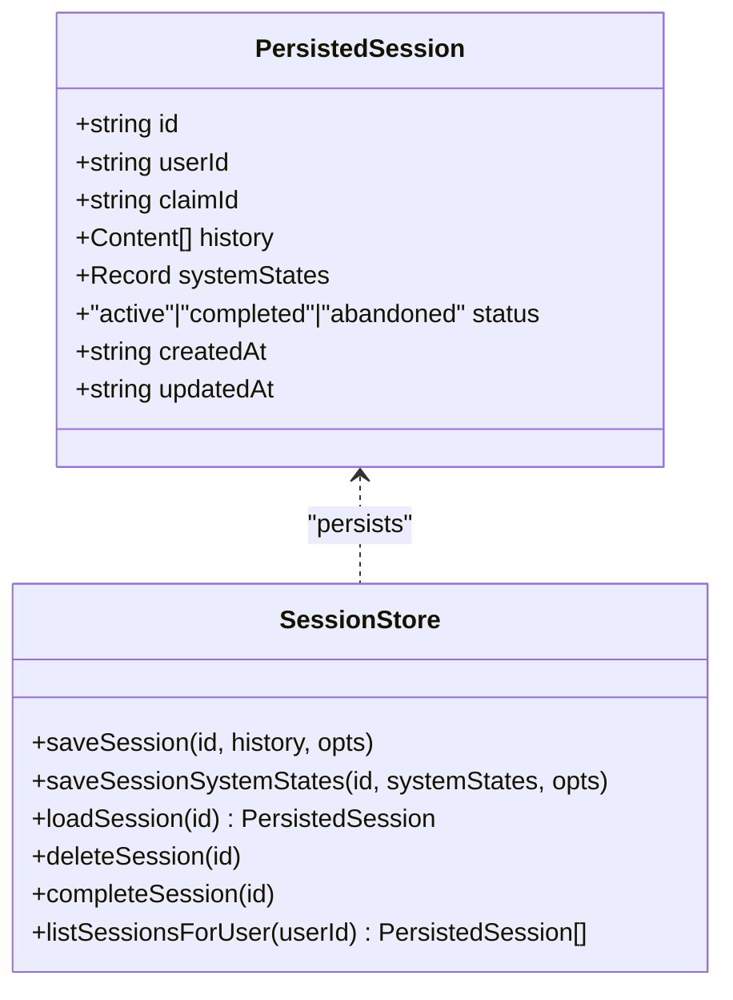
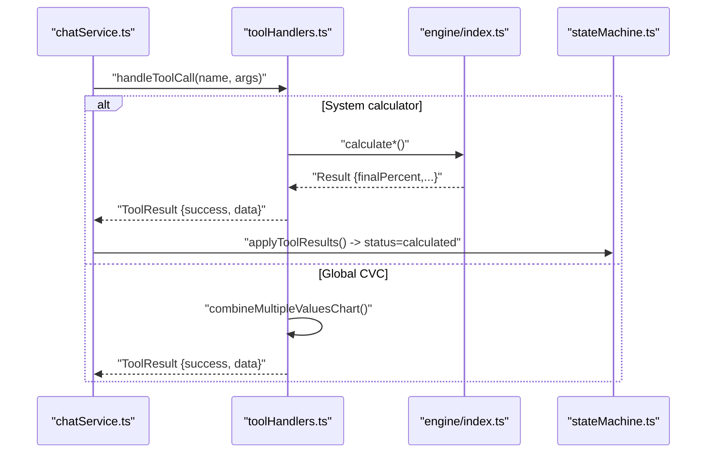
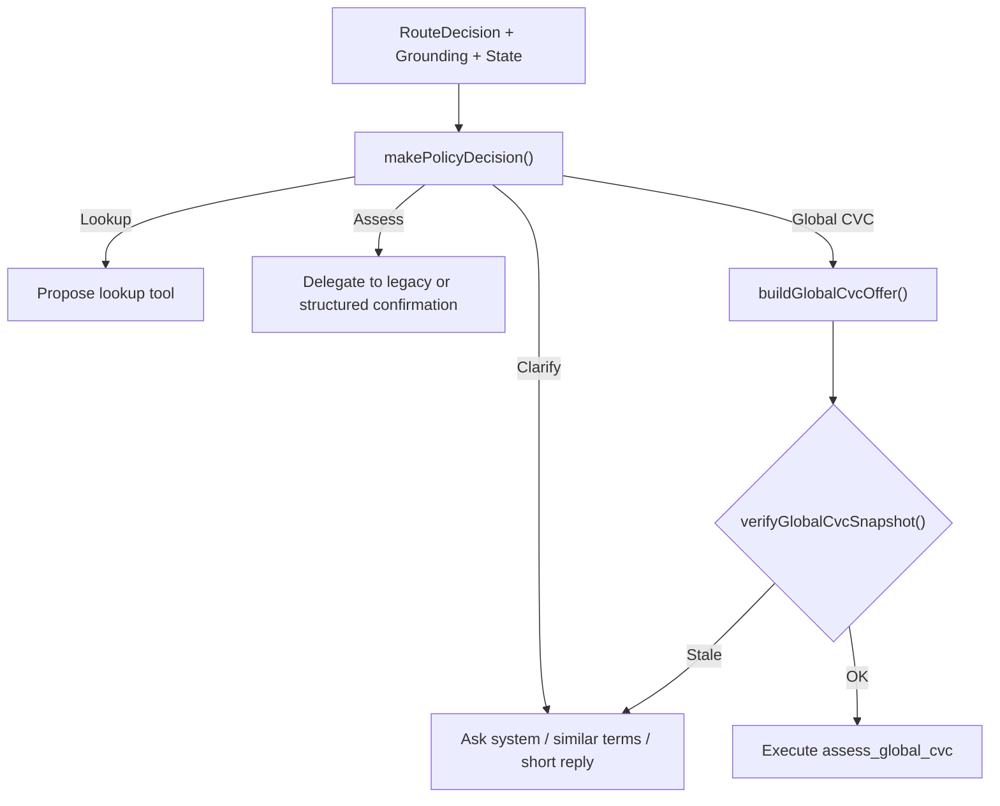
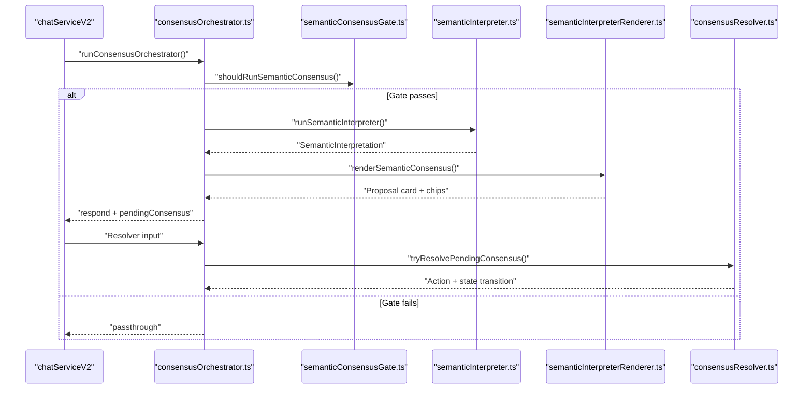
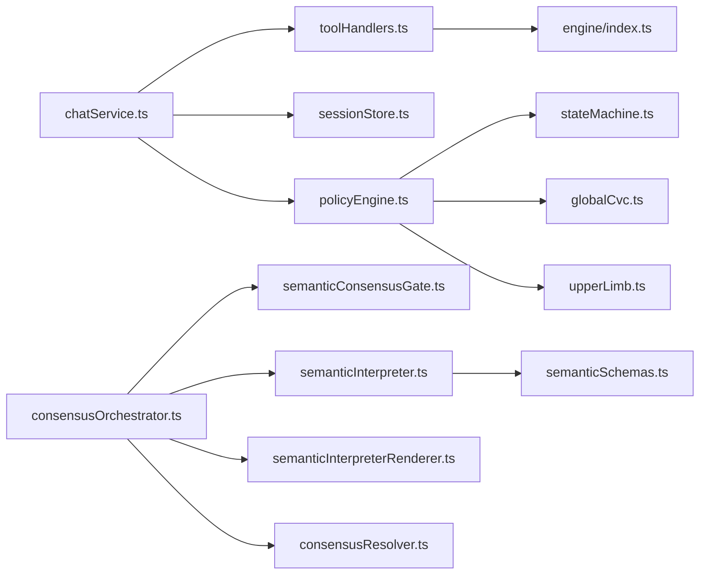

# Core Features

<cite>
**Referenced Files in This Document**
- [chatService.ts](file://src/chat/chatService.ts)
- [toolHandlers.ts](file://src/tools/toolHandlers.ts)
- [sessionStore.ts](file://src/db/sessionStore.ts)
- [policyEngine.ts](file://src/v2/policyEngine.ts)
- [consensusOrchestrator.ts](file://src/v2/consensusOrchestrator.ts)
- [stateMachine.ts](file://src/v2/stateMachine.ts)
- [globalCvc.ts](file://src/v2/globalCvc.ts)
- [engine/index.ts](file://src/engine/index.ts)
- [dialoguePolicy.ts](file://src/v2/dialoguePolicy.ts)
- [semanticInterpreter.ts](file://src/v2/semanticInterpreter.ts)
- [semanticSchemas.ts](file://src/v2/semanticSchemas.ts)
- [semanticInterpreterRenderer.ts](file://src/v2/semanticInterpreterRenderer.ts)
- [semanticConsensusGate.ts](file://src/v2/semanticConsensusGate.ts)
- [consensusResolver.ts](file://src/v2/consensusResolver.ts)
- [upperLimb.ts](file://src/v2/extractors/upperLimb.ts)
</cite>

## Table of Contents
1. [Introduction](#introduction)
2. [Project Structure](#project-structure)
3. [Core Components](#core-components)
4. [Architecture Overview](#architecture-overview)
5. [Detailed Component Analysis](#detailed-component-analysis)
6. [Dependency Analysis](#dependency-analysis)
7. [Performance Considerations](#performance-considerations)
8. [Troubleshooting Guide](#troubleshooting-guide)
9. [Conclusion](#conclusion)

## Introduction
This document explains the core features of the GATIOD Chat Assistant, focusing on how the system orchestrates conversations with a Gemini-powered LLM, extracts structured clinical data, manages sessions deterministically, and executes calculation workflows. It covers both beginner-friendly conceptual overviews and technical details for developers, including the conversational assessment flow, natural language processing, session management, tool function calling, structured data extraction using the CHIPS system, and deterministic calculation workflows.

## Project Structure
At a high level, the assistant comprises:
- A chat orchestration layer that integrates with Gemini and manages tool calls and session persistence.
- A policy engine that decides when to run structured extraction vs. legacy assessment and when to offer global CVC.
- A semantic consensus pipeline that optionally interprets dense narratives and drives deterministic resolution.
- An extraction engine that parses clinical statements into structured facts.
- A calculation engine that computes PI% per system and aggregates globally.

**Diagram sources**
- [chatService.ts:1-183](file://src/chat/chatService.ts#L1-L183)
- [toolHandlers.ts:1-435](file://src/tools/toolHandlers.ts#L1-L435)
- [sessionStore.ts:1-110](file://src/db/sessionStore.ts#L1-L110)
- [policyEngine.ts:1-564](file://src/v2/policyEngine.ts#L1-L564)
- [stateMachine.ts:1-822](file://src/v2/stateMachine.ts#L1-L822)
- [globalCvc.ts:1-361](file://src/v2/globalCvc.ts#L1-L361)
- [semanticConsensusGate.ts:1-278](file://src/v2/semanticConsensusGate.ts#L1-L278)
- [semanticInterpreter.ts:1-218](file://src/v2/semanticInterpreter.ts#L1-L218)
- [semanticInterpreterRenderer.ts:1-145](file://src/v2/semanticInterpreterRenderer.ts#L1-L145)
- [semanticSchemas.ts:1-125](file://src/v2/semanticSchemas.ts#L1-L125)
- [consensusResolver.ts:1-445](file://src/v2/consensusResolver.ts#L1-L445)
- [consensusOrchestrator.ts:1-422](file://src/v2/consensusOrchestrator.ts#L1-L422)
- [upperLimb.ts:1-592](file://src/v2/extractors/upperLimb.ts#L1-L592)
- [engine/index.ts:1-89](file://src/engine/index.ts#L1-L89)

**Section sources**
- [chatService.ts:1-183](file://src/chat/chatService.ts#L1-L183)
- [policyEngine.ts:1-564](file://src/v2/policyEngine.ts#L1-L564)
- [stateMachine.ts:1-822](file://src/v2/stateMachine.ts#L1-L822)
- [engine/index.ts:1-89](file://src/engine/index.ts#L1-L89)

## Core Components
- Conversational assessment with Gemini: Orchestrated chat that persists sessions, retries on transient errors, and supports function calling to calculation tools and lookups.
- Natural language processing: Structured extraction from clinical statements into standardized facts, with optional semantic interpretation for dense narratives.
- Session management: Database-backed sessions with structured state, allowing resumption across restarts and multi-turn continuity.
- Tool function calling: A unified handler dispatches to system-specific calculators and lookup utilities, returning structured results with deterministic PI% aggregation.
- Structured data extraction (CHIPS): Extraction patterns capture ROM, nerve deficits, amputations, and DBE conditions, producing normalized facts and pending observations.
- Deterministic calculation workflows: Policy decisions route to structured live systems or legacy flows, with readiness checks and confirmation protocols before tool execution.

**Section sources**
- [chatService.ts:38-154](file://src/chat/chatService.ts#L38-L154)
- [toolHandlers.ts:47-102](file://src/tools/toolHandlers.ts#L47-L102)
- [sessionStore.ts:21-84](file://src/db/sessionStore.ts#L21-L84)
- [policyEngine.ts:93-563](file://src/v2/policyEngine.ts#L93-L563)
- [upperLimb.ts:191-592](file://src/v2/extractors/upperLimb.ts#L191-L592)
- [stateMachine.ts:320-354](file://src/v2/stateMachine.ts#L320-L354)

## Architecture Overview
The assistant integrates conversational orchestration with structured reasoning and deterministic calculations. The flow begins with a user message, which is persisted and sent to Gemini. Gemini may respond with text or function calls. Function calls are dispatched to handlers that invoke the calculation engine or lookup utilities. Results are stored in session state and may trigger structured confirmations or global CVC offers.

**Diagram sources**
- [chatService.ts:38-154](file://src/chat/chatService.ts#L38-L154)
- [toolHandlers.ts:47-102](file://src/tools/toolHandlers.ts#L47-L102)
- [sessionStore.ts:21-44](file://src/db/sessionStore.ts#L21-L44)
- [policyEngine.ts:93-563](file://src/v2/policyEngine.ts#L93-L563)

## Detailed Component Analysis

### Conversational Assessment with Gemini
- Chat orchestration:
  - Loads or creates a session, appends user messages, persists before calling Gemini to ensure resilience.
  - Calls Gemini with retry logic and handles safety flags, timeouts, and quota errors.
  - Extracts CHIPS hints from assistant responses and logs audit events.
- Function calling:
  - Interprets model responses containing function calls, executes tool handlers, and appends function responses back to history.
  - Tracks tool call outcomes and logs calculation results for audit.

**Diagram sources**
- [chatService.ts:38-154](file://src/chat/chatService.ts#L38-L154)

**Section sources**
- [chatService.ts:38-154](file://src/chat/chatService.ts#L38-L154)

### Natural Language Processing and Structured Extraction (CHIPS)
- Extraction patterns:
  - Capture side, ROM with directions and angles, ankylosis, nerve deficits, amputations, and DBE conditions.
  - Auto-populate DBE selections from high-confidence ontology matches.
  - Raise pending observations for missing fields and guide confirmation.
- Rendering and display:
  - Extracted facts and display values are merged into system state, with ROM joints accumulating across turns.
- Example patterns:
  - Joint + direction + angle, ankylosis indicators, nerve deficit type and severity, amputation levels, DBE condition selection.

**Diagram sources**
- [upperLimb.ts:191-592](file://src/v2/extractors/upperLimb.ts#L191-L592)

**Section sources**
- [upperLimb.ts:191-592](file://src/v2/extractors/upperLimb.ts#L191-L592)

### Session Management
- Database-backed persistence:
  - Stores history, system states, and metadata; supports updates, listing, completion, and abandonment.
  - JSON serialization of complex fields ensures portability and schema evolution.
- Session lifecycle:
  - Creation on first message, updates on each turn, completion after finalization, and reset when requested.

**Diagram sources**
- [sessionStore.ts:10-110](file://src/db/sessionStore.ts#L10-L110)

**Section sources**
- [sessionStore.ts:21-84](file://src/db/sessionStore.ts#L21-L84)

### Tool Function Calling and Deterministic Workflows
- Tool dispatch:
  - Routes to system calculators (upper/lower limb, spine, respiratory, renal, gastro, hearing, CNS, visual) and global CVC.
  - Wraps results to attach system key and final PI%.
- Readiness and confirmation:
  - Structured live systems use readiness validators and structured confirmations before tool execution.
  - Legacy systems use slot-based confirmation protocols.

**Diagram sources**
- [toolHandlers.ts:47-102](file://src/tools/toolHandlers.ts#L47-L102)
- [engine/index.ts:1-89](file://src/engine/index.ts#L1-L89)
- [stateMachine.ts:320-354](file://src/v2/stateMachine.ts#L320-L354)

**Section sources**
- [toolHandlers.ts:47-228](file://src/tools/toolHandlers.ts#L47-L228)
- [stateMachine.ts:320-354](file://src/v2/stateMachine.ts#L320-L354)

### Policy Decisions and Global CVC
- Policy engine:
  - Determines when to clarify, lookup, assess, or offer global CVC.
  - Manages structured confirmations and readiness for structured live systems.
- Global CVC:
  - Offers combination when ≥2 systems are calculated.
  - Verifies snapshot consistency before executing the global CVC tool.

**Diagram sources**
- [policyEngine.ts:93-563](file://src/v2/policyEngine.ts#L93-L563)
- [globalCvc.ts:85-158](file://src/v2/globalCvc.ts#L85-L158)

**Section sources**
- [policyEngine.ts:93-563](file://src/v2/policyEngine.ts#L93-L563)
- [globalCvc.ts:45-109](file://src/v2/globalCvc.ts#L45-L109)

### Semantic Consensus Pipeline
- Gate:
  - Deterministic triggers for multi-system, dense narrative, legacy-deferred keywords, scope conflict, and ambiguous terms.
- Interpreter:
  - Generates constrained JSON interpretation with Zod schema validation and safety checks.
- Renderer:
  - Produces a doctor-facing proposal card with chips for action selection.
- Resolver:
  - Deterministic classification of doctor replies into rejection, legacy fallback, skip, system-first focus, edit, or acceptance.

**Diagram sources**
- [consensusOrchestrator.ts:179-332](file://src/v2/consensusOrchestrator.ts#L179-L332)
- [semanticConsensusGate.ts:206-277](file://src/v2/semanticConsensusGate.ts#L206-L277)
- [semanticInterpreter.ts:145-217](file://src/v2/semanticInterpreter.ts#L145-L217)
- [semanticInterpreterRenderer.ts:43-124](file://src/v2/semanticInterpreterRenderer.ts#L43-L124)
- [consensusResolver.ts:195-444](file://src/v2/consensusResolver.ts#L195-L444)

**Section sources**
- [semanticConsensusGate.ts:206-277](file://src/v2/semanticConsensusGate.ts#L206-L277)
- [semanticInterpreter.ts:145-217](file://src/v2/semanticInterpreter.ts#L145-L217)
- [semanticInterpreterRenderer.ts:43-124](file://src/v2/semanticInterpreterRenderer.ts#L43-L124)
- [consensusResolver.ts:195-444](file://src/v2/consensusResolver.ts#L195-L444)

### Conceptual Overview for Beginners
- How it works:
  - You describe clinical findings in natural language.
  - The assistant captures structured facts, asks clarifying questions when needed, and calculates PI% per body system.
  - When multiple systems are involved, it can combine their PI% using the Combined Values Chart.
  - Sessions are saved so you can resume later, and the assistant remembers context across turns.

- Practical example:
  - “Right shoulder flexion 120°, ankylosed in adduction 45°, median nerve deficit, above-elbow amputation.”
  - The assistant extracts side, ROM, ankylosis, nerve deficit, and amputation, confirms with you, and runs the upper limb calculator. Later, if you add lower limb findings, it can offer to combine the PI% totals.

[No sources needed since this section doesn't analyze specific files]

## Dependency Analysis
- Chat orchestration depends on:
  - Tool handlers for function execution.
  - Session store for persistence.
  - Policy engine for routing decisions.
- Policy engine depends on:
  - State machine for session state transitions.
  - Global CVC for combined PI% offers.
  - Extractors for structured facts.
- Semantic consensus depends on:
  - Gate, interpreter, renderer, and resolver for deterministic handling.
- Tool handlers depend on:
  - Engine index for system calculators and shared CVC functions.

**Diagram sources**
- [chatService.ts:1-183](file://src/chat/chatService.ts#L1-L183)
- [toolHandlers.ts:1-435](file://src/tools/toolHandlers.ts#L1-L435)
- [sessionStore.ts:1-110](file://src/db/sessionStore.ts#L1-L110)
- [policyEngine.ts:1-564](file://src/v2/policyEngine.ts#L1-L564)
- [stateMachine.ts:1-822](file://src/v2/stateMachine.ts#L1-L822)
- [globalCvc.ts:1-361](file://src/v2/globalCvc.ts#L1-L361)
- [upperLimb.ts:1-592](file://src/v2/extractors/upperLimb.ts#L1-L592)
- [engine/index.ts:1-89](file://src/engine/index.ts#L1-L89)
- [consensusOrchestrator.ts:1-422](file://src/v2/consensusOrchestrator.ts#L1-L422)
- [semanticConsensusGate.ts:1-278](file://src/v2/semanticConsensusGate.ts#L1-L278)
- [semanticInterpreter.ts:1-218](file://src/v2/semanticInterpreter.ts#L1-L218)
- [semanticInterpreterRenderer.ts:1-145](file://src/v2/semanticInterpreterRenderer.ts#L1-L145)
- [semanticSchemas.ts:1-125](file://src/v2/semanticSchemas.ts#L1-L125)
- [consensusResolver.ts:1-445](file://src/v2/consensusResolver.ts#L1-L445)

**Section sources**
- [chatService.ts:1-183](file://src/chat/chatService.ts#L1-L183)
- [policyEngine.ts:1-564](file://src/v2/policyEngine.ts#L1-L564)
- [stateMachine.ts:1-822](file://src/v2/stateMachine.ts#L1-L822)
- [engine/index.ts:1-89](file://src/engine/index.ts#L1-L89)

## Performance Considerations
- Retry and timeout handling reduce transient failures during LLM calls.
- Deterministic semantic consensus gate avoids unnecessary LLM calls for short replies or pending workflows.
- Structured extraction merges ROM measurements incrementally to minimize repeated prompts.
- Global CVC snapshot verification prevents redundant recomputation when facts change.

[No sources needed since this section provides general guidance]

## Troubleshooting Guide
- Rate limits and timeouts:
  - The system detects quota and timeout errors and returns user-friendly messages while saving the session.
- Safety flags:
  - If the model response is flagged for safety, the assistant returns a message suggesting rephrasing.
- Tool call failures:
  - Errors from tool handlers are captured and logged; the session remains intact for recovery.
- Session persistence:
  - If the LLM call fails, the session is saved before retrying or error propagation.

**Section sources**
- [chatService.ts:82-96](file://src/chat/chatService.ts#L82-L96)
- [chatService.ts:102-105](file://src/chat/chatService.ts#L102-L105)
- [toolHandlers.ts:99-101](file://src/tools/toolHandlers.ts#L99-L101)
- [sessionStore.ts:21-44](file://src/db/sessionStore.ts#L21-L44)

## Conclusion
The GATIOD Chat Assistant combines robust session management, structured extraction, and deterministic workflows with a flexible conversational layer powered by Gemini. It supports both guided structured live systems and legacy flows, with optional semantic consensus for dense narratives. The result is a reliable, auditable, and extensible clinical assessment assistant suitable for complex multi-system evaluations.