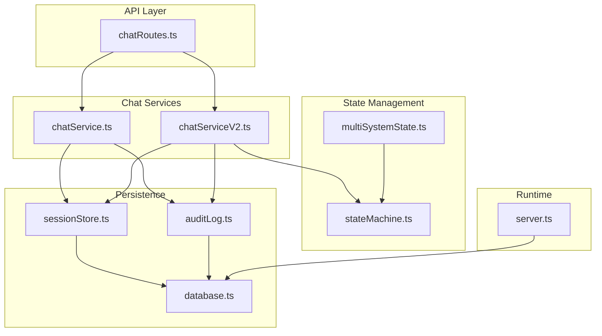
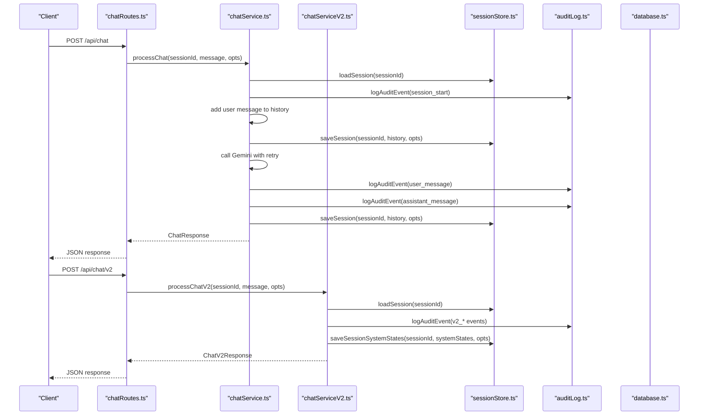
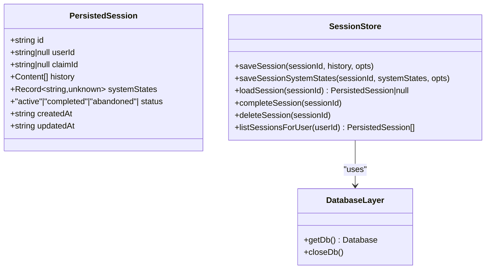
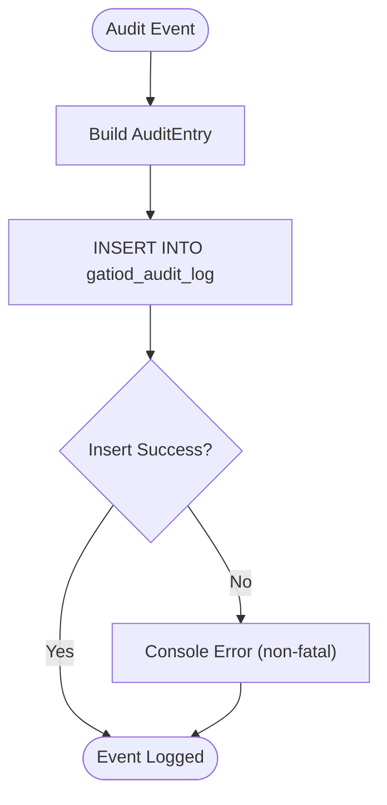
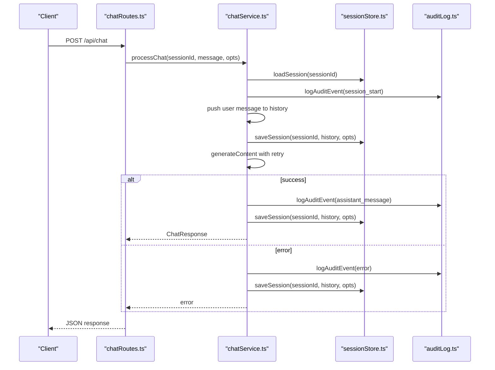
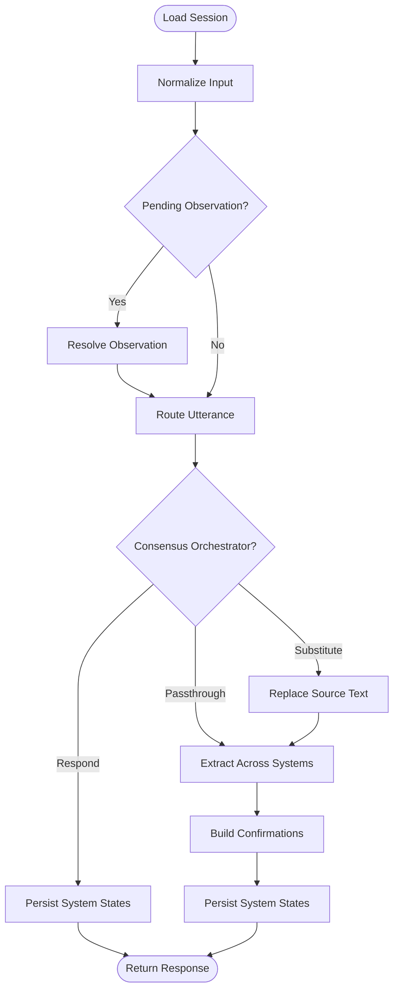
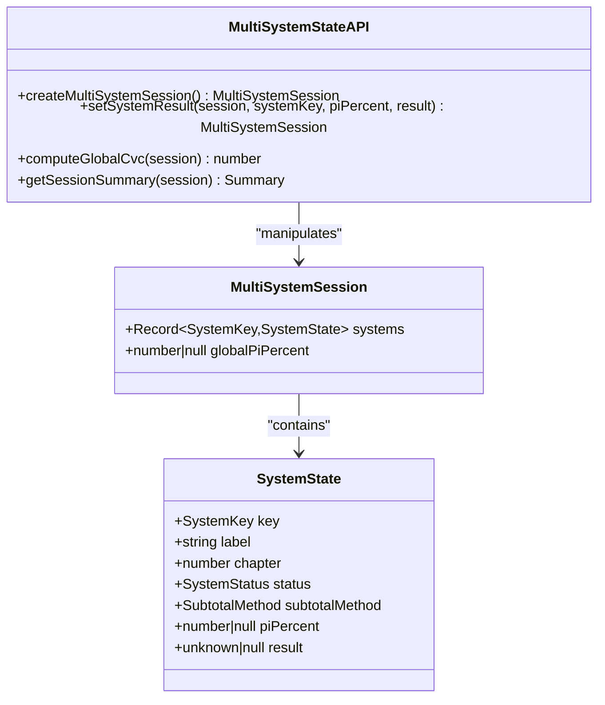
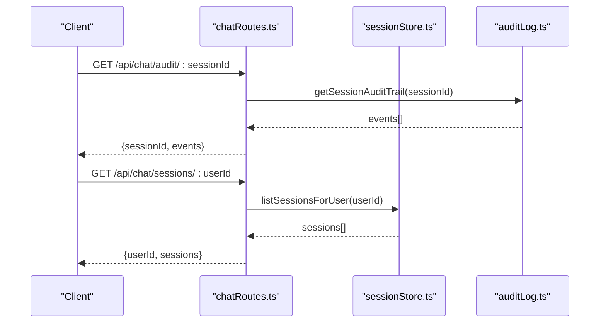
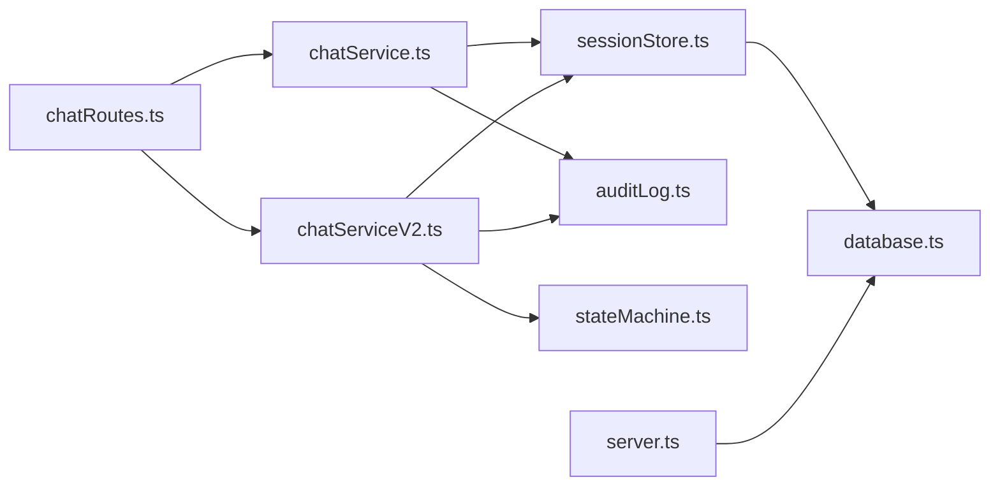

# Session Management and Persistence

<cite>
**Referenced Files in This Document**
- [sessionStore.ts](file://src/db/sessionStore.ts)
- [database.ts](file://src/db/database.ts)
- [auditLog.ts](file://src/db/auditLog.ts)
- [chatService.ts](file://src/chat/chatService.ts)
- [chatServiceV2.ts](file://src/chat/chatServiceV2.ts)
- [multiSystemState.ts](file://src/chat/multiSystemState.ts)
- [chatRoutes.ts](file://src/api/chatRoutes.ts)
- [server.ts](file://src/server.ts)
- [stateMachine.ts](file://src/v2/stateMachine.ts)
</cite>

## Table of Contents
1. [Introduction](#introduction)
2. [Project Structure](#project-structure)
3. [Core Components](#core-components)
4. [Architecture Overview](#architecture-overview)
5. [Detailed Component Analysis](#detailed-component-analysis)
6. [Dependency Analysis](#dependency-analysis)
7. [Performance Considerations](#performance-considerations)
8. [Troubleshooting Guide](#troubleshooting-guide)
9. [Conclusion](#conclusion)

## Introduction
This document explains the session management and persistence system that powers the GATIOD Chat Assistant. It covers how sessions are created, maintained, updated, and cleaned up across multiple body systems during clinical assessments. The system persists both the conversation history and multi-system state, enabling resilient, auditable, and resumable interactions with the AI assistant.

## Project Structure
The session management spans several modules:
- Database layer: SQLite-backed storage with JSON columns for history and system states
- Session store: CRUD operations for sessions and system state persistence
- Audit logging: comprehensive event logging for compliance and traceability
- Chat services: orchestrate session lifecycle and integrate with external APIs
- Multi-system state: tracks assessment progress across nine body systems
- API routes: expose session operations to clients
- Server initialization: ensures database and system registry readiness

**Diagram sources**
- [chatRoutes.ts:12-91](file://src/api/chatRoutes.ts#L12-L91)
- [chatService.ts:16-183](file://src/chat/chatService.ts#L16-L183)
- [chatServiceV2.ts:1-800](file://src/chat/chatServiceV2.ts#L1-L800)
- [sessionStore.ts:21-110](file://src/db/sessionStore.ts#L21-L110)
- [auditLog.ts:58-91](file://src/db/auditLog.ts#L58-L91)
- [database.ts:11-57](file://src/db/database.ts#L11-L57)
- [multiSystemState.ts:52-111](file://src/chat/multiSystemState.ts#L52-L111)
- [stateMachine.ts:59-200](file://src/v2/stateMachine.ts#L59-L200)
- [server.ts:39-44](file://src/server.ts#L39-L44)

**Section sources**
- [chatRoutes.ts:12-91](file://src/api/chatRoutes.ts#L12-L91)
- [chatService.ts:16-183](file://src/chat/chatService.ts#L16-L183)
- [sessionStore.ts:21-110](file://src/db/sessionStore.ts#L21-L110)
- [auditLog.ts:58-91](file://src/db/auditLog.ts#L58-L91)
- [database.ts:11-57](file://src/db/database.ts#L11-L57)
- [multiSystemState.ts:52-111](file://src/chat/multiSystemState.ts#L52-L111)
- [stateMachine.ts:59-200](file://src/v2/stateMachine.ts#L59-L200)
- [server.ts:39-44](file://src/server.ts#L39-L44)

## Core Components
- Session store: Provides functions to save, load, and manage session state, including both conversation history and multi-system state.
- Database layer: Initializes SQLite, sets up WAL mode, and creates tables for sessions and audit logs.
- Audit logging: Records every significant event for compliance and traceability.
- Chat services: Orchestrate session lifecycle, persist state before external API calls, and handle retries and errors.
- Multi-system state: Manages individual system states and computes global combined values.
- API routes: Expose endpoints for chat, session reset, audit trails, and session listing.
- Server initialization: Ensures database readiness and validates system registry integrity.

**Section sources**
- [sessionStore.ts:21-110](file://src/db/sessionStore.ts#L21-L110)
- [database.ts:11-57](file://src/db/database.ts#L11-L57)
- [auditLog.ts:58-91](file://src/db/auditLog.ts#L58-L91)
- [chatService.ts:38-183](file://src/chat/chatService.ts#L38-L183)
- [multiSystemState.ts:52-111](file://src/chat/multiSystemState.ts#L52-L111)
- [chatRoutes.ts:14-91](file://src/api/chatRoutes.ts#L14-L91)
- [server.ts:39-44](file://src/server.ts#L39-L44)

## Architecture Overview
The session lifecycle integrates with both legacy and modern assessment flows:
- Legacy flow (chatService.ts): Persists conversation history and basic session metadata; logs audit events; handles retries and error recovery.
- Modern flow (chatServiceV2.ts): Persists multi-system state separately; coordinates semantic consensus, routing, extraction, and confirmation; logs extensive audit events; supports shadow mode for evaluation.
- Shared persistence: Both flows write to the same session table, with separate columns for history and system states.

**Diagram sources**
- [chatRoutes.ts:14-66](file://src/api/chatRoutes.ts#L14-L66)
- [chatService.ts:38-154](file://src/chat/chatService.ts#L38-L154)
- [chatServiceV2.ts:258-525](file://src/chat/chatServiceV2.ts#L258-L525)
- [sessionStore.ts:21-84](file://src/db/sessionStore.ts#L21-L84)
- [auditLog.ts:58-91](file://src/db/auditLog.ts#L58-L91)
- [database.ts:11-49](file://src/db/database.ts#L11-L49)

## Detailed Component Analysis

### Session Store and Database Schema
The session store encapsulates all persistence operations:
- Save session: Inserts or updates a session row with conversation history and system states, updating timestamps and optional identifiers.
- Save system states: Updates only the system states column, preserving history and metadata.
- Load session: Retrieves a session row and parses JSON fields into typed structures.
- Complete and abandon: Updates session status for lifecycle management.
- List sessions: Retrieves recent sessions for a user.

The database layer initializes SQLite, enables WAL mode, and defines tables for sessions and audit logs with appropriate indexes.

**Diagram sources**
- [sessionStore.ts:10-19](file://src/db/sessionStore.ts#L10-L19)
- [sessionStore.ts:21-110](file://src/db/sessionStore.ts#L21-L110)
- [database.ts:11-57](file://src/db/database.ts#L11-L57)

**Section sources**
- [sessionStore.ts:21-110](file://src/db/sessionStore.ts#L21-L110)
- [database.ts:11-57](file://src/db/database.ts#L11-L57)

### Audit Logging and Compliance
The audit logger records every significant event with a structured payload. It writes to a dedicated table with indexes for efficient querying. The chat services log session lifecycle events, user messages, tool calls, and calculation results. The V2 pipeline logs additional events for normalization, routing, policy decisions, and semantic consensus activities.

**Diagram sources**
- [auditLog.ts:58-91](file://src/db/auditLog.ts#L58-L91)
- [chatService.ts:56-120](file://src/chat/chatService.ts#L56-L120)
- [chatServiceV2.ts:278-525](file://src/chat/chatServiceV2.ts#L278-L525)

**Section sources**
- [auditLog.ts:58-91](file://src/db/auditLog.ts#L58-L91)
- [chatService.ts:56-120](file://src/chat/chatService.ts#L56-L120)
- [chatServiceV2.ts:278-525](file://src/chat/chatServiceV2.ts#L278-L525)

### Legacy Chat Service Lifecycle
The legacy chat service orchestrates a single-loop conversation:
- Validates environment and feature flags
- Loads or creates a session
- Logs session start and user message
- Adds user message to history
- Persists session before calling the external model
- Calls the model with retry logic
- Handles function calls and tool responses
- Extracts CHIPS and persists final assistant message
- Returns a structured response

**Diagram sources**
- [chatRoutes.ts:14-41](file://src/api/chatRoutes.ts#L14-L41)
- [chatService.ts:38-154](file://src/chat/chatService.ts#L38-L154)
- [sessionStore.ts:21-44](file://src/db/sessionStore.ts#L21-L44)
- [auditLog.ts:58-91](file://src/db/auditLog.ts#L58-L91)

**Section sources**
- [chatService.ts:38-154](file://src/chat/chatService.ts#L38-L154)
- [chatRoutes.ts:14-41](file://src/api/chatRoutes.ts#L14-L41)

### Modern Chat Service V2 Lifecycle
The V2 service manages multi-system state and complex orchestration:
- Loads session state (including system states)
- Normalizes input and logs normalization events
- Resolves pending observations before routing
- Runs consensus orchestrator for semantic interpretation
- Routes utterances and extracts facts across multiple systems
- Builds confirmations and manages pending states
- Persists system states after each major step
- Supports shadow mode for evaluation

**Diagram sources**
- [chatServiceV2.ts:258-525](file://src/chat/chatServiceV2.ts#L258-L525)
- [sessionStore.ts:46-84](file://src/db/sessionStore.ts#L46-L84)
- [auditLog.ts:58-91](file://src/db/auditLog.ts#L58-L91)

**Section sources**
- [chatServiceV2.ts:258-525](file://src/chat/chatServiceV2.ts#L258-L525)
- [sessionStore.ts:46-84](file://src/db/sessionStore.ts#L46-L84)
- [auditLog.ts:58-91](file://src/db/auditLog.ts#L58-L91)

### Multi-System State Management
The multi-system state tracks nine body systems, their statuses, and computed global values:
- System definitions include keys, labels, chapters, and subtotal methods
- Creation initializes all systems to idle with empty state
- Setting results updates system status and recomputes global CVC
- Summary provides active systems and CVC inputs

**Diagram sources**
- [multiSystemState.ts:25-38](file://src/chat/multiSystemState.ts#L25-L38)
- [multiSystemState.ts:52-111](file://src/chat/multiSystemState.ts#L52-L111)

**Section sources**
- [multiSystemState.ts:25-111](file://src/chat/multiSystemState.ts#L25-L111)

### API Endpoints and Session Operations
The API exposes:
- POST /api/chat: Processes a chat message, creating or resuming a session
- POST /api/chat/v2: Processes a chat message using the V2 pipeline
- POST /api/chat/reset: Clears a session by marking it abandoned
- GET /api/chat/audit/:sessionId: Retrieves the audit trail for a session
- GET /api/chat/sessions/:userId: Lists recent sessions for a user

**Diagram sources**
- [chatRoutes.ts:77-90](file://src/api/chatRoutes.ts#L77-L90)
- [auditLog.ts:75-90](file://src/db/auditLog.ts#L75-L90)
- [sessionStore.ts:96-109](file://src/db/sessionStore.ts#L96-L109)

**Section sources**
- [chatRoutes.ts:77-90](file://src/api/chatRoutes.ts#L77-L90)
- [auditLog.ts:75-90](file://src/db/auditLog.ts#L75-L90)
- [sessionStore.ts:96-109](file://src/db/sessionStore.ts#L96-L109)

## Dependency Analysis
The session management system exhibits clear separation of concerns:
- API routes depend on chat services
- Chat services depend on session store and audit logging
- Session store depends on database layer
- V2 chat service additionally depends on state machine and system registry
- Server initialization ensures database readiness and system registry validation

**Diagram sources**
- [chatRoutes.ts:7-10](file://src/api/chatRoutes.ts#L7-L10)
- [chatService.ts:16-17](file://src/chat/chatService.ts#L16-L17)
- [chatServiceV2.ts:3-4](file://src/chat/chatServiceV2.ts#L3-L4)
- [sessionStore.ts:8](file://src/db/sessionStore.ts#L8)
- [auditLog.ts:6](file://src/db/auditLog.ts#L6)
- [database.ts:6](file://src/db/database.ts#L6)
- [stateMachine.ts:1-20](file://src/v2/stateMachine.ts#L1-L20)
- [server.ts:11](file://src/server.ts#L11)

**Section sources**
- [chatRoutes.ts:7-10](file://src/api/chatRoutes.ts#L7-L10)
- [chatService.ts:16-17](file://src/chat/chatService.ts#L16-L17)
- [chatServiceV2.ts:3-4](file://src/chat/chatServiceV2.ts#L3-L4)
- [sessionStore.ts:8](file://src/db/sessionStore.ts#L8)
- [auditLog.ts:6](file://src/db/auditLog.ts#L6)
- [database.ts:6](file://src/db/database.ts#L6)
- [stateMachine.ts:1-20](file://src/v2/stateMachine.ts#L1-L20)
- [server.ts:11](file://src/server.ts#L11)

## Performance Considerations
- Database initialization: SQLite is initialized once and reused; WAL mode improves concurrency.
- JSON serialization: History and system states are stored as JSON; consider limiting payload sizes for long conversations.
- Retry strategy: Gemini calls are retried with exponential backoff; ensure adequate timeouts.
- Indexes: Database includes indexes on user_id, claim_id, and status for efficient queries.
- Audit overhead: Audit logging is non-fatal and does not block main flows; monitor for excessive event volume.

[No sources needed since this section provides general guidance]

## Troubleshooting Guide
Common issues and resolutions:
- Missing environment variables: Ensure GEMINI_API_KEY is set; otherwise chat will fail.
- Database connectivity: Verify database path and permissions; the database is initialized on first use.
- Session not found: Loading a session by ID returns null if not present; ensure the correct session ID is used.
- Audit logging failures: Audit logging is wrapped in try/catch; failures are logged to console and do not crash the service.
- Rate limits and timeouts: The legacy service surfaces user-friendly errors for rate-limiting and availability issues.

**Section sources**
- [server.ts:52-64](file://src/server.ts#L52-L64)
- [database.ts:14-18](file://src/db/database.ts#L14-L18)
- [sessionStore.ts:69-84](file://src/db/sessionStore.ts#L69-L84)
- [auditLog.ts:69-73](file://src/db/auditLog.ts#L69-L73)
- [chatService.ts:83-96](file://src/chat/chatService.ts#L83-L96)

## Conclusion
The session management and persistence system provides robust, auditable, and resumable chat experiences across multiple body systems. By separating conversation history and multi-system state, persisting before external API calls, and logging comprehensive audit trails, the system ensures reliability, traceability, and extensibility for both legacy and modern assessment workflows.