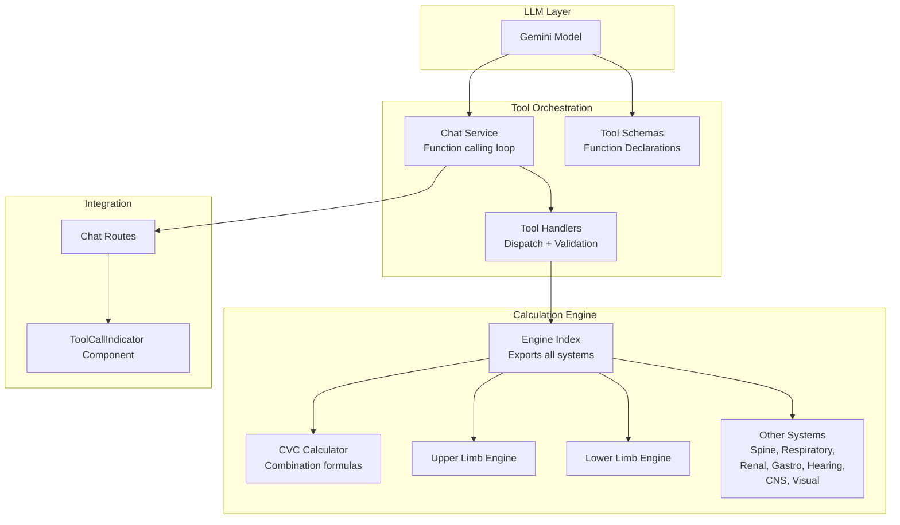
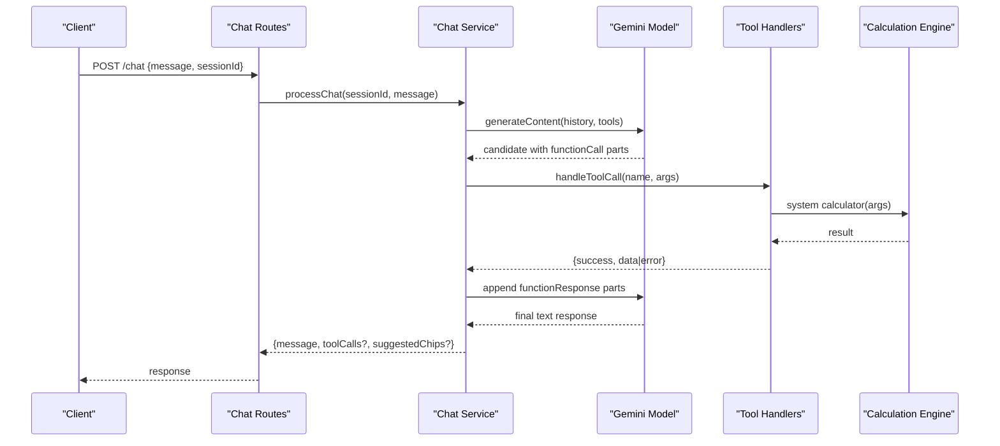
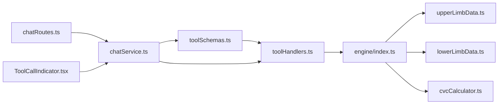

# Tool Integration and Function Calling

<cite>
**Referenced Files in This Document**
- [toolHandlers.ts](file://src/tools/toolHandlers.ts)
- [toolSchemas.ts](file://src/tools/toolSchemas.ts)
- [index.ts](file://src/engine/index.ts)
- [cvcCalculator.ts](file://src/engine/cvcCalculator.ts)
- [upperLimbData.ts](file://src/engine/upperLimbData.ts)
- [lowerLimbData.ts](file://src/engine/lowerLimbData.ts)
- [chatService.ts](file://src/chat/chatService.ts)
- [geminiSemanticModelClient.ts](file://src/v2/geminiSemanticModelClient.ts)
- [chatRoutes.ts](file://src/api/chatRoutes.ts)
- [ToolCallIndicator.tsx](file://web/src/components/ToolCallIndicator.tsx)
- [upperLimb.test.ts](file://tests/engine/upperLimb.test.ts)
</cite>

## Table of Contents
1. [Introduction](#introduction)
2. [Project Structure](#project-structure)
3. [Core Components](#core-components)
4. [Architecture Overview](#architecture-overview)
5. [Detailed Component Analysis](#detailed-component-analysis)
6. [Dependency Analysis](#dependency-analysis)
7. [Performance Considerations](#performance-considerations)
8. [Troubleshooting Guide](#troubleshooting-guide)
9. [Conclusion](#conclusion)

## Introduction
This document explains how the Gemini LLM invokes specific calculation functions through a structured tool integration and function calling system. It covers tool schema definitions, deterministic calculation workflows, tool registration, parameter validation, result processing, configuration options, and integration with the calculation engine. It also documents error handling, performance optimization, and common issues such as tool availability and parameter validation failures.

## Project Structure
The tool integration spans several modules:
- Tool schemas define the Gemini function declarations and parameter contracts.
- Tool handlers translate function calls into engine calculations and normalize results.
- The calculation engine provides pure functions for each GATIOD system plus shared CVC utilities.
- The chat service orchestrates Gemini with function calling, manages sessions, and logs tool usage.
- The frontend displays tool call indicators for transparency.

**Diagram sources**
- [chatService.ts:38-154](file://src/chat/chatService.ts#L38-L154)
- [toolSchemas.ts:14-217](file://src/tools/toolSchemas.ts#L14-L217)
- [toolHandlers.ts:47-102](file://src/tools/toolHandlers.ts#L47-L102)
- [index.ts:6-89](file://src/engine/index.ts#L6-L89)
- [cvcCalculator.ts:14-108](file://src/engine/cvcCalculator.ts#L14-L108)
- [chatRoutes.ts:14-41](file://src/api/chatRoutes.ts#L14-L41)
- [ToolCallIndicator.tsx:28-64](file://web/src/components/ToolCallIndicator.tsx#L28-L64)

**Section sources**
- [chatService.ts:38-154](file://src/chat/chatService.ts#L38-L154)
- [toolSchemas.ts:14-217](file://src/tools/toolSchemas.ts#L14-L217)
- [toolHandlers.ts:47-102](file://src/tools/toolHandlers.ts#L47-L102)
- [index.ts:6-89](file://src/engine/index.ts#L6-L89)
- [chatRoutes.ts:14-41](file://src/api/chatRoutes.ts#L14-L41)
- [ToolCallIndicator.tsx:28-64](file://web/src/components/ToolCallIndicator.tsx#L28-L64)

## Core Components
- Tool schemas: Define the function names, descriptions, and parameter structures for Gemini’s function calling. They include both single-system assessment tools and multi-system tools, plus lookup utilities.
- Tool handlers: Dispatch function names to system-specific calculators, normalize arguments, sanitize results, and compute derived metrics like final percent.
- Calculation engine: Provides pure functions for each system (upper/lower limb, spine, respiratory, renal, gastro, hearing, CNS, visual) and shared CVC combination utilities.
- Chat service: Manages the Gemini model lifecycle, function calling loop, retries, audit logging, and session persistence.
- Frontend indicator: Visualizes tool calls made during a session.

**Section sources**
- [toolSchemas.ts:14-486](file://src/tools/toolSchemas.ts#L14-L486)
- [toolHandlers.ts:47-435](file://src/tools/toolHandlers.ts#L47-L435)
- [index.ts:6-89](file://src/engine/index.ts#L6-L89)
- [chatService.ts:38-154](file://src/chat/chatService.ts#L38-L154)
- [ToolCallIndicator.tsx:28-64](file://web/src/components/ToolCallIndicator.tsx#L28-L64)

## Architecture Overview
The system follows a deterministic, schema-driven workflow:
1. Gemini receives a user message and system prompt.
2. Gemini proposes function calls based on declared tool schemas.
3. The chat service executes each function call via tool handlers.
4. Tool handlers invoke engine functions and return normalized results.
5. Results are appended to the conversation history and Gemini continues until a final text response is produced.

**Diagram sources**
- [chatRoutes.ts:14-41](file://src/api/chatRoutes.ts#L14-L41)
- [chatService.ts:67-154](file://src/chat/chatService.ts#L67-L154)
- [toolHandlers.ts:47-102](file://src/tools/toolHandlers.ts#L47-L102)
- [index.ts:6-89](file://src/engine/index.ts#L6-L89)

## Detailed Component Analysis

### Tool Schema Definitions
- Single-system assessment tools: assess_upper_limb, assess_lower_limb, assess_spine, assess_respiratory, assess_renal, assess_gastro, assess_hearing, assess_cns, assess_visual, assess_global_cvc.
- Lookup tools: lookup_rom_table, lookup_amputation_level, lookup_nerve, lookup_dbe_condition, search_dictionary, lookup_lower_amputation, lookup_lower_nerve, lookup_shortening, lookup_lower_dbe_condition.
- Parameter validation: Strict schemas enforce required fields, enums, and numeric ranges. For example, upper limb assessment requires side, amputations, ROM, neurological, and DBE with specific nested structures.

Implementation highlights:
- Tool declarations are defined as functionDeclarations with parameters using a strict schema type.
- Multi-system tools include detailed descriptions and constraints to guide the LLM.

**Section sources**
- [toolSchemas.ts:14-217](file://src/tools/toolSchemas.ts#L14-L217)
- [toolSchemas.ts:222-486](file://src/tools/toolSchemas.ts#L222-L486)

### Tool Registration and Function Calling Loop
- Registration: Gemini is configured with tools containing functionDeclarations from both single-system and multi-system tool sets.
- Function calling loop: The chat service iterates up to a maximum number of turns, collecting function calls from Gemini, invoking tool handlers, appending functionResponse parts, and saving session state.

Key behaviors:
- Retry logic with exponential backoff for transient errors.
- Safety and finish reasons are handled gracefully.
- Audit logging records tool calls and calculation results.

**Section sources**
- [chatService.ts:67-154](file://src/chat/chatService.ts#L67-L154)

### Tool Handler Dispatch and Deterministic Workflows
- Dispatch: A switch statement routes function names to handler functions.
- Wrapping: Assessment handlers call engine functions and attach systemKey and finalPercent to results.
- Sanitization: Spine results replace internal enum keys with human-readable labels.
- Special-case normalization: CNS auto-confirms specialists’ findings when values are nonzero; Visual normalizes optional arrays; Global CVC filters non-positive subtotals and computes a capped combined value.

Validation and error handling:
- Unknown tool names return structured errors.
- Lookup tools validate keys and return suggestions when appropriate.
- Numeric and categorical validations ensure robustness.

**Section sources**
- [toolHandlers.ts:47-102](file://src/tools/toolHandlers.ts#L47-L102)
- [toolHandlers.ts:125-161](file://src/tools/toolHandlers.ts#L125-L161)
- [toolHandlers.ts:165-184](file://src/tools/toolHandlers.ts#L165-L184)
- [toolHandlers.ts:196-203](file://src/tools/toolHandlers.ts#L196-L203)
- [toolHandlers.ts:207-228](file://src/tools/toolHandlers.ts#L207-L228)
- [toolHandlers.ts:232-253](file://src/tools/toolHandlers.ts#L232-L253)
- [toolHandlers.ts:255-278](file://src/tools/toolHandlers.ts#L255-L278)
- [toolHandlers.ts:280-301](file://src/tools/toolHandlers.ts#L280-L301)
- [toolHandlers.ts:303-315](file://src/tools/toolHandlers.ts#L303-L315)
- [toolHandlers.ts:317-321](file://src/tools/toolHandlers.ts#L317-L321)
- [toolHandlers.ts:325-357](file://src/tools/toolHandlers.ts#L325-L357)
- [toolHandlers.ts:359-379](file://src/tools/toolHandlers.ts#L359-L379)
- [toolHandlers.ts:381-395](file://src/tools/toolHandlers.ts#L381-L395)
- [toolHandlers.ts:397-434](file://src/tools/toolHandlers.ts#L397-L434)

### Calculation Engine Integration
- Exports: The engine index re-exports all system calculators and shared CVC utilities.
- Shared CVC: Functions combine multiple PI% values deterministically, preventing over-aggregation beyond 100%.
- System-specific engines: Upper and lower limb engines include ROM lookup tables, amputation levels, nerve definitions, DBE conditions, and result structures.

Examples from tests demonstrate:
- CVC combination correctness and caps.
- ROM lookup interpolation and boundary behavior.
- Amputation calculation and suppression effects.
- Conditional exclusions when ROM is attributed to nerve lesions.

**Section sources**
- [index.ts:6-89](file://src/engine/index.ts#L6-L89)
- [cvcCalculator.ts:14-108](file://src/engine/cvcCalculator.ts#L14-L108)
- [upperLimbData.ts:160-186](file://src/engine/upperLimbData.ts#L160-L186)
- [lowerLimbData.ts:155-181](file://src/engine/lowerLimbData.ts#L155-L181)
- [upperLimb.test.ts:14-32](file://tests/engine/upperLimb.test.ts#L14-L32)
- [upperLimb.test.ts:34-54](file://tests/engine/upperLimb.test.ts#L34-L54)
- [upperLimb.test.ts:56-82](file://tests/engine/upperLimb.test.ts#L56-L82)
- [upperLimb.test.ts:84-132](file://tests/engine/upperLimb.test.ts#L84-L132)
- [upperLimb.test.ts:134-155](file://tests/engine/upperLimb.test.ts#L134-L155)

### Result Processing and Presentation
- Final percent extraction: Handlers extract finalPercent, finalPi, selectedPi, or fallback piPercent.
- Global CVC: Aggregates positive subtotals, sorts descending, and computes a capped combined PI%.
- Frontend indicator: Displays tool call badges with success/error status and human-readable labels.

**Section sources**
- [toolHandlers.ts:106-121](file://src/tools/toolHandlers.ts#L106-L121)
- [toolHandlers.ts:207-228](file://src/tools/toolHandlers.ts#L207-L228)
- [ToolCallIndicator.tsx:10-26](file://web/src/components/ToolCallIndicator.tsx#L10-L26)
- [ToolCallIndicator.tsx:28-64](file://web/src/components/ToolCallIndicator.tsx#L28-L64)

### Configuration Options and Environment
- Gemini client configuration: Temperature is set to zero for deterministic output; model and API key are configurable via environment variables.
- Feature flags: Chat service checks a feature flag to enable/disable chat assessments.
- API routes: Provide session reset and audit trail endpoints.

**Section sources**
- [geminiSemanticModelClient.ts:16-44](file://src/v2/geminiSemanticModelClient.ts#L16-L44)
- [chatService.ts:46-49](file://src/chat/chatService.ts#L46-L49)
- [chatRoutes.ts:68-90](file://src/api/chatRoutes.ts#L68-L90)

## Dependency Analysis
The tool integration exhibits clear separation of concerns:
- Tool schemas depend on system prompts and LLM instructions to constrain function calls.
- Tool handlers depend on engine exports and provide normalization/validation.
- Engine functions are pure and independent of UI or transport layers.
- Chat service depends on tool schemas and handlers to orchestrate function calls.

**Diagram sources**
- [toolSchemas.ts:14-486](file://src/tools/toolSchemas.ts#L14-L486)
- [toolHandlers.ts:47-435](file://src/tools/toolHandlers.ts#L47-L435)
- [index.ts:6-89](file://src/engine/index.ts#L6-L89)
- [upperLimbData.ts:160-186](file://src/engine/upperLimbData.ts#L160-L186)
- [lowerLimbData.ts:155-181](file://src/engine/lowerLimbData.ts#L155-L181)
- [cvcCalculator.ts:14-108](file://src/engine/cvcCalculator.ts#L14-L108)
- [chatService.ts:38-154](file://src/chat/chatService.ts#L38-L154)
- [chatRoutes.ts:14-41](file://src/api/chatRoutes.ts#L14-L41)
- [ToolCallIndicator.tsx:28-64](file://web/src/components/ToolCallIndicator.tsx#L28-L64)

**Section sources**
- [toolSchemas.ts:14-486](file://src/tools/toolSchemas.ts#L14-L486)
- [toolHandlers.ts:47-435](file://src/tools/toolHandlers.ts#L47-L435)
- [index.ts:6-89](file://src/engine/index.ts#L6-L89)
- [chatService.ts:38-154](file://src/chat/chatService.ts#L38-L154)
- [chatRoutes.ts:14-41](file://src/api/chatRoutes.ts#L14-L41)
- [ToolCallIndicator.tsx:28-64](file://web/src/components/ToolCallIndicator.tsx#L28-L64)

## Performance Considerations
- Deterministic temperature: Setting temperature to zero reduces variability and improves reproducibility.
- Retry strategy: Backoff delays reduce load spikes and improve resilience to transient failures.
- Session persistence: Saving session state before external API calls ensures continuity and reduces rework.
- CVC combination: Using chart-aware combination minimizes rounding artifacts and maintains precision.
- Frontend rendering: Tool call badges are lightweight and collapse to conserve space.

[No sources needed since this section provides general guidance]

## Troubleshooting Guide
Common issues and resolutions:
- Unknown tool: Ensure the function name matches a declared tool. The handler returns a structured error indicating the unknown tool.
- Parameter validation failures: Verify required fields and enums per tool schema. For example, upper limb assessment requires side, amputations, ROM, neurological, and DBE with specific nested structures.
- Tool availability: Confirm that the feature flag enabling chat assessments is set appropriately.
- Rate limits and timeouts: The chat service detects quota and connectivity issues and returns user-friendly messages.
- Lookup mismatches: For DBE conditions, the handler suggests alternatives when an exact match is not found.

Concrete examples from the codebase:
- Tool availability and safety handling in the function calling loop.
- Parameter validation and suggestions in lookup handlers.
- Structured error responses for invalid inputs.

**Section sources**
- [toolHandlers.ts:96-101](file://src/tools/toolHandlers.ts#L96-L101)
- [toolHandlers.ts:303-315](file://src/tools/toolHandlers.ts#L303-L315)
- [toolHandlers.ts:397-434](file://src/tools/toolHandlers.ts#L397-L434)
- [chatService.ts:82-96](file://src/chat/chatService.ts#L82-L96)
- [chatService.ts:102-106](file://src/chat/chatService.ts#L102-L106)

## Conclusion
The tool integration and function calling system provides a deterministic, schema-driven pathway from LLM function calls to precise calculation outcomes. Tool schemas define strict contracts, tool handlers enforce validation and normalization, and the calculation engine delivers pure, testable functions. The chat service orchestrates retries, auditing, and session persistence, while the frontend offers visibility into tool usage. Together, these components ensure reliable, auditable, and transparent assessments across all GATIOD systems.