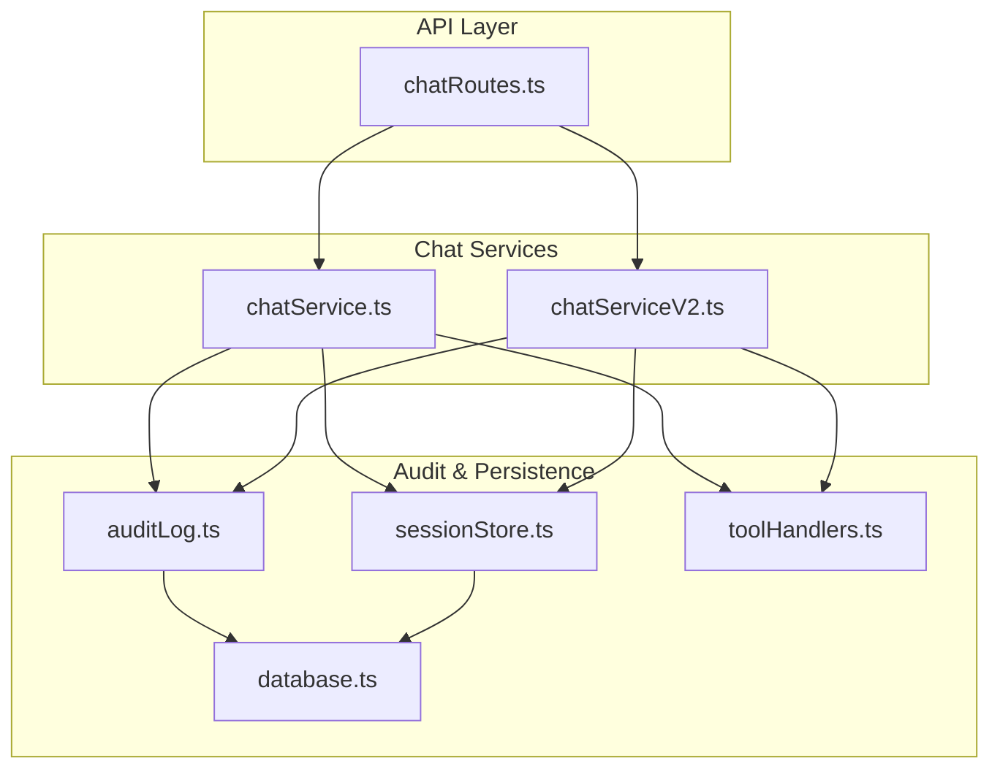
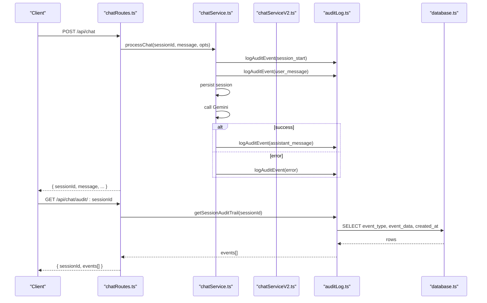
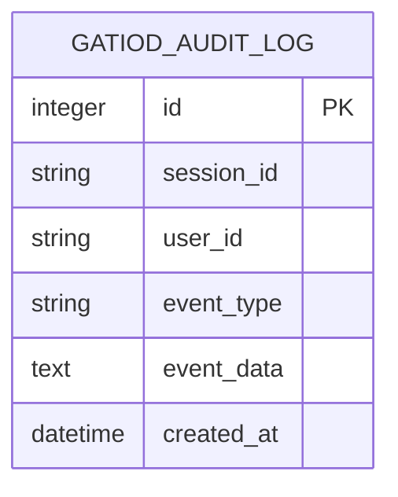
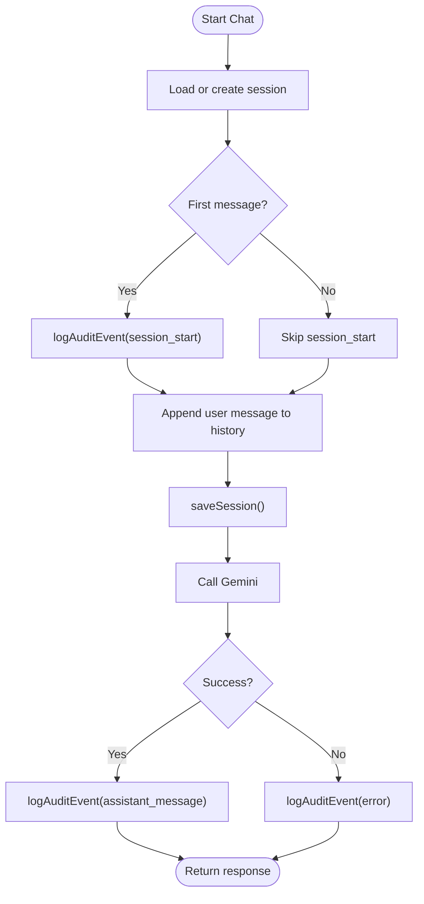
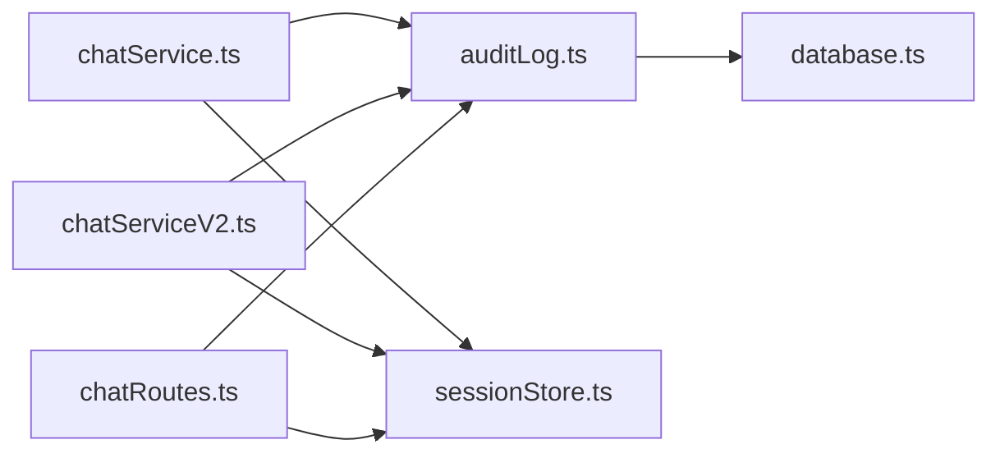
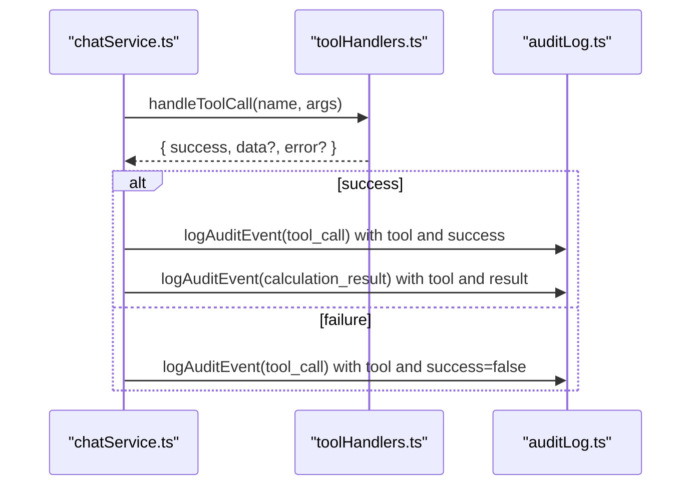

# Audit Logging

<cite>
**Referenced Files in This Document**
- [auditLog.ts](file://src/db/auditLog.ts)
- [database.ts](file://src/db/database.ts)
- [sessionStore.ts](file://src/db/sessionStore.ts)
- [chatService.ts](file://src/chat/chatService.ts)
- [chatServiceV2.ts](file://src/chat/chatServiceV2.ts)
- [chatRoutes.ts](file://src/api/chatRoutes.ts)
- [server.ts](file://src/server.ts)
- [toolHandlers.ts](file://src/tools/toolHandlers.ts)
</cite>

## Table of Contents
1. [Introduction](#introduction)
2. [Project Structure](#project-structure)
3. [Core Components](#core-components)
4. [Architecture Overview](#architecture-overview)
5. [Detailed Component Analysis](#detailed-component-analysis)
6. [Dependency Analysis](#dependency-analysis)
7. [Performance Considerations](#performance-considerations)
8. [Troubleshooting Guide](#troubleshooting-guide)
9. [Conclusion](#conclusion)
10. [Appendices](#appendices)

## Introduction
This document describes the audit logging system for medical legal compliance. It covers the audit event types, data capture mechanisms, storage patterns, and retrieval capabilities. It explains the audit log structure with session_id, user_id, event_type, and event_data fields, and categorizes events across chat interactions, system assessments, calculation triggers, and policy decisions. It also documents data retention, compliance, anonymization considerations, querying/filtering/reporting, integration with session management, and error tracking. Examples of audit event generation and retrieval patterns are provided.

## Project Structure
The audit logging system spans several modules:
- Database layer initializes tables and indexes for audit logs and sessions.
- Audit logger defines event types and persists events to the database.
- Session store persists chat sessions and integrates with audit logging.
- Chat services generate audit events during user interactions and tool executions.
- API routes expose endpoints for audit retrieval and session listing.
- Tool handlers execute calculations and feed results back into audit events.

**Diagram sources**
- [chatRoutes.ts:14-90](file://src/api/chatRoutes.ts#L14-L90)
- [chatService.ts:38-182](file://src/chat/chatService.ts#L38-L182)
- [chatServiceV2.ts:258-1040](file://src/chat/chatServiceV2.ts#L258-L1040)
- [auditLog.ts:58-90](file://src/db/auditLog.ts#L58-L90)
- [database.ts:20-46](file://src/db/database.ts#L20-L46)
- [sessionStore.ts:21-109](file://src/db/sessionStore.ts#L21-L109)
- [toolHandlers.ts:47-102](file://src/tools/toolHandlers.ts#L47-L102)

**Section sources**
- [chatRoutes.ts:14-90](file://src/api/chatRoutes.ts#L14-L90)
- [chatService.ts:38-182](file://src/chat/chatService.ts#L38-L182)
- [chatServiceV2.ts:258-1040](file://src/chat/chatServiceV2.ts#L258-L1040)
- [auditLog.ts:58-90](file://src/db/auditLog.ts#L58-L90)
- [database.ts:20-46](file://src/db/database.ts#L20-L46)
- [sessionStore.ts:21-109](file://src/db/sessionStore.ts#L21-L109)
- [toolHandlers.ts:47-102](file://src/tools/toolHandlers.ts#L47-L102)

## Core Components
- Audit logger: Defines the AuditEventType union and AuditEntry interface, and provides functions to log events and retrieve session audit trails. Events are inserted into the gatiod_audit_log table with JSON serialization of event_data.
- Database layer: Initializes gatiod_sessions and gatiod_audit_log tables, and creates indexes on session_id, event_type, and created_at for efficient queries.
- Session store: Persists chat sessions with history, system states, and status, integrating with audit logging by recording session lifecycle events.
- Chat services: Generate audit events for user messages, assistant responses, tool calls, calculations, errors, and session resets. V2 service adds extensive events for normalization, routing, policy decisions, extractions, confirmations, and global CVC actions.
- API routes: Expose GET /api/chat/audit/:sessionId for retrieving audit trails and GET /api/chat/sessions/:userId for listing sessions.

**Section sources**
- [auditLog.ts:8-56](file://src/db/auditLog.ts#L8-L56)
- [auditLog.ts:58-90](file://src/db/auditLog.ts#L58-L90)
- [database.ts:20-46](file://src/db/database.ts#L20-L46)
- [sessionStore.ts:10-19](file://src/db/sessionStore.ts#L10-L19)
- [sessionStore.ts:21-109](file://src/db/sessionStore.ts#L21-L109)
- [chatService.ts:55-182](file://src/chat/chatService.ts#L55-L182)
- [chatServiceV2.ts:278-1040](file://src/chat/chatServiceV2.ts#L278-L1040)
- [chatRoutes.ts:76-90](file://src/api/chatRoutes.ts#L76-L90)

## Architecture Overview
The audit trail is generated synchronously during chat processing and stored in a relational database. Retrieval is performed via a dedicated endpoint that returns ordered events with timestamps.

**Diagram sources**
- [chatRoutes.ts:14-81](file://src/api/chatRoutes.ts#L14-L81)
- [chatService.ts:55-128](file://src/chat/chatService.ts#L55-L128)
- [auditLog.ts:58-90](file://src/db/auditLog.ts#L58-L90)
- [database.ts:35-45](file://src/db/database.ts#L35-L45)

## Detailed Component Analysis

### Audit Log Structure and Storage
- Fields:
  - session_id: string
  - user_id: string | null
  - event_type: AuditEventType (union of predefined event categories)
  - event_data: JSON string (serialized record)
  - created_at: datetime (auto-generated)
- Indexes:
  - idx_audit_session(session_id)
  - idx_audit_type(event_type)
  - idx_audit_created(created_at)
- Retrieval:
  - Ordered ascending by created_at for traceability.
  - event_data is parsed back to a record for consumption.

**Diagram sources**
- [database.ts:35-45](file://src/db/database.ts#L35-L45)

**Section sources**
- [auditLog.ts:51-56](file://src/db/auditLog.ts#L51-L56)
- [auditLog.ts:75-90](file://src/db/auditLog.ts#L75-L90)
- [database.ts:35-45](file://src/db/database.ts#L35-L45)

### Audit Event Types and Categories
- Chat interactions:
  - session_start, user_message, assistant_message, error, session_reset
- Tool and calculation triggers:
  - tool_call, calculation_result
- V2 normalization and routing:
  - v2_normalization, v2_route
- V2 policy and tool planning:
  - v2_policy, v2_tool_plan, v2_shadow_result
- V2 confirmations and pending observations:
  - confirmation_presented, confirmation_accepted, correction, v2_pending_observation
- V2 extraction and semantic:
  - v2_extraction_warning, v2_multi_system_extraction, semantic_to_structured_extraction_started, semantic_to_structured_extraction_failed, semantic_interpretation_created, semantic_interpretation_accepted, semantic_interpretation_rejected, semantic_interpretation_edited, semantic_legacy_deferred_component, semantic_legacy_fallback_requested, semantic_multi_region_spine_detected
- V2 global CVC:
  - v2_global_cvc_offered, v2_global_cvc_executed, v2_global_cvc_component_excluded, v2_global_cvc_component_reincluded
- V2 failures and user choices:
  - v2_failure, v2_failure_user_choice, v2_component_skipped_by_user, spine_multi_region_unsupported

**Section sources**
- [auditLog.ts:8-49](file://src/db/auditLog.ts#L8-L49)
- [chatService.ts:55-143](file://src/chat/chatService.ts#L55-L143)
- [chatServiceV2.ts:278-1040](file://src/chat/chatServiceV2.ts#L278-L1040)

### Data Capture Mechanisms
- Chat service:
  - Logs session_start on first message.
  - Logs user_message for every user input.
  - Logs assistant_message with summary metrics.
  - Logs tool_call and calculation_result for each tool execution.
  - Logs error on Gemini failures.
  - Logs session_reset on explicit reset.
- V2 service:
  - Extensive audit events for normalization, routing, policy decisions, extractions, confirmations, global CVC offers/executions, and failures.
  - Integrates semantic consensus audit events and disagreement detection.

**Section sources**
- [chatService.ts:55-182](file://src/chat/chatService.ts#L55-L182)
- [chatServiceV2.ts:278-1040](file://src/chat/chatServiceV2.ts#L278-L1040)

### Integration with Session Management
- Sessions are persisted before invoking external APIs to ensure continuity and auditability.
- Session store maintains history, system states, and status updates.
- Audit events are recorded alongside session persistence to maintain traceability.

**Diagram sources**
- [chatService.ts:55-128](file://src/chat/chatService.ts#L55-L128)

**Section sources**
- [chatService.ts:55-128](file://src/chat/chatService.ts#L55-L128)
- [sessionStore.ts:21-67](file://src/db/sessionStore.ts#L21-L67)

### Audit Data Retention Policies
- The codebase does not define explicit retention policies. Retention should be governed by organizational and regulatory requirements. Consider implementing periodic cleanup jobs to remove old audit entries beyond retention windows.

[No sources needed since this section provides general guidance]

### Compliance Requirements
- Medico-legal traceability requires:
  - Immutable audit trails with timestamps.
  - Full session replay capability via session_store history.
  - Explicit user identification (user_id) where available.
  - Comprehensive event coverage for all assessment steps.

[No sources needed since this section provides general guidance]

### Data Anonymization Considerations
- The audit log stores event_data as JSON. Ensure sensitive personal health information is redacted or omitted from event_data payloads.
- Consider hashing or masking user_id and session_id for downstream analytics where traceability is not required.

[No sources needed since this section provides general guidance]

### Audit Log Querying, Filtering, and Reporting
- Retrieval:
  - GET /api/chat/audit/:sessionId returns ordered events with event_type, event_data, and created_at.
- Filtering and reporting:
  - Clients can filter by event_type or time window.
  - Aggregation can be performed client-side or via database views.

**Section sources**
- [chatRoutes.ts:76-81](file://src/api/chatRoutes.ts#L76-L81)
- [auditLog.ts:75-90](file://src/db/auditLog.ts#L75-L90)

### Integration with Error Tracking
- Audit events capture errors from Gemini calls, enabling incident investigation and SLA monitoring.
- Error payloads are logged to aid debugging without exposing internal stack traces.

**Section sources**
- [chatService.ts:82-96](file://src/chat/chatService.ts#L82-L96)

### Examples of Audit Event Generation and Retrieval Patterns
- Generating events:
  - On first user message: logAuditEvent(session_start) with claimId.
  - On each user message: logAuditEvent(user_message) with message preview.
  - On tool execution: logAuditEvent(tool_call) with tool name and success.
  - On calculation: logAuditEvent(calculation_result) with tool and result payload.
  - On error: logAuditEvent(error) with error message.
  - On session reset: logAuditEvent(session_reset).
- Retrieving trails:
  - GET /api/chat/audit/:sessionId returns all events ordered by created_at.

**Section sources**
- [chatService.ts:55-182](file://src/chat/chatService.ts#L55-L182)
- [chatRoutes.ts:76-81](file://src/api/chatRoutes.ts#L76-L81)
- [auditLog.ts:75-90](file://src/db/auditLog.ts#L75-L90)

## Dependency Analysis
The audit logging system depends on:
- Database initialization for schema and indexes.
- Session store for coordinated persistence.
- Chat services for event generation.
- API routes for exposure.

**Diagram sources**
- [chatService.ts:16-17](file://src/chat/chatService.ts#L16-L17)
- [chatServiceV2.ts:3-4](file://src/chat/chatServiceV2.ts#L3-L4)
- [auditLog.ts](file://src/db/auditLog.ts#L6)
- [sessionStore.ts](file://src/db/sessionStore.ts#L8)
- [chatRoutes.ts:9-10](file://src/api/chatRoutes.ts#L9-L10)

**Section sources**
- [chatService.ts:16-17](file://src/chat/chatService.ts#L16-L17)
- [chatServiceV2.ts:3-4](file://src/chat/chatServiceV2.ts#L3-L4)
- [auditLog.ts](file://src/db/auditLog.ts#L6)
- [sessionStore.ts](file://src/db/sessionStore.ts#L8)
- [chatRoutes.ts:9-10](file://src/api/chatRoutes.ts#L9-L10)

## Performance Considerations
- Audit logging is synchronous and guarded by a try/catch to avoid crashing the main flow.
- JSON serialization of event_data is lightweight but consider limiting payload sizes for high-frequency events.
- Database writes occur on every significant step; ensure adequate I/O capacity and consider batching if throughput demands increase.

[No sources needed since this section provides general guidance]

## Troubleshooting Guide
- Audit insert failures:
  - The log function catches and logs errors internally; verify database connectivity and permissions.
- Missing audit events:
  - Confirm that logAuditEvent is called in the expected code paths (e.g., tool execution, assistant message).
- Retrieval issues:
  - Ensure sessionId is correct and the audit trail is requested after events have occurred.
- Session vs. audit separation:
  - Session persistence and audit logging are separate; verify both are functioning independently.

**Section sources**
- [auditLog.ts:58-73](file://src/db/auditLog.ts#L58-L73)
- [chatService.ts:119-143](file://src/chat/chatService.ts#L119-L143)
- [chatRoutes.ts:76-81](file://src/api/chatRoutes.ts#L76-L81)

## Conclusion
The audit logging system provides comprehensive, medico-legal traceability by capturing every significant step in the chat and assessment workflows. It integrates tightly with session management and exposes a simple retrieval API. To meet compliance requirements, organizations should define retention and anonymization policies, monitor error events, and implement robust reporting on audit trails.

[No sources needed since this section summarizes without analyzing specific files]

## Appendices

### Appendix A: Audit Event Type Reference
- Chat: session_start, user_message, assistant_message, error, session_reset
- Tools: tool_call, calculation_result
- V2 Normalization: v2_normalization
- V2 Routing: v2_route
- V2 Policy: v2_policy
- V2 Planning: v2_tool_plan, v2_shadow_result
- Confirmations: confirmation_presented, confirmation_accepted, correction
- Pending Observations: v2_pending_observation
- Extraction: v2_extraction_warning, v2_multi_system_extraction
- Semantic: semantic_to_structured_extraction_started, semantic_to_structured_extraction_failed, semantic_interpretation_created, semantic_interpretation_accepted, semantic_interpretation_rejected, semantic_interpretation_edited, semantic_legacy_deferred_component, semantic_legacy_fallback_requested, semantic_multi_region_spine_detected
- Global CVC: v2_global_cvc_offered, v2_global_cvc_executed, v2_global_cvc_component_excluded, v2_global_cvc_component_reincluded
- Failures: v2_failure, v2_failure_user_choice
- Special: v2_component_skipped_by_user, spine_multi_region_unsupported

**Section sources**
- [auditLog.ts:8-49](file://src/db/auditLog.ts#L8-L49)

### Appendix B: Tool Execution Audit Flow

**Diagram sources**
- [chatService.ts:134-143](file://src/chat/chatService.ts#L134-L143)
- [toolHandlers.ts:47-102](file://src/tools/toolHandlers.ts#L47-L102)
- [auditLog.ts:58-73](file://src/db/auditLog.ts#L58-L73)