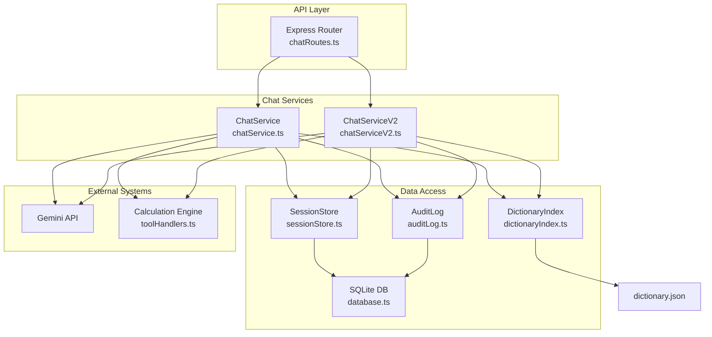
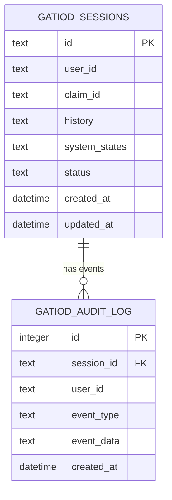
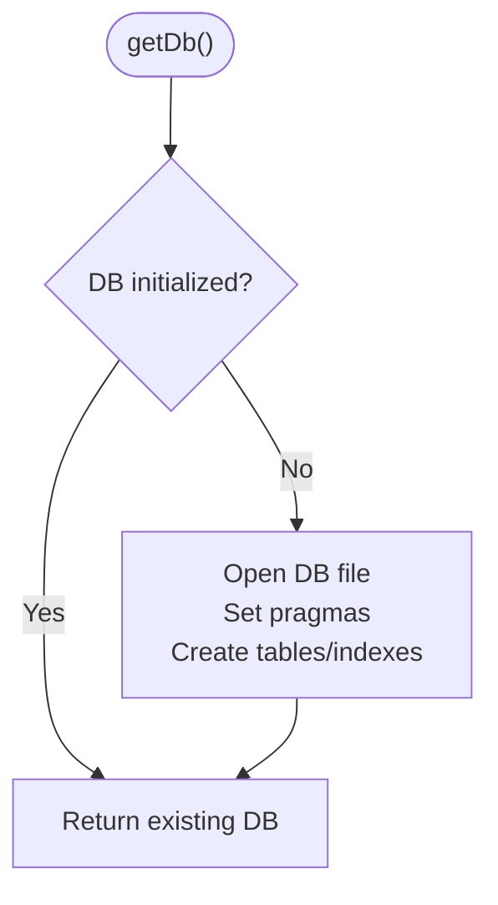
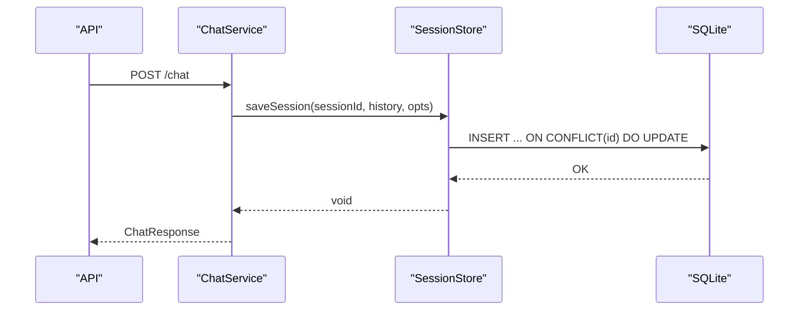
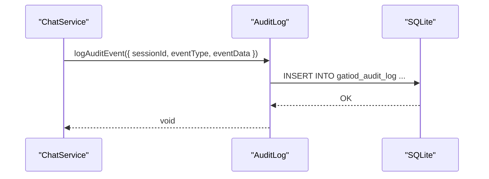
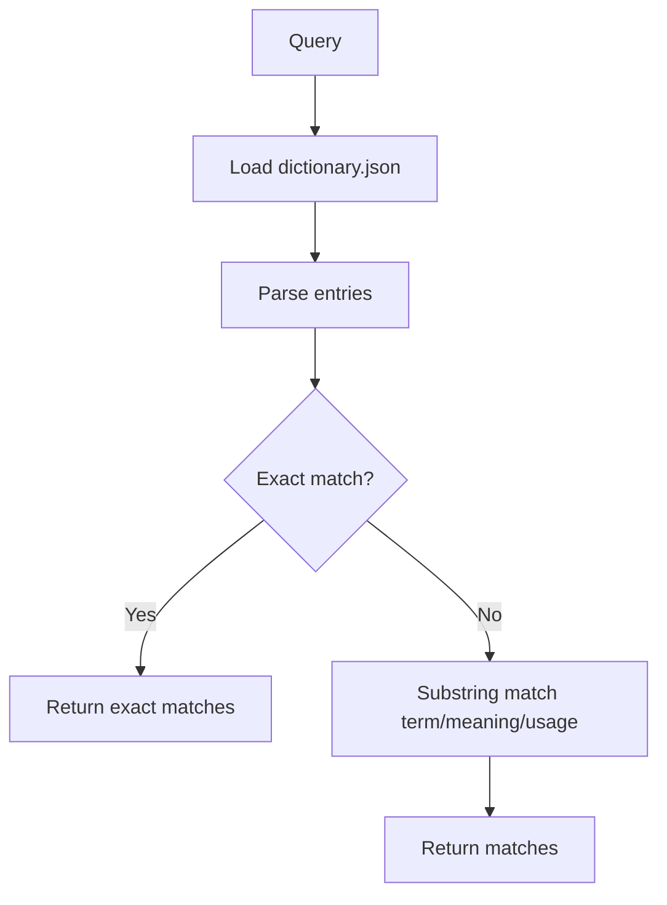
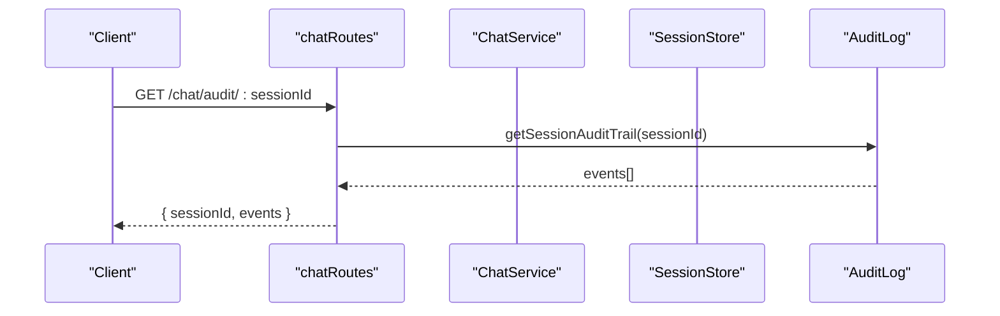
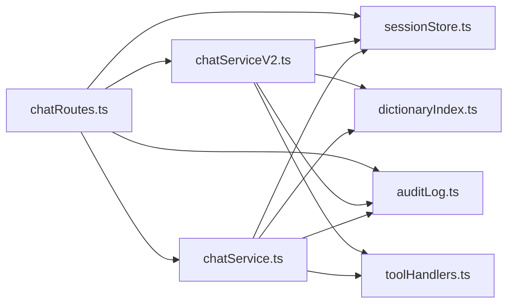

# Data Management

<cite>
**Referenced Files in This Document**
- [database.ts](file://src/db/database.ts)
- [sessionStore.ts](file://src/db/sessionStore.ts)
- [auditLog.ts](file://src/db/auditLog.ts)
- [chatRoutes.ts](file://src/api/chatRoutes.ts)
- [chatService.ts](file://src/chat/chatService.ts)
- [chatServiceV2.ts](file://src/chat/chatServiceV2.ts)
- [dictionaryIndex.ts](file://src/rag/dictionaryIndex.ts)
- [dictionary.json](file://knowledge/dictionary.json)
- [toolHandlers.ts](file://src/tools/toolHandlers.ts)
- [policyEngine.ts](file://src/v2/policyEngine.ts)
- [stateMachine.ts](file://src/v2/stateMachine.ts)
</cite>

## Table of Contents
1. [Introduction](#introduction)
2. [Project Structure](#project-structure)
3. [Core Components](#core-components)
4. [Architecture Overview](#architecture-overview)
5. [Detailed Component Analysis](#detailed-component-analysis)
6. [Dependency Analysis](#dependency-analysis)
7. [Performance Considerations](#performance-considerations)
8. [Troubleshooting Guide](#troubleshooting-guide)
9. [Conclusion](#conclusion)
10. [Appendices](#appendices)

## Introduction
This document describes the data management systems powering the GATIOD Chat Assistant. It focuses on the SQLite-based persistence layer for sessions and audit logs, the clinical dictionary indexing for retrieval augmentation, and the data lifecycle for chat-assisted assessments. It documents schema design, entity relationships, validation and business rules, access patterns, caching strategies, performance characteristics, retention and compliance considerations, and security and privacy controls.

## Project Structure
The data management stack is organized around:
- Database layer and migrations: SQLite with WAL mode and JSON columns
- Session storage: structured persistence of chat histories and system state
- Audit logging: comprehensive event logging for medico-legal traceability
- Dictionary indexing: keyword search over a 598-entry clinical dictionary
- API routes: session listing, audit retrieval, and reset operations
- Access control: minimal in-process; environment-controlled secrets and flags

**Diagram sources**
- [chatRoutes.ts:12-91](file://src/api/chatRoutes.ts#L12-L91)
- [chatService.ts:38-183](file://src/chat/chatService.ts#L38-L183)
- [chatServiceV2.ts:258-800](file://src/chat/chatServiceV2.ts#L258-L800)
- [sessionStore.ts:21-110](file://src/db/sessionStore.ts#L21-L110)
- [auditLog.ts:58-91](file://src/db/auditLog.ts#L58-L91)
- [dictionaryIndex.ts:19-75](file://src/rag/dictionaryIndex.ts#L19-L75)
- [dictionary.json:1-800](file://knowledge/dictionary.json#L1-L800)
- [toolHandlers.ts:47-435](file://src/tools/toolHandlers.ts#L47-L435)

**Section sources**
- [chatRoutes.ts:12-91](file://src/api/chatRoutes.ts#L12-L91)
- [database.ts:11-57](file://src/db/database.ts#L11-L57)

## Core Components
- Database layer: singleton SQLite connection with WAL mode and busy timeout; initializes tables and indexes for sessions and audit logs.
- Session store: CRUD operations for persisted chat sessions, including JSON serialization of history and system states.
- Audit logger: typed event logging with JSON-serialized payloads and robust error handling to prevent audit failures from crashing the main flow.
- Dictionary index: simple keyword search over a clinical dictionary with flexible input parsing and substring matching.
- API routes: session lifecycle endpoints and audit trail retrieval.

**Section sources**
- [database.ts:11-57](file://src/db/database.ts#L11-L57)
- [sessionStore.ts:10-110](file://src/db/sessionStore.ts#L10-L110)
- [auditLog.ts:8-91](file://src/db/auditLog.ts#L8-L91)
- [dictionaryIndex.ts:19-75](file://src/rag/dictionaryIndex.ts#L19-L75)
- [chatRoutes.ts:14-91](file://src/api/chatRoutes.ts#L14-L91)

## Architecture Overview
The system persists chat sessions and audit events in SQLite. Sessions store:
- History: serialized array of content parts (user, model, function)
- System states: structured state for v2 orchestration
- Metadata: user ID, claim ID, status, timestamps

Audit events capture every major interaction and decision point, enabling legal traceability.

**Diagram sources**
- [database.ts:20-46](file://src/db/database.ts#L20-L46)

**Section sources**
- [database.ts:20-46](file://src/db/database.ts#L20-L46)

## Detailed Component Analysis

### Database Layer
- Purpose: Provide a singleton SQLite connection configured for concurrent access and durability.
- Initialization: Creates tables and indexes for sessions and audit logs on first use.
- Pragmas: Enables WAL mode and sets busy timeout to reduce contention.
- Migration strategy: Designed for future PostgreSQL migration; schema aligns with claimsDex patterns.

**Diagram sources**
- [database.ts:11-49](file://src/db/database.ts#L11-L49)

**Section sources**
- [database.ts:11-49](file://src/db/database.ts#L11-L49)

### Session Storage
- Entities:
  - PersistedSession: interface representing stored session fields.
  - gatiod_sessions: table storing session metadata, JSON history, JSON system states, and status.
- Operations:
  - Save: upsert by ID; updates history, system states, and timestamps; preserves user/claim IDs when provided.
  - Save system states: partial update of system states and timestamps.
  - Load: fetch by ID and parse JSON fields.
  - Delete/Complete: set status to abandoned/completed.
  - List for user: recent sessions ordered by last update.

**Diagram sources**
- [chatService.ts:52-66](file://src/chat/chatService.ts#L52-L66)
- [sessionStore.ts:21-44](file://src/db/sessionStore.ts#L21-L44)

**Section sources**
- [sessionStore.ts:10-110](file://src/db/sessionStore.ts#L10-L110)
- [database.ts:20-34](file://src/db/database.ts#L20-L34)

### Audit Logging
- Event types: comprehensive coverage of chat, tool, policy, and semantic interpretation events.
- Persistence: JSON-serialized event payloads; errors are caught to avoid crashing the main flow.
- Retrieval: ordered ascending by creation time for traceability.

**Diagram sources**
- [auditLog.ts:58-73](file://src/db/auditLog.ts#L58-L73)
- [database.ts:35-46](file://src/db/database.ts#L35-L46)

**Section sources**
- [auditLog.ts:8-91](file://src/db/auditLog.ts#L8-L91)
- [database.ts:35-46](file://src/db/database.ts#L35-L46)

### Dictionary Indexing
- Purpose: Keyword search over a 598-entry clinical dictionary for retrieval augmentation.
- Loading: Reads and parses dictionary.json; supports multiple input shapes.
- Matching: Exact match first, then substring match across term, meaning, and usage fields.

**Diagram sources**
- [dictionaryIndex.ts:19-75](file://src/rag/dictionaryIndex.ts#L19-L75)
- [dictionary.json:1-800](file://knowledge/dictionary.json#L1-L800)

**Section sources**
- [dictionaryIndex.ts:19-75](file://src/rag/dictionaryIndex.ts#L19-L75)
- [dictionary.json:1-800](file://knowledge/dictionary.json#L1-L800)

### API Routes and Data Access Patterns
- /chat: Creates or resumes a session; triggers audit logging; mirrors v2 shadow mode when enabled.
- /chat/v2: New v2 orchestration endpoint; returns enriched response with routing, grounding, and policy context.
- /chat/reset: Clears a session by setting status to abandoned.
- /chat/audit/:sessionId: Retrieves full audit trail for traceability.
- /chat/sessions/:userId: Lists recent sessions for a user.

**Diagram sources**
- [chatRoutes.ts:76-91](file://src/api/chatRoutes.ts#L76-L91)
- [auditLog.ts:75-90](file://src/db/auditLog.ts#L75-L90)

**Section sources**
- [chatRoutes.ts:14-91](file://src/api/chatRoutes.ts#L14-L91)

## Dependency Analysis
- ChatService depends on SessionStore and AuditLog for persistence and traceability.
- ChatServiceV2 orchestrates normalization, grounding, routing, policy, and tool execution; it persists system states via SessionStore.
- ToolHandlers executes deterministic calculations and writes structured results; used by both legacy and v2 flows.
- API routes depend on ChatService and SessionStore/AuditLog for session lifecycle and audit retrieval.

**Diagram sources**
- [chatService.ts:16-17](file://src/chat/chatService.ts#L16-L17)
- [chatServiceV2.ts:1-46](file://src/chat/chatServiceV2.ts#L1-L46)
- [sessionStore.ts:8](file://src/db/sessionStore.ts#L8)
- [auditLog.ts:6](file://src/db/auditLog.ts#L6)
- [dictionaryIndex.ts:6](file://src/rag/dictionaryIndex.ts#L6)
- [toolHandlers.ts:6](file://src/tools/toolHandlers.ts#L6)
- [chatRoutes.ts:7-10](file://src/api/chatRoutes.ts#L7-L10)

**Section sources**
- [chatService.ts:16-17](file://src/chat/chatService.ts#L16-L17)
- [chatServiceV2.ts:1-46](file://src/chat/chatServiceV2.ts#L1-L46)
- [chatRoutes.ts:7-10](file://src/api/chatRoutes.ts#L7-L10)

## Performance Considerations
- SQLite configuration:
  - WAL mode reduces writer contention and improves concurrency.
  - Busy timeout prevents immediate failures under load.
- Indexes:
  - Sessions: user_id, claim_id, status for efficient filtering and listing.
  - Audit log: session_id, event_type, created_at for fast retrieval and analytics.
- JSON columns:
  - History and system states are stored as JSON; ensure minimal writes to avoid large blob churn.
- Retry and resilience:
  - ChatService retries Gemini calls with exponential backoff.
  - Audit logging swallows errors to avoid impacting main flow.
- Dictionary search:
  - Linear substring search over ~600 entries; consider precomputing lowercase indices or using a vector index for large-scale deployments.

[No sources needed since this section provides general guidance]

## Troubleshooting Guide
- Database initialization failures:
  - Verify GATIOD_DB_PATH environment variable and file permissions.
  - Ensure the database file is writable and not locked by another process.
- Audit logging errors:
  - The audit logger catches and logs exceptions internally; check console output for "[Audit] Failed to log event".
- Session persistence issues:
  - Confirm JSON serialization of history and system states; verify UTF-8 encoding and size limits.
- API errors:
  - Check request payload shape and required fields (message, sessionId optional).
  - Review server logs for detailed error messages.

**Section sources**
- [database.ts:14-18](file://src/db/database.ts#L14-L18)
- [auditLog.ts:69-72](file://src/db/auditLog.ts#L69-L72)
- [chatRoutes.ts:36-40](file://src/api/chatRoutes.ts#L36-L40)

## Conclusion
The GATIOD Chat Assistant employs a pragmatic SQLite-based data model with clear separation of concerns:
- Sessions persist chat histories and v2 system states.
- Audit logs provide comprehensive traceability for medico-legal compliance.
- Dictionary indexing enables retrieval augmentation with room for future vector-based improvements.
- API routes expose session lifecycle and audit capabilities.
- Performance and reliability are addressed through WAL mode, busy timeouts, and resilient error handling.

## Appendices

### Database Schema Definitions
- gatiod_sessions
  - id: TEXT PRIMARY KEY
  - user_id: TEXT
  - claim_id: TEXT
  - history: TEXT NOT NULL DEFAULT '[]'
  - system_states: TEXT NOT NULL DEFAULT '{}'
  - status: TEXT NOT NULL DEFAULT 'active'
  - created_at: DATETIME DEFAULT CURRENT_TIMESTAMP
  - updated_at: DATETIME DEFAULT CURRENT_TIMESTAMP
  - Indexes: idx_sessions_user, idx_sessions_claim, idx_sessions_status

- gatiod_audit_log
  - id: INTEGER PRIMARY KEY AUTOINCREMENT
  - session_id: TEXT NOT NULL
  - user_id: TEXT
  - event_type: TEXT NOT NULL
  - event_data: TEXT NOT NULL DEFAULT '{}'
  - created_at: DATETIME DEFAULT CURRENT_TIMESTAMP
  - Indexes: idx_audit_session, idx_audit_type, idx_audit_created

**Section sources**
- [database.ts:20-46](file://src/db/database.ts#L20-L46)

### Data Validation and Business Rules
- Session status lifecycle:
  - active by default; can be set to completed or abandoned.
- JSON serialization:
  - history and system_states are JSON-encoded; ensure valid JSON on write.
- Audit event types:
  - Enumerated in auditLog.ts; new types must be added there and documented.
- Tool call results:
  - Tool handlers return structured results; ChatService persists outcomes and logs tool events.

**Section sources**
- [sessionStore.ts:86-94](file://src/db/sessionStore.ts#L86-L94)
- [auditLog.ts:8-49](file://src/db/auditLog.ts#L8-L49)
- [toolHandlers.ts:47-102](file://src/tools/toolHandlers.ts#L47-L102)

### Data Lifecycle Management
- Creation: First message creates a session with active status and JSON history.
- Updates: Subsequent messages update history and timestamps; system states may be updated independently.
- Completion: Explicit completion sets status to completed.
- Abandonment: Reset clears session state and marks as abandoned.
- Listing: Recent sessions for a user ordered by last update.

**Section sources**
- [chatService.ts:52-66](file://src/chat/chatService.ts#L52-L66)
- [sessionStore.ts:86-109](file://src/db/sessionStore.ts#L86-L109)

### Data Access Patterns
- Read-heavy: Load session by ID; list recent sessions for a user.
- Write-heavy: Append to history; periodic updates to system states.
- Audit reads: Full audit trail retrieval by session ID.

**Section sources**
- [sessionStore.ts:69-109](file://src/db/sessionStore.ts#L69-L109)
- [auditLog.ts:75-90](file://src/db/auditLog.ts#L75-L90)

### Caching Strategies
- In-process dictionary cache:
  - Loaded once and reused until process restart; consider filesystem watcher for hot reload.
- Session cache:
  - Not implemented; rely on database for consistency.

**Section sources**
- [dictionaryIndex.ts:17-20](file://src/rag/dictionaryIndex.ts#L17-L20)
- [sessionStore.ts:69-84](file://src/db/sessionStore.ts#L69-L84)

### Performance Characteristics
- SQLite:
  - Good for embedded workloads; consider read replicas or migration to PostgreSQL for high concurrency.
- JSON columns:
  - Favor incremental updates to minimize blob churn; avoid frequent full-history rewriting.
- Index utilization:
  - Ensure queries leverage indexes (user_id, claim_id, status, session_id).

**Section sources**
- [database.ts:16-17](file://src/db/database.ts#L16-L17)
- [database.ts:31-33](file://src/db/database.ts#L31-L33)
- [database.ts:43-45](file://src/db/database.ts#L43-L45)

### Data Retention and Compliance
- Retention:
  - No explicit retention policy in code; configure database archival and pruning externally.
- Audit trail:
  - Full chronological record per session; exportable via /chat/audit/:sessionId.
- Compliance:
  - Audit logs capture every major event; ensure logs are protected and retained per policy.

**Section sources**
- [auditLog.ts:75-90](file://src/db/auditLog.ts#L75-L90)

### Security and Privacy
- Secrets:
  - Gemini API key required; manage via environment variables.
- Access control:
  - Minimal in-process; rely on environment flags and API authentication at ingress.
- Data protection:
  - Store database file securely; restrict filesystem access; encrypt at rest if required.

**Section sources**
- [chatService.ts:43-49](file://src/chat/chatService.ts#L43-L49)
- [chatRoutes.ts:14-41](file://src/api/chatRoutes.ts#L14-L41)