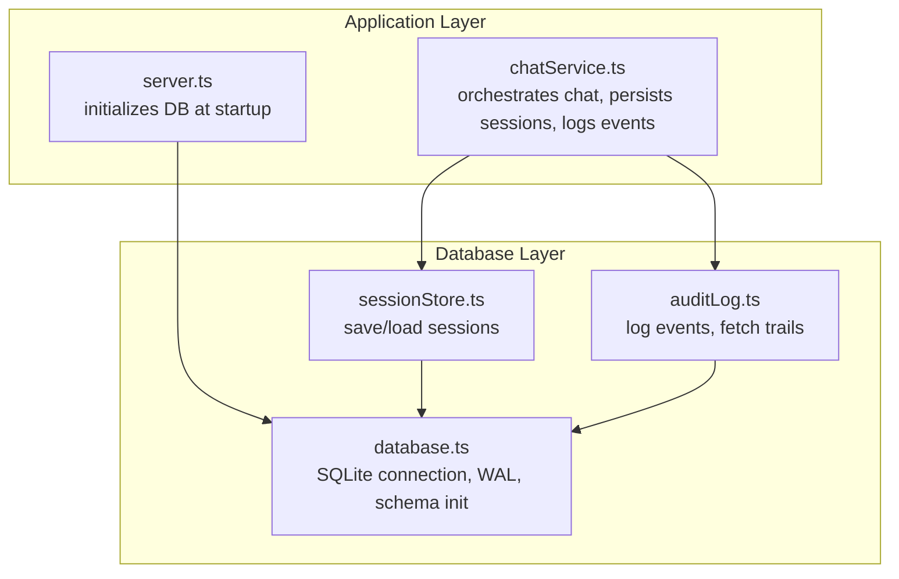
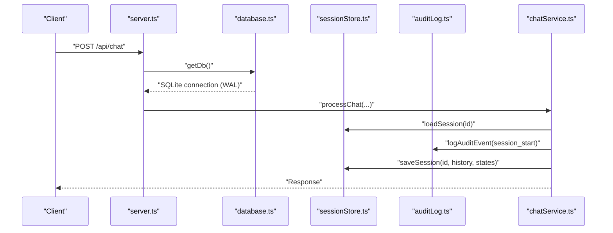
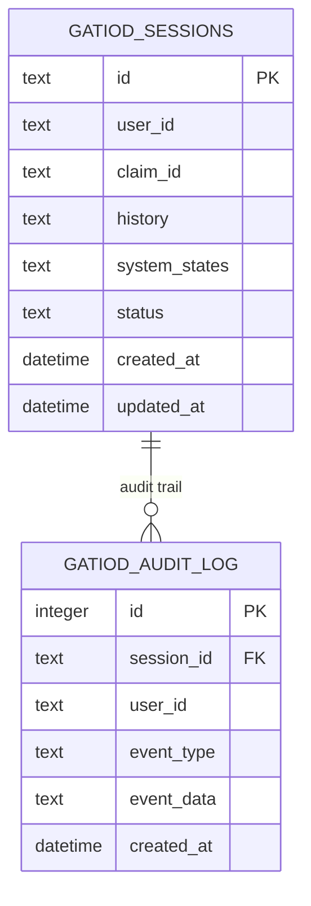
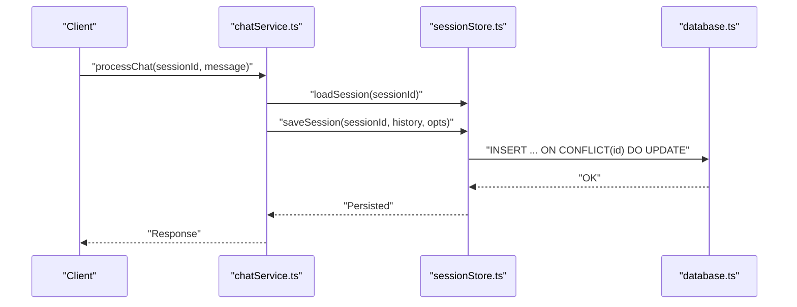
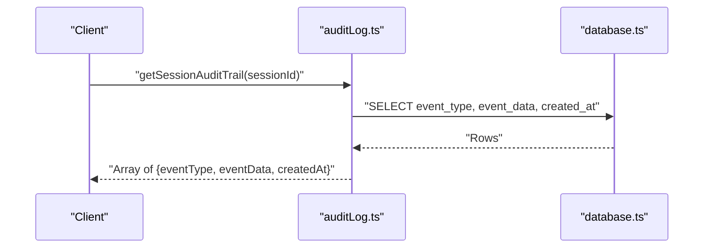
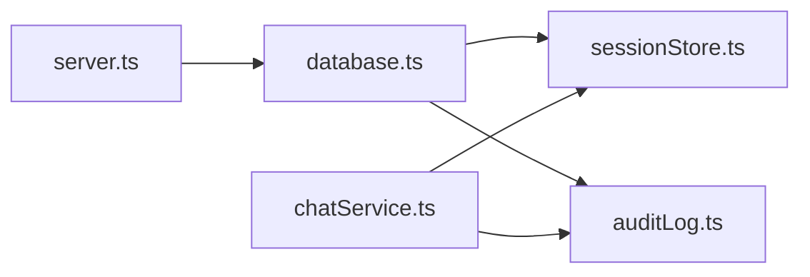

# Database Schema Design

<cite>
**Referenced Files in This Document**
- [database.ts](file://src/db/database.ts)
- [sessionStore.ts](file://src/db/sessionStore.ts)
- [auditLog.ts](file://src/db/auditLog.ts)
- [chatService.ts](file://src/chat/chatService.ts)
- [server.ts](file://src/server.ts)
</cite>

## Table of Contents
1. [Introduction](#introduction)
2. [Project Structure](#project-structure)
3. [Core Components](#core-components)
4. [Architecture Overview](#architecture-overview)
5. [Detailed Component Analysis](#detailed-component-analysis)
6. [Dependency Analysis](#dependency-analysis)
7. [Performance Considerations](#performance-considerations)
8. [Troubleshooting Guide](#troubleshooting-guide)
9. [Conclusion](#conclusion)
10. [Appendices](#appendices)

## Introduction
This document describes the SQLite-based database schema used by the GATIOD Chat Assistant. It covers the design of two core tables—gatiod_sessions and gatiod_audit_log—detailing fields, data types, constraints, indexes, and usage patterns. It also documents the initialization procedure, WAL mode configuration, and outlines a PostgreSQL-compatible migration strategy. The schema is optimized for chat session persistence and comprehensive audit logging, with JSON columns for flexible storage of conversation history and system state.

## Project Structure
The database layer is encapsulated under src/db and is initialized at server startup. The session store persists chat conversations, while the audit logger records events for traceability.

**Diagram sources**
- [database.ts:11-49](file://src/db/database.ts#L11-L49)
- [sessionStore.ts:21-109](file://src/db/sessionStore.ts#L21-L109)
- [auditLog.ts:58-90](file://src/db/auditLog.ts#L58-L90)
- [chatService.ts:38-182](file://src/chat/chatService.ts#L38-L182)
- [server.ts:39-43](file://src/server.ts#L39-L43)

**Section sources**
- [database.ts:11-49](file://src/db/database.ts#L11-L49)
- [server.ts:39-43](file://src/server.ts#L39-L43)

## Core Components
- gatiod_sessions: Stores chat session state, including conversation history and system states, with indexes for efficient lookups.
- gatiod_audit_log: Records every significant event in a session for compliance and traceability.

**Section sources**
- [database.ts:20-46](file://src/db/database.ts#L20-L46)

## Architecture Overview
The database is initialized on first use with WAL mode enabled and schema creation. The chat service uses the session store to persist and resume conversations and the audit logger to record events. The server ensures the database is ready before accepting requests.

**Diagram sources**
- [server.ts:39-43](file://src/server.ts#L39-L43)
- [database.ts:11-49](file://src/db/database.ts#L11-L49)
- [sessionStore.ts:69-84](file://src/db/sessionStore.ts#L69-L84)
- [auditLog.ts:58-73](file://src/db/auditLog.ts#L58-L73)
- [chatService.ts:38-127](file://src/chat/chatService.ts#L38-L127)

## Detailed Component Analysis

### gatiod_sessions Table
Purpose: Persist chat sessions with conversation history and system states.

Fields and constraints:
- id: TEXT PRIMARY KEY. Unique session identifier.
- user_id: TEXT. Optional user identifier.
- claim_id: TEXT. Optional claim identifier.
- history: TEXT NOT NULL DEFAULT '[]'. JSON-encoded array of conversation messages.
- system_states: TEXT NOT NULL DEFAULT '{}'. JSON-encoded object of system state.
- status: TEXT NOT NULL DEFAULT 'active'. Enum-like status: active, completed, abandoned.
- created_at: DATETIME DEFAULT CURRENT_TIMESTAMP. Automatic timestamp.
- updated_at: DATETIME DEFAULT CURRENT_TIMESTAMP. Automatic timestamp.

Indexes:
- idx_sessions_user(user_id)
- idx_sessions_claim(claim_id)
- idx_sessions_status(status)

Usage patterns:
- Insert or update a session with JSON history and system states.
- Load a session by id and parse JSON fields.
- Update status to completed or abandoned.
- List recent sessions for a user.

Constraints and defaults:
- JSON defaults ensure valid empty structures.
- Status defaults to active.
- Timestamps auto-populate on insert/update.

**Section sources**
- [database.ts:20-34](file://src/db/database.ts#L20-L34)
- [sessionStore.ts:21-44](file://src/db/sessionStore.ts#L21-L44)
- [sessionStore.ts:46-67](file://src/db/sessionStore.ts#L46-L67)
- [sessionStore.ts:69-84](file://src/db/sessionStore.ts#L69-L84)
- [sessionStore.ts:86-89](file://src/db/sessionStore.ts#L86-L89)
- [sessionStore.ts:91-94](file://src/db/sessionStore.ts#L91-L94)
- [sessionStore.ts:96-109](file://src/db/sessionStore.ts#L96-L109)

### gatiod_audit_log Table
Purpose: Record every significant event in a session for compliance and traceability.

Fields and constraints:
- id: INTEGER PRIMARY KEY AUTOINCREMENT. Auto-generated audit log entry ID.
- session_id: TEXT NOT NULL. Foreign key to gatiod_sessions.id.
- user_id: TEXT. Optional user identifier.
- event_type: TEXT NOT NULL. Event classification (see AuditEventType).
- event_data: TEXT NOT NULL DEFAULT '{}'. JSON-encoded payload for the event.
- created_at: DATETIME DEFAULT CURRENT_TIMESTAMP. Automatic timestamp.

Indexes:
- idx_audit_session(session_id)
- idx_audit_type(event_type)
- idx_audit_created(created_at)

Usage patterns:
- Insert audit entries with JSON event_data.
- Retrieve audit trail for a session ordered by created_at.

Constraints and defaults:
- JSON default ensures valid empty payload.
- Timestamps auto-populate.

**Section sources**
- [database.ts:35-46](file://src/db/database.ts#L35-L46)
- [auditLog.ts:51-56](file://src/db/auditLog.ts#L51-L56)
- [auditLog.ts:58-73](file://src/db/auditLog.ts#L58-L73)
- [auditLog.ts:75-90](file://src/db/auditLog.ts#L75-L90)

### Session Store Operations
- saveSession: Upserts session with JSON history and system states; updates timestamps and optional identifiers.
- saveSessionSystemStates: Upserts only system states and identifiers; updates timestamps.
- loadSession: Loads a session by id and parses JSON history and system states.
- deleteSession: Marks a session as abandoned.
- completeSession: Marks a session as completed.
- listSessionsForUser: Lists recent sessions for a user, ordered by updated_at descending.

**Section sources**
- [sessionStore.ts:21-44](file://src/db/sessionStore.ts#L21-L44)
- [sessionStore.ts:46-67](file://src/db/sessionStore.ts#L46-L67)
- [sessionStore.ts:69-84](file://src/db/sessionStore.ts#L69-L84)
- [sessionStore.ts:86-89](file://src/db/sessionStore.ts#L86-L89)
- [sessionStore.ts:91-94](file://src/db/sessionStore.ts#L91-L94)
- [sessionStore.ts:96-109](file://src/db/sessionStore.ts#L96-L109)

### Audit Logging
- logAuditEvent: Inserts an audit entry with JSON event_data; errors are caught to avoid crashing the main flow.
- getSessionAuditTrail: Retrieves audit entries for a session ordered chronologically.

**Section sources**
- [auditLog.ts:58-73](file://src/db/auditLog.ts#L58-L73)
- [auditLog.ts:75-90](file://src/db/auditLog.ts#L75-L90)

### Database Initialization and WAL Mode
- Connection: better-sqlite3 client with a configurable path.
- WAL Mode: Enabled via PRAGMA journal_mode=WAL.
- Busy Timeout: PRAGMA busy_timeout set to 5000 ms.
- Schema Creation: Creates tables and indexes if they do not exist.
- Indexes: Created for user_id, claim_id, status on sessions; session_id, event_type, created_at on audit log.

**Section sources**
- [database.ts:11-18](file://src/db/database.ts#L11-L18)
- [database.ts:20-46](file://src/db/database.ts#L20-L46)

### Chat Service Integration
- Initializes database at server startup.
- Logs session_start and user_message events.
- Persists session state before calling the LLM to ensure resilience.
- Logs assistant_message, tool_call, calculation_result, and error events.
- Supports session reset and completion.

**Section sources**
- [server.ts:39-43](file://src/server.ts#L39-L43)
- [chatService.ts:38-127](file://src/chat/chatService.ts#L38-L127)
- [chatService.ts:174-182](file://src/chat/chatService.ts#L174-L182)

## Architecture Overview

**Diagram sources**
- [database.ts:20-46](file://src/db/database.ts#L20-L46)

## Detailed Component Analysis

### Session Persistence Flow

**Diagram sources**
- [chatService.ts:38-127](file://src/chat/chatService.ts#L38-L127)
- [sessionStore.ts:21-44](file://src/db/sessionStore.ts#L21-L44)

### Audit Trail Retrieval Flow

**Diagram sources**
- [auditLog.ts:75-90](file://src/db/auditLog.ts#L75-L90)
- [database.ts:35-46](file://src/db/database.ts#L35-L46)

### Index Strategy and Performance
- gatiod_sessions:
  - idx_sessions_user(user_id): Efficiently list user sessions.
  - idx_sessions_claim(claim_id): Efficiently filter by claim.
  - idx_sessions_status(status): Efficiently filter by status.
- gatiod_audit_log:
  - idx_audit_session(session_id): Fast per-session audit retrieval.
  - idx_audit_type(event_type): Filter by event type.
  - idx_audit_created(created_at): Chronological ordering and time-range queries.

These indexes support typical read patterns: listing recent sessions for a user, retrieving audit trails, and filtering by status or event type.

**Section sources**
- [database.ts:31-45](file://src/db/database.ts#L31-L45)
- [sessionStore.ts:96-109](file://src/db/sessionStore.ts#L96-L109)
- [auditLog.ts:75-90](file://src/db/auditLog.ts#L75-L90)

## Dependency Analysis

**Diagram sources**
- [database.ts:11-49](file://src/db/database.ts#L11-L49)
- [sessionStore.ts:8](file://src/db/sessionStore.ts#L8)
- [auditLog.ts:6](file://src/db/auditLog.ts#L6)
- [chatService.ts:16-17](file://src/chat/chatService.ts#L16-L17)
- [server.ts:11](file://src/server.ts#L11)

**Section sources**
- [sessionStore.ts:8](file://src/db/sessionStore.ts#L8)
- [auditLog.ts:6](file://src/db/auditLog.ts#L6)
- [chatService.ts:16-17](file://src/chat/chatService.ts#L16-L17)
- [server.ts:11](file://src/server.ts#L11)

## Performance Considerations
- WAL Mode: Improves concurrency and reduces write contention.
- Busy Timeout: Prevents immediate failures under contention.
- JSON Columns: Efficient for flexible data but consider size limits and indexing strategies for large histories.
- Indexes: Maintain read performance for common queries; monitor write overhead during frequent upserts.
- JSON Parsing: Occurs on load/save; keep JSON payloads reasonable to avoid memory pressure.

[No sources needed since this section provides general guidance]

## Troubleshooting Guide
- Database Path: Ensure GATIOD_DB_PATH is set appropriately; otherwise, the default path is used.
- WAL Mode: If encountering locking issues, confirm journal_mode=WAL is active.
- JSON Parsing Errors: Verify that history and system_states are valid JSON; invalid JSON will cause parse errors on load.
- Audit Logging Failures: The audit logger catches errors to prevent impacting the main flow; check console for "[Audit] Failed to log event:" messages.

**Section sources**
- [database.ts:14](file://src/db/database.ts#L14)
- [database.ts:16](file://src/db/database.ts#L16)
- [auditLog.ts:69-72](file://src/db/auditLog.ts#L69-L72)

## Conclusion
The GATIOD Chat Assistant uses a compact, PostgreSQL-compatible SQLite schema optimized for chat session persistence and comprehensive audit logging. The design leverages JSON columns for flexibility, WAL mode for concurrency, and targeted indexes for performance. The initialization and usage patterns ensure reliability and traceability across chat interactions.

[No sources needed since this section summarizes without analyzing specific files]

## Appendices

### PostgreSQL-Compatible Migration Strategy
- Data Types:
  - TEXT for identifiers and JSON fields.
  - DATETIME for timestamps; equivalent to PostgreSQL TIMESTAMPTZ or TIMESTAMP.
- Constraints:
  - PRIMARY KEY and NOT NULL defaults mirror PostgreSQL constraints.
  - JSON defaults ensure valid empty structures.
- Indexes:
  - Maintain equivalent indexes on PostgreSQL for performance parity.
- WAL Mode:
  - PostgreSQL does not use WAL mode; ensure concurrent writes are handled via application-level strategies if needed.
- Foreign Keys:
  - No explicit foreign keys are defined; consider adding a foreign key from gatiod_audit_log.session_id to gatiod_sessions.id for referential integrity if desired.

[No sources needed since this section provides general guidance]