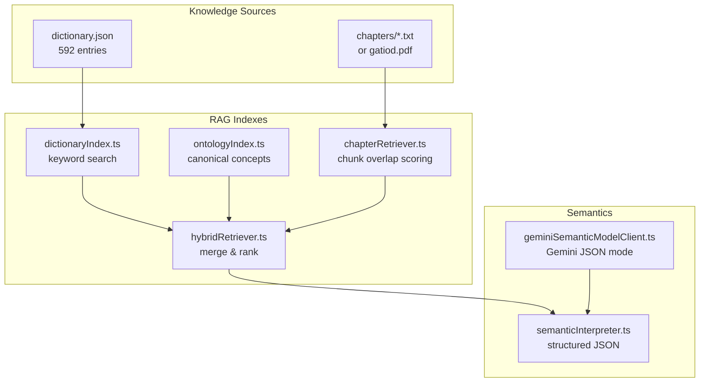
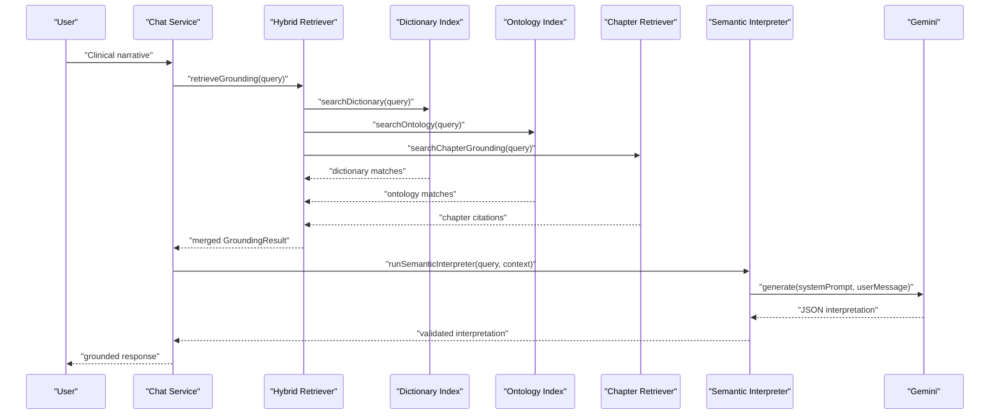
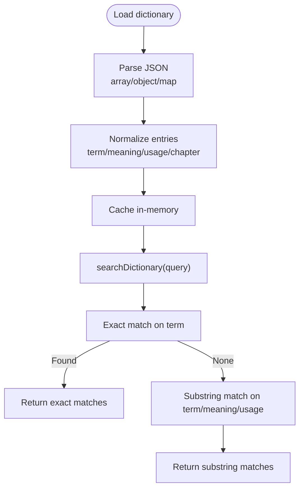
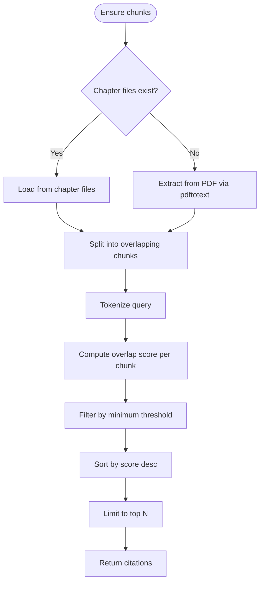
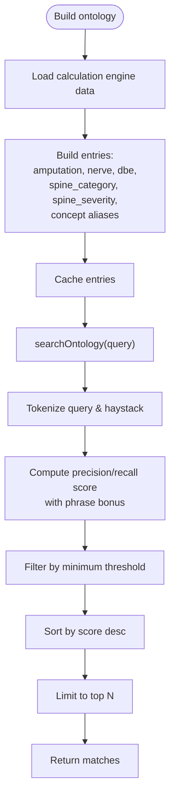
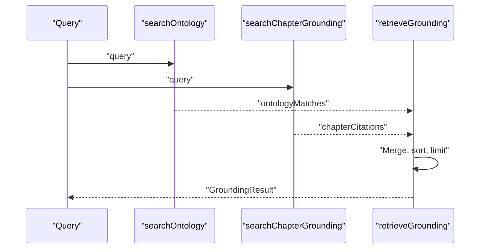
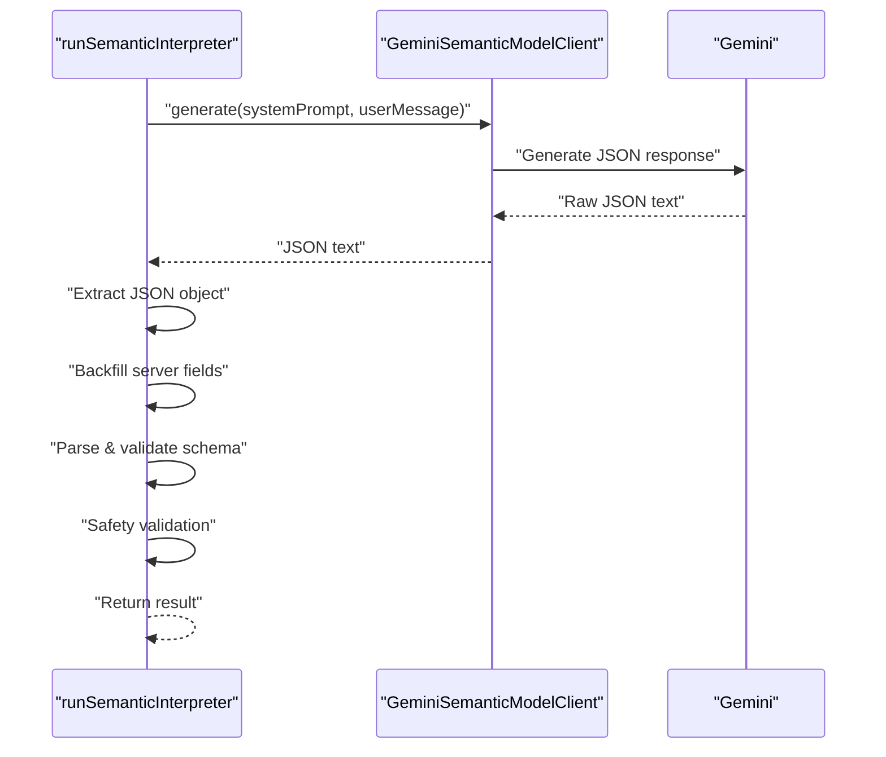
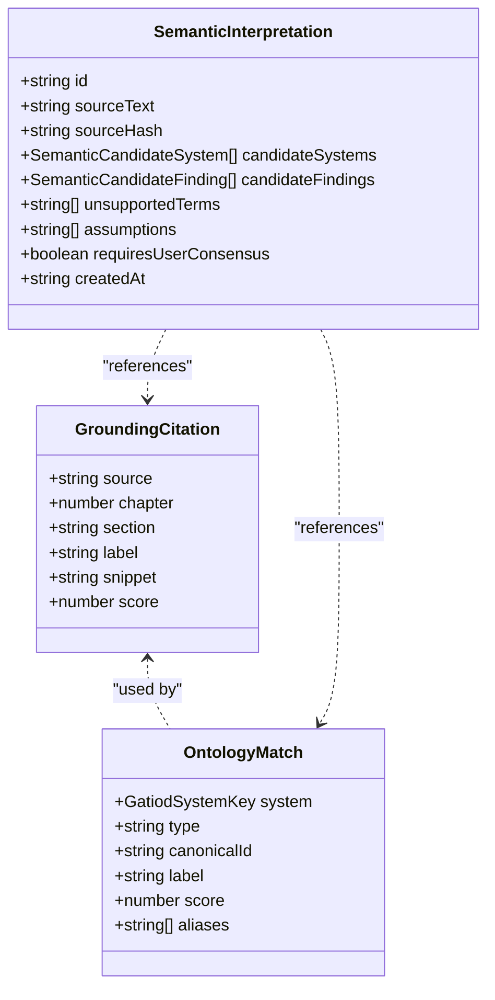
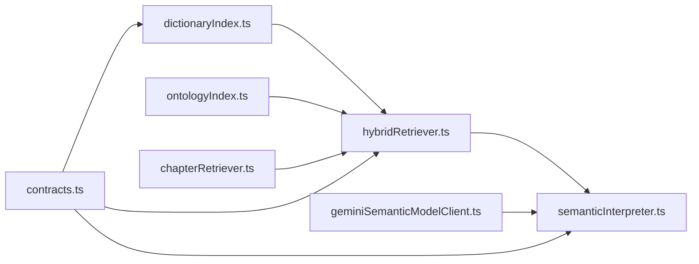

# Dictionary and Knowledge Base

<cite>
**Referenced Files in This Document**
- [dictionaryIndex.ts](file://src/rag/dictionaryIndex.ts)
- [dictionary.json](file://knowledge/dictionary.json)
- [chapterRetriever.ts](file://src/v2/chapterRetriever.ts)
- [ontologyIndex.ts](file://src/v2/ontologyIndex.ts)
- [hybridRetriever.ts](file://src/v2/hybridRetriever.ts)
- [geminiSemanticModelClient.ts](file://src/v2/geminiSemanticModelClient.ts)
- [semanticInterpreter.ts](file://src/v2/semanticInterpreter.ts)
- [contracts.ts](file://src/v2/contracts.ts)
- [systemSynonyms.ts](file://src/v2/systemSynonyms.ts)
- [README.md](file://README.md)
- [0003-semantic-consensus-architecture.md](file://docs/adr/0003-semantic-consensus-architecture.md)
</cite>

## Table of Contents
1. [Introduction](#introduction)
2. [Project Structure](#project-structure)
3. [Core Components](#core-components)
4. [Architecture Overview](#architecture-overview)
5. [Detailed Component Analysis](#detailed-component-analysis)
6. [Dependency Analysis](#dependency-analysis)
7. [Performance Considerations](#performance-considerations)
8. [Troubleshooting Guide](#troubleshooting-guide)
9. [Conclusion](#conclusion)
10. [Appendices](#appendices)

## Introduction
This document describes the dictionary and knowledge base management system that powers the Retrieval-Augmented Generation (RAG) framework within the GATIOD chat assistant. It explains how the dictionary is structured and searched, how chapter-based content is indexed and grounded, and how the semantic consensus layer integrates with the Gemini LLM to improve clinical understanding. It also documents maintenance procedures, update mechanisms, and version control considerations, along with practical examples of dictionary queries, semantic searches, and knowledge base expansion patterns.

## Project Structure
The knowledge base spans two primary sources:
- A 592-entry dictionary JSON containing clinical terminology, categories, usage notes, and chapter references.
- Chapter-based textual content organized into numbered chapters, parsed and chunked for semantic grounding.

These are consumed by:
- A simple dictionary search module for keyword-based lookups.
- An ontology index that builds canonical concepts from the calculation engine data.
- A chapter retriever that segments PDF or chapter files into overlapping chunks and computes overlap scores.
- A hybrid retriever that merges both sources and ranks results.
- A semantic interpreter that leverages Gemini to propose multi-system interpretations and grounding.

**Diagram sources**
- [dictionaryIndex.ts:1-75](file://src/rag/dictionaryIndex.ts#L1-L75)
- [ontologyIndex.ts:1-210](file://src/v2/ontologyIndex.ts#L1-L210)
- [chapterRetriever.ts:1-132](file://src/v2/chapterRetriever.ts#L1-L132)
- [hybridRetriever.ts:1-25](file://src/v2/hybridRetriever.ts#L1-L25)
- [geminiSemanticModelClient.ts:1-74](file://src/v2/geminiSemanticModelClient.ts#L1-L74)
- [semanticInterpreter.ts:1-218](file://src/v2/semanticInterpreter.ts#L1-L218)

**Section sources**
- [README.md:1-77](file://README.md#L1-L77)

## Core Components
- Dictionary index: Loads and searches the dictionary JSON with exact and substring matching across term, meaning, and usage fields.
- Chapter retriever: Parses chapter text from files or PDF, splits into overlapping chunks, and computes overlap-based scores.
- Ontology index: Builds canonical concepts from calculation engine data and curated synonyms, enabling robust semantic matching.
- Hybrid retriever: Merges chapter and ontology results, sorts by score, and returns a ranked set of citations.
- Semantic interpreter: Orchestrates Gemini to produce a structured interpretation JSON, validates it, and enforces safety constraints.
- Contracts: Defines grounding and semantic types used across the RAG and semantic layers.

**Section sources**
- [dictionaryIndex.ts:1-75](file://src/rag/dictionaryIndex.ts#L1-L75)
- [chapterRetriever.ts:1-132](file://src/v2/chapterRetriever.ts#L1-L132)
- [ontologyIndex.ts:1-210](file://src/v2/ontologyIndex.ts#L1-L210)
- [hybridRetriever.ts:1-25](file://src/v2/hybridRetriever.ts#L1-L25)
- [semanticInterpreter.ts:1-218](file://src/v2/semanticInterpreter.ts#L1-L218)
- [contracts.ts:121-142](file://src/v2/contracts.ts#L121-L142)

## Architecture Overview
The RAG pipeline integrates dictionary, chapter, and ontology sources to ground conversations and feed the semantic interpreter. The hybrid retriever consolidates results and provides citations with chapter and score metadata. The semantic interpreter uses Gemini to propose multi-system interpretations and grounding, enforcing strict schema and safety constraints.

**Diagram sources**
- [hybridRetriever.ts:5-24](file://src/v2/hybridRetriever.ts#L5-L24)
- [dictionaryIndex.ts:59-74](file://src/rag/dictionaryIndex.ts#L59-L74)
- [ontologyIndex.ts:191-209](file://src/v2/ontologyIndex.ts#L191-L209)
- [chapterRetriever.ts:113-131](file://src/v2/chapterRetriever.ts#L113-L131)
- [semanticInterpreter.ts:145-217](file://src/v2/semanticInterpreter.ts#L145-L217)
- [geminiSemanticModelClient.ts:46-72](file://src/v2/geminiSemanticModelClient.ts#L46-L72)

## Detailed Component Analysis

### Dictionary Index
The dictionary index loads a JSON file containing clinical terms and metadata, normalizes it into a canonical structure, and supports exact and substring matching across term, meaning, and usage fields. It is optimized for MVP and will be superseded by a hybrid retriever in future iterations.

**Diagram sources**
- [dictionaryIndex.ts:19-74](file://src/rag/dictionaryIndex.ts#L19-L74)

**Section sources**
- [dictionaryIndex.ts:1-75](file://src/rag/dictionaryIndex.ts#L1-L75)
- [dictionary.json:1-800](file://knowledge/dictionary.json#L1-L800)

### Chapter Retriever
The chapter retriever parses chapter text from either chapter files or a PDF, splits content into overlapping chunks, and computes an overlap score against the query. It exposes a function to return top citations with chapter, section, label, snippet, and score.

**Diagram sources**
- [chapterRetriever.ts:80-131](file://src/v2/chapterRetriever.ts#L80-L131)

**Section sources**
- [chapterRetriever.ts:1-132](file://src/v2/chapterRetriever.ts#L1-L132)

### Ontology Index
The ontology index builds canonical concepts from calculation engine data and curated synonyms. It constructs entries for amputations, nerves, DBe conditions, spine categories and severities, and concept aliases, then scores matches using a precision/recall-based metric with bonus for exact phrase matches.

**Diagram sources**
- [ontologyIndex.ts:50-209](file://src/v2/ontologyIndex.ts#L50-L209)

**Section sources**
- [ontologyIndex.ts:1-210](file://src/v2/ontologyIndex.ts#L1-L210)
- [systemSynonyms.ts:1-374](file://src/v2/systemSynonyms.ts#L1-L374)

### Hybrid Retriever
The hybrid retriever aggregates results from the chapter retriever and the ontology index, merges them, sorts by score, and returns a capped set of citations. It also returns the raw ontology matches for downstream use.

**Diagram sources**
- [hybridRetriever.ts:5-24](file://src/v2/hybridRetriever.ts#L5-L24)

**Section sources**
- [hybridRetriever.ts:1-25](file://src/v2/hybridRetriever.ts#L1-L25)

### Semantic Interpreter and Gemini Integration
The semantic interpreter orchestrates a schema-constrained JSON call to Gemini, parses and validates the output, and enforces safety constraints. The Gemini client configures JSON mode and deterministic temperature.

**Diagram sources**
- [semanticInterpreter.ts:145-217](file://src/v2/semanticInterpreter.ts#L145-L217)
- [geminiSemanticModelClient.ts:46-72](file://src/v2/geminiSemanticModelClient.ts#L46-L72)

**Section sources**
- [semanticInterpreter.ts:1-218](file://src/v2/semanticInterpreter.ts#L1-L218)
- [geminiSemanticModelClient.ts:1-74](file://src/v2/geminiSemanticModelClient.ts#L1-L74)
- [0003-semantic-consensus-architecture.md:1-98](file://docs/adr/0003-semantic-consensus-architecture.md#L1-L98)

### Contracts and Types
Contracts define the shapes for grounding citations, ontology matches, and semantic interpretations. These types enable consistent integration across the RAG and semantic layers.

**Diagram sources**
- [contracts.ts:121-142](file://src/v2/contracts.ts#L121-L142)
- [contracts.ts:372-383](file://src/v2/contracts.ts#L372-L383)

**Section sources**
- [contracts.ts:121-142](file://src/v2/contracts.ts#L121-L142)
- [contracts.ts:372-383](file://src/v2/contracts.ts#L372-L383)

## Dependency Analysis
The hybrid retriever depends on the chapter retriever and the ontology index. The semantic interpreter depends on the Gemini client and the contracts/types. The dictionary index is independent but integrated into the hybrid retriever’s merging logic.

**Diagram sources**
- [hybridRetriever.ts:1-25](file://src/v2/hybridRetriever.ts#L1-L25)
- [ontologyIndex.ts:1-210](file://src/v2/ontologyIndex.ts#L1-L210)
- [chapterRetriever.ts:1-132](file://src/v2/chapterRetriever.ts#L1-L132)
- [semanticInterpreter.ts:1-218](file://src/v2/semanticInterpreter.ts#L1-L218)
- [geminiSemanticModelClient.ts:1-74](file://src/v2/geminiSemanticModelClient.ts#L1-L74)
- [contracts.ts:121-142](file://src/v2/contracts.ts#L121-L142)

**Section sources**
- [hybridRetriever.ts:1-25](file://src/v2/hybridRetriever.ts#L1-L25)
- [semanticInterpreter.ts:1-218](file://src/v2/semanticInterpreter.ts#L1-L218)

## Performance Considerations
- Dictionary search: Linear scan over ~592 entries; acceptable for MVP. Consider inverted indices or vector embeddings for larger dictionaries.
- Chapter chunking: Overlapping windows reduce fragmentation but increase chunk count; tune chunk size and overlap ratio for latency vs. recall trade-offs.
- Ontology scoring: Token overlap and precision/recall scoring are linear in token counts; cache and reuse token sets to minimize recomputation.
- Hybrid ranking: Merge and sort are O(n log n); cap limits reduce cost.
- LLM calls: Deterministic temperature and JSON mode reduce variability; batch and cache where feasible.

[No sources needed since this section provides general guidance]

## Troubleshooting Guide
Common issues and resolutions:
- Empty dictionary results: Verify the dictionary file path and format; the loader logs a warning and returns an empty set if parsing fails.
- Missing chapter files: Ensure chapter text files exist or that a PDF is available; the retriever falls back to PDF extraction.
- Low semantic scores: Increase query specificity or adjust thresholds; review the similarity candidates from the synonym table.
- LLM errors: Check API key configuration and network connectivity; the semantic interpreter surfaces model call failures and schema/safety validation issues.

**Section sources**
- [dictionaryIndex.ts:22-54](file://src/rag/dictionaryIndex.ts#L22-L54)
- [chapterRetriever.ts:65-78](file://src/v2/chapterRetriever.ts#L65-L78)
- [semanticInterpreter.ts:171-177](file://src/v2/semanticInterpreter.ts#L171-L177)

## Conclusion
The dictionary and knowledge base management system provides a layered approach to clinical understanding: a simple dictionary for keyword-based lookups, an ontology of canonical concepts for robust semantic matching, and chapter-based grounding for contextual accuracy. The hybrid retriever merges these sources and feeds the semantic interpreter, which leverages Gemini to propose multi-system interpretations with strict schema and safety controls. This foundation supports scalable maintenance, updates, and version control through clear separation of concerns and type-safe contracts.

[No sources needed since this section summarizes without analyzing specific files]

## Appendices

### Dictionary Structure and Categories
The dictionary includes categories such as acronyms, anatomy terms, assessment methods/tools, formulas, and system-specific terms. Each entry typically includes:
- term: Canonical or preferred term
- meaning: Plain-English definition
- usage: How the guide uses the term
- category: Category tag
- chapter: Chapter or section reference

Examples of categories and representative entries are documented in the dictionary JSON.

**Section sources**
- [dictionary.json:1-800](file://knowledge/dictionary.json#L1-L800)

### Chapter-Based Organization and Cross-References
Chapters are parsed from either individual chapter files or a PDF. Each chapter is segmented into overlapping chunks to improve recall. Citations include chapter, section, label, snippet, and score, enabling precise cross-references to the source material.

**Section sources**
- [chapterRetriever.ts:15-40](file://src/v2/chapterRetriever.ts#L15-L40)
- [chapterRetriever.ts:113-131](file://src/v2/chapterRetriever.ts#L113-L131)

### Semantic Relationships and Synonyms
The system maintains a curated synonym table mapping terms to systems with confidence scores. This enables:
- Keyword-based routing
- Similar-term suggestions for unresolved tokens
- Concept aliases for canonical matching

**Section sources**
- [systemSynonyms.ts:1-374](file://src/v2/systemSynonyms.ts#L1-L374)
- [ontologyIndex.ts:148-168](file://src/v2/ontologyIndex.ts#L148-L168)

### Examples and Expansion Patterns
- Dictionary queries: Search for terms, meanings, or usage notes; exact match prioritized, followed by substring matches.
- Semantic searches: Use the hybrid retriever to combine chapter and ontology signals; adjust thresholds and limits as needed.
- Knowledge base expansion: Add new dictionary entries, expand chapter files, or introduce new canonical concepts in the ontology; maintain consistent categories and chapter references.

**Section sources**
- [dictionaryIndex.ts:59-74](file://src/rag/dictionaryIndex.ts#L59-L74)
- [hybridRetriever.ts:5-24](file://src/v2/hybridRetriever.ts#L5-L24)
- [ontologyIndex.ts:50-168](file://src/v2/ontologyIndex.ts#L50-L168)