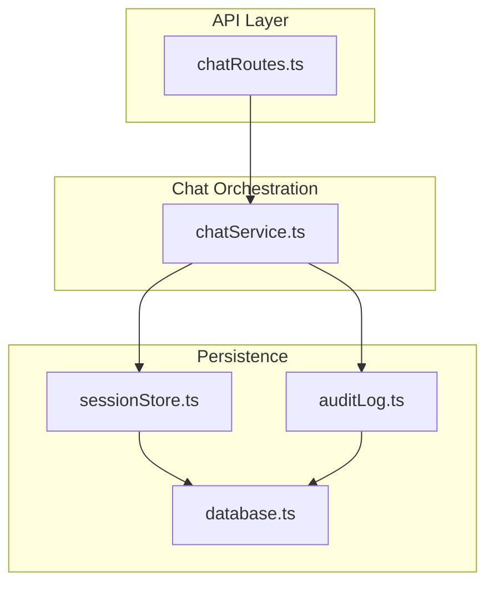
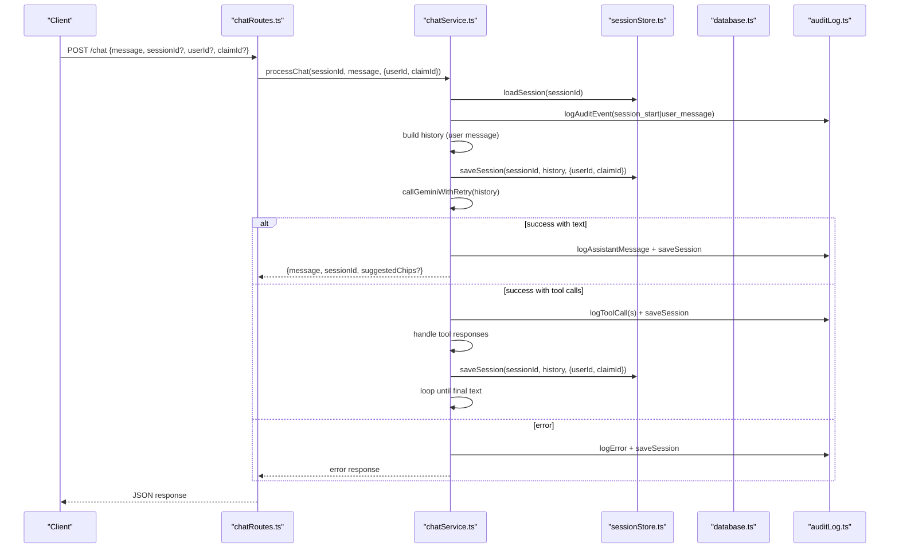
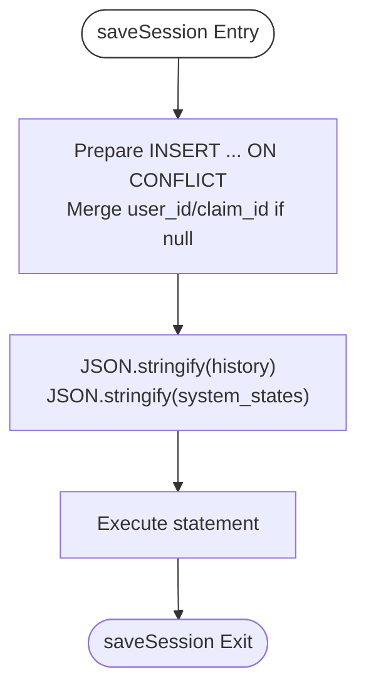
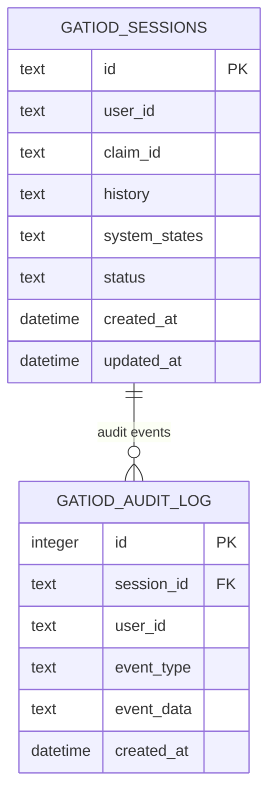
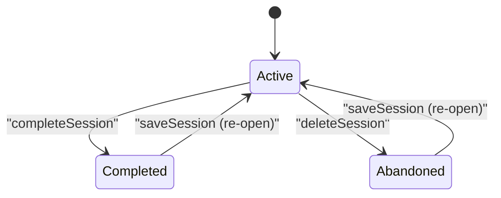
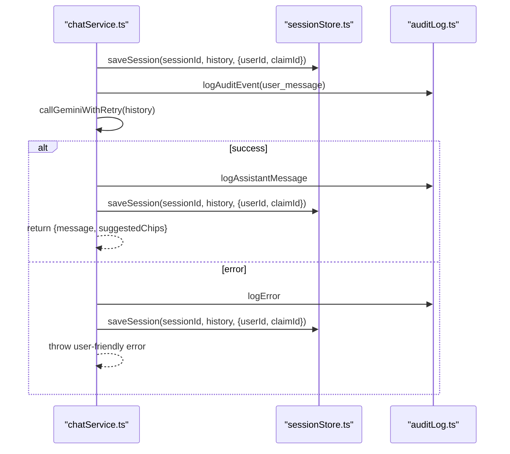
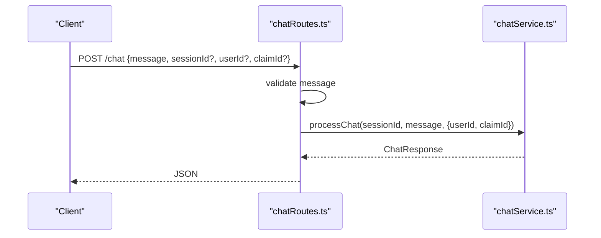
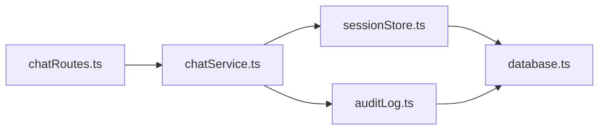

# Session Storage

<cite>
**Referenced Files in This Document**
- [sessionStore.ts](file://src/db/sessionStore.ts)
- [database.ts](file://src/db/database.ts)
- [chatService.ts](file://src/chat/chatService.ts)
- [chatRoutes.ts](file://src/api/chatRoutes.ts)
- [auditLog.ts](file://src/db/auditLog.ts)
</cite>

## Table of Contents
1. [Introduction](#introduction)
2. [Project Structure](#project-structure)
3. [Core Components](#core-components)
4. [Architecture Overview](#architecture-overview)
5. [Detailed Component Analysis](#detailed-component-analysis)
6. [Dependency Analysis](#dependency-analysis)
7. [Performance Considerations](#performance-considerations)
8. [Troubleshooting Guide](#troubleshooting-guide)
9. [Conclusion](#conclusion)

## Introduction
This document explains the session storage system that powers chat-assessment workflows. It covers session lifecycle management, persistence and retrieval, the session store interface, JSON serialization for chat history and system states, status management, user and claim associations, cleanup policies, concurrency and memory considerations, encryption and validation, error recovery, and practical integration patterns with the chat service.

## Project Structure
The session storage system is implemented in the database layer and integrated with the chat service and API routes:
- Database layer initializes SQLite tables and indexes, and exposes a singleton connection.
- Session store provides CRUD-like operations backed by SQL tables.
- Chat service orchestrates model calls, persists sessions before and after interactions, and manages session status transitions.
- API routes accept requests, validate inputs, and delegate to the chat service.

**Diagram sources**
- [chatRoutes.ts:14-90](file://src/api/chatRoutes.ts#L14-L90)
- [chatService.ts:38-182](file://src/chat/chatService.ts#L38-L182)
- [sessionStore.ts:21-109](file://src/db/sessionStore.ts#L21-L109)
- [database.ts:11-49](file://src/db/database.ts#L11-L49)
- [auditLog.ts:58-90](file://src/db/auditLog.ts#L58-L90)

**Section sources**
- [chatRoutes.ts:14-90](file://src/api/chatRoutes.ts#L14-L90)
- [chatService.ts:38-182](file://src/chat/chatService.ts#L38-L182)
- [sessionStore.ts:21-109](file://src/db/sessionStore.ts#L21-L109)
- [database.ts:11-49](file://src/db/database.ts#L11-L49)
- [auditLog.ts:58-90](file://src/db/auditLog.ts#L58-L90)

## Core Components
- Session store interface
  - Save session with chat history and optional user/claim association.
  - Save system states independently.
  - Load session by ID.
  - Delete session (mark abandoned).
  - Complete session (mark completed).
  - List sessions for a user.
- Database layer
  - Singleton connection with WAL mode and busy timeout.
  - Initializes session and audit tables with appropriate indexes.
- Chat service
  - Orchestrates model interactions, persists before/after calls, logs audit events, and recovers from transient errors.
- Audit logging
  - Records every significant event for traceability.

**Section sources**
- [sessionStore.ts:21-109](file://src/db/sessionStore.ts#L21-L109)
- [database.ts:11-49](file://src/db/database.ts#L11-L49)
- [chatService.ts:38-182](file://src/chat/chatService.ts#L38-L182)
- [auditLog.ts:58-90](file://src/db/auditLog.ts#L58-L90)

## Architecture Overview
The session lifecycle is centered around a single relational table with JSON columns for history and system states. The chat service ensures resilience by persisting sessions before and after model calls, enabling recovery from transient failures. Status flags enable completion and abandonment semantics. Audit logging provides a complete trace of events for compliance.

**Diagram sources**
- [chatRoutes.ts:14-66](file://src/api/chatRoutes.ts#L14-L66)
- [chatService.ts:38-154](file://src/chat/chatService.ts#L38-L154)
- [sessionStore.ts:21-84](file://src/db/sessionStore.ts#L21-L84)
- [auditLog.ts:58-73](file://src/db/auditLog.ts#L58-L73)

## Detailed Component Analysis

### Session Store Interface
The session store defines the contract for session persistence and retrieval:
- saveSession(sessionId, history, opts?)
  - Inserts or updates a session record with JSON-serialized history and system states.
  - Upserts on conflict by ID; merges user_id and claim_id if provided.
  - Updates timestamps on each write.
- saveSessionSystemStates(sessionId, systemStates, opts?)
  - Upserts system states only; merges user_id and claim_id if provided.
- loadSession(sessionId)
  - Loads a session by ID and parses JSON history and system states.
- deleteSession(sessionId)
  - Marks a session as abandoned.
- completeSession(sessionId)
  - Marks a session as completed and updates timestamp.
- listSessionsForUser(userId)
  - Lists recent sessions for a user, ordered by last update.

**Diagram sources**
- [sessionStore.ts:21-44](file://src/db/sessionStore.ts#L21-L44)

**Section sources**
- [sessionStore.ts:21-109](file://src/db/sessionStore.ts#L21-L109)

### Session Data Model and Serialization
- Table: gatiod_sessions
  - Columns include id (PK), user_id, claim_id, history (JSON), system_states (JSON), status, created_at, updated_at.
- Serialization
  - history and system_states are stored as JSON strings and parsed on load.
- Indexes
  - Indexes on user_id, claim_id, and status optimize queries for user sessions and filtering.

**Diagram sources**
- [database.ts:20-46](file://src/db/database.ts#L20-L46)

**Section sources**
- [database.ts:20-46](file://src/db/database.ts#L20-L46)
- [sessionStore.ts:74-83](file://src/db/sessionStore.ts#L74-L83)

### Session Lifecycle Management
- Creation and updates
  - New sessions are created implicitly on first save; subsequent writes update history and states.
- Completion and abandonment
  - completeSession marks a session completed with updated timestamp.
  - deleteSession marks a session abandoned.
- Retrieval and listing
  - loadSession fetches a single session by ID.
  - listSessionsForUser lists recent sessions for a given user.

**Diagram sources**
- [sessionStore.ts:86-94](file://src/db/sessionStore.ts#L86-L94)

**Section sources**
- [sessionStore.ts:86-109](file://src/db/sessionStore.ts#L86-L109)

### Integration with Chat Service
- Before model calls
  - The chat service persists the current history to ensure continuity if the model call fails.
- During model loops
  - After receiving text responses, the service extracts chips, appends to history, logs audit events, and persists again.
- Error handling
  - On transient errors (rate limit, quota, timeout), the service logs the error and persists the session before returning a user-friendly message.
- Session reset
  - clearSession logs a reset event and marks the session as abandoned.

**Diagram sources**
- [chatService.ts:52-154](file://src/chat/chatService.ts#L52-L154)
- [sessionStore.ts:21-44](file://src/db/sessionStore.ts#L21-L44)
- [auditLog.ts:58-73](file://src/db/auditLog.ts#L58-L73)

**Section sources**
- [chatService.ts:38-182](file://src/chat/chatService.ts#L38-L182)
- [sessionStore.ts:21-84](file://src/db/sessionStore.ts#L21-L84)
- [auditLog.ts:58-73](file://src/db/auditLog.ts#L58-L73)

### API Integration
- POST /chat
  - Validates message presence, generates sessionId if missing, and delegates to processChat.
  - Mirrors production traffic through a shadow v2 pipeline when enabled.
- POST /chat/reset
  - Clears a session by marking it abandoned.
- GET /chat/audit/:sessionId
  - Returns the audit trail for a session.
- GET /chat/sessions/:userId
  - Returns recent sessions for a user.

**Diagram sources**
- [chatRoutes.ts:14-66](file://src/api/chatRoutes.ts#L14-L66)
- [chatService.ts:38-154](file://src/chat/chatService.ts#L38-L154)

**Section sources**
- [chatRoutes.ts:14-90](file://src/api/chatRoutes.ts#L14-L90)

## Dependency Analysis
- sessionStore.ts depends on database.ts for the connection and schema.
- chatService.ts depends on sessionStore.ts and auditLog.ts for persistence and auditing.
- chatRoutes.ts depends on chatService.ts for orchestration and on sessionStore.ts for listing sessions.

**Diagram sources**
- [chatRoutes.ts:14-90](file://src/api/chatRoutes.ts#L14-L90)
- [chatService.ts:38-182](file://src/chat/chatService.ts#L38-L182)
- [sessionStore.ts:21-109](file://src/db/sessionStore.ts#L21-L109)
- [auditLog.ts:58-90](file://src/db/auditLog.ts#L58-L90)
- [database.ts:11-49](file://src/db/database.ts#L11-L49)

**Section sources**
- [chatRoutes.ts:14-90](file://src/api/chatRoutes.ts#L14-L90)
- [chatService.ts:38-182](file://src/chat/chatService.ts#L38-L182)
- [sessionStore.ts:21-109](file://src/db/sessionStore.ts#L21-L109)
- [auditLog.ts:58-90](file://src/db/auditLog.ts#L58-L90)
- [database.ts:11-49](file://src/db/database.ts#L11-L49)

## Performance Considerations
- Database tuning
  - WAL mode improves concurrency and write throughput.
  - Busy timeout prevents immediate failures under contention.
- Indexing
  - Indexes on user_id, claim_id, and status accelerate user session listing and filtering.
- JSON columns
  - History and system states are stored as JSON; keep serialized payloads reasonable to avoid large reads/writes.
- Retry strategy
  - The chat service retries transient model errors with exponential backoff to reduce wasted work and improve reliability.

[No sources needed since this section provides general guidance]

## Troubleshooting Guide
- Session not found
  - loadSession returns null when no record exists; ensure sessionId is correct and the session was saved.
- Persistence failures
  - If a model call fails, the chat service persists the session before throwing; check audit logs for error events.
- Rate limits and timeouts
  - Transient errors are caught and surfaced as user-friendly messages; the session remains intact for continuation.
- Audit trail verification
  - Use GET /chat/audit/:sessionId to inspect all recorded events for traceability.

**Section sources**
- [chatService.ts:82-96](file://src/chat/chatService.ts#L82-L96)
- [auditLog.ts:75-90](file://src/db/auditLog.ts#L75-L90)

## Conclusion
The session storage system provides robust, JSON-serialized persistence for chat-assessment sessions with clear lifecycle controls, user and claim associations, and comprehensive audit logging. Its integration with the chat service ensures resilience against transient failures and enables practical session management for both single-turn and multi-turn conversations.