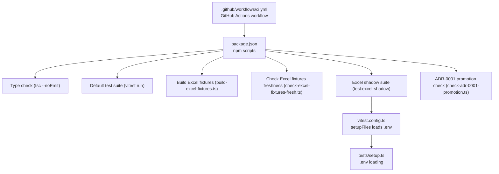
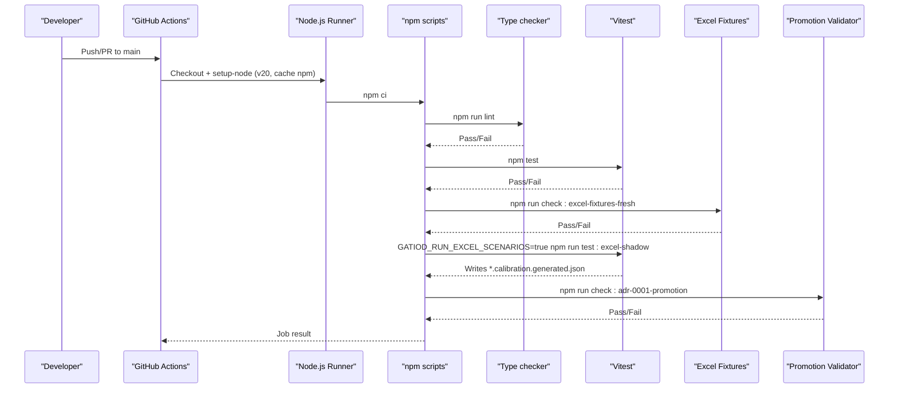
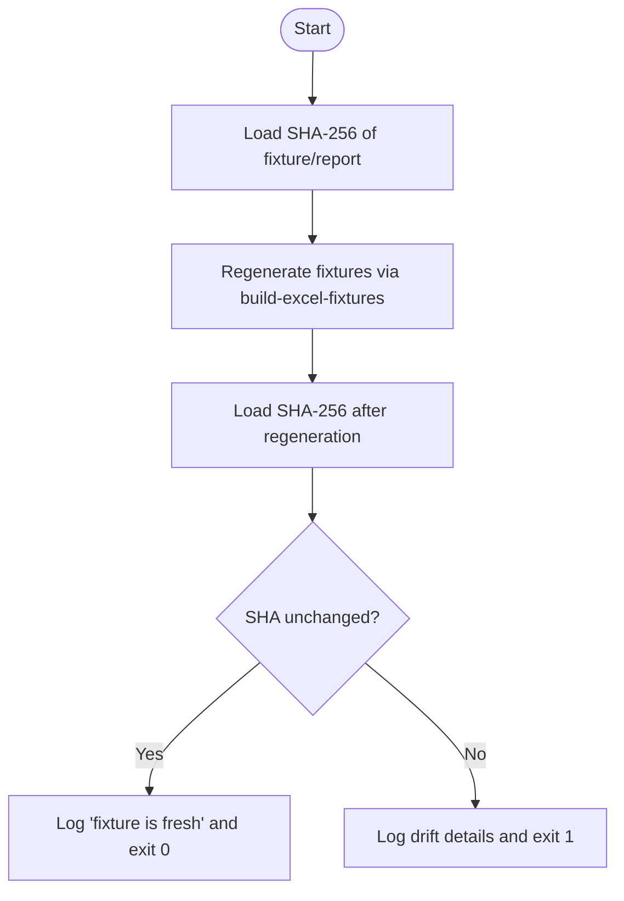
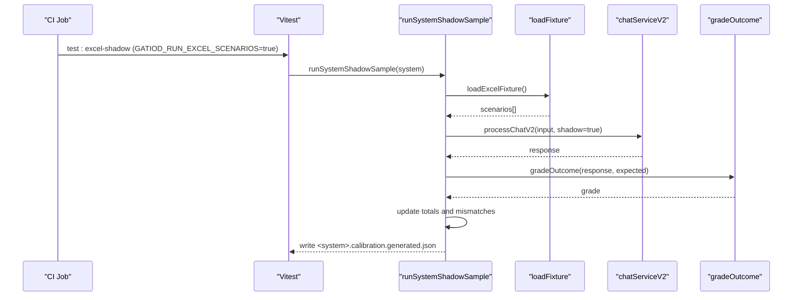
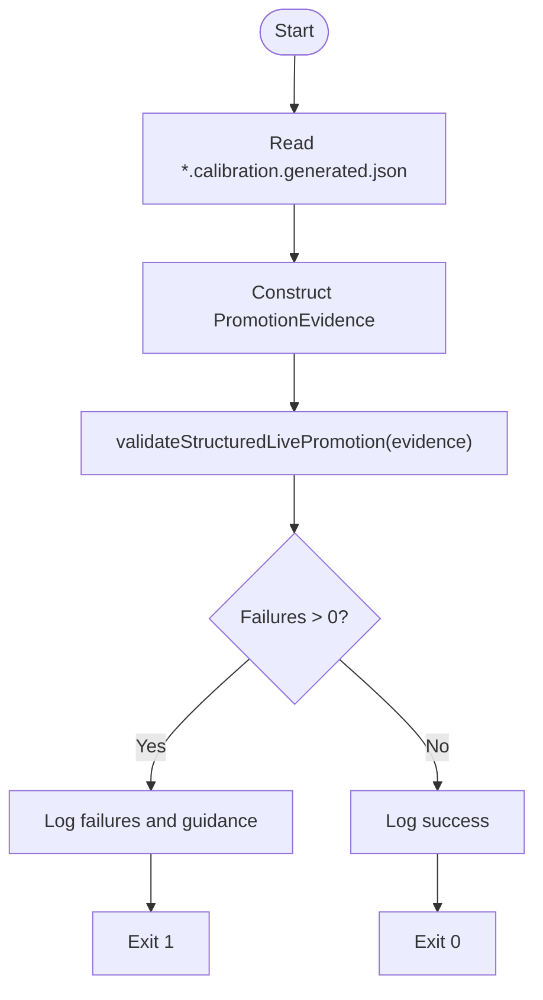
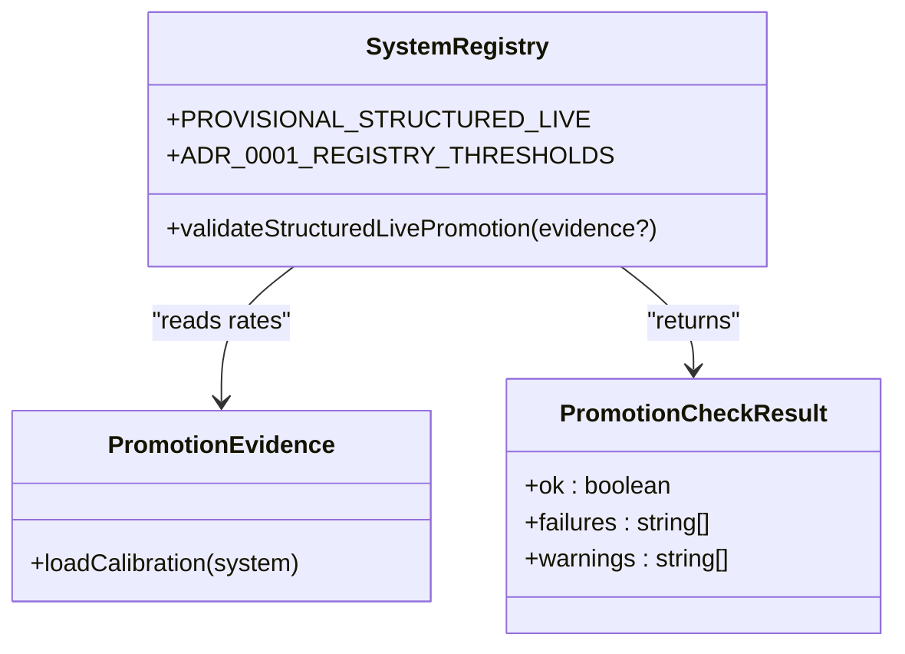
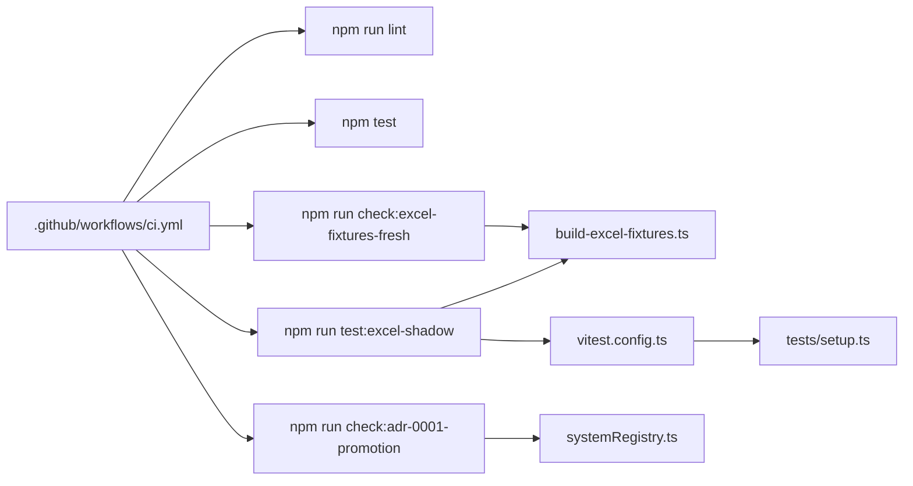

# CI/CD Pipeline

<cite>
**Referenced Files in This Document**
- [.github/workflows/ci.yml](file://.github/workflows/ci.yml)
- [package.json](file://package.json)
- [vitest.config.ts](file://vitest.config.ts)
- [tests/setup.ts](file://tests/setup.ts)
- [scripts/build-excel-fixtures.ts](file://scripts/build-excel-fixtures.ts)
- [scripts/check-excel-fixtures-fresh.ts](file://scripts/check-excel-fixtures-fresh.ts)
- [scripts/check-adr-0001-promotion.ts](file://scripts/check-adr-0001-promotion.ts)
- [tests/v2/excelScenarios/crossSystem.shadow.test.ts](file://tests/v2/excelScenarios/crossSystem.shadow.test.ts)
- [tests/v2/excelScenarios/runSystemShadowSample.ts](file://tests/v2/excelScenarios/runSystemShadowSample.ts)
- [tests/v2/excelScenarios/loadFixture.ts](file://tests/v2/excelScenarios/loadFixture.ts)
- [src/v2/systemRegistry.ts](file://src/v2/systemRegistry.ts)
- [docs/adr/0001-structured-live-promotion-gate.md](file://docs/adr/0001-structured-live-promotion-gate.md)
</cite>

## Table of Contents
1. [Introduction](#introduction)
2. [Project Structure](#project-structure)
3. [Core Components](#core-components)
4. [Architecture Overview](#architecture-overview)
5. [Detailed Component Analysis](#detailed-component-analysis)
6. [Dependency Analysis](#dependency-analysis)
7. [Performance Considerations](#performance-considerations)
8. [Troubleshooting Guide](#troubleshooting-guide)
9. [Conclusion](#conclusion)
10. [Appendices](#appendices)

## Introduction
This document describes the CI/CD pipeline for the GATIOD Chat Assistant. The pipeline is implemented as a GitHub Actions workflow that enforces five quality gates aligned with ADR-0001 “Structured-live promotion requires scenario evidence.” The stages are:
1) Type checking
2) Default test suite
3) Excel fixture freshness validation
4) Excel shadow testing with per-system threshold enforcement
5) ADR-0001 promotion checks

The pipeline ensures that changes to the workbook or fixtures are synchronized, that shadow testing evidence meets per-system thresholds, and that the registry’s “structured_live” designation is backed by current evidence.

## Project Structure
The CI pipeline is orchestrated by a single GitHub Actions workflow file and coordinated by npm scripts. Supporting scripts and tests implement the Excel fixture generation, freshness checks, shadow testing, and promotion validation.

**Diagram sources**
- [.github/workflows/ci.yml:17-60](file://.github/workflows/ci.yml#L17-L60)
- [package.json:6-20](file://package.json#L6-L20)
- [vitest.config.ts:1-12](file://vitest.config.ts#L1-L12)
- [tests/setup.ts:1-8](file://tests/setup.ts#L1-L8)

**Section sources**
- [.github/workflows/ci.yml:17-60](file://.github/workflows/ci.yml#L17-L60)
- [package.json:6-20](file://package.json#L6-L20)

## Core Components
- GitHub Actions workflow orchestrating the five-stage pipeline
- npm scripts that wire each stage and configure opt-in suites
- Vitest configuration enabling environment setup for opt-in tests
- Scripts implementing Excel fixture generation, freshness checks, and promotion validation
- Shadow testing suites producing calibration reports consumed by promotion checks

Key npm scripts:
- Type check: lint
- Default test suite: test
- Excel fixture generation: build:excel-fixtures
- Excel fixture freshness check: check:excel-fixtures-fresh
- Excel shadow suite: test:excel-shadow
- ADR-0001 promotion check: check:adr-0001-promotion

**Section sources**
- [package.json:6-20](file://package.json#L6-L20)
- [.github/workflows/ci.yml:39-60](file://.github/workflows/ci.yml#L39-L60)

## Architecture Overview
The CI pipeline executes on push and pull_request to main. Each stage depends on the previous one, enforcing a strict quality gate progression.

**Diagram sources**
- [.github/workflows/ci.yml:19-60](file://.github/workflows/ci.yml#L19-L60)
- [package.json:13-17](file://package.json#L13-L17)
- [scripts/check-excel-fixtures-fresh.ts:27-31](file://scripts/check-excel-fixtures-fresh.ts#L27-L31)
- [scripts/check-adr-0001-promotion.ts:23-43](file://scripts/check-adr-0001-promotion.ts#L23-L43)

## Detailed Component Analysis

### Stage 1: Type Checking
Purpose:
- Enforce type safety without emitting JS artifacts.

Implementation:
- The workflow runs the lint script, which delegates to the TypeScript compiler in no-emit mode.

Inputs/Outputs:
- Reads source files and dev dependencies.
- Exits non-zero on type errors.

Triggers:
- Runs on every push and pull_request to main.

**Section sources**
- [.github/workflows/ci.yml:39-40](file://.github/workflows/ci.yml#L39-L40)
- [package.json:13](file://package.json#L13)

### Stage 2: Default Test Suite
Purpose:
- Execute the core test suite excluding shadow runners.

Implementation:
- The workflow runs the test script, which invokes Vitest in run mode.

Inputs/Outputs:
- Executes unit and integration tests under tests/.
- Uses Vitest configuration and setup files.

Triggers:
- Runs after type checking passes.

**Section sources**
- [.github/workflows/ci.yml:42-43](file://.github/workflows/ci.yml#L42-L43)
- [package.json:10](file://package.json#L10)
- [vitest.config.ts:1-12](file://vitest.config.ts#L1-L12)
- [tests/setup.ts:1-8](file://tests/setup.ts#L1-L8)

### Stage 3: Excel Fixture Freshness Validation
Purpose:
- Prevent drift between the workbook and the committed fixture.

Implementation:
- The workflow runs the check:excel-fixtures-fresh script:
  - Captures SHA-256 hashes of the committed fixture and outcome report.
  - Regenerates fixtures via build-excel-fixtures.
  - Compares post-regeneration hashes; fails if changed.

Inputs/Outputs:
- Reads data/gatiod_injury_scenario_catalogue.xlsx and override file.
- Writes tests/v2/excelScenarios/scenarios.generated.json and outcome-class-report.generated.json.
- Exits non-zero if drift detected.

Triggers:
- Runs after the default test suite.

**Diagram sources**
- [scripts/check-excel-fixtures-fresh.ts:19-50](file://scripts/check-excel-fixtures-fresh.ts#L19-L50)
- [scripts/build-excel-fixtures.ts:329-427](file://scripts/build-excel-fixtures.ts#L329-L427)

**Section sources**
- [.github/workflows/ci.yml:45-48](file://.github/workflows/ci.yml#L45-L48)
- [scripts/check-excel-fixtures-fresh.ts:1-53](file://scripts/check-excel-fixtures-fresh.ts#L1-L53)
- [scripts/build-excel-fixtures.ts:1-10](file://scripts/build-excel-fixtures.ts#L1-L10)

### Stage 4: Excel Shadow Testing with Threshold Enforcement
Purpose:
- Generate per-system calibration evidence and enforce ADR-0001 thresholds.

Implementation:
- The workflow runs the test:excel-shadow script, which sets an environment variable to enable shadow tests and executes Vitest against the Excel scenarios directory.
- Per-system shadow runners:
  - Load the fixture and sample scenarios.
  - Drive a two-turn conversation when confirmation is required.
  - Grade outcomes and compute rates.
  - Write a calibration report to tests/v2/excelScenarios/<system>.calibration.generated.json.
- Threshold enforcement:
  - Per-system thresholds are defined in the shadow runner helper.
  - Tests assert that the computed rates meet or exceed thresholds.

Inputs/Outputs:
- Reads the generated fixture and workbook overrides.
- Produces per-system *.calibration.generated.json reports.
- Fails if any system falls below its threshold.

**Diagram sources**
- [.github/workflows/ci.yml:50-51](file://.github/workflows/ci.yml#L50-L51)
- [package.json:17](file://package.json#L17)
- [tests/v2/excelScenarios/runSystemShadowSample.ts:100-187](file://tests/v2/excelScenarios/runSystemShadowSample.ts#L100-L187)
- [tests/v2/excelScenarios/loadFixture.ts:16-20](file://tests/v2/excelScenarios/loadFixture.ts#L16-L20)
- [tests/v2/excelScenarios/crossSystem.shadow.test.ts:139-267](file://tests/v2/excelScenarios/crossSystem.shadow.test.ts#L139-L267)

**Section sources**
- [.github/workflows/ci.yml:50-51](file://.github/workflows/ci.yml#L50-L51)
- [package.json:17](file://package.json#L17)
- [tests/v2/excelScenarios/runSystemShadowSample.ts:34-82](file://tests/v2/excelScenarios/runSystemShadowSample.ts#L34-L82)
- [tests/v2/excelScenarios/upperLimb.shadow.test.ts:21-24](file://tests/v2/excelScenarios/upperLimb.shadow.test.ts#L21-L24)
- [tests/v2/excelScenarios/hearing.shadow.test.ts:25-28](file://tests/v2/excelScenarios/hearing.shadow.test.ts#L25-L28)

### Stage 5: ADR-0001 Promotion Checks
Purpose:
- Validate that every system currently marked structured_live has current evidence meeting thresholds.

Implementation:
- The workflow runs the check:adr-0001-promotion script:
  - Reads each system’s *.calibration.generated.json report.
  - Calls the promotion validator with evidence mode enabled.
  - Fails if any structured_live system lacks evidence or falls below thresholds.

Inputs/Outputs:
- Consumes *.calibration.generated.json files produced by shadow testing.
- Validates against thresholds defined in the system registry.
- Exits non-zero on failures; logs actionable guidance.

**Diagram sources**
- [scripts/check-adr-0001-promotion.ts:23-62](file://scripts/check-adr-0001-promotion.ts#L23-L62)
- [src/v2/systemRegistry.ts:266-327](file://src/v2/systemRegistry.ts#L266-L327)

**Section sources**
- [.github/workflows/ci.yml:53-59](file://.github/workflows/ci.yml#L53-L59)
- [scripts/check-adr-0001-promotion.ts:1-65](file://scripts/check-adr-0001-promotion.ts#L1-L65)
- [src/v2/systemRegistry.ts:234-244](file://src/v2/systemRegistry.ts#L234-L244)

### Structured Live Promotion Gate Mechanism
The promotion gate enforces that “structured_live” is a safety certification, not merely wiring. It requires:
- Curated golden tests pass at 100% (contextual to ADR-0001).
- Excel scenario shadow runner meets per-system thresholds.
- Zero critical safety failures.

The validator supports two modes:
- Allowlist-only mode: warns for provisional systems not on the allowlist.
- Evidence mode: requires calibrated rates meeting thresholds.

**Diagram sources**
- [src/v2/systemRegistry.ts:212-327](file://src/v2/systemRegistry.ts#L212-L327)

**Section sources**
- [src/v2/systemRegistry.ts:266-327](file://src/v2/systemRegistry.ts#L266-L327)
- [docs/adr/0001-structured-live-promotion-gate.md:13-56](file://docs/adr/0001-structured-live-promotion-gate.md#L13-L56)

## Dependency Analysis
The pipeline stages depend on each other and on external tools and files.

**Diagram sources**
- [.github/workflows/ci.yml:39-60](file://.github/workflows/ci.yml#L39-L60)
- [package.json:14-17](file://package.json#L14-L17)
- [scripts/build-excel-fixtures.ts:1-10](file://scripts/build-excel-fixtures.ts#L1-L10)
- [scripts/check-excel-fixtures-fresh.ts:27-28](file://scripts/check-excel-fixtures-fresh.ts#L27-L28)
- [scripts/check-adr-0001-promotion.ts:23-43](file://scripts/check-adr-0001-promotion.ts#L23-L43)
- [src/v2/systemRegistry.ts:266-327](file://src/v2/systemRegistry.ts#L266-L327)
- [vitest.config.ts:1-12](file://vitest.config.ts#L1-L12)
- [tests/setup.ts:1-8](file://tests/setup.ts#L1-L8)

**Section sources**
- [.github/workflows/ci.yml:19-60](file://.github/workflows/ci.yml#L19-L60)
- [package.json:6-20](file://package.json#L6-L20)

## Performance Considerations
- Shadow testing can be slow. Use environment flags to control sampling and opt-in behavior:
  - EXCEL_SCENARIO_SAMPLE controls sample size for per-system runners.
  - EXCEL_SCENARIO_FULL=true runs the entire population for validation.
  - GATIOD_RUN_EXCEL_SCENARIOS=true enables shadow tests.
- The default test suite excludes shadow tests to keep CI fast.
- The Excel fixture generation is deterministic and writes stable timestamps keyed to input hashes to minimize diffs.

[No sources needed since this section provides general guidance]

## Troubleshooting Guide
Common failures and resolutions:

- Type check failure:
  - Cause: TypeScript compilation errors.
  - Resolution: Fix type errors; rerun locally with the same lint command.

- Default test suite failure:
  - Cause: Unit/integration test failures.
  - Resolution: Inspect failing tests; run tests locally to reproduce.

- Excel fixture drift detected:
  - Cause: Workbook or override changes without regenerating fixtures.
  - Resolution: Run the fixture build script and commit the updated generated files.

- Excel shadow threshold failure:
  - Cause: System’s safe-outcome or exact-calculation rate below threshold.
  - Resolution: Improve system logic, increase sample size, or adjust expectations; re-run shadow to regenerate calibration reports.

- ADR-0001 promotion check failure:
  - Cause: System marked structured_live lacks evidence or evidence below thresholds.
  - Resolution: Run shadow tests to generate calibration reports; address issues; demote system if not ready.

Maintenance procedures:
- To update workflow configuration:
  - Modify the workflow file and validate locally with GitHub Actions CLI if desired.
- To refresh Excel fixtures:
  - Run the fixture build script and commit changes.
- To adjust thresholds:
  - Update the thresholds in the shadow runner helper and document changes in ADR-0001.

**Section sources**
- [scripts/check-excel-fixtures-fresh.ts:37-47](file://scripts/check-excel-fixtures-fresh.ts#L37-L47)
- [tests/v2/excelScenarios/runSystemShadowSample.ts:57-82](file://tests/v2/excelScenarios/runSystemShadowSample.ts#L57-L82)
- [scripts/check-adr-0001-promotion.ts:50-61](file://scripts/check-adr-0001-promotion.ts#L50-L61)

## Conclusion
The CI/CD pipeline enforces a robust, evidence-backed promotion mechanism for structured systems. By anchoring promotion to curated goldens, Excel scenario evidence, and zero critical safety failures, it ensures that “structured_live” reflects real-world safety and accuracy. The five-stage pipeline provides clear quality gates, deterministic fixtures, and threshold-driven validation to maintain high standards.

[No sources needed since this section summarizes without analyzing specific files]

## Appendices

### Pipeline Triggers and Environment Setup
- Triggers: push and pull_request to main branch.
- Environment: Node.js 20 with npm caching configured.
- Optional environment variables for shadow testing:
  - GATIOD_RUN_EXCEL_SCENARIOS=true to enable shadow tests.
  - EXCEL_SCENARIO_SAMPLE to control per-system sample size.
  - EXCEL_SCENARIO_FULL=true to run the entire population.
  - GATIOD_DB_PATH=:memory: for in-memory DB during tests.

**Section sources**
- [.github/workflows/ci.yml:19-38](file://.github/workflows/ci.yml#L19-L38)
- [tests/v2/excelScenarios/runSystemShadowSample.ts:26-28](file://tests/v2/excelScenarios/runSystemShadowSample.ts#L26-L28)
- [tests/v2/excelScenarios/crossSystem.shadow.test.ts:142-143](file://tests/v2/excelScenarios/crossSystem.shadow.test.ts#L142-L143)