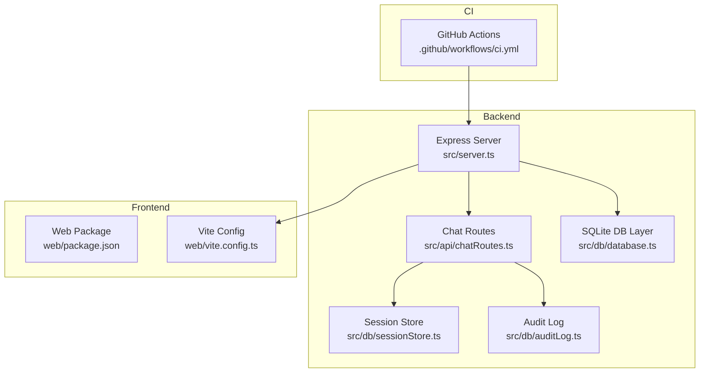
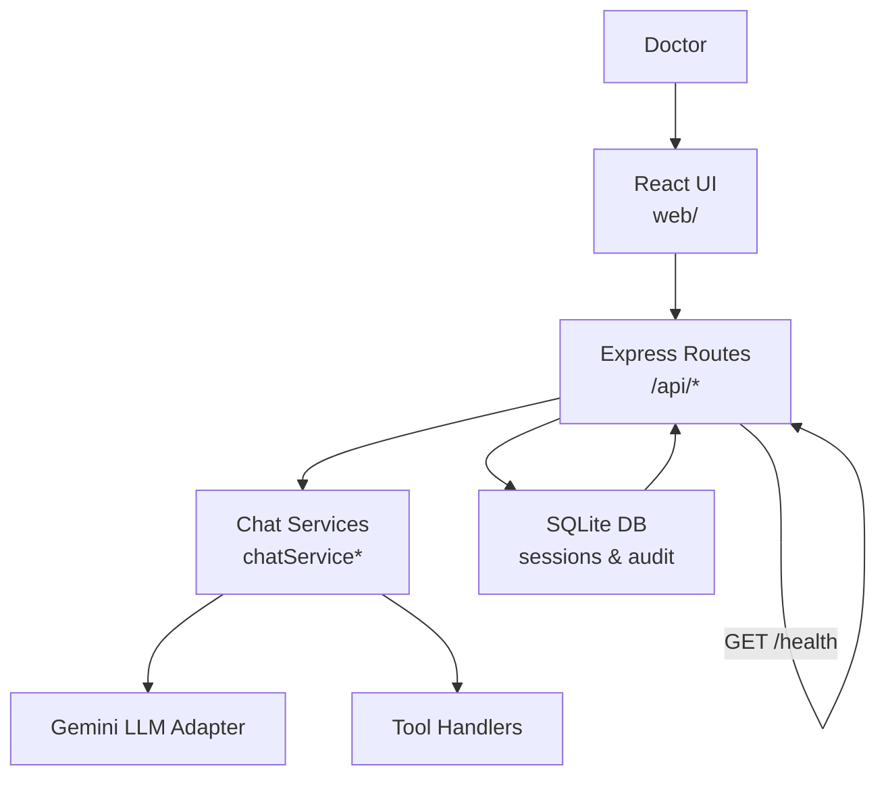
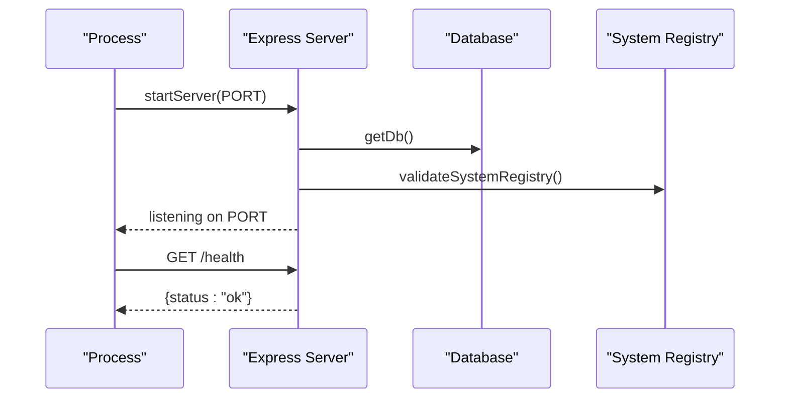
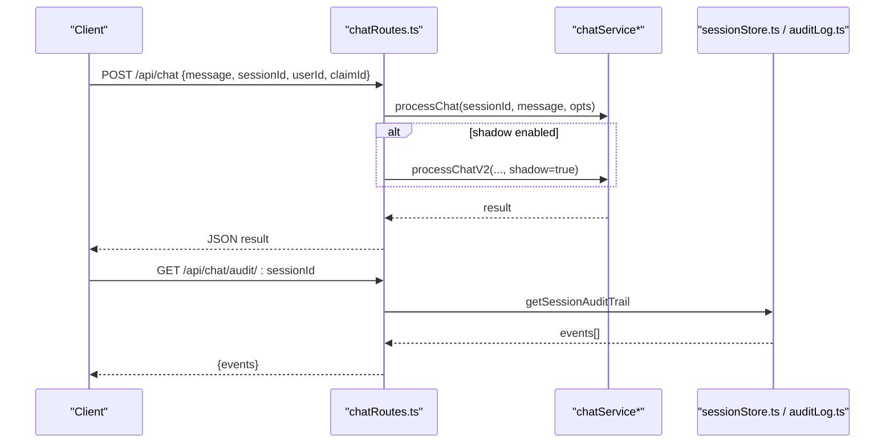
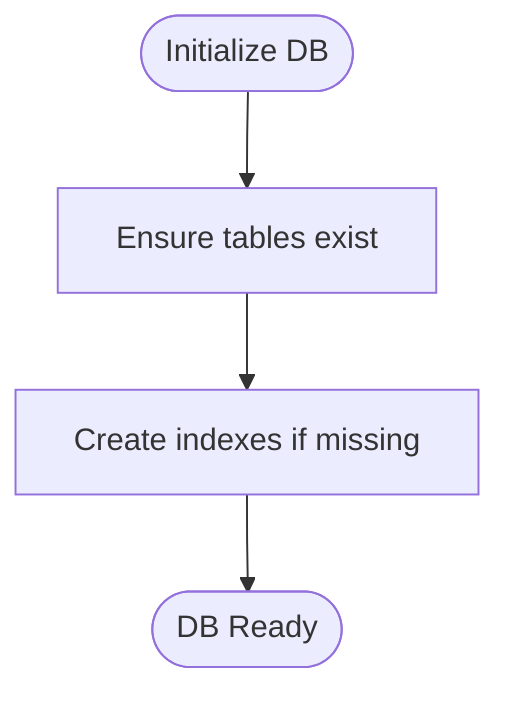
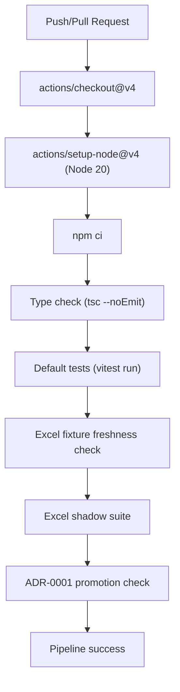
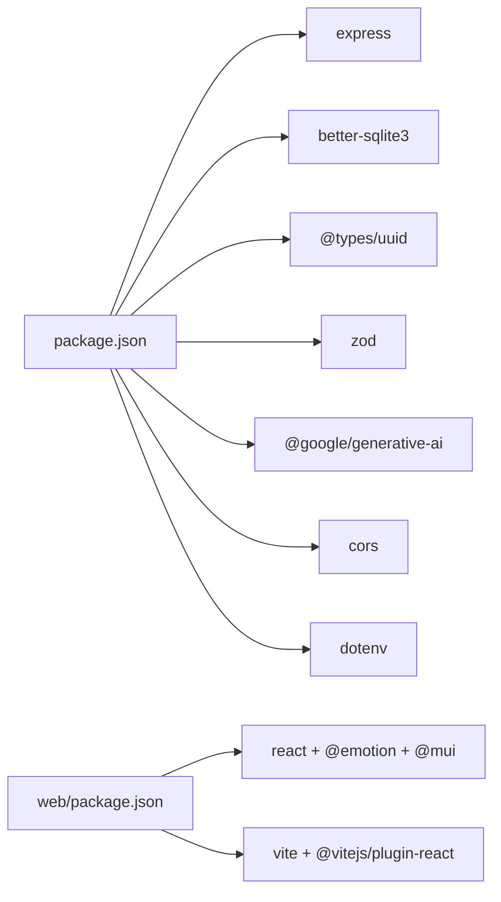

# Deployment and Operations

<cite>
**Referenced Files in This Document**
- [README.md](file://README.md)
- [package.json](file://package.json)
- [tsconfig.json](file://tsconfig.json)
- [src/server.ts](file://src/server.ts)
- [src/api/chatRoutes.ts](file://src/api/chatRoutes.ts)
- [src/db/database.ts](file://src/db/database.ts)
- [src/db/sessionStore.ts](file://src/db/sessionStore.ts)
- [src/db/auditLog.ts](file://src/db/auditLog.ts)
- [web/package.json](file://web/package.json)
- [web/vite.config.ts](file://web/vite.config.ts)
- [.github/workflows/ci.yml](file://.github/workflows/ci.yml)
- [vitest.config.ts](file://vitest.config.ts)
- [.gitignore](file://.gitignore)
</cite>

## Table of Contents
1. [Introduction](#introduction)
2. [Project Structure](#project-structure)
3. [Core Components](#core-components)
4. [Architecture Overview](#architecture-overview)
5. [Detailed Component Analysis](#detailed-component-analysis)
6. [Dependency Analysis](#dependency-analysis)
7. [Performance Considerations](#performance-considerations)
8. [Troubleshooting Guide](#troubleshooting-guide)
9. [Conclusion](#conclusion)
10. [Appendices](#appendices)

## Introduction
This document provides comprehensive deployment and operations guidance for the GATIOD Chat Assistant. It covers production deployment strategies, containerization options, cloud platform integration, CI/CD pipeline configuration, automated testing workflows, release management, infrastructure requirements, scaling, monitoring, security, backups, disaster recovery, performance optimization, resource allocation, capacity planning, operational runbooks, deployment checklists, rollback procedures, and post-deployment validation steps.

## Project Structure
The application consists of:
- Backend service written in TypeScript, exposing REST APIs and serving a React frontend in production.
- SQLite-backed session and audit persistence layer.
- Frontend built with React and Vite, proxied during development.
- CI pipeline orchestrated via GitHub Actions.

**Diagram sources**
- [src/server.ts:1-68](file://src/server.ts#L1-L68)
- [src/api/chatRoutes.ts:1-91](file://src/api/chatRoutes.ts#L1-L91)
- [src/db/database.ts:1-57](file://src/db/database.ts#L1-L57)
- [src/db/sessionStore.ts:1-110](file://src/db/sessionStore.ts#L1-L110)
- [src/db/auditLog.ts:1-91](file://src/db/auditLog.ts#L1-L91)
- [web/package.json:1-27](file://web/package.json#L1-L27)
- [web/vite.config.ts:1-16](file://web/vite.config.ts#L1-L16)
- [.github/workflows/ci.yml:1-60](file://.github/workflows/ci.yml#L1-L60)

**Section sources**
- [README.md:17-31](file://README.md#L17-L31)
- [package.json:1-45](file://package.json#L1-L45)
- [web/package.json:1-27](file://web/package.json#L1-L27)
- [web/vite.config.ts:1-16](file://web/vite.config.ts#L1-L16)
- [.github/workflows/ci.yml:17-60](file://.github/workflows/ci.yml#L17-L60)

## Core Components
- Express server initializes CORS, JSON parsing, API routes, health endpoint, and static frontend delivery in production.
- Chat routes handle message submission, session reset, audit retrieval, and session listing.
- Database layer manages SQLite connection, WAL mode, busy timeouts, and schema initialization.
- Session store persists chat histories and system states with conflict resolution and indexing.
- Audit log captures detailed assessment events for traceability.
- CI pipeline enforces type checks, default tests, Excel fixture freshness, Excel shadow suite, and ADR-0001 promotion checks.

**Section sources**
- [src/server.ts:13-68](file://src/server.ts#L13-L68)
- [src/api/chatRoutes.ts:14-91](file://src/api/chatRoutes.ts#L14-L91)
- [src/db/database.ts:11-57](file://src/db/database.ts#L11-L57)
- [src/db/sessionStore.ts:21-110](file://src/db/sessionStore.ts#L21-L110)
- [src/db/auditLog.ts:58-91](file://src/db/auditLog.ts#L58-L91)
- [.github/workflows/ci.yml:25-60](file://.github/workflows/ci.yml#L25-L60)

## Architecture Overview
High-level runtime architecture:
- Doctor interacts with the React UI.
- Requests are routed to the Express server.
- The server delegates chat orchestration and tool execution to internal services.
- Sessions and audit logs persist in SQLite.
- Health checks and static assets are served by the backend.

**Diagram sources**
- [src/server.ts:19-37](file://src/server.ts#L19-L37)
- [src/api/chatRoutes.ts:14-66](file://src/api/chatRoutes.ts#L14-L66)
- [src/db/database.ts:20-46](file://src/db/database.ts#L20-L46)

## Detailed Component Analysis

### Express Server and Runtime Behavior
- Environment-driven port binding and graceful error handling for port conflicts.
- Static asset serving for production builds; fallback routing to index.html.
- Health endpoint for liveness probes.
- Initialization order ensures database and V2 system registry validation before accepting requests.

**Diagram sources**
- [src/server.ts:45-68](file://src/server.ts#L45-L68)
- [src/db/database.ts:11-18](file://src/db/database.ts#L11-L18)

**Section sources**
- [src/server.ts:13-68](file://src/server.ts#L13-L68)

### Chat API Endpoints
- POST /api/chat: Processes messages, optionally mirrors traffic to v2 pipeline in shadow mode.
- POST /api/chat/v2: New pipeline endpoint with optional debug response filtering.
- POST /api/chat/reset: Clears a session.
- GET /api/chat/audit/:sessionId: Retrieves audit trail for traceability.
- GET /api/chat/sessions/:userId: Lists recent sessions for resumption.

**Diagram sources**
- [src/api/chatRoutes.ts:14-91](file://src/api/chatRoutes.ts#L14-L91)
- [src/db/sessionStore.ts:69-84](file://src/db/sessionStore.ts#L69-L84)
- [src/db/auditLog.ts:75-91](file://src/db/auditLog.ts#L75-L91)

**Section sources**
- [src/api/chatRoutes.ts:14-91](file://src/api/chatRoutes.ts#L14-L91)

### Database and Persistence
- SQLite with WAL mode and busy timeouts for concurrency.
- Two primary tables: sessions and audit log, with indexes for performance.
- Session store supports save, load, update, completion, abandonment, and listing.

**Diagram sources**
- [src/db/database.ts:20-46](file://src/db/database.ts#L20-L46)

**Section sources**
- [src/db/database.ts:11-57](file://src/db/database.ts#L11-L57)
- [src/db/sessionStore.ts:21-110](file://src/db/sessionStore.ts#L21-L110)
- [src/db/auditLog.ts:58-91](file://src/db/auditLog.ts#L58-L91)

### CI/CD Pipeline and Release Management
- Runs on Ubuntu with Node.js 20.
- Enforces type checking, default test suite, Excel fixture freshness, Excel shadow suite, and ADR-0001 promotion checks.
- Steps act as gates ensuring quality and compliance commitments.

**Diagram sources**
- [.github/workflows/ci.yml:25-60](file://.github/workflows/ci.yml#L25-L60)

**Section sources**
- [.github/workflows/ci.yml:17-60](file://.github/workflows/ci.yml#L17-L60)
- [vitest.config.ts:1-12](file://vitest.config.ts#L1-L12)

## Dependency Analysis
- Backend runtime dependencies include Express, CORS, better-sqlite3, UUID, Zod, and Google Generative AI SDK.
- Development dependencies include TypeScript, Vitest, and TSX for hot reload/dev.
- Frontend depends on React, Material UI, and Vite.

**Diagram sources**
- [package.json:21-43](file://package.json#L21-L43)
- [web/package.json:11-25](file://web/package.json#L11-L25)

**Section sources**
- [package.json:1-45](file://package.json#L1-L45)
- [web/package.json:1-27](file://web/package.json#L1-L27)

## Performance Considerations
- Database tuning:
  - WAL mode improves concurrency and durability.
  - Busy timeout prevents immediate failures under contention.
  - Indexes on session queries support efficient lookups.
- Application-level:
  - Shadow mode in chat routes enables side-by-side evaluation of v2 without impacting production throughput.
  - Health endpoint supports lightweight liveness checks.
- Build and runtime:
  - TypeScript strictness and declaration maps improve reliability.
  - Node engine requirement >= 20 ensures modern performance characteristics.

[No sources needed since this section provides general guidance]

## Troubleshooting Guide
- Port conflicts:
  - The server attempts to increment the port by 1 if the current port is in use; monitor console warnings.
- Missing environment variables:
  - If the Gemini API key is not set, chat operations will fail; ensure environment configuration is present.
- Database connectivity:
  - Verify SQLite file path and permissions; default path is derived from the working directory.
- Audit logging failures:
  - Audit logging is wrapped to avoid crashing the main flow; errors are logged to console.
- Frontend proxy:
  - During development, Vite proxies /api to the backend server; confirm ports match.

**Section sources**
- [src/server.ts:57-64](file://src/server.ts#L57-L64)
- [src/server.ts:52-54](file://src/server.ts#L52-L54)
- [src/db/database.ts:14-18](file://src/db/database.ts#L14-L18)
- [src/db/auditLog.ts:69-73](file://src/db/auditLog.ts#L69-L73)
- [web/vite.config.ts:8-14](file://web/vite.config.ts#L8-L14)

## Conclusion
The GATIOD Chat Assistant is a modular, test-driven system with clear separation between backend orchestration, persistence, and frontend UX. Its CI pipeline enforces quality gates aligned with architectural decisions. Production deployment should emphasize secure environment configuration, persistent storage, observability, and controlled rollouts with rollback procedures.

[No sources needed since this section summarizes without analyzing specific files]

## Appendices

### A. Infrastructure Requirements
- Compute: Minimum single-instance deployment for development; scale horizontally for production.
- Storage: Persistent volume for SQLite database files and logs; ensure adequate disk space for audit trails and session histories.
- Networking: Expose port 3001 (or configurable) with TLS termination at the edge; configure health checks against /health.
- Secrets: Store Gemini API key and any other secrets via platform secret managers; mount as environment variables.
- OS: Linux recommended; Node.js 20+ runtime.

[No sources needed since this section provides general guidance]

### B. Scaling Considerations
- Horizontal scaling: Stateless backend behind a load balancer; sticky sessions not required due to database-backed sessions.
- Database: SQLite is suitable for small to medium workloads; plan migration to PostgreSQL for higher concurrency.
- Caching: Consider Redis for short-lived caches (e.g., rate limits, recent sessions) if needed.
- Asynchronous tasks: Offload long-running operations to a queue/job system if tool calls become CPU-intensive.

[No sources needed since this section provides general guidance]

### C. Monitoring Setup
- Health endpoint: Use GET /health for liveness/readiness probes.
- Logs: Centralize application logs and audit events; include structured JSON for downstream processing.
- Metrics: Track request latency, error rates, session counts, and tool invocation volumes.
- Tracing: Correlate session IDs across logs and traces for end-to-end visibility.

[No sources needed since this section provides general guidance]

### D. Security Considerations
- Secrets management: Never commit secrets; use environment variables or secret managers.
- Transport security: Enforce HTTPS/TLS at the edge and internally.
- Access control: Gate API endpoints with authentication/authorization where applicable.
- Data retention: Define policies for session and audit data retention; implement deletion routines.
- Dependencies: Pin versions and monitor for vulnerabilities; keep Node and npm packages updated.

[No sources needed since this section provides general guidance]

### E. Backup Procedures
- Database backup: Regular snapshots of the SQLite database file; for PostgreSQL migration, use native logical backups.
- Audit logs: Archive audit events to cold storage; maintain immutability guarantees.
- Configuration: Back up environment variable sets and deployment manifests.

[No sources needed since this section provides general guidance]

### F. Disaster Recovery Planning
- Recovery time objective (RTO): Define acceptable downtime; automate failover to secondary nodes.
- Recovery point objective (RPO): Determine maximum data loss tolerance; schedule frequent backups.
- Drills: Conduct periodic DR tests for restore procedures and cross-region failover.

[No sources needed since this section provides general guidance]

### G. Operational Runbooks

#### G.1. Deploy a New Version
- Pre-deploy validation:
  - Confirm CI pipeline passes locally and on target branch.
  - Review database schema changes and migrations.
- Deployment steps:
  - Stop old instances gracefully.
  - Upload artifacts and environment configuration.
  - Start new instances and run post-deployment validation.
- Post-deploy validation:
  - Health check succeeds.
  - Sample chat requests succeed.
  - Audit entries appear for test interactions.

**Section sources**
- [.github/workflows/ci.yml:25-60](file://.github/workflows/ci.yml#L25-L60)
- [src/server.ts:25-28](file://src/server.ts#L25-L28)

#### G.2. Rollback Procedure
- Steps:
  - Switch traffic back to the previous healthy image.
  - Validate /health and basic chat flows.
  - Monitor error rates and audit logs.
- Communication:
  - Notify stakeholders and update status boards.

[No sources needed since this section provides general guidance]

#### G.3. Incident Response Protocol
- Triage:
  - Identify symptoms (5xx, latency spikes, audit gaps).
- Containment:
  - Scale down affected instances; disable problematic features if necessary.
- Resolution:
  - Apply fix and re-validate.
- Post-mortem:
  - Document root cause, remediation, and preventive measures.

[No sources needed since this section provides general guidance]

### H. Deployment Checklist
- Build and test:
  - npm run build
  - npm test
  - npm run lint
- Environment:
  - Set PORT, GEMINI_API_KEY, GATIOD_DB_PATH
  - Configure proxy for development if needed
- Database:
  - Ensure writable database path and schema initialized
- Health:
  - Verify GET /health returns ok
- Smoke test:
  - Send a sample POST /api/chat and confirm response

**Section sources**
- [package.json:6-20](file://package.json#L6-L20)
- [src/server.ts:14-17](file://src/server.ts#L14-L17)
- [src/server.ts:25-28](file://src/server.ts#L25-L28)
- [src/api/chatRoutes.ts:14-41](file://src/api/chatRoutes.ts#L14-L41)

### I. Post-Deployment Validation
- Functional validation:
  - Session resume via GET /api/chat/sessions/:userId
  - Audit trail retrieval via GET /api/chat/audit/:sessionId
- Performance validation:
  - Load test chat endpoints; measure latency and error rates
- Compliance validation:
  - Confirm audit logs capture required events

**Section sources**
- [src/api/chatRoutes.ts:83-91](file://src/api/chatRoutes.ts#L83-L91)
- [src/db/auditLog.ts:75-91](file://src/db/auditLog.ts#L75-L91)

### J. Containerization Options
- Multi-stage Docker build:
  - Build stage: Install dependencies, compile TypeScript, build frontend.
  - Runtime stage: Minimal base image, copy compiled assets and binaries, set NODE_ENV, expose port, run start script.
- Entrypoint:
  - Use npm start to launch the Express server.
- Volumes:
  - Mount database directory for persistence.
- Environment:
  - Pass GEMINI_API_KEY and other secrets via environment variables.

[No sources needed since this section provides general guidance]

### K. Cloud Platform Integration
- Kubernetes:
  - Deploy as a StatefulSet with PVC for database persistence.
  - Use ConfigMaps/Secrets for configuration and credentials.
  - Configure HPA based on CPU/memory or custom metrics.
- Platform-as-a-Service:
  - Render/Vercel/Railway: Build and deploy using standard Node.js builders; attach managed databases if needed.
- Observability:
  - Integrate with cloud-native logging/tracing/metrics platforms.

[No sources needed since this section provides general guidance]