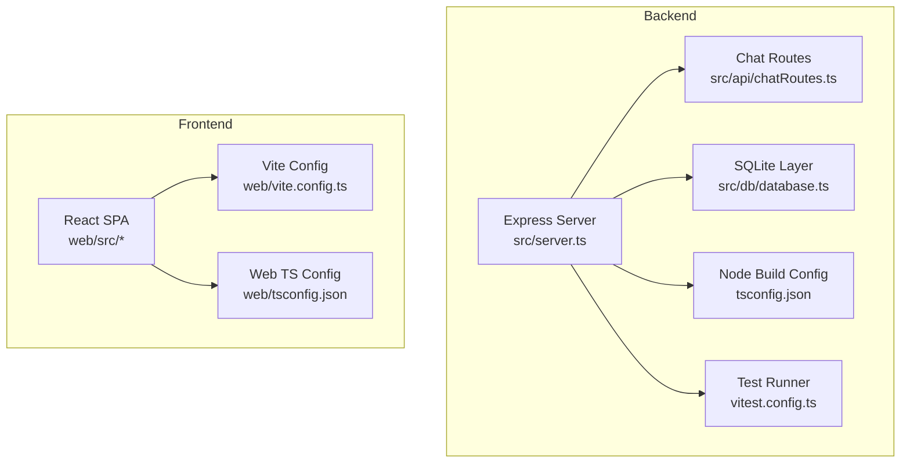
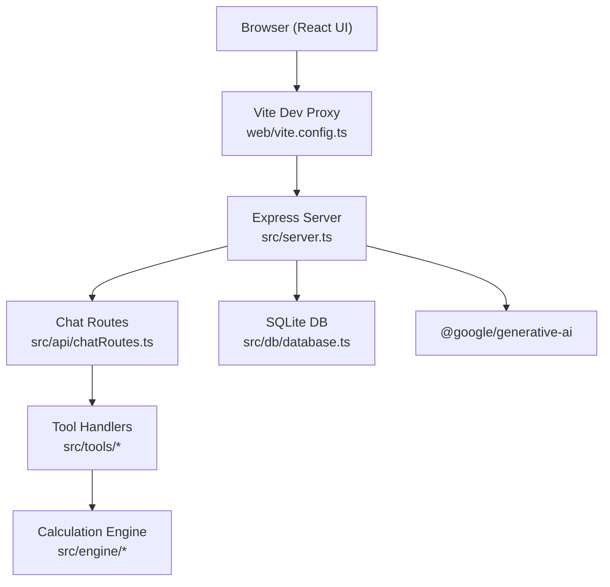
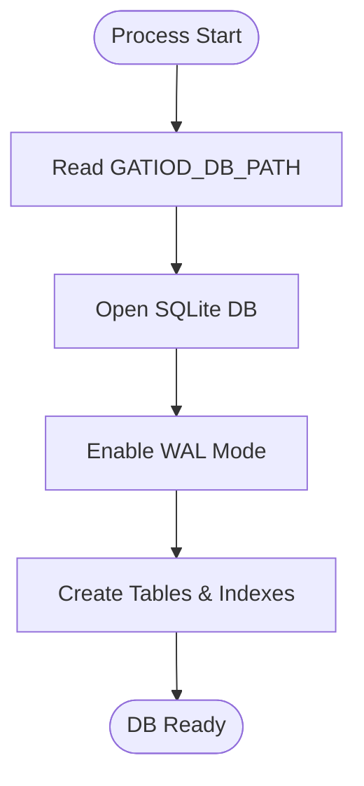
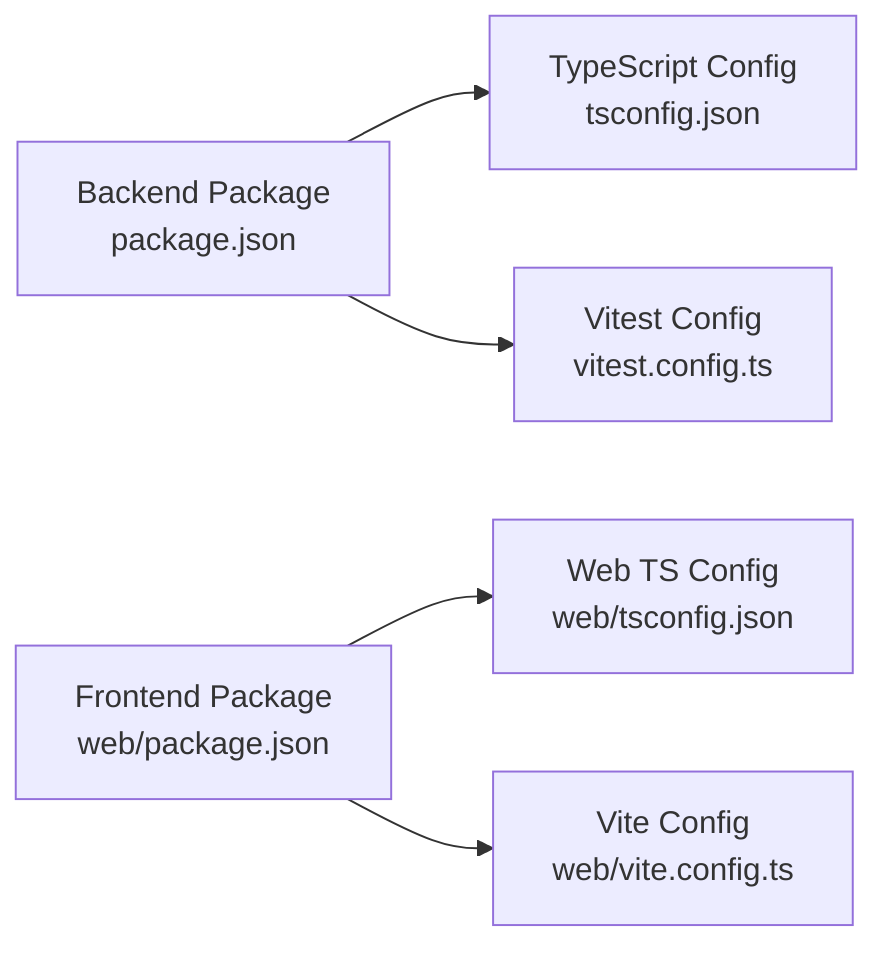

# Infrastructure Setup

<cite>
**Referenced Files in This Document**
- [package.json](file://package.json)
- [tsconfig.json](file://tsconfig.json)
- [vitest.config.ts](file://vitest.config.ts)
- [web/package.json](file://web/package.json)
- [web/tsconfig.json](file://web/tsconfig.json)
- [web/vite.config.ts](file://web/vite.config.ts)
- [src/server.ts](file://src/server.ts)
- [src/db/database.ts](file://src/db/database.ts)
- [README.md](file://README.md)
</cite>

## Table of Contents
1. [Introduction](#introduction)
2. [Project Structure](#project-structure)
3. [Core Components](#core-components)
4. [Architecture Overview](#architecture-overview)
5. [Detailed Component Analysis](#detailed-component-analysis)
6. [Dependency Analysis](#dependency-analysis)
7. [Performance Considerations](#performance-considerations)
8. [Troubleshooting Guide](#troubleshooting-guide)
9. [Conclusion](#conclusion)
10. [Appendices](#appendices)

## Introduction
This document describes the infrastructure setup for deploying the GATIOD Chat Assistant. It covers system requirements, build configuration for backend and frontend, environment variables, database setup, external service dependencies (Gemini LLM API), containerization and orchestration options, networking and TLS guidance, and deployment templates for common scenarios.

## Project Structure
The repository is a dual-package monorepo with a Node.js backend and a Vite/React frontend:
- Backend: Express server, TypeScript build, Vitest tests, and SQLite database layer
- Frontend: React SPA built with Vite and TypeScript
- Shared configuration: TypeScript compiler options, Vitest configuration, and Vite development proxy

**Diagram sources**
- [src/server.ts](file://src/server.ts)
- [src/db/database.ts](file://src/db/database.ts)
- [tsconfig.json](file://tsconfig.json)
- [vitest.config.ts](file://vitest.config.ts)
- [web/vite.config.ts](file://web/vite.config.ts)
- [web/tsconfig.json](file://web/tsconfig.json)

**Section sources**
- [README.md](file://README.md)
- [src/server.ts](file://src/server.ts)
- [web/vite.config.ts](file://web/vite.config.ts)

## Core Components
- Backend runtime and build
  - Node.js engine requirement: >= 20.0.0
  - TypeScript compilation target ES2022 with NodeNext module resolution
  - Scripts: dev, build, start, test, lint, and specialized test runners
- Frontend build and dev server
  - Vite-based React app with TypeScript
  - Development proxy to backend on port 3001
- Database
  - SQLite via better-sqlite3 with WAL mode and busy timeouts
  - Optional PostgreSQL compatibility by design
- External dependencies
  - Gemini LLM client library
  - CORS middleware
  - UUID and Zod for identifiers and validation

**Section sources**
- [package.json](file://package.json)
- [tsconfig.json](file://tsconfig.json)
- [web/package.json](file://web/package.json)
- [web/tsconfig.json](file://web/tsconfig.json)
- [web/vite.config.ts](file://web/vite.config.ts)
- [src/db/database.ts](file://src/db/database.ts)

## Architecture Overview
The system exposes an HTTP API for chat interactions and serves the React UI in production. The backend integrates with the Gemini LLM for orchestration and tool calling, while deterministic calculations are performed locally.

**Diagram sources**
- [src/server.ts](file://src/server.ts)
- [src/db/database.ts](file://src/db/database.ts)
- [web/vite.config.ts](file://web/vite.config.ts)
- [package.json](file://package.json)

## Detailed Component Analysis

### System Requirements
- Node.js: Version constraint is defined in engines; minimum version is >= 20.0.0
- Operating systems: POSIX-compatible environments suitable for Node.js and better-sqlite3
- Memory and CPU: No explicit limits; typical small to medium deployments can run on modest VMs; adjust Node heap and worker threads as needed in container orchestrators
- Networking: Exposes HTTP on a configurable port; default is 3001; health endpoint available at /health

**Section sources**
- [package.json](file://package.json)
- [src/server.ts](file://src/server.ts)

### Build Configuration

#### Backend (Node/TypeScript)
- Compiler options
  - Target: ES2022
  - Module resolution: NodeNext
  - Strictness and sourcemaps enabled
  - Path aliases for internal modules
- Build scripts
  - dev: watch mode using tsx
  - build: tsc compile
  - start: run compiled server
  - test: run Vitest suite
  - lint: type-check without emitting
- Test configuration
  - Vitest includes test files under tests/**
  - setupFiles loads a shared test setup to initialize environment once per run

**Section sources**
- [tsconfig.json](file://tsconfig.json)
- [package.json](file://package.json)
- [vitest.config.ts](file://vitest.config.ts)

#### Frontend (Vite/React/TypeScript)
- Compiler options
  - Target: ES2020
  - Bundler module resolution
  - JSX transform for React
- Build scripts
  - dev: Vite dev server
  - build: tsc -b then vite build
  - preview: Vite preview
- Development proxy
  - Proxies /api to http://localhost:3001 during development

**Section sources**
- [web/tsconfig.json](file://web/tsconfig.json)
- [web/package.json](file://web/package.json)
- [web/vite.config.ts](file://web/vite.config.ts)

### Environment Variables
- GEMINI_API_KEY: Required for Gemini integration; server warns if unset
- PORT: HTTP port for the Express server; defaults to 3001
- GATIOD_DB_PATH: SQLite database path; defaults to a file in the working directory
- Test-time toggles:
  - GATIOD_RUN_EXCEL_SCENARIOS
  - EXCEL_SCENARIO_FULL
  - GATIOD_RUN_SEMANTIC_SHADOW

**Section sources**
- [src/server.ts](file://src/server.ts)
- [src/db/database.ts](file://src/db/database.ts)
- [vitest.config.ts](file://vitest.config.ts)
- [package.json](file://package.json)

### Database Setup
- SQLite
  - better-sqlite3 connection with WAL mode and busy timeouts
  - Initializes sessions and audit log tables with indexes
  - Path resolved from GATIOD_DB_PATH or default location
- PostgreSQL compatibility
  - Designed for migration; schema aligns with claimsDex patterns

**Diagram sources**
- [src/db/database.ts](file://src/db/database.ts)

**Section sources**
- [src/db/database.ts](file://src/db/database.ts)

### External Service Dependencies
- Gemini LLM client library is a runtime dependency
- Gemini API key is mandatory for chat operations
- CORS is enabled for browser-to-server communication

**Section sources**
- [package.json](file://package.json)
- [src/server.ts](file://src/server.ts)

### Network Requirements and Firewall
- Inbound ports
  - 3001 for HTTP API and UI (default)
  - 5173 for Vite dev server (frontend)
- Outbound ports
  - 443 to Gemini API host for model inference
- Health checks
  - GET /health endpoint returns service status

**Section sources**
- [src/server.ts](file://src/server.ts)
- [web/vite.config.ts](file://web/vite.config.ts)

### SSL/TLS Setup (Production)
- Place the Express server behind an HTTPS-capable reverse proxy or ingress controller
- Terminate TLS at the proxy; forward decrypted traffic to the server’s HTTP port
- Configure the proxy to forward /api to the backend and static assets to the UI build directory

[No sources needed since this section provides general guidance]

### Containerization and Orchestration

#### Docker (single container)
- Base image: Node.js 20+ slim image
- Steps
  - Install dependencies
  - Build backend (tsc) and frontend (tsc -b && vite build)
  - Set environment variables (PORT, GEMINI_API_KEY, GATIOD_DB_PATH)
  - Run server with node dist/src/server.js
- Ports
  - Expose 3001
- Volumes
  - Mount persistent storage for the SQLite database file if needed

[No sources needed since this section provides general guidance]

#### Docker Compose (backend + SQLite)
- Services
  - app: Node backend with mounted volume for DB file
  - db: optional separate SQLite file persistence
- Networks
  - Internal bridge network
- Environment
  - Same environment variables as above

[No sources needed since this section provides general guidance]

#### Kubernetes Deployment
- Workload
  - Deployment with a single replica or scaled as needed
- Services
  - ClusterIP Service exposing 3001 internally
  - Ingress exposing 443 terminating TLS and routing to the Service
- ConfigMaps/Secrets
  - Store GEMINI_API_KEY as a Secret
  - Store other configuration via ConfigMap
- PersistentVolumeClaim
  - Bind to a path that resolves to GATIOD_DB_PATH
- Health probes
  - HTTP GET /health

[No sources needed since this section provides general guidance]

### Cloud Platform Integration Patterns
- Platform-agnostic approach
  - Use environment variables for configuration
  - Persist the SQLite file on block storage or managed volumes
- Managed services
  - Consider migrating to a managed PostgreSQL instance for production workloads
  - Use managed secrets stores for API keys

[No sources needed since this section provides general guidance]

## Dependency Analysis
Runtime and build dependencies are declared in package.json and web/package.json. The backend depends on Express, better-sqlite3, dotenv, cors, and the Gemini client. The frontend depends on React and Vite.

**Diagram sources**
- [package.json](file://package.json)
- [web/package.json](file://web/package.json)
- [tsconfig.json](file://tsconfig.json)
- [web/tsconfig.json](file://web/tsconfig.json)
- [web/vite.config.ts](file://web/vite.config.ts)
- [vitest.config.ts](file://vitest.config.ts)

**Section sources**
- [package.json](file://package.json)
- [web/package.json](file://web/package.json)

## Performance Considerations
- Node.js
  - Increase max old space for large test suites or long-running sessions
  - Tune worker threads for concurrent requests if scaling horizontally
- Database
  - WAL mode improves concurrency; monitor disk I/O and tune filesystem caching
  - Consider moving to PostgreSQL for higher concurrency and advanced features
- Frontend
  - Vite build produces optimized bundles; enable gzip/HTTP2 at the proxy level

[No sources needed since this section provides general guidance]

## Troubleshooting Guide
- Missing Gemini API key
  - Symptom: Server warns about missing key at startup
  - Resolution: Set GEMINI_API_KEY in environment
- Port already in use
  - Symptom: Startup tries next port automatically
  - Resolution: Ensure port 3001 is free or configure PORT
- Database connectivity
  - Symptom: Failures initializing tables or queries
  - Resolution: Verify GATIOD_DB_PATH and permissions; confirm WAL pragmas succeed
- Frontend dev proxy
  - Symptom: API calls fail during development
  - Resolution: Confirm Vite proxy targets http://localhost:3001

**Section sources**
- [src/server.ts](file://src/server.ts)
- [src/db/database.ts](file://src/db/database.ts)
- [web/vite.config.ts](file://web/vite.config.ts)

## Conclusion
The GATIOD Chat Assistant is designed for straightforward deployment with clear separation between backend and frontend. By adhering to the Node.js version requirement, configuring environment variables, and selecting an appropriate database backend, you can deploy reliably on bare metal, containers, or Kubernetes. Use a reverse proxy for TLS termination and scale horizontally as needed.

## Appendices

### Quickstart Commands
- Install dependencies
  - Backend: npm install
  - Frontend: cd web && npm install
- Run in development
  - Backend: GEMINI_API_KEY=your-key npm run dev
  - Frontend: cd web && npm run dev
- Build for production
  - Backend: npm run build
  - Frontend: cd web && npm run build
- Health check
  - curl http://localhost:3001/health

**Section sources**
- [README.md](file://README.md)
- [package.json](file://package.json)
- [web/package.json](file://web/package.json)