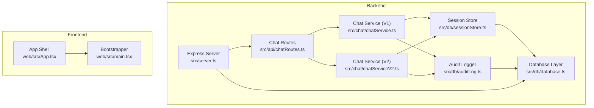
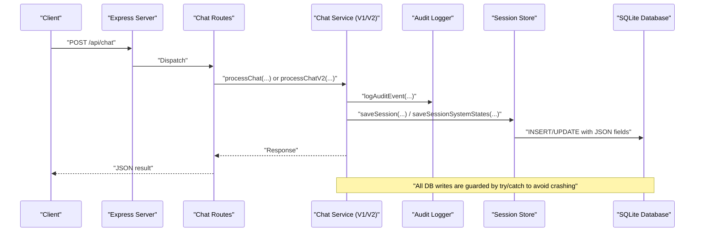
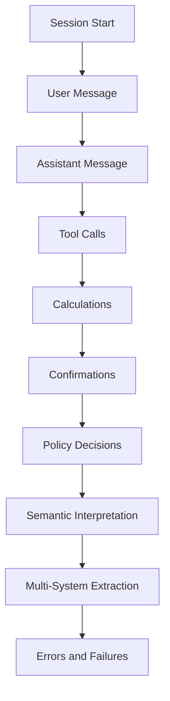
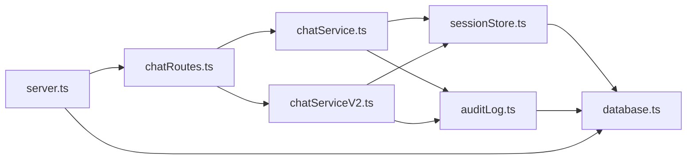

# Monitoring and Logging

<cite>
**Referenced Files in This Document**
- [server.ts](file://src/server.ts)
- [chatRoutes.ts](file://src/api/chatRoutes.ts)
- [chatService.ts](file://src/chat/chatService.ts)
- [chatServiceV2.ts](file://src/chat/chatServiceV2.ts)
- [auditLog.ts](file://src/db/auditLog.ts)
- [sessionStore.ts](file://src/db/sessionStore.ts)
- [database.ts](file://src/db/database.ts)
- [package.json](file://package.json)
- [App.tsx](file://web/src/App.tsx)
- [main.tsx](file://web/src/main.tsx)
</cite>

## Table of Contents
1. [Introduction](#introduction)
2. [Project Structure](#project-structure)
3. [Core Components](#core-components)
4. [Architecture Overview](#architecture-overview)
5. [Detailed Component Analysis](#detailed-component-analysis)
6. [Dependency Analysis](#dependency-analysis)
7. [Performance Considerations](#performance-considerations)
8. [Troubleshooting Guide](#troubleshooting-guide)
9. [Conclusion](#conclusion)
10. [Appendices](#appendices)

## Introduction
This document provides comprehensive monitoring and logging guidance for the GATIOD Chat Assistant. It covers:
- Audit logging and interaction traceability for medico-legal compliance
- Session tracking and persistence
- Performance monitoring and observability
- System health checks and alerting
- Database monitoring for SQLite operations
- Frontend monitoring for user experience and error tracking
- Log aggregation, retention, and security considerations for sensitive medical data
- Troubleshooting workflows and log analysis techniques

## Project Structure
The monitoring and logging ecosystem spans the backend server, API routes, chat orchestration services, database layer, and the frontend application.

**Diagram sources**
- [server.ts:1-68](file://src/server.ts#L1-L68)
- [chatRoutes.ts:1-91](file://src/api/chatRoutes.ts#L1-L91)
- [chatService.ts:1-183](file://src/chat/chatService.ts#L1-L183)
- [chatServiceV2.ts:1-800](file://src/chat/chatServiceV2.ts#L1-L800)
- [auditLog.ts:1-91](file://src/db/auditLog.ts#L1-L91)
- [sessionStore.ts:1-110](file://src/db/sessionStore.ts#L1-L110)
- [database.ts:1-57](file://src/db/database.ts#L1-L57)
- [App.tsx:1-23](file://web/src/App.tsx#L1-L23)
- [main.tsx:1-15](file://web/src/main.tsx#L1-L15)

**Section sources**
- [server.ts:1-68](file://src/server.ts#L1-L68)
- [chatRoutes.ts:1-91](file://src/api/chatRoutes.ts#L1-L91)
- [chatService.ts:1-183](file://src/chat/chatService.ts#L1-L183)
- [chatServiceV2.ts:1-800](file://src/chat/chatServiceV2.ts#L1-L800)
- [auditLog.ts:1-91](file://src/db/auditLog.ts#L1-L91)
- [sessionStore.ts:1-110](file://src/db/sessionStore.ts#L1-L110)
- [database.ts:1-57](file://src/db/database.ts#L1-L57)
- [App.tsx:1-23](file://web/src/App.tsx#L1-L23)
- [main.tsx:1-15](file://web/src/main.tsx#L1-L15)

## Core Components
- Audit logging: Centralized event logging for every assessment interaction, enabling full traceability for medico-legal purposes.
- Session tracking: Database-backed persistence of chat sessions across restarts and resumptions.
- Health checks: Basic service health endpoint for uptime monitoring.
- Database layer: SQLite-backed schema with indexes optimized for audit and session queries.
- Frontend shell: Minimal React application bootstrapped with Material UI.

Key responsibilities:
- Audit logging: Capture session lifecycle, user messages, assistant responses, tool calls, confirmations, calculations, and policy decisions.
- Session storage: Save and restore conversation history, system states, and metadata.
- Database initialization: Create tables and indexes; manage connection pragmas for WAL mode and busy timeouts.
- Health endpoint: Expose a simple JSON health check for monitoring systems.

**Section sources**
- [auditLog.ts:58-91](file://src/db/auditLog.ts#L58-L91)
- [sessionStore.ts:21-110](file://src/db/sessionStore.ts#L21-L110)
- [database.ts:11-57](file://src/db/database.ts#L11-L57)
- [server.ts:25-28](file://src/server.ts#L25-L28)
- [App.tsx:1-23](file://web/src/App.tsx#L1-L23)
- [main.tsx:1-15](file://web/src/main.tsx#L1-L15)

## Architecture Overview
The monitoring architecture integrates logging, auditing, and session persistence into the request flow.

**Diagram sources**
- [chatRoutes.ts:14-66](file://src/api/chatRoutes.ts#L14-L66)
- [chatService.ts:38-154](file://src/chat/chatService.ts#L38-L154)
- [chatServiceV2.ts:258-800](file://src/chat/chatServiceV2.ts#L258-L800)
- [auditLog.ts:58-73](file://src/db/auditLog.ts#L58-L73)
- [sessionStore.ts:21-67](file://src/db/sessionStore.ts#L21-L67)
- [database.ts:20-46](file://src/db/database.ts#L20-L46)

## Detailed Component Analysis

### Audit Logging System
Purpose:
- Provide complete interaction traceability for medico-legal compliance.
- Record every significant event in a session lifecycle.

Implementation highlights:
- Event types enumerate all meaningful actions (session start, user message, assistant message, tool calls, confirmations, calculations, policy decisions, semantic interpretation events, and more).
- Audit entries include sessionId, optional userId, event type, and structured event data payload.
- Logging is resilient: failures are caught and logged to console without crashing the service.

Audit trail retrieval:
- Fetch ordered events by created_at for a given sessionId.

Security and privacy:
- Avoid logging protected health information (PHI) in event payloads. If PHI is required for traceability, mask or redact it before insertion.

Compliance:
- Maintain immutable audit logs; ensure write-once semantics and enforce retention policies.

**Section sources**
- [auditLog.ts:8-49](file://src/db/auditLog.ts#L8-L49)
- [auditLog.ts:51-56](file://src/db/auditLog.ts#L51-L56)
- [auditLog.ts:58-91](file://src/db/auditLog.ts#L58-L91)

#### Audit Event Types and Coverage

**Diagram sources**
- [auditLog.ts:8-49](file://src/db/auditLog.ts#L8-L49)

### Session Tracking and Persistence
Purpose:
- Persist chat sessions across server restarts and enable resumption.
- Track system states for V2 flows.

Key operations:
- Save session with JSON-serialized history and system states.
- Upsert on conflict to preserve metadata (userId, claimId).
- Load session with deserialization.
- Complete or abandon sessions.
- List recent sessions for a user.

Indexes:
- Composite indexes on user_id, claim_id, and status for efficient queries.

**Section sources**
- [sessionStore.ts:21-110](file://src/db/sessionStore.ts#L21-L110)
- [database.ts:20-46](file://src/db/database.ts#L20-L46)

### Database Layer and SQLite Monitoring
Purpose:
- Provide a durable, ACID-compliant store for sessions and audit logs.
- Support future migration to PostgreSQL.

Initialization and pragmas:
- WAL mode for improved concurrency.
- Busy timeout to reduce lock contention under load.
- Schema creation with indexes on audit and session tables.

Operational tips:
- Monitor journal_mode and busy_timeout settings.
- Track slow queries using SQLite’s PRAGMA settings and EXPLAIN QUERY PLAN.
- Back up the database regularly; monitor file size growth.

**Section sources**
- [database.ts:11-57](file://src/db/database.ts#L11-L57)

### Health Checks and Uptime Monitoring
Purpose:
- Expose a simple health endpoint for uptime and basic service checks.

Endpoint:
- GET /health returns a JSON object indicating service status.

Recommendations:
- Integrate with external monitoring (e.g., synthetic checks, load balancer health probes).
- Alert on sustained downtime or degraded response times.

**Section sources**
- [server.ts:25-28](file://src/server.ts#L25-L28)

### Frontend Monitoring and User Experience
Purpose:
- Provide a minimal React shell for the chat assistant.
- No explicit frontend logging is implemented; rely on backend audit logs for traceability.

Observability hooks:
- Wrap API calls with timing and error reporting.
- Surface user-facing errors gracefully.
- Track user interactions indirectly via backend audit events.

**Section sources**
- [App.tsx:1-23](file://web/src/App.tsx#L1-23)
- [main.tsx:1-15](file://web/src/main.tsx#L1-15)

## Dependency Analysis

**Diagram sources**
- [server.ts:1-68](file://src/server.ts#L1-L68)
- [chatRoutes.ts:1-91](file://src/api/chatRoutes.ts#L1-L91)
- [chatService.ts:1-183](file://src/chat/chatService.ts#L1-L183)
- [chatServiceV2.ts:1-800](file://src/chat/chatServiceV2.ts#L1-L800)
- [auditLog.ts:1-91](file://src/db/auditLog.ts#L1-L91)
- [sessionStore.ts:1-110](file://src/db/sessionStore.ts#L1-L110)
- [database.ts:1-57](file://src/db/database.ts#L1-L57)

**Section sources**
- [package.json:21-44](file://package.json#L21-L44)

## Performance Considerations
Current implementation characteristics:
- SQLite with WAL mode and busy_timeout configured for concurrency and responsiveness.
- JSON columns store conversation history and system states; ensure payloads remain reasonable to avoid large I/O.
- Retry logic for Gemini API calls with bounded attempts and delays.

Recommended metrics to track:
- Response latency for /api/chat and /api/chat/v2
- Throughput (requests per second)
- Error rates (HTTP 5xx, Gemini quota/timeouts)
- Database query durations and slow query thresholds
- Memory usage and GC pauses
- Session persistence latency

Optimization ideas:
- Add structured logging with correlation IDs to trace requests across services.
- Instrument Gemini calls with timing and error counters.
- Consider connection pooling for database operations if scaling horizontally.
- Add circuit breaker patterns for external API calls.

[No sources needed since this section provides general guidance]

## Troubleshooting Guide
Common scenarios and resolutions:

- Audit logging failures
  - Symptom: Console error about failing to log an event.
  - Action: Verify database connectivity and permissions; ensure WAL mode and busy_timeout are applied; confirm table creation succeeded.
  - Evidence: Audit logging is wrapped in try/catch to prevent crashes.

- Session persistence failures
  - Symptom: Session not saved or overwritten unexpectedly.
  - Action: Confirm UPSERT logic and JSON serialization; verify indexes exist; check for concurrent updates.

- Gemini API errors
  - Symptom: Rate limit or availability errors surfaced to users.
  - Action: Inspect retry behavior and error classification; verify GEMINI_API_KEY presence; consider throttling or queueing.

- Health check failures
  - Symptom: Monitoring reports service down.
  - Action: Check port binding, environment variables, and startup logs; ensure system registry validation passes.

- Frontend not loading static assets
  - Symptom: Blank page in production.
  - Action: Confirm web/dist exists and is served; verify static file middleware and fallback route.

**Section sources**
- [auditLog.ts:69-72](file://src/db/auditLog.ts#L69-L72)
- [chatService.ts:82-96](file://src/chat/chatService.ts#L82-L96)
- [server.ts:45-65](file://src/server.ts#L45-L65)

## Conclusion
The GATIOD Chat Assistant implements a robust audit logging and session persistence foundation suitable for medico-legal traceability. By instrumenting performance metrics, enhancing structured logging, and establishing health monitoring and alerting, the system can achieve strong observability. Database operations are SQLite-centric with clear room for migration and scaling. The frontend is minimal and relies on backend logs for traceability.

[No sources needed since this section summarizes without analyzing specific files]

## Appendices

### Log Levels and Structured Logging
- Use a structured logging library to emit JSON-formatted logs with fields such as timestamp, level, service, component, correlationId, and payload.
- Separate audit logs from operational logs; keep audit logs immutable and secure.
- Avoid logging PHI; sanitize payloads before insertion.

[No sources needed since this section provides general guidance]

### Audit Trail Generation for Medical Legal Purposes
- Capture every user action, assistant response, tool execution, and policy decision.
- Include contextual metadata (userId, claimId, sessionId, timestamps).
- Maintain chronological ordering and enable export for compliance.

**Section sources**
- [auditLog.ts:58-91](file://src/db/auditLog.ts#L58-L91)

### Performance Monitoring Metrics
- Latency: p50, p90, p95, p99 for API endpoints
- Throughput: requests per second
- Error rates: HTTP 4xx/5xx, Gemini-specific errors
- Database: query counts, durations, slow queries
- Resource utilization: CPU, memory, disk I/O

[No sources needed since this section provides general guidance]

### System Health Checks and Alerting
- Health endpoint: GET /health
- Synthetic checks: periodic probing from monitoring systems
- Alerts: downtime, high error rates, slow response times, database connectivity issues

**Section sources**
- [server.ts:25-28](file://src/server.ts#L25-L28)

### Database Monitoring for SQLite Operations
- Enable PRAGMA settings for diagnostics
- Monitor busy_timeout and journal_mode
- Track slow queries and index usage
- Plan backups and retention

**Section sources**
- [database.ts:14-18](file://src/db/database.ts#L14-L18)
- [database.ts:20-46](file://src/db/database.ts#L20-L46)

### Frontend Monitoring for User Experience
- Wrap API calls with timing and error reporting
- Surface user-facing errors gracefully
- Track user interactions indirectly via backend audit events

**Section sources**
- [App.tsx:1-23](file://web/src/App.tsx#L1-L23)
- [main.tsx:1-15](file://web/src/main.tsx#L1-L15)

### Log Aggregation, Retention, and Security
- Aggregate logs from backend and database
- Enforce retention policies aligned with regulatory requirements
- Encrypt logs at rest and in transit
- Restrict access to audit logs; maintain immutability

[No sources needed since this section provides general guidance]