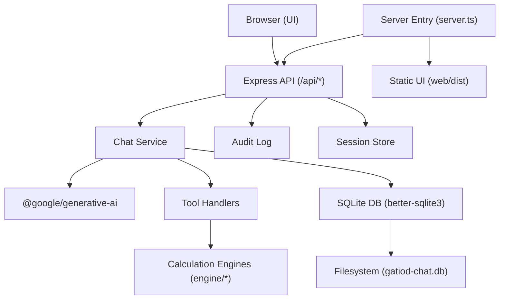
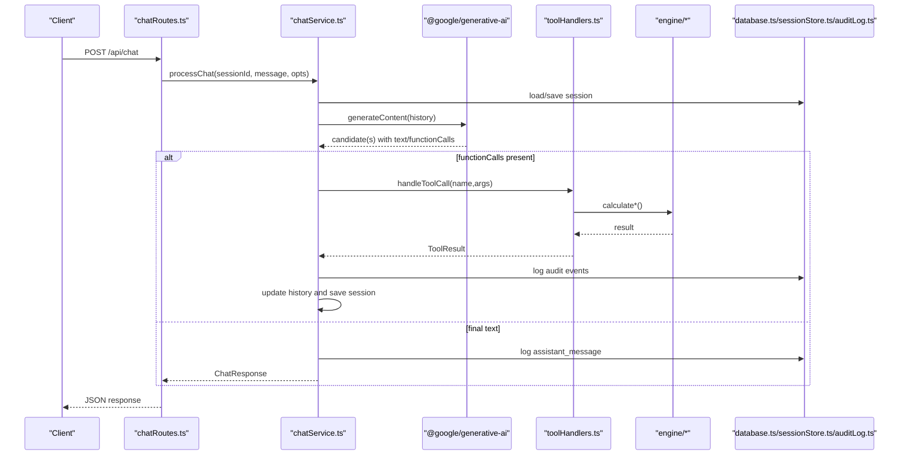
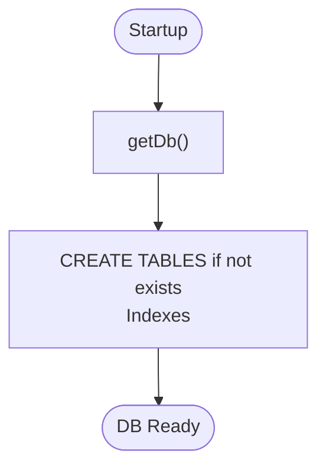
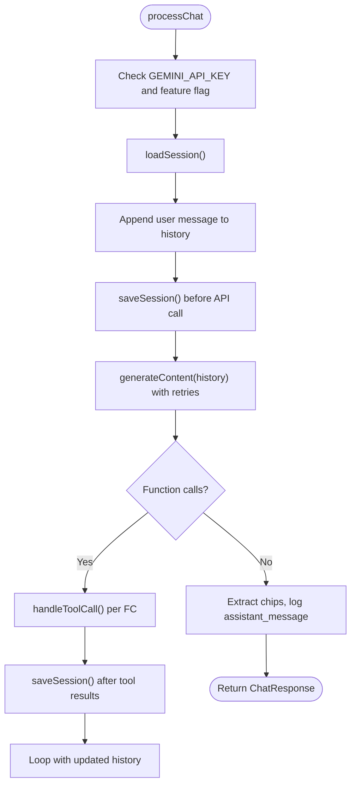
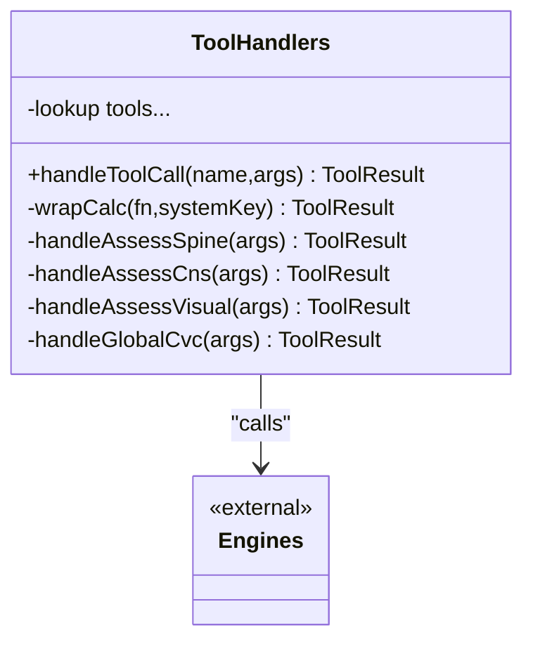
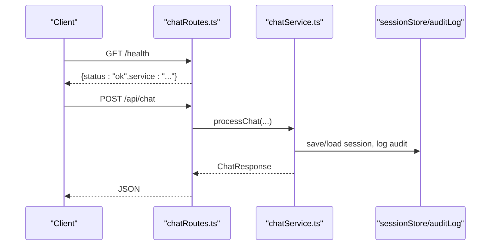
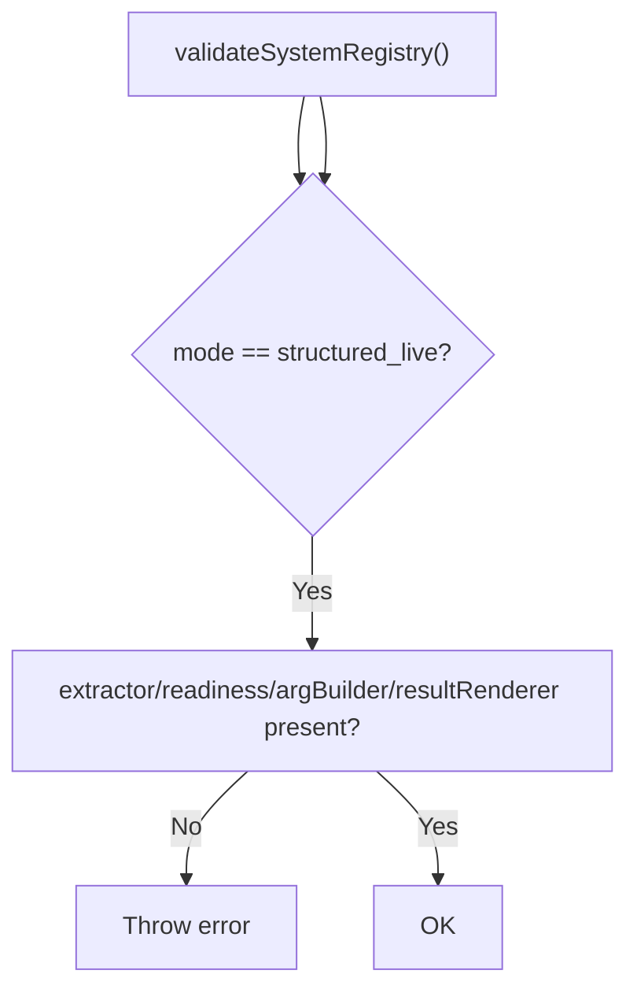
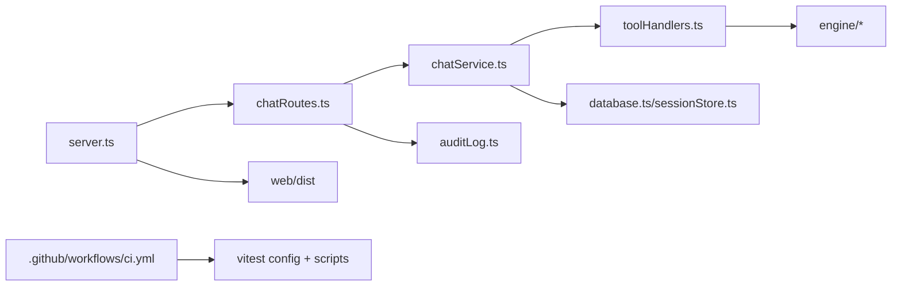

# Operational Procedures

<cite>
**Referenced Files in This Document**
- [README.md](file://README.md)
- [package.json](file://package.json)
- [vitest.config.ts](file://vitest.config.ts)
- [.github/workflows/ci.yml](file://.github/workflows/ci.yml)
- [src/server.ts](file://src/server.ts)
- [src/api/chatRoutes.ts](file://src/api/chatRoutes.ts)
- [src/chat/chatService.ts](file://src/chat/chatService.ts)
- [src/chat/systemPrompt.ts](file://src/chat/systemPrompt.ts)
- [src/db/database.ts](file://src/db/database.ts)
- [src/db/auditLog.ts](file://src/db/auditLog.ts)
- [src/db/sessionStore.ts](file://src/db/sessionStore.ts)
- [src/tools/toolHandlers.ts](file://src/tools/toolHandlers.ts)
- [src/v2/systemRegistry.ts](file://src/v2/systemRegistry.ts)
- [web/package.json](file://web/package.json)
</cite>

## Table of Contents
1. [Introduction](#introduction)
2. [Project Structure](#project-structure)
3. [Core Components](#core-components)
4. [Architecture Overview](#architecture-overview)
5. [Detailed Component Analysis](#detailed-component-analysis)
6. [Dependency Analysis](#dependency-analysis)
7. [Performance Considerations](#performance-considerations)
8. [Troubleshooting Guide](#troubleshooting-guide)
9. [Change Management and Rollout](#change-management-and-rollout)
10. [Backup and Disaster Recovery](#backup-and-disaster-recovery)
11. [Security Operations](#security-operations)
12. [Runbooks and Escalation](#runbooks-and-escalation)
13. [Capacity Planning and Scaling](#capacity-planning-and-scaling)
14. [Conclusion](#conclusion)

## Introduction
This document defines operational procedures for the GATIOD Chat Assistant. It covers routine maintenance (updates, database backups, logs, performance), incident response (failures, data issues, security, outages), deployment and rollback, change management, DR planning, security, runbooks, and capacity planning. The guidance is grounded in the repository’s code and configuration.

## Project Structure
The system comprises:
- Backend server and API routes
- Chat orchestration and system prompt
- Tool handlers bridging LLM function calls to calculation engines
- SQLite-backed session store and audit logging
- Frontend build assets served in production
- CI workflow enforcing quality gates

**Diagram sources**
- [src/server.ts:1-68](file://src/server.ts#L1-L68)
- [src/api/chatRoutes.ts:1-91](file://src/api/chatRoutes.ts#L1-L91)
- [src/chat/chatService.ts:1-183](file://src/chat/chatService.ts#L1-L183)
- [src/tools/toolHandlers.ts:1-435](file://src/tools/toolHandlers.ts#L1-L435)
- [src/db/database.ts:1-57](file://src/db/database.ts#L1-L57)
- [src/db/auditLog.ts:1-91](file://src/db/auditLog.ts#L1-L91)
- [src/db/sessionStore.ts:1-110](file://src/db/sessionStore.ts#L1-L110)
- [web/package.json:1-27](file://web/package.json#L1-L27)

**Section sources**
- [README.md:47-61](file://README.md#L47-L61)
- [src/server.ts:10-37](file://src/server.ts#L10-L37)
- [src/api/chatRoutes.ts:12-91](file://src/api/chatRoutes.ts#L12-L91)

## Core Components
- Server and API: Express server with CORS, JSON parsing, health endpoint, static UI serving, and route registration.
- Chat orchestration: Gemini model invocation with function calling, session persistence, audit logging, and retries.
- Tool handlers: Bridge between LLM function calls and deterministic calculation engines.
- Database: SQLite with WAL mode, indexes, and initialization script; session and audit tables.
- Audit logging: Full event trail per session for medico-legal traceability.
- Session store: CRUD for persisted chat sessions with status tracking.
- CI and testing: Vitest-based suites and CI workflow gating.

**Section sources**
- [src/server.ts:13-68](file://src/server.ts#L13-L68)
- [src/api/chatRoutes.ts:14-91](file://src/api/chatRoutes.ts#L14-L91)
- [src/chat/chatService.ts:38-183](file://src/chat/chatService.ts#L38-L183)
- [src/tools/toolHandlers.ts:47-102](file://src/tools/toolHandlers.ts#L47-L102)
- [src/db/database.ts:11-49](file://src/db/database.ts#L11-L49)
- [src/db/auditLog.ts:58-91](file://src/db/auditLog.ts#L58-L91)
- [src/db/sessionStore.ts:21-110](file://src/db/sessionStore.ts#L21-L110)
- [.github/workflows/ci.yml:17-60](file://.github/workflows/ci.yml#L17-L60)

## Architecture Overview
The system integrates a conversational frontend with a Gemini model, function-call tools, and deterministic calculation engines. Sessions and audit trails persist in SQLite. The server exposes health checks and serves the UI in production.

**Diagram sources**
- [src/api/chatRoutes.ts:14-66](file://src/api/chatRoutes.ts#L14-L66)
- [src/chat/chatService.ts:38-154](file://src/chat/chatService.ts#L38-L154)
- [src/tools/toolHandlers.ts:47-102](file://src/tools/toolHandlers.ts#L47-L102)
- [src/db/sessionStore.ts:21-44](file://src/db/sessionStore.ts#L21-L44)
- [src/db/auditLog.ts:58-73](file://src/db/auditLog.ts#L58-L73)

## Detailed Component Analysis

### Database Layer and Persistence
- SQLite with WAL mode and busy timeouts for concurrency.
- Initialization creates session and audit tables with supporting indexes.
- Session persistence supports resume and status tracking.
- Audit logging captures every assessment event for traceability.

**Diagram sources**
- [src/db/database.ts:11-49](file://src/db/database.ts#L11-L49)

**Section sources**
- [src/db/database.ts:11-57](file://src/db/database.ts#L11-L57)
- [src/db/sessionStore.ts:21-110](file://src/db/sessionStore.ts#L21-L110)
- [src/db/auditLog.ts:58-91](file://src/db/auditLog.ts#L58-L91)

### Chat Orchestration and Retry Logic
- Validates feature flag and API key.
- Persists session before invoking Gemini to ensure resilience.
- Retries with exponential backoff on transient errors.
- Logs safety and error events; surfaces user-friendly messages.

**Diagram sources**
- [src/chat/chatService.ts:38-154](file://src/chat/chatService.ts#L38-L154)

**Section sources**
- [src/chat/chatService.ts:38-183](file://src/chat/chatService.ts#L38-L183)

### Tool Handlers and Calculation Engines
- Centralized handler dispatches to system-specific calculators.
- Wraps results to include system key and final percent.
- Includes lookup tools for ROM, amputation, nerve, DBE, and dictionary search.

**Diagram sources**
- [src/tools/toolHandlers.ts:47-102](file://src/tools/toolHandlers.ts#L47-L102)

**Section sources**
- [src/tools/toolHandlers.ts:47-435](file://src/tools/toolHandlers.ts#L47-L435)

### API Surface and Health Checks
- Routes: POST /api/chat, POST /api/chat/v2, POST /api/chat/reset, GET /health, GET /api/chat/audit/:sessionId, GET /api/chat/sessions/:userId.
- Health endpoint returns service status.
- Optional shadow mode mirrors production traffic through v2 pipeline.

**Diagram sources**
- [src/api/chatRoutes.ts:14-91](file://src/api/chatRoutes.ts#L14-L91)
- [src/server.ts:25-28](file://src/server.ts#L25-L28)

**Section sources**
- [src/api/chatRoutes.ts:14-91](file://src/api/chatRoutes.ts#L14-L91)
- [src/server.ts:25-28](file://src/server.ts#L25-L28)

### V2 System Registry and Promotion Gates
- Defines structured extraction/readiness/argument building/renderer capabilities per system.
- Enforces “structured_live” promotion via ADR-0001 thresholds.
- Validates registry completeness at startup.

**Diagram sources**
- [src/v2/systemRegistry.ts:352-367](file://src/v2/systemRegistry.ts#L352-L367)

**Section sources**
- [src/v2/systemRegistry.ts:84-210](file://src/v2/systemRegistry.ts#L84-L210)
- [src/v2/systemRegistry.ts:266-327](file://src/v2/systemRegistry.ts#L266-L327)
- [src/v2/systemRegistry.ts:352-367](file://src/v2/systemRegistry.ts#L352-L367)

## Dependency Analysis
- Runtime dependencies include Express, CORS, better-sqlite3, UUID, Zod, and @google/generative-ai.
- Dev/test dependencies include Vitest, TypeScript, and related tooling.
- CI uses Node 20, runs type checks, default tests, Excel fixture freshness, Excel shadow suite, and ADR-0001 promotion checks.

**Diagram sources**
- [package.json:21-29](file://package.json#L21-L29)
- [vitest.config.ts:1-12](file://vitest.config.ts#L1-L12)
- [.github/workflows/ci.yml:26-60](file://.github/workflows/ci.yml#L26-L60)

**Section sources**
- [package.json:6-20](file://package.json#L6-L20)
- [vitest.config.ts:1-12](file://vitest.config.ts#L1-L12)
- [.github/workflows/ci.yml:17-60](file://.github/workflows/ci.yml#L17-L60)

## Performance Considerations
- Gemini retry strategy mitigates transient quota/timeouts.
- SQLite busy timeout and WAL mode improve concurrency.
- Session persistence before tool calls reduces risk of losing progress.
- Consider enabling shadow mode selectively for evaluation without impacting latency for production traffic.

[No sources needed since this section provides general guidance]

## Troubleshooting Guide
- Health endpoint: GET /health returns service status.
- Session audit: GET /api/chat/audit/:sessionId retrieves full event trail.
- Session listing: GET /api/chat/sessions/:userId lists recent sessions for a user.
- Reset session: POST /api/chat/reset clears a session.
- Feature flag and API key: If GATIOD_CHAT_ENABLED=false or GEMINI_API_KEY unset, operations fail early with clear messages.
- Safety and error events: Assistant messages and error entries are audited for diagnosis.

**Section sources**
- [src/server.ts:25-28](file://src/server.ts#L25-L28)
- [src/api/chatRoutes.ts:76-91](file://src/api/chatRoutes.ts#L76-L91)
- [src/chat/chatService.ts:47-49](file://src/chat/chatService.ts#L47-L49)
- [src/chat/chatService.ts:89-96](file://src/chat/chatService.ts#L89-L96)
- [src/db/auditLog.ts:58-91](file://src/db/auditLog.ts#L58-L91)

## Change Management and Rollout
- CI gates:
  - Type check
  - Default test suite
  - Excel fixture freshness
  - Excel shadow suite (threshold enforcement)
  - ADR-0001 promotion check
- Local development: npm run dev starts the server with hot reload; npm run test executes Vitest suites.
- Environment variables:
  - GEMINI_API_KEY required for chat
  - GATIOD_CHAT_ENABLED can disable chat
  - GATIOD_V2_SHADOW_MODE controls shadow mode
  - GATIOD_DEBUG_RESPONSES toggles verbose responses

**Section sources**
- [.github/workflows/ci.yml:17-60](file://.github/workflows/ci.yml#L17-L60)
- [package.json:6-20](file://package.json#L6-L20)
- [src/chat/chatService.ts:43-49](file://src/chat/chatService.ts#L43-L49)
- [src/api/chatRoutes.ts:28-33](file://src/api/chatRoutes.ts#L28-L33)

## Backup and Disaster Recovery
- Database location: configurable via GATIOD_DB_PATH; defaults to gatiod-chat.db in the working directory.
- Recommended backup strategy:
  - Stop writes during snapshot if consistency is required.
  - Copy gatiod-chat.db and web/dist assets.
  - Validate backup by restoring to a staging environment and running health checks.
- Restoration steps:
  - Restore gatiod-chat.db to the expected path.
  - Ensure proper permissions and environment variables.
  - Confirm /health endpoint responds and sessions are readable.
- Disaster recovery:
  - Maintain offsite copies of backups.
  - Test restore procedures regularly.
  - Monitor audit trail availability post-restore.

**Section sources**
- [src/db/database.ts:14](file://src/db/database.ts#L14)
- [src/server.ts:30-37](file://src/server.ts#L30-L37)

## Security Operations
- Access control:
  - No built-in authentication in the repository; restrict network exposure and enforce perimeter controls externally.
- Secrets:
  - GEMINI_API_KEY must be set; ensure secure storage and rotation.
- Vulnerability management:
  - Pin Node >= 20 and keep dependencies updated.
  - Run npm audit periodically and address critical/high severity issues.
- Compliance auditing:
  - Audit logs capture every event for traceability; retain logs per policy and ensure immutable archival where required.

**Section sources**
- [src/server.ts:52-54](file://src/server.ts#L52-L54)
- [src/db/auditLog.ts:58-91](file://src/db/auditLog.ts#L58-L91)
- [package.json:41-43](file://package.json#L41-L43)

## Runbooks and Escalation
- Routine maintenance:
  - Apply OS and Node updates, then rebuild and restart.
  - Rotate logs by archiving and pruning old entries.
  - Validate database integrity and indexes.
- Incident response:
  - System failure: Check /health, restart server if needed, verify port availability, and confirm audit logs for error events.
  - Data corruption: Restore from backup, validate schema and indexes, re-run tests.
  - Security breach: Rotate secrets, audit logs, redeploy with updated configuration, and notify stakeholders.
  - Service outage: Enable shadow mode for diagnostics, scale resources, and monitor error rates.
- Escalation:
  - Define primary and secondary contacts; escalate based on impact and duration.
  - Communicate SLA breaches and remediation timelines to stakeholders.

[No sources needed since this section provides general guidance]

## Capacity Planning and Scaling
- Horizontal scaling: Deploy multiple instances behind a load balancer; ensure shared filesystem or stateless design for sessions.
- Vertical scaling: Increase CPU/RAM and tune Node worker threads; monitor memory and GC pauses.
- Database tuning: Monitor WAL checkpoint frequency, vacuum/analyze periodically, and consider read replicas for reporting.
- Observability: Instrument latency, throughput, error rates, and queue depths; alert on saturation.

[No sources needed since this section provides general guidance]

## Conclusion
These procedures align operational activities with the repository’s architecture and configuration. They emphasize reliability, traceability, and disciplined change control, ensuring the GATIOD Chat Assistant remains robust and maintainable in production.