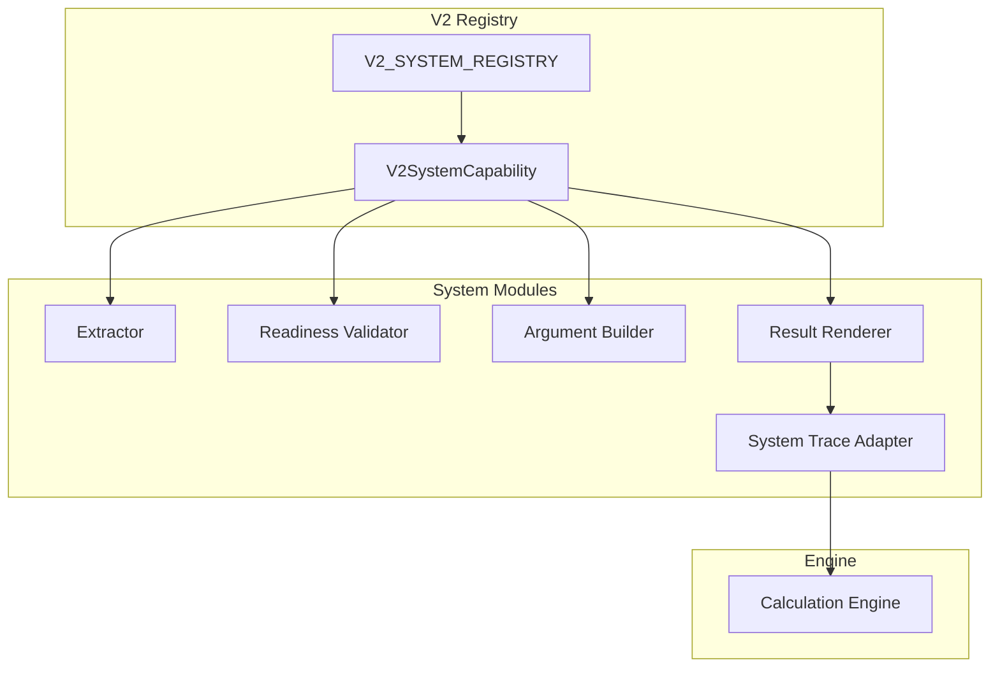
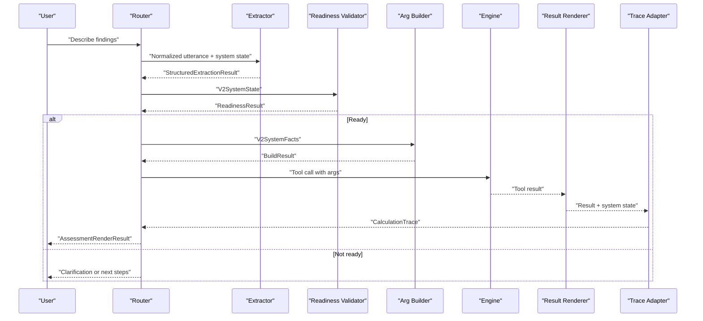
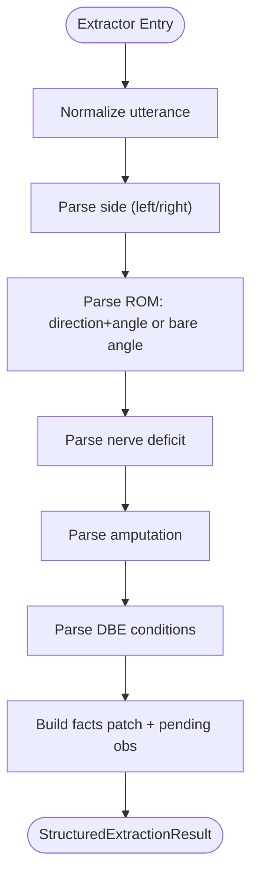
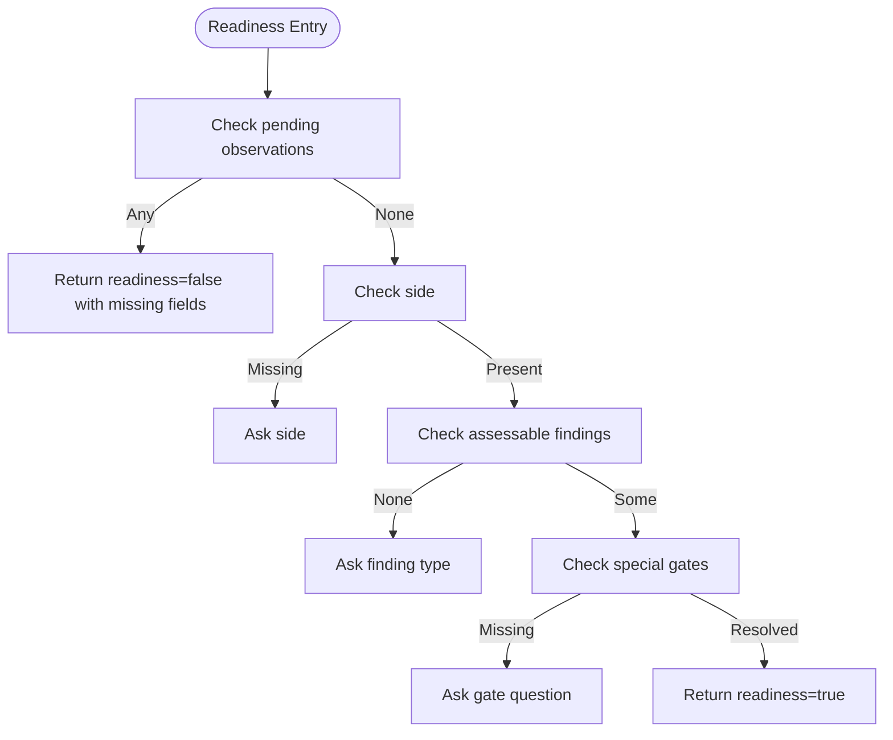
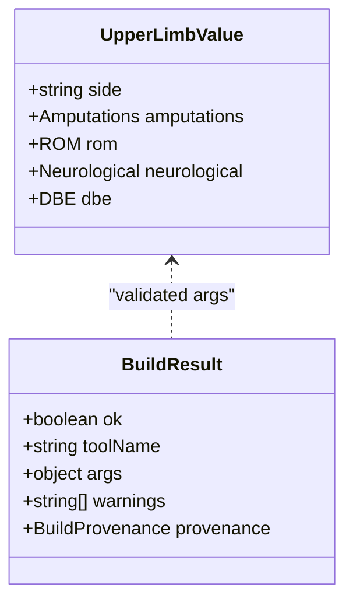
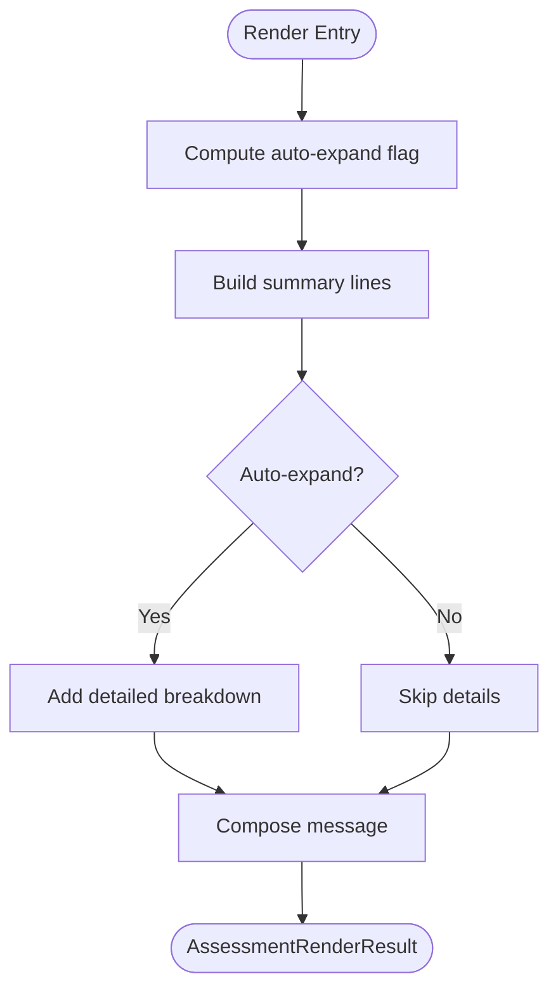
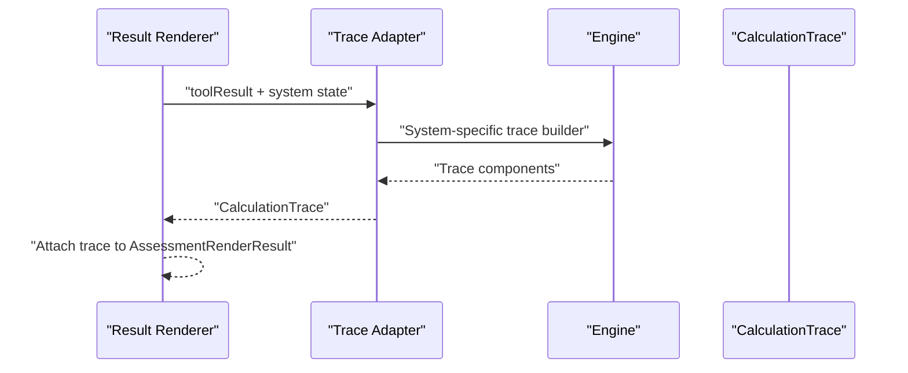
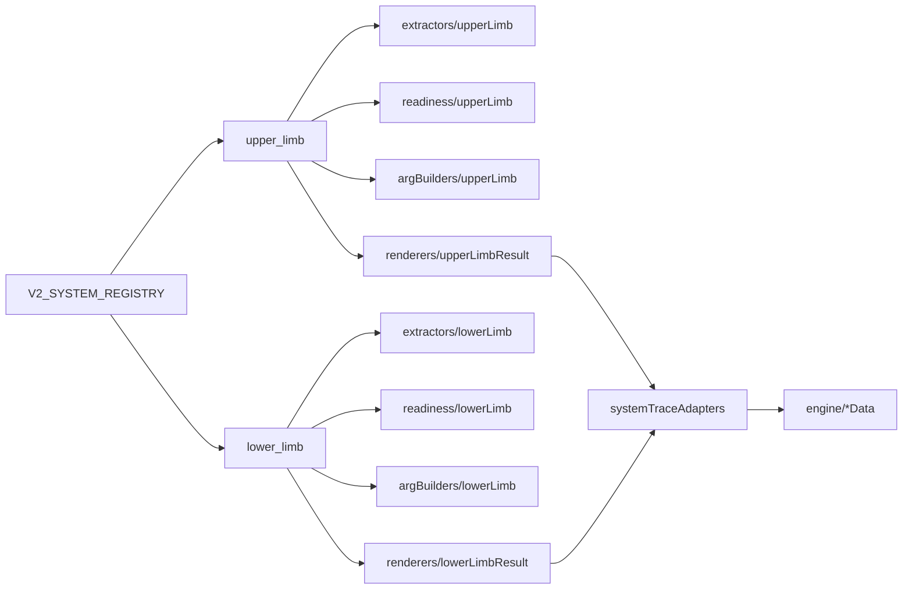

# Adding New Body Systems

<cite>
**Referenced Files in This Document**
- [systemRegistry.ts](file://src/v2/systemRegistry.ts)
- [contracts.ts](file://src/v2/contracts.ts)
- [upperLimb.ts](file://src/v2/extractors/upperLimb.ts)
- [upperLimbReadiness.ts](file://src/v2/readiness/upperLimb.ts)
- [upperLimbArgBuilder.ts](file://src/v2/argBuilders/upperLimb.ts)
- [upperLimbResultRenderer.ts](file://src/v2/renderers/upperLimbResult.ts)
- [lowerLimb.ts](file://src/v2/extractors/lowerLimb.ts)
- [systemTraceAdapters.ts](file://src/v2/systemTraceAdapters.ts)
- [assessmentInstanceRules.ts](file://src/v2/assessmentInstanceRules.ts)
- [engineIndex.ts](file://src/engine/index.ts)
- [systemRegistry.test.ts](file://tests/v2/systemRegistry.test.ts)
- [upperLimbExtractor.test.ts](file://tests/v2/upperLimb/extractor.test.ts)
- [upperLimbReadinessAndArgBuilder.test.ts](file://tests/v2/upperLimb/readinessAndArgBuilder.test.ts)
- [0001-structured-live-promotion-gate.md](file://docs/adr/0001-structured-live-promotion-gate.md)
- [stateMachine.ts](file://src/v2/stateMachine.ts)
</cite>

## Table of Contents
1. [Introduction](#introduction)
2. [Project Structure](#project-structure)
3. [Core Components](#core-components)
4. [Architecture Overview](#architecture-overview)
5. [Detailed Component Analysis](#detailed-component-analysis)
6. [Dependency Analysis](#dependency-analysis)
7. [Performance Considerations](#performance-considerations)
8. [Troubleshooting Guide](#troubleshooting-guide)
9. [Conclusion](#conclusion)
10. [Appendices](#appendices)

## Introduction
This document explains how to extend the GATIOD V2 system registry with new body systems. It covers the V2SystemCapability interface, registration in the V2_SYSTEM_REGISTRY, and the four required components per system: extractor, readiness validator, argument builder, and result renderer. It also documents system migration modes (legacy, structured_shadow, structured_live), promotion criteria, system trace adapters, and testing/validation patterns.

## Project Structure
The V2 system registry organizes each body system as a cohesive module with four primary components plus supporting infrastructure:
- Extractors: parse normalized utterances into structured facts
- Readiness validators: gate readiness to proceed to assessment
- Argument builders: assemble tool arguments from facts
- Result renderers: transform tool results into user-facing messages
- System trace adapters: build calculation traces for auditability
- Instance rules: define multi-instance semantics and validation
- Engine integration: pure calculation functions for each system

**Diagram sources**
- [systemRegistry.ts:84-178](file://src/v2/systemRegistry.ts#L84-L178)
- [systemTraceAdapters.ts:523-555](file://src/v2/systemTraceAdapters.ts#L523-L555)
- [engineIndex.ts:1-89](file://src/engine/index.ts#L1-L89)

**Section sources**
- [systemRegistry.ts:84-178](file://src/v2/systemRegistry.ts#L84-L178)
- [contracts.ts:74-83](file://src/v2/contracts.ts#L74-L83)

## Core Components
Each system capability must expose four functions and a migration mode:
- StructuredExtractor: parses utterance into StructuredExtractionResult
- ReadinessValidator: validates readiness for structured assessment
- ToolArgBuilder: builds tool arguments from V2SystemFacts
- ResultRenderer: renders AssessmentRenderResult from tool result

These are declared in the V2SystemCapability interface and wired in V2_SYSTEM_REGISTRY.

**Section sources**
- [systemRegistry.ts:72-82](file://src/v2/systemRegistry.ts#L72-L82)
- [systemRegistry.ts:84-178](file://src/v2/systemRegistry.ts#L84-L178)

## Architecture Overview
The V2 pipeline orchestrates structured extraction, readiness checks, tool argument construction, and result rendering. System trace adapters translate tool results into CalculationTrace for auditability.

**Diagram sources**
- [systemRegistry.ts:55-71](file://src/v2/systemRegistry.ts#L55-L71)
- [systemTraceAdapters.ts:523-555](file://src/v2/systemTraceAdapters.ts#L523-L555)
- [engineIndex.ts:1-89](file://src/engine/index.ts#L1-L89)

## Detailed Component Analysis

### V2SystemCapability and Registration
- V2SystemCapability defines the contract for each system, including system key, migration mode, and optional component functions.
- V2_SYSTEM_REGISTRY maps system keys to capabilities, wiring extractors, readiness validators, arg builders, and renderers.

Implementation highlights:
- SystemMigrationMode supports "legacy", "structured_shadow", and "structured_live".
- PROVISIONAL_STRUCTURED_LIVE lists systems currently live without full ADR-0001 evidence.
- validateStructuredLivePromotion enforces ADR-0001 gates with curated goldens and Excel shadow thresholds.

**Section sources**
- [systemRegistry.ts](file://src/v2/systemRegistry.ts#L43)
- [systemRegistry.ts:72-82](file://src/v2/systemRegistry.ts#L72-L82)
- [systemRegistry.ts:84-178](file://src/v2/systemRegistry.ts#L84-L178)
- [systemRegistry.ts:202-210](file://src/v2/systemRegistry.ts#L202-L210)
- [systemRegistry.ts:266-327](file://src/v2/systemRegistry.ts#L266-L327)
- [0001-structured-live-promotion-gate.md:13-56](file://docs/adr/0001-structured-live-promotion-gate.md#L13-L56)

### Extractors: Parsing Utterances into Structured Facts
Extractors convert normalized text into structured facts and pending observations. They:
- Identify anatomical sides, joints, directions, and angles
- Detect nerve deficits, amputations, and diagnosis-based estimates
- Populate slot signals and display values
- Create pending observations for missing fields

Example patterns from upper limb and lower limb extractors:
- Direction-angle parsing with strict and loose fallbacks
- Joint canonicalization and parenthetical finger/Toe specification
- Nerve selection with deficit type and loss type
- Amputation level mapping and digit/Toe amputation classification
- DBE condition auto-population from ontology matches

**Diagram sources**
- [upperLimb.ts:191-591](file://src/v2/extractors/upperLimb.ts#L191-L591)
- [lowerLimb.ts:280-766](file://src/v2/extractors/lowerLimb.ts#L280-L766)

**Section sources**
- [upperLimb.ts:191-591](file://src/v2/extractors/upperLimb.ts#L191-L591)
- [lowerLimb.ts:280-766](file://src/v2/extractors/lowerLimb.ts#L280-L766)

### Readiness Validators: Gate to Assessment
Readiness validators ensure:
- No pending observations remain
- Required fields are present (e.g., side)
- At least one assessable finding stream exists
- Special gates are resolved (e.g., ROM-from-nerve)

**Diagram sources**
- [upperLimbReadiness.ts:12-85](file://src/v2/readiness/upperLimb.ts#L12-L85)

**Section sources**
- [upperLimbReadiness.ts:12-85](file://src/v2/readiness/upperLimb.ts#L12-L85)

### Argument Builders: Assemble Tool Arguments
Arg builders:
- Transform extracted facts into tool argument schemas
- Zero-fill missing fields for optional streams
- Compute provenance (user-supplied vs builder-zero-filled)
- Validate against system-specific schemas

**Diagram sources**
- [upperLimbArgBuilder.ts:20-140](file://src/v2/argBuilders/upperLimb.ts#L20-L140)
- [engineIndex.ts:16-41](file://src/engine/index.ts#L16-L41)

**Section sources**
- [upperLimbArgBuilder.ts:20-140](file://src/v2/argBuilders/upperLimb.ts#L20-L140)
- [engineIndex.ts:16-41](file://src/engine/index.ts#L16-L41)

### Result Renderers: Present Calculations to Users
Result renderers:
- Summarize system PI% and per-stream contributions
- Expand into detailed breakdowns when conflicts or multiple streams exist
- Provide chips for deeper inspection

**Diagram sources**
- [upperLimbResultRenderer.ts:23-129](file://src/v2/renderers/upperLimbResult.ts#L23-L129)

**Section sources**
- [upperLimbResultRenderer.ts:23-129](file://src/v2/renderers/upperLimbResult.ts#L23-L129)

### System Trace Adapters: Auditability and Transparency
System trace adapters:
- Convert tool results into CalculationTrace for each system
- Capture caps, conflicts, and rule notes
- Support different aggregation strategies (CVC, additive, highest, none)

**Diagram sources**
- [systemTraceAdapters.ts:523-555](file://src/v2/systemTraceAdapters.ts#L523-L555)
- [engineIndex.ts:16-89](file://src/engine/index.ts#L16-L89)

**Section sources**
- [systemTraceAdapters.ts:74-129](file://src/v2/systemTraceAdapters.ts#L74-L129)
- [systemTraceAdapters.ts:131-188](file://src/v2/systemTraceAdapters.ts#L131-L188)
- [systemTraceAdapters.ts:190-242](file://src/v2/systemTraceAdapters.ts#L190-L242)
- [systemTraceAdapters.ts:244-281](file://src/v2/systemTraceAdapters.ts#L244-L281)
- [systemTraceAdapters.ts:283-307](file://src/v2/systemTraceAdapters.ts#L283-L307)
- [systemTraceAdapters.ts:309-347](file://src/v2/systemTraceAdapters.ts#L309-L347)
- [systemTraceAdapters.ts:349-403](file://src/v2/systemTraceAdapters.ts#L349-L403)
- [systemTraceAdapters.ts:405-473](file://src/v2/systemTraceAdapters.ts#L405-L473)
- [systemTraceAdapters.ts:475-516](file://src/v2/systemTraceAdapters.ts#L475-L516)
- [systemTraceAdapters.ts:523-555](file://src/v2/systemTraceAdapters.ts#L523-L555)

### Assessment Instance Rules: Multi-Instance Semantics
Instance rules define:
- Which systems allow multiple instances
- Slot hierarchies and constraints
- Combination methods (CVC, additive, highest, none)
- Validation to prevent duplicate compensation

Examples:
- Upper/lower limb: bilateral sides with multiple joints
- Spine: fixed regional slots with highest award override
- Hearing: dynamic slots (NID vs injury) with mutual exclusivity
- Visual: fixed slots with per-eye caps and additive subtotal

**Section sources**
- [assessmentInstanceRules.ts:95-146](file://src/v2/assessmentInstanceRules.ts#L95-L146)
- [assessmentInstanceRules.ts:148-178](file://src/v2/assessmentInstanceRules.ts#L148-L178)
- [assessmentInstanceRules.ts:180-201](file://src/v2/assessmentInstanceRules.ts#L180-L201)
- [assessmentInstanceRules.ts:203-221](file://src/v2/assessmentInstanceRules.ts#L203-L221)
- [assessmentInstanceRules.ts:223-235](file://src/v2/assessmentInstanceRules.ts#L223-L235)
- [assessmentInstanceRules.ts:237-255](file://src/v2/assessmentInstanceRules.ts#L237-L255)
- [assessmentInstanceRules.ts:257-268](file://src/v2/assessmentInstanceRules.ts#L257-L268)
- [assessmentInstanceRules.ts:270-281](file://src/v2/assessmentInstanceRules.ts#L270-L281)

## Dependency Analysis
The registry maintains strong coupling between components per system while preserving modularity across systems. Extractors depend on contracts and engine data structures; renderers depend on engine results; trace adapters depend on both.

**Diagram sources**
- [systemRegistry.ts:14-41](file://src/v2/systemRegistry.ts#L14-L41)
- [systemTraceAdapters.ts:13-29](file://src/v2/systemTraceAdapters.ts#L13-L29)
- [engineIndex.ts:16-89](file://src/engine/index.ts#L16-L89)

**Section sources**
- [systemRegistry.ts:14-41](file://src/v2/systemRegistry.ts#L14-L41)
- [systemTraceAdapters.ts:13-29](file://src/v2/systemTraceAdapters.ts#L13-L29)
- [engineIndex.ts:16-89](file://src/engine/index.ts#L16-L89)

## Performance Considerations
- Regex-based extraction scales linearly with text length; optimize patterns and reuse compiled regexes.
- Prefer longest-match strategies for ambiguous joint names to reduce retries.
- Minimize pending observations to avoid repeated readiness checks.
- Use zero-filling in arg builders to keep schemas minimal and fast to validate.
- Leverage provenance hashing to detect unchanged states and avoid redundant calculations.

## Troubleshooting Guide
Common issues and debugging techniques:
- Readiness failures: Inspect pending observations and missing fields; ensure all required facts are collected.
- Schema validation errors: Review arg builder provenance and ensure all required fields are populated.
- Extractor ambiguity: Add clearer prompts for direction/joint/Toe/finger when bare angles are provided.
- Trace generation failures: Verify tool result types match expected shapes for the system.

Testing patterns:
- Extractor tests validate side detection, ROM parsing, nerve extraction, amputation mapping, and DBE auto-population.
- Readiness and arg builder tests validate gating logic and schema compliance.
- System registry tests validate wiring and promotion criteria.

**Section sources**
- [upperLimbExtractor.test.ts:23-172](file://tests/v2/upperLimb/extractor.test.ts#L23-L172)
- [upperLimbReadinessAndArgBuilder.test.ts:19-155](file://tests/v2/upperLimb/readinessAndArgBuilder.test.ts#L19-L155)
- [systemRegistry.test.ts:11-155](file://tests/v2/systemRegistry.test.ts#L11-L155)

## Conclusion
Extending GATIOD with new body systems follows a clear, repeatable pattern: implement the four components, wire them in the registry, define instance rules, and ensure robust testing. Migration modes and promotion criteria guarantee safety and quality before systems reach structured_live status.

## Appendices

### Step-by-Step: Adding a New System
1. Define system key in contracts and add to SYSTEM_KEYS.
2. Create extractor, readiness validator, arg builder, and result renderer modules.
3. Wire them into V2_SYSTEM_REGISTRY with appropriate migration mode.
4. Implement system trace adapter for auditability.
5. Add instance rules and validation logic.
6. Write comprehensive tests mirroring existing patterns.
7. Validate registry wiring and promotion criteria.

**Section sources**
- [contracts.ts:74-83](file://src/v2/contracts.ts#L74-L83)
- [stateMachine.ts:24-34](file://src/v2/stateMachine.ts#L24-L34)
- [systemRegistry.ts:84-178](file://src/v2/systemRegistry.ts#L84-L178)
- [systemTraceAdapters.ts:523-555](file://src/v2/systemTraceAdapters.ts#L523-L555)
- [assessmentInstanceRules.ts:287-297](file://src/v2/assessmentInstanceRules.ts#L287-L297)
- [systemRegistry.test.ts:11-155](file://tests/v2/systemRegistry.test.ts#L11-L155)