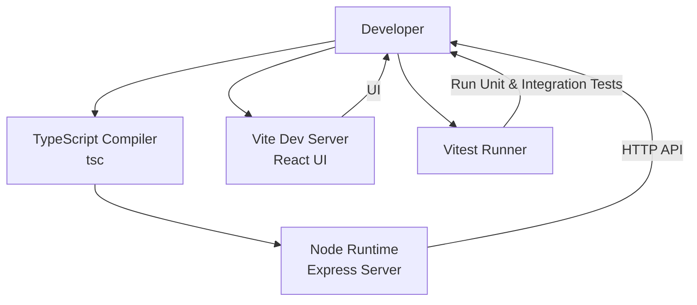
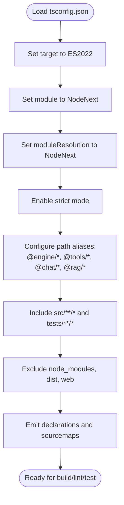
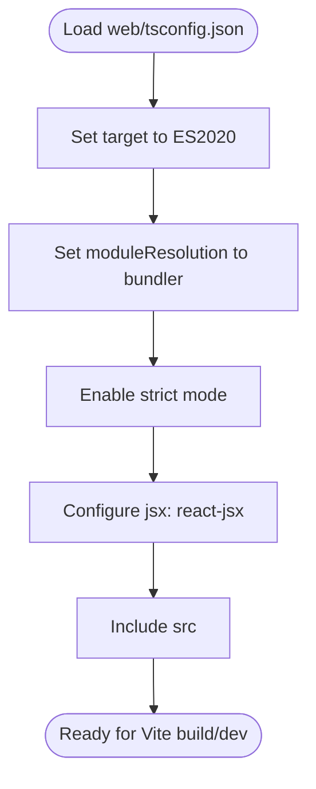
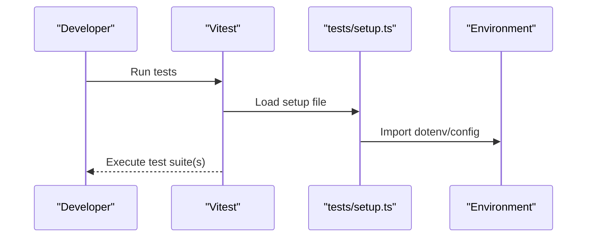
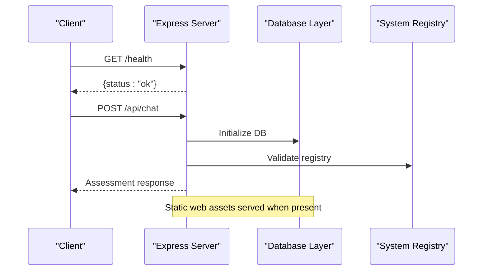
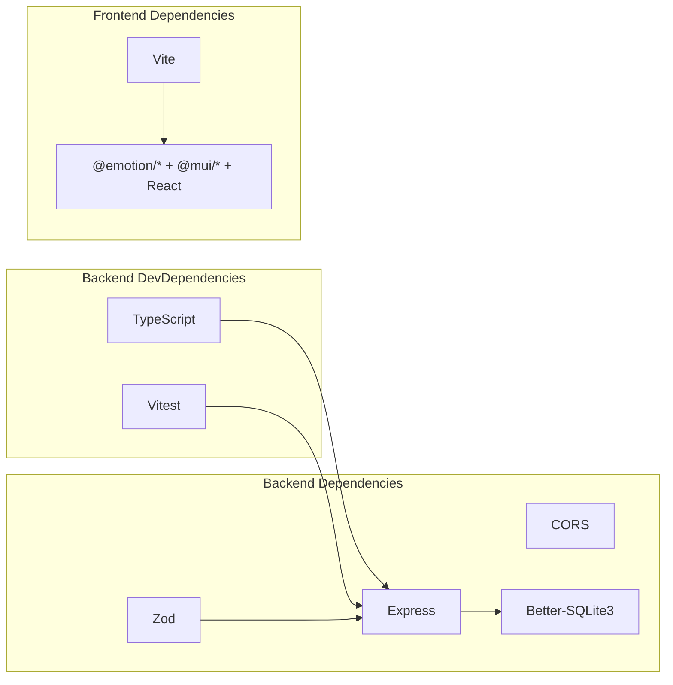

# Code Style and Standards

<cite>
**Referenced Files in This Document**
- [tsconfig.json](file://tsconfig.json)
- [package.json](file://package.json)
- [vitest.config.ts](file://vitest.config.ts)
- [tests/setup.ts](file://tests/setup.ts)
- [web/tsconfig.json](file://web/tsconfig.json)
- [web/package.json](file://web/package.json)
- [web/vite.config.ts](file://web/vite.config.ts)
- [src/server.ts](file://src/server.ts)
</cite>

## Table of Contents
1. [Introduction](#introduction)
2. [Project Structure](#project-structure)
3. [Core Components](#core-components)
4. [Architecture Overview](#architecture-overview)
5. [Detailed Component Analysis](#detailed-component-analysis)
6. [Dependency Analysis](#dependency-analysis)
7. [Performance Considerations](#performance-considerations)
8. [Troubleshooting Guide](#troubleshooting-guide)
9. [Conclusion](#conclusion)
10. [Appendices](#appendices)

## Introduction
This document defines the code style and standards for the GATIOD Chat Assistant project. It consolidates TypeScript configuration, strictness settings, module resolution, compilation targets, and testing setup. It also outlines naming conventions, file organization, import/export patterns, type safety practices, formatting expectations, and documentation requirements. The guidance ensures consistency across the backend, frontend, and shared libraries while maintaining type safety appropriate for healthcare applications.

## Project Structure
The repository is organized into:
- Backend service under src/ with API, chat orchestration, database, engine, RAG, tools, and integration modules
- Frontend under web/ built with Vite and React
- Tests under tests/ for backend and v2 engine slices
- Shared configuration via root tsconfig.json and per-project tsconfig.json for web
- Scripts and tooling defined in package.json

```mermaid
graph TB
subgraph "Root"
RootTS["tsconfig.json"]
RootPkg["package.json"]
end
subgraph "Backend"
Src["src/"]
API["src/api/"]
Chat["src/chat/"]
DB["src/db/"]
Engine["src/engine/"]
RAG["src/rag/"]
Tools["src/tools/"]
Integration["src/integration/"]
Server["src/server.ts"]
end
subgraph "Web Frontend"
Web["web/"]
WebPkg["web/package.json"]
WebTS["web/tsconfig.json"]
ViteCfg["web/vite.config.ts"]
WebSrc["web/src/"]
end
subgraph "Tests"
Tests["tests/"]
V2Tests["tests/v2/"]
EngineTests["tests/engine/"]
end
RootTS --> Src
RootTS --> Tsts
RootPkg --> Server
WebTS --> WebSrc
ViteCfg --> Web
RootTS -. "paths mapping" .- Engine
RootTS -. "paths mapping" .- Tools
RootTS -. "paths mapping" .- Chat
RootTS -. "paths mapping" .- RAG
```

**Diagram sources**
- [tsconfig.json](file://tsconfig.json)
- [package.json](file://package.json)
- [web/tsconfig.json](file://web/tsconfig.json)
- [web/vite.config.ts](file://web/vite.config.ts)
- [src/server.ts](file://src/server.ts)

**Section sources**
- [tsconfig.json](file://tsconfig.json)
- [package.json](file://package.json)
- [web/tsconfig.json](file://web/tsconfig.json)
- [web/package.json](file://web/package.json)
- [web/vite.config.ts](file://web/vite.config.ts)

## Core Components
This section documents the TypeScript configuration and strictness settings used across the project.

- Backend TypeScript configuration
  - Target and module: ES2022 with NodeNext module and module resolution
  - Strict mode enabled
  - Declaration, declaration map, and source map generation
  - Path aliases for internal modules
  - Includes src/**/* and tests/**/*; excludes node_modules, dist, and web
  - Reference: [tsconfig.json](file://tsconfig.json)

- Frontend TypeScript configuration
  - Target ES2020 with bundler module resolution
  - JSX runtime configured for React
  - Strict mode enabled with specific unused/no-fallthrough rules
  - Include src
  - Reference: [web/tsconfig.json](file://web/tsconfig.json)

- Testing configuration
  - Vitest include pattern for test files
  - Setup file loading dotenv once for all tests
  - Reference: [vitest.config.ts](file://vitest.config.ts), [tests/setup.ts](file://tests/setup.ts)

- Scripts and toolchain
  - Build, dev, start, test, and lint scripts
  - Lint script leverages tsc with no emit
  - Reference: [package.json](file://package.json)

**Section sources**
- [tsconfig.json](file://tsconfig.json)
- [web/tsconfig.json](file://web/tsconfig.json)
- [vitest.config.ts](file://vitest.config.ts)
- [tests/setup.ts](file://tests/setup.ts)
- [package.json](file://package.json)

## Architecture Overview
The project enforces strict TypeScript settings and modular structure to support a multi-system assessment engine integrated with a conversational chat interface.



[No sources needed since this diagram shows conceptual workflow, not actual code structure]

## Detailed Component Analysis

### Backend TypeScript Configuration
- Compilation target and module system
  - ES2022 target with NodeNext module and module resolution
  - Ensures modern JavaScript features and Node-native module semantics
- Strictness and diagnostics
  - Full strict mode enabled
  - Consistent casing enforcement and skipLibCheck for smoother third-party typing
- Output and source maps
  - Declaration and declaration map generation for downstream consumers
  - Source maps enabled for debugging
- Path aliases
  - @engine, @tools, @chat, @rag mapped to src/engine, src/tools, src/chat, src/rag respectively
- Include/exclude
  - Includes src/**/* and tests/**/*
  - Excludes node_modules, dist, and web to avoid transpiling frontend assets
- References
  - [tsconfig.json](file://tsconfig.json)



**Diagram sources**
- [tsconfig.json](file://tsconfig.json)

**Section sources**
- [tsconfig.json](file://tsconfig.json)

### Frontend TypeScript Configuration
- Target and module resolution
  - ES2020 target with bundler module resolution for Vite compatibility
- Strictness and JSX
  - Strict mode enabled
  - React JSX runtime configured
- Include scope
  - Only src included to keep compile scope minimal
- References
  - [web/tsconfig.json](file://web/tsconfig.json)



**Diagram sources**
- [web/tsconfig.json](file://web/tsconfig.json)

**Section sources**
- [web/tsconfig.json](file://web/tsconfig.json)

### Testing Configuration and Environment
- Test discovery and setup
  - Vitest configured to include tests/**/*.test.ts
  - Setup file loads dotenv once for all tests to enable optional test suites requiring environment variables
- References
  - [vitest.config.ts](file://vitest.config.ts)
  - [tests/setup.ts](file://tests/setup.ts)



**Diagram sources**
- [vitest.config.ts](file://vitest.config.ts)
- [tests/setup.ts](file://tests/setup.ts)

**Section sources**
- [vitest.config.ts](file://vitest.config.ts)
- [tests/setup.ts](file://tests/setup.ts)

### Server Bootstrapping and Type Safety
- Server initialization
  - Express app with CORS and JSON middleware
  - Routes mounted under /api
  - Health endpoint exposed
  - Static serving of web/dist in production
  - Database initialization and system registry validation before accepting requests
- References
  - [src/server.ts](file://src/server.ts)



**Diagram sources**
- [src/server.ts](file://src/server.ts)

**Section sources**
- [src/server.ts](file://src/server.ts)

## Dependency Analysis
- Backend toolchain
  - TypeScript compiler and Vitest for type checking and testing
  - Express and CORS for API server
  - Zod for schema validation
  - Better-SQLite3 for persistence
- Frontend toolchain
  - Vite, React, Material UI, Emotion for UI
  - React plugin for fast development
- Scripts
  - Build, dev, start, test, lint, and specialized test runners for Excel and semantic shadow scenarios
- References
  - [package.json](file://package.json)
  - [web/package.json](file://web/package.json)



**Diagram sources**
- [package.json](file://package.json)
- [web/package.json](file://web/package.json)

**Section sources**
- [package.json](file://package.json)
- [web/package.json](file://web/package.json)

## Performance Considerations
- Keep strict mode enabled to catch potential runtime issues early
- Prefer path aliases to reduce bundle size and improve maintainability
- Use declaration maps for better debugging without bloating runtime bundles
- Limit include scopes to minimize incremental builds and test runs
- For frontend, rely on Vite’s fast dev server and bundler-compatible module resolution

[No sources needed since this section provides general guidance]

## Troubleshooting Guide
- Port conflicts during development
  - The server attempts the next port if the current one is in use
  - Reference: [src/server.ts](file://src/server.ts)
- Missing environment variables
  - Lint and tests may require environment keys; ensure .env is loaded via setup or environment
  - Reference: [tests/setup.ts](file://tests/setup.ts)
- TypeScript diagnostics
  - Use the lint script to run type checks without emitting
  - Reference: [package.json](file://package.json)
- Frontend build issues
  - Confirm bundler module resolution and JSX configuration
  - Reference: [web/tsconfig.json](file://web/tsconfig.json)

**Section sources**
- [src/server.ts](file://src/server.ts)
- [tests/setup.ts](file://tests/setup.ts)
- [package.json](file://package.json)
- [web/tsconfig.json](file://web/tsconfig.json)

## Conclusion
The GATIOD Chat Assistant enforces strict TypeScript settings, modular path aliases, and robust testing configuration to ensure reliability and maintainability. Adhering to the naming, import/export, and documentation conventions outlined here will help sustain code quality across the multi-system architecture and support safe, type-aware development for healthcare domains.

[No sources needed since this section summarizes without analyzing specific files]

## Appendices

### Naming Conventions
- Modules and packages
  - Use kebab-case for directories and files (e.g., src/engine/, src/chat/)
  - Use PascalCase for type names and class names
  - Use camelCase for variables, functions, and interfaces
- Paths and aliases
  - Internal modules: @engine/*, @tools/*, @chat/*, @rag/*
- Test files
  - End with .test.ts and reside under tests/

**Section sources**
- [tsconfig.json](file://tsconfig.json)

### File Organization Guidelines
- Backend
  - Feature-based grouping under src/ (api, chat, db, engine, rag, tools, integration)
  - Place unit tests under tests/ aligned with feature folders
- Frontend
  - Organize UI components under web/src/components/
  - Keep configuration files under web/ with separate tsconfig.json and vite.config.ts

**Section sources**
- [tsconfig.json](file://tsconfig.json)
- [web/tsconfig.json](file://web/tsconfig.json)

### Import/Export Patterns
- Prefer explicit relative imports for internal modules within the same package
- Use path aliases (@engine, @tools, @chat, @rag) for cross-module imports
- Export types and interfaces at module boundaries to improve consumer ergonomics

**Section sources**
- [tsconfig.json](file://tsconfig.json)

### Type Safety Practices
- Enable strict mode and resolve all type errors before merging
- Use Zod for runtime validation of external inputs
- Favor readonly types and discriminated unions for state machines and policy engines
- Keep function signatures pure and explicit about side effects

[No sources needed since this section provides general guidance]

### Formatting and Documentation Standards
- Formatting
  - Use TypeScript compiler defaults for formatting; avoid manual formatting overrides unless necessary
- Comments
  - Add JSDoc-style comments for public APIs and complex logic
  - Keep inline comments concise and focused on intent
- Documentation
  - Document exported types, functions, and classes at module boundaries
  - Update README and inline docs when introducing breaking changes

[No sources needed since this section provides general guidance]

### ESLint and Prettier
- ESLint
  - Not configured in this repository; rely on TypeScript compiler for static analysis
- Prettier
  - Not configured in this repository; formatting follows TypeScript defaults

[No sources needed since this section provides general guidance]

### Pre-commit Hooks
- Not configured in this repository; consider integrating lint-staged and husky for pre-commit checks if desired

[No sources needed since this section provides general guidance]

### Examples of Properly Formatted Code
- Backend server initialization and routing
  - Reference: [src/server.ts](file://src/server.ts)
- Frontend Vite configuration and proxy setup
  - Reference: [web/vite.config.ts](file://web/vite.config.ts)

**Section sources**
- [src/server.ts](file://src/server.ts)
- [web/vite.config.ts](file://web/vite.config.ts)