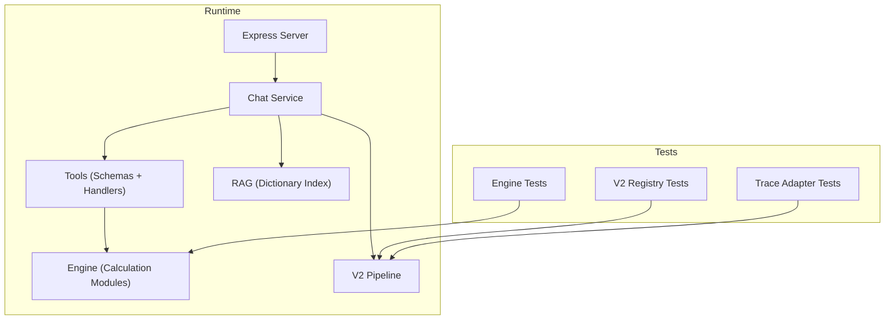
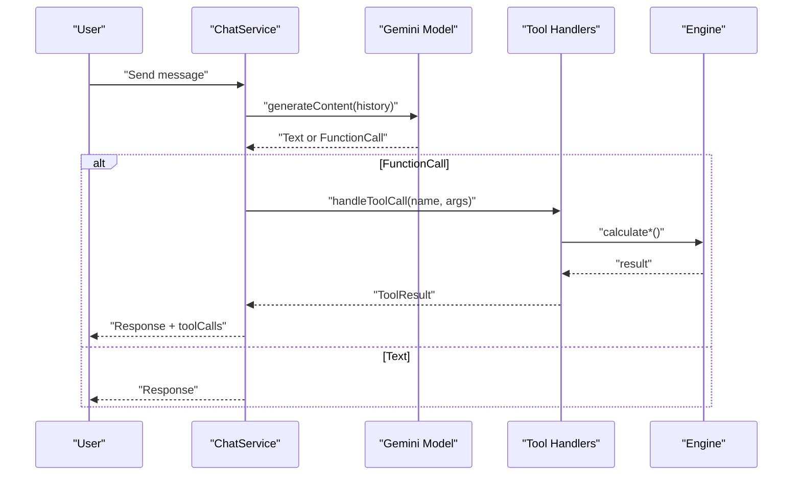
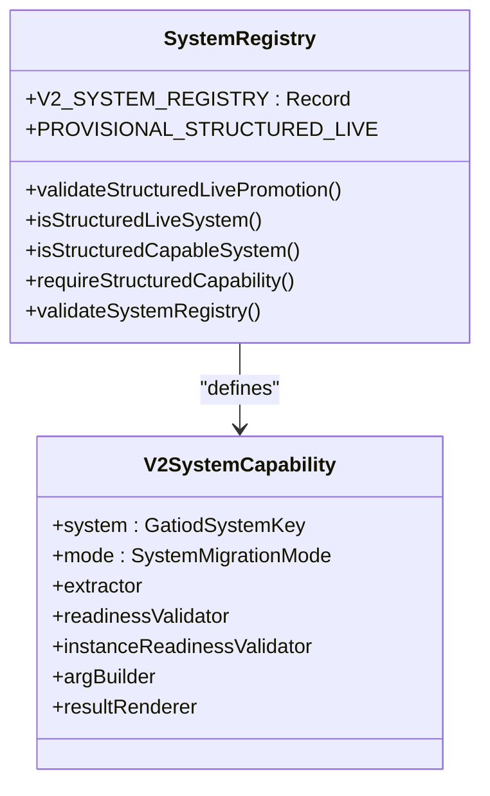
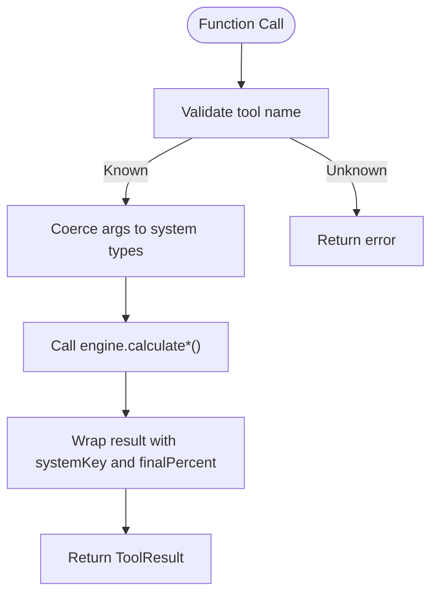
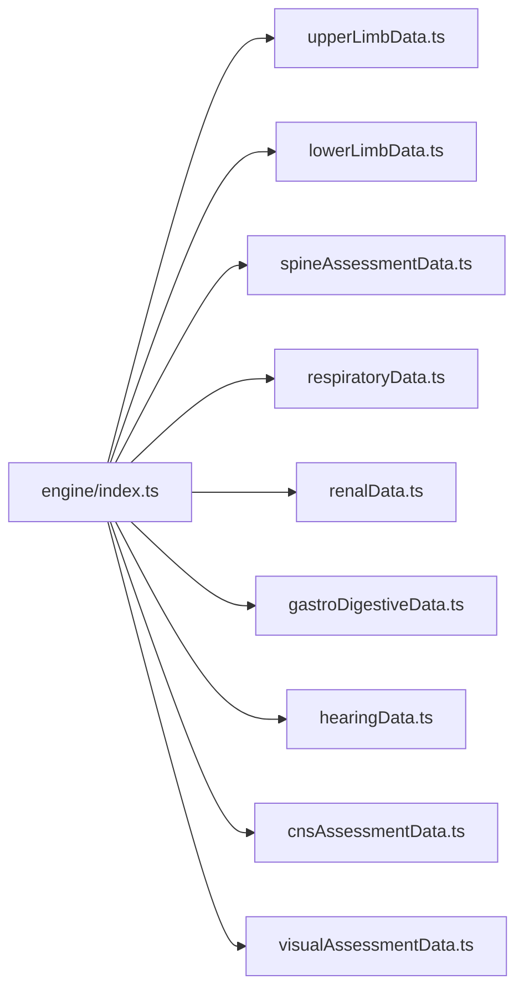
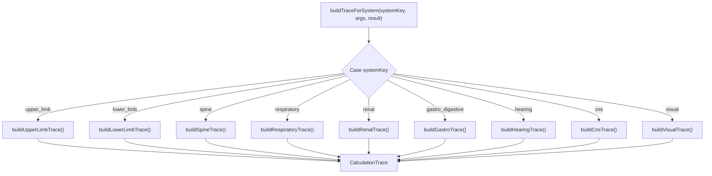
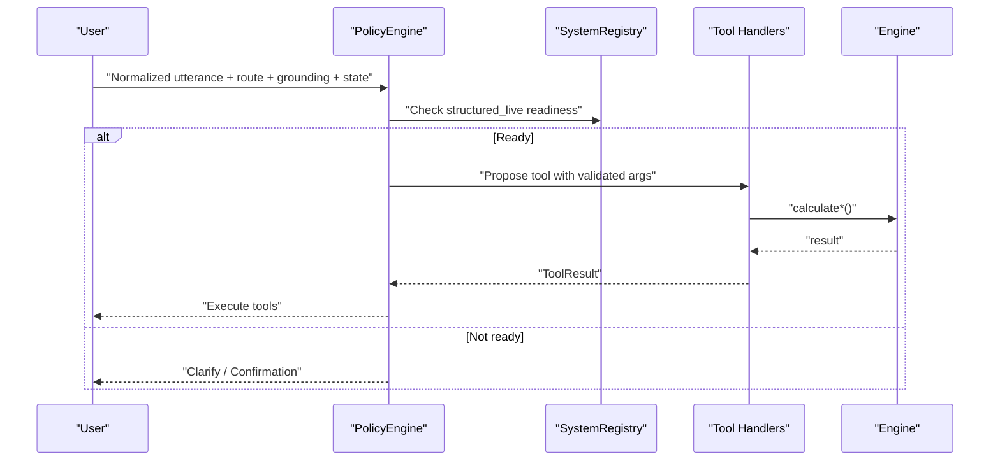
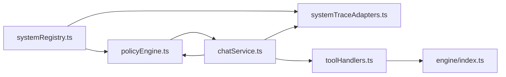

# Development Guidelines

<cite>
**Referenced Files in This Document**
- [README.md](file://README.md)
- [package.json](file://package.json)
- [tsconfig.json](file://tsconfig.json)
- [vitest.config.ts](file://vitest.config.ts)
- [src/v2/systemRegistry.ts](file://src/v2/systemRegistry.ts)
- [src/tools/toolSchemas.ts](file://src/tools/toolSchemas.ts)
- [src/tools/toolHandlers.ts](file://src/tools/toolHandlers.ts)
- [src/engine/index.ts](file://src/engine/index.ts)
- [src/v2/systemTraceAdapters.ts](file://src/v2/systemTraceAdapters.ts)
- [src/chat/chatService.ts](file://src/chat/chatService.ts)
- [src/v2/contracts.ts](file://src/v2/contracts.ts)
- [src/v2/policyEngine.ts](file://src/v2/policyEngine.ts)
- [tests/setup.ts](file://tests/setup.ts)
- [tests/v2/systemRegistry.test.ts](file://tests/v2/systemRegistry.test.ts)
- [tests/v2/systemTraceAdapters.test.ts](file://tests/v2/systemTraceAdapters.test.ts)
</cite>

## Table of Contents
1. [Introduction](#introduction)
2. [Project Structure](#project-structure)
3. [Core Components](#core-components)
4. [Architecture Overview](#architecture-overview)
5. [Detailed Component Analysis](#detailed-component-analysis)
6. [Dependency Analysis](#dependency-analysis)
7. [Performance Considerations](#performance-considerations)
8. [Troubleshooting Guide](#troubleshooting-guide)
9. [Conclusion](#conclusion)
10. [Appendices](#appendices)

## Introduction
This document provides comprehensive development guidelines for contributing to the GATIOD Chat Assistant project. It covers code style standards, TypeScript configuration, development workflows, and the V2 structured pipeline. It explains how to add new body systems using the system registry, implement tool schemas and handlers, maintain system trace adapters, and integrate with the V2 orchestration. It also includes testing requirements, code review expectations, documentation standards, debugging techniques, performance optimization tips, and best practices for healthcare application development.

## Project Structure
The repository is organized into a clear separation of concerns:
- src/chat: Orchestration and session management for the conversational assistant
- src/tools: LLM tool schemas and handlers for deterministic calculations
- src/engine: Pure TypeScript calculation modules for each GATIOD system
- src/v2: Structured V2 pipeline, including routing, policy, readiness, extraction, and rendering
- src/rag: Dictionary search and grounding
- tests: Unit and integration tests for engines, V2 components, and traces
- web: Optional React frontend (outside scope of this document)
- Root configs: TypeScript, Vitest, and package scripts

**Diagram sources**
- [src/chat/chatService.ts:38-154](file://src/chat/chatService.ts#L38-L154)
- [src/tools/toolSchemas.ts:14-217](file://src/tools/toolSchemas.ts#L14-L217)
- [src/tools/toolHandlers.ts:47-102](file://src/tools/toolHandlers.ts#L47-L102)
- [src/engine/index.ts:6-89](file://src/engine/index.ts#L6-L89)
- [src/v2/systemRegistry.ts:84-178](file://src/v2/systemRegistry.ts#L84-L178)
- [src/v2/systemTraceAdapters.ts:523-555](file://src/v2/systemTraceAdapters.ts#L523-L555)

**Section sources**
- [README.md:47-61](file://README.md#L47-L61)
- [package.json:6-20](file://package.json#L6-L20)

## Core Components
- TypeScript configuration: strict, ES2022 target, NodeNext module resolution, path aliases, declaration maps, and source maps
- Tool schemas: JSON-structured function declarations for Gemini’s function calling
- Tool handlers: Deterministic bridges from function calls to engine calculations
- Engine: Pure calculation modules for each GATIOD system
- V2 system registry: Central registry of system capabilities and migration modes
- Trace adapters: Build CalculationTrace from tool args/results per system
- Chat service: Orchestrates Gemini, manages sessions, and logs audit events

**Section sources**
- [tsconfig.json:2-26](file://tsconfig.json#L2-L26)
- [src/tools/toolSchemas.ts:14-217](file://src/tools/toolSchemas.ts#L14-L217)
- [src/tools/toolHandlers.ts:47-102](file://src/tools/toolHandlers.ts#L47-L102)
- [src/engine/index.ts:6-89](file://src/engine/index.ts#L6-L89)
- [src/v2/systemRegistry.ts:84-178](file://src/v2/systemRegistry.ts#L84-L178)
- [src/v2/systemTraceAdapters.ts:523-555](file://src/v2/systemTraceAdapters.ts#L523-L555)
- [src/chat/chatService.ts:38-154](file://src/chat/chatService.ts#L38-L154)

## Architecture Overview
The assistant integrates an LLM with deterministic calculation tools. The LLM extracts structured findings and invokes tools; the handler validates and calls the engine; the trace adapter builds a CalculationTrace for transparency.

**Diagram sources**
- [src/chat/chatService.ts:67-150](file://src/chat/chatService.ts#L67-L150)
- [src/tools/toolHandlers.ts:47-102](file://src/tools/toolHandlers.ts#L47-L102)
- [src/engine/index.ts:6-89](file://src/engine/index.ts#L6-L89)

## Detailed Component Analysis

### System Registry and Migration Modes
The V2 system registry defines capabilities per system, including extractor, readiness validator, arg builder, and result renderer. Systems can be in legacy, structured_shadow, or structured_live modes. ADR-0001 governs promotion gates and CI enforcement.

**Diagram sources**
- [src/v2/systemRegistry.ts:72-82](file://src/v2/systemRegistry.ts#L72-L82)
- [src/v2/systemRegistry.ts:84-178](file://src/v2/systemRegistry.ts#L84-L178)
- [src/v2/systemRegistry.ts:266-367](file://src/v2/systemRegistry.ts#L266-L367)

Guidelines for adding a new body system:
- Define capability in V2_SYSTEM_REGISTRY with mode, extractor, readiness, arg builder, and renderer
- Implement readiness validation and argument building for structured_live
- Add system key to contracts and ensure tool schemas/handlers align
- Add trace adapter for CalculationTrace generation
- Add tests for registry validation and promotion checks

**Section sources**
- [src/v2/systemRegistry.ts:84-178](file://src/v2/systemRegistry.ts#L84-L178)
- [src/v2/systemRegistry.ts:266-367](file://src/v2/systemRegistry.ts#L266-L367)
- [tests/v2/systemRegistry.test.ts:11-155](file://tests/v2/systemRegistry.test.ts#L11-L155)

### Tool Schemas and Handlers
Tool schemas define the function signatures exposed to the LLM. Handlers translate function calls into deterministic engine invocations, sanitizing inputs and wrapping results.

**Diagram sources**
- [src/tools/toolSchemas.ts:14-217](file://src/tools/toolSchemas.ts#L14-L217)
- [src/tools/toolHandlers.ts:47-102](file://src/tools/toolHandlers.ts#L47-L102)
- [src/tools/toolHandlers.ts:106-121](file://src/tools/toolHandlers.ts#L106-L121)

Implementation notes:
- Use Zod-like validation in handlers for structured inputs
- Normalize optional fields and defaults (e.g., CNS, Visual)
- Extract final percent consistently across systems
- Surface errors as ToolResult with success=false

**Section sources**
- [src/tools/toolSchemas.ts:14-217](file://src/tools/toolSchemas.ts#L14-L217)
- [src/tools/toolHandlers.ts:47-102](file://src/tools/toolHandlers.ts#L47-L102)
- [src/tools/toolHandlers.ts:106-121](file://src/tools/toolHandlers.ts#L106-L121)

### Engine Modules
Engine exports encapsulate pure calculation functions per system. They are imported by tool handlers and used to compute PI% and supporting details.

**Diagram sources**
- [src/engine/index.ts:6-89](file://src/engine/index.ts#L6-L89)

Best practices:
- Keep engine functions pure and free of UI or I/O
- Export schemas/types alongside calculation functions
- Maintain consistent result shapes for trace adapters

**Section sources**
- [src/engine/index.ts:6-89](file://src/engine/index.ts#L6-L89)

### System Trace Adapters
Trace adapters convert tool args and results into a CalculationTrace for auditability and transparency. Each system has a dedicated builder and a dispatcher.

**Diagram sources**
- [src/v2/systemTraceAdapters.ts:523-555](file://src/v2/systemTraceAdapters.ts#L523-L555)
- [src/v2/systemTraceAdapters.ts:74-129](file://src/v2/systemTraceAdapters.ts#L74-L129)
- [src/v2/systemTraceAdapters.ts:131-188](file://src/v2/systemTraceAdapters.ts#L131-L188)
- [src/v2/systemTraceAdapters.ts:190-242](file://src/v2/systemTraceAdapters.ts#L190-L242)
- [src/v2/systemTraceAdapters.ts:244-281](file://src/v2/systemTraceAdapters.ts#L244-L281)
- [src/v2/systemTraceAdapters.ts:283-307](file://src/v2/systemTraceAdapters.ts#L283-L307)
- [src/v2/systemTraceAdapters.ts:309-347](file://src/v2/systemTraceAdapters.ts#L309-L347)
- [src/v2/systemTraceAdapters.ts:349-403](file://src/v2/systemTraceAdapters.ts#L349-L403)
- [src/v2/systemTraceAdapters.ts:405-473](file://src/v2/systemTraceAdapters.ts#L405-L473)
- [src/v2/systemTraceAdapters.ts:475-516](file://src/v2/systemTraceAdapters.ts#L475-L516)

Maintaining trace adapters:
- Preserve rounding and rule notes for reproducibility
- Handle instance-scoped traces and context
- Ensure caps and exclusions are captured accurately

**Section sources**
- [src/v2/systemTraceAdapters.ts:523-555](file://src/v2/systemTraceAdapters.ts#L523-L555)

### V2 Contracts and Policy Engine
Contracts define the shared types for the V2 pipeline. The policy engine interprets routing, grounding, and state to decide between structured confirmation, lookup-first, global CVC, or delegation to legacy.

**Diagram sources**
- [src/v2/contracts.ts:596-615](file://src/v2/contracts.ts#L596-L615)
- [src/v2/policyEngine.ts:93-563](file://src/v2/policyEngine.ts#L93-L563)
- [src/v2/systemRegistry.ts:329-350](file://src/v2/systemRegistry.ts#L329-L350)

**Section sources**
- [src/v2/contracts.ts:596-615](file://src/v2/contracts.ts#L596-L615)
- [src/v2/policyEngine.ts:93-563](file://src/v2/policyEngine.ts#L93-L563)

## Dependency Analysis
The V2 pipeline depends on the system registry for capability and readiness, and on trace adapters for auditability. Tool handlers depend on engine modules. Chat service orchestrates the LLM and tool execution.

**Diagram sources**
- [src/v2/systemRegistry.ts:84-178](file://src/v2/systemRegistry.ts#L84-L178)
- [src/v2/policyEngine.ts:15-21](file://src/v2/policyEngine.ts#L15-L21)
- [src/v2/systemTraceAdapters.ts:13-30](file://src/v2/systemTraceAdapters.ts#L13-L30)
- [src/chat/chatService.ts:13-17](file://src/chat/chatService.ts#L13-L17)
- [src/tools/toolHandlers.ts:6-37](file://src/tools/toolHandlers.ts#L6-L37)
- [src/engine/index.ts:6-89](file://src/engine/index.ts#L6-L89)

**Section sources**
- [src/v2/systemRegistry.ts:84-178](file://src/v2/systemRegistry.ts#L84-L178)
- [src/v2/policyEngine.ts:15-21](file://src/v2/policyEngine.ts#L15-L21)
- [src/v2/systemTraceAdapters.ts:13-30](file://src/v2/systemTraceAdapters.ts#L13-L30)
- [src/chat/chatService.ts:13-17](file://src/chat/chatService.ts#L13-L17)
- [src/tools/toolHandlers.ts:6-37](file://src/tools/toolHandlers.ts#L6-L37)
- [src/engine/index.ts:6-89](file://src/engine/index.ts#L6-L89)

## Performance Considerations
- Prefer structured_live systems for deterministic, predictable performance
- Minimize repeated validations by caching normalized inputs and hashes
- Use lookup-first only when grounded (ontology matches) to reduce unnecessary calls
- Round trace values consistently to avoid floating-point drift in audit trails
- Keep engine functions pure to enable memoization and easier testing

[No sources needed since this section provides general guidance]

## Troubleshooting Guide
Common issues and resolutions:
- Missing tool schema: Ensure the function name exists in tool schemas and handlers
- Validation failures: Review handler arg coercion and engine input schemas
- Stale confirmation: Rebuild confirmation when facts change
- Rate limits or timeouts: Chat service retries with backoff and persists sessions
- ADR-0001 promotion failures: Provide calibration evidence or remove structured_live

**Section sources**
- [src/tools/toolHandlers.ts:99-101](file://src/tools/toolHandlers.ts#L99-L101)
- [src/chat/chatService.ts:156-172](file://src/chat/chatService.ts#L156-L172)
- [tests/v2/systemRegistry.test.ts:104-155](file://tests/v2/systemRegistry.test.ts#L104-L155)

## Conclusion
These guidelines establish a consistent approach to developing, testing, and maintaining the GATIOD Chat Assistant. By leveraging the system registry, structured tool schemas and handlers, and robust trace adapters, contributors can extend the system reliably while preserving safety and transparency. Follow the testing and review practices outlined here to ensure high-quality contributions.

[No sources needed since this section summarizes without analyzing specific files]

## Appendices

### Code Style Standards
- Strict TypeScript configuration with ES2022 target and NodeNext module resolution
- Path aliases for modular imports (@engine, @tools, @chat, @rag)
- Declaration maps and source maps enabled for debugging
- Consistent casing and consistent file naming

**Section sources**
- [tsconfig.json:2-26](file://tsconfig.json#L2-L26)

### Development Workflows
- Install dependencies and run dev server with API key
- Use npm test to run all tests; npm run test:engine for engine-only
- Lint with TypeScript type checking
- Use Vitest with dotenv setup for environment variables

**Section sources**
- [README.md:17-26](file://README.md#L17-L26)
- [package.json:6-20](file://package.json#L6-L20)
- [vitest.config.ts:3-11](file://vitest.config.ts#L3-L11)
- [tests/setup.ts:1-8](file://tests/setup.ts#L1-L8)

### Testing Requirements
- Registry validation: ensure structured_live systems have all required components
- Promotion checks: enforce ADR-0001 thresholds when evidence is provided
- Trace adapter tests: validate CalculationTrace construction and instance scoping
- Engine tests: validate calculation correctness and edge cases

**Section sources**
- [tests/v2/systemRegistry.test.ts:11-155](file://tests/v2/systemRegistry.test.ts#L11-L155)
- [tests/v2/systemTraceAdapters.test.ts:11-175](file://tests/v2/systemTraceAdapters.test.ts#L11-L175)

### Code Review Expectations
- Verify system registry additions include extractor, readiness, arg builder, and renderer
- Confirm tool schemas align with engine types and handler logic
- Ensure trace adapters capture all inputs, caps, and rule notes
- Validate policy decisions for structured vs legacy paths
- Check audit events and session persistence in chat service

**Section sources**
- [src/v2/systemRegistry.ts:352-367](file://src/v2/systemRegistry.ts#L352-L367)
- [src/tools/toolSchemas.ts:14-217](file://src/tools/toolSchemas.ts#L14-L217)
- [src/v2/systemTraceAdapters.ts:523-555](file://src/v2/systemTraceAdapters.ts#L523-L555)
- [src/chat/chatService.ts:56-120](file://src/chat/chatService.ts#L56-L120)

### Documentation Standards
- Keep README concise and focused on quick start and architecture
- Use clear headings and diagrams to illustrate code relationships
- Reference specific file paths and line ranges for traceability

**Section sources**
- [README.md:1-77](file://README.md#L1-L77)

### Debugging Techniques
- Inspect session history and audit logs for tool call sequences
- Use trace adapters to reconstruct calculation steps
- Validate normalized utterances and grounding results
- Enable retry logic and error messages for transient failures

**Section sources**
- [src/chat/chatService.ts:56-120](file://src/chat/chatService.ts#L56-L120)
- [src/v2/systemTraceAdapters.ts:523-555](file://src/v2/systemTraceAdapters.ts#L523-L555)

### Performance Optimization
- Prefer structured_live systems to avoid legacy overhead
- Cache normalized inputs and hashed facts to prevent redundant validations
- Limit lookup-first to high-confidence matches
- Round trace values and avoid unnecessary recomputation

**Section sources**
- [src/v2/policyEngine.ts:412-430](file://src/v2/policyEngine.ts#L412-L430)
- [src/v2/systemTraceAdapters.ts:32-48](file://src/v2/systemTraceAdapters.ts#L32-L48)

### Healthcare Application Best Practices
- Never perform math in the LLM; keep calculations deterministic
- Maintain clear audit trails with CalculationTrace and audit events
- Enforce safety gates (e.g., caps, exclusions) and expose rationale
- Provide structured confirmation before invoking assessment tools

**Section sources**
- [README.md:3-15](file://README.md#L3-L15)
- [src/v2/systemTraceAdapters.ts:48-72](file://src/v2/systemTraceAdapters.ts#L48-L72)
- [src/chat/chatService.ts:141-143](file://src/chat/chatService.ts#L141-L143)

### Contribution Workflows, Issue Reporting, and Release Procedures
- Fork and branch from the appropriate worktree
- Open issues describing the problem and acceptance criteria
- Submit PRs with tests and documentation updates
- CI runs Vitest and ADR-0001 promotion checks
- Releases are versioned in package.json; ensure changelog entries

**Section sources**
- [package.json:1-45](file://package.json#L1-L45)
- [tests/v2/systemRegistry.test.ts:77-155](file://tests/v2/systemRegistry.test.ts#L77-L155)