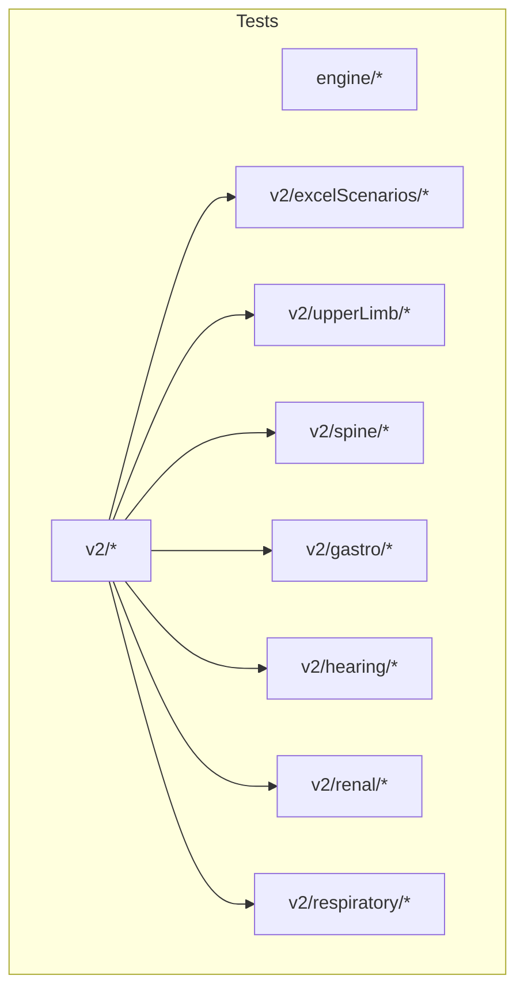
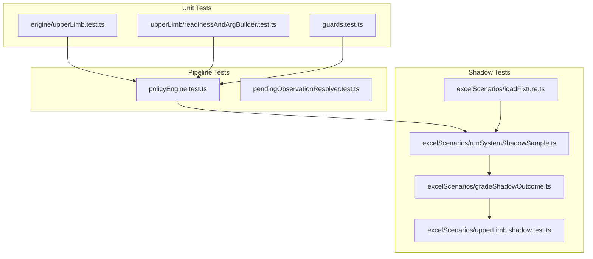
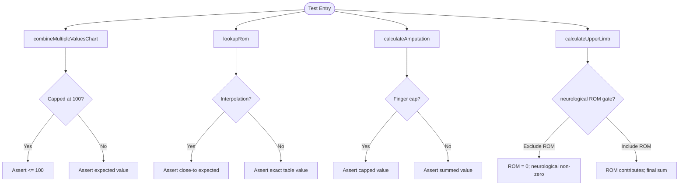
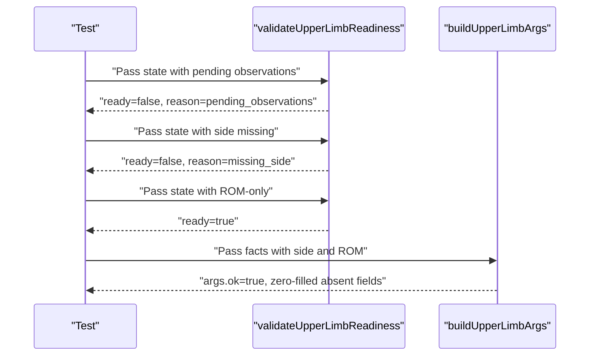
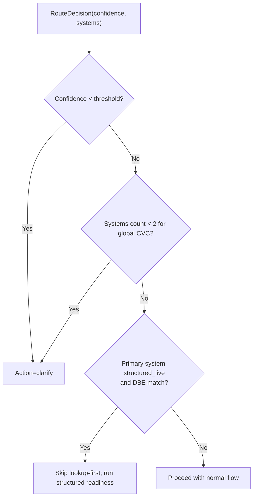
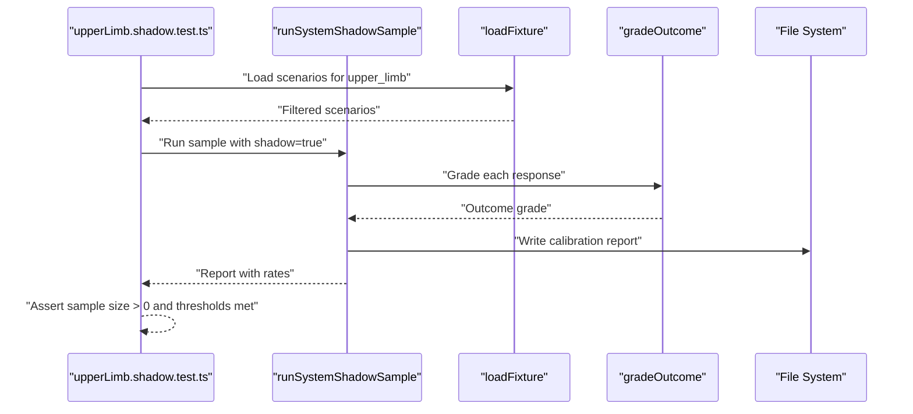
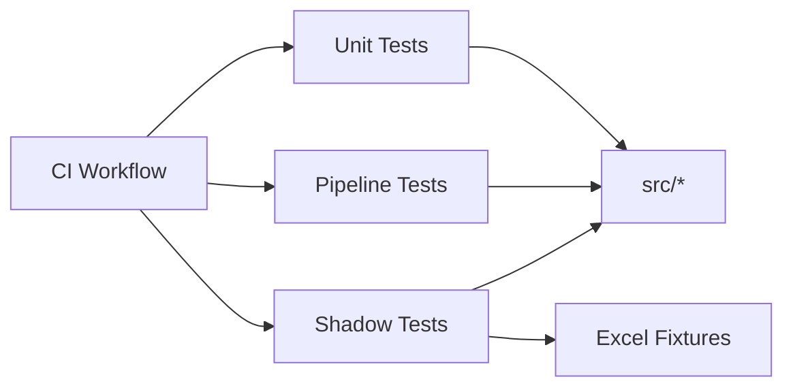
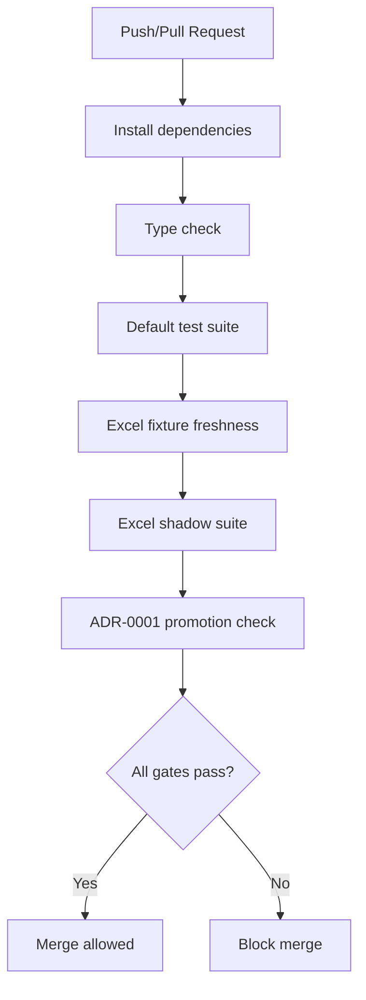

# Testing and Contribution Workflow

<cite>
**Referenced Files in This Document**
- [vitest.config.ts](file://vitest.config.ts)
- [package.json](file://package.json)
- [tests/setup.ts](file://tests/setup.ts)
- [tests/engine/upperLimb.test.ts](file://tests/engine/upperLimb.test.ts)
- [tests/v2/upperLimb/readinessAndArgBuilder.test.ts](file://tests/v2/upperLimb/readinessAndArgBuilder.test.ts)
- [tests/v2/policyEngine.test.ts](file://tests/v2/policyEngine.test.ts)
- [tests/v2/excelScenarios/upperLimb.shadow.test.ts](file://tests/v2/excelScenarios/upperLimb.shadow.test.ts)
- [tests/v2/excelScenarios/runSystemShadowSample.ts](file://tests/v2/excelScenarios/runSystemShadowSample.ts)
- [tests/v2/excelScenarios/gradeShadowOutcome.ts](file://tests/v2/excelScenarios/gradeShadowOutcome.ts)
- [tests/v2/excelScenarios/loadFixture.ts](file://tests/v2/excelScenarios/loadFixture.ts)
- [tests/v2/upperLimb/guards.test.ts](file://tests/v2/upperLimb/guards.test.ts)
- [tests/v2/upperLimb/pendingObservationResolver.test.ts](file://tests/v2/upperLimb/pendingObservationResolver.test.ts)
- [.github/workflows/ci.yml](file://.github/workflows/ci.yml)
- [README.md](file://README.md)
</cite>

## Table of Contents
1. [Introduction](#introduction)
2. [Project Structure](#project-structure)
3. [Core Components](#core-components)
4. [Architecture Overview](#architecture-overview)
5. [Detailed Component Analysis](#detailed-component-analysis)
6. [Dependency Analysis](#dependency-analysis)
7. [Performance Considerations](#performance-considerations)
8. [Troubleshooting Guide](#troubleshooting-guide)
9. [Conclusion](#conclusion)
10. [Appendices](#appendices)

## Introduction
This document describes the testing strategy and contribution workflow for the project. It explains the Vitest configuration, test organization patterns, and best practices used across the codebase. It covers unit testing for engine calculations, V2 pipeline validation, and integration-style shadow testing driven by Excel fixtures. It also documents continuous integration gates, quality controls, contribution guidelines, debugging techniques, performance testing, and validation strategies tailored for healthcare applications.

## Project Structure
The repository organizes tests under a dedicated tests directory with feature- and slice-based grouping:
- tests/engine: Pure calculation validations for the engine module.
- tests/v2: End-to-end and integration-style tests for the V2 pipeline, including:
  - excelScenarios: Shadow runs against Excel-derived scenarios with threshold enforcement.
  - System-specific folders (e.g., upperLimb, spine) for focused validations.
  - Slice-level tests across policy, routing, consensus, and rendering.

**Section sources**
- [README.md:70-77](file://README.md#L70-L77)

## Core Components
- Vitest configuration defines inclusion patterns and a shared setup file to initialize environment variables for optional tests.
- Package scripts provide targeted test runs for engine-only, Excel shadow suites, and semantic shadow tests.
- Centralized setup loads environment variables once before all tests.

Key configuration and scripts:
- Vitest config: include pattern for tests and setup file.
- Setup file: dotenv initialization for optional API-backed tests.
- Scripts: default test, watch mode, engine-only, Excel shadow, and semantic shadow runs.

**Section sources**
- [vitest.config.ts:1-12](file://vitest.config.ts#L1-L12)
- [tests/setup.ts:1-8](file://tests/setup.ts#L1-L8)
- [package.json:6-20](file://package.json#L6-L20)

## Architecture Overview
The testing architecture comprises three layers:
- Unit tests: isolated validations of pure functions and small units (e.g., engine calculations).
- V2 pipeline tests: integration-like validations of the conversational assessment flow, including readiness checks, argument building, policy decisions, and rendering guards.
- Shadow tests: end-to-end scenario runs against Excel fixtures with outcome classification and threshold enforcement.

**Diagram sources**
- [tests/engine/upperLimb.test.ts:1-156](file://tests/engine/upperLimb.test.ts#L1-L156)
- [tests/v2/upperLimb/readinessAndArgBuilder.test.ts:1-156](file://tests/v2/upperLimb/readinessAndArgBuilder.test.ts#L1-L156)
- [tests/v2/upperLimb/guards.test.ts:1-71](file://tests/v2/upperLimb/guards.test.ts#L1-L71)
- [tests/v2/policyEngine.test.ts:1-123](file://tests/v2/policyEngine.test.ts#L1-L123)
- [tests/v2/upperLimb/pendingObservationResolver.test.ts:1-126](file://tests/v2/upperLimb/pendingObservationResolver.test.ts#L1-L126)
- [tests/v2/excelScenarios/loadFixture.ts:1-50](file://tests/v2/excelScenarios/loadFixture.ts#L1-L50)
- [tests/v2/excelScenarios/runSystemShadowSample.ts:1-187](file://tests/v2/excelScenarios/runSystemShadowSample.ts#L1-L187)
- [tests/v2/excelScenarios/gradeShadowOutcome.ts:1-180](file://tests/v2/excelScenarios/gradeShadowOutcome.ts#L1-L180)
- [tests/v2/excelScenarios/upperLimb.shadow.test.ts:1-26](file://tests/v2/excelScenarios/upperLimb.shadow.test.ts#L1-L26)

## Detailed Component Analysis

### Vitest Configuration and Environment Setup
- Vitest include pattern ensures all tests under tests/**/*.test.ts are executed.
- A setup file initializes environment variables once before all tests, enabling optional tests that require external API keys.
- Scripts support focused runs: default, watch, engine-only, Excel shadow, and semantic shadow.

Best practices:
- Keep setup minimal and idempotent.
- Use environment flags to gate optional tests that depend on external resources.

**Section sources**
- [vitest.config.ts:1-12](file://vitest.config.ts#L1-L12)
- [tests/setup.ts:1-8](file://tests/setup.ts#L1-L8)
- [package.json:6-20](file://package.json#L6-L20)

### Engine Calculations: Upper Limb
This suite validates pure calculation logic:
- Value combination and caps.
- Range-of-motion (ROM) lookup interpolation.
- Amputation scoring and caps.
- Full assessment flow, including neurological exclusion and suppression rules.

Patterns:
- Use descriptive describe blocks to group related validations.
- Assert exact values for deterministic outcomes and close-to comparisons for interpolated values.
- Exercise boundary conditions (empty arrays, caps, defaults).

**Diagram sources**
- [tests/engine/upperLimb.test.ts:14-156](file://tests/engine/upperLimb.test.ts#L14-L156)

**Section sources**
- [tests/engine/upperLimb.test.ts:1-156](file://tests/engine/upperLimb.test.ts#L1-L156)

### V2 Pipeline Validation: Readiness and Argument Building
Validations focus on:
- Readiness checks: pending observations, required facts, and gating questions.
- Argument builders: assembling inputs from extracted facts, zero-filling absent fields, and schema validation.

Patterns:
- Construct minimal, valid states and mutate incrementally to assert failure modes.
- Use helper factories to produce normalized facts and session states.
- Assert provenance and schema compliance.

**Diagram sources**
- [tests/v2/upperLimb/readinessAndArgBuilder.test.ts:19-85](file://tests/v2/upperLimb/readinessAndArgBuilder.test.ts#L19-L85)
- [tests/v2/upperLimb/readinessAndArgBuilder.test.ts:89-156](file://tests/v2/upperLimb/readinessAndArgBuilder.test.ts#L89-L156)

**Section sources**
- [tests/v2/upperLimb/readinessAndArgBuilder.test.ts:1-156](file://tests/v2/upperLimb/readinessAndArgBuilder.test.ts#L1-L156)

### Policy Decision Engine
Validations cover:
- Confidence thresholds forcing clarification.
- Multi-system requirements for global CVC.
- Special-case routing for structured_live systems to avoid redundant lookups.
- Handling of follow-ups and legacy deferment.

Patterns:
- Build baseline utterances and grounding results.
- Assert action transitions and proposed tools.

**Diagram sources**
- [tests/v2/policyEngine.test.ts:20-98](file://tests/v2/policyEngine.test.ts#L20-L98)

**Section sources**
- [tests/v2/policyEngine.test.ts:1-123](file://tests/v2/policyEngine.test.ts#L1-L123)

### Guards and Rendering Validation
Ensures rendered responses adhere to strict rules:
- Assessment results require successful assess_ tool execution.
- Final PI language is disallowed outside appropriate contexts.
- Legacy output guards detect prohibited language.

Patterns:
- Compose base response templates and override selectively.
- Assert ok vs. not-ok outcomes for guard functions.

**Section sources**
- [tests/v2/upperLimb/guards.test.ts:1-71](file://tests/v2/upperLimb/guards.test.ts#L1-L71)

### Pending Observation Resolution
Validations cover:
- Resolving ROM measurement directions from user replies.
- Resolving nerve deficit descriptors from chips.
- Blocking and clarifying when replies are ambiguous.

Patterns:
- Seed states with pending observations.
- Simulate user utterances and assert resolution state.

**Section sources**
- [tests/v2/upperLimb/pendingObservationResolver.test.ts:1-126](file://tests/v2/upperLimb/pendingObservationResolver.test.ts#L1-L126)

### Excel Shadow Scenarios: Calibration and Thresholds
The shadow test suite:
- Loads committed Excel fixtures and filters scenarios by system.
- Runs a deterministic sample of scenarios through the V2 pipeline.
- Grades outcomes and computes safe-outcome and exact-calculation rates.
- Enforces ADR-0001 thresholds per system and writes calibration reports.

**Diagram sources**
- [tests/v2/excelScenarios/upperLimb.shadow.test.ts:10-25](file://tests/v2/excelScenarios/upperLimb.shadow.test.ts#L10-L25)
- [tests/v2/excelScenarios/runSystemShadowSample.ts:100-186](file://tests/v2/excelScenarios/runSystemShadowSample.ts#L100-L186)
- [tests/v2/excelScenarios/gradeShadowOutcome.ts:36-128](file://tests/v2/excelScenarios/gradeShadowOutcome.ts#L36-L128)
- [tests/v2/excelScenarios/loadFixture.ts:26-49](file://tests/v2/excelScenarios/loadFixture.ts#L26-L49)

**Section sources**
- [tests/v2/excelScenarios/upperLimb.shadow.test.ts:1-26](file://tests/v2/excelScenarios/upperLimb.shadow.test.ts#L1-L26)
- [tests/v2/excelScenarios/runSystemShadowSample.ts:1-187](file://tests/v2/excelScenarios/runSystemShadowSample.ts#L1-L187)
- [tests/v2/excelScenarios/gradeShadowOutcome.ts:1-180](file://tests/v2/excelScenarios/gradeShadowOutcome.ts#L1-L180)
- [tests/v2/excelScenarios/loadFixture.ts:1-50](file://tests/v2/excelScenarios/loadFixture.ts#L1-L50)

## Dependency Analysis
- Tests depend on internal modules under src/ and src/v2/.
- Shadow tests depend on chat service V2 and scenario fixtures.
- CI orchestrates multiple quality gates that gate merges and releases.

**Diagram sources**
- [tests/engine/upperLimb.test.ts:1-12](file://tests/engine/upperLimb.test.ts#L1-L12)
- [tests/v2/upperLimb/readinessAndArgBuilder.test.ts:1-6](file://tests/v2/upperLimb/readinessAndArgBuilder.test.ts#L1-L6)
- [tests/v2/policyEngine.test.ts:1-4](file://tests/v2/policyEngine.test.ts#L1-L4)
- [tests/v2/excelScenarios/upperLimb.shadow.test.ts:2-5](file://tests/v2/excelScenarios/upperLimb.shadow.test.ts#L2-L5)
- [.github/workflows/ci.yml:26-60](file://.github/workflows/ci.yml#L26-L60)

**Section sources**
- [.github/workflows/ci.yml:1-60](file://.github/workflows/ci.yml#L1-L60)

## Performance Considerations
- Shadow tests can be slow due to scenario volumes; use deterministic sampling and opt-in full runs.
- Use environment flags to enable/disable expensive suites during development.
- Prefer deterministic samples for regression stability while preserving full-run validation for release gates.

[No sources needed since this section provides general guidance]

## Troubleshooting Guide
Common issues and resolutions:
- Optional tests requiring API keys fail locally: ensure environment variables are loaded via the setup file and that the relevant environment flags are set for opt-in suites.
- Excel shadow failures: inspect generated calibration reports and mismatch samples to identify recurring patterns.
- Guard failures: verify rendered responses include proper tool evidence for assessment results and avoid prohibited language.

**Section sources**
- [tests/setup.ts:1-8](file://tests/setup.ts#L1-L8)
- [tests/v2/excelScenarios/runSystemShadowSample.ts:140-177](file://tests/v2/excelScenarios/runSystemShadowSample.ts#L140-L177)
- [tests/v2/upperLimb/guards.test.ts:14-59](file://tests/v2/upperLimb/guards.test.ts#L14-L59)

## Conclusion
The project employs a layered testing strategy: pure unit tests for deterministic calculations, V2 pipeline validations for conversational logic, and shadow tests against Excel fixtures with strict thresholds. CI enforces type checking, default tests, fixture freshness, shadow suites, and ADR-0001 promotion checks. Contributors should write focused, deterministic tests, leverage helpers to construct valid states, and use environment flags to control optional suites.

[No sources needed since this section summarizes without analyzing specific files]

## Appendices

### Continuous Integration Workflow and Quality Gates
The CI workflow enforces five gates:
1. Type check via TypeScript compiler.
2. Default test suite run.
3. Excel fixture freshness check.
4. Excel shadow suite with ADR-0001 threshold enforcement.
5. Promotion check against ADR-0001 thresholds.

**Diagram sources**
- [.github/workflows/ci.yml:17-60](file://.github/workflows/ci.yml#L17-L60)

**Section sources**
- [.github/workflows/ci.yml:1-60](file://.github/workflows/ci.yml#L1-L60)

### Contribution Guidelines
- Issue reporting: Provide clear reproduction steps, expected vs. actual behavior, and relevant logs or screenshots.
- Pull requests: Include tests covering new or changed behavior, update documentation as needed, and keep diffs minimal and focused.
- Code review: Focus on correctness, readability, maintainability, and adherence to CI gates.
- Release procedures: Ensure all CI gates pass, shadow thresholds are met, and fixtures are regenerated as required.

[No sources needed since this section provides general guidance]

### Testing Best Practices
- Write deterministic unit tests for pure functions; assert exact values where possible.
- Use helper factories to construct valid states and incremental mutations to trigger failure modes.
- For asynchronous operations, rely on Vitest’s async support and timeouts; avoid flaky sleeps.
- Mock external dependencies only when necessary; prefer in-memory databases for integration-like tests.
- Healthcare-specific validations: enforce strict rendering and guard rules; maintain golden tests for critical flows; document compliance-relevant assertions.

[No sources needed since this section provides general guidance]