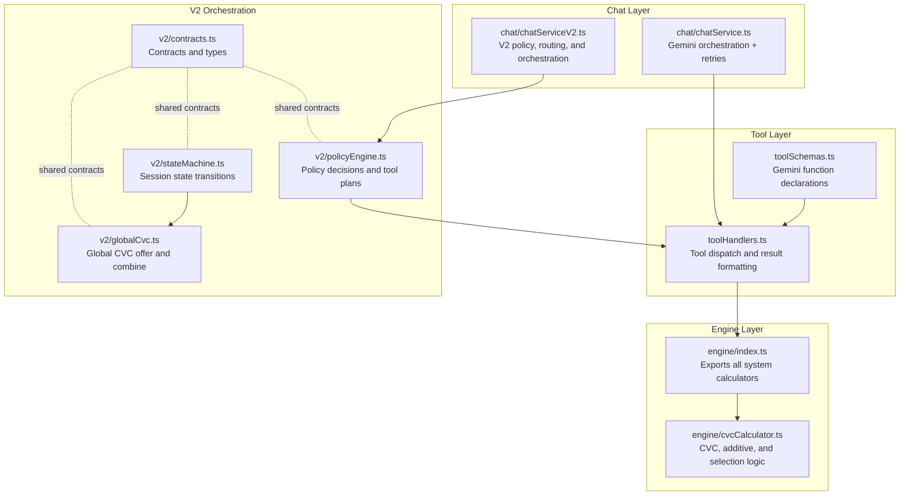
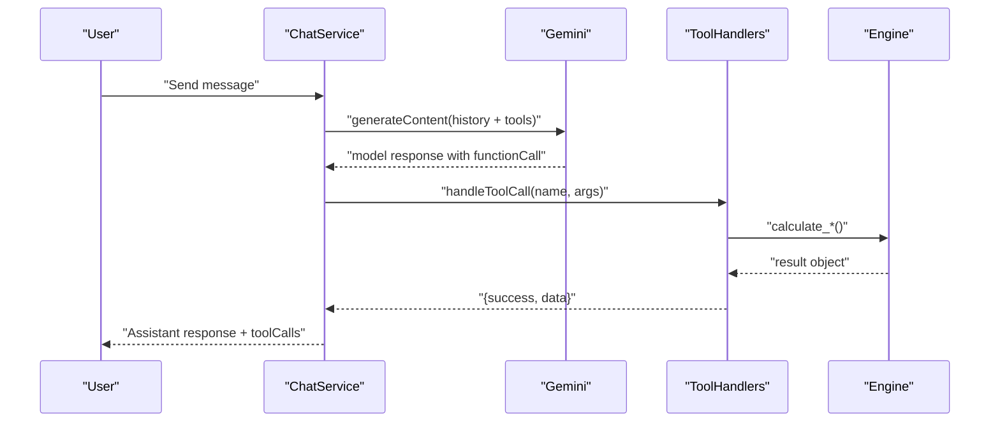
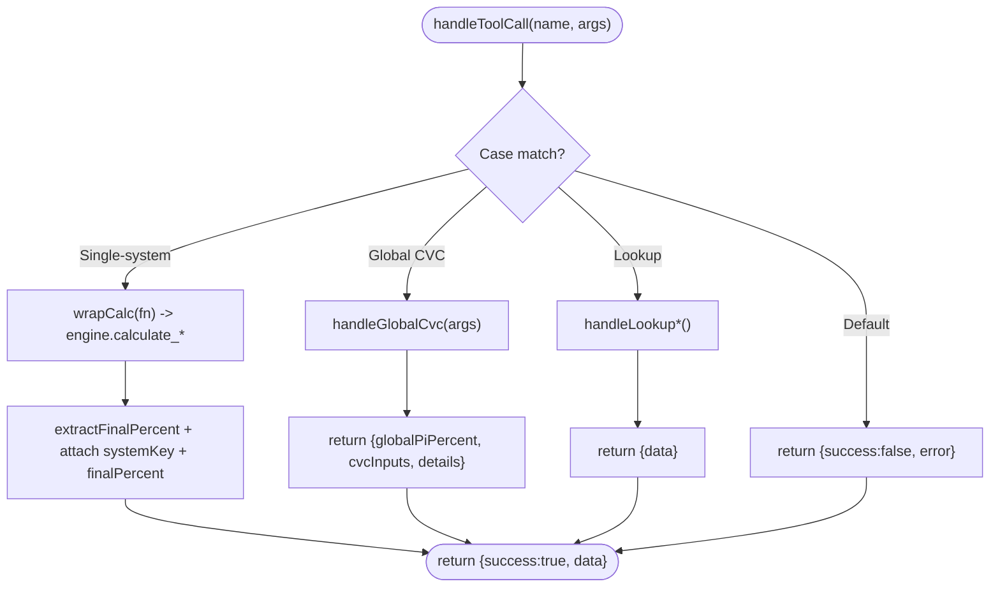
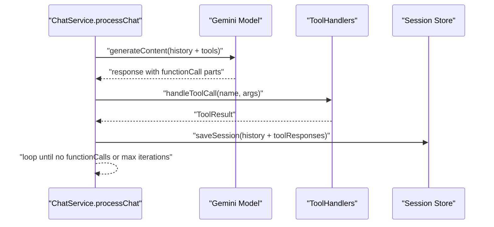
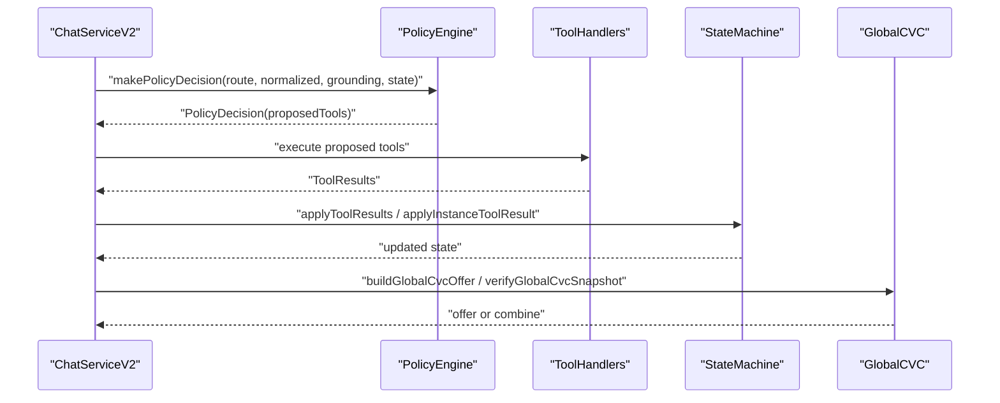
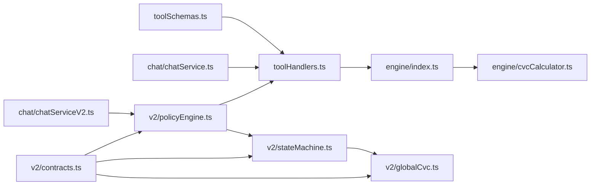

# Tool Development and Integration

<cite>
**Referenced Files in This Document**
- [toolSchemas.ts](file://src/tools/toolSchemas.ts)
- [toolHandlers.ts](file://src/tools/toolHandlers.ts)
- [cvcCalculator.ts](file://src/engine/cvcCalculator.ts)
- [chatService.ts](file://src/chat/chatService.ts)
- [chatServiceV2.ts](file://src/chat/chatServiceV2.ts)
- [index.ts](file://src/engine/index.ts)
- [contracts.ts](file://src/v2/contracts.ts)
- [stateMachine.ts](file://src/v2/stateMachine.ts)
- [policyEngine.ts](file://src/v2/policyEngine.ts)
- [globalCvc.ts](file://src/v2/globalCvc.ts)
- [upperLimb.test.ts](file://tests/engine/upperLimb.test.ts)
</cite>

## Table of Contents
1. [Introduction](#introduction)
2. [Project Structure](#project-structure)
3. [Core Components](#core-components)
4. [Architecture Overview](#architecture-overview)
5. [Detailed Component Analysis](#detailed-component-analysis)
6. [Dependency Analysis](#dependency-analysis)
7. [Performance Considerations](#performance-considerations)
8. [Troubleshooting Guide](#troubleshooting-guide)
9. [Conclusion](#conclusion)
10. [Appendices](#appendices)

## Introduction
This document explains how to develop and integrate calculation tools within the GATIOD system. It covers the tool handler pattern, tool schema definitions for Gemini function calling, and how tools connect to the chat service and V2 pipeline. It also documents deterministic calculation logic, error handling, retry mechanisms, result formatting, testing strategies, versioning considerations, and performance optimization.

## Project Structure
The tooling stack is organized around:
- Tool schemas that define Gemini function signatures
- Tool handlers that translate function calls into deterministic calculations
- The chat service that orchestrates Gemini with function calling
- The V2 pipeline that governs structured extraction, readiness checks, confirmation, and global CVC orchestration

**Diagram sources**
- [toolSchemas.ts:1-487](file://src/tools/toolSchemas.ts#L1-L487)
- [toolHandlers.ts:1-435](file://src/tools/toolHandlers.ts#L1-L435)
- [cvcCalculator.ts:1-108](file://src/engine/cvcCalculator.ts#L1-L108)
- [chatService.ts:1-183](file://src/chat/chatService.ts#L1-L183)
- [chatServiceV2.ts:1-800](file://src/chat/chatServiceV2.ts#L1-L800)
- [index.ts:1-89](file://src/engine/index.ts#L1-L89)
- [policyEngine.ts:1-564](file://src/v2/policyEngine.ts#L1-L564)
- [stateMachine.ts:1-822](file://src/v2/stateMachine.ts#L1-L822)
- [globalCvc.ts:1-361](file://src/v2/globalCvc.ts#L1-L361)
- [contracts.ts:1-750](file://src/v2/contracts.ts#L1-L750)

**Section sources**
- [toolSchemas.ts:1-487](file://src/tools/toolSchemas.ts#L1-L487)
- [toolHandlers.ts:1-435](file://src/tools/toolHandlers.ts#L1-L435)
- [chatService.ts:1-183](file://src/chat/chatService.ts#L1-L183)
- [chatServiceV2.ts:1-800](file://src/chat/chatServiceV2.ts#L1-L800)
- [index.ts:1-89](file://src/engine/index.ts#L1-L89)
- [contracts.ts:1-750](file://src/v2/contracts.ts#L1-L750)

## Core Components
- Tool schemas: Define the function names, descriptions, and JSON Schema parameters for Gemini’s function calling. They live in a single module and include both single-system assessment tools and multi-system tools plus lookup utilities.
- Tool handlers: Dispatch function names to the appropriate engine calculation, normalize results, and attach system metadata and final percent.
- Engine: Pure calculation functions for each system and shared CVC logic.
- Chat service: Integrates with Gemini, manages sessions, retries, and logs audit events. It executes tool calls and returns formatted results.
- V2 pipeline: Provides structured extraction, readiness checks, confirmation, and global CVC orchestration. It builds deterministic tool plans and enforces conversation policies.

**Section sources**
- [toolSchemas.ts:1-487](file://src/tools/toolSchemas.ts#L1-L487)
- [toolHandlers.ts:1-435](file://src/tools/toolHandlers.ts#L1-L435)
- [index.ts:1-89](file://src/engine/index.ts#L1-L89)
- [cvcCalculator.ts:1-108](file://src/engine/cvcCalculator.ts#L1-L108)
- [chatService.ts:1-183](file://src/chat/chatService.ts#L1-L183)
- [chatServiceV2.ts:1-800](file://src/chat/chatServiceV2.ts#L1-L800)
- [policyEngine.ts:1-564](file://src/v2/policyEngine.ts#L1-L564)
- [stateMachine.ts:1-822](file://src/v2/stateMachine.ts#L1-L822)
- [globalCvc.ts:1-361](file://src/v2/globalCvc.ts#L1-L361)
- [contracts.ts:1-750](file://src/v2/contracts.ts#L1-L750)

## Architecture Overview
The tool integration follows a strict separation of concerns:
- Gemini receives function declarations from the tool schemas.
- On function calls, the chat service invokes the tool handlers.
- Tool handlers call engine functions and return standardized results.
- V2 orchestrates structured extraction and confirmation, then proposes deterministic tool calls based on policy.

**Diagram sources**
- [chatService.ts:38-154](file://src/chat/chatService.ts#L38-L154)
- [toolHandlers.ts:47-102](file://src/tools/toolHandlers.ts#L47-L102)
- [index.ts:1-89](file://src/engine/index.ts#L1-L89)

## Detailed Component Analysis

### Tool Schema Definitions (Gemini Function Declarations)
- Centralized in a single module exporting two arrays: single-system assessment tools and multi-system assessment tools plus lookup utilities.
- Each function declaration includes:
  - name: unique tool identifier
  - description: human-readable purpose
  - parameters: JSON Schema describing inputs, including enums, nested objects, and required fields
- The module imports the Gemini SDK’s SchemaType to declare strict schemas.

Guidelines for creating new tool schemas:
- Keep descriptions precise and scoped to a single calculation domain.
- Use enums for categorical inputs and clearly document allowed values.
- For nested inputs, define required fields explicitly.
- Align parameter keys with engine function argument interfaces.

Examples of existing tools:
- Single-system assessments: upper limb, lower limb, spine, respiratory, renal, gastro/digestive, hearing, CNS, visual.
- Global CVC: combine system subtotals.
- Lookup utilities: ROM tables, amputation levels, nerve deficits, DBE conditions, dictionary search, and lower-limb variants.

**Section sources**
- [toolSchemas.ts:1-487](file://src/tools/toolSchemas.ts#L1-L487)

### Tool Handler Pattern and Result Formatting
- A single dispatcher maps function names to handlers.
- Handlers:
  - Validate inputs and call engine functions
  - Normalize results (e.g., sanitizing spine severity labels, normalizing visual modifiers)
  - Wrap results with system metadata and final percent
- Global CVC handler computes combined PI% using the engine’s CVC chart method and returns details.

**Diagram sources**
- [toolHandlers.ts:47-228](file://src/tools/toolHandlers.ts#L47-L228)

**Section sources**
- [toolHandlers.ts:1-435](file://src/tools/toolHandlers.ts#L1-L435)
- [cvcCalculator.ts:58-89](file://src/engine/cvcCalculator.ts#L58-L89)

### Integration with the Chat Service (Function Calling)
- The chat service configures Gemini with functionDeclarations from the tool schemas.
- It loops over model responses, extracting function calls and invoking handlers.
- Results are appended to history and saved to session storage.
- Retry logic with exponential backoff is applied to Gemini calls.
- Audit events are logged for safety, errors, tool calls, and calculation results.

**Diagram sources**
- [chatService.ts:38-154](file://src/chat/chatService.ts#L38-L154)

**Section sources**
- [chatService.ts:1-183](file://src/chat/chatService.ts#L1-L183)

### Relationship to the V2 Pipeline
- V2 orchestrates structured extraction, readiness checks, and confirmation before proposing deterministic tool calls.
- Policy decisions:
  - If a system is ready, present structured confirmation and propose the assessment tool.
  - If multiple systems are detected, surface a handoff to continue the next system.
  - If ≥2 systems are calculated, offer Global CVC combine with a snapshot verification mechanism.
- State machine:
  - Tracks system-level and instance-level facts, pending observations, and confirmation hashes.
  - Aggregates instance-level results into system subtotals and updates global PI%.

**Diagram sources**
- [chatServiceV2.ts:258-563](file://src/chat/chatServiceV2.ts#L258-L563)
- [policyEngine.ts:93-563](file://src/v2/policyEngine.ts#L93-L563)
- [stateMachine.ts:320-354](file://src/v2/stateMachine.ts#L320-L354)
- [globalCvc.ts:85-158](file://src/v2/globalCvc.ts#L85-L158)

**Section sources**
- [chatServiceV2.ts:1-800](file://src/chat/chatServiceV2.ts#L1-L800)
- [policyEngine.ts:1-564](file://src/v2/policyEngine.ts#L1-L564)
- [stateMachine.ts:1-822](file://src/v2/stateMachine.ts#L1-L822)
- [globalCvc.ts:1-361](file://src/v2/globalCvc.ts#L1-L361)
- [contracts.ts:1-750](file://src/v2/contracts.ts#L1-L750)

### Example Tools: CVC Calculator and System-Specific Assessments
- CVC Calculator: Provides pure functions for combining multiple PI% values using the Combined Values Chart, additive combination, and selection of the highest value.
- System-specific engines: Export calculation functions and supporting constants for each system (e.g., upper/lower limb, spine, respiratory, renal, gastro/digestive, hearing, CNS, visual).

Validation and determinism:
- Tests demonstrate deterministic behavior for CVC combinations, ROM lookups, amputation calculations, and full upper limb scenarios.

**Section sources**
- [cvcCalculator.ts:1-108](file://src/engine/cvcCalculator.ts#L1-L108)
- [index.ts:1-89](file://src/engine/index.ts#L1-L89)
- [upperLimb.test.ts:1-156](file://tests/engine/upperLimb.test.ts#L1-L156)

## Dependency Analysis
- Tool schemas depend on the Gemini SDK’s SchemaType and export function declarations.
- Tool handlers depend on engine exports and normalization utilities.
- Chat service depends on tool schemas and handlers, and on session storage and audit logging.
- V2 policy engine depends on state machine, confirmation builders, and global CVC helpers.
- Contracts define shared types across V2 components.

**Diagram sources**
- [toolSchemas.ts:1-487](file://src/tools/toolSchemas.ts#L1-L487)
- [toolHandlers.ts:1-435](file://src/tools/toolHandlers.ts#L1-L435)
- [index.ts:1-89](file://src/engine/index.ts#L1-L89)
- [cvcCalculator.ts:1-108](file://src/engine/cvcCalculator.ts#L1-L108)
- [chatService.ts:1-183](file://src/chat/chatService.ts#L1-L183)
- [chatServiceV2.ts:1-800](file://src/chat/chatServiceV2.ts#L1-L800)
- [policyEngine.ts:1-564](file://src/v2/policyEngine.ts#L1-L564)
- [stateMachine.ts:1-822](file://src/v2/stateMachine.ts#L1-L822)
- [globalCvc.ts:1-361](file://src/v2/globalCvc.ts#L1-L361)
- [contracts.ts:1-750](file://src/v2/contracts.ts#L1-L750)

**Section sources**
- [toolSchemas.ts:1-487](file://src/tools/toolSchemas.ts#L1-L487)
- [toolHandlers.ts:1-435](file://src/tools/toolHandlers.ts#L1-L435)
- [index.ts:1-89](file://src/engine/index.ts#L1-L89)
- [cvcCalculator.ts:1-108](file://src/engine/cvcCalculator.ts#L1-L108)
- [chatService.ts:1-183](file://src/chat/chatService.ts#L1-L183)
- [chatServiceV2.ts:1-800](file://src/chat/chatServiceV2.ts#L1-L800)
- [policyEngine.ts:1-564](file://src/v2/policyEngine.ts#L1-L564)
- [stateMachine.ts:1-822](file://src/v2/stateMachine.ts#L1-L822)
- [globalCvc.ts:1-361](file://src/v2/globalCvc.ts#L1-L361)
- [contracts.ts:1-750](file://src/v2/contracts.ts#L1-L750)

## Performance Considerations
- Deterministic tool execution: V2 policy and state machine ensure that tool calls are only proposed when facts are ready, reducing unnecessary LLM calls.
- CVC combination: Using chart-based rounding minimizes floating-point drift and ensures consistent aggregation.
- Session persistence: Saving session state before Gemini calls reduces retries and improves resilience.
- Lookup-first gating: For high-confidence ontology matches, the system performs lookup tools first to reduce risk and improve accuracy.

[No sources needed since this section provides general guidance]

## Troubleshooting Guide
Common issues and resolutions:
- Unknown tool: The handler returns an error indicating an unknown tool name.
- Validation errors: Schema mismatches or missing required fields lead to clear error messages.
- Safety flags: Responses flagged for safety are surfaced with guidance to rephrase.
- Rate limits/timeouts: The chat service translates Gemini errors into user-friendly messages and persists the session.
- Stale confirmation: If facts change after confirmation, the system marks confirmation as stale and requests rebuilding.
- Global CVC offer divergence: If component values change, the offer is re-presented with current values.

**Section sources**
- [toolHandlers.ts:96-101](file://src/tools/toolHandlers.ts#L96-L101)
- [chatService.ts:82-96](file://src/chat/chatService.ts#L82-L96)
- [policyEngine.ts:229-238](file://src/v2/policyEngine.ts#L229-L238)
- [globalCvc.ts:126-158](file://src/v2/globalCvc.ts#L126-L158)

## Conclusion
GATIOD’s tool integration combines strict schema-driven function calling with deterministic calculation engines and robust orchestration. The V2 pipeline ensures structured extraction, readiness, and confirmation before executing tools, while the chat service provides resilient function calling with retries and auditing. This design yields reliable, deterministic, and transparent PI% calculations across all systems.

[No sources needed since this section summarizes without analyzing specific files]

## Appendices

### Creating a New Tool Schema
- Define a function declaration with a unique name, a clear description, and a JSON Schema for parameters.
- Use enums for categorical inputs and mark required fields.
- Export the declaration in the appropriate array (single-system or multi-system).

**Section sources**
- [toolSchemas.ts:1-487](file://src/tools/toolSchemas.ts#L1-L487)

### Implementing a Tool Handler
- Add a case in the dispatcher for the new tool name.
- Validate inputs and call the engine function.
- Normalize results and attach system metadata and final percent.
- Return a standardized ToolResult.

**Section sources**
- [toolHandlers.ts:47-121](file://src/tools/toolHandlers.ts#L47-L121)

### Integrating with the Chat Service
- Ensure the function declaration is included in the tools array.
- The chat service will automatically detect and execute function calls.
- Use audit logging to track tool execution and results.

**Section sources**
- [chatService.ts:14-72](file://src/chat/chatService.ts#L14-L72)

### V2 Integration Notes
- For structured-live systems, readiness validators and confirmation builders are used to propose deterministic tool calls.
- Global CVC offers are managed with snapshot verification to prevent stale combinations.

**Section sources**
- [policyEngine.ts:192-304](file://src/v2/policyEngine.ts#L192-L304)
- [globalCvc.ts:85-158](file://src/v2/globalCvc.ts#L85-L158)

### Testing Guidelines
- Use unit tests to validate deterministic calculations (e.g., CVC combinations, ROM lookups, amputation totals).
- Test full scenarios (e.g., upper limb) to ensure end-to-end correctness.
- Verify error handling paths (unknown tool, missing fields, safety flags).

**Section sources**
- [upperLimb.test.ts:1-156](file://tests/engine/upperLimb.test.ts#L1-L156)

### Versioning and Backward Compatibility
- Tool schemas are versioned implicitly by function names and parameter schemas.
- Engine exports are centralized; changes should maintain stable interfaces.
- V2 contracts define the shared types; changes should be additive or guarded with version checks.

**Section sources**
- [index.ts:1-89](file://src/engine/index.ts#L1-L89)
- [contracts.ts:1-750](file://src/v2/contracts.ts#L1-L750)

### Error Handling and Retry Mechanisms
- Retry logic with exponential backoff is applied to Gemini calls.
- Errors are translated into user-friendly messages and audit events are logged.
- Sessions are persisted to recover from transient failures.

**Section sources**
- [chatService.ts:156-172](file://src/chat/chatService.ts#L156-L172)
- [chatService.ts:82-96](file://src/chat/chatService.ts#L82-L96)