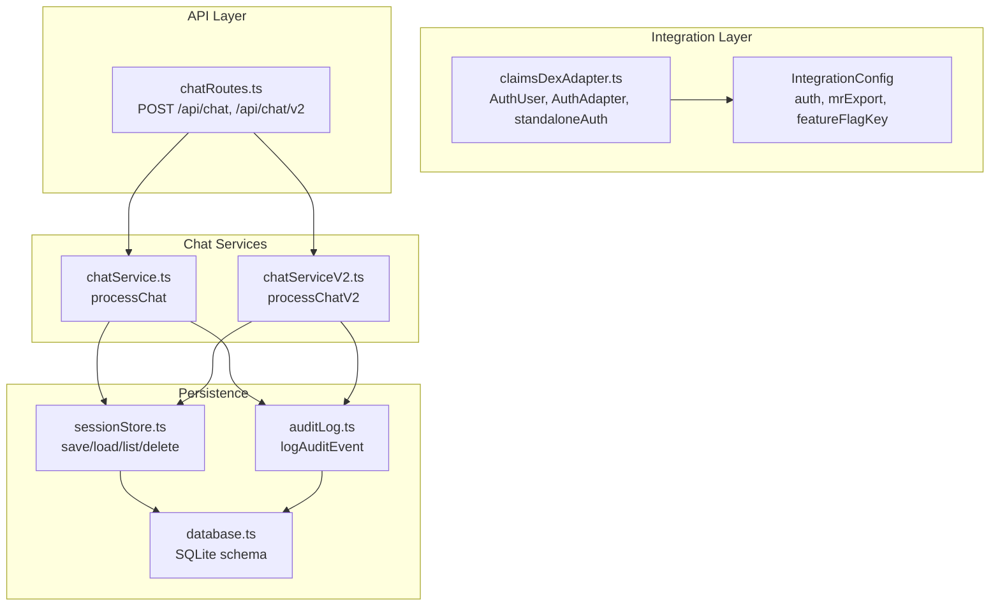
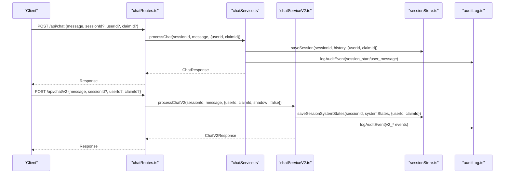
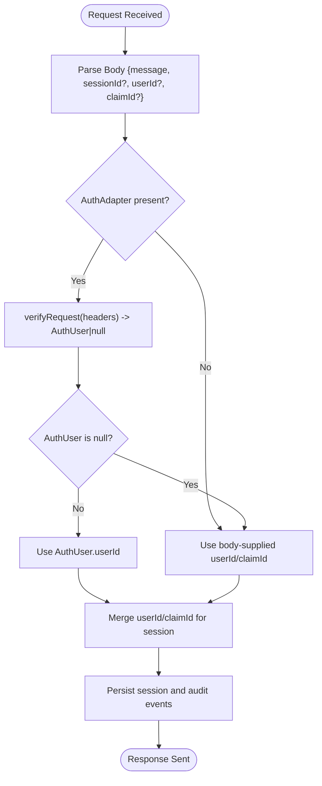
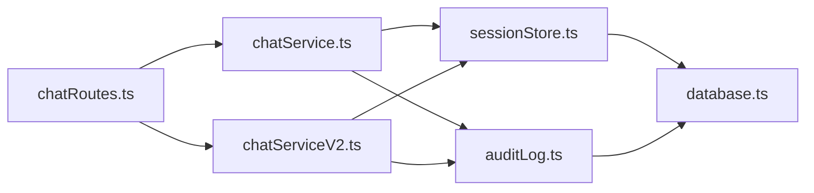

# Authentication System

<cite>
**Referenced Files in This Document**
- [claimsDexAdapter.ts](file://src/integration/claimsDexAdapter.ts)
- [chatRoutes.ts](file://src/api/chatRoutes.ts)
- [chatService.ts](file://src/chat/chatService.ts)
- [chatServiceV2.ts](file://src/chat/chatServiceV2.ts)
- [sessionStore.ts](file://src/db/sessionStore.ts)
- [auditLog.ts](file://src/db/auditLog.ts)
- [database.ts](file://src/db/database.ts)
- [server.ts](file://src/server.ts)
</cite>

## Table of Contents
1. [Introduction](#introduction)
2. [Project Structure](#project-structure)
3. [Core Components](#core-components)
4. [Architecture Overview](#architecture-overview)
5. [Detailed Component Analysis](#detailed-component-analysis)
6. [Dependency Analysis](#dependency-analysis)
7. [Performance Considerations](#performance-considerations)
8. [Troubleshooting Guide](#troubleshooting-guide)
9. [Conclusion](#conclusion)

## Introduction
This document explains the authentication system integration for user verification and authorization within the GATIOD Chat Assistant. It covers the AuthUser interface, AuthAdapter implementation patterns, and the distinction between standalone and claimsDex authentication modes. It documents the verifyRequest method requirements, authentication headers processing, and user context management. The content is tailored for both security architects and developers, aligning terminology with healthcare security standards and providing practical examples for configuration, role management, and integration patterns.

## Project Structure
The authentication system is intentionally minimal in standalone mode and designed to plug into claimsDex environments. The key integration surface is defined in the integration adapter module, while the chat routes and services demonstrate how user context is propagated through the system.

**Diagram sources**
- [claimsDexAdapter.ts:12-28](file://src/integration/claimsDexAdapter.ts#L12-L28)
- [claimsDexAdapter.ts:93-104](file://src/integration/claimsDexAdapter.ts#L93-L104)
- [chatRoutes.ts:14-90](file://src/api/chatRoutes.ts#L14-L90)
- [chatService.ts:38-183](file://src/chat/chatService.ts#L38-L183)
- [chatServiceV2.ts:258-800](file://src/chat/chatServiceV2.ts#L258-L800)
- [sessionStore.ts:21-110](file://src/db/sessionStore.ts#L21-L110)
- [auditLog.ts:58-91](file://src/db/auditLog.ts#L58-L91)
- [database.ts:20-49](file://src/db/database.ts#L20-L49)

**Section sources**
- [claimsDexAdapter.ts:12-28](file://src/integration/claimsDexAdapter.ts#L12-L28)
- [claimsDexAdapter.ts:93-104](file://src/integration/claimsDexAdapter.ts#L93-L104)
- [chatRoutes.ts:14-90](file://src/api/chatRoutes.ts#L14-L90)
- [chatService.ts:38-183](file://src/chat/chatService.ts#L38-L183)
- [chatServiceV2.ts:258-800](file://src/chat/chatServiceV2.ts#L258-L800)
- [sessionStore.ts:21-110](file://src/db/sessionStore.ts#L21-L110)
- [auditLog.ts:58-91](file://src/db/auditLog.ts#L58-L91)
- [database.ts:20-49](file://src/db/database.ts#L20-L49)

## Core Components
- AuthUser: Minimal user identity contract with identifiers and role for downstream authorization decisions.
- AuthAdapter: Pluggable interface for verifying incoming requests and extracting user context from headers.
- standaloneAuth: Null-auth implementation for standalone mode; always returns null to indicate no authenticated user.
- IntegrationConfig: Container for adapters and feature flags enabling claimsDex integration.

Implementation highlights:
- AuthUser fields: userId, email, role.
- AuthAdapter.verifyRequest(headers): Promise resolves to AuthUser or null.
- standaloneAuth.verifyRequest(): Always returns null.
- IntegrationConfig.auth: Injected adapter; IntegrationConfig.featureFlagKey: claimsDex feature flag key.

Security note: In standalone mode, no authentication is enforced. ClaimsDex mode expects a platform-provided AuthAdapter that validates and extracts user identity from request headers.

**Section sources**
- [claimsDexAdapter.ts:12-28](file://src/integration/claimsDexAdapter.ts#L12-L28)
- [claimsDexAdapter.ts:93-104](file://src/integration/claimsDexAdapter.ts#L93-L104)

## Architecture Overview
The authentication architecture is intentionally decoupled from the core chat services. Requests enter via chat routes, optionally propagate through v2 orchestration, and persist sessions and audit logs. User context is carried through the system via optional userId and claimId fields supplied by clients.

**Diagram sources**
- [chatRoutes.ts:14-90](file://src/api/chatRoutes.ts#L14-L90)
- [chatService.ts:38-183](file://src/chat/chatService.ts#L38-L183)
- [chatServiceV2.ts:258-800](file://src/chat/chatServiceV2.ts#L258-L800)
- [sessionStore.ts:21-110](file://src/db/sessionStore.ts#L21-L110)
- [auditLog.ts:58-91](file://src/db/auditLog.ts#L58-L91)

## Detailed Component Analysis

### AuthUser and AuthAdapter
- AuthUser defines the minimal identity contract: userId, email, role. These fields enable downstream authorization and audit trails.
- AuthAdapter.verifyRequest(headers) is the single integration point for authentication. It receives raw headers and must return an AuthUser or null. In claimsDex mode, this adapter validates platform-specific authentication artifacts (e.g., JWTs) and extracts user identity.

Standalone vs claimsDex:
- Standalone: standaloneAuth.verifyRequest returns null, indicating no authenticated user. This mode is intended for development and demos.
- claimsDex: Replace standaloneAuth with a platform adapter that validates middleware-provided credentials and returns a populated AuthUser.

Headers processing:
- The adapter receives headers as Record<string, string | string[] | undefined>.
- Implementations should normalize header names (case-insensitive) and extract identity claims (e.g., subject, email, roles).
- Return null for unauthenticated requests to maintain system safety.

Authorization:
- Role-based checks can be performed by downstream services using AuthUser.role.
- For healthcare contexts, roles should reflect clinical responsibilities and access privileges.

**Section sources**
- [claimsDexAdapter.ts:12-28](file://src/integration/claimsDexAdapter.ts#L12-L28)

### IntegrationConfig and Feature Flags
- IntegrationConfig.auth: Injected AuthAdapter instance.
- IntegrationConfig.featureFlagKey: Key used by claimsDex to gate features.
- standaloneConfig: Provides defaults for standalone mode.

Practical configuration:
- In claimsDex, replace standaloneAuth with a Firebase Auth-compatible adapter that reads Authorization or similar headers and returns an AuthUser.
- Set the feature flag key to the platform’s configuration key to enable/disable the chat assistant.

**Section sources**
- [claimsDexAdapter.ts:93-104](file://src/integration/claimsDexAdapter.ts#L93-L104)

### User Context Propagation Through Chat Services
- Chat routes accept optional userId and claimId in request bodies.
- These identifiers are forwarded to chat services and persisted in sessions and audit logs.
- In claimsDex mode, AuthAdapter.verifyRequest can also supply userId; routes can optionally enrich or override from headers.

Session and audit implications:
- Sessions capture userId and claimId for traceability and resumptions.
- Audit logs record userId alongside events for medico-legal compliance.

**Diagram sources**
- [chatRoutes.ts:14-90](file://src/api/chatRoutes.ts#L14-L90)
- [claimsDexAdapter.ts:18-21](file://src/integration/claimsDexAdapter.ts#L18-L21)
- [sessionStore.ts:21-44](file://src/db/sessionStore.ts#L21-L44)
- [auditLog.ts:58-73](file://src/db/auditLog.ts#L58-L73)

**Section sources**
- [chatRoutes.ts:14-90](file://src/api/chatRoutes.ts#L14-L90)
- [sessionStore.ts:21-44](file://src/db/sessionStore.ts#L21-L44)
- [auditLog.ts:58-73](file://src/db/auditLog.ts#L58-L73)

### Session and Audit Logging with User Context
- Session persistence captures userId and claimId for continuity and legal traceability.
- Audit logging records userId for every significant event, ensuring a complete audit trail.

Healthcare security alignment:
- Sessions and audit logs support medico-legal traceability and compliance with healthcare data governance.
- Fields like claimId enable linkage to external claims or cases.

**Section sources**
- [sessionStore.ts:21-44](file://src/db/sessionStore.ts#L21-L44)
- [auditLog.ts:58-91](file://src/db/auditLog.ts#L58-L91)

## Dependency Analysis
The authentication system is intentionally thin and loosely coupled:
- chatRoutes depends on chatService and chatServiceV2.
- chatService and chatServiceV2 depend on sessionStore and auditLog.
- sessionStore and auditLog depend on database.

**Diagram sources**
- [chatRoutes.ts:14-90](file://src/api/chatRoutes.ts#L14-L90)
- [chatService.ts:38-183](file://src/chat/chatService.ts#L38-L183)
- [chatServiceV2.ts:258-800](file://src/chat/chatServiceV2.ts#L258-L800)
- [sessionStore.ts:21-110](file://src/db/sessionStore.ts#L21-L110)
- [auditLog.ts:58-91](file://src/db/auditLog.ts#L58-L91)
- [database.ts:20-49](file://src/db/database.ts#L20-L49)

**Section sources**
- [chatRoutes.ts:14-90](file://src/api/chatRoutes.ts#L14-L90)
- [chatService.ts:38-183](file://src/chat/chatService.ts#L38-L183)
- [chatServiceV2.ts:258-800](file://src/chat/chatServiceV2.ts#L258-L800)
- [sessionStore.ts:21-110](file://src/db/sessionStore.ts#L21-L110)
- [auditLog.ts:58-91](file://src/db/auditLog.ts#L58-L91)
- [database.ts:20-49](file://src/db/database.ts#L20-L49)

## Performance Considerations
- Authentication overhead: In claimsDex mode, verifyRequest adds a small synchronous cost per request. Keep header parsing efficient and avoid heavy cryptographic operations in hot paths.
- Session writes: Both chat services persist sessions before invoking external APIs. This ensures resilience but increases write frequency; tune database settings for throughput.
- Audit logging: Non-blocking writes prevent audit failures from impacting main flows; ensure database indexing supports frequent inserts.

## Troubleshooting Guide
Common issues and resolutions:
- Missing GEMINI_API_KEY: chatService throws when the environment variable is absent. Ensure the key is configured before starting the server.
- Disabled feature flag: If GATIOD_CHAT_ENABLED is false, chatService rejects requests. Enable the feature flag to allow chat operations.
- Unauthenticated requests in claimsDex: If verifyRequest returns null, downstream services treat the user as anonymous. Confirm header normalization and adapter wiring.
- Audit logging failures: The audit logger catches and logs errors without crashing. Investigate database connectivity or permissions if audit entries are missing.

Operational checks:
- Verify server startup logs for port binding and API key warnings.
- Confirm database initialization and schema creation on first run.

**Section sources**
- [chatService.ts:43-49](file://src/chat/chatService.ts#L43-L49)
- [chatService.ts:46-49](file://src/chat/chatService.ts#L46-L49)
- [auditLog.ts:69-72](file://src/db/auditLog.ts#L69-L72)
- [server.ts:52-54](file://src/server.ts#L52-L54)
- [database.ts:20-49](file://src/db/database.ts#L20-L49)

## Conclusion
The authentication system is deliberately minimal and modular. In standalone mode, it enables rapid development without authentication overhead. In claimsDex mode, the AuthAdapter pattern cleanly integrates platform authentication, allowing downstream services to operate with consistent user context. By propagating userId and claimId through sessions and audit logs, the system supports healthcare-grade traceability and compliance. For secure deployments, ensure the AuthAdapter is robust, headers are normalized, and feature flags are managed centrally via claimsDex.