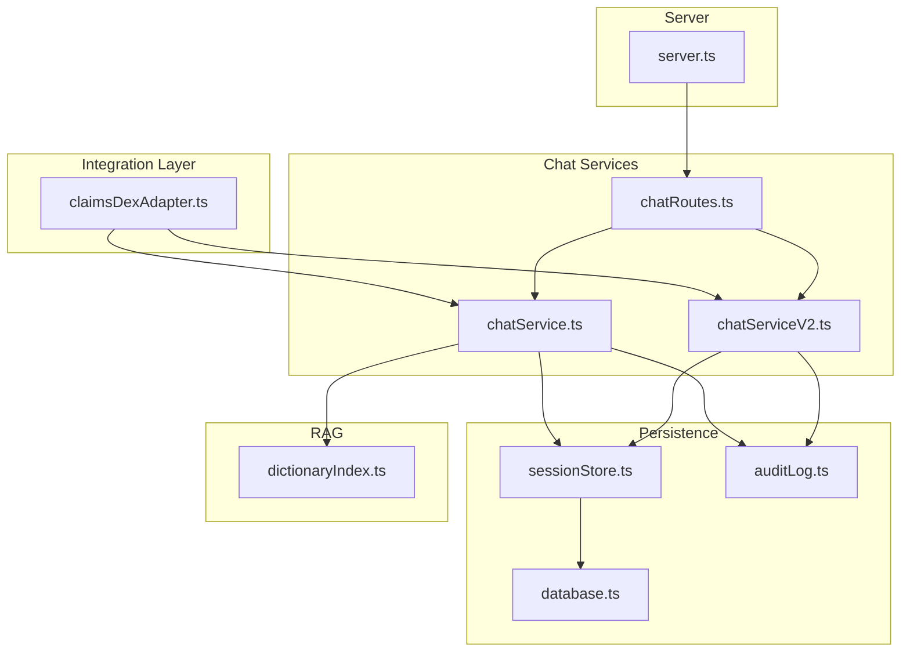
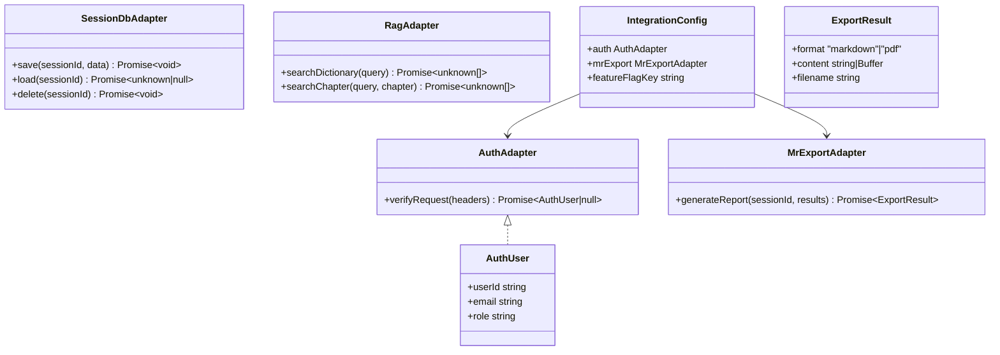
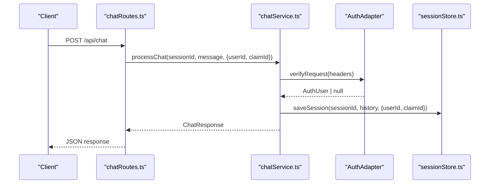
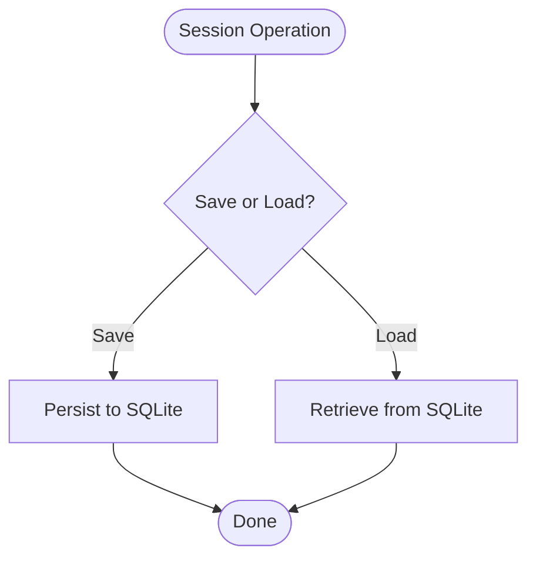
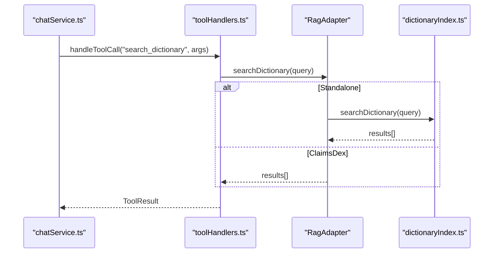
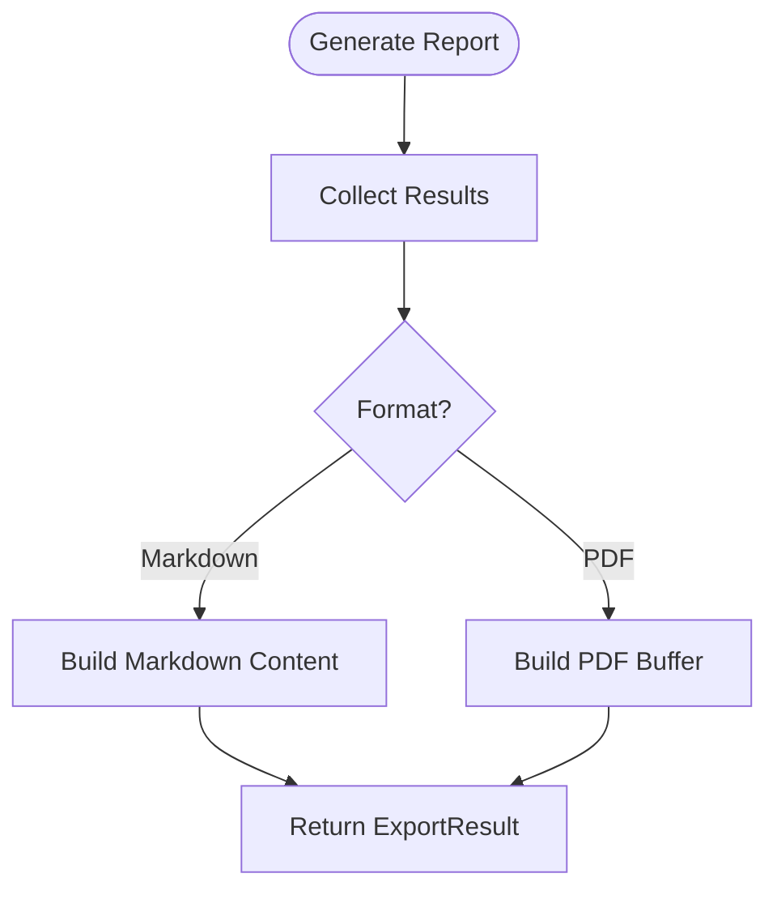
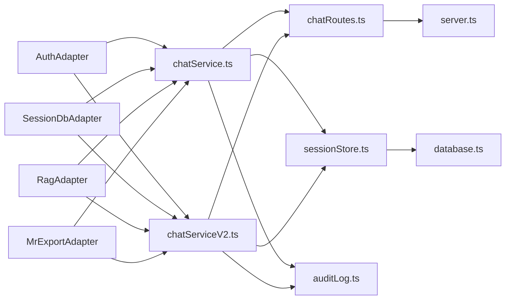

# ClaimsDex Adapter

<cite>
**Referenced Files in This Document**
- [claimsDexAdapter.ts](file://src/integration/claimsDexAdapter.ts)
- [sessionStore.ts](file://src/db/sessionStore.ts)
- [dictionaryIndex.ts](file://src/rag/dictionaryIndex.ts)
- [chatService.ts](file://src/chat/chatService.ts)
- [chatServiceV2.ts](file://src/chat/chatServiceV2.ts)
- [chatRoutes.ts](file://src/api/chatRoutes.ts)
- [database.ts](file://src/db/database.ts)
- [auditLog.ts](file://src/db/auditLog.ts)
- [server.ts](file://src/server.ts)
- [package.json](file://package.json)
</cite>

## Table of Contents
1. [Introduction](#introduction)
2. [Project Structure](#project-structure)
3. [Core Components](#core-components)
4. [Architecture Overview](#architecture-overview)
5. [Detailed Component Analysis](#detailed-component-analysis)
6. [Dependency Analysis](#dependency-analysis)
7. [Performance Considerations](#performance-considerations)
8. [Troubleshooting Guide](#troubleshooting-guide)
9. [Conclusion](#conclusion)
10. [Appendices](#appendices)

## Introduction
This document explains the ClaimsDex adapter integration for the GATIOD chat assistant. It focuses on the clean interface design and pluggable architecture that enables seamless integration with the ClaimsDex platform. The adapter pattern cleanly separates concerns across four domains:
- Authentication
- Session database persistence
- Retrieval-Augmented Generation (RAG) search
- Medical report export

The goal is to provide healthcare IT integrators and developers with a clear understanding of how to replace the standalone implementations with ClaimsDex-native services while preserving a consistent interface contract.

## Project Structure
The adapter lives alongside the core chat service and integrates with the session store, RAG dictionary, and audit logging subsystems. The server exposes API endpoints that route to the chat services, which in turn rely on the adapter-configurable components.

**Diagram sources**
- [claimsDexAdapter.ts](file://src/integration/claimsDexAdapter.ts)
- [chatService.ts](file://src/chat/chatService.ts)
- [chatServiceV2.ts](file://src/chat/chatServiceV2.ts)
- [chatRoutes.ts](file://src/api/chatRoutes.ts)
- [sessionStore.ts](file://src/db/sessionStore.ts)
- [database.ts](file://src/db/database.ts)
- [auditLog.ts](file://src/db/auditLog.ts)
- [dictionaryIndex.ts](file://src/rag/dictionaryIndex.ts)
- [server.ts](file://src/server.ts)

**Section sources**
- [claimsDexAdapter.ts](file://src/integration/claimsDexAdapter.ts)
- [chatRoutes.ts](file://src/api/chatRoutes.ts)
- [server.ts](file://src/server.ts)

## Core Components
The adapter defines four clean interfaces and a configuration object enabling ClaimsDex to plug in platform-native services:

- AuthAdapter: Verifies incoming requests and returns an AuthUser or null.
- SessionDbAdapter: Persists and retrieves session state for chat continuity.
- RagAdapter: Provides dictionary and chapter search for RAG.
- MrExportAdapter: Generates a medical report from assessment results.

A standalone configuration is provided for local development, and ClaimsDex replaces these with platform services.

**Section sources**
- [claimsDexAdapter.ts](file://src/integration/claimsDexAdapter.ts)

## Architecture Overview
The adapter pattern isolates platform-specific logic behind stable interfaces. The chat services depend on these adapters rather than concrete implementations, enabling ClaimsDex to swap out components without changing the rest of the system.

**Diagram sources**
- [claimsDexAdapter.ts](file://src/integration/claimsDexAdapter.ts)

## Detailed Component Analysis

### Authentication Adapter (AuthAdapter)
Purpose:
- Authenticate incoming requests and return an AuthUser object or null.
- Standalone mode returns null (no auth).
- ClaimsDex mode expects a Firebase Auth-compatible implementation.

Interfaces and behaviors:
- Method signature: verifyRequest(headers) -> Promise<AuthUser | null>
- Expected behavior: Parse headers, validate credentials, and return user identity or null if unauthenticated.

Standalone implementation:
- Returns null for all requests in local mode.

Integration points:
- Used by the chat services to enforce access control and associate sessions with users.

**Diagram sources**
- [chatRoutes.ts](file://src/api/chatRoutes.ts)
- [chatService.ts](file://src/chat/chatService.ts)
- [claimsDexAdapter.ts](file://src/integration/claimsDexAdapter.ts)
- [sessionStore.ts](file://src/db/sessionStore.ts)

**Section sources**
- [claimsDexAdapter.ts](file://src/integration/claimsDexAdapter.ts)
- [chatService.ts](file://src/chat/chatService.ts)
- [chatRoutes.ts](file://src/api/chatRoutes.ts)

### Session Database Adapter (SessionDbAdapter)
Purpose:
- Persist and retrieve chat session state for continuity across restarts and resumes.
- Standalone mode uses SQLite; ClaimsDex uses shared PostgreSQL.

Interfaces and behaviors:
- save(sessionId, data) -> Promise<void>
- load(sessionId) -> Promise<unknown | null>
- delete(sessionId) -> Promise<void>

Standalone implementation:
- Uses SQLite via sessionStore.ts with a dedicated table for sessions and audit logs.

Integration points:
- Both chatService.ts and chatServiceV2.ts persist session state after each turn.
- Audit trail is recorded for medico-legal traceability.

**Diagram sources**
- [sessionStore.ts](file://src/db/sessionStore.ts)
- [database.ts](file://src/db/database.ts)
- [auditLog.ts](file://src/db/auditLog.ts)

**Section sources**
- [claimsDexAdapter.ts](file://src/integration/claimsDexAdapter.ts)
- [sessionStore.ts](file://src/db/sessionStore.ts)
- [database.ts](file://src/db/database.ts)
- [auditLog.ts](file://src/db/auditLog.ts)

### RAG Search Adapter (RagAdapter)
Purpose:
- Provide dictionary and chapter-based search for grounding.
- Standalone mode uses a simple keyword search over the dictionary.
- ClaimsDex mode uses a hybrid retriever (BM25 + embeddings).

Interfaces and behaviors:
- searchDictionary(query) -> Promise<unknown[]>
- searchChapter(query, chapter?) -> Promise<unknown[]>

Standalone implementation:
- Loads the dictionary from knowledge/dictionary.json and performs substring matching.

Integration points:
- chatService.ts invokes searchDictionary during tool execution.
- chatServiceV2.ts uses a hybrid retriever for semantic grounding.

**Diagram sources**
- [chatService.ts](file://src/chat/chatService.ts)
- [claimsDexAdapter.ts](file://src/integration/claimsDexAdapter.ts)
- [dictionaryIndex.ts](file://src/rag/dictionaryIndex.ts)

**Section sources**
- [claimsDexAdapter.ts](file://src/integration/claimsDexAdapter.ts)
- [dictionaryIndex.ts](file://src/rag/dictionaryIndex.ts)
- [chatService.ts](file://src/chat/chatService.ts)

### Medical Report Export Adapter (MrExportAdapter)
Purpose:
- Generate a medical report from assessment results.
- Standalone mode exports a markdown file.
- ClaimsDex mode integrates with the DMR pipeline and TrustVC PDF generation.

Interfaces and behaviors:
- generateReport(sessionId, results) -> Promise<{ format, content, filename }>
- Expected output: format "markdown"|"pdf", content string|Buffer, filename string

Standalone implementation:
- Produces a markdown-formatted report with basic metadata and final PI percentage.

Integration points:
- Used by the UI and backend APIs to serve reports to users.

**Diagram sources**
- [claimsDexAdapter.ts](file://src/integration/claimsDexAdapter.ts)

**Section sources**
- [claimsDexAdapter.ts](file://src/integration/claimsDexAdapter.ts)

### Adapter Registration and Configuration
The integration configuration binds adapters to the runtime:

- IntegrationConfig: Holds auth, mrExport, and featureFlagKey.
- standaloneConfig: Provides default adapters for local development.
- Feature flags: isGatiodChatEnabled() and environment variables control availability.

Practical example (conceptual):
- ClaimsDex builds a production-ready IntegrationConfig with:
  - AuthAdapter backed by Firebase Auth
  - SessionDbAdapter backed by shared PostgreSQL
  - RagAdapter backed by hybrid retriever
  - MrExportAdapter backed by DMR and TrustVC
- The server reads environment variables and routes requests to chat services, which consult the adapters.

**Section sources**
- [claimsDexAdapter.ts](file://src/integration/claimsDexAdapter.ts)
- [chatService.ts](file://src/chat/chatService.ts)
- [server.ts](file://src/server.ts)

## Dependency Analysis
The adapter pattern reduces coupling between the chat services and platform-specific implementations. The following diagram shows key dependencies:

**Diagram sources**
- [claimsDexAdapter.ts](file://src/integration/claimsDexAdapter.ts)
- [chatService.ts](file://src/chat/chatService.ts)
- [chatServiceV2.ts](file://src/chat/chatServiceV2.ts)
- [chatRoutes.ts](file://src/api/chatRoutes.ts)
- [sessionStore.ts](file://src/db/sessionStore.ts)
- [database.ts](file://src/db/database.ts)
- [auditLog.ts](file://src/db/auditLog.ts)
- [server.ts](file://src/server.ts)

**Section sources**
- [claimsDexAdapter.ts](file://src/integration/claimsDexAdapter.ts)
- [chatService.ts](file://src/chat/chatService.ts)
- [chatServiceV2.ts](file://src/chat/chatServiceV2.ts)
- [chatRoutes.ts](file://src/api/chatRoutes.ts)
- [sessionStore.ts](file://src/db/sessionStore.ts)
- [database.ts](file://src/db/database.ts)
- [auditLog.ts](file://src/db/auditLog.ts)
- [server.ts](file://src/server.ts)

## Performance Considerations
- Adapter boundaries: Keep adapter calls minimal and cacheable where appropriate.
- Session persistence: Use efficient SQL indexes and batch writes for audit logs.
- RAG search: Prefer ClaimsDex hybrid retriever for scalability and accuracy.
- Export throughput: Stream PDF generation and avoid large in-memory buffers.

## Troubleshooting Guide
Common issues and resolutions:
- Authentication failures: Verify header parsing and ClaimsDex auth middleware alignment.
- Session persistence errors: Check database connectivity and WAL mode settings.
- RAG search returns empty: Confirm dictionary availability and ClaimsDex hybrid retriever health.
- Report export fails: Validate DMR pipeline and TrustVC integration.

Operational checks:
- Environment variables: Ensure GEMINI_API_KEY and database path are set.
- Feature flags: Confirm GATIOD_CHAT_ENABLED and related toggles.
- Audit logs: Use getSessionAuditTrail to trace assessment events.

**Section sources**
- [chatService.ts](file://src/chat/chatService.ts)
- [auditLog.ts](file://src/db/auditLog.ts)
- [chatRoutes.ts](file://src/api/chatRoutes.ts)
- [server.ts](file://src/server.ts)
- [package.json](file://package.json)

## Conclusion
The ClaimsDex adapter integration leverages a clean, pluggable architecture to enable seamless platform integration. By adhering to the defined interfaces and configuration model, ClaimsDex can replace standalone implementations with production-grade services while maintaining a consistent developer experience and robust auditability.

## Appendices

### Adapter Interfaces Reference
- AuthAdapter.verifyRequest(headers): Promise<AuthUser | null>
- SessionDbAdapter.save(sessionId, data): Promise<void>
- SessionDbAdapter.load(sessionId): Promise<unknown | null>
- SessionDbAdapter.delete(sessionId): Promise<void>
- RagAdapter.searchDictionary(query): Promise<unknown[]>
- RagAdapter.searchChapter(query, chapter?): Promise<unknown[]>
- MrExportAdapter.generateReport(sessionId, results): Promise<{ format, content, filename }>

### Integration Scenarios
- Local development: Use standaloneAuth and standaloneMrExport with SQLite.
- ClaimsDex production: Replace adapters with platform-native services and configure feature flags accordingly.