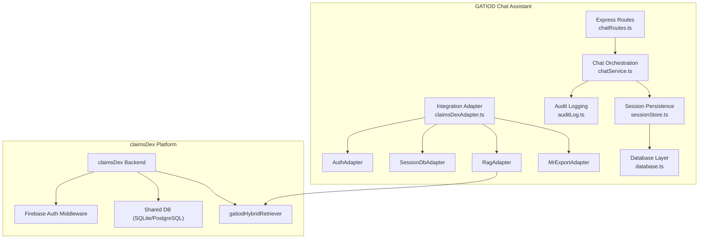
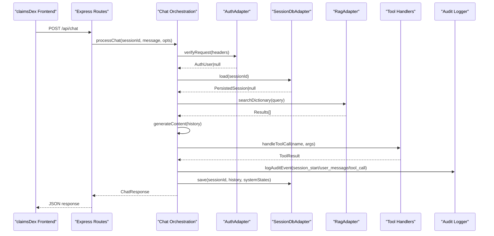
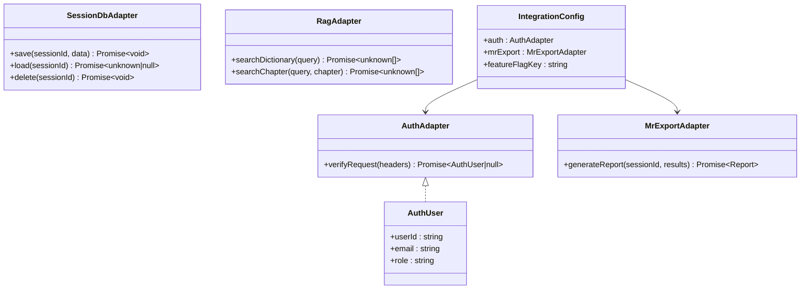
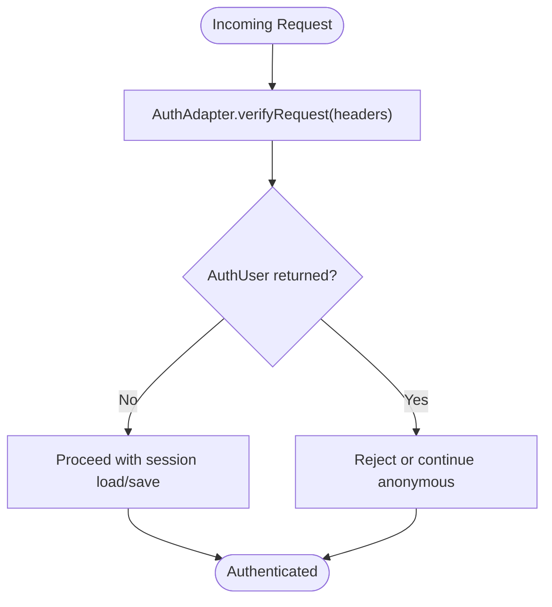
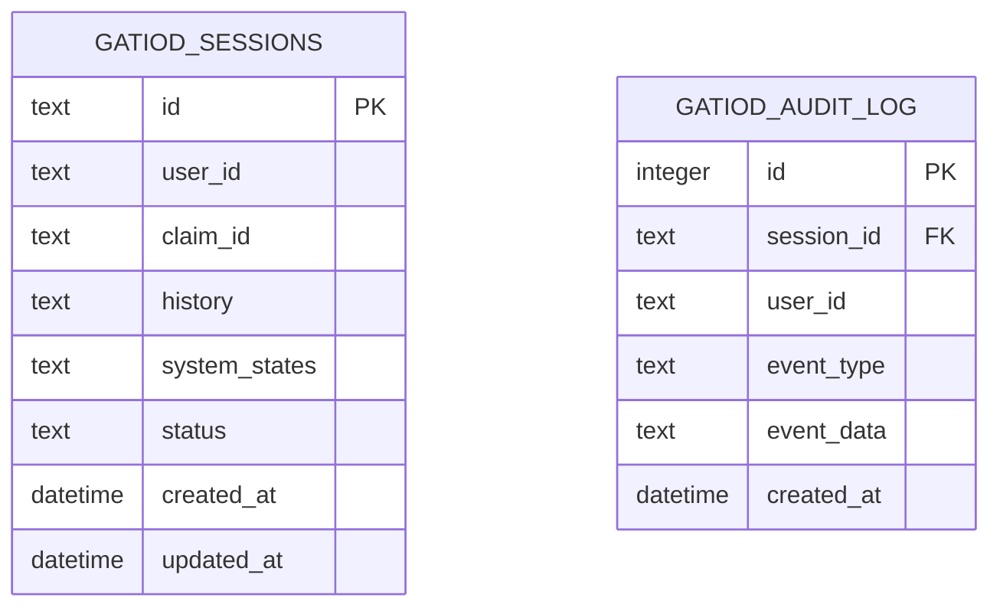
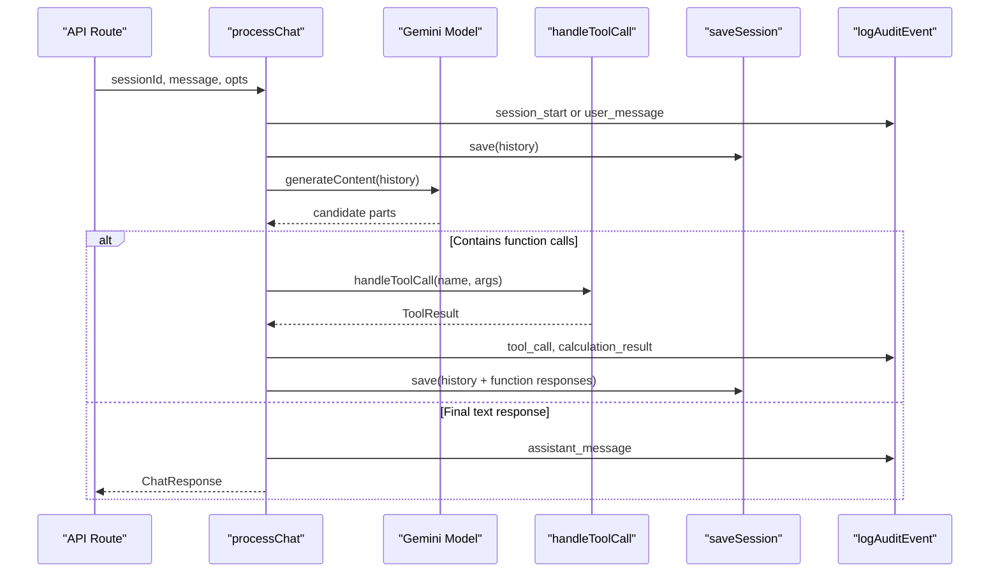
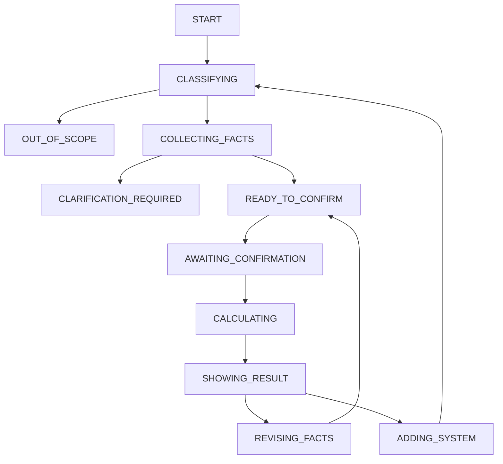
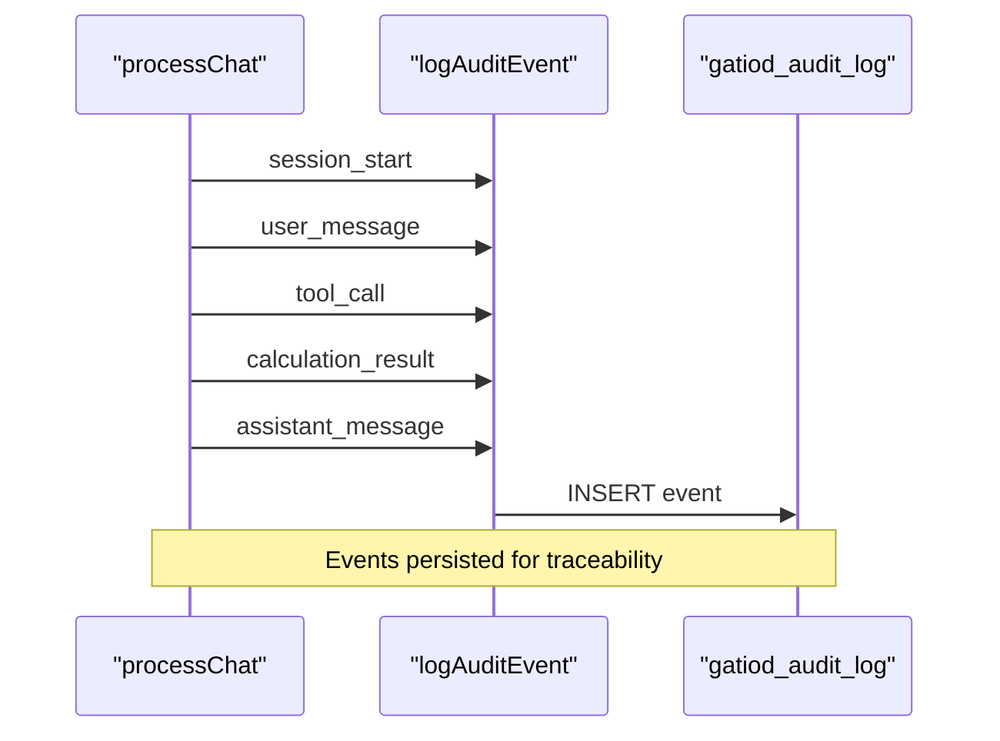
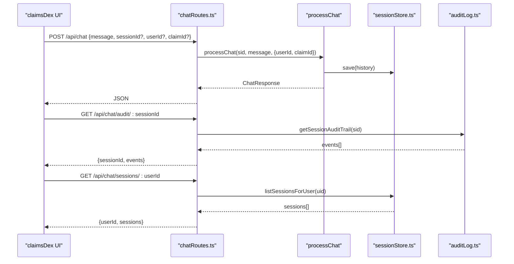
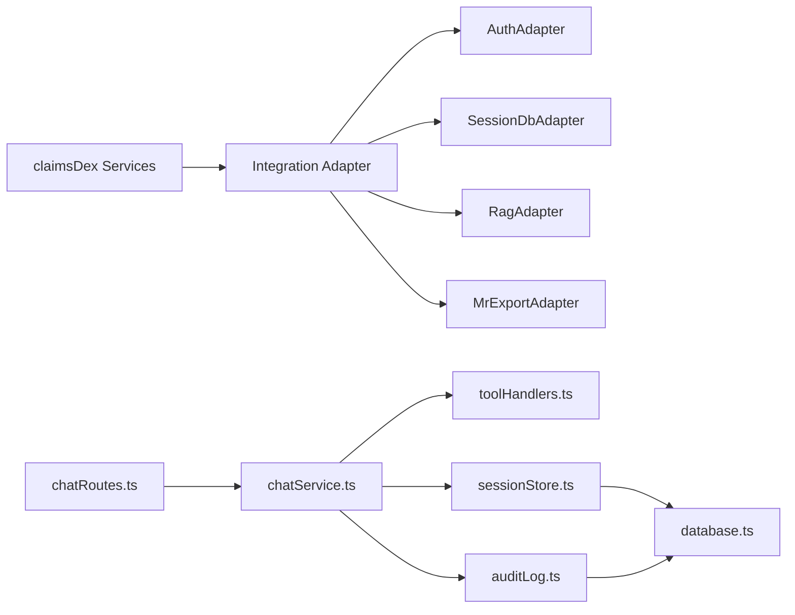

# Enterprise Integration

<cite>
**Referenced Files in This Document**
- [claimsDexAdapter.ts](file://src/integration/claimsDexAdapter.ts)
- [sessionStore.ts](file://src/db/sessionStore.ts)
- [auditLog.ts](file://src/db/auditLog.ts)
- [database.ts](file://src/db/database.ts)
- [chatService.ts](file://src/chat/chatService.ts)
- [chatRoutes.ts](file://src/api/chatRoutes.ts)
- [server.ts](file://src/server.ts)
- [dictionaryIndex.ts](file://src/rag/dictionaryIndex.ts)
- [toolHandlers.ts](file://src/tools/toolHandlers.ts)
- [README.md](file://README.md)
- [state_machine.json](file://gatiod_conversation_policy_data/policy/state_machine.json)
- [architecture-decisions.md](file://docs/v2/architecture-decisions.md)
- [rollout-plan.md](file://docs/v2/rollout-plan.md)
- [package.json](file://package.json)
</cite>

## Table of Contents
1. [Introduction](#introduction)
2. [Project Structure](#project-structure)
3. [Core Components](#core-components)
4. [Architecture Overview](#architecture-overview)
5. [Detailed Component Analysis](#detailed-component-analysis)
6. [Dependency Analysis](#dependency-analysis)
7. [Performance Considerations](#performance-considerations)
8. [Troubleshooting Guide](#troubleshooting-guide)
9. [Conclusion](#conclusion)
10. [Appendices](#appendices)

## Introduction
This document explains the enterprise integration capabilities for connecting the GATIOD Chat Assessment Assistant to the claimsDex platform and broader healthcare systems. It covers the integration adapter’s purpose and architecture, authentication and session database integration, claims processing workflows, system state management, and audit trail generation. The content is tailored for both healthcare IT professionals (benefits and integration outcomes) and developers (APIs, data formats, and deployment configuration).

## Project Structure
The integration is modular and designed for plug-and-play replacement of adapters when moving from standalone MVP to claimsDex:
- Integration adapter defines clean interfaces for authentication, session storage, RAG, and medical report export.
- Database layer supports SQLite with indexes and JSON columns, designed for PostgreSQL migration.
- Chat orchestration integrates Gemini with function calling and deterministic tools.
- API routes expose chat, session management, audit retrieval, and health checks.
- V2 architecture documents structured migration, state machines, and rollout governance.

**Diagram sources**
- [claimsDexAdapter.ts:12-104](file://src/integration/claimsDexAdapter.ts#L12-L104)
- [chatRoutes.ts:14-90](file://src/api/chatRoutes.ts#L14-L90)
- [chatService.ts:38-154](file://src/chat/chatService.ts#L38-L154)
- [database.ts:20-46](file://src/db/database.ts#L20-L46)
- [auditLog.ts:58-90](file://src/db/auditLog.ts#L58-L90)
- [sessionStore.ts:21-94](file://src/db/sessionStore.ts#L21-L94)

**Section sources**
- [README.md:63-76](file://README.md#L63-L76)
- [claimsDexAdapter.ts:1-105](file://src/integration/claimsDexAdapter.ts#L1-L105)
- [server.ts:13-67](file://src/server.ts#L13-L67)

## Core Components
- Integration Adapter: Defines AuthAdapter, SessionDbAdapter, RagAdapter, and MrExportAdapter. Provides a standalone configuration and placeholders for claimsDex-native replacements.
- Authentication: AuthAdapter.verifyRequest returns an AuthUser or null; standalone mode returns null (no auth).
- Session Database: SessionDbAdapter persists sessions; standalone uses SQLite via sessionStore.ts; claimsDex replaces with shared DB calls.
- RAG: RagAdapter.searchDictionary/searchChapter; standalone uses a simple dictionary index; claimsDex uses a hybrid retriever.
- Medical Report Export: MrExportAdapter generates reports; standalone returns markdown; claimsDex emits TrustVC PDF via DMR.
- Feature Flags: isGatiodChatEnabled and IntegrationConfig.featureFlagKey enable/disable and configure the integration.

**Section sources**
- [claimsDexAdapter.ts:12-104](file://src/integration/claimsDexAdapter.ts#L12-L104)
- [sessionStore.ts:10-19](file://src/db/sessionStore.ts#L10-L19)
- [dictionaryIndex.ts:59-74](file://src/rag/dictionaryIndex.ts#L59-L74)
- [auditLog.ts:8-50](file://src/db/auditLog.ts#L8-L50)

## Architecture Overview
The integration adapter exposes clean interfaces that claimsDex replaces with platform-native services. The chat service orchestrates Gemini, invokes tool handlers, and persists sessions and audit events. API routes expose chat, reset, audit retrieval, and session listing.

**Diagram sources**
- [chatRoutes.ts:14-41](file://src/api/chatRoutes.ts#L14-L41)
- [chatService.ts:38-154](file://src/chat/chatService.ts#L38-L154)
- [claimsDexAdapter.ts:18-28](file://src/integration/claimsDexAdapter.ts#L18-L28)
- [sessionStore.ts:69-84](file://src/db/sessionStore.ts#L69-L84)
- [dictionaryIndex.ts:59-74](file://src/rag/dictionaryIndex.ts#L59-L74)
- [toolHandlers.ts:47-102](file://src/tools/toolHandlers.ts#L47-L102)
- [auditLog.ts:58-73](file://src/db/auditLog.ts#L58-L73)

## Detailed Component Analysis

### Integration Adapter and ClaimsDex Connectivity
- Purpose: Provide pluggable interfaces for authentication, session persistence, RAG, and report export so claimsDex can replace them with platform-native services.
- Authentication: AuthAdapter.verifyRequest is the hook for claimsDex Firebase middleware; standalone mode returns null.
- Session Database: SessionDbAdapter.save/load/delete enables claimsDex to use shared SQLite/PostgreSQL via db.ts prepared statements.
- RAG: RagAdapter.searchDictionary/searchChapter allows claimsDex to swap the standalone keyword search with gatiodHybridRetriever.
- Report Export: MrExportAdapter.generateReport emits markdown in standalone; claimsDex emits TrustVC PDF via DMR.
- Feature Flags: isGatiodChatEnabled and IntegrationConfig.featureFlagKey align with claimsDex configuration systems.

**Diagram sources**
- [claimsDexAdapter.ts:12-104](file://src/integration/claimsDexAdapter.ts#L12-L104)

**Section sources**
- [claimsDexAdapter.ts:10-104](file://src/integration/claimsDexAdapter.ts#L10-L104)
- [README.md:65-68](file://README.md#L65-L68)

### Authentication Mechanisms
- Standalone: No authentication; verifyRequest returns null.
- claimsDex: claimsDex middleware verifies requests and returns an AuthUser; the adapter delegates verification to the platform.

**Diagram sources**
- [claimsDexAdapter.ts:18-28](file://src/integration/claimsDexAdapter.ts#L18-L28)
- [chatService.ts:56-59](file://src/chat/chatService.ts#L56-L59)

**Section sources**
- [claimsDexAdapter.ts:18-28](file://src/integration/claimsDexAdapter.ts#L18-L28)
- [chatService.ts:46-59](file://src/chat/chatService.ts#L46-L59)

### Session Database Integration
- Standalone: SQLite with JSON columns for history and system states; indexes on user_id, claim_id, and status.
- claimsDex: Replace sessionStore.ts with shared DB prepared statements; maintain the same schema and indexes.
- Operations: Save, load, delete (abandon), complete, and list by user.

**Diagram sources**
- [database.ts:20-46](file://src/db/database.ts#L20-L46)
- [sessionStore.ts:10-19](file://src/db/sessionStore.ts#L10-L19)
- [auditLog.ts:51-56](file://src/db/auditLog.ts#L51-L56)

**Section sources**
- [sessionStore.ts:21-94](file://src/db/sessionStore.ts#L21-L94)
- [database.ts:11-49](file://src/db/database.ts#L11-L49)

### Claims Processing Workflows
- Chat orchestration loads or creates a session, logs audit events, builds history, calls Gemini with retries, handles function calls, persists state, and returns a response with optional tool calls and CHIPS.
- Tool handlers execute deterministic calculations per system and return structured results with provenance and final PI%.

**Diagram sources**
- [chatService.ts:38-154](file://src/chat/chatService.ts#L38-L154)
- [toolHandlers.ts:47-102](file://src/tools/toolHandlers.ts#L47-L102)
- [auditLog.ts:58-73](file://src/db/auditLog.ts#L58-L73)
- [sessionStore.ts:21-44](file://src/db/sessionStore.ts#L21-L44)

**Section sources**
- [chatService.ts:38-154](file://src/chat/chatService.ts#L38-L154)
- [toolHandlers.ts:47-102](file://src/tools/toolHandlers.ts#L47-L102)

### System State Management and Conversation Policy
- V2 state machine governs transitions from START to OUT_OF_SCOPE, including classification, collection of facts, clarification, confirmation, calculation, and result presentation.
- Hard guards prevent rendering PI% without successful tool execution and enforce confirmation before calculation.
- The state machine JSON defines states, transitions, and hard guards for deterministic behavior.

**Diagram sources**
- [state_machine.json:3-131](file://gatiod_conversation_policy_data/policy/state_machine.json#L3-L131)

**Section sources**
- [state_machine.json:17-107](file://gatiod_conversation_policy_data/policy/state_machine.json#L17-L107)
- [architecture-decisions.md:109-130](file://docs/v2/architecture-decisions.md#L109-L130)

### Audit Trail Generation
- Audit events capture every interaction: session_start, user_message, assistant_message, tool_call, confirmation_presented/accepted, correction, calculation_result, report_downloaded, session_reset, error, and V2-specific events.
- getSessionAuditTrail retrieves ordered events for medico-legal traceability.

**Diagram sources**
- [auditLog.ts:58-90](file://src/db/auditLog.ts#L58-L90)
- [chatService.ts:56-120](file://src/chat/chatService.ts#L56-L120)

**Section sources**
- [auditLog.ts:8-50](file://src/db/auditLog.ts#L8-L50)
- [auditLog.ts:75-90](file://src/db/auditLog.ts#L75-L90)

### API Endpoints and Data Exchange Formats
- POST /api/chat: Send a message with optional sessionId, userId, claimId. Returns ChatResponse with message, optional toolCalls, suggestedChips, and sessionId.
- POST /api/chat/reset: Reset a session by sessionId.
- GET /api/chat/audit/:sessionId: Retrieve audit trail for a session.
- GET /api/chat/sessions/:userId: List recent sessions for a user.
- GET /health: Health check endpoint.

**Diagram sources**
- [chatRoutes.ts:14-90](file://src/api/chatRoutes.ts#L14-L90)
- [chatService.ts:38-154](file://src/chat/chatService.ts#L38-L154)
- [sessionStore.ts:96-109](file://src/db/sessionStore.ts#L96-L109)
- [auditLog.ts:75-90](file://src/db/auditLog.ts#L75-L90)

**Section sources**
- [chatRoutes.ts:14-90](file://src/api/chatRoutes.ts#L14-L90)
- [server.ts:25-37](file://src/server.ts#L25-L37)

## Dependency Analysis
- Integration Adapter depends on claimsDex services for auth, DB, RAG, and export.
- Chat orchestration depends on Gemini SDK, tool handlers, session store, and audit logger.
- Database layer initializes tables and indexes; session store and audit logger depend on it.
- API routes depend on chat service and database utilities.

**Diagram sources**
- [claimsDexAdapter.ts:93-104](file://src/integration/claimsDexAdapter.ts#L93-L104)
- [chatRoutes.ts:7-10](file://src/api/chatRoutes.ts#L7-L10)
- [chatService.ts:6-17](file://src/chat/chatService.ts#L6-L17)
- [sessionStore.ts:8](file://src/db/sessionStore.ts#L8)
- [auditLog.ts:6](file://src/db/auditLog.ts#L6)
- [database.ts:6](file://src/db/database.ts#L6)

**Section sources**
- [claimsDexAdapter.ts:93-104](file://src/integration/claimsDexAdapter.ts#L93-L104)
- [chatService.ts:6-17](file://src/chat/chatService.ts#L6-L17)
- [database.ts:11-49](file://src/db/database.ts#L11-L49)

## Performance Considerations
- Database tuning: WAL mode and busy_timeout improve concurrency; indexes on user_id, claim_id, and status optimize queries.
- Retry strategy: Gemini calls retry with exponential backoff to mitigate transient errors.
- Session persistence before tool execution ensures resilience against upstream failures.
- RAG search uses substring matching in standalone; claimsDex hybrid retriever improves precision and latency.

[No sources needed since this section provides general guidance]

## Troubleshooting Guide
- Environment variables: Ensure GEMINI_API_KEY is set; otherwise, chat will fail early.
- Port conflicts: The server automatically increments port if the default is in use.
- Audit logging failures: The audit logger catches and logs errors without crashing the main flow.
- Session reset: Use POST /api/chat/reset to abandon a session and clear state.
- Health checks: GET /health returns service status.

**Section sources**
- [server.ts:52-64](file://src/server.ts#L52-L64)
- [auditLog.ts:69-72](file://src/db/auditLog.ts#L69-L72)
- [chatRoutes.ts:68-74](file://src/api/chatRoutes.ts#L68-L74)

## Conclusion
The integration adapter cleanly decouples authentication, session persistence, RAG, and report export, enabling seamless replacement with claimsDex-native services. The chat orchestration, deterministic tool execution, robust audit logging, and structured V2 state machine deliver a reliable, traceable, and scalable solution for healthcare claims assessments. Deployment involves configuring environment variables, replacing adapters with claimsDex services, and validating database schema and indexes.

[No sources needed since this section summarizes without analyzing specific files]

## Appendices

### Deployment Configuration Checklist
- Set environment variables:
  - GEMINI_API_KEY: Gemini API key for model access.
  - GATIOD_DB_PATH: Path to SQLite database (defaults to project root).
  - GATIOD_CHAT_ENABLED: Enable/disable chat feature.
  - PORT: Server port (default 3001).
- Replace adapters:
  - AuthAdapter: claimsDex Firebase middleware.
  - SessionDbAdapter: shared DB prepared statements.
  - RagAdapter: gatiodHybridRetriever.
  - MrExportAdapter: TrustVC PDF via DMR.
- Validate schema: Ensure gatiod_sessions and gatiod_audit_log tables exist with indexes.
- Health check: Confirm GET /health responds with service status.

**Section sources**
- [server.ts:14](file://src/server.ts#L14)
- [database.ts:14](file://src/db/database.ts#L14)
- [claimsDexAdapter.ts:93-104](file://src/integration/claimsDexAdapter.ts#L93-L104)
- [README.md:19-24](file://README.md#L19-L24)

### API Reference Summary
- POST /api/chat: Chat with optional sessionId, userId, claimId.
- POST /api/chat/reset: Reset a session.
- GET /api/chat/audit/:sessionId: Retrieve audit trail.
- GET /api/chat/sessions/:userId: List user sessions.
- GET /health: Health check.

**Section sources**
- [chatRoutes.ts:14-90](file://src/api/chatRoutes.ts#L14-L90)