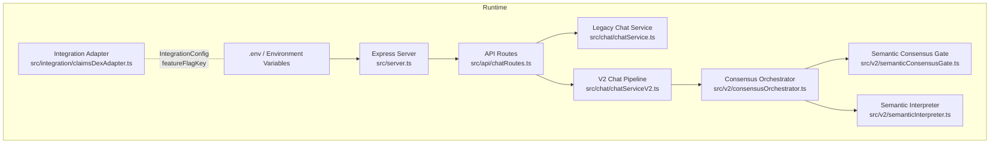
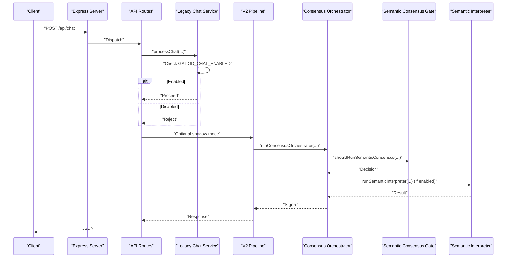
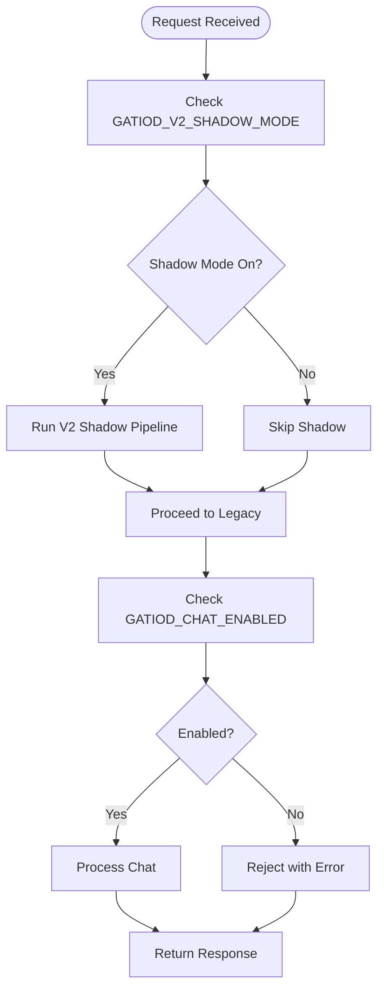
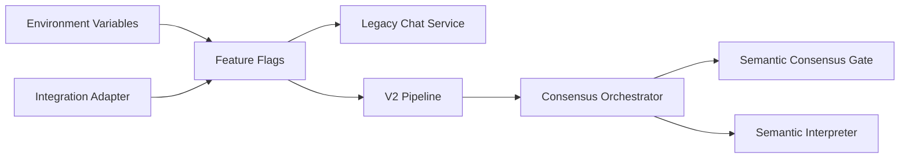

# Feature Flags and Configuration

<cite>
**Referenced Files in This Document**
- [claimsDexAdapter.ts](file://src/integration/claimsDexAdapter.ts)
- [server.ts](file://src/server.ts)
- [chatRoutes.ts](file://src/api/chatRoutes.ts)
- [chatService.ts](file://src/chat/chatService.ts)
- [chatServiceV2.ts](file://src/chat/chatServiceV2.ts)
- [consensusOrchestrator.ts](file://src/v2/consensusOrchestrator.ts)
- [semanticConsensusGate.ts](file://src/v2/semanticConsensusGate.ts)
- [semanticInterpreter.ts](file://src/v2/semanticInterpreter.ts)
- [package.json](file://package.json)
- [README.md](file://README.md)
</cite>

## Table of Contents
1. [Introduction](#introduction)
2. [Project Structure](#project-structure)
3. [Core Components](#core-components)
4. [Architecture Overview](#architecture-overview)
5. [Detailed Component Analysis](#detailed-component-analysis)
6. [Dependency Analysis](#dependency-analysis)
7. [Performance Considerations](#performance-considerations)
8. [Troubleshooting Guide](#troubleshooting-guide)
9. [Conclusion](#conclusion)
10. [Appendices](#appendices)

## Introduction
This document explains the feature flags and configuration management used to control environment-based feature gating and integration configuration. It focuses on:
- The isGatiodChatEnabled function and its role in controlling the legacy chat pipeline
- The IntegrationConfig interface and how it bridges standalone and claimsDex environments
- Transition from a standalone feature flag to a claimsDex configuration system
- Environment variable handling across the application
- Practical deployment patterns for enabling/disabling features per environment

The goal is to provide both conceptual insights for product managers and technical guidance for developers deploying and operating the system across environments.

## Project Structure
The feature flag and configuration system spans several layers:
- Application entrypoint and environment loading
- API routes that gate requests
- Legacy chat service that enforces a feature flag
- V2 pipeline with its own feature flags and semantic consensus gating
- Integration adapter that exposes a unified IntegrationConfig for claimsDex integration

**Diagram sources**
- [server.ts:1-68](file://src/server.ts#L1-L68)
- [chatRoutes.ts:1-91](file://src/api/chatRoutes.ts#L1-L91)
- [chatService.ts:38-49](file://src/chat/chatService.ts#L38-L49)
- [chatServiceV2.ts:258-332](file://src/chat/chatServiceV2.ts#L258-L332)
- [consensusOrchestrator.ts:179-332](file://src/v2/consensusOrchestrator.ts#L179-L332)
- [semanticConsensusGate.ts:206-277](file://src/v2/semanticConsensusGate.ts#L206-L277)
- [semanticInterpreter.ts:145-217](file://src/v2/semanticInterpreter.ts#L145-L217)
- [claimsDexAdapter.ts:87-104](file://src/integration/claimsDexAdapter.ts#L87-L104)

**Section sources**
- [server.ts:1-68](file://src/server.ts#L1-L68)
- [chatRoutes.ts:1-91](file://src/api/chatRoutes.ts#L1-L91)
- [claimsDexAdapter.ts:87-104](file://src/integration/claimsDexAdapter.ts#L87-L104)

## Core Components
- isGatiodChatEnabled: A runtime check that gates the legacy chat pipeline behind an environment variable. When disabled, the legacy pipeline rejects requests early.
- IntegrationConfig: A configuration object that defines adapters and a feature flag key for claimsDex integration. It separates environment-specific implementations from the core logic.
- Environment variables: Used pervasively to control feature flags, API keys, and operational modes.

Key responsibilities:
- Feature gating: Control availability of chat features per environment
- Integration bridging: Provide a clean interface for claimsDex to supply its own implementations
- Operational safety: Prevent unintended feature activation in CI or staging

**Section sources**
- [claimsDexAdapter.ts:87-104](file://src/integration/claimsDexAdapter.ts#L87-L104)
- [chatService.ts:38-49](file://src/chat/chatService.ts#L38-L49)
- [consensusOrchestrator.ts:99-109](file://src/v2/consensusOrchestrator.ts#L99-L109)
- [semanticConsensusGate.ts:39-43](file://src/v2/semanticConsensusGate.ts#L39-L43)
- [semanticInterpreter.ts:78-82](file://src/v2/semanticInterpreter.ts#L78-L82)

## Architecture Overview
The feature flag architecture separates concerns across layers:
- Environment layer: Defines feature flags and secrets
- API layer: Enforces feature gating for legacy chat and optionally mirrors traffic to V2
- Legacy chat layer: Checks a feature flag before processing
- V2 layer: Uses two feature flags (consensus and interpreter) to gate advanced behavior
- Integration layer: Exposes IntegrationConfig to allow claimsDex to override adapters and feature flag keys

**Diagram sources**
- [chatRoutes.ts:29-33](file://src/api/chatRoutes.ts#L29-L33)
- [chatService.ts:47-49](file://src/chat/chatService.ts#L47-L49)
- [consensusOrchestrator.ts:179-332](file://src/v2/consensusOrchestrator.ts#L179-L332)
- [semanticConsensusGate.ts:206-277](file://src/v2/semanticConsensusGate.ts#L206-L277)
- [semanticInterpreter.ts:145-217](file://src/v2/semanticInterpreter.ts#L145-L217)

## Detailed Component Analysis

### isGatiodChatEnabled
Purpose:
- Provides a single-source-of-truth check for enabling/disabling the legacy chat pipeline
- Defaults to enabled unless explicitly disabled

Behavior:
- Reads the GATIOD_CHAT_ENABLED environment variable
- Treats any value other than the literal "false" as enabled
- Used in the legacy chat service to reject requests when disabled

Operational implications:
- Safe default: feature remains on unless explicitly opted out
- Easy to toggle per environment via CI/CD or container environment
- Prevents accidental exposure in environments where the feature should be off

**Section sources**
- [claimsDexAdapter.ts:87-89](file://src/integration/claimsDexAdapter.ts#L87-L89)
- [chatService.ts:47-49](file://src/chat/chatService.ts#L47-L49)

### IntegrationConfig Interface and ClaimsDex Transition
Purpose:
- Define a clean contract for environment-specific integrations
- Allow claimsDex to override adapters and feature flag keys without changing core logic

Structure:
- auth: Authentication adapter (claimsDex supplies Firebase middleware; standalone uses no-op)
- mrExport: Medical report export adapter (claimsDex supplies TrustVC PDF; standalone uses markdown)
- featureFlagKey: The configuration key used by claimsDex to manage the feature flag

Standalone vs claimsDex:
- standaloneConfig sets featureFlagKey to GATIOD_CHAT_ENABLED for parity with the legacy pipeline
- claimsDex integration supplies its own implementations for auth and export, and uses its own feature flag key

Benefits:
- Clean separation of concerns
- Enables gradual rollout and A/B testing via claimsDex configuration
- Reduces risk of breaking changes when swapping implementations

**Section sources**
- [claimsDexAdapter.ts:93-98](file://src/integration/claimsDexAdapter.ts#L93-L98)
- [claimsDexAdapter.ts:100-104](file://src/integration/claimsDexAdapter.ts#L100-L104)

### Environment Variable Handling Across the Application
Key variables and their roles:
- GEMINI_API_KEY: Required for the legacy chat pipeline; server warns if missing
- GATIOD_CHAT_ENABLED: Controls the legacy chat feature flag
- GATIOD_V2_SHADOW_MODE: Mirrors production traffic through the V2 pipeline for evaluation
- GATIOD_DEBUG_RESPONSES: Controls response verbosity in V2
- SEMANTIC_CONSENSUS_ENABLED: Enables the semantic consensus gate in V2
- SEMANTIC_INTERPRETER_ENABLED: Enables the semantic interpreter in V2
- SEMANTIC_INTERPRETER_MODEL: Selects the model for the semantic interpreter

Loading and usage:
- dotenv loads .env files at startup
- Variables are read directly in modules where needed
- Scripts demonstrate how to set variables for test scenarios

Practical guidance:
- Set variables per environment (local, staging, prod)
- Use CI/CD to inject secrets and feature flags
- Prefer explicit opt-out ("false") for disabling features

**Section sources**
- [server.ts:52-54](file://src/server.ts#L52-L54)
- [chatRoutes.ts:29-32](file://src/api/chatRoutes.ts#L29-L32)
- [chatRoutes.ts:56](file://src/api/chatRoutes.ts#L56)
- [consensusOrchestrator.ts:99-109](file://src/v2/consensusOrchestrator.ts#L99-L109)
- [semanticInterpreter.ts:78-82](file://src/v2/semanticInterpreter.ts#L78-L82)
- [semanticInterpreter.ts:84-86](file://src/v2/semanticInterpreter.ts#L84-L86)
- [package.json:6-20](file://package.json#L6-L20)

### Feature Flag Management Patterns
Patterns demonstrated in the codebase:
- Single-source-of-truth checks (isGatiodChatEnabled)
- Dual-feature gating (consensus + interpreter) in V2
- Shadow mode for controlled experimentation
- Test overrides for feature flags

Recommended practices:
- Use environment variables for all feature flags
- Default to conservative defaults (opt-out rather than opt-in)
- Document feature flag keys and their meanings
- Use shadow mode for gradual rollouts

**Section sources**
- [claimsDexAdapter.ts:87-89](file://src/integration/claimsDexAdapter.ts#L87-L89)
- [consensusOrchestrator.ts:160-169](file://src/v2/consensusOrchestrator.ts#L160-L169)
- [chatRoutes.ts:29-33](file://src/api/chatRoutes.ts#L29-L33)

### API Flow Through Feature Gates
The API routes act as the first line of defense:
- Legacy chat: Enforced by GATIOD_CHAT_ENABLED
- V2 shadow mode: Controlled by GATIOD_V2_SHADOW_MODE
- Debug mode: Controlled by GATIOD_DEBUG_RESPONSES

**Diagram sources**
- [chatRoutes.ts:29-33](file://src/api/chatRoutes.ts#L29-L33)
- [chatRoutes.ts:56-59](file://src/api/chatRoutes.ts#L56-L59)
- [chatService.ts:47-49](file://src/chat/chatService.ts#L47-L49)

**Section sources**
- [chatRoutes.ts:14-66](file://src/api/chatRoutes.ts#L14-L66)
- [chatService.ts:38-49](file://src/chat/chatService.ts#L38-L49)

### V2 Feature Flags and Semantic Consensus Gate
The V2 pipeline introduces a more sophisticated gating mechanism:
- SEMANTIC_CONSENSUS_ENABLED: Gate activation
- SEMANTIC_INTERPRETER_ENABLED: LLM activation
- shouldRunSemanticConsensus: Deterministic gate that decides when to engage the interpreter

Decision logic:
- If consensus flag is off → passthrough
- If interpreter flag is off → passthrough
- Otherwise, run the gate and interpreter when triggers fire

This ensures that advanced behavior is only active when both flags are on, preventing regressions in CI and staging.

**Section sources**
- [consensusOrchestrator.ts:160-169](file://src/v2/consensusOrchestrator.ts#L160-L169)
- [semanticConsensusGate.ts:206-277](file://src/v2/semanticConsensusGate.ts#L206-L277)
- [semanticInterpreter.ts:145-155](file://src/v2/semanticInterpreter.ts#L145-L155)

## Dependency Analysis
The feature flag system depends on:
- Environment variables for configuration
- API routes to enforce gating
- Legacy and V2 chat services for feature logic
- Integration adapter for environment-specific implementations

**Diagram sources**
- [claimsDexAdapter.ts:87-104](file://src/integration/claimsDexAdapter.ts#L87-L104)
- [chatService.ts:47-49](file://src/chat/chatService.ts#L47-L49)
- [consensusOrchestrator.ts:179-332](file://src/v2/consensusOrchestrator.ts#L179-L332)
- [semanticConsensusGate.ts:206-277](file://src/v2/semanticConsensusGate.ts#L206-L277)
- [semanticInterpreter.ts:145-217](file://src/v2/semanticInterpreter.ts#L145-L217)

**Section sources**
- [claimsDexAdapter.ts:87-104](file://src/integration/claimsDexAdapter.ts#L87-L104)
- [chatService.ts:47-49](file://src/chat/chatService.ts#L47-L49)
- [consensusOrchestrator.ts:179-332](file://src/v2/consensusOrchestrator.ts#L179-L332)

## Performance Considerations
- Feature gates are lightweight checks that avoid network calls or heavy computation
- Shadow mode in V2 adds overhead; use sparingly and only in non-production environments
- Keep feature flags minimal and explicit to reduce branching complexity
- Consider caching feature flag decisions at the process level if frequently accessed

## Troubleshooting Guide
Common issues and resolutions:
- Legacy chat disabled: Ensure GATIOD_CHAT_ENABLED is not set to "false"
- Missing API key: The server warns if GEMINI_API_KEY is not set; provide a valid key
- V2 not activating: Verify both SEMANTIC_CONSENSUS_ENABLED and SEMANTIC_INTERPRETER_ENABLED are set to "true"
- Shadow mode unexpected: Confirm GATIOD_V2_SHADOW_MODE is set appropriately
- Integration not picking up claimsDex settings: Verify the IntegrationConfig featureFlagKey aligns with claimsDex configuration

**Section sources**
- [server.ts:52-54](file://src/server.ts#L52-L54)
- [chatService.ts:47-49](file://src/chat/chatService.ts#L47-L49)
- [consensusOrchestrator.ts:99-109](file://src/v2/consensusOrchestrator.ts#L99-L109)
- [chatRoutes.ts:29-33](file://src/api/chatRoutes.ts#L29-L33)

## Conclusion
The feature flag and configuration system provides a robust, environment-aware mechanism to control feature availability and integration behavior. By centralizing checks in isGatiodChatEnabled and IntegrationConfig, and by leveraging environment variables across the stack, the system supports safe, incremental rollouts and seamless integration with claimsDex. Adopting the recommended patterns ensures predictable behavior, easier debugging, and smoother deployments.

## Appendices

### Practical Examples

- Enable legacy chat in development:
  - Set GATIOD_CHAT_ENABLED to any value other than "false"
  - Start the server with dotenv support

- Enable V2 semantic consensus:
  - Set SEMANTIC_CONSENSUS_ENABLED="true"
  - Set SEMANTIC_INTERPRETER_ENABLED="true"
  - Optionally set SEMANTIC_INTERPRETER_MODEL to a specific model ID

- Run shadow mode for evaluation:
  - Set GATIOD_V2_SHADOW_MODE="true"
  - Observe mirrored V2 responses without affecting production behavior

- Configure claimsDex integration:
  - Provide an IntegrationConfig with featureFlagKey aligned to claimsDex
  - Supply claimsDex implementations for auth and export adapters

**Section sources**
- [claimsDexAdapter.ts:87-104](file://src/integration/claimsDexAdapter.ts#L87-L104)
- [server.ts:52-54](file://src/server.ts#L52-L54)
- [chatRoutes.ts:29-33](file://src/api/chatRoutes.ts#L29-L33)
- [consensusOrchestrator.ts:99-109](file://src/v2/consensusOrchestrator.ts#L99-L109)
- [semanticInterpreter.ts:78-82](file://src/v2/semanticInterpreter.ts#L78-L82)
- [README.md:17-24](file://README.md#L17-L24)