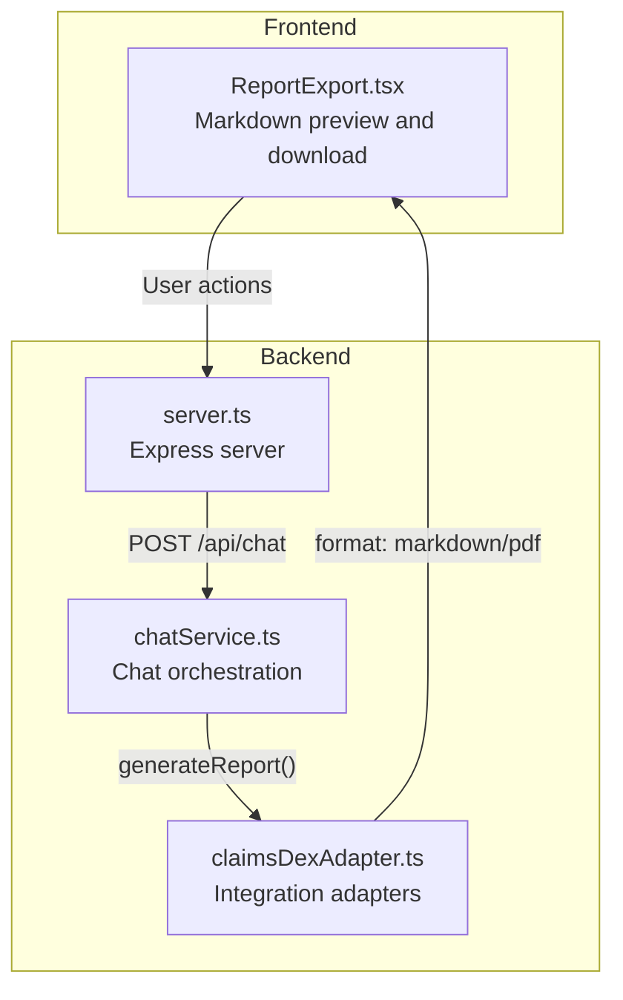
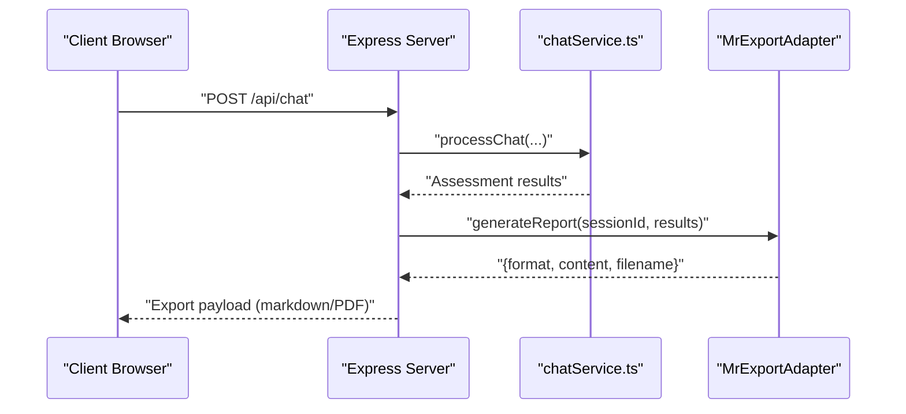
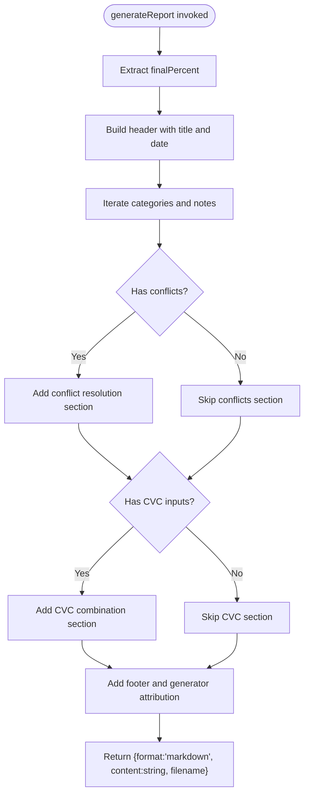
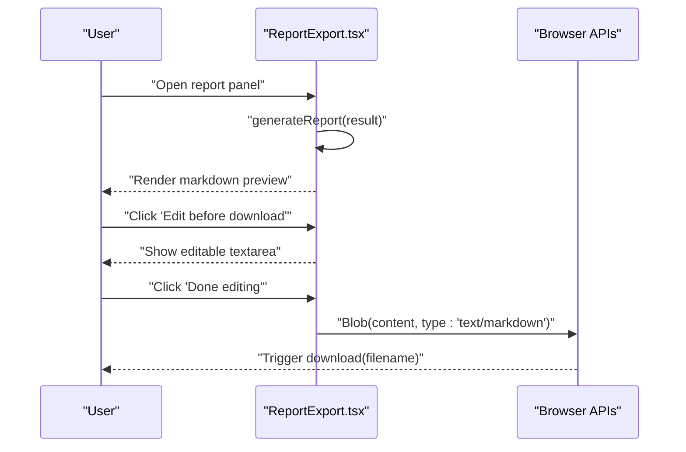
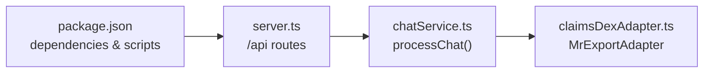

# Medical Report Export

<cite>
**Referenced Files in This Document**
- [claimsDexAdapter.ts](file://src/integration/claimsDexAdapter.ts)
- [ReportExport.tsx](file://web/src/components/ReportExport.tsx)
- [chatService.ts](file://src/chat/chatService.ts)
- [server.ts](file://src/server.ts)
- [package.json](file://package.json)
</cite>

## Table of Contents
1. [Introduction](#introduction)
2. [Project Structure](#project-structure)
3. [Core Components](#core-components)
4. [Architecture Overview](#architecture-overview)
5. [Detailed Component Analysis](#detailed-component-analysis)
6. [Dependency Analysis](#dependency-analysis)
7. [Performance Considerations](#performance-considerations)
8. [Troubleshooting Guide](#troubleshooting-guide)
9. [Conclusion](#conclusion)

## Introduction
This document explains the medical report export system that powers automated report generation and export for the GATIOD assessment assistant. It covers:
- The MrExportAdapter interface contract for generating reports
- The standalone markdown export implementation
- The integration pathway for claimsDex DMR pipeline and TrustVC PDF generation
- Practical guidance for healthcare administrators and developers

The system supports two export formats:
- Markdown (.md) for lightweight, human-readable reports
- PDF for formal documentation and regulatory compliance

## Project Structure
The export capability spans backend integration interfaces and a frontend component for user-facing markdown export. The server exposes the chat API and integrates with the export adapter through the claimsDex adapter abstraction.



**Diagram sources**
- [server.ts:1-68](file://src/server.ts#L1-L68)
- [chatService.ts:38-154](file://src/chat/chatService.ts#L38-L154)
- [claimsDexAdapter.ts:56-83](file://src/integration/claimsDexAdapter.ts#L56-L83)
- [ReportExport.tsx:64-142](file://web/src/components/ReportExport.tsx#L64-L142)

**Section sources**
- [server.ts:19-37](file://src/server.ts#L19-L37)
- [claimsDexAdapter.ts:53-104](file://src/integration/claimsDexAdapter.ts#L53-L104)
- [ReportExport.tsx:64-142](file://web/src/components/ReportExport.tsx#L64-L142)

## Core Components
- MrExportAdapter: Defines the contract for generating medical reports from assessment results. It returns format, content, and filename, enabling both markdown and PDF outputs.
- standaloneMrExport: Provides a basic markdown export implementation for standalone mode.
- ReportExport component: Generates and previews markdown locally in the browser, allowing users to edit before downloading.

Key responsibilities:
- Format handling: Supports "markdown" and "pdf" formats
- Content encoding: Returns string for markdown and Buffer for PDF
- Filename generation: Includes date-based naming for traceability

**Section sources**
- [claimsDexAdapter.ts:56-83](file://src/integration/claimsDexAdapter.ts#L56-L83)
- [ReportExport.tsx:13-62](file://web/src/components/ReportExport.tsx#L13-L62)

## Architecture Overview
The export architecture separates concerns between the frontend (local markdown generation) and backend (claimsDex integration). The backend uses the claimsDex adapter to plug in either the standalone markdown exporter or the production DMR pipeline with TrustVC PDF generation.



**Diagram sources**
- [server.ts:19-23](file://src/server.ts#L19-L23)
- [chatService.ts:38-154](file://src/chat/chatService.ts#L38-L154)
- [claimsDexAdapter.ts:56-83](file://src/integration/claimsDexAdapter.ts#L56-L83)

## Detailed Component Analysis

### MrExportAdapter Interface
The interface defines a single method to generate a report from assessment results. It standardizes:
- Input: sessionId and results object
- Output: format ("markdown" | "pdf"), content (string or Buffer), filename

This contract enables pluggable implementations for different environments:
- Standalone: markdown export
- Production (claimsDex): DMR pipeline with TrustVC PDF

```mermaid
classDiagram
class MrExportAdapter {
+generateReport(sessionId, results) Promise~{format, content, filename}~
}
class standaloneMrExport {
+generateReport(sessionId, results) Promise~{format, content, filename}~
}
MrExportAdapter <|.. standaloneMrExport : "implements"
```

**Diagram sources**
- [claimsDexAdapter.ts:56-83](file://src/integration/claimsDexAdapter.ts#L56-L83)

**Section sources**
- [claimsDexAdapter.ts:56-63](file://src/integration/claimsDexAdapter.ts#L56-L63)

### Standalone Markdown Export Implementation
The standalone implementation creates a concise markdown report from the assessment results. It includes:
- Header with report title
- Date and final PI percentage
- Category breakdowns (amputation, ROM, neurological, DBE)
- Conflict resolution notes
- CVC combination details
- Footer with generator attribution

Format handling:
- format: "markdown"
- content: string
- filename: date-based .md



**Diagram sources**
- [claimsDexAdapter.ts:65-83](file://src/integration/claimsDexAdapter.ts#L65-L83)

**Section sources**
- [claimsDexAdapter.ts:65-83](file://src/integration/claimsDexAdapter.ts#L65-L83)

### Frontend Markdown Preview and Download
The ReportExport component generates a markdown preview from the same data structure used by the backend. Users can:
- View formatted markdown in a monospace preview area
- Edit the markdown before downloading
- Download the edited or original markdown as a .md file



**Diagram sources**
- [ReportExport.tsx:13-62](file://web/src/components/ReportExport.tsx#L13-L62)
- [ReportExport.tsx:70-78](file://web/src/components/ReportExport.tsx#L70-L78)

**Section sources**
- [ReportExport.tsx:64-142](file://web/src/components/ReportExport.tsx#L64-L142)

### Integration with claimsDex DMR Pipeline and TrustVC PDF
The claimsDex adapter documents that in production, the MrExportAdapter is replaced with the claimsDex DMR pipeline integrated with TrustVC for PDF generation. This enables:
- Automated, compliant PDF report generation
- Centralized export orchestration
- Audit-ready export records

Integration configuration:
- IntegrationConfig includes the mrExport adapter and a feature flag key
- The standalone configuration demonstrates the expected shape for local development

**Section sources**
- [claimsDexAdapter.ts:53-55](file://src/integration/claimsDexAdapter.ts#L53-L55)
- [claimsDexAdapter.ts:93-104](file://src/integration/claimsDexAdapter.ts#L93-L104)

## Dependency Analysis
The export system relies on:
- Environment configuration for API keys and feature flags
- Express server routing for chat and health endpoints
- Frontend component for local markdown generation and download



**Diagram sources**
- [package.json:21-29](file://package.json#L21-L29)
- [server.ts:19-23](file://src/server.ts#L19-L23)
- [chatService.ts:46-49](file://src/chat/chatService.ts#L46-L49)

**Section sources**
- [package.json:1-45](file://package.json#L1-L45)
- [server.ts:19-28](file://src/server.ts#L19-L28)
- [chatService.ts:46-49](file://src/chat/chatService.ts#L46-L49)

## Performance Considerations
- Local markdown generation in the browser minimizes server load for preview and download.
- PDF generation in production should be offloaded to the claimsDex pipeline to avoid blocking the main thread.
- Keep export content sizes reasonable; large assessments may benefit from pagination or modular sections.

## Troubleshooting Guide
Common issues and resolutions:
- Missing GEMINI_API_KEY: The chat service throws an error if the environment variable is not set. Ensure the key is configured before starting the server.
- Feature flag disabled: If GATIOD_CHAT_ENABLED is set to false, chat processing is blocked. Adjust the environment variable to enable the feature.
- Export format mismatch: Verify that the export adapter returns the correct format ("markdown" or "pdf") and appropriate content type (string or Buffer).
- Filename collisions: The standalone implementation uses date-based filenames. In production, ensure the DMR pipeline assigns unique filenames.

**Section sources**
- [chatService.ts:43-49](file://src/chat/chatService.ts#L43-L49)
- [claimsDexAdapter.ts:87-89](file://src/integration/claimsDexAdapter.ts#L87-L89)

## Conclusion
The medical report export system provides a flexible, standards-aligned foundation for generating both markdown and PDF reports. The MrExportAdapter interface cleanly separates concerns between local preview and production export, enabling seamless integration with claimsDex DMR and TrustVC. Healthcare administrators can leverage automated exports to improve documentation workflows, while developers can extend or replace implementations to meet organizational requirements.